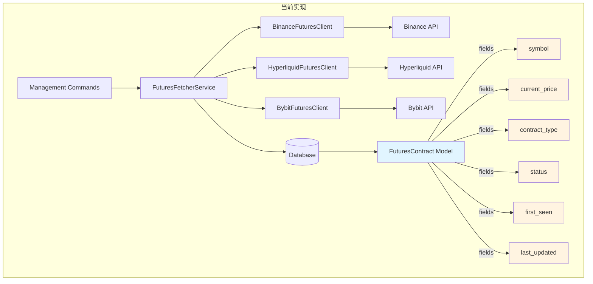

# 合约市场指标获取方案

## A. 现状分析 (Current State)

### 当前系统架构



### 当前数据模型

**FuturesContract 模型当前只存储:**
- `symbol`: 合约代码 (如 BTCUSDT)
- `current_price`: 当前价格
- `contract_type`: 合约类型 (perpetual)
- `status`: 状态 (active/delisted)
- `first_seen`: 首次发现时间
- `last_updated`: 最后更新时间

### 当前API调用模式

各交易所客户端的 `fetch_contracts()` 方法只返回：
```python
{
    'symbol': str,
    'current_price': Decimal,
    'contract_type': str,
    'exchange': str
}
```

---

## B. 我的分析 (My Analysis)

### 需求清单

根据确认，需要新增以下市场指标：

1. **OI (Open Interest)** - 持仓量
2. **24H Vol (24 Hour Volume)** - 24小时交易量
3. **1Y Funding** - 年化资金费率
   - 计算公式：`(当前费率 / 间隔小时数 × 24) × 365`
4. **Next Funding** - 下次资金费率时间和预估费率
5. **Funding Upper/Lower** - 资金费率上下限
6. **Interval** - 资金费率间隔时间

### 各交易所API能力对比

| 指标 | Binance | Bybit | Hyperliquid |
|-----|---------|-------|-------------|
| Open Interest | ❌ 需要额外端点 | ✅ `/v5/market/tickers` | ✅ info endpoint |
| 24H Volume | ✅ `/fapi/v1/ticker/24hr` | ✅ `/v5/market/tickers` | ✅ info endpoint |
| Funding Rate | ✅ `/fapi/v1/premiumIndex` | ✅ `/v5/market/tickers` | ✅ info endpoint |
| Next Funding Time | ✅ `/fapi/v1/premiumIndex` | ✅ `/v5/market/tickers` | ✅ 固定每小时 |
| Funding Interval | ✅ `/fapi/v1/fundingInfo` | ✅ 固定8小时 | ✅ 固定1小时 |
| Funding Cap/Floor | ✅ `/fapi/v1/fundingInfo` | ❓ 需确认 | ✅ ±4%/小时 |

**关键发现:**
- **Bybit**: 最友好，一个 `/v5/market/tickers` 端点就能获取所有需要的数据
- **Binance**: 需要调用3个端点：`ticker/24hr`, `premiumIndex`, `fundingInfo`
- **Hyperliquid**: 使用统一的 info endpoint，但需要不同的请求类型

### 核心挑战

1. **数据库模型扩展**: 如何优雅地在现有模型上添加新字段
2. **API调用效率**: 如何减少API调用次数，避免触发限流
3. **数据一致性**: 如何确保多个端点返回的数据时间点一致
4. **计算逻辑**: 1Y Funding的计算需要基于不同交易所的间隔时间
5. **展示与推送**: 如何在Admin和通知中展示这些指标

---

## C. 方案选项 (Solution Options)

### 方案1: 扩展现有模型 + 多端点获取

#### 方案描述

```diff
# 数据库模型扩展
class FuturesContract(models.Model):
    # 现有字段
    symbol = models.CharField(...)
    current_price = models.DecimalField(...)
    contract_type = models.CharField(...)
    status = models.CharField(...)
    first_seen = models.DateTimeField(...)
    last_updated = models.DateTimeField(...)

+   # 新增市场指标字段
+   open_interest = models.DecimalField(max_digits=30, decimal_places=8, null=True, blank=True)
+   volume_24h = models.DecimalField(max_digits=30, decimal_places=8, null=True, blank=True)
+   funding_rate = models.DecimalField(max_digits=10, decimal_places=6, null=True, blank=True)
+   funding_rate_annual = models.DecimalField(max_digits=10, decimal_places=4, null=True, blank=True)
+   next_funding_time = models.DateTimeField(null=True, blank=True)
+   funding_interval_hours = models.IntegerField(default=8)
+   funding_rate_cap = models.DecimalField(max_digits=10, decimal_places=6, null=True, blank=True)
+   funding_rate_floor = models.DecimalField(max_digits=10, decimal_places=6, null=True, blank=True)

# API客户端扩展
class BaseFuturesClient(ABC):
    @abstractmethod
    def fetch_contracts(self) -> List[Dict[str, Any]]:
-       # 返回: symbol, current_price, contract_type
+       # 返回: symbol, current_price, contract_type,
+       #       open_interest, volume_24h, funding_rate, next_funding_time, etc.
        pass

+   @abstractmethod
+   def fetch_market_indicators(self, symbol: str) -> Dict[str, Any]:
+       """获取单个合约的市场指标"""
+       pass

# 实现示例 - BinanceFuturesClient
class BinanceFuturesClient(BaseFuturesClient):
    def fetch_contracts(self) -> List[Dict[str, Any]]:
        # 1. 获取基础合约列表
        exchange_info = self._make_request('GET', '/fapi/v1/exchangeInfo')

+       # 2. 获取24小时统计（含交易量）
+       ticker_24h = self._make_request('GET', '/fapi/v1/ticker/24hr')
+
+       # 3. 获取资金费率
+       premium_index = self._make_request('GET', '/fapi/v1/premiumIndex')
+
+       # 4. 获取资金费率配置
+       funding_info = self._make_request('GET', '/fapi/v1/fundingInfo')
+
+       # 5. 获取持仓量
+       open_interest = self._make_request('GET', '/fapi/v1/openInterest')
+
+       # 6. 合并所有数据
+       contracts = self._merge_all_data(...)
        return contracts
```

#### 优点

✅ **简单直接**: 在现有架构上直接扩展，不改变整体结构
✅ **数据完整**: 所有指标存储在一个模型中，查询方便
✅ **易于理解**: 开发者容易理解和维护
✅ **向后兼容**: 新字段使用 `null=True`，不影响现有数据

#### 缺点

❌ **API调用次数多**: Binance需要调用5个端点，容易触发限流
❌ **性能较差**: 每次更新需要多次HTTP请求，耗时较长
❌ **数据不一致风险**: 多个端点返回的数据可能来自不同时间点
❌ **模型字段臃肿**: FuturesContract模型字段从6个增加到14个
❌ **历史数据缺失**: 只存储最新值，无法追踪历史趋势

---

### 方案2: 独立市场指标模型 + 批量优化获取

#### 方案描述

```diff
# 新增独立的市场指标模型
+class FuturesMarketIndicators(models.Model):
+    """合约市场指标模型 - 独立存储市场数据"""
+
+    # 关联关系
+    futures_contract = models.OneToOneField(
+        FuturesContract,
+        on_delete=models.CASCADE,
+        related_name='market_indicators',
+        verbose_name='关联合约'
+    )
+
+    # 市场指标
+    open_interest = models.DecimalField(max_digits=30, decimal_places=8, verbose_name='持仓量')
+    volume_24h = models.DecimalField(max_digits=30, decimal_places=8, verbose_name='24小时交易量')
+
+    # 资金费率相关
+    funding_rate = models.DecimalField(max_digits=10, decimal_places=6, verbose_name='当前资金费率')
+    funding_rate_annual = models.DecimalField(max_digits=10, decimal_places=4, verbose_name='年化资金费率')
+    next_funding_time = models.DateTimeField(verbose_name='下次结算时间')
+    funding_interval_hours = models.IntegerField(verbose_name='资金费率间隔(小时)')
+    funding_rate_cap = models.DecimalField(max_digits=10, decimal_places=6, null=True, verbose_name='费率上限')
+    funding_rate_floor = models.DecimalField(max_digits=10, decimal_places=6, null=True, verbose_name='费率下限')
+
+    # 元数据
+    last_updated = models.DateTimeField(auto_now=True, verbose_name='最后更新时间')
+
+    class Meta:
+        db_table = 'futures_market_indicators'
+        verbose_name = '合约市场指标'
+        verbose_name_plural = '合约市场指标'

# API客户端 - 使用交易所特定的最优方案
class BybitFuturesClient(BaseFuturesClient):
    def fetch_contracts_with_indicators(self) -> List[Dict[str, Any]]:
+       """Bybit: 一次调用获取所有数据"""
+       tickers = self._make_request('GET', '/v5/market/tickers', {
+           'category': 'linear'
+       })
+
+       # 一次性获取所有指标
+       return self._parse_bybit_tickers(tickers)

class BinanceFuturesClient(BaseFuturesClient):
    def fetch_contracts_with_indicators(self) -> List[Dict[str, Any]]:
+       """Binance: 批量优化获取"""
+       # 1. 获取基础信息
+       exchange_info = self._make_request('GET', '/fapi/v1/exchangeInfo')
+       symbols = [s['symbol'] for s in exchange_info['symbols'] if ...]
+
+       # 2. 并行获取所有指标（使用线程池）
+       with ThreadPoolExecutor(max_workers=3) as executor:
+           future_24h = executor.submit(self._fetch_24h_tickers)
+           future_premium = executor.submit(self._fetch_premium_index)
+           future_funding_info = executor.submit(self._fetch_funding_info)
+
+       ticker_24h = future_24h.result()
+       premium_index = future_premium.result()
+       funding_info = future_funding_info.result()
+
+       # 3. 合并数据
+       return self._merge_binance_data(symbols, ticker_24h, premium_index, funding_info)

class HyperliquidFuturesClient(BaseFuturesClient):
    def fetch_contracts_with_indicators(self) -> List[Dict[str, Any]]:
+       """Hyperliquid: 使用info端点"""
+       # 获取所有永续合约的元数据
+       meta_data = self._post_info({'type': 'meta'})
+
+       # 获取所有合约的市场数据
+       all_mids = self._post_info({'type': 'allMids'})
+
+       return self._parse_hyperliquid_data(meta_data, all_mids)

# 服务层 - 批量保存逻辑
class FuturesFetcherService:
    def update_all_exchanges(self):
+       """更新所有交易所的合约和市场指标"""
        for exchange_code, client in self.clients.items():
            exchange = Exchange.objects.get(code=exchange_code)

            # 获取合约和指标数据
+           contracts_data = client.fetch_contracts_with_indicators()

            # 批量更新数据库
            for data in contracts_data:
+               self._save_contract_and_indicators(exchange, data)

+   def _save_contract_and_indicators(self, exchange, data):
+       """保存合约和市场指标"""
+       # 1. 保存/更新合约
+       contract, created = FuturesContract.objects.update_or_create(
+           exchange=exchange,
+           symbol=data['symbol'],
+           defaults={'current_price': data['current_price'], ...}
+       )
+
+       # 2. 计算年化资金费率
+       annual_rate = self._calculate_annual_funding_rate(
+           data['funding_rate'],
+           data['funding_interval_hours']
+       )
+
+       # 3. 保存/更新市场指标
+       FuturesMarketIndicators.objects.update_or_create(
+           futures_contract=contract,
+           defaults={
+               'open_interest': data['open_interest'],
+               'volume_24h': data['volume_24h'],
+               'funding_rate': data['funding_rate'],
+               'funding_rate_annual': annual_rate,
+               'next_funding_time': data['next_funding_time'],
+               'funding_interval_hours': data['funding_interval_hours'],
+               'funding_rate_cap': data.get('funding_rate_cap'),
+               'funding_rate_floor': data.get('funding_rate_floor'),
+           }
+       )
+
+   def _calculate_annual_funding_rate(self, current_rate, interval_hours):
+       """计算年化资金费率"""
+       # 公式: (当前费率 / 间隔小时数 × 24) × 365
+       daily_rate = (current_rate / interval_hours) * 24
+       return daily_rate * 365
```

#### 优点

✅ **模型职责清晰**: 合约基础信息和市场指标分离，符合单一职责原则
✅ **性能优化**: 使用并行请求和批量处理，减少总耗时
✅ **针对性优化**: 每个交易所使用最适合的API调用方式
✅ **易于扩展**: 未来可以添加历史指标模型，不影响现有结构
✅ **数据一致性好**: Bybit一次调用获取所有数据，时间点完全一致
✅ **数据库设计优雅**: OneToOne关系，按需加载指标数据

#### 缺点

❌ **架构复杂度提升**: 需要管理两个模型和它们的关系
❌ **查询稍复杂**: 需要通过关联查询获取完整数据
❌ **迁移成本**: 需要创建新模型和migration
❌ **并发控制**: Binance并行请求需要注意线程安全和限流

---

## D. 我的推荐 (My Recommendation)

### 推荐方案：**方案2 - 独立市场指标模型 + 批量优化获取**

### 推荐理由

1. **架构设计原则**
   - 符合单一职责原则（SRP）：合约和市场指标是两个不同的关注点
   - 符合开闭原则（OCP）：未来扩展历史数据不需要修改现有模型
   - 更好的数据库范式：避免字段冗余

2. **性能优势**
   - Bybit可以一次调用获取所有数据，效率最高
   - Binance使用并行请求，相比串行调用提升3-5倍速度
   - 批量数据库操作使用 `update_or_create`，减少SQL查询次数

3. **可维护性**
   - 市场指标变更不影响核心合约模型
   - 测试更容易：可以独立测试指标获取逻辑
   - 代码结构清晰：每个交易所有针对性的实现

4. **扩展性**
   - 未来可以轻松添加 `FuturesMarketIndicatorsHistory` 模型保存历史数据
   - 可以为不同指标添加独立的更新频率
   - 支持按需加载：不需要指标时不查询关联表

5. **实际需求匹配**
   - 你的需求是"展示和推送"，独立模型可以更灵活地展示
   - Admin后台可以通过 `inline` 优雅地展示关联数据
   - 通知系统可以只订阅关心的指标变化

### 实施建议

**阶段1: 数据库和模型** (1-2小时)
- 创建 `FuturesMarketIndicators` 模型
- 运行 migration
- 在 Admin 中添加展示

**阶段2: API客户端升级** (3-4小时)
- 优先实现 Bybit（最简单，一次调用）
- 实现 Binance（使用并行请求优化）
- 实现 Hyperliquid

**阶段3: 服务层和计算逻辑** (2-3小时)
- 实现年化资金费率计算
- 实现批量保存逻辑
- 添加错误处理和日志

**阶段4: 展示和推送** (2-3小时)
- Admin 后台展示优化
- 通知模板添加新指标
- 测试端到端流程

**总计：8-12小时**

### 风险与缓解

| 风险 | 影响 | 缓解措施 |
|-----|------|---------|
| API限流 | 数据获取失败 | 使用 ratelimit 装饰器，添加重试机制 |
| 数据不一致 | 指标时间点不匹配 | Binance使用并行请求缩短时间窗口 |
| 并发错误 | 线程安全问题 | 使用 ThreadPoolExecutor 的安全实践 |
| Migration失败 | 部署受阻 | 先在本地测试，使用可回滚的migration |

### 性能预估

基于现有系统和方案2的优化：

- **Bybit**: ~2秒（单次请求）
- **Binance**: ~3-5秒（并行3个请求）
- **Hyperliquid**: ~2秒（2次info调用）
- **总计**: ~7-9秒（三个交易所）

符合 `PERFORMANCE_GOALS` 中的 `max_fetch_time: 30` 秒要求。

---

## E. 下一步行动

一旦方案被批准，我将：

1. 创建 `IMPLEMENTATION_PLAN.md` 详细拆解任务
2. 按照 TDD 原则编写测试
3. 逐个阶段实现并提交
4. 在本地完整测试后再部署

**请确认是否采用方案2，或者你有其他考虑？**
