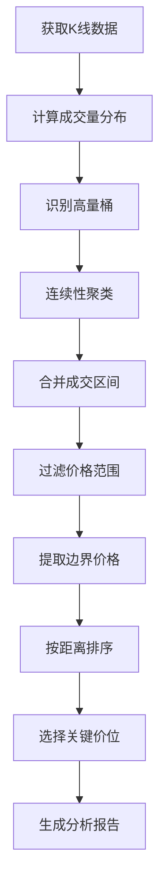

# 加密货币交易监控系统 🚀

一个功能强大的加密货币交易所监控系统，支持公告爬取、合约监控、实时通知等功能。

## 📖 目录

- [项目背景](#项目背景)
- [核心功能](#核心功能)
- [系统架构](#系统架构)
- [快速开始](#快速开始)
- [详细使用指南](#详细使用指南)
- [定时任务配置](#定时任务配置)
- [Admin后台管理](#admin后台管理)
- [常见问题](#常见问题)
- [技术栈](#技术栈)

---

## 🎯 项目背景

加密货币市场每天都有大量新币上线、合约发布等重要信息。本项目旨在帮助交易者和分析师：

1. **及时获取新币上线信息** - 监控各大交易所的公告，自动识别新币上线
2. **追踪合约市场动态** - 实时获取永续合约的价格、资金费率等关键指标
3. **自动化通知** - 发现新币或新合约时，立即推送通知
4. **数据分析** - 所有数据存储在数据库中，便于后续分析和查询

### 适用场景

- ✅ **量化交易团队** - 自动捕获新币上线机会
- ✅ **交易分析师** - 追踪合约市场指标变化
- ✅ **研究机构** - 收集交易所公告数据用于研究
- ✅ **个人投资者** - 及时了解市场动态

---

## 💡 核心功能

### 1. 公告监控系统 (Announcement Monitor)

自动爬取交易所公告，使用AI识别新币上线信息。

**支持的交易所**：
- ✅ Binance (币安)
- ✅ Bybit
- ✅ Hyperliquid
- ✅ OKX, Bitget, BingX, Kraken, Bitfinex, XT, Crypto.com, MEXC, Deepcoin, Kucoin, Upbit

**核心能力**：
- 🤖 AI智能识别新币上线公告
- 📊 自动提取币种代码（SYMBOL）
- 🎯 置信度评分（避免误报）
- 🔔 实时推送通知（支持慧诚告警推送）
- 🚫 自动去重（避免重复通知）

### 2. 合约监控系统 (Futures Monitor)

监控永续合约市场，追踪8大核心市场指标。

**支持的交易所**：
- ✅ Binance (535+ 合约)
- ✅ Bybit (557+ 合约)
- ✅ Hyperliquid (220+ 合约)

**追踪的市场指标**：
| 指标 | 说明 | 示例 |
|------|------|------|
| **持仓量** | Open Interest | $1,234,567,890 |
| **24H交易量** | 24 Hour Volume | $987,654,321 |
| **资金费率** | Current Funding Rate | 0.0100% (正) / -0.0050% (负) |
| **年化费率** | Annual Funding Rate | 10.95% |
| **下次结算时间** | Next Funding Time | 2025-11-11 16:00:00 |
| **费率上限** | Funding Rate Cap | 2.00% |
| **费率下限** | Funding Rate Floor | -2.00% |
| **费率间隔** | Funding Interval | 8 小时 |

**性能指标**：
- ⚡ **极速获取** - 1,312个合约 < 4秒
- 🔄 **实时更新** - 支持定时自动更新（推荐10分钟）
- 📈 **历史追踪** - 记录合约的首次发现和更新时间

### 3. 价格更新系统 (Price Updater)

定期更新现有合约的价格和市场指标。

**功能**：
- 🔄 批量更新所有交易所合约数据
- 📝 详细的日志记录（支持日志轮转）
- ⚙️ 支持单独更新指定交易所
- 🧪 测试模式（--dry-run）
- 🔕 静默模式（--quiet，适合cron）

### 4. 做空网格标的筛选系统 ⭐ NEW

基于币安永续合约市场的量化筛选系统，通过多维度指标分析，自动识别最适合做空网格策略的交易标的。

**核心能力**：
- 🎯 **四维指标体系** - VDR(波动率-位移比) / KER(考夫曼效率比) / OVR(持仓成交比) / CVD(累计成交量差)
- 🧠 **智能评分** - 综合权重算法，自动排序最优标的
- ⚡ **智能缓存** - K线数据本地缓存，避免重复API调用
- 💰 **市值/FDV展示** - 集成CoinGecko API，显示代币市值和全稀释估值 ✅ Feature 008
- 📊 **多种输出** - HTML静态报告 + 数据库存储 + Web动态查询

**核心指标说明**：
| 指标 | 说明 | 最优值 | 意义 |
|------|------|--------|------|
| **VDR** | Volatility-Displacement Ratio | > 10 | 价格震荡纯净度，越高越适合网格 |
| **KER** | Kaufman Efficiency Ratio | < 0.3 | 价格运动效率，越低越震荡 |
| **OVR** | Open Interest/Volume Ratio | 0.5-1.5 | 杠杆拥挤度，健康范围最优 |
| **CVD** | Cumulative Volume Delta | 有背离 | 检测买卖压力背离信号 |

**快速开始**：
```bash
# 1. 首次运行：更新市场数据和K线缓存
python manage.py update_market_data --warmup-klines --interval 4h --limit 300

# 2. 执行筛选（推荐使用简化模式）
python manage.py screen_simple

# 3. 查看结果
# - HTML静态报告：screening_reports/simple_screening_report.html
# - Web动态查询：python manage.py runserver → http://127.0.0.1:8000/screening/
```

**输出示例**：
```
Top 3 标的:
  1. ICPUSDT         综合指数=0.8234 VDR=12.5 KER=0.245 OVR=1.12 CVD=✓
  2. ZENUSDT         综合指数=0.8156 VDR=11.8 KER=0.267 OVR=0.98 CVD=✓
  3. QNTUSDT         综合指数=0.7891 VDR=10.3 KER=0.289 OVR=1.34 CVD=✗
```

**详细文档**：
- [筛选系统快速开始](docs/SCREENING_QUICKSTART.md) - **完整使用指南（推荐）**
- [推荐运行流程](docs/SCREENING_WORKFLOW.md) - **K线数据更新和筛选执行流程（最佳实践）**
- [项目架构文档](docs/PROJECT_ARCHITECTURE.md) - 系统架构和数据流
- [筛选系统规格](specs/001-short-grid-screening/spec.md) - 完整技术规格

#### 4.1 合约分析详情页 ⭐ NEW

为每个筛选出的合约提供深度分析视图，展示完整的技术指标、K线图表和交易建议。

**核心功能**：
- 📊 **6个维度数据展示** - 基本信息 / 波动率指标 / 趋势指标 / 市场数据 / 资金流分析 / 网格参数
- 📈 **交互式K线图表** - 基于Lightweight Charts 4.x，支持多周期切换(15m/1h/4h/1d)
- ⚡ **分批渲染优化** - Stage1(K线<500ms) + Stage2(EMA均线<1.5s) + Stage3(信号标记<2s)
- 🎨 **国际标准配色** - 绿涨红跌，符合TradingView习惯
- 🔍 **历史数据追溯** - 查看任意历史日期的筛选快照

**访问路径**：
```
Web界面：http://127.0.0.1:8000/grid_trading/screening/daily/
  ├─ /screening/daily/                     # 日期选择页
  ├─ /screening/daily/<date>/              # 合约列表页（如2024-12-12）
  └─ /screening/daily/<date>/<symbol>/     # 详情页（如ZENUSDT）

API端点：
  └─ /api/screening/<date>/<symbol>/klines/  # K线数据API（支持多周期）
```

**展示的指标**（20+指标）：

| 维度 | 指标 | 说明 |
|------|------|------|
| **波动率** | VDR / KER / 15m振幅累计 | 价格震荡特征和效率 |
| **趋势** | EMA99斜率 / EMA20斜率 / 高点回落 / 价格分位 | 中长期趋势和位置 |
| **市场** | 持仓量 / 24h交易量 / Vol/OI比率 / 年化资金费率 | 市场流动性和成本 |
| **资金流** | 大单净流入 / 资金流强度 / 大单主导度 | 机构和散户行为 |
| **网格参数** | 网格上下限 / 推荐网格数 / 止盈止损位 | 交易策略参数 |
| **挂单建议** | RSI(15m) / 推荐挂单价 / 触发概率 | 入场时机建议 |

**K线图表功能**：
- 📊 **多周期切换** - 15m(100根) / 1h(50根) / 4h(300根) / 1d(30根)
- 📈 **EMA均线叠加** - EMA99(蓝色) + EMA20(橙色)
- 🎯 **价格标注** - 当前价格虚线 + 网格上下限 + 止盈止损位
- 🚦 **VPA信号标记** ⭐ NEW - 4种VPA模式可视化（急刹车/金针探底/攻城锤/阳包阴）
- 📌 **规则6/7触发点** ⭐ NEW - 止盈/止损信号自动标记，详细Tooltip展示触发原因
- ⚠️ **数据不足警告** - 自动检测并提示K线数据不足情况
- 🖱️ **交互式Tooltip** - 鼠标悬停显示K线详细信息和信号详情

**使用示例**：
```bash
# 1. 确保已执行筛选（生成历史数据）
python manage.py screen_simple

# 2. 启动Web服务
python manage.py runserver

# 3. 访问详情页
浏览器打开: http://127.0.0.1:8000/grid_trading/screening/daily/
# 选择日期 → 点击合约 → 查看详情
```

**性能指标**：
- ⚡ K线图首次可见 < 500ms
- 📊 EMA均线叠加 < 1.5s
- 🎯 完整渲染完成 < 2s
- 💾 支持300根K线流畅交互

**技术规格**：
- [详情页规格文档](specs/007-contract-detail-page/spec.md)
- [实施计划](specs/007-contract-detail-page/plan.md)
- [任务清单](specs/007-contract-detail-page/tasks.md)

---

### 5. Grid Trading 网格交易系统 ⭐

智能网格交易策略,支持从经典固定网格到双向套利的多种交易模式。

**支持的策略版本**:
- ✅ **Grid V1** - 经典固定网格(简单易用)
- ✅ **Grid V2** - 动态4层网格(VP-Squeeze计算)
- ✅ **Grid V3** - 挂单系统(严格风控)
- ✅ **Grid V4** - 双向交易(多空同时运作,最新)

**Grid V4 核心特性**:
- 🔄 **双向交易**: 同时做多和做空,实现市场中性策略
- 🎯 **智能止损**: S2/R2±3%优先,兜底成交价±3%,始终有效
- 💰 **固定仓位**: S1(20%), S2(30%), R1(20%), R2(30%)
- ⏱️ **冷却期机制**: 20小时防重复开仓
- 📊 **动态网格**: 基于VP-Squeeze自动计算支撑压力位
- 📈 **Web可视化**: ECharts K线图+交易标记+实时资金曲线

**回测性能** (ETHUSDT 4h, 2025全年):
- 总收益率: **11.95%** (市场-10.8%,跑赢22个百分点)
- 年化收益: **13.13%**
- 胜率: **61.11%**
- 盈亏比: **1.74**
- 交易次数: 18次(多空双向)

### 6. 回测系统 & Web可视化播放器

完整的历史数据回测框架,支持策略验证和交易复盘。

**核心功能**:
- 📊 **ECharts K线图**: 实时渲染K线、均线、成交量
- 🎮 **播放控制**: 播放/暂停/快进/后退/跳转
- 🏷️ **交易标记**: 绿色三角形(买入)、红色菱形(卖出)、蓝色方形(止损)
- 📍 **持仓详情**: 点击K线查看完整持仓信息
- 📈 **增强指标**: 8个量化指标(胜率、夏普比率、最大回撤等)
- 💰 **资金曲线**: 实时显示账户价值变化

**API端点**:
```
GET /backtest/api/backtests/          # 所有回测列表
GET /backtest/api/backtests/<id>/    # 回测详情
GET /backtest/api/backtests/<id>/snapshots/  # 快照列表
```

**使用示例**:
```bash
# 运行Grid V4回测
python manage.py run_backtest --symbol ETHUSDT --interval 4h --strategy grid_v4 --days 335

# 启动Web播放器
python manage.py runserver 8001
# 访问: http://127.0.0.1:8001/backtest/player/
```

### 7. VP-Squeeze 四峰分析系统

基于成交量聚类算法识别关键支撑和压力位，提供交易决策参考。

**核心功能**：
- 📊 **成交量分布计算** - 将K线成交量按价格区间分配
- 🎯 **密集区间识别** - 连续性算法识别4个成交密集区
- 🎯 **关键价位提取** - 从8个边界中选出距离最近的4个
- 📈 **支撑压力分析** - 自动识别S1/S2支撑位和R1/R2压力位
- 🔔 **推送通知** - 支持自动推送分析结果

**算法特性**：
- 使用4小时K线数据（更稳定）
- 距离优先算法（S1和R1可来自同一区间）
- 价格范围过滤（±15%，可配置）
- 成交量加权计算

**支持的周期**：
- ✅ 15分钟（短线）
- ✅ 1小时（中短线）
- **✅ 4小时（推荐，最稳定）**
- ✅ 1日（长线）

**使用示例**：
```bash
# 独立分析脚本
python example_four_peaks.py --symbol eth --interval 4h

# 推送通知脚本
python push_four_peaks_notification.py --symbol eth --interval 4h --price-range 0.15

# 自定义范围（10%）
python push_four_peaks_notification.py --symbol btc --interval 1h --price-range 0.10
```

**推送标题格式**：
```
📊 ETH $2812.03 - 支撑 $2789.53(-0.8%) $2750.17(-2.2%) - 压力 $2842.96(+1.1%) (2025-11-24 22:52)
```

**核心算法流程**：


---

## 🏗️ 系统架构

### 整体架构

```
┌─────────────────────────────────────────────────────────────────┐
│                        用户交互层                                 │
│  ┌──────────────┐  ┌──────────────┐  ┌──────────────┐          │
│  │ Django Admin │  │ 命令行工具    │  │  定时任务     │          │
│  └──────────────┘  └──────────────┘  └──────────────┘          │
└─────────────────────────────────────────────────────────────────┘
                              ↓
┌─────────────────────────────────────────────────────────────────┐
│                       业务逻辑层                                  │
│  ┌─────────────┐  ┌─────────────┐  ┌─────────────┐             │
│  │ 公告监控     │  │ 合约监控     │  │ 价格更新     │             │
│  │ monitor     │  │monitor_futures│ │update_prices │             │
│  └─────────────┘  └─────────────┘  └─────────────┘             │
└─────────────────────────────────────────────────────────────────┘
                              ↓
┌─────────────────────────────────────────────────────────────────┐
│                       服务层                                      │
│  ┌──────────────┐  ┌───────────────┐  ┌──────────────┐         │
│  │ 爬虫服务      │  │ API客户端      │  │ 通知服务      │         │
│  │ (Scrapy)     │  │ (REST)        │  │ (Alert Push)  │         │
│  └──────────────┘  └───────────────┘  └──────────────┘         │
└─────────────────────────────────────────────────────────────────┘
                              ↓
┌─────────────────────────────────────────────────────────────────┐
│                       数据层                                      │
│  ┌──────────────────────────────────────────────────────────┐   │
│  │        Django ORM + SQLite/PostgreSQL                     │   │
│  │  ┌──────────┐  ┌──────────┐  ┌──────────┐  ┌─────────┐ │   │
│  │  │Announcement│  │  Listing  │  │FuturesContract│ │Notification│ │
│  │  └──────────┘  └──────────┘  └──────────┘  └─────────┘ │   │
│  └──────────────────────────────────────────────────────────┘   │
└─────────────────────────────────────────────────────────────────┘
```

### 七大核心系统

| 系统 | 命令 | 功能 | 推荐频率 |
|------|------|------|---------|
| **公告监控** | `monitor` | 爬取公告 → 识别新币 → 推送通知 | 每10分钟 |
| **合约监控** | `monitor_futures` | 获取合约 → 检测新合约 → 推送通知 | 每10分钟 |
| **价格更新** | `update_futures_prices` | 更新现有合约的价格和市场指标 | 每10分钟 |
| **标的筛选** | `screen_simple` | 四维指标分析 → 综合评分 → 生成报告 | 每日/手动 |
| **VP-Squeeze** | `push_four_peaks_notification.py` | 成交量聚类 → 关键价位分析 → 推送通知 | 每小时/手动 |
| **Grid Trading** | `run_backtest --strategy grid_v4` | 双向网格交易 → 自动止盈止损 → Web回测 | 手动/研究 |
| **回测系统** | `runserver 8001` → `/backtest/player/` | K线播放器 → 交易复盘 → 策略验证 | 手动/分析 |

### 数据流程

```
公告监控流程：
交易所公告 → Scrapy爬虫 → 保存到数据库 → AI识别新币 → 去重检查 → 推送通知

合约监控流程：
交易所API → API客户端 → 保存合约数据 → 检测新合约 → 去重检查 → 推送通知

价格更新流程：
交易所API → API客户端 → 更新数据库中的合约指标 → 记录日志
```

---

## 🚀 快速开始

### 环境要求

- **Python**: 3.8+
- **操作系统**: macOS, Linux, Windows
- **内存**: 建议 2GB+
- **磁盘**: 500MB+

### 安装步骤

#### 方式一：使用 Conda（推荐）

```bash
# 1. 克隆项目
git clone https://github.com/yourusername/crypto_exchange_news_crawler.git
cd crypto_exchange_news_crawler

# 2. 创建 Conda 环境
conda env create -f environment.yml

# 3. 激活环境
conda activate crypto_exchange_monitor

# 4. 安装 Playwright 浏览器
playwright install

# 5. 初始化数据库
python manage.py migrate

# 6. 初始化交易所数据
python manage.py init_exchanges

# 7. 创建管理员账号（可选，用于访问 Admin 后台）
python manage.py createsuperuser
```

#### 方式二：使用 virtualenv

```bash
# 1. 克隆项目
git clone https://github.com/yourusername/crypto_exchange_news_crawler.git
cd crypto_exchange_news_crawler

# 2. 创建虚拟环境
python -m venv venv

# 3. 激活虚拟环境
source venv/bin/activate  # macOS/Linux
# 或
venv\Scripts\activate  # Windows

# 4. 安装依赖
pip install -r requirements.txt

# 5. 安装 Playwright 浏览器
playwright install

# 6. 初始化数据库
python manage.py migrate

# 7. 初始化交易所数据
python manage.py init_exchanges

# 8. 创建管理员账号（可选）
python manage.py createsuperuser
```

### 验证安装

```bash
# 测试公告监控（不发送通知）
python manage.py monitor --hours 24 --skip-notification

# 测试合约监控（不发送通知）
python manage.py monitor_futures --hours 24 --skip-notification

# 启动 Django Admin 后台
python manage.py runserver
# 访问 http://localhost:8000/admin
```

如果以上命令都能正常运行，说明安装成功！ ✅

---

## 📚 详细使用指南

### 1. 标的筛选系统 (Screening System)

筛选系统通过多维度量化指标，自动识别最适合做空网格策略的交易标的。

#### 快速开始

##### 步骤1: 更新市场数据（首次运行必须）

```bash
# 更新所有合约信息和K线缓存
python manage.py update_market_data --warmup-klines --interval 4h --limit 300

# 查看缓存统计
python manage.py cache_stats
```

**输出示例**：
```
======================================================================
K线缓存统计
======================================================================
已缓存标的数: 534 个
各周期缓存情况:
  4h:  534 个标的, 总计 160,200 根K线
  1d:  534 个标的, 总计 16,020 根K线
```

##### 步骤2: 执行筛选

**方式A：简化筛选（推荐）**

使用VDR/KER/OVR/CVD四维指标快速筛选：

```bash
# 基础筛选（最小成交量5000万）
python manage.py screen_simple

# 自定义最小成交量
python manage.py screen_simple --min-volume 100000000

# 应用过滤条件
python manage.py screen_simple \
    --min-vdr 10 \
    --min-ker 0.3 \
    --min-amplitude 300 \
    --min-funding-rate 50

# 自定义权重
python manage.py screen_simple \
    --vdr-weight 0.5 \
    --ker-weight 0.3 \
    --ovr-weight 0.15 \
    --cvd-weight 0.05
```

**方式B：完整筛选**

使用三维指标体系（波动率/趋势/资金持仓）进行深度分析：

```bash
# 默认筛选Top 5
python manage.py screen_short_grid

# 自定义Top N
python manage.py screen_short_grid --top-n 10

# 自定义权重
python manage.py screen_short_grid --weights="0.3,0.3,0.2,0.2"
```

##### 步骤3: 查看结果

**方式1：HTML报告（静态）**

打开生成的HTML报告文件：
- 简化筛选：`screening_reports/simple_screening_report.html`
- 完整筛选：`screening_reports/screening_report_*.html`

HTML报告支持：
- 📊 表格排序（点击表头）
- 🔍 实时筛选（VDR/KER/振幅/资金费率）
- 📈 可视化指标对比

**方式2：Web动态查询**

启动Django开发服务器并访问筛选页面：

```bash
python manage.py runserver
# 访问 http://127.0.0.1:8000/screening/
```

Web界面功能：
- 📅 按日期选择历史筛选记录
- 🔄 刷新数据
- 📊 动态排序和筛选
- 📝 查看详细指标和网格参数

#### 指标说明

| 指标 | 计算方式 | 最优值 | 筛选标准 |
|------|----------|--------|----------|
| **VDR** | 累积波动率 / 净位移 | ≥ 10 | 越高越好，表示纯震荡 |
| **KER** | Direction / Volatility | ≤ 0.3 | 越低越好，表示低效率 |
| **OVR** | Open Interest / 24H Volume | 0.5-1.5 | 健康范围最优 |
| **CVD** | 检测买卖压力背离 | 有背离 | 有背离更优 |

#### 定时任务配置（可选）

使用cron定时执行筛选：

```bash
# 编辑crontab
crontab -e

# 添加定时任务（每天上午10点执行）
0 10 * * * cd /path/to/project && conda run -n crypto_env python manage.py screen_simple >> /tmp/screening.log 2>&1
```

#### 参数说明

**screen_simple 命令参数**：

| 参数 | 说明 | 默认值 | 示例 |
|------|------|--------|------|
| `--min-volume` | 最小24小时成交量（USDT） | 50000000 | `--min-volume 100000000` |
| `--min-vdr` | VDR最小值过滤 | 无 | `--min-vdr 10` |
| `--min-ker` | KER最小值过滤 | 无 | `--min-ker 0.3` |
| `--min-amplitude` | 最小振幅过滤（bp） | 无 | `--min-amplitude 300` |
| `--min-funding-rate` | 最小年化资金费率（bp） | 无 | `--min-funding-rate 50` |
| `--vdr-weight` | VDR权重 | 0.4 | `--vdr-weight 0.5` |
| `--ker-weight` | KER权重 | 0.3 | `--ker-weight 0.3` |
| `--ovr-weight` | OVR权重 | 0.2 | `--ovr-weight 0.15` |
| `--cvd-weight` | CVD权重 | 0.1 | `--cvd-weight 0.05` |
| `--top-n` | 输出Top N标的 | 10 | `--top-n 20` |
| `--output` | 自定义输出文件路径 | 自动生成 | `--output report.html` |

**详细文档**：
- [筛选系统快速开始](docs/SCREENING_QUICKSTART.md) - 完整使用指南
- [项目架构文档](docs/PROJECT_ARCHITECTURE.md) - 系统架构说明
- [筛选系统规格](specs/001-short-grid-screening/spec.md) - 技术规格文档

---

### 2. 公告监控 (monitor)

监控交易所公告，自动识别新币上线并推送通知。

#### 基本用法

```bash
# 监控最近24小时的公告
python manage.py monitor --hours 24

# 监控最近1小时的公告
python manage.py monitor --hours 1

# 只监控特定交易所
python manage.py monitor --hours 24 --exchanges binance,bybit

# 测试模式（不发送通知）
python manage.py monitor --hours 24 --skip-notification
```

#### 参数说明

| 参数 | 说明 | 默认值 | 示例 |
|------|------|--------|------|
| `--hours` | 获取最近N小时的公告 | 24 | `--hours 12` |
| `--max-pages` | 每个交易所最大爬取页数 | 3 | `--max-pages 5` |
| `--exchanges` | 要监控的交易所（逗号分隔） | binance,bybit,hyperliquid | `--exchanges binance` |
| `--skip-notification` | 跳过通知（仅用于测试） | False | `--skip-notification` |

#### 工作流程

```
1. 从交易所爬取公告 → 2. 保存到数据库 → 3. AI识别新币
→ 4. 过滤已通知的 → 5. 推送通知 → 6. 记录通知状态
```

#### 输出示例

```
======================================================================
🚀 加密货币新币上线监控系统
======================================================================
⏰ 时间范围: 最近 24 小时
📊 交易所: binance, bybit, hyperliquid
📄 最大页数: 3
📢 通知: 告警推送模式（默认）

📥 步骤1: 获取交易所公告
----------------------------------------------------------------------
  正在获取: Binance... ✓ 15 条
  正在获取: Bybit... ✓ 12 条
  正在获取: Hyperliquid... ✓ 8 条

  📊 总计获取: 35 条公告

🔍 步骤2: 识别新币上线
----------------------------------------------------------------------
  ✓ 识别出 3 个新币上线

  识别结果:
    ✓ TRUMP (现货) - Binance [置信度: 0.95]
    ✓ PEPE (合约) - Bybit [置信度: 0.90]
    ✓ MEME (现货) - Hyperliquid [置信度: 0.95]

📢 步骤3: 发送告警推送
----------------------------------------------------------------------
  推送: TRUMP... ✓
  推送: PEPE... ✓
  推送: MEME... ✓

  📊 告警推送统计: 成功 3, 失败 0

======================================================================
✅ 监控完成
======================================================================
```

---

### 3. 合约监控 (monitor_futures)

监控永续合约市场，检测新合约上线并推送通知。

#### 基本用法

```bash
# 监控所有交易所的新合约（最近5分钟）
python manage.py monitor_futures

# 监控最近24小时的新合约
python manage.py monitor_futures --hours 24

# 只监控Binance
python manage.py monitor_futures --exchange binance --hours 1

# 测试模式（不保存数据，不发送通知）
python manage.py monitor_futures --hours 24 --test
```

#### 参数说明

| 参数 | 说明 | 默认值 | 示例 |
|------|------|--------|------|
| `--exchange` | 指定交易所 | all | `--exchange binance` |
| `--hours` | 检测时间范围 | 0.083 (5分钟) | `--hours 24` |
| `--skip-notification` | 跳过通知 | False | `--skip-notification` |
| `--test` | 测试模式 | False | `--test` |

#### 工作流程

```
1. 从交易所API获取合约数据 → 2. 保存到数据库
→ 3. 检测新合约 → 4. 过滤已通知的 → 5. 推送通知
```

#### 输出示例

```
============================================================
🚀  合约监控系统启动
============================================================

📋 配置信息:
  - 目标交易所: ALL
  - 检测时间范围: 最近5分钟
  - 通知功能: 已启用
============================================================

📡 正在获取合约数据...

📡 正在获取 BINANCE 数据...
  ✓ 成功: 新增 2, 更新 533, 下线 0

📡 正在获取 BYBIT 数据...
  ✓ 成功: 新增 0, 更新 557, 下线 0

📊 数据获取结果:
  ✓ BINANCE: 535 个合约
  ✓ BYBIT: 557 个合约

🔍 正在检测新合约上线...
  📢 检测到 2 个新合约，开始发送通知...
  ✓ 通知发送完成: 成功 2, 失败 0

============================================================
📊 执行摘要
============================================================
  处理交易所: BINANCE, BYBIT
  合约总数: 1092
  执行时间: 3.52 秒
  数据保存: 已保存到数据库
============================================================

✅ 执行完成
```

---

### 4. 价格更新 (update_futures_prices)

定期更新现有合约的价格和市场指标。

#### 基本用法

```bash
# 更新所有交易所的合约价格
python manage.py update_futures_prices

# 只更新Binance
python manage.py update_futures_prices --exchange binance

# 静默模式（适合cron）
python manage.py update_futures_prices --quiet

# 测试模式（不保存数据）
python manage.py update_futures_prices --dry-run
```

#### 参数说明

| 参数 | 说明 | 默认值 | 示例 |
|------|------|--------|------|
| `--exchange` | 指定交易所 | all | `--exchange bybit` |
| `--quiet` | 静默模式 | False | `--quiet` |
| `--dry-run` | 测试模式 | False | `--dry-run` |

#### 日志文件

更新日志自动保存到：
- **主日志**: `logs/futures_updates.log` (10MB × 10个文件)
- **通用日志**: `logs/general.log` (10MB × 5个文件)

```bash
# 查看更新日志
tail -f logs/futures_updates.log

# 查看最近的错误
grep ERROR logs/futures_updates.log | tail -20
```

---

## ⏰ 定时任务配置

推荐使用定时任务自动运行监控脚本，确保不错过任何新币上线。

### 1. 配置公告监控定时任务

```bash
# 运行自动配置脚本
./scripts/setup_monitor_cron.sh

# 按提示选择：
# - 检查频率：每10分钟（推荐）
# - 检测时间范围：最近30分钟（推荐）
# - 监控交易所：所有交易所（推荐）
```

**配置后效果**：
- 每10分钟自动执行公告监控
- 检测最近30分钟内发布的新币公告
- 发现新币时自动推送通知
- 日志保存到 `logs/monitor.log`

### 2. 配置合约监控定时任务

```bash
# 运行自动配置脚本
./scripts/setup_monitor_cron.sh

# 按提示选择配置参数
```

**配置后效果**：
- 每10分钟自动检测新合约
- 发现新合约时自动推送通知
- 日志保存到 `logs/monitor.log`

### 3. 配置价格更新定时任务

```bash
# 运行自动配置脚本
./scripts/setup_cron.sh

# 按提示选择：
# - 更新频率：每10分钟（推荐）
```

**配置后效果**：
- 每10分钟自动更新所有合约的价格和市场指标
- 日志保存到 `logs/cron.log`

### 管理定时任务

```bash
# 查看所有定时任务
crontab -l

# 删除公告监控任务
./scripts/remove_monitor_cron.sh

# 删除价格更新任务
./scripts/remove_cron.sh

# 查看日志
tail -f logs/monitor.log      # 公告/合约监控日志
tail -f logs/cron.log          # 价格更新日志
tail -f logs/futures_updates.log  # 详细更新日志
```

### 推荐配置

同时配置三种定时任务，实现完整的监控系统：

```bash
# 1. 配置公告监控（每10分钟）
./scripts/setup_monitor_cron.sh

# 2. 配置合约监控（每10分钟）
./scripts/setup_monitor_cron.sh

# 3. 配置价格更新（每10分钟）
./scripts/setup_cron.sh
```

---

## 🖥️ Admin后台管理

Django Admin 提供了可视化的数据管理界面。

### 启动 Admin 后台

```bash
# 1. 启动 Django 开发服务器
python manage.py runserver

# 2. 浏览器访问
http://localhost:8000/admin

# 3. 使用之前创建的管理员账号登录
```

### 功能模块

#### 1. 交易所管理 (Exchanges)

查看和管理支持的交易所。

**字段说明**：
- **代码** (code): 交易所代码（如 binance, bybit）
- **名称** (name): 交易所全称
- **是否启用** (enabled): 是否启用该交易所的监控
- **创建时间** / **更新时间**: 记录创建和更新时间

#### 2. 公告管理 (Announcements)

查看所有爬取的交易所公告。

**字段说明**：
- **标题** (title): 公告标题
- **交易所** (exchange): 发布公告的交易所
- **发布时间** (announced_at): 公告实际发布时间
- **分类** (category): 公告类别
- **是否已处理** (processed): 是否已经过AI识别

**功能**：
- 🔍 搜索：按标题、交易所搜索
- 🎯 过滤：按交易所、处理状态过滤
- 📊 排序：按发布时间排序

#### 3. 新币上线记录 (Listings)

查看AI识别出的新币上线信息。

**字段说明**：
- **币种代码** (coin_symbol): 如 BTC, ETH, PEPE
- **币种名称** (coin_name): 币种全称（如果有）
- **上线类型** (listing_type): 现货、合约、或两者
- **关联公告** (announcement): 相关的交易所公告
- **置信度** (confidence): AI识别的置信度（0-1）
- **状态** (status): 已确认 / 待审核
- **识别时间** (identified_at): AI识别的时间

**功能**：
- 🎯 筛选高置信度的新币（≥ 0.8）
- 📊 查看完整的识别历史
- 🔗 快速跳转到原始公告

#### 4. 合约管理 (Futures Contracts)

查看和管理永续合约数据。

**字段说明**：
- **合约代码** (symbol): 如 BTCUSDT
- **交易所** (exchange): 合约所属交易所
- **合约类型** (contract_type): 永续合约、交割合约
- **当前价格** (current_price): 最新价格
- **状态** (status): 活跃、已下线
- **资金费率显示**: 🟢 正费率 / 🔴 负费率
- **年化费率显示**: 根据数值颜色标记

**市场指标**（点击"查看市场指标"）：
- 持仓量
- 24小时交易量
- 资金费率
- 年化费率
- 下次结算时间
- 费率上下限

**功能**：
- 🔍 按合约代码、交易所搜索
- 🎯 按状态、交易所过滤
- 📊 彩色标记重要指标
- 💰 千分位格式化大数字

#### 5. 通知记录 (Notification Records)

查看所有通知发送记录。

**字段说明**：
- **关联新币** (listing): 通知对应的新币上线记录
- **通知渠道** (channel): Webhook、Telegram、Email 等
- **发送状态** (status): 待发送、发送成功、发送失败
- **重试次数** (retry_count): 发送重试的次数
- **错误信息** (error_message): 失败时的错误信息
- **发送时间** (sent_at): 成功发送的时间

**功能**：
- 📊 统计通知成功率
- 🔍 查找失败的通知并分析原因
- 🔄 查看重试历史

---

## ❓ 常见问题

### Q1: 如何配置慧诚告警推送？

**A**: 推送配置在 `monitor/services/notifier.py` 中：

```python
class AlertPushService:
    def __init__(self, token: str = "your_token", channel: str = "symbal_rate"):
        self.api_url = "https://huicheng.powerby.com.cn/api/simple/alert/"
        self.token = token
        self.channel = channel
```

修改 `token` 和 `channel` 为您的实际配置。

### Q2: 如何测试推送是否正常工作？

**A**: 使用测试模式运行监控：

```bash
# 测试公告监控（会识别新币但不推送）
python manage.py monitor --hours 24 --skip-notification

# 如果识别到新币，手动运行一次推送测试
python manage.py monitor --hours 1  # 只监控最近1小时，减少推送数量
```

### Q3: 为什么收到重复通知？

**A**: 已在最新版本修复。确保更新到最新代码：

```bash
git pull origin main
# 或
git pull origin 002-futures-data-monitor
```

去重逻辑会自动检查 `NotificationRecord`，确保每个新币只推送一次。

### Q4: 如何修改定时任务的执行频率？

**A**: 重新运行配置脚本：

```bash
# 1. 删除旧任务
./scripts/remove_monitor_cron.sh

# 2. 重新配置（选择新的频率）
./scripts/setup_monitor_cron.sh
```

### Q5: 数据库文件在哪里？

**A**:
- **开发环境**: `db.sqlite3` (项目根目录)
- **生产环境**: 建议使用 PostgreSQL（见 `settings.py` 配置）

```bash
# 查看数据库文件大小
ls -lh db.sqlite3

# 备份数据库
cp db.sqlite3 db.sqlite3.backup.$(date +%Y%m%d)
```

### Q6: 如何清理旧数据？

**A**: 使用 Django shell 或 Admin 后台：

```bash
# 进入 Django shell
python manage.py shell

# 删除30天前的公告
from monitor.models import Announcement
from django.utils import timezone
from datetime import timedelta
cutoff = timezone.now() - timedelta(days=30)
Announcement.objects.filter(announced_at__lt=cutoff).delete()
```

### Q7: 支持哪些通知渠道？

**A**: 目前支持：
- ✅ **慧诚告警推送**（默认，已配置）
- ✅ **Webhook**（需要提供 webhook URL）
- 🚧 Telegram（计划中）
- 🚧 Discord（计划中）
- 🚧 Email（计划中）

### Q8: 如何在生产服务器上部署？

**A**: 参考 [生产部署指南](docs/PRODUCTION_DEPLOYMENT.md)（待创建）

基本步骤：
1. 使用 PostgreSQL 替代 SQLite
2. 配置 Nginx + Gunicorn
3. 设置 `DEBUG = False`
4. 更换 `SECRET_KEY`
5. 配置 HTTPS
6. 添加服务器IP到 `ALLOWED_HOSTS`

### Q9: 日志文件太大怎么办？

**A**: 系统已配置自动日志轮转：
- `futures_updates.log`: 10MB × 10个文件
- `general.log`: 10MB × 5个文件
- `monitor.log`: 手动管理

如需手动清理：
```bash
# 清理30天前的日志备份
find logs/ -name "*.log.*" -mtime +30 -delete
```

### Q10: 如何从 virtualenv 迁移到 Conda？

**A**: 参考 [Conda环境配置指南](docs/CONDA_SETUP.md)

```bash
# 1. 创建 Conda 环境
conda env create -f environment.yml

# 2. 删除旧的定时任务
./scripts/remove_monitor_cron.sh
./scripts/remove_cron.sh

# 3. 激活新环境
conda activate crypto_exchange_monitor

# 4. 重新配置定时任务（会自动检测Conda）
./scripts/setup_monitor_cron.sh
./scripts/setup_cron.sh
```

---

## 🔧 技术栈

### 后端框架
- **Django 4.2.8** - Web框架和ORM
- **Django REST Framework** - API开发
- **SQLite** (开发) / **PostgreSQL** (生产) - 数据库

### 爬虫技术
- **Scrapy 2.11.0** - 爬虫框架
- **Playwright** - 浏览器自动化（用于动态页面）
- **Requests** - HTTP客户端

### 数据处理
- **Python 3.8+** - 主要开发语言
- **PyYAML** - 配置文件解析
- **Tenacity** - 重试机制

### 部署工具
- **Conda** / **virtualenv** - 环境管理
- **Cron** / **Systemd** - 定时任务
- **Gunicorn** - WSGI服务器（生产）
- **Nginx** - 反向代理（生产）

---

## 📖 相关文档

### 项目架构
- [项目架构文档](docs/PROJECT_ARCHITECTURE.md) - **系统架构、数据流、技术栈（推荐）**
- [项目维护报告](PROJECT_MAINTENANCE_REPORT.md) - 最新维护记录和项目状态

### 标的筛选系统 ⭐
- [筛选系统快速开始](docs/SCREENING_QUICKSTART.md) - **完整使用指南（推荐阅读）**
- [筛选系统规格](specs/001-short-grid-screening/spec.md) - 完整技术规格
- [数据模型](specs/001-short-grid-screening/data-model.md) - 数据结构设计
- [命令接口](specs/001-short-grid-screening/contracts/command-interface.md) - CLI接口定义

### 监控与更新
- [市场指标使用指南](docs/MARKET_INDICATORS_GUIDE.md)
- [定期更新配置指南](docs/SCHEDULED_UPDATES_GUIDE.md)
- [持续监控配置指南](docs/CONTINUOUS_MONITORING_GUIDE.md)
- [告警推送服务配置](docs/ALERT_PUSH_SERVICE.md)
- [Conda环境配置](docs/CONDA_SETUP.md)

### Grid Trading & 回测系统
- [网格交易完整指南](docs/GRID_TRADING_GUIDE.md) - **Grid V1/V2/V3/V4策略详解**
- [回测系统指南](docs/BACKTEST_SYSTEM_GUIDE.md) - 回测框架使用说明
- [Web API文档](docs/WEB_BACKTEST_API_GUIDE.md) - 回测API接口文档
- [播放器使用指南](docs/WEB_BACKTEST_PLAYER_GUIDE.md) - Web可视化播放器

### VP-Squeeze 四峰分析
- [VP-Squeeze完整指南](docs/VP_SQUEEZE_GUIDE.md) - **推荐完整文档**
- [FOUR_PEAKS_PUSH_GUIDE.md](docs/FOUR_PEAKS_PUSH_GUIDE.md) - 推送通知使用指南
- [vp_squeeze箱体置信度](docs/VP_SQUEEZE_BOX_CONFIDENCE.md) - 箱体置信度分析

### Twitter 分析
- [直接分析指南](docs/DIRECT_ANALYSIS_GUIDE.md)
- [每日汇总指南](docs/DAILY_SUMMARY_GUIDE.md)
- [完整使用指南](docs/USAGE_GUIDE.md)

---

## 🤝 贡献指南

欢迎贡献！改进方向：

### 功能增强
- [ ] 支持更多交易所（Huobi, Gate.io等）
- [ ] 实现 WebSocket 实时数据流
- [ ] 添加 Telegram/Discord 通知
- [ ] 改进 AI 识别算法
- [ ] 添加数据可视化面板

### 技术改进
- [ ] 单元测试覆盖
- [ ] Docker 容器化部署
- [ ] CI/CD 流水线
- [ ] API 文档自动生成
- [ ] 性能监控和告警

### 文档完善
- [ ] 生产部署详细指南
- [ ] API 接口文档
- [ ] 视频教程
- [ ] 多语言文档

**如何贡献**：
1. Fork 本仓库
2. 创建特性分支 (`git checkout -b feature/AmazingFeature`)
3. 提交更改 (`git commit -m 'Add some AmazingFeature'`)
4. 推送到分支 (`git push origin feature/AmazingFeature`)
5. 开启 Pull Request

---

## ⚖️ 法律声明

本项目仅用于**教育和研究目的**。使用时请遵守：

- ✅ 各交易所的服务条款
- ✅ 数据保护法律法规
- ✅ 合理使用原则
- ❌ 禁止用于商业目的
- ❌ 禁止滥用或攻击交易所服务器

**免责声明**：本项目开发者不对使用本软件造成的任何后果负责。

---

## 📧 支持与反馈

- **GitHub Issues**: [提交问题](https://github.com/yourusername/crypto_exchange_news_crawler/issues)
- **Email**: your.email@example.com
- **文档**: 查看 `docs/` 目录下的详细文档

---

## 📄 许可证

[MIT License](LICENSE)

---

**⭐ 如果这个项目对您有帮助，请给一个 Star！**

---

<div align="center">
  <sub>Built with ❤️ by crypto traders, for crypto traders</sub>
</div>
