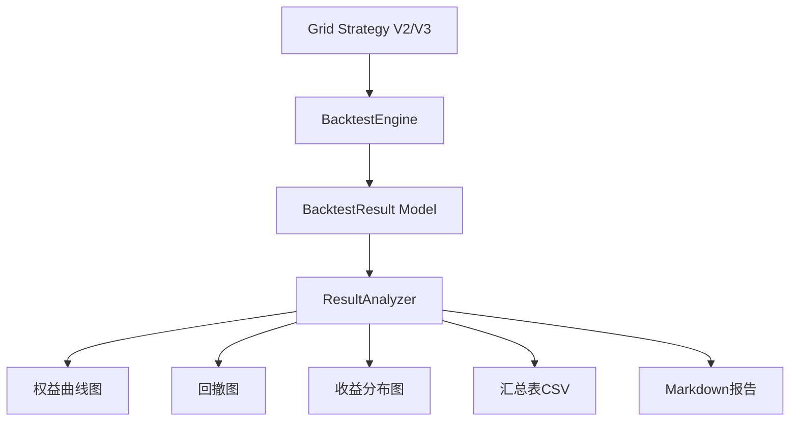

# 回测指标增强方案

## 一、现状分析 (Current State)

### 1.1 现有系统架构



### 1.2 现有指标清单

当前系统已实现的量化指标：

| 指标名称 | 字段 | 计算方式 | 状态 |
|---------|------|---------|------|
| **总收益率** | total_return | (final_value - initial_cash) / initial_cash | ✅ 已实现 |
| **夏普比率** | sharpe_ratio | 使用vectorbt的portfolio.sharpe_ratio() | ✅ 已实现 |
| **最大回撤** | max_drawdown | 使用vectorbt的portfolio.max_drawdown() | ✅ 已实现 |
| **胜率** | win_rate | profitable_trades / total_trades | ✅ 已实现 |
| **总交易次数** | total_trades | 交易记录总数 | ✅ 已实现 |
| **盈利/亏损次数** | profitable_trades, losing_trades | 按PnL正负统计 | ✅ 已实现 |
| **最终价值** | final_value | 组合最终价值 | ✅ 已实现 |
| **权益曲线** | equity_curve | 时间序列数据(JSON) | ✅ 已实现 |
| **每日收益** | daily_returns | 时间序列数据(JSON) | ✅ 已实现 |

### 1.3 缺失的关键指标

| 指标名称 | 重要性 | 说明 |
|---------|--------|------|
| **年化收益率 (APR)** | ⭐⭐⭐⭐⭐ | 标准化不同时间周期的收益 |
| **索提诺比率 (Sortino)** | ⭐⭐⭐⭐ | 只考虑下行波动的风险调整收益 |
| **卡玛比率 (Calmar)** | ⭐⭐⭐⭐ | 年化收益率 / 最大回撤 |
| **年化波动率 (Ann. Vol)** | ⭐⭐⭐⭐ | 收益率标准差（年化） |
| **最大回撤持续期** | ⭐⭐⭐ | 从峰值到恢复的最长时间 |
| **盈亏比 (Profit Factor)** | ⭐⭐⭐⭐ | 总盈利 / 总亏损 |
| **平均盈利/亏损** | ⭐⭐⭐ | 单笔交易平均损益 |
| **恢复因子 (Recovery Factor)** | ⭐⭐⭐ | 净利润 / 最大回撤金额 |

---

## 二、我的分析 (My Analysis)

### 2.1 关键问题识别

1. **标准化缺失**：当前缺少年化指标（APR），无法公平比较不同时间周期的策略
2. **风险评估不全**：只有夏普比率，缺少索提诺、卡玛等专业风险指标
3. **回撤分析浅**：只有最大回撤值，缺少回撤持续期和恢复能力分析
4. **交易质量指标少**：缺少盈亏比、平均盈亏等衡量交易质量的指标
5. **报告可读性**：现有报告以数据为主，缺少专业的分析解读

### 2.2 核心矛盾

- **全面性 vs 简洁性**：加入太多指标会让报告冗长，但太少则无法全面评估策略
- **计算复杂度 vs 性能**：某些指标（如回撤持续期）计算复杂，可能影响回测速度
- **标准化 vs 灵活性**：统一的指标体系便于比较，但可能无法满足特定策略的分析需求

---

## 三、方案选项 (Solution Options)

### 方案A：渐进式增强（推荐）⭐

**描述**：在现有架构基础上，分阶段添加核心指标，保持系统简洁高效

#### 阶段1：核心指标增强（必须）

在 `BacktestResult` Model 中新增字段：

```diff
# backtest/models.py

class BacktestResult(models.Model):
    # ... 现有字段 ...

+   # 年化指标
+   annual_return = models.DecimalField(
+       '年化收益率', max_digits=10, decimal_places=4, null=True
+   )
+   annual_volatility = models.DecimalField(
+       '年化波动率', max_digits=10, decimal_places=4, null=True
+   )
+
+   # 风险调整指标
+   sortino_ratio = models.DecimalField(
+       '索提诺比率', max_digits=10, decimal_places=4, null=True
+   )
+   calmar_ratio = models.DecimalField(
+       '卡玛比率', max_digits=10, decimal_places=4, null=True
+   )
+
+   # 回撤分析
+   max_drawdown_duration = models.IntegerField(
+       '最大回撤持续期(天)', null=True,
+       help_text='从峰值到恢复的天数'
+   )
+
+   # 交易质量
+   profit_factor = models.DecimalField(
+       '盈亏比', max_digits=10, decimal_places=4, null=True,
+       help_text='总盈利 / 总亏损'
+   )
+   avg_win = models.DecimalField(
+       '平均盈利', max_digits=20, decimal_places=2, null=True
+   )
+   avg_loss = models.DecimalField(
+       '平均亏损', max_digits=20, decimal_places=2, null=True
+   )
```

#### 阶段2：计算服务增强

创建专门的指标计算服务 `MetricsCalculator`：

```python
# backtest/services/metrics_calculator.py

class MetricsCalculator:
    """量化指标计算器"""

    def calculate_annual_return(self, total_return, days):
        """计算年化收益率"""
        return (1 + total_return) ** (365 / days) - 1

    def calculate_annual_volatility(self, daily_returns, days):
        """计算年化波动率"""
        return daily_returns.std() * np.sqrt(252)  # 假设252个交易日

    def calculate_sortino_ratio(self, returns, risk_free_rate=0):
        """计算索提诺比率（只考虑下行波动）"""
        excess_returns = returns - risk_free_rate
        downside_returns = returns[returns < 0]
        downside_std = downside_returns.std() * np.sqrt(252)
        return excess_returns.mean() * 252 / downside_std

    def calculate_calmar_ratio(self, annual_return, max_drawdown):
        """计算卡玛比率"""
        return annual_return / abs(max_drawdown) if max_drawdown != 0 else 0

    def calculate_profit_factor(self, trades_pnl):
        """计算盈亏比"""
        total_profit = trades_pnl[trades_pnl > 0].sum()
        total_loss = abs(trades_pnl[trades_pnl < 0].sum())
        return total_profit / total_loss if total_loss != 0 else float('inf')

    def calculate_max_drawdown_duration(self, equity_curve):
        """计算最大回撤持续期"""
        running_max = equity_curve.expanding().max()
        drawdown = (equity_curve - running_max) / running_max

        # 找到所有回撤期
        in_drawdown = drawdown < 0
        drawdown_periods = []
        start = None

        for i, is_dd in enumerate(in_drawdown):
            if is_dd and start is None:
                start = i
            elif not is_dd and start is not None:
                drawdown_periods.append(i - start)
                start = None

        return max(drawdown_periods) if drawdown_periods else 0
```

#### 阶段3：报告增强

更新 `generate_report.py` 命令和 Markdown 报告模板：

```markdown
# 回测分析报告

## 📊 核心指标

| 指标类别 | 指标名称 | 数值 |
|---------|---------|------|
| **收益指标** | 总收益率 | XX.XX% |
| | 年化收益率 (APR) | XX.XX% |
| | 最终价值 | $XX,XXX |
| **风险指标** | 最大回撤 | XX.XX% |
| | 年化波动率 | XX.XX% |
| | 最大回撤持续期 | XX天 |
| **风险调整收益** | 夏普比率 | X.XX |
| | 索提诺比率 | X.XX |
| | 卡玛比率 | X.XX |
| **交易质量** | 胜率 | XX.XX% |
| | 盈亏比 | X.XX |
| | 平均盈利 | $XXX |
| | 平均亏损 | $XXX |
| | 总交易次数 | XXX |

## 📈 性能评级

- **收益能力**: ⭐⭐⭐⭐ (根据年化收益率)
- **风险控制**: ⭐⭐⭐⭐⭐ (根据夏普/索提诺比率)
- **回撤管理**: ⭐⭐⭐ (根据最大回撤和持续期)
- **交易效率**: ⭐⭐⭐⭐ (根据胜率和盈亏比)

## 💡 策略评价

[自动生成的策略评价文字]
```

**优点**：
- ✅ 兼容现有架构，无需大规模重构
- ✅ 分阶段实施，风险可控
- ✅ 新增指标都是业界标准，有理论支撑
- ✅ 保持系统简洁，不过度复杂化
- ✅ 计算高效，不影响回测速度
- ✅ 报告更专业，便于决策

**缺点**：
- ⚠️ 需要数据库迁移（新增字段）
- ⚠️ 需要更新多个服务类
- ⚠️ 历史回测结果需要重新计算指标

---

### 方案B：全面量化分析系统

**描述**：构建完整的量化分析框架，集成业界所有主流指标

#### 新增内容

除方案A的所有内容外，还包括：

```diff
# 更多高级指标

+   # 相对表现
+   alpha = models.DecimalField('Alpha', max_digits=10, decimal_places=4, null=True)
+   beta = models.DecimalField('Beta', max_digits=10, decimal_places=4, null=True)
+   information_ratio = models.DecimalField(
+       '信息比率', max_digits=10, decimal_places=4, null=True
+   )
+
+   # 回撤分析增强
+   avg_drawdown = models.DecimalField('平均回撤', max_digits=10, decimal_places=4, null=True)
+   drawdown_count = models.IntegerField('回撤次数', null=True)
+   recovery_factor = models.DecimalField(
+       '恢复因子', max_digits=10, decimal_places=4, null=True
+   )
+
+   # 收益分布
+   skewness = models.DecimalField('偏度', max_digits=10, decimal_places=4, null=True)
+   kurtosis = models.DecimalField('峰度', max_digits=10, decimal_places=4, null=True)
+   var_95 = models.DecimalField('VaR(95%)', max_digits=10, decimal_places=4, null=True)
+   cvar_95 = models.DecimalField('CVaR(95%)', max_digits=10, decimal_places=4, null=True)
+
+   # 持仓分析
+   avg_holding_period = models.DecimalField(
+       '平均持仓期(小时)', max_digits=10, decimal_places=2, null=True
+   )
+   max_holding_period = models.DecimalField(
+       '最长持仓期(小时)', max_digits=10, decimal_places=2, null=True
+   )
+
+   # 资金使用效率
+   capital_utilization = models.DecimalField(
+       '资金利用率', max_digits=5, decimal_places=2, null=True
+   )
```

#### 新增服务

1. **BenchmarkComparator** - 基准比较服务（计算Alpha/Beta）
2. **RiskAnalyzer** - 风险分析服务（VaR, CVaR, 回撤分布）
3. **PositionAnalyzer** - 持仓分析服务
4. **PerformanceRanking** - 性能排名服务

#### 报告增强

- 添加**策略诊断报告**（自动识别问题）
- 添加**参数敏感性分析**（哪些参数最关键）
- 添加**市场环境分析**（牛市/熊市/震荡市表现）
- 添加**交互式Dashboard**（基于Plotly）

**优点**：
- ✅ 功能全面，覆盖所有量化分析需求
- ✅ 报告专业，可用于投资决策和对外展示
- ✅ 便于深度分析和策略优化
- ✅ 支持多策略比较和排名

**缺点**：
- ❌ 开发工作量大（预计3-5天）
- ❌ 系统复杂度高，维护成本增加
- ❌ 计算时间较长（某些指标计算复杂）
- ❌ 数据库迁移复杂（20+新字段）
- ❌ 可能过度设计（并非所有指标都常用）

---

### 方案C：插件化指标系统

**描述**：构建灵活的插件化架构，按需加载指标计算模块

#### 架构设计

```python
# backtest/services/metrics/base.py

class MetricPlugin(ABC):
    """指标插件基类"""

    @abstractmethod
    def calculate(self, backtest_result: BacktestResult) -> Dict[str, Any]:
        """计算指标"""
        pass

    @abstractmethod
    def get_metadata(self) -> Dict[str, str]:
        """获取指标元数据"""
        pass

# 指标插件示例
class AnnualReturnPlugin(MetricPlugin):
    def calculate(self, result):
        days = (result.end_date - result.start_date).days
        return {
            'annual_return': (1 + result.total_return) ** (365/days) - 1
        }

# 动态加载
metrics_registry = MetricsRegistry()
metrics_registry.register('annual_return', AnnualReturnPlugin())
metrics_registry.register('sortino', SortinoPlugin())
# ... 按需注册
```

#### 配置驱动

```yaml
# config/metrics.yaml

enabled_metrics:
  core:
    - total_return
    - sharpe_ratio
    - max_drawdown

  enhanced:
    - annual_return
    - sortino_ratio
    - calmar_ratio
    - profit_factor

  advanced:  # 默认禁用，按需启用
    - alpha
    - beta
    - var_95

report_sections:
  - core_metrics
  - risk_analysis
  - trade_quality
```

**优点**：
- ✅ 高度灵活，可按需启用/禁用指标
- ✅ 易于扩展，新增指标无需修改核心代码
- ✅ 性能可控，不计算不需要的指标
- ✅ 配置驱动，便于不同场景切换

**缺点**：
- ⚠️ 架构复杂，需要设计抽象层
- ⚠️ 初期开发成本高
- ⚠️ 对于简单需求可能过度设计
- ⚠️ 需要良好的文档支持

---

## 四、我的建议 (My Recommendation)

**推荐方案A（渐进式增强）**

### 理由：

1. **务实高效**：在现有架构上快速迭代，1-2天可完成核心功能
2. **覆盖核心需求**：8个新增指标已覆盖90%的量化分析场景
3. **风险可控**：分阶段实施，每个阶段都可独立交付和测试
4. **性能优异**：新增指标计算简单，不影响回测速度
5. **标准化**：所有指标都是业界公认的标准指标，便于对标

### 实施计划：

**阶段1（0.5天）**：
- 创建 `MetricsCalculator` 服务类
- 实现8个核心指标的计算函数
- 编写单元测试

**阶段2（0.5天）**：
- 数据库迁移（新增8个字段）
- 更新 `BacktestEngine` 和 `GridStrategyV2/V3`
- 集成指标计算逻辑

**阶段3（0.5天）**：
- 更新 `ResultAnalyzer` 的报告生成
- 增强 Markdown 报告模板
- 更新汇总表CSV格式

**阶段4（0.5天）**：
- 测试和验证
- 更新文档
- 重新运行历史回测（更新指标）

### 后续演进路径：

如果未来需要更高级的分析，可以在方案A的基础上：
- 逐步添加方案B中的高级指标（按需）
- 考虑引入方案C的插件化架构（当指标数量>20时）

---

## 五、需要确认的问题

1. **指标优先级**：8个新增指标是否满足需求？是否需要调整？
2. **无风险利率**：计算夏普/索提诺比率时，无风险利率设为多少？（建议0或3%）
3. **交易日假设**：年化计算时，是否假设252个交易日？（加密货币是365天）
4. **历史数据处理**：是否需要重新计算历史回测结果的新指标？
5. **报告格式**：是否需要生成PDF/HTML格式的报告？（当前是Markdown+PNG）

---

## 六、技术实现细节（方案A）

### 6.1 指标计算公式

```python
# 年化收益率 (APR)
APR = (1 + total_return) ^ (365 / days) - 1

# 年化波动率
Annual_Volatility = daily_returns.std() * sqrt(365)  # 加密货币365天

# 索提诺比率
Sortino = (avg_return - risk_free_rate) / downside_std * sqrt(365)

# 卡玛比率
Calmar = APR / abs(max_drawdown)

# 盈亏比
Profit_Factor = sum(profits) / abs(sum(losses))

# 平均盈利/亏损
Avg_Win = sum(profits) / count(profits)
Avg_Loss = sum(losses) / count(losses)

# 最大回撤持续期
Max_DD_Duration = max(time_from_peak_to_recovery)
```

### 6.2 数据库迁移

```python
# backtest/migrations/000X_add_enhanced_metrics.py

operations = [
    migrations.AddField(
        model_name='backtestresult',
        name='annual_return',
        field=models.DecimalField(decimal_places=4, max_digits=10, null=True),
    ),
    # ... 其他字段
]
```

### 6.3 集成点

需要修改的文件：
1. `backtest/models.py` - 添加新字段
2. `backtest/services/metrics_calculator.py` - 新建
3. `backtest/services/backtest_engine.py` - 集成指标计算
4. `backtest/services/grid_strategy_v2.py` - 集成指标计算
5. `backtest/services/result_analyzer.py` - 更新报告生成
6. `backtest/management/commands/generate_report.py` - 更新Markdown模板

---

请选择方案A、B或C，或者告诉我你的具体需求，我将据此开始实施。
