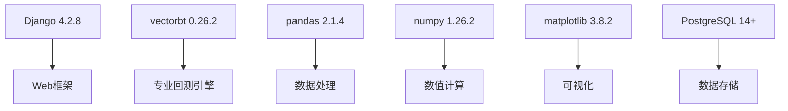
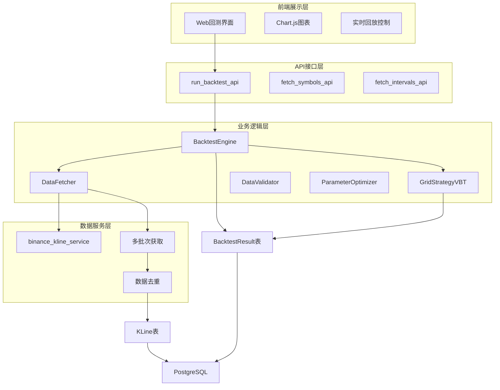
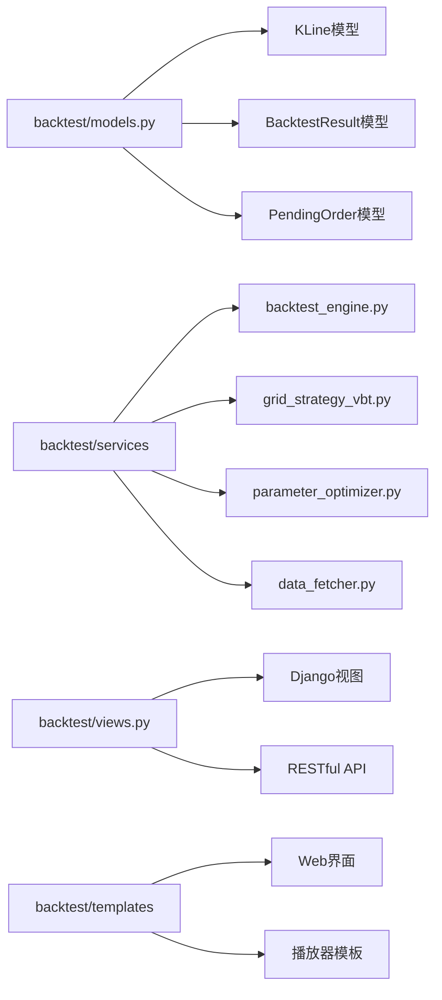
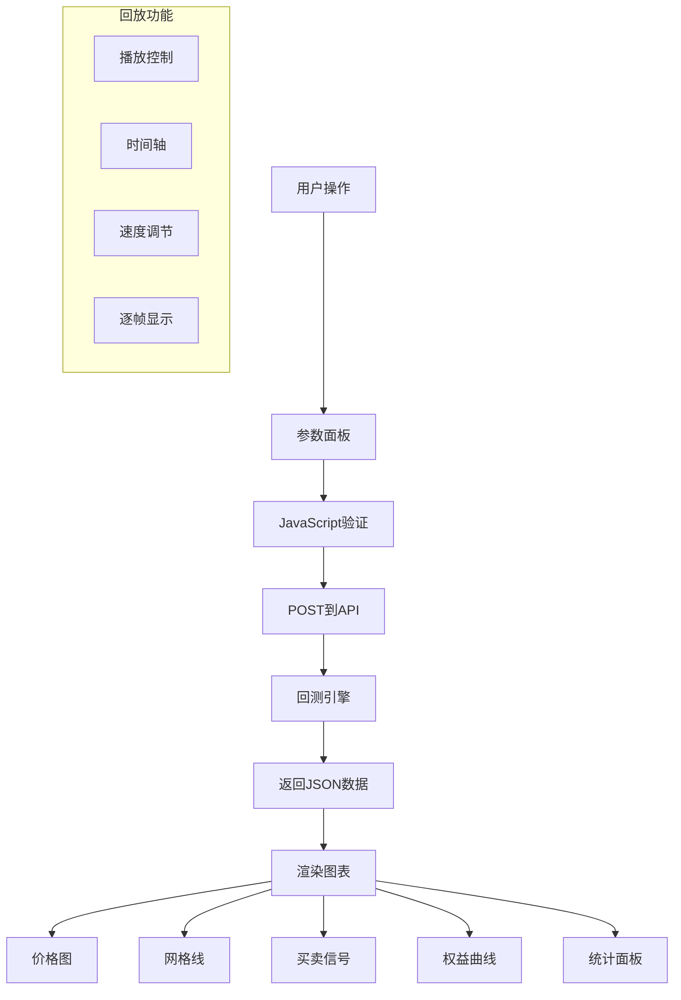

# 回测系统完整指南

**更新时间**: 2025-12-02
**版本**: v3.0.0
**技术栈**: vectorbt + Django + pandas

---

## 📋 目录

1. [概述](#概述)
2. [系统架构](#系统架构)
3. [数据管理](#数据管理)
4. [回测引擎](#回测引擎)
5. [Web可视化](#web可视化)
6. [参数优化](#参数优化)
7. [API接口](#api接口)
8. [使用方法](#使用方法)
9. [最佳实践](#最佳实践)
10. [故障排查](#故障排查)

---

## 概述

回测系统是基于vectorbt构建的专业量化交易回测框架，支持历史数据持久化、多策略回测、参数优化和Web可视化。

### 核心特性

- ✅ **专业回测引擎**: 基于vectorbt，支持复杂策略
- ✅ **数据持久化**: PostgreSQL/SQLite存储，支持多币种多周期
- ✅ **Web可视化**: 交互式图表，实时回放
- ✅ **参数优化**: 网格搜索，热力图分析
- ✅ **多策略支持**: Grid V1/V2/V3、Buy & Hold
- ✅ **实时数据**: 支持API增量更新

### 技术栈



### 支持的交易对

| 交易对 | 时间周期 | 支持状态 | 数据范围 |
|--------|----------|----------|----------|
| ETHUSDT | 1h/4h/1d | ✅ 完全支持 | 540天+ |
| BTCUSDT | 1h/4h/1d | ✅ 支持 | 180天+ |
| SOLUSDT | 1h/4h | ✅ 支持 | 180天+ |
| BNBUSDT | 1h/4h | ✅ 支持 | 180天+ |

---

## 系统架构

### 整体架构图



### 核心模块



---

## 数据管理

### KLine数据模型

```python
class KLine(models.Model):
    """K线历史数据"""

    # 基本信息
    symbol = models.CharField('交易对', max_length=20, db_index=True)
    interval = models.CharField('时间周期', max_length=10, db_index=True)

    # 时间
    open_time = models.DateTimeField('开盘时间', db_index=True)
    close_time = models.DateTimeField('收盘时间')

    # OHLCV数据
    open_price = models.DecimalField('开盘价', max_digits=20, decimal_places=8)
    high_price = models.DecimalField('最高价', max_digits=20, decimal_places=8)
    low_price = models.DecimalField('最低价', max_digits=20, decimal_places=8)
    close_price = models.DecimalField('收盘价', max_digits=20, decimal_places=8)
    volume = models.DecimalField('成交量', max_digits=30, decimal_places=8)

    # 其他数据
    quote_volume = models.DecimalField('成交额', max_digits=30, decimal_places=8)
    trade_count = models.IntegerField('成交笔数', default=0)
    taker_buy_volume = models.DecimalField('主动买入量', max_digits=30, decimal_places=8)

    class Meta:
        unique_together = [['symbol', 'interval', 'open_time']]  # 防止重复
        indexes = [
            models.Index(fields=['symbol', 'interval', 'open_time']),
            models.Index(fields=['symbol', 'interval', '-open_time']),
        ]
```

### 数据获取服务

```python
class DataFetcher:
    """历史数据获取器"""

    def __init__(self, symbol: str, interval: str):
        self.symbol = symbol.upper()
        self.interval = interval

    def fetch_historical_data(self, days: int = 180) -> int:
        """获取历史数据"""

        # 计算K线数量
        interval_map = {'1h': 24, '4h': 6, '1d': 1}
        bars_per_day = interval_map[self.interval]
        limit = min(days * bars_per_day, 1000)

        # 从币安获取数据
        kline_data_list = fetch_klines(
            symbol=self.symbol,
            interval=self.interval,
            limit=limit
        )

        # 批量保存到数据库
        saved_count = self._save_klines(kline_data_list)
        return saved_count

    def _fetch_multiple_batches(self, total_needed: int, batch_size: int) -> int:
        """突破1000条限制的多批次获取"""
        all_klines = []
        remaining = total_needed

        while remaining > 0:
            current_batch = min(batch_size, remaining)

            # 获取当前批次
            klines = fetch_klines(
                symbol=self.symbol,
                interval=self.interval,
                limit=current_batch,
                start_time=start_time,  # 向前分页
                end_time=end_time
            )

            all_klines.extend(klines)
            remaining -= len(klines)

            # 延迟防止限流
            time.sleep(1)

        return self._save_klines(all_klines)
```

### 数据验证服务

```python
class DataValidator:
    """数据验证器"""

    def validate_klines(self, symbol: str, interval: str) -> Tuple[bool, List[str]]:
        """验证数据质量"""

        errors = []

        # 1. 价格合理性检查
        price_errors = self._check_price_validity(klines)
        errors.extend(price_errors)

        # 2. 时间连续性检查
        gap_errors = self._check_time_gaps(klines, interval)
        errors.extend(gap_errors)

        # 3. 成交量异常检查
        volume_errors = self._check_volume_anomalies(klines)
        errors.extend(volume_errors)

        return len(errors) == 0, errors

    def _check_price_validity(self, klines):
        """检查价格合理性"""
        errors = []
        for kline in klines:
            if kline.high_price < kline.low_price:
                errors.append(f"High < Low: {kline.open_time}")
        return errors
```

---

## 回测引擎

### BacktestEngine核心

```python
class BacktestEngine:
    """vectorbt回测引擎"""

    def __init__(self, symbol: str, interval: str, **kwargs):
        self.symbol = symbol
        self.interval = interval
        self.initial_cash = kwargs.get('initial_cash', 10000.0)
        self.commission = kwargs.get('commission', 0.001)  # 0.1%
        self.slippage = kwargs.get('slippage', 0.0005)    # 0.05%

        # 加载数据
        self.df = self._load_data()

    def run_backtest(self, entries: pd.Series, exits: pd.Series, **kwargs) -> BacktestResult:
        """运行回测"""

        # 创建Portfolio
        portfolio = vbt.Portfolio.from_signals(
            close=self.df['Close'],
            entries=entries,
            exits=exits,
            init_cash=self.initial_cash,
            fees=self.commission,
            slippage=self.slippage,
            freq=self.interval
        )

        # 计算指标
        total_return = portfolio.total_return()
        sharpe_ratio = portfolio.sharpe_ratio()
        max_drawdown = portfolio.max_drawdown()

        # 交易统计
        trades = portfolio.trades.records_readable
        total_trades = len(trades)
        profitable_trades = len(trades[trades['PnL'] > 0])
        win_rate = profitable_trades / total_trades * 100 if total_trades > 0 else 0

        # 保存结果
        result = BacktestResult.objects.create(
            name=kwargs.get('strategy_name', 'Custom Strategy'),
            symbol=self.symbol,
            interval=self.interval,
            strategy_params=kwargs.get('strategy_params', {}),
            initial_cash=Decimal(str(self.initial_cash)),
            final_value=Decimal(str(portfolio.final_value())),
            total_return=Decimal(str(total_return)),
            sharpe_ratio=Decimal(str(sharpe_ratio)),
            max_drawdown=Decimal(str(abs(max_drawdown))),
            win_rate=Decimal(str(win_rate)),
            total_trades=total_trades,
            profitable_trades=profitable_trades,
            equity_curve=portfolio.value().to_dict()
        )

        return result
```

### Grid策略实现

```python
class GridStrategyVBT:
    """网格交易策略（vectorbt格式）"""

    def __init__(self, klines_df, config: dict):
        self.data = klines_df
        self.config = config
        self.grid_step_pct = config.get('grid_step_pct', 0.01)
        self.grid_levels = config.get('grid_levels', 10)
        self.initial_cash = config.get('initial_cash', 10000)

    def generate_signals(self):
        """生成买卖信号"""

        close = self.data['Close']
        entries = pd.Series(False, index=close.index)
        exits = pd.Series(False, index=close.index)

        # 网格价格
        price_min = close.min()
        price_max = close.max()
        grid_size = (price_max - price_min) / self.grid_levels

        # 生成网格线
        grid_prices = [price_min + i * grid_size for i in range(self.grid_levels + 1)]

        # 买入信号：价格下穿网格线
        for i in range(1, len(grid_prices)):
            grid_line = grid_prices[i]
            mask = (close.shift(1) >= grid_line) & (close < grid_line)
            entries |= mask

        # 卖出信号：价格上穿网格线
        for i in range(len(grid_prices) - 1):
            grid_line = grid_prices[i]
            mask = (close.shift(1) <= grid_line) & (close > grid_line)
            exits |= mask

        return entries, exits

    def run_backtest(self):
        """运行回测"""
        entries, exits = self.generate_signals()

        engine = BacktestEngine(
            symbol='ETHUSDT',
            interval='4h',
            initial_cash=self.initial_cash
        )

        result = engine.run_backtest(
            entries=entries,
            exits=exits,
            strategy_name='Grid Strategy',
            strategy_params=self.config
        )

        return result
```

---

## Web可视化

### Web界面架构



### 前端技术栈

- **Chart.js 4.4.0**: 图表渲染
- **Luxon 3.4.4**: 时间处理
- **Vanilla JavaScript**: 无框架依赖
- **CSS Grid/Flexbox**: 响应式布局

### 核心功能

```javascript
// 1. 运行回测
async function runBacktest() {
    // 收集参数
    const params = {
        symbol: document.getElementById('symbol').value,
        interval: document.getElementById('interval').value,
        days: parseInt(document.getElementById('days').value),
        strategy: document.getElementById('strategy').value,
        initial_cash: parseFloat(document.getElementById('initialCash').value),
        grid_step_pct: parseFloat(document.getElementById('gridStep').value)
    };

    // POST到API
    const response = await fetch('/backtest/api/run/', {
        method: 'POST',
        headers: {'Content-Type': 'application/json'},
        body: JSON.stringify(params)
    });

    const result = await response.json();

    // 渲染图表
    renderCharts(result);
}

// 2. 渲染价格图和网格线
function renderPriceChart(data) {
    const ctx = document.getElementById('priceChart').getContext('2d');

    new Chart(ctx, {
        type: 'candlestick',
        data: {
            datasets: [
                {
                    label: '价格',
                    data: data.price_data,
                    type: 'line',
                    borderColor: '#3b82f6'
                },
                {
                    label: '网格线',
                    data: data.grid_lines,
                    type: 'line',
                    borderColor: '#10b981',
                    borderDash: [5, 5]
                },
                {
                    label: '买入信号',
                    data: data.buy_signals,
                    type: 'scatter',
                    backgroundColor: '#10b981'
                },
                {
                    label: '卖出信号',
                    data: data.sell_signals,
                    type: 'scatter',
                    backgroundColor: '#ef4444'
                }
            ]
        }
    });
}

// 3. 实时回放
let currentIndex = 0;
let playbackInterval = null;

function startPlayback() {
    playbackInterval = setInterval(() => {
        currentIndex++;
        updatePlayback();

        if (currentIndex >= data.length) {
            stopPlayback();
        }
    }, 100); // 100ms = 0.1x速度
}

function updatePlayback() {
    const currentData = data.slice(0, currentIndex);
    updateChart(currentData);
}
```

### Web界面特性

| 功能 | 说明 | 技术实现 |
|------|------|----------|
| **价格图表** | OHLC蜡烛图，网格线，交易信号 | Chart.js |
| **权益曲线** | 账户价值变化 | Chart.js Line |
| **回放控制** | 播放/暂停/速度调节 | JavaScript定时器 |
| **参数面板** | 交易对、周期、网格参数 | HTML表单 |
| **统计面板** | 收益率、夏普比率、胜率 | 实时计算 |
| **交易日志** | 每笔交易详情 | 表格展示 |

---

## 参数优化

### 网格搜索

```python
class ParameterOptimizer:
    """参数优化服务"""

    def grid_search(self, symbol: str, interval: str, param_ranges: dict):
        """网格搜索最优参数"""

        results = []

        # 遍历所有参数组合
        for step_pct in param_ranges['grid_step_pct']:
            for levels in param_ranges['grid_levels']:
                for order_size in param_ranges['order_size_usdt']:

                    config = {
                        'symbol': symbol,
                        'interval': interval,
                        'strategy_type': 'grid_v2',
                        'grid_step_pct': step_pct,
                        'grid_levels': levels,
                        'order_size_usdt': order_size,
                        'initial_cash': 10000
                    }

                    # 运行回测
                    result = run_backtest(config)

                    # 记录结果
                    results.append({
                        'grid_step_pct': step_pct,
                        'grid_levels': levels,
                        'order_size_usdt': order_size,
                        'total_return': result.total_return,
                        'sharpe_ratio': result.sharpe_ratio,
                        'max_drawdown': result.max_drawdown,
                        'total_trades': result.total_trades
                    })

        return self._analyze_results(results)

    def _analyze_results(self, results):
        """分析优化结果"""

        # 转换为DataFrame
        df = pd.DataFrame(results)

        # 排序（按夏普比率）
        df_sorted = df.sort_values('sharpe_ratio', ascending=False)

        # 生成热力图
        self._plot_heatmap(df_sorted, 'sharpe_ratio')

        # 返回最优参数
        best_params = {
            'grid_step_pct': df_sorted.iloc[0]['grid_step_pct'],
            'grid_levels': int(df_sorted.iloc[0]['grid_levels']),
            'order_size_usdt': df_sorted.iloc[0]['order_size_usdt']
        }

        return best_params, df_sorted
```

### 热力图可视化

```python
def _plot_heatmap(self, df, metric):
    """生成参数热力图"""

    import plotly.express as px

    # 透视表
    pivot = df.pivot_table(
        values=metric,
        index='grid_step_pct',
        columns='grid_levels',
        aggfunc='mean'
    )

    # 创建热力图
    fig = px.imshow(
        pivot,
        labels=dict(x="Grid Levels", y="Step %", color=metric),
        x=pivot.columns,
        y=pivot.index,
        title=f"Grid Search Results - {metric}"
    )

    # 保存图片
    fig.write_html(f"heatmap_{metric}.html")
    fig.show()
```

### 优化报告

```python
def generate_optimization_report(results_df, output_path):
    """生成优化报告"""

    # 汇总统计
    summary = {
        'total_combinations': len(results_df),
        'best_sharpe': results_df['sharpe_ratio'].max(),
        'best_return': results_df['total_return'].max(),
        'best_drawdown': results_df['max_drawdown'].min(),
        'avg_sharpe': results_df['sharpe_ratio'].mean()
    }

    # 最佳参数
    best = results_df.iloc[0]

    report = f"""
    # 参数优化报告

    ## 优化统计
    - 总参数组合: {summary['total_combinations']}
    - 最优夏普比率: {summary['best_sharpe']:.2f}
    - 最优收益率: {summary['best_return']:.2%}
    - 最小回撤: {summary['best_drawdown']:.2%}
    - 平均夏普: {summary['avg_sharpe']:.2f}

    ## 最优参数
    - Grid Step %: {best['grid_step_pct']:.1%}
    - Grid Levels: {best['grid_levels']}
    - Order Size: ${best['order_size_usdt']}

    ## 详细结果
    {results_df.to_markdown()}
    """

    with open(output_path, 'w') as f:
        f.write(report)
```

---

## API接口

### RESTful API

#### 1. 运行回测

**POST** `/backtest/api/run/`

```javascript
// 请求体
{
    "symbol": "ETHUSDT",
    "interval": "4h",
    "days": 180,
    "strategy_type": "grid_v2",
    "initial_cash": 10000,
    "grid_step_pct": 0.01,
    "grid_levels": 10,
    "order_size_usdt": 100,
    "stop_loss_pct": 0.10
}

// 响应
{
    "status": "success",
    "backtest_id": 123,
    "result": {
        "total_return": 0.2397,
        "sharpe_ratio": 2.44,
        "max_drawdown": 0.0011,
        "total_trades": 4,
        "win_rate": 1.0,
        "initial_cash": 10000,
        "final_value": 12397
    },
    "chart_data": {
        "price_data": [...],
        "equity_curve": [...],
        "buy_signals": [...],
        "sell_signals": [...]
    }
}
```

#### 2. 获取交易对列表

**GET** `/backtest/api/symbols/`

```javascript
// 响应
{
    "symbols": [
        {"value": "ETHUSDT", "label": "ETH/USDT"},
        {"value": "BTCUSDT", "label": "BTC/USDT"},
        {"value": "SOLUSDT", "label": "SOL/USDT"}
    ]
}
```

#### 3. 获取时间周期列表

**GET** `/backtest/api/intervals/`

```javascript
// 响应
{
    "intervals": [
        {"value": "1h", "label": "1小时"},
        {"value": "4h", "label": "4小时"},
        {"value": "1d", "label": "1天"}
    ]
}
```

---

## 使用方法

### 1. 命令行回测

```bash
# 基本回测
python manage.py run_backtest \
  --symbol ETHUSDT \
  --interval 4h \
  --strategy grid_v2 \
  --days 180

# 详细参数
python manage.py run_backtest \
  --symbol ETHUSDT \
  --interval 4h \
  --strategy grid_v3 \
  --days 90 \
  --initial-cash 10000 \
  --grid-step-pct 0.015 \
  --grid-levels 10 \
  --order-validity-days 7

# 买入持有基准
python manage.py run_backtest \
  --symbol ETHUSDT \
  --interval 4h \
  --strategy buy_hold \
  --days 180
```

### 2. 数据管理

```bash
# 获取历史数据
python manage.py fetch_klines \
  --symbol ETHUSDT \
  --interval 4h \
  --days 180 \
  --validate

# 增量更新
python manage.py update_klines \
  --symbol ETHUSDT \
  --interval 4h \
  --limit 100

# 查看数据统计
python manage.py shell
>>> from backtest.models import KLine
>>> KLine.objects.filter(symbol='ETHUSDT', interval='4h').count()
1080
```

### 3. 参数优化

```bash
# 网格搜索
python manage.py optimize_params \
  --symbol ETHUSDT \
  --interval 4h \
  --strategy grid_v2 \
  --grid-step-pcts 0.5,1.0,1.5,2.0 \
  --grid-levels 5,10,15,20

# 生成优化报告
python manage.py generate_report \
  --backtest-id 123 \
  --output optimization_report.html
```

### 4. Web界面

```bash
# 启动Web服务器
./start_web_backtest.sh

# 或手动启动
python manage.py runserver 8001

# 访问
# http://127.0.0.1:8001/backtest/
```

### 5. 可视化分析

```bash
# 生成权益曲线图
python manage.py visualize_results \
  --backtest-id 123

# 生成参数热力图
python manage.py plot_heatmap \
  --backtest-ids 123,124,125

# 综合分析报告
python manage.py generate_comprehensive_report \
  --strategy grid_v2 \
  --days 180
```

---

## 最佳实践

### 1. 数据质量保证

```bash
# 1. 定期更新数据
python manage.py update_klines --symbol ETHUSDT --interval 4h

# 2. 验证数据质量
python manage.py validate_data --symbol ETHUSDT --interval 4h

# 3. 清理重复数据
python manage.py deduplicate_klines --symbol ETHUSDT --interval 4h
```

### 2. 回测参数设置

```python
# 推荐的回测配置
config = {
    'initial_cash': 10000,        # 初始资金
    'commission': 0.001,          # 手续费 0.1%
    'slippage': 0.0005,           # 滑点 0.05%
    'grid_step_pct': 0.015,       # 网格步长 1.5%
    'grid_levels': 10,            # 网格层级
    'stop_loss_pct': 0.10,        # 止损 10%
    'order_size_usdt': 100,       # 订单大小
}

# V3额外配置
v3_config = {
    **config,
    'order_validity_days': 7,     # 挂单有效期
    'price_deviation_threshold': 0.005,  # 价格偏差
}
```

### 3. 策略选择指南

| 市场环境 | 推荐策略 | 参数建议 |
|----------|----------|----------|
| **震荡市场** | Grid V2 | 步长1.5%，层数10 |
| **趋势市场** | Grid V3 | 步长2%，层数5 |
| **熊市** | Grid V3 | 严格止损5% |
| **牛市** | Grid V2 | 步长1%，层数15 |

### 4. 结果评估标准

```python
# 优秀策略标准
def evaluate_strategy(result):
    criteria = {
        'total_return': result.total_return > 0.15,        # 收益率 > 15%
        'sharpe_ratio': result.sharpe_ratio > 1.5,         # 夏普比率 > 1.5
        'max_drawdown': result.max_drawdown < 0.05,        # 最大回撤 < 5%
        'win_rate': result.win_rate > 0.6,                 # 胜率 > 60%
        'total_trades': result.total_trades > 5            # 交易次数 > 5
    }

    passed = sum(criteria.values())
    total = len(criteria)

    if passed == total:
        return "优秀"
    elif passed >= total * 0.8:
        return "良好"
    elif passed >= total * 0.6:
        return "一般"
    else:
        return "需优化"
```

---

## 故障排查

### 常见问题

#### Q1: 数据获取失败

**症状**:
```
ERROR: 币安API限流，请求过于频繁
```

**解决方案**:
```python
# 1. 增加请求间隔
time.sleep(1)  # 请求间隔1秒

# 2. 减少每次获取数量
python manage.py fetch_klines --symbol ETHUSDT --interval 4h --days 30

# 3. 使用增量更新
python manage.py update_klines --symbol ETHUSDT --interval 4h --limit 100
```

#### Q2: 回测结果异常

**症状**:
```
收益率过高（>100%）或过低（<-50%）
```

**诊断**:
```bash
# 1. 检查数据完整性
python manage.py validate_data --symbol ETHUSDT --interval 4h

# 2. 检查参数设置
python manage.py shell
>>> from backtest.models import BacktestResult
>>> result = BacktestResult.objects.get(id=123)
>>> result.strategy_params

# 3. 对比买入持有基准
python manage.py run_backtest --strategy buy_hold --symbol ETHUSDT
```

**解决方案**:
```python
# 调整参数
config = {
    'grid_step_pct': 0.015,    # 适中步长
    'grid_levels': 10,         # 适中层级
    'stop_loss_pct': 0.10,     # 严格止损
}
```

#### Q3: Web界面无法访问

**症状**:
```
访问 http://127.0.0.1:8001/backtest/ 404
```

**解决方案**:
```bash
# 1. 检查端口
lsof -ti:8001

# 2. 确保在正确端口启动
python manage.py runserver 8001

# 3. 检查URL配置
# backtest/urls.py
```

#### Q4: 图表渲染缓慢

**症状**:
```
加载1080个数据点超过5秒
```

**优化**:
```javascript
// 1. 减少数据点
const sampleRate = 10;  // 每10个点取1个
const sampledData = data.filter((_, i) => i % sampleRate === 0);

// 2. 使用Canvas渲染
const config = {
    type: 'line',
    options: {
        animation: false,  // 禁用动画
        responsive: false
    }
};
```

### 调试工具

```bash
# 1. 查看数据库统计
python manage.py dbshell
sqlite> SELECT symbol, interval, COUNT(*) FROM backtest_kline GROUP BY symbol, interval;

# 2. 查看回测结果
python manage.py shell
>>> from backtest.models import BacktestResult
>>> result = BacktestResult.objects.latest('created_at')
>>> print(f"收益率: {result.total_return}")
>>> print(f"交易次数: {result.total_trades}")

# 3. 日志调试
python manage.py run_backtest --verbosity 3
```

---

## 相关文档

- **[项目概览](./PROJECT_OVERVIEW.md)** - 项目整体介绍
- **[网格交易指南](./GRID_TRADING_GUIDE.md)** - 网格策略详解
- **[Web回测播放器指南](./WEB_BACKTEST_PLAYER_GUIDE.md)** - Web界面使用
- **[参数优化指南](./BACKTEST_OPTIMIZATION_GUIDE.md)** - 参数优化详解

---

## 版本历史

| 版本 | 日期 | 更新内容 |
|------|------|----------|
| v3.0 | 2025-12-02 | 新增Grid V3支持，完善Web界面 |
| v2.0 | 2025-11-30 | 实现完整回测框架，支持参数优化 |
| v1.0 | 2025-11-28 | 初始版本，基本回测功能 |

---

**祝您回测顺利！** 📊📈✨
