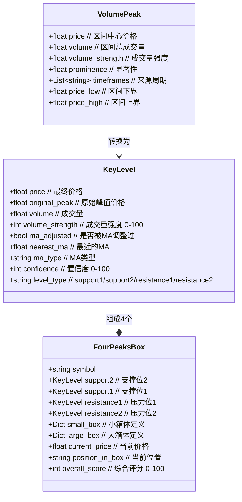
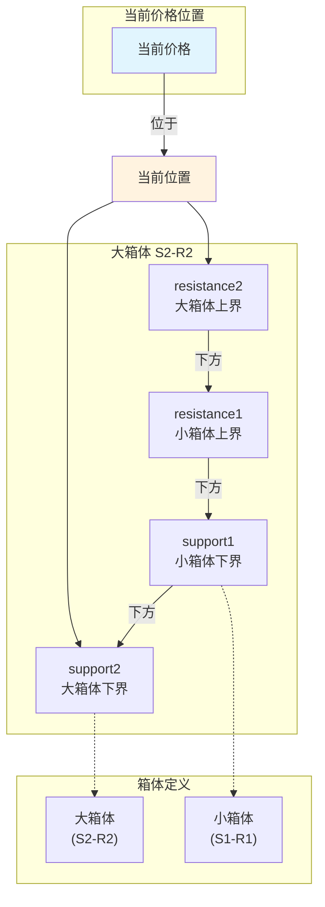
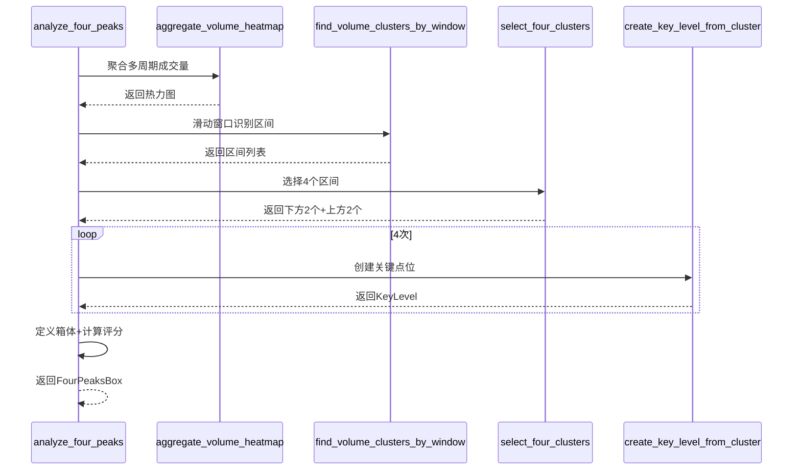
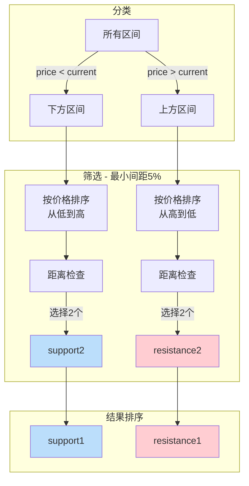
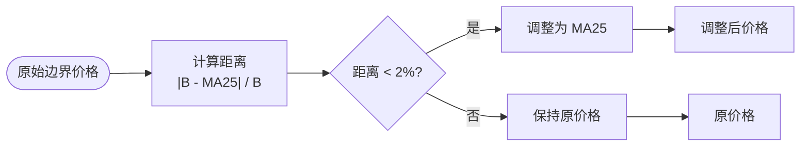
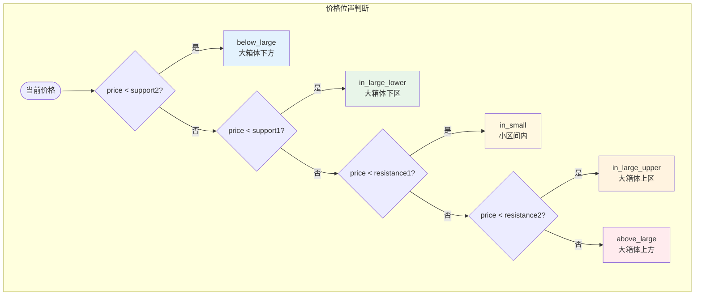
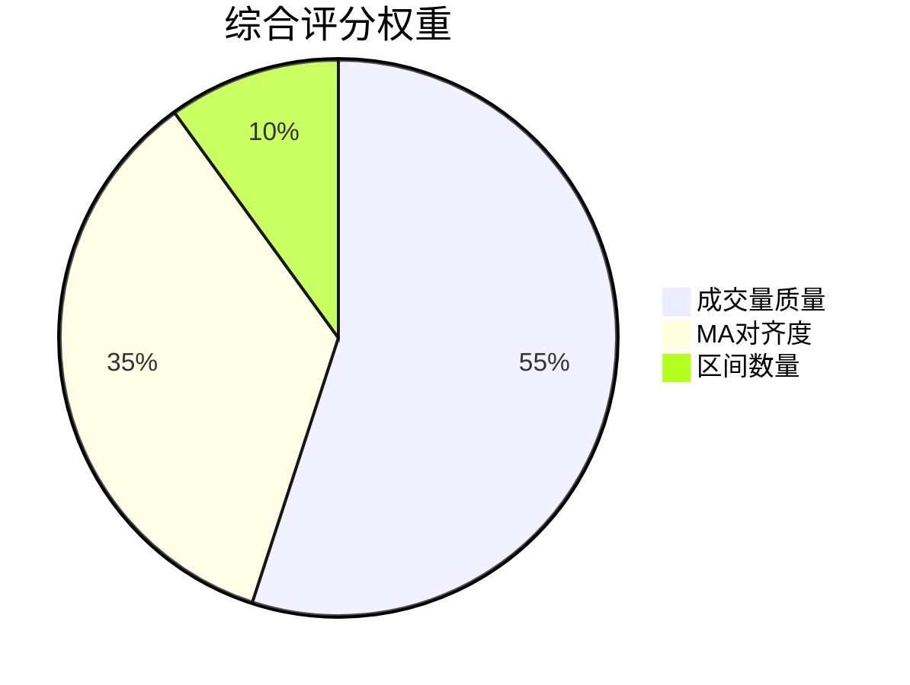

# 四区间（4 Volume Concentration Zones）定义与计算方法

## 1. 概述

### 1.1 什么是四区间

**四区间**是指通过成交量聚类分析识别出的**4个成交量密集价格区间**，用于支撑/压力位分析和交易决策。

该算法基于Volume Profile（成交量剖面）理论，通过多周期数据聚合和滑动窗口聚类，找出当前价格附近成交量最集中的4个价格区间。

### 1.2 核心数据结构



### 1.3 四区间示意



---

## 2. 算法流程

### 2.1 总体流程

```mermaid
flowchart TD
    START([开始: 多周期K线数据]) --> HEAT[1. 聚合成交量热力图]
    HEAT --> CLUSTER[2. 滑动窗口识别区间]
    CLUSTER --> FILTER[3. 过滤±15%价格范围]
    FILTER --> SELECT[4. 选择4个区间<br/>下方2个+上方2个]
    SELECT --> MA[5. MA25边界调整]
    MA --> SCORE[6. 计算置信度评分]
    SCORE --> OUTPUT[/输出 FourPeaksBox/]

    subgraph Weights [权重配置]
        W1["4h: 1.5x"]
        W2["1h: 1.2x"]
        W3["15m: 1.0x"]
    end

    HEAT ..> W1
    HEAT ..> W2
    HEAT ..> W3
```

### 2.2 核心函数调用链



---

## 3. 核心算法详解

### 3.1 步骤1：聚合成交量热力图

**函数**: `aggregate_volume_heatmap(analyses, weights)`

```python
def aggregate_volume_heatmap(
    analyses: List[TimeframeAnalysis],
    weights: Dict[str, float] = None
) -> Dict[float, float]:
    """聚合所有周期的成交量到统一热力图"""
    if weights is None:
        weights = {'4h': 1.5, '1h': 1.2, '15m': 1.0}

    heatmap = {}
    for analysis in analyses:
        tf = analysis.timeframe
        vp = analysis.volume_profile
        weight = weights.get(tf, 1.0)

        for price, volume in vp.profile.items():
            if price not in heatmap:
                heatmap[price] = 0.0
            heatmap[price] += volume * weight

    return heatmap
```

**权重配置**：

| 周期 | 权重 | 说明 |
|------|------|------|
| 4h | 1.5x | 长期趋势权重最高 |
| 1h | 1.2x | 中期趋势权重 |
| 15m | 1.0x | 短期趋势权重 |

### 3.2 步骤2：滑动窗口识别成交量区间

**函数**: `find_volume_clusters_by_window(heatmap, current_price, window_size, price_range_pct)`

```python
def find_volume_clusters_by_window(
    heatmap: Dict[float, float],
    current_price: float,
    window_size: int = 5,
    price_range_pct: float = 0.15
) -> List[VolumePeak]:
    """使用滑动窗口识别成交量集中区间"""

    prices = sorted(heatmap.keys())

    # 计算有效价格范围：当前价格±15%
    price_min = current_price * (1 - price_range_pct)
    price_max = current_price * (1 + price_range_pct)

    clusters = []

    # 滑动窗口扫描
    for i in range(len(prices) - window_size + 1):
        window_prices = prices[i:i+window_size]

        # 计算区间中心价格
        price_low = window_prices[0]
        price_high = window_prices[-1]
        price_center = (price_low + price_high) / 2

        # 过滤：忽略超出15%范围的区间
        if price_center < price_min or price_center > price_max:
            continue

        # 计算区间总成交量
        window_volumes = [heatmap[p] for p in window_prices]
        total_volume = sum(window_volumes)

        clusters.append(VolumePeak(
            price=price_center,
            volume=total_volume,
            price_low=price_low,
            price_high=price_high
        ))

    # 按总成交量降序排序
    clusters.sort(key=lambda c: c.volume, reverse=True)

    # 归一化成交量强度
    max_volume = clusters[0].volume
    for cluster in clusters:
        cluster.volume_strength = cluster.volume / max_volume

    return clusters
```

**滑动窗口示意**：

```mermaid
graph LR
    subgraph Buckets [价格桶]
        P1["98K: 500"]
        P2["98.1K: 800"]
        P3["98.2K: 1200"]
        P4["98.3K: 900"]
        P5["98.4K: 600"]
        P6["98.5K: 400"]
    end

    subgraph Window1 [窗口1 (5个桶)]
        W1["区间: 98K-98.4K"]
        V1["总成交量: 4900"]
    end

    subgraph Window2 [窗口2 (5个桶)]
        W2["区间: 98.1K-98.5K"]
        V2["总成交量: 4100"]
    end

    P1 & P2 & P3 & P4 & P5 --> W1
    P2 & P3 & P4 & P5 & P6 --> W2
    W1 --> V1
    W2 --> V2

    style V1 fill:#c8e6c9
    style V2 fill:#fff9c4
```

### 3.3 步骤3：选择4个区间

**函数**: `select_four_clusters(clusters, current_price, min_distance_pct)`

```python
def select_four_clusters(
    clusters: List[VolumePeak],
    current_price: float,
    min_distance_pct: float = 0.05
) -> Tuple[List[VolumePeak], List[VolumePeak]]:
    """从成交量区间列表中选择4个（上下各2个）"""

    # 分类：按中心价格
    below_clusters = [c for c in clusters if c.price < current_price]
    above_clusters = [c for c in clusters if c.price > current_price]

    # 筛选满足间距要求的（每侧最多2个）
    def filter_by_distance(cluster_list, reverse=False):
        selected = []
        sorted_clusters = sorted(cluster_list, key=lambda c: c.price, reverse=reverse)

        for cluster in sorted_clusters:
            too_close = False
            for sel in selected:
                distance_pct = abs(cluster.price - sel.price) / current_price
                if distance_pct < min_distance_pct:
                    too_close = True
                    break

            if not too_close:
                selected.append(cluster)

            if len(selected) >= 2:
                break

        return selected

    # 选择下方2个（从低到高）和上方2个（从高到低）
    selected_below = filter_by_distance(below_clusters, reverse=False)
    selected_above = filter_by_distance(above_clusters, reverse=True)

    return selected_below, selected_above
```

**选择规则示意**：



### 3.4 步骤4：创建关键点位

**函数**: `create_key_level_from_cluster(cluster, ma25, level_type, max_volume)`

```python
def create_key_level_from_cluster(
    cluster: VolumePeak,
    ma25: Optional[float],
    level_type: str,
    max_volume: float
) -> KeyLevel:
    """从成交量区间创建关键点位"""

    # 选择边界：压力用下界，支撑用上界
    if level_type in ['resistance1', 'resistance2']:
        base_price = cluster.price_low if cluster.price_low else cluster.price
    else:
        base_price = cluster.price_high if cluster.price_high else cluster.price

    # MA25调整
    adjusted_price, was_adjusted = adjust_price_with_ma25(base_price, ma25)

    # 计算置信度
    volume_strength = (cluster.volume / max_volume) * 100
    base_confidence = int(volume_strength * 0.70)
    ma_bonus = 25 if was_adjusted else 0

    if cluster.price_low and cluster.price_high:
        width_pct = (cluster.price_high - cluster.price_low) / cluster.price
        width_bonus = min(int(width_pct * 500), 5)
    else:
        width_bonus = 0

    confidence = min(base_confidence + ma_bonus + width_bonus, 100)

    return KeyLevel(
        price=adjusted_price,
        original_peak=base_price,
        volume=cluster.volume,
        volume_strength=int(volume_strength),
        ma_adjusted=was_adjusted,
        nearest_ma=ma25,
        ma_type='MA25' if was_adjusted else None,
        confidence=confidence,
        level_type=level_type
    )
```

**边界提取规则**：

| 点位类型 | 边界选择 | 说明 |
|---------|---------|------|
| resistance1/2 | `price_low` | 压力位用区间下界（更保守） |
| support1/2 | `price_high` | 支撑位用区间上界（更保守） |

### 3.5 步骤5：MA25调整

**函数**: `adjust_price_with_ma25(price, ma25, adjustment_threshold)`

```python
def adjust_price_with_ma25(
    price: float,
    ma25: Optional[float],
    adjustment_threshold: float = 0.02
) -> Tuple[float, bool]:
    """使用MA25调整价格"""
    if ma25 is None:
        return price, False

    distance_pct = abs(price - ma25) / price

    if distance_pct < adjustment_threshold:
        return ma25, True  # 距离<2%，调整到MA25
    else:
        return price, False
```

**MA25调整示意**：



### 3.6 步骤6：定义箱体

```python
# 小箱体（support1 - resistance1）
small_box = {
    'support': support1.price,
    'resistance': resistance1.price,
    'midpoint': (support1.price + resistance1.price) / 2,
    'width_pct': ((resistance1.price - support1.price) / support1.price) * 100
}

# 大箱体（support2 - resistance2）
large_box = {
    'support': support2.price,
    'resistance': resistance2.price,
    'midpoint': (support2.price + resistance2.price) / 2,
    'width_pct': ((resistance2.price - support2.price) / support2.price) * 100
}
```

### 3.7 步骤7：判断当前位置

```python
if current_price < support2.price:
    position = 'below_large'
elif current_price < support1.price:
    position = 'in_large_lower'
elif current_price < resistance1.price:
    position = 'in_small'
elif current_price < resistance2.price:
    position = 'in_large_upper'
else:
    position = 'above_large'
```

**位置示意**：



---

## 4. 置信度评分系统

### 4.1 评分构成



### 4.2 评分计算公式

```
volume_quality = Σ(4个区间的volume_strength) / 4 × 100

ma_alignment = Σ(被MA25调整的区间数量) × 25
# 最多100分（4个区间都被调整）

区间数量得分 = min(len(clusters) / 10, 1.0) × 10
# 最多10分

overall_score = volume_quality × 0.55 + ma_alignment × 0.35 + 区间数量得分 × 0.10
```

### 4.3 单个点位置信度

```
base_confidence = volume_strength × 70   # 成交量贡献70分
ma_bonus = 25 if was_adjusted else 0     # MA25调整加成25分
width_bonus = min(width_pct × 500, 5)     # 区间宽度加成最多5分

confidence = min(base_confidence + ma_bonus + width_bonus, 100)
```

---

## 5. 配置参数

### 5.1 默认参数表

| 参数 | 默认值 | 范围 | 说明 |
|------|--------|------|------|
| window_size | 5 | 3-10 | 滑动窗口大小（价格桶数量） |
| price_range_pct | 0.15 | 0.1-0.3 | 价格范围过滤（±15%） |
| min_distance_pct | 0.05 | 0.03-0.1 | 区间最小间距（5%） |
| adjustment_threshold | 0.02 | 0.01-0.05 | MA调整阈值（2%） |
| 4h权重 | 1.5 | 1.0-2.0 | 4h周期权重 |
| 1h权重 | 1.2 | 1.0-2.0 | 1h周期权重 |
| 15m权重 | 1.0 | 0.5-1.5 | 15m周期权重 |

### 5.2 常量定义

```python
# vp_squeeze/constants.py
VP_RESOLUTION_PCT = 0.001      # 价格分辨率 0.1%
VP_VALUE_AREA_PCT = 0.70       # 价值区域 70%
VP_HVN_PERCENTILE = 0.80       # HVN百分位 80%
VP_LVN_PERCENTILE = 0.20       # LVN百分位 20%
```

---

## 6. 使用示例

### 6.1 基础调用

```python
from vp_squeeze.services.four_peaks_analyzer import analyze_four_peaks
from vp_squeeze.services.multi_timeframe_analyzer import MultiTimeframeAnalyzer

# 1. 获取多周期K线数据
analyzer = MultiTimeframeAnalyzer()
analyses = analyzer.analyze(symbol='BTCUSDT', intervals=['4h', '1h', '15m'])

# 2. 执行四区间分析
box = analyze_four_peaks(analyses, symbol='BTCUSDT', verbose=True)

# 3. 输出结果
print(f"当前价格: ${box.current_price:.2f}")
print(f"当前位置: {box.position_in_box}")
print(f"支撑位2: ${box.support2.price:.2f} (置信度: {box.support2.confidence})")
print(f"支撑位1: ${box.support1.price:.2f} (置信度: {box.support1.confidence})")
print(f"压力位1: ${box.resistance1.price:.2f} (置信度: {box.resistance1.confidence})")
print(f"压力位2: ${box.resistance2.price:.2f} (置信度: {box.resistance2.confidence})")
print(f"综合评分: {box.overall_score}/100")
```

### 6.2 完整输出示例

```
当前价格: $98234.56
当前位置: in_small

支撑位2: $92100.00 (置信度: 72)
  - 原始价格: $92050.00
  - MA25调整: 是 (MA25=$92100)
  - 成交量强度: 85%

支撑位1: $95800.00 (置信度: 65)
  - 原始价格: $95750.00
  - MA25调整: 否
  - 成交量强度: 78%

压力位1: $100500.00 (置信度: 68)
  - 原始价格: $100550.00
  - MA25调整: 是 (MA25=$100500)
  - 成交量强度: 82%

压力位2: $105200.00 (置信度: 58)
  - 原始价格: $105150.00
  - MA25调整: 否
  - 成交量强度: 70%

综合评分: 76/100
  - 成交量质量: 79
  - MA对齐度: 50
  - 区间数量: 10
```

### 6.3 交易应用

```python
def get_trading_signal(box: FourPeaksBox) -> dict:
    position = box.position_in_box

    if position == 'in_small':
        return {'signal': 'neutral', 'action': '观望', 'reason': '价格在小区间内'}
    elif position == 'below_large':
        return {'signal': 'bullish', 'action': '买入', 'target': box.support1.price, 'stop_loss': box.support2.price}
    elif position == 'in_large_lower':
        return {'signal': 'neutral', 'action': '分批建仓'}
    elif position == 'in_large_upper':
        return {'signal': 'neutral', 'action': '减仓观望'}
    elif position == 'above_large':
        return {'signal': 'bearish', 'action': '做空', 'target': box.resistance2.price, 'stop_loss': box.resistance1.price}
```

---

## 7. 相关文件

| 文件路径 | 说明 |
|---------|------|
| `vp_squeeze/services/four_peaks_analyzer.py` | 四区间分析核心实现 |
| `vp_squeeze/services/indicators/volume_profile.py` | Volume Profile计算 |
| `vp_squeeze/services/multi_timeframe_analyzer.py` | 多周期分析 |
| `vp_squeeze/dto.py` | 数据传输对象定义 |

---

## 8. 版本历史

| 版本 | 日期 | 变更 |
|------|------|------|
| 1.0 | 2024-12 | 初始版本 |
| 1.1 | 2025-01 | 优化MA25调整逻辑，增加灵活选择区间功能 |
