# 网格交易区间和步长算法 - 小白友好版

**创建时间**: 2025-12-04
**适用人群**: 初学者、非技术背景用户
**难度**: ⭐⭐☆☆☆（简单）

---

## 🎯 什么是网格交易？

想象你在菜市场卖苹果：
- **低价买入**：苹果便宜时多买点
- **高价卖出**：苹果涨价了就卖掉
- **重复操作**：价格上下波动时，反复买卖赚差价

网格交易就是让程序自动帮你做这件事！

---

## 📐 核心算法：网格的"上下限"和"步长"

### 可视化理解

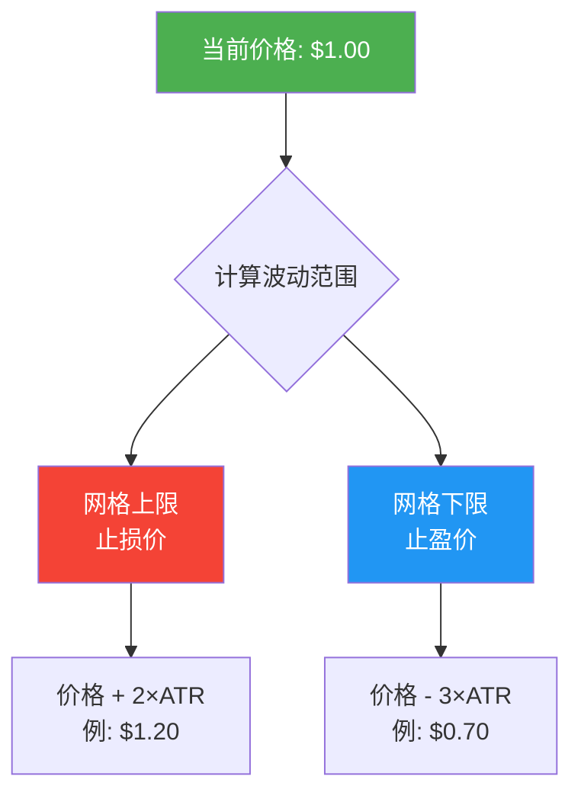

### 三个关键概念

#### 1️⃣ **ATR（平均真实波幅）** - 价格波动的"尺子"

**通俗解释**：
- ATR就是"这个币平均每天能涨跌多少钱"
- 比如：BTC的ATR是$500，意味着它平均每天上下波动500美元

**为什么需要ATR？**
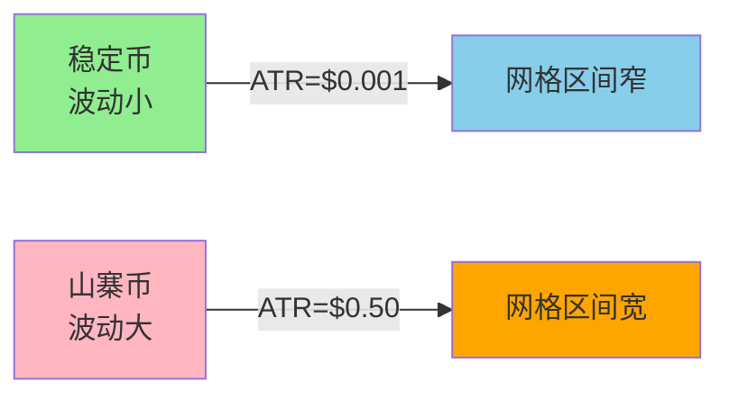

**ATR的计算**：
```
ATR = 过去14天价格波动的平均值

例如：
- 第1天波动 $0.10
- 第2天波动 $0.12
- 第3天波动 $0.09
- ...
- 第14天波动 $0.11

ATR ≈ ($0.10 + $0.12 + ... + $0.11) ÷ 14
```

#### 2️⃣ **网格上限** - 止损线（做空策略）

**公式**：
```
网格上限 = 当前价格 + 2 × ATR（日线）
```

**实际例子**：
```
假设：
- 当前价格 = $1.00
- ATR日线 = $0.10

计算：
网格上限 = $1.00 + 2 × $0.10 = $1.20
```

**含义**：
- 价格涨到 $1.20 就**止损退出**（太高了，别做空了）
- 用 `2×ATR` 是因为：统计学上，价格突破2倍标准差的概率只有5%


#### 3️⃣ **网格下限** - 止盈线（做空策略）

**公式**：
```
网格下限 = 当前价格 - 3 × ATR（日线）
```

**实际例子**：
```
假设：
- 当前价格 = $1.00
- ATR日线 = $0.10

计算：
网格下限 = $1.00 - 3 × $0.10 = $0.70
```

**含义**：
- 价格跌到 $0.70 就**止盈收割**（目标达成！）
- 用 `3×ATR` 是因为：做空赚的是下跌，给更大空间


**为什么上限和下限不对称？**

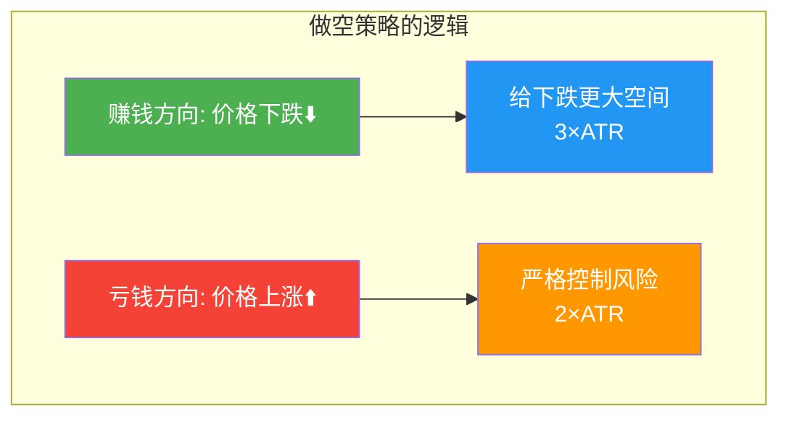

---

## 🪜 网格步长：多少钱挂一单？

**公式**：
```
网格步长 = 0.5 × ATR（小时线）
```

### 为什么用小时ATR？

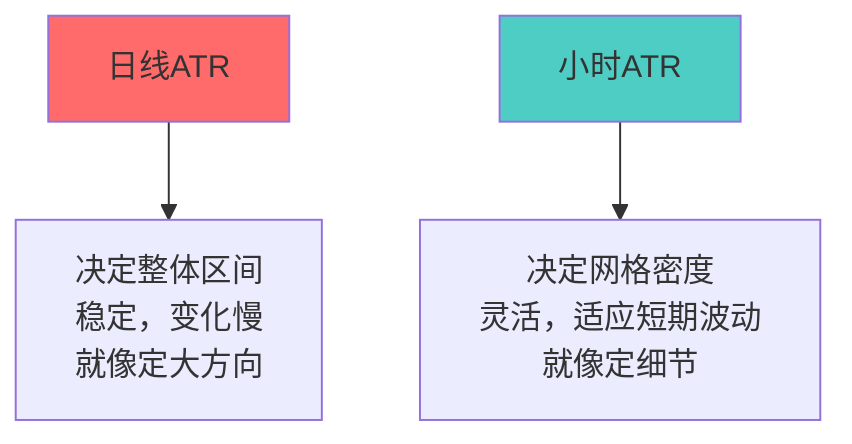

**形象比喻**：
- **日线ATR**：像城市规划，定大区域（上限到下限）
- **小时ATR**：像街道规划，定小间隔（每隔多少钱挂单）

### 实际例子

```
假设：
- 当前价格 = $1.00
- ATR小时线 = $0.02

计算：
网格步长 = 0.5 × $0.02 = $0.01

意思是：
- 每隔 $0.01 挂一个订单
- $1.00, $0.99, $0.98, $0.97... 每个价格都有单
```

### 可视化网格

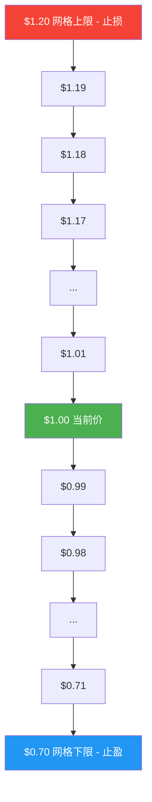

---

## 🔢 完整计算流程

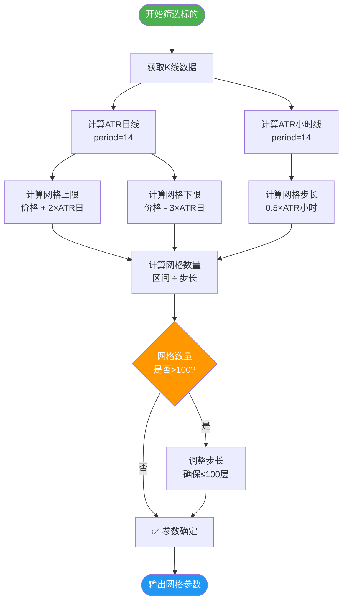

---

## 📊 真实案例：BATUSDT

### 输入数据
```
标的：BATUSDT
当前价格：$0.2693
ATR日线：$0.0419
ATR小时线：$0.0026
```

### 第1步：计算网格上限
```
网格上限 = $0.2693 + 2 × $0.0419
         = $0.2693 + $0.0838
         = $0.3531

💡 意思：价格涨到$0.3531就止损
```

### 第2步：计算网格下限
```
网格下限 = $0.2693 - 3 × $0.0419
         = $0.2693 - $0.1257
         = $0.1436

💡 意思：价格跌到$0.1436就止盈
```

### 第3步：计算网格步长
```
网格步长 = 0.5 × $0.0026
         = $0.0013

💡 意思：每隔$0.0013挂一个订单
```

### 第4步：计算网格数量
```
网格区间 = $0.3531 - $0.1436 = $0.2095
网格数量 = $0.2095 ÷ $0.0013 + 1 ≈ 162层

💡 意思：从$0.1436到$0.3531，需要挂162个订单
```

### 第5步：调整到100层（超限处理）
```
因为162层 > 100层限制（系统规定最多100层）

调整后步长 = $0.2095 ÷ 100 ≈ $0.0021
最终网格数量 = 100层

💡 意思：为了不超过100层，把步长从$0.0013调整到$0.0021
```

### 可视化结果

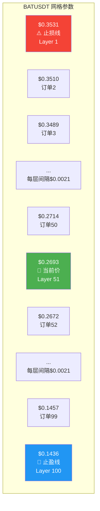

---

## 🎨 为什么是这些数字？

### 问题1：为什么上限是 `2×ATR`，下限是 `3×ATR`？

**答案**：做空策略的不对称设计

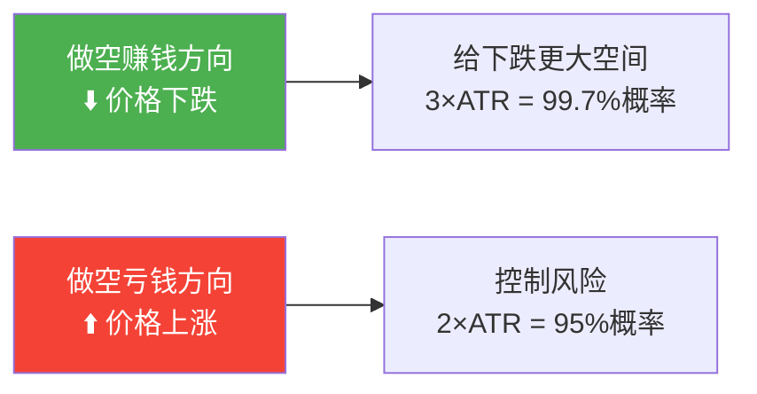

**统计学依据**：
```
假设价格波动符合正态分布（钟形曲线）：

1×ATR: 68.3%概率（价格在这个范围内）
2×ATR: 95.4%概率（价格突破的概率只有4.6%）
3×ATR: 99.7%概率（价格突破的概率只有0.3%）
```

**图示**：
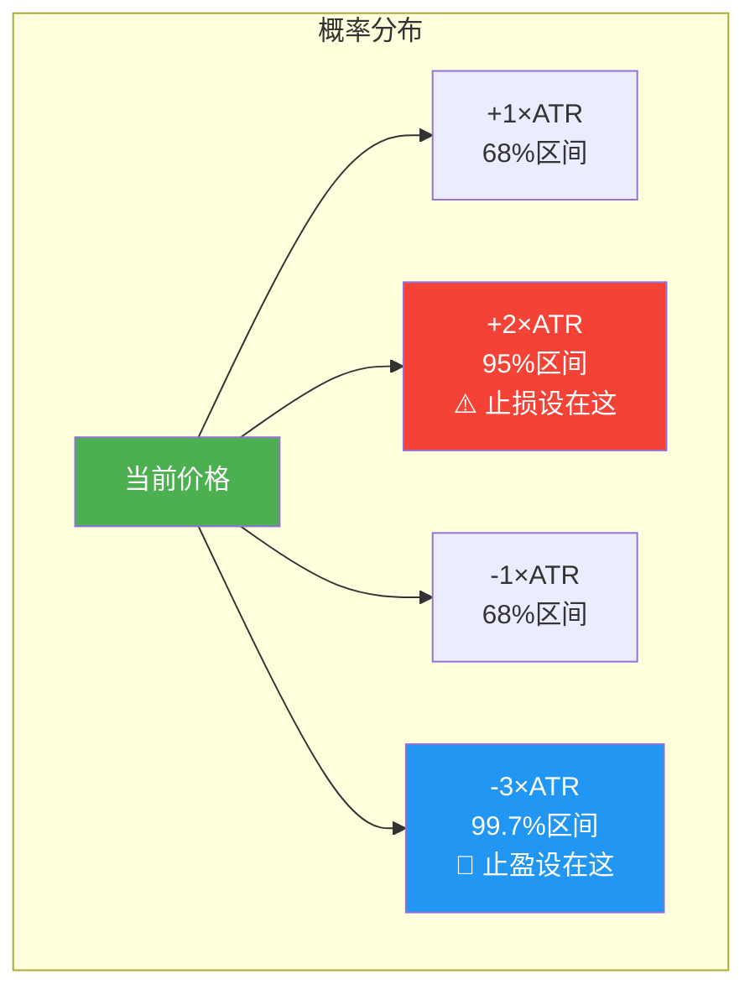

### 问题2：为什么步长是 `0.5×ATR`？

**权衡表**：

| 步长倍数 | 网格密度 | 优点 | 缺点 | 适用场景 |
|---------|---------|------|------|---------|
| **0.3×ATR** | 很密集 | 成交频繁，收益积累快 | 手续费高，资金占用大 | 高频交易 |
| **0.5×ATR** | ✅ 适中 | 平衡频率与成本 | **推荐** | 日常使用 |
| **1.0×ATR** | 稀疏 | 手续费少，资金占用低 | 错过小波动 | 长期持有 |

**图示对比**：

```mermaid
graph TD
    subgraph "0.3×ATR (密集)"
        A1[$1.000] --> A2[$0.994]
        A2 --> A3[$0.988]
        A3 --> A4[$0.982]
        A4 --> A5[$0.976]
        A5 --> A6[...更多层]
    end

    subgraph "0.5×ATR (适中) ✅ 推荐"
        B1[$1.00] --> B2[$0.99]
        B2 --> B3[$0.98]
        B3 --> B4[$0.97]
        B4 --> B5[$0.96]
        B5 --> B6[...适中层数]
    end

    subgraph "1.0×ATR (稀疏)"
        C1[$1.00] --> C2[$0.98]
        C2 --> C3[$0.96]
        C3 --> C4[$0.94]
        C4 --> C5[...较少层]
    end

    style B1 fill:#4CAF50,color:#fff
```

**实际影响**：
```
假设：
- 价格区间：$0.70 - $1.20（$0.50区间）
- ATR小时线：$0.02

不同步长的对比：

0.3×ATR: 步长=$0.006 → 网格数=84层
0.5×ATR: 步长=$0.010 → 网格数=51层 ✅ 推荐
1.0×ATR: 步长=$0.020 → 网格数=26层
```

---

## 🛡️ 边界情况处理

### 情况1：网格数量超过100层

**为什么限制100层？**
- 交易所API限制
- 订单管理复杂度
- 资金分散过度

**处理流程**：

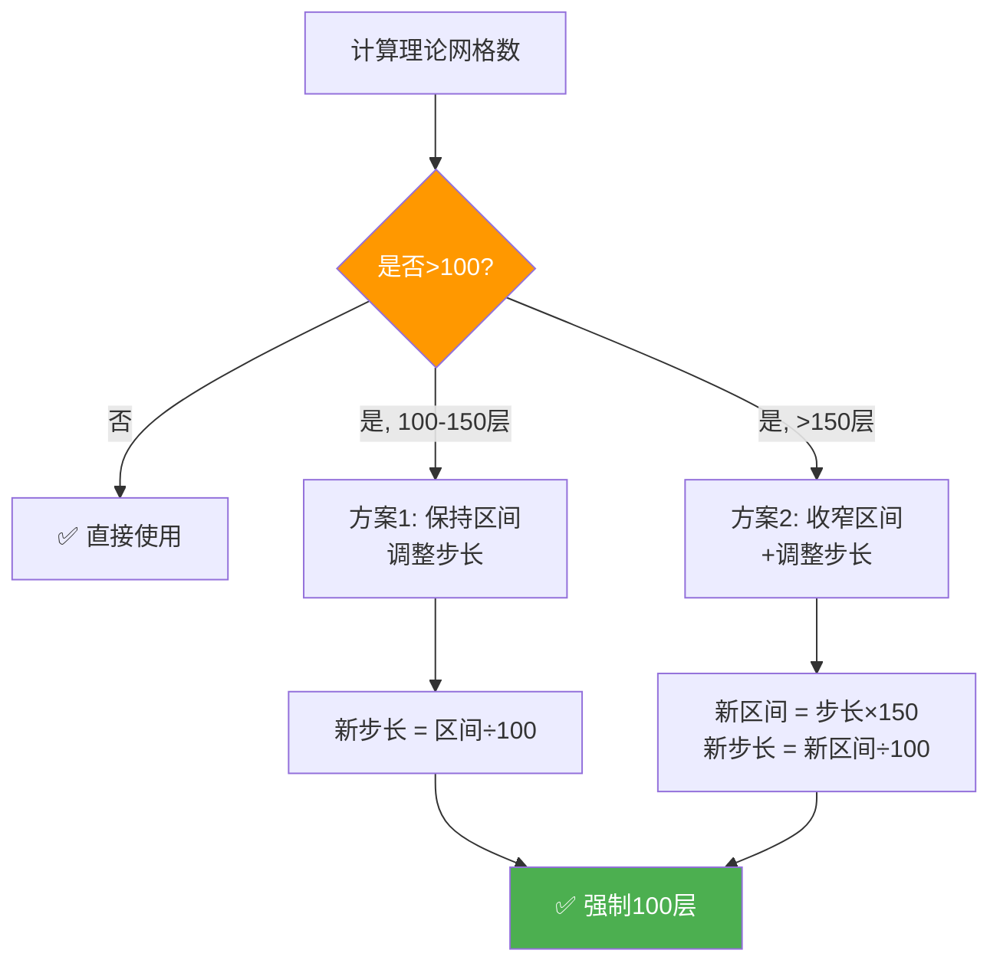

**实际例子**：
```
原始计算（AIAUSDT极端波动币种）：
- 网格上限：$0.9599
- 网格下限：$0.0001
- 网格步长：$0.0021
- 网格数量：377层 ❌ 超限！

调整后（方案2：收窄区间）：
- 目标区间 = 步长×150 = $0.0021×150 = $0.315
- 新上限 = 当前价 + $0.126 = $0.4536
- 新下限 = 当前价 - $0.189 = $0.1386
- 新步长 = $0.315÷100 = $0.00315
- 网格数量：100层 ✅
```

### 情况2：价格过低导致网格下限为负

**问题示例**：
```
极低价格币种：
- 当前价格 = $0.01
- ATR日线 = $0.005

理论下限 = $0.01 - 3 × $0.005 = -$0.005 ❌ 负数！
```

**修正方案**：
```python
# 下限保护：至少是价格的1%
实际下限 = max(理论下限, 当前价格 × 0.01)
         = max(-$0.005, $0.0001)
         = $0.0001 ✅
```

**图示**：
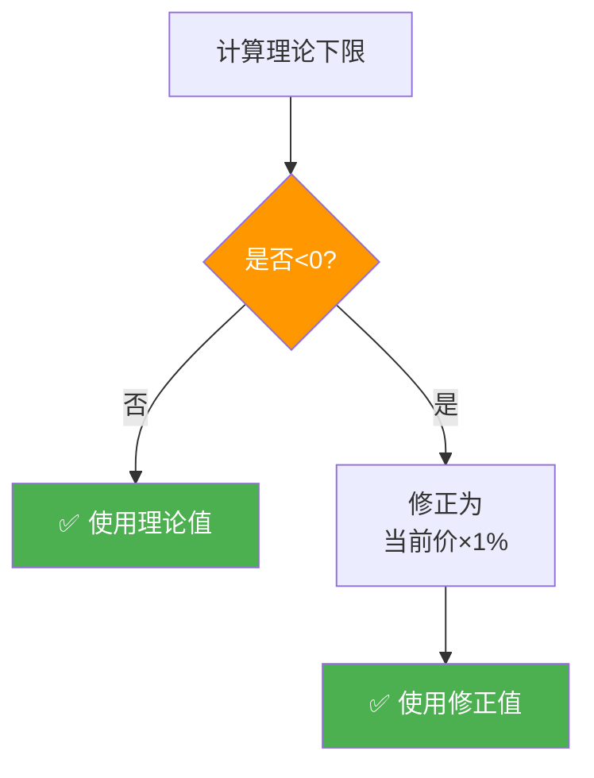

---

## 🎯 快速记忆口诀

```
📏 网格上限：当前价 + 2倍日ATR（止损线，控制风险）
📏 网格下限：当前价 - 3倍日ATR（止盈线，放大收益）
📏 网格步长：0.5倍小时ATR（挂单间隔，平衡频率）
📏 网格数量：区间除以步长（最多100层，系统限制）
```

**助记图**：
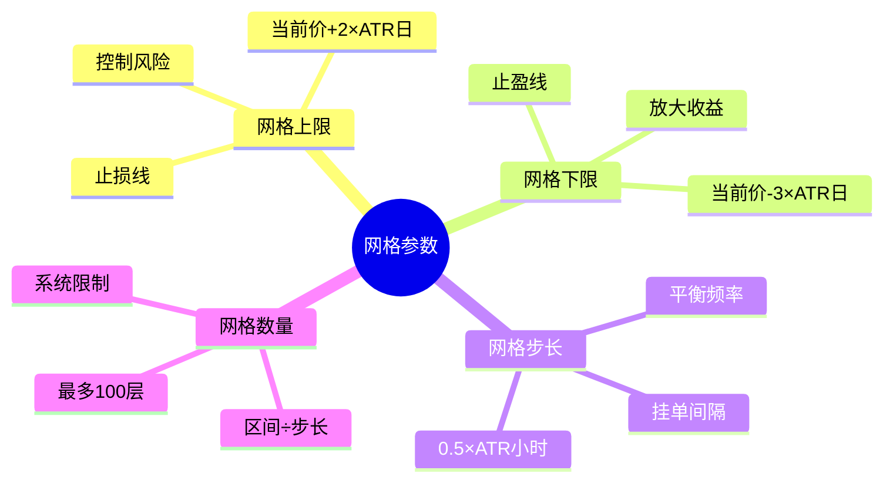

---

## 🧮 手算练习

### 练习题：计算ETHUSDT的网格参数

**已知条件**：
```
标的：ETHUSDT
当前价格：$2000
ATR日线：$100
ATR小时线：$8
```

**请计算**：
1. 网格上限 = ?
2. 网格下限 = ?
3. 网格步长 = ?
4. 网格数量 = ?

---

**答案**：

**第1步：网格上限**
```
网格上限 = 当前价格 + 2 × ATR日线
         = $2000 + 2 × $100
         = $2000 + $200
         = $2200
```

**第2步：网格下限**
```
网格下限 = 当前价格 - 3 × ATR日线
         = $2000 - 3 × $100
         = $2000 - $300
         = $1700
```

**第3步：网格步长**
```
网格步长 = 0.5 × ATR小时线
         = 0.5 × $8
         = $4
```

**第4步：网格数量**
```
网格区间 = 网格上限 - 网格下限
         = $2200 - $1700
         = $500

网格数量 = 区间 ÷ 步长 + 1
         = $500 ÷ $4 + 1
         = 125 + 1
         = 126层

⚠️ 超过100层限制！需要调整

调整后步长 = $500 ÷ 100 = $5
最终网格数量 = 100层
```

---

## 🔍 在代码中查看

**实现文件**：`grid_trading/models/screening_result.py:690-719`

```python
def calculate_grid_parameters(
    current_price: Decimal,
    atr_daily: float,      # 日线ATR
    atr_hourly: float,     # 小时ATR
    max_grids: int = 100   # 最大网格层数
) -> tuple:
    """
    计算网格交易参数

    Args:
        current_price: 当前价格
        atr_daily: 日线ATR (24小时K线, period=14)
        atr_hourly: 小时线ATR (1小时K线, period=14)
        max_grids: 最大网格层数，默认100

    Returns:
        (upper_limit, lower_limit, grid_count)
    """
    # 步骤1: 计算网格边界
    upper = current_price + Decimal(str(2 * atr_daily))  # 止损
    lower = current_price - Decimal(str(3 * atr_daily))  # 止盈

    # 下限保护（不能为负）
    lower = max(lower, current_price * Decimal('0.01'))

    # 步骤2: 计算网格步长
    grid_step = 0.5 * atr_hourly

    # 步骤3: 计算理论网格数量
    theoretical_count = int((float(upper - lower) / grid_step)) + 1

    # 步骤4: 超限处理
    if theoretical_count <= max_grids:
        # 无需调整
        return upper, lower, theoretical_count

    elif theoretical_count <= 150:
        # 轻微超限：仅调整步长
        adjusted_step = float(upper - lower) / max_grids
        return upper, lower, max_grids

    else:
        # 严重超限：收窄区间+调整步长
        target_range = grid_step * 150
        upper = current_price + Decimal(str(target_range * 0.4))  # 40%给上涨
        lower = current_price - Decimal(str(target_range * 0.6))  # 60%给下跌
        adjusted_step = float(upper - lower) / max_grids
        return upper, lower, max_grids
```

---

## 📚 相关文档

### 进阶阅读
- **[网格参数计算原理（技术版）](./grid_parameters_analysis.md)** - 详细技术文档，包含统计学原理
- **[网格数量优化方案](./grid_optimization_summary.md)** - 100层限制的优化策略
- **[挂单位置优化算法](./entry_algorithm_final.md)** - 智能挂单位置建议（v3.0已实施）

### 使用指南
- **[筛选系统快速开始](./SCREENING_QUICKSTART.md)** - 如何使用筛选系统
- **[推荐运行流程](./SCREENING_WORKFLOW.md)** - 详细的执行步骤

### 技术规格
- **[完整技术规格](../specs/001-short-grid-screening/spec.md)** - 系统设计文档
- **[项目架构](./PROJECT_ARCHITECTURE.md)** - 整体架构说明

---

## ❓ 常见问题

### Q1: ATR到底是什么？能再简单点吗？

**A**: 想象你每天上下班：
- 有时候堵车，要1.5小时
- 有时候畅通，只要0.5小时
- 平均来说，大概1小时

ATR就是价格的"平均通勤时间"，告诉你这个币的价格平均每天波动多少。

### Q2: 为什么做空的下限比上限大？

**A**: 做空就是"借货卖出，跌了再买回来还"：
- **上涨=亏钱**：所以上限要严格（2×ATR），快止损
- **下跌=赚钱**：所以下限要宽松（3×ATR），让利润跑

就像开车：
- 刹车（止损）要灵敏 → 2×ATR
- 油门（止盈）可以多踩 → 3×ATR

### Q3: 网格步长小一点，能赚更多吗？

**A**: 不一定！步长太小会：
- ❌ 手续费吃掉利润（每次交易都要手续费）
- ❌ 资金分散太多（每层订单金额变小）
- ❌ 管理成本增加（订单太多容易乱）

0.5×ATR是经过平衡的"黄金比例"。

### Q4: 100层限制够用吗？

**A**: 对于大多数币种够用！
- 正常波动币种：30-80层
- 高波动币种：80-100层
- 极端波动币种：需要调整参数

如果一个币波动大到需要超过100层，说明它可能不适合做网格交易（风险太大）。

### Q5: 我能手动修改这些参数吗？

**A**: 可以！但建议：
- ✅ 理解算法原理后再修改
- ✅ 小仓位测试修改效果
- ✅ 记录修改原因和结果
- ❌ 不要随意改动倍数（2×/3×/0.5×）

---

## 💡 学习路径建议

### 第1阶段：基础理解（你在这里 ✅）
- [x] 理解网格交易基本概念
- [x] 掌握上限、下限、步长计算
- [x] 能手算简单案例

### 第2阶段：实战应用
- [ ] 阅读 [筛选系统快速开始](./SCREENING_QUICKSTART.md)
- [ ] 运行一次完整筛选
- [ ] 查看HTML报告，理解各项参数

### 第3阶段：深入理解
- [ ] 阅读 [网格参数计算原理（技术版）](./grid_parameters_analysis.md)
- [ ] 理解ATR的数学原理
- [ ] 学习边界情况处理

### 第4阶段：策略优化
- [ ] 阅读 [挂单位置优化算法](./entry_algorithm_final.md)
- [ ] 理解如何选择最佳入场点
- [ ] 结合回测验证策略

---

## 🎓 总结

### 核心要点回顾

1. **网格上限 = 价格 + 2×ATR日** → 止损线（控制风险）
2. **网格下限 = 价格 - 3×ATR日** → 止盈线（放大收益）
3. **网格步长 = 0.5×ATR小时** → 挂单间隔（平衡频率）
4. **网格数量 ≤ 100层** → 系统限制（超限自动调整）

### 记忆技巧

```
做空网格233法则：
2️⃣ 上限用2倍ATR（止损）
3️⃣ 下限用3倍ATR（止盈）
3️⃣ 步长用0.5倍ATR（一半）
```

### 实战建议

✅ **Do（应该做）**：
- 先在小仓位测试
- 定期检查网格参数是否需要调整
- 关注ATR的变化趋势
- 结合市场环境判断

❌ **Don't（不要做）**：
- 不要在强趋势市场做网格
- 不要频繁修改参数
- 不要忽视止损线
- 不要用全部资金

---

**文档版本**: v1.0
**最后更新**: 2025-12-04
**适用系统**: 做空网格标的筛选系统

如果还有疑问，随时查看其他文档或提问！ 😊
