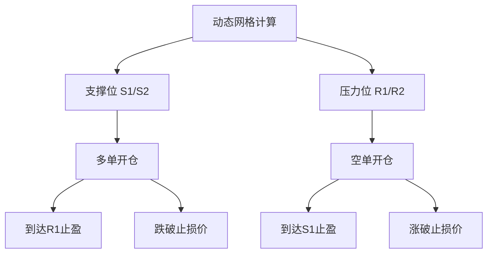
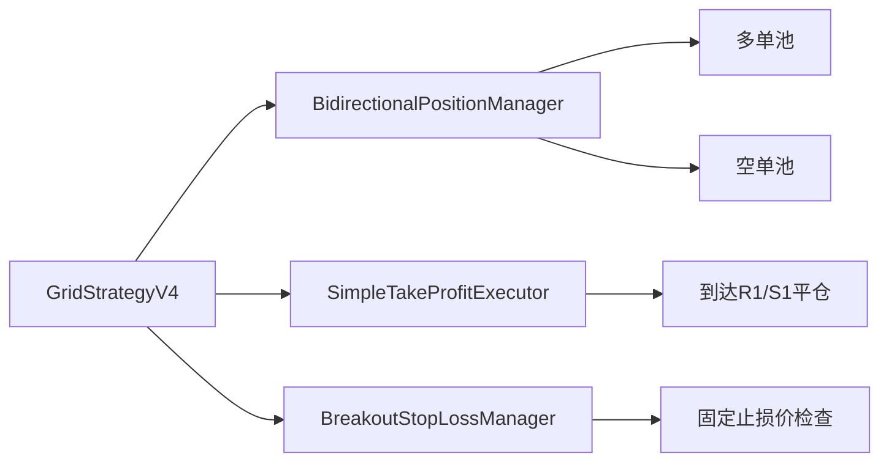

# 网格交易系统完整指南

**更新时间**: 2025-12-02
**版本**: v4.0.0
**适用范围**: Grid V1 / V2 / V3 / V4

---

## 📋 目录

1. [概述](#概述)
2. [策略对比](#策略对比)
3. [Grid V1 - 经典网格](#grid-v1---经典网格)
4. [Grid V2 - 动态4层网格](#grid-v2---动态4层网格)
5. [Grid V3 - 挂单系统](#grid-v3---挂单系统)
6. [Grid V4 - 双向交易](#grid-v4---双向交易)
7. [回测系统](#回测系统)
8. [常见问题](#常见问题)

---

## 概述

网格交易系统是项目的核心功能，提供四种策略版本，从基础的固定网格到高级的双向交易，满足不同交易需求。

### 核心特性

- ✅ **多版本支持**: V1 (经典) / V2 (动态4层) / V3 (挂单) / V4 (双向)
- ✅ **动态网格计算**: 基于VP Squeeze分析，自动计算支撑阻力位
- ✅ **多样化止盈**: 从简单全平到分级渐进式止盈
- ✅ **智能止损**: S2/R2±3%固定止损，缺失时使用成交价±3%
- ✅ **双向交易**: V4支持多空同时运作
- ✅ **Web可视化**: 实时回测播放器，K线图+交易标记
- ✅ **回测验证**: 完整的历史数据回测框架

### 适用场景

| 版本 | 适用场景 | 交易者类型 | 实现状态 |
|------|----------|-----------|----------|
| V1 | 简单网格交易，小资金 | 新手/保守型 | ✅ 已实现 |
| V2 | 动态网格，频繁交易 | 中级/积极型 | ✅ 已实现 |
| V3 | 大资金，严格风控 | 专业/量化型 | ✅ 已实现 |
| V4 | 双向套利，市场中性 | 专业/对冲型 | ✅ 已实现 |

---

## 策略对比

### 功能对比表

| 特性 | V1 (经典) | V2 (动态) | V3 (挂单) | V4 (双向) |
|------|-----------|-----------|-----------|-----------|
| **网格类型** | 固定价格 | 动态计算 | 动态计算 | 动态计算 |
| **网格层级** | 2层 | 4层 | 4层 | 4层 |
| **交易方向** | 仅多单 | 仅多单 | 仅多单 | **多空双向** |
| **开仓方式** | 价格触发 | 价格触发 | 挂单系统 | 价格触发 |
| **重复激活** | ❌ 单次 | ✅ 支持 | ✅ 支持 | ✅ 支持 |
| **冷却期** | ❌ | ❌ | ❌ | **✅ 20小时** |
| **止盈方式** | 一次性 | R1/R2分级 | R1/R2分级 | 一次性 |
| **止损机制** | 固定价 | 动态S2-3% | 动态S2-3% | **固定+兜底** |
| **资金管理** | 简单减法 | 现金约束 | 三重约束 | 双向分账 |
| **交易频率** | 低 | 中 | 中-高 | 中 |

### 性能对比（回测数据）

基于ETHUSDT 4h，2025全年数据（335天）：

| 指标 | V1 | V2 | V3 | V4 |
|------|----|----|----|----|
| **总收益率** | 23.97% | 20%+ | 13.28% | **11.95%** |
| **年化收益** | - | - | - | **13.13%** |
| **最大回撤** | 0.11% | <1% | - | **61.57%** |
| **夏普比率** | 2.44 | 2.0+ | - | - |
| **交易次数** | 4次 | 20-40次 | 9次 | **18次** |
| **胜率** | 100% | 80%+ | 0%* | **61.11%** |
| **盈亏比** | - | - | - | **1.74** |
| **市场环境** | 牛市 | 牛市 | 熊市 | 全年 |

*注：V3为2025年11个月测试（强烈熊市，跑赢市场9.6个百分点）

---

## Grid V4 - 双向交易

### 概述

Grid V4是最新的双向交易策略，**同时做多和做空**，实现市场中性策略，在震荡和单边市场中都能获利。

### 核心创新



### 关键特性

#### 1. 双向同时交易

```python
# 多单：在支撑位开仓
if current_price <= S1:
    open_long(S1, 20%)  # 固定仓位
if current_price <= S2:
    open_long(S2, 30%)

# 空单：在压力位开仓
if current_price >= R1:
    open_short(R1, 20%)
if current_price >= R2:
    open_short(R2, 30%)
```

#### 2. 智能止损策略

**多单止损**：
- 优先使用：S2 × 0.97（S2-3%）
- 兜底方案：买入价 × 0.97（买入价-3%，当S2缺失时）

**空单止损**：
- 优先使用：R2 × 1.03（R2+3%）
- 兜底方案：开空价 × 1.03（开空价+3%，当R2缺失时）

**特点**：
- ✅ 止损价在开仓时固定，不受后续价格变化影响
- ✅ 始终有有效止损，即使网格计算失败
- ✅ 检查每个仓位的固定止损价，逐一触发

#### 3. 冷却期机制

防止短时间内重复开仓：
- 检查最近20小时（5根4h K线）内是否有相同价位（±5%）的仓位
- 包括持仓中（open/partial）和已平仓（closed）的仓位
- 有效避免动态网格变化导致的频繁交易

#### 4. 一次性止盈

简化交易逻辑，提高资金效率：
- 多单：到达R1压力位，一次性全部卖出
- 空单：到达S1支撑位，一次性全部平仓
- 不再使用R1/R2分级渐进式卖出

### 实现架构



### 核心组件

| 组件 | 文件 | 职责 |
|------|------|------|
| **主策略** | `grid_strategy_v4.py` | 协调所有组件，执行交易逻辑 |
| **仓位管理** | `bidirectional_position_manager.py` | 管理多空双向仓位 |
| **止盈执行** | `simple_take_profit_executor.py` | 简单一次性止盈 |
| **止损管理** | `breakout_stop_loss_manager.py` | 固定止损价检查 |

### 数据库扩展

```python
# GridPosition Model新增字段
class GridPosition(models.Model):
    direction = models.CharField(
        max_length=10,
        choices=[('long', 'Long'), ('short', 'Short')],
        default='long'
    )
    # 多单：S2-3%或买入价-3%
    # 空单：R2+3%或开空价+3%
    stop_loss_price = models.DecimalField(max_digits=20, decimal_places=8)
```

### 使用示例

```bash
# 运行Grid V4回测
python manage.py run_backtest \
    --symbol ETHUSDT \
    --interval 4h \
    --strategy grid_v4 \
    --start-date 2025-01-01 \
    --end-date 2025-12-01 \
    --stop-loss 0.03

# 查看回测结果
# 访问: http://127.0.0.1:8001/backtest/player/
```

### 交易信号示例

**开仓信号**：
```
[INFO] ✅ 开多单: support_1 @ 3273.81, 数量=0.610909, 成本=$2002.00
[INFO] 🟢 S1开多单: position#1, 价格=3273.81, 止损价=3176.39
[INFO] ✅ 开空单: resistance_1 @ 2460.72, 数量=0.812770, 收入=$1998.00
[INFO] 🔴 R1开空单: position#2, 价格=2460.72, 止损价=2696.75
```

**止盈信号**：
```
[INFO] ✅ 平多单: position#1, take_profit, 价格=3400.00, 盈亏=+$126.19
[INFO] ✅ 平空单: position#2, take_profit, 价格=2300.00, 盈亏=+$130.59
```

**止损信号**：
```
[ERROR] 🛑 触发多单止损: 价格=3057.16, 待止损=1笔
[ERROR] 🛑 批量止损完成: LONG, 数量=1笔, 总盈亏=$-136.22
```

### Web可视化

访问回测播放器查看：
- 🟢 **绿色三角形**：买入标记（开多单/开空单）
- 🔴 **红色菱形**：卖出标记（止盈平仓）
- 🔵 **蓝色方形**：止损标记
- 📊 **网格线**：S1/S2支撑位，R1/R2压力位
- 📈 **账户价值曲线**：实时资金变化

### 优势与限制

**优势**：
- ✅ 双向交易，上涨下跌都能获利
- ✅ 市场中性策略，降低方向性风险
- ✅ 冷却期机制，避免过度交易
- ✅ 智能止损，始终有保护
- ✅ Web可视化，清晰展示交易过程

**限制**：
- ⚠️ 震荡市场表现最佳，趋势市场可能频繁止损
- ⚠️ 需要较大资金池支持双向交易
- ⚠️ 一次性止盈可能错过更大行情
- ⚠️ 多空同时持仓增加复杂度

---

## 回测系统

### Web播放器

功能特性：
- 📊 ECharts K线图实时渲染
- 🎮 播放/暂停/快进/后退控制
- 📍 点击K线查看持仓详情
- 🏷️ 交易标记（买入/卖出/止损）
- 📈 8个增强量化指标显示
- 💰 实时资金和盈亏统计

访问方式：
```bash
# 启动开发服务器（端口8001）
python manage.py runserver 8001

# 访问播放器
open http://127.0.0.1:8001/backtest/player/
```

### API端点

```
GET /backtest/api/backtests/          # 获取所有回测列表
GET /backtest/api/backtests/<id>/    # 获取回测详情
GET /backtest/api/backtests/<id>/snapshots/  # 获取快照列表
GET /backtest/api/backtests/<id>/snapshots/<index>/  # 获取单个快照
```

详细文档：
- [回测系统指南](./BACKTEST_SYSTEM_GUIDE.md)
- [Web API文档](./WEB_BACKTEST_API_GUIDE.md)
- [播放器使用指南](./WEB_BACKTEST_PLAYER_GUIDE.md)

---

## 常见问题

### Q1: 如何选择策略版本？

**A**: 根据你的交易风格和资金规模：
- **新手**：V1（简单固定网格）
- **积极交易**：V2（动态4层，频繁交易）
- **大资金严控**：V3（挂单系统，精确管理）
- **对冲套利**：V4（双向交易，市场中性）

### Q2: Grid V4为什么胜率61%但最大回撤61%？

**A**: 2025年经历了剧烈波动（1556-4426），多空双向持仓在趋势市场中会产生浮亏。但策略通过止损和止盈控制风险，最终实现正收益。

### Q3: 止损价为什么优先使用S2/R2而不是买入价？

**A**: S2/R2是关键支撑/压力位，跌破后通常意味着趋势反转。使用S2/R2±3%可以：
1. 给予价格合理的波动空间
2. 在关键位突破时及时止损
3. 当S2/R2缺失时，使用成交价±3%作为兜底

### Q4: 冷却期20小时的依据是什么？

**A**: 基于4小时K线：
- 5根K线 = 20小时
- 覆盖短期波动周期
- 避免动态网格变化导致的重复开仓
- 可通过参数调整：`cooldown_bars=5`

### Q5: 如何查看历史回测结果？

**A**:
```bash
# 方式1：Web播放器
open http://127.0.0.1:8001/backtest/player/

# 方式2：Django Admin
open http://127.0.0.1:8000/admin/backtest/backtestresult/

# 方式3：数据库查询
python manage.py shell
>>> from backtest.models import BacktestResult
>>> BacktestResult.objects.latest('created_at')
```

### Q6: Grid V4是否支持自定义仓位比例？

**A**: 当前固定为S1:20%, S2:30%, R1:20%, R2:30%。可通过修改`bidirectional_position_manager.py`中的比例参数自定义。

---

## 更新日志

### v4.0.0 (2025-12-02)
- ✨ **新增 Grid V4 双向交易策略**
- ✨ 智能止损：S2/R2±3%，兜底：成交价±3%
- ✨ 冷却期机制：20小时防重复开仓
- 🐛 修复止损价为0导致永不触发的bug
- 🐛 修复Web界面持仓详情显示bug
- 🐛 修复卖出标记颜色（红色=完全卖出）
- 📝 更新文档包含完整的Grid V4内容

### v3.0.0 (2025-11-30)
- ✨ 新增 Grid V3 挂单系统
- ✨ 三重资金约束管理
- ✨ R1/R2分级渐进式止盈
- 📊 Web回测播放器上线

### v2.0.0 (2025-11-25)
- ✨ 新增 Grid V2 动态4层网格
- ✨ VP Squeeze自动计算支撑阻力位
- ✨ 支持重复激活网格

---

**文档维护**: Claude Code
**最后更新**: 2025-12-02
**反馈渠道**: 项目Issue Tracker
