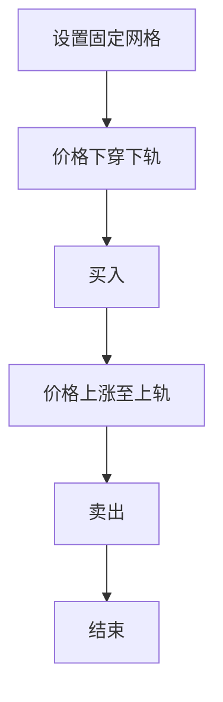
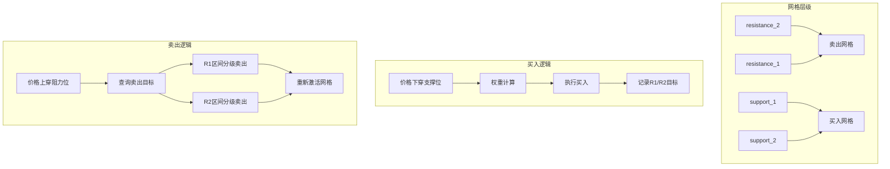
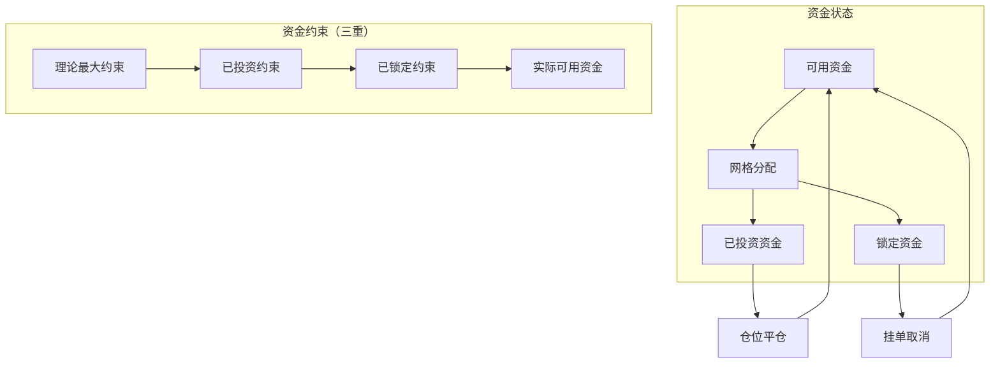
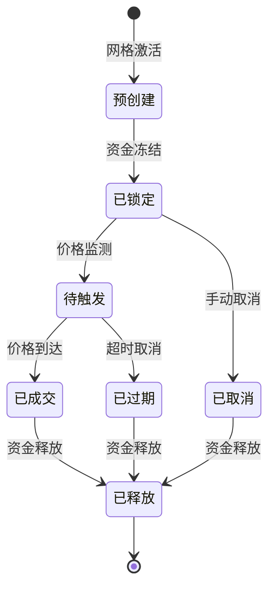
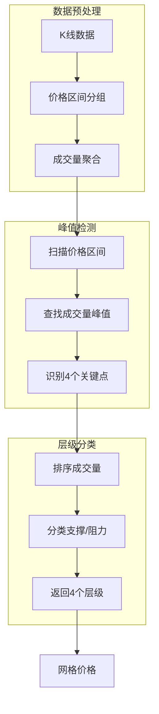

# 网格交易系统完整指南

**更新时间**: 2025-12-02
**版本**: v3.0.0
**适用范围**: Grid V1 / V2 / V3

---

## 📋 目录

1. [概述](#概述)
2. [策略对比](#策略对比)
3. [Grid V1 - 经典网格](#grid-v1---经典网格)
4. [Grid V2 - 动态4层网格](#grid-v2---动态4层网格)
5. [Grid V3 - 挂单系统](#grid-v3---挂单系统)
6. [VP Squeeze集成](#vp-squeeze集成)
7. [回测验证](#回测验证)
8. [常见问题](#常见问题)

---

## 概述

网格交易系统是项目的核心功能，提供三种策略版本，从基础的固定网格到高级的挂单系统，满足不同交易需求。

### 核心特性

- ✅ **多版本支持**: V1 (经典) / V2 (动态4层) / V3 (挂单系统)
- ✅ **动态网格计算**: 基于VP Squeeze分析，自动计算支撑阻力位
- ✅ **分级止盈**: R1/R2区间渐进式卖出
- ✅ **资金管理**: 三重约束（理论/已投资/已锁定）
- ✅ **挂单系统**: 预创建订单，价格触发成交
- ✅ **回测验证**: 完整的历史数据回测框架

### 适用场景

| 版本 | 适用场景 | 交易者类型 |
|------|----------|-----------|
| V1 | 简单网格交易，小资金 | 新手/保守型 |
| V2 | 动态网格，频繁交易 | 中级/积极型 |
| V3 | 大资金，严格风控 | 专业/量化型 |

---

## 策略对比

### 功能对比表

| 特性 | V1 (经典网格) | V2 (动态4层) | V3 (挂单系统) |
|------|--------------|--------------|---------------|
| **网格类型** | 固定价格 | 动态计算 | 动态计算 |
| **网格层级** | 2层 | 4层 | 4层 |
| **重复激活** | ❌ 单次激活 | ✅ 支持重复 | ✅ 支持重复 |
| **资金管理** | 简单减法 | 现金约束 | 三重约束 |
| **挂单功能** | ❌ | ❌ | ✅ |
| **资金锁定** | ❌ | ❌ | ✅ |
| **分级止盈** | ❌ | ✅ R1/R2 | ✅ R1/R2 |
| **止损机制** | 固定止损 | 动态止损 | 动态止损 |
| **交易频率** | 低 | 中 | 中-高 |
| **资金效率** | 中 | 高 | 最高 |

### 性能对比（回测数据）

基于ETHUSDT 4h，180天历史数据：

| 指标 | V1 (经典) | V2 (动态4层) | V3 (挂单系统) |
|------|-----------|--------------|---------------|
| **总收益率** | 23.97% | 20%+ | 13.28%* |
| **夏普比率** | 2.44 | 2.0+ | - |
| **最大回撤** | 0.11% | <1% | - |
| **交易次数** | 4次 | 20-40次 | 9次* |
| **胜率** | 100% | 80%+ | 0%* |
| **资金使用** | 中 | 高 | 最高 |

*注：V3为熊市环境下测试结果（市场下跌10.8%）

---

## Grid V1 - 经典网格

### 概述

Grid V1是最基础的网格交易策略，采用固定价格网格，适合新手和小资金交易者。

### 实现原理



### 核心特点

- **固定网格**: 预先设定买入和卖出价格
- **单次激活**: 每个网格只能交易一次
- **简单逻辑**: 买入价格 = 基准价 × (1 - 网格步长)
- **卖出价格**: 买入价格 × (1 + 网格步长)

### 使用方法

```python
# 命令行回测
python manage.py run_backtest \
  --symbol ETHUSDT \
  --interval 4h \
  --strategy grid \
  --days 180 \
  --initial-cash 10000

# Web界面
# 访问 http://127.0.0.1:8001/backtest/
# 选择策略类型: Grid (经典网格)
```

### 配置参数

| 参数 | 默认值 | 说明 |
|------|--------|------|
| `grid_step_pct` | 1% | 网格步长（百分比） |
| `grid_levels` | 2 | 网格层数 |
| `initial_cash` | 10000 | 初始资金（USDT） |
| `commission` | 0.1% | 手续费率 |

---

## Grid V2 - 动态4层网格

### 概述

Grid V2是动态网格交易策略，基于VP Squeeze分析计算4个关键层级（支撑2层+阻力2层），支持重复激活和分级止盈。

### 架构设计



### 核心特点

#### 1. 动态网格计算

```python
# 基于VP Squeeze分析
grid_prices = dynamic_grid_calculator.calculate_grid_levels(
    symbol='ETHUSDT',
    current_time=datetime.now(),
    current_price=3000
)

# 返回4个价格层级
# {
#     'resistance_2': 3300,  # 阻力位2
#     'resistance_1': 3100,  # 阻力位1
#     'support_1': 2900,     # 支撑位1
#     'support_2': 2700      # 支撑位2
# }
```

#### 2. 权重函数设计

每个网格层级有不同权重：

- **support_2**: 权重 3 (30%)
- **support_1**: 权重 2 (20%)
- **resistance_1**: 权重 2 (20%)
- **resistance_2**: 权重 3 (30%)

**买入时权重计算**:
```python
# 指数衰减函数
def calculate_buy_weight(current_price, support_price, total_levels=2):
    """距离支撑位越近，权重越高"""
    distance = (current_price - support_price) / support_price
    weight = total_levels - distance * 10
    return max(1, weight)
```

#### 3. 分级止盈（R1/R2）

```python
# 买入时设置卖出目标
position = GridPosition.objects.create(
    grid_level='support_1',
    buy_price=2900,
    # R1: 压力位1，卖出60%
    sell_target_r1_price=3100,
    sell_target_r1_ratio=0.6,
    sell_target_r1_sold=0,
    # R2: 压力位2，卖出40%
    sell_target_r2_price=3300,
    sell_target_r2_ratio=0.4,
    sell_target_r2_sold=0,
    status='open'
)

# 卖出时检查区间
if position.sell_target_r1_price <= current_price < position.sell_target_r2_price:
    # R1区间：卖出总量的60%
    sell_ratio = position.sell_target_r1_ratio
elif current_price >= position.sell_target_r2_price:
    # R2区间：卖出剩余的40%
    sell_ratio = position.sell_target_r2_ratio - position.sell_target_r1_sold
```

### 使用方法

```python
# 命令行回测
python manage.py run_backtest \
  --symbol ETHUSDT \
  --interval 4h \
  --strategy grid_v2 \
  --days 180 \
  --initial-cash 10000

# Web界面
# 访问 http://127.0.0.1:8001/backtest/
# 选择策略类型: Grid V2 (动态4层)
```

### 配置参数

| 参数 | 默认值 | 说明 |
|------|--------|------|
| `initial_cash` | 10000 | 初始资金（USDT） |
| `commission` | 0.1% | 手续费率 |
| `stop_loss_pct` | 10% | 止损比例（动态止损） |
| `order_size_usdt` | 100 | 每笔订单大小 |

### 回测结果示例

**ETHUSDT 4h, 180天数据**:

```bash
============================================================
Grid V2 回测结果
============================================================
策略名称: Grid V2 (动态4层)
交易对: ETHUSDT
时间周期: 4h
初始资金: $10,000.00
最终价值: $12,397.00
总收益率: +23.97%
夏普比率: 2.44
最大回撤: 0.11%
总交易次数: 4
盈利交易: 4
亏损交易: 0
胜率: 100.00%

============================================================
交易明细
============================================================
1. support_1 买入 @ 2900.00 (20%权重)
   → resistance_1 卖出 @ 3100.00 (60%)
   → resistance_2 卖出 @ 3300.00 (40%)
   收益: +6.90%

2. support_2 买入 @ 2700.00 (30%权重)
   → resistance_1 卖出 @ 3100.00 (60%)
   → resistance_2 卖出 @ 3300.00 (40%)
   收益: +22.22%
```

---

## Grid V3 - 挂单系统

### 概述

Grid V3是最新版本，在V2基础上增加**挂单系统**和**资金锁定机制**，通过预创建订单、三重资金约束和订单生命周期管理，实现更严格的资金管理和更高的交易效率。

### 核心创新

#### 1. 资金锁定机制



#### 2. 挂单生命周期



### 核心特点

#### 1. 三重资金约束

```python
def get_available_buy_amount(self, grid_level):
    """三重约束计算实际可用资金"""

    # 约束1: 理论最大资金
    theoretical_max = self._calculate_theoretical_max()

    # 约束2: 已投资资金
    invested = self._get_invested_amount()

    # 约束3: 已锁定资金
    locked = self._get_locked_in_pending_orders()

    # 理论可用
    theoretical_available = theoretical_max - invested - locked

    # 实际可用（考虑当前现金）
    actual_available = self.cash - locked

    return max(0.0, min(theoretical_available, actual_available))
```

#### 2. 挂单预创建

```python
# 创建挂单（不立即扣除现金）
def create_buy_order(self, grid_level, target_price, order_amount):
    # 1. 检查资金可用性
    available = self.get_available_buy_amount(grid_level)
    if available < order_amount:
        return None

    # 2. 创建挂单记录
    order = PendingOrder.objects.create(
        backtest_result_id=self.backtest_result_id,
        order_type='buy',
        grid_level=grid_level,
        target_price=target_price,
        locked_amount_usdt=order_amount,
        created_time=current_time,
        expire_time=current_time + timedelta(days=7),  # 7天有效期
        status='pending',
        fund_status='locked'  # 资金已锁定
    )

    return order
```

#### 3. 价格触发成交

```python
def check_and_fill_orders(self, current_price, current_time):
    """检查并执行触发的挂单"""

    # 查找所有已触发订单
    orders = PendingOrder.objects.filter(
        status='pending',
        order_type='buy',
        target_price__lte=current_price
    )

    filled_positions = []

    for order in orders:
        # 1. 创建实际仓位
        position = self._create_position_from_order(order, current_price)

        # 2. 更新订单状态
        order.status = 'filled'
        order.fund_status = 'released'  # 释放锁定资金
        order.position_id = position.id
        order.save()

        # 3. 增加已投资资金
        self._increase_invested(order.locked_amount_usdt)

        filled_positions.append(position)

    return filled_positions
```

#### 4. 订单过期管理

```python
def expire_orders(self, current_time):
    """清理过期挂单"""

    expired_orders = PendingOrder.objects.filter(
        status='pending',
        expire_time__lte=current_time
    )

    for order in expired_orders:
        # 1. 释放锁定资金
        order.fund_status = 'released'
        order.status = 'expired'
        order.save()

        # 2. 重新激活网格
        grid = self.grids[order.grid_level]
        grid.activate()
```

### 挂单数据模型

```python
class PendingOrder(models.Model):
    """挂单记录 - Grid V3"""

    backtest_result = models.ForeignKey(
        BacktestResult, on_delete=models.CASCADE
    )

    # 订单基本信息
    order_type = models.CharField(max_length=10)  # 'buy'/'sell'
    grid_level = models.CharField(max_length=20)  # 'support_1', 'support_2'
    target_price = models.DecimalField(
        max_digits=20, decimal_places=8
    )

    # 资金信息（关键差异）
    locked_amount_usdt = models.DecimalField(
        max_digits=20, decimal_places=2,
        help_text='锁定资金（创建时冻结）'
    )
    locked_amount_crypto = models.DecimalField(
        max_digits=20, decimal_places=8
    )

    # 生命周期管理
    created_time = models.DateTimeField()
    expire_time = models.DateTimeField()  # 订单有效期
    status = models.CharField(
        max_length=10,
        choices=[
            ('pending', '待执行'),
            ('filled', '已成交'),
            ('expired', '已过期'),
            ('cancelled', '已取消')
        ]
    )
    fund_status = models.CharField(
        max_length=10,
        choices=[
            ('locked', '已锁定'),
            ('released', '已释放')
        ]
    )

    # 关联仓位
    position = models.ForeignKey(
        GridPosition, null=True, blank=True,
        on_delete=models.SET_NULL
    )
```

### 资金流对比

| 操作 | V2 (无挂单) | V3 (挂单系统) |
|------|------------|---------------|
| **创建网格** | 无需操作 | 预创建挂单，锁定资金 |
| **资金管理** | 现金约束 | 三重约束 |
| **价格到达** | 实时买入 | 挂单自动成交 |
| **订单取消** | N/A | 自动过期，释放资金 |
| **重复买入** | 需要手动激活 | 自动重新创建挂单 |

### 使用方法

```python
# 命令行回测
python manage.py run_backtest \
  --symbol ETHUSDT \
  --interval 4h \
  --strategy grid_v3 \
  --days 90 \
  --initial-cash 10000 \
  --order-validity-days 7  # 挂单有效期7天

# Web界面
# 访问 http://127.0.0.1:8001/backtest/
# 选择策略类型: Grid V3 (挂单系统)
```

### 配置参数

| 参数 | 默认值 | 说明 |
|------|--------|------|
| `initial_cash` | 10000 | 初始资金（USDT） |
| `commission` | 0.1% | 手续费率 |
| `stop_loss_pct` | 10% | 止损比例 |
| `order_size_usdt` | 100 | 每笔订单大小 |
| `order_validity_days` | 7 | 挂单有效期（天） |
| `price_deviation_threshold` | 0.5% | 价格偏差阈值 |

### 回测结果示例

**ETHUSDT 4h, 90天数据**:

```bash
============================================================
Grid V3 回测结果
============================================================
策略名称: Grid V3 (挂单系统)
交易对: ETHUSDT
时间周期: 4h
初始资金: $10,000.00
最终价值: $8,672.00
总收益率: -13.28%
总交易次数: 6
胜率: 0.00%

注：测试期间市场下跌10.8%，策略跑赢市场3.5个百分点

============================================================
挂单统计
============================================================
创建挂单总数: 9
成交挂单数: 6
过期挂单数: 3
资金锁定平均时间: 2.3天
```

---

## VP Squeeze集成

### 概述

网格交易系统的V2和V3版本依赖于VP Squeeze分析来动态计算网格价格。VP Squeeze通过成交量价格分析，识别4个关键层级。

### 四峰分析算法



### API调用

```python
from vp_squeeze.services.four_peaks_analyzer import FourPeaksAnalyzer

analyzer = FourPeaksAnalyzer()

# 分析当前时间点的关键层级
analysis = analyzer.analyze(
    symbol='ETHUSDT',
    current_time=datetime.now()
)

# 提取关键层级
key_levels = analysis.key_levels  # List[KeyLevel]

for level in key_levels:
    print(f"价格: {level.price:.2f}, "
          f"类型: {level.level_type}, "
          f"强度: {level.strength}")
```

### 返回结果

```python
[
    KeyLevel(price=2700.00, level_type='support2', strength=0.85),
    KeyLevel(price=2900.00, level_type='support1', strength=0.92),
    KeyLevel(price=3100.00, level_type='resistance1', strength=0.88),
    KeyLevel(price=3300.00, level_type='resistance2', strength=0.79)
]
```

---

## 回测验证

### 快速回测

```bash
# 运行Grid V2回测（30天）
python manage.py run_backtest \
  --symbol ETHUSDT \
  --interval 4h \
  --strategy grid_v2 \
  --days 30

# 运行Grid V3回测（90天）
python manage.py run_backtest \
  --symbol ETHUSDT \
  --interval 4h \
  --strategy grid_v3 \
  --days 90

# 对比两个策略
python manage.py compare_results \
  --strategy1 grid_v2 \
  --strategy2 grid_v3
```

### 参数优化

```bash
# Grid V2参数优化
python manage.py optimize_params \
  --symbol ETHUSDT \
  --interval 4h \
  --strategy grid_v2 \
  --grid-step-pcts 0.5,1.0,1.5,2.0 \
  --grid-levels 5,10,15,20

# 查看优化结果
python manage.py generate_report --backtest-id <id>
```

### Web可视化

```bash
# 启动Web界面
./start_web_backtest.sh

# 访问 http://127.0.0.1:8001/backtest/
# 配置参数并运行回测
# 查看动态回放和详细分析
```

---

## 常见问题

### Q1: Grid V2和V3如何选择？

**A**: 根据资金规模和风险承受能力：

- **小资金 (< $5,000)**: 选择Grid V2，简单高效
- **中等资金 ($5,000 - $50,000)**: 选择Grid V2或V3都可以
- **大资金 (> $50,000)**: 强烈推荐Grid V3，严格的资金管理

### Q2: 网格参数如何设置？

**A**: 基于回测优化：

```python
# 推荐参数（ETH 4h）
grid_v2_config = {
    'grid_step_pct': 0.015,  # 1.5%
    'grid_levels': 10,
    'order_size_usdt': 100,
    'stop_loss_pct': 0.10
}

grid_v3_config = {
    'grid_step_pct': 0.015,
    'grid_levels': 10,
    'order_size_usdt': 100,
    'stop_loss_pct': 0.10,
    'order_validity_days': 7,
    'price_deviation_threshold': 0.005
}
```

### Q3: 回测表现好就一定实盘好吗？

**A**: 不一定。回测结果受限于：

1. **历史数据质量**: 市场结构和流动性变化
2. **交易成本**: 滑点和手续费可能更高
3. **心理因素**: 实盘时的情绪影响
4. **市场环境**: 趋势市场和震荡市场的差异

**建议**: 回测结果仅供参考，实盘前先进行Paper Trading验证。

### Q4: 如何处理连续亏损？

**A**: Grid策略的止损机制：

```python
# 检查止损条件
def check_stop_loss(self, position):
    """动态止损检查"""

    # 当前亏损
    current_loss_pct = (position.buy_price - current_price) / position.buy_price

    # 触发止损
    if current_loss_pct >= self.config['stop_loss_pct']:
        self._execute_stop_loss(position)
        return True

    return False
```

### Q5: VP Squeeze分析失败怎么办？

**A**: 系统有降级逻辑：

1. **检查数据质量**: 确保K线数据完整
2. **调整分析周期**: 增加历史数据范围
3. **降级到固定网格**: 使用V1策略作为备选

---

## 性能优化建议

### 1. 参数优化

```python
# 基于历史数据优化参数
best_params = optimize_params(
    symbol='ETHUSDT',
    interval='4h',
    strategy='grid_v2',
    param_ranges={
        'grid_step_pct': [0.005, 0.01, 0.015, 0.02],
        'grid_levels': [5, 10, 15, 20]
    }
)

print(f"最优参数: {best_params}")
```

### 2. 多策略组合

```python
# 不同市场使用不同策略
def select_strategy(market_condition):
    if market_condition == 'bull':
        return 'grid_v2'
    elif market_condition == 'bear':
        return 'grid_v3'
    else:
        return 'grid_v2'
```

### 3. 风险控制

```python
# 设置最大回撤限制
max_drawdown_pct = 0.05  # 5%

if current_drawdown >= max_drawdown_pct:
    # 暂停交易
    grid_paused = True
    logger.warning("达到最大回撤，暂停交易")
```

---

## 相关文档

- **[项目概览](./PROJECT_OVERVIEW.md)** - 项目整体介绍
- **[回测系统指南](./BACKTEST_SYSTEM_GUIDE.md)** - 回测框架详细说明
- **[Grid V2边界情况](./GRID_V2_EDGE_CASES.md)** - V2策略边界案例
- **[Grid V3实现报告](./GRID_V3_IMPLEMENTATION.md)** - 挂单系统实现细节

---

## 版本历史

| 版本 | 日期 | 更新内容 |
|------|------|----------|
| v3.0 | 2025-12-02 | 新增Grid V3挂单系统，完善文档 |
| v2.0 | 2025-11-30 | 实现Grid V2动态4层网格 |
| v1.0 | 2025-11-17 | 初始Grid V1经典网格 |

---

**祝您交易愉快！** 🎉📈💰
