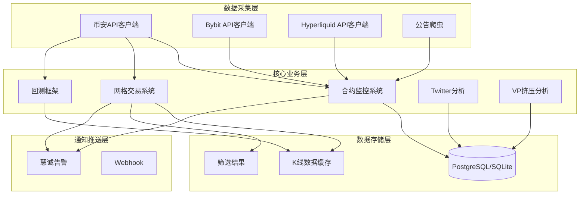
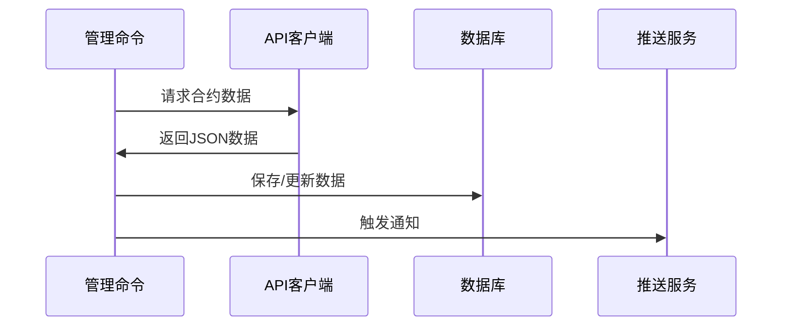
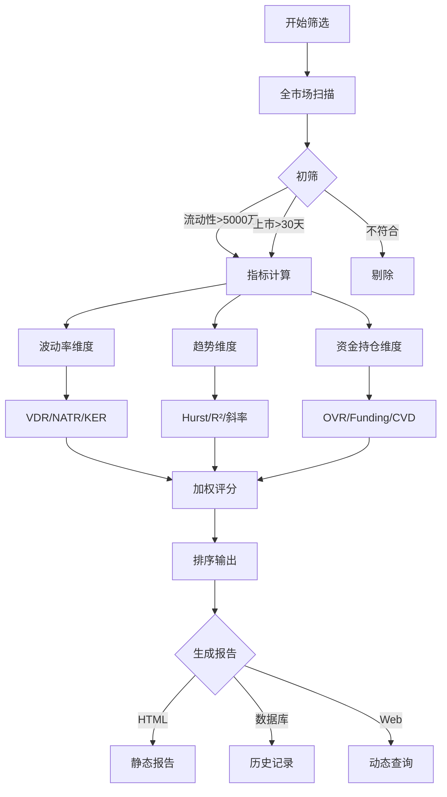
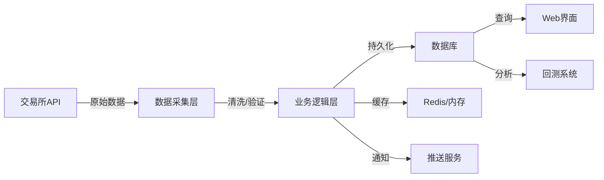

# 项目架构文档

**最后更新**: 2025-12-03
**版本**: v2.0

## 📐 系统架构概览

## 🏗️ 应用模块架构

### 1. Monitor (监控系统)

**路径**: `monitor/`

**职责**: 监控交易所公告和合约市场数据

**核心命令**:
- `fetch_futures` - 获取合约列表
- `update_futures_prices` - 更新合约价格
- `monitor_futures` - 实时监控合约指标
- `fetch_announcements` - 抓取交易所公告
- `identify_listings` - AI识别新币上线

**数据流**:

### 2. Grid Trading (网格交易系统)

**路径**: `grid_trading/`

**职责**: 网格交易策略与标的筛选

**核心命令**:
- `update_market_data` - 更新市场数据和K线缓存
- `screen_simple` - 简化筛选（VDR/KER/OVR/CVD四维）
- `screen_short_grid` - 完整筛选（三维指标体系）
- `cache_stats` - K线缓存统计
- `gridbot` - 网格交易机器人
- `strategy_monitor` - 策略监控

**筛选系统架构**:

**数据模型**:
- `SymbolInfo` - 合约基本信息缓存
- `KlineData` - K线数据缓存
- `ScreeningRecord` - 筛选记录
- `ScreeningResultModel` - 筛选结果

### 3. Backtest (回测框架)

**路径**: `backtest/`

**职责**: 网格策略回测与优化

**核心命令**:
- `run_backtest` - 执行回测
- `fetch_klines` - 获取历史K线
- `generate_report` - 生成回测报告
- `optimize_params` - 参数优化
- `visualize_results` - 可视化结果

**支持的策略**:
- Grid V1 - 经典固定网格
- Grid V2 - 动态4层网格
- Grid V3 - 挂单系统
- Grid V4 - 双向套利（最新）

### 4. Twitter (社交媒体分析)

**路径**: `twitter/`

**职责**: Twitter列表分析与AI摘要

**核心命令**:
- `collect_twitter_list` - 采集Twitter列表
- `analyze_twitter_list` - AI分析推文
- `run_analysis` - 批量分析
- `setup_push_notification` - 配置推送

### 5. VP Squeeze (成交量分布分析)

**路径**: `vp_squeeze/`

**职责**: 成交量剖面与价格挤压分析

**核心命令**:
- `vp_analysis` - VP分析
- `dual_box_analysis` - 双箱体分析
- `four_peaks_analysis` - 四峰分析

## 🔧 技术栈

### 后端
- **Django 5.1+** - Web框架
- **PostgreSQL/SQLite** - 数据库
- **Celery** - 异步任务队列
- **Redis** - 缓存

### 数据处理
- **pandas** - 数据分析
- **numpy** - 数值计算
- **vectorbt** - 回测框架
- **scikit-learn** - 机器学习

### API集成
- **python-binance** - 币安SDK
- **httpx** - HTTP客户端
- **websockets** - WebSocket客户端

### 前端
- **Django Templates** - 模板引擎
- **TailwindCSS** - CSS框架
- **Chart.js** - 图表库

## 📊 数据流向

## 🔐 安全与配置

### 环境变量
- `DJANGO_SECRET_KEY` - Django密钥
- `DATABASE_URL` - 数据库连接
- `BINANCE_API_KEY` - 币安API密钥
- `BINANCE_API_SECRET` - 币安API密钥
- `PUSH_WEBHOOK_URL` - 推送Webhook地址

### 配置文件
- `settings.py` - Django配置
- `environment.yml` - Conda环境
- `.gitignore` - Git忽略规则

## 📖 相关文档

- [使用指南](./USAGE_GUIDE.md)
- [网格交易指南](./GRID_TRADING_GUIDE.md)
- [回测系统指南](./BACKTEST_SYSTEM_GUIDE.md)
- [筛选系统指南](../specs/001-short-grid-screening/quickstart.md)
