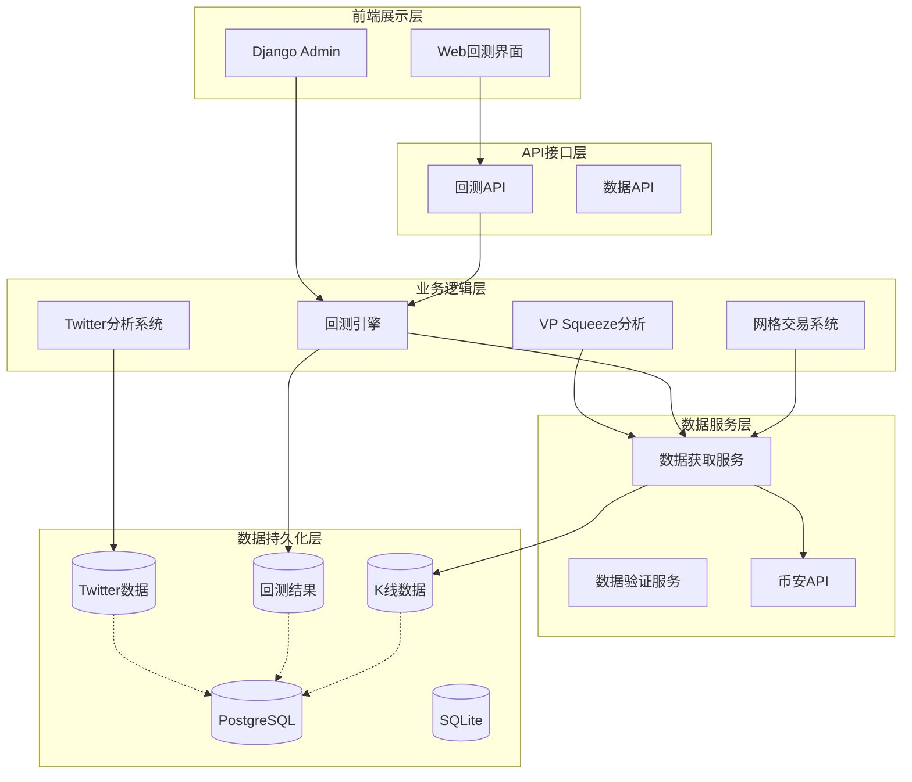
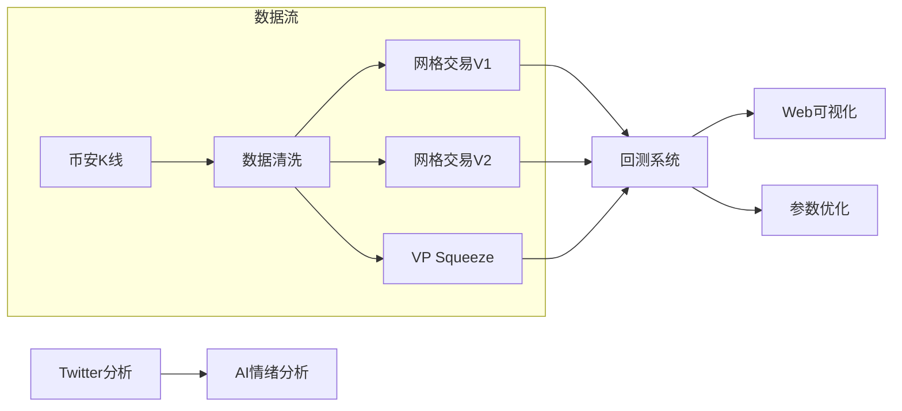
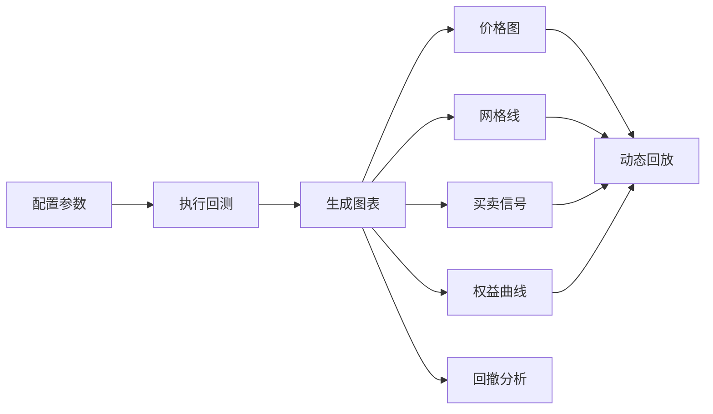

# 项目概览 - Crypto Exchange News Crawler

**更新时间**: 2025-12-02
**版本**: v3.0.0

---

## 📊 项目简介

这是一个专注于加密货币交易的综合系统，集成了**Twitter舆情分析**、**网格交易策略**、**历史数据回测**、**VP Squeeze分析**等多个核心功能模块。

### 核心特性

- ✅ **网格交易系统** (V1-V3): 支持动态网格、分级止盈、挂单管理
- ✅ **历史数据回测**: 基于vectorbt的专业回测框架，可视化分析
- ✅ **Twitter舆情分析**: 收集推文并使用AI进行市场情绪分析
- ✅ **VP Squeeze分析**: 成交量价格分析，识别关键支撑阻力位
- ✅ **Web可视化**: 交互式回测界面，实时策略回放
- ✅ **Django Admin**: 完整的数据管理和监控系统

---

## 🏗️ 系统架构

### 整体架构图



### 核心模块关系



---

## 📁 项目结构

```
crypto_exchange_news_crawler/
├── backtest/                          # 🆕 回测系统 (V3.0新增)
│   ├── models.py                      # KLine, BacktestResult, PendingOrder
│   ├── services/                      # 回测服务
│   │   ├── backtest_engine.py         # vectorbt回测引擎
│   │   ├── grid_strategy_v2.py        # 网格策略V2
│   │   ├── grid_strategy_v3.py        # 网格策略V3 (挂单系统)
│   │   ├── pending_order_manager.py   # 挂单管理器
│   │   └── position_manager.py        # 仓位管理器
│   ├── views.py                       # Web界面视图
│   ├── templates/backtest/            # Web界面模板
│   └── management/commands/           # 回测管理命令
│       ├── run_backtest.py            # 回测执行
│       ├── fetch_klines.py            # 数据获取
│       └── optimize_params.py         # 参数优化

├── twitter/                           # Twitter集成分析系统
│   ├── sdk/                           # API SDK
│   │   ├── twitter_sdk.py             # Twitter API
│   │   └── deepseek_sdk.py            # DeepSeek AI
│   ├── models/                        # 数据模型
│   │   ├── twitter_list.py            # List模型
│   │   ├── tweet.py                   # 推文模型
│   │   └── twitter_analysis_result.py # 分析结果
│   └── services/                      # 业务逻辑
│       ├── twitter_list_service.py    # 推文收集
│       ├── ai_analysis_service.py     # AI分析
│       └── orchestrator.py            # 流程编排

├── vp_squeeze/                        # VP Squeeze分析系统
│   ├── services/
│   │   ├── binance_kline_service.py   # 币安K线服务
│   │   └── four_peaks_analyzer.py     # 四峰分析器
│   └── dto.py                         # 数据传输对象

├── docs/                              # 项目文档
│   ├── PROJECT_OVERVIEW.md            # 项目概览 (本文档)
│   ├── PROJECT_SUMMARY.md             # Twitter功能总结
│   ├── USAGE_GUIDE.md                 # 使用指南
│   ├── GRID_TRADING_GUIDE.md          # 网格交易指南
│   ├── BACKTEST_SYSTEM_GUIDE.md       # 回测系统指南
│   └── ...

├── specs/                             # 技术规范文档
│   ├── 001-twitter-app-integration/   # Twitter集成规范
│   ├── 003-vp-squeeze-analysis/       # VP Squeeze规范
│   ├── 004-auto-grid-trading/         # 网格交易规范
│   └── 005-backtest-framework/        # 回测框架规范

└── config/                            # 配置文件
    ├── backtest.yaml                  # 回测配置
    └── ...
```

---

## 🚀 功能模块详述

### 1. 网格交易系统 (Grid Trading)

#### 网格策略 V1 - 经典网格
- **状态**: ✅ 已实现
- **特点**: 固定价格网格，简单买卖逻辑
- **文档**: [GRID_TRADING_GUIDE.md](./GRID_TRADING_GUIDE.md)

#### 网格策略 V2 - 动态4层网格
- **状态**: ✅ 已实现
- **特点**:
  - 动态网格计算（基于VP Squeeze分析）
  - 支持重复激活的4层网格
  - 分级止盈（R1/R2比例分配）
  - 渐进式买入/卖出算法
- **文档**: [GRID_TRADING_GUIDE.md](./GRID_TRADING_GUIDE.md)

#### 网格策略 V3 - 挂单系统
- **状态**: ✅ 已实现 (2025-11-30)
- **特点**:
  - 资金锁定机制（避免重复买入）
  - 挂单管理（预创建订单，价格触发）
  - 订单生命周期管理（创建/成交/过期）
  - 三重资金约束（理论/已投资/已锁定）
- **文档**: [GRID_TRADING_GUIDE.md](./GRID_TRADING_GUIDE.md)

#### 网格策略对比

| 特性 | V1 (经典网格) | V2 (动态4层) | V3 (挂单系统) |
|------|--------------|--------------|---------------|
| 网格类型 | 固定价格 | 动态计算 | 动态计算 |
| 网格层级 | 2层 | 4层 | 4层 |
| 重复激活 | ❌ | ✅ | ✅ |
| 资金管理 | 简单 | 现金约束 | 三重约束 |
| 挂单功能 | ❌ | ❌ | ✅ |
| 资金锁定 | ❌ | ❌ | ✅ |
| 分级止盈 | ❌ | ✅ | ✅ |

### 2. 回测系统 (Backtest Framework)

**技术栈**: vectorbt + pandas + Django

#### 核心功能
- ✅ **历史数据持久化**: K线数据存储，支持多币种多周期
- ✅ **专业回测引擎**: 基于vectorbt，支持复杂策略
- ✅ **参数优化**: 网格搜索，热力图可视化
- ✅ **结果分析**: 权益曲线、夏普比率、最大回撤
- ✅ **Web可视化**: 交互式回测界面，实时回放

#### 文档
- **使用指南**: [BACKTEST_SYSTEM_GUIDE.md](./BACKTEST_SYSTEM_GUIDE.md)
- **技术规范**: [specs/005-backtest-framework/IMPLEMENTATION_PLAN.md](../specs/005-backtest-framework/IMPLEMENTATION_PLAN.md)

#### Web界面特性


### 3. Twitter舆情分析系统

**技术栈**: Django + DeepSeek AI + Twitter API

#### 核心功能
- ✅ **推文收集**: 从Twitter List自动收集推文
- ✅ **AI分析**: 使用DeepSeek AI分析市场情绪
- ✅ **通知推送**: 分析完成/失败/成本告警
- ✅ **Django Admin**: 完整的管理界面

#### 文档
- **项目总结**: [PROJECT_SUMMARY.md](./PROJECT_SUMMARY.md)
- **使用指南**: [USAGE_GUIDE.md](./USAGE_GUIDE.md)
- **技术方案**: [docs/twitter-integration-solution.md](./twitter-integration-solution.md)

### 4. VP Squeeze分析系统

**技术栈**: Django + pandas + numpy

#### 核心功能
- ✅ **成交量价格分析**: 识别关键支撑阻力位
- ✅ **四峰分析**: 自动计算4个关键层级
- ✅ **动态网格**: 为Grid V2/V3提供价格参考

#### 文档
- **使用指南**: [VP_SQUEEZE_GUIDE.md](./VP_SQUEEZE_GUIDE.md)

---

## 🛠️ 技术栈

### 后端技术
- **框架**: Django 4.2.8
- **Python版本**: 3.8+ (主项目), 3.12 (新增模块)
- **数据库**: PostgreSQL 14+ (生产), SQLite (开发)
- **API**: Django REST Framework

### 数据分析
- **向量回测**: vectorbt 0.26.2
- **数据处理**: pandas 2.1.4, numpy 1.26.2
- **可视化**: matplotlib 3.8.2

### 外部服务
- **Twitter API**: apidance.pro代理
- **AI服务**: DeepSeek AI (deepseek-v3)
- **数据源**: 币安现货API v3
- **推送服务**: 慧诚推送平台

### 开发工具
- **测试**: pytest
- **代码检查**: ruff
- **部署**: Django runserver / Gunicorn

---

## 📋 快速开始

### 1. 环境准备

```bash
# 克隆项目
git clone <repository_url>
cd crypto_exchange_news_crawler

# 创建虚拟环境
conda create -n crypto python=3.12
conda activate crypto

# 安装依赖
pip install -r requirements.txt

# 配置环境变量
cp .env.example .env
# 编辑 .env 文件，配置API密钥
```

### 2. 数据库初始化

```bash
# 数据库迁移
python manage.py migrate

# 创建超级用户
python manage.py createsuperuser
```

### 3. 数据获取

```bash
# 获取ETH 4小时数据（6个月）
python manage.py fetch_klines --symbol ETHUSDT --interval 4h --days 180 --validate

# 查看数据统计
python manage.py shell
>>> from backtest.models import KLine
>>> KLine.objects.filter(symbol='ETHUSDT', interval='4h').count()
```

### 4. 运行回测

```bash
# 命令行回测
python manage.py run_backtest --symbol ETHUSDT --interval 4h --strategy grid_v3 --days 90

# 或启动Web界面
./start_web_backtest.sh
# 访问 http://127.0.0.1:8001/backtest/
```

### 5. Twitter分析

```bash
# 收集推文
python manage.py collect_twitter_list 1988517245048455250 --hours 24

# AI分析
python manage.py analyze_twitter_list 1988517245048455250 --hours 24

# 启动Django Admin
python manage.py runserver 0.0.0.0:8000
# 访问 http://localhost:8000/admin/
```

---

## 📊 系统性能

### 数据处理能力
- **K线数据**: 单次可获取>1000条（突破API限制）
- **数据验证**: 自动检测价格异常、时间缺口、成交量异常
- **存储效率**: 单币种6个月数据 < 10MB

### 回测性能
- **执行速度**: 6个月数据回测 < 10秒
- **内存使用**: < 50MB
- **图表渲染**: 1080个数据点 < 1秒

### Twitter分析
- **推文收集**: 19条推文 < 2秒
- **AI分析**: 8条推文 $0.0004（实际成本）
- **成本控制**: 自动预算保护，可配置上限

---

## 🔧 关键配置

### backtest.yaml (回测配置)

```yaml
# 回测系统配置
default:
  initial_cash: 10000          # 初始资金
  commission: 0.001            # 手续费率 (0.1%)
  slippage: 0.0005            # 滑点 (0.05%)

# 网格策略参数
grid_strategy:
  grid_step_pct:
    min: 0.005                 # 0.5%
    max: 0.02                  # 2%
    default: 0.01              # 1%

  grid_levels:
    min: 5
    max: 20
    default: 10

# 挂单系统参数
grid_v3:
  order_validity_days: 7       # 挂单有效期
  price_deviation_threshold: 0.005  # 价格偏差阈值
```

### 环境变量 (.env)

```bash
# Twitter API
TWITTER_API_KEY=your_key
TWITTER_API_BASE_URL=https://api.apidance.pro

# DeepSeek AI
DEEPSEEK_API_KEY=your_key
DEEPSEEK_BASE_URL=https://deepseek.wanjiedata.com/v1

# 币安API (可选，会自动使用公网)
BINANCE_API_KEY=your_key
BINANCE_SECRET=your_secret

# 通知推送
ALERT_PUSH_TOKEN=your_token
COST_ALERT_THRESHOLD=5.00
```

---

## 📚 文档导航

### 核心文档
- **[项目概览](./PROJECT_OVERVIEW.md)** - 完整项目介绍 (本文档)
- **[网格交易指南](./GRID_TRADING_GUIDE.md)** - V1/V2/V3策略详解
- **[回测系统指南](./BACKTEST_SYSTEM_GUIDE.md)** - 回测框架使用
- **[使用指南](./USAGE_GUIDE.md)** - Twitter功能完整说明

### 技术规范
- **[specs/005-backtest-framework/](../specs/005-backtest-framework/IMPLEMENTATION_PLAN.md)** - 回测框架设计
- **[specs/004-auto-grid-trading/](../specs/004-auto-grid-trading/)** - 网格交易设计
- **[specs/003-vp-squeeze-analysis/](../specs/003-vp-squeeze-analysis/)** - VP Squeeze分析

### 快速参考
- **[命令参考](./QUICK_REFERENCE.md)** - 所有管理命令
- **[API参考](./API_REFERENCE.md)** - Web API文档
- **[故障排查](./TROUBLESHOOTING.md)** - 常见问题解决

---

## 🎯 使用场景

### 场景1: 策略研究与回测
```bash
# 1. 获取历史数据
python manage.py fetch_klines --symbol ETHUSDT --interval 4h --days 180

# 2. 运行多参数回测
python manage.py optimize_params --symbol ETHUSDT --interval 4h

# 3. 查看优化结果
python manage.py generate_report

# 4. Web界面可视化
./start_web_backtest.sh
```

### 场景2: 实时策略监控
```bash
# 1. 配置定时任务
crontab -e
0 */4 * * * cd /path/to/project && python manage.py run_backtest --strategy grid_v3 --days 30

# 2. 查看Django Admin
python manage.py runserver 0.0.0.0:8000
# http://localhost:8000/admin/
```

### 场景3: Twitter舆情分析
```bash
# 1. 收集推文
python manage.py collect_twitter_list <list_id> --hours 24

# 2. AI分析
python manage.py analyze_twitter_list <list_id> --hours 24 --max-cost 5.0

# 3. 查看结果
python verify_data.py
```

---

## 🔮 发展规划

### 已实现功能 ✅
- [x] 网格交易系统 (V1-V3)
- [x] 挂单管理系统
- [x] 历史数据回测框架
- [x] Web可视化界面
- [x] Twitter舆情分析
- [x] VP Squeeze分析
- [x] 参数优化系统

### 计划功能 📋
- [ ] 更多网格策略 (V4: 智能自适应网格)
- [ ] 实盘交易接口 (CCXT集成)
- [ ] 多策略组合回测
- [ ] 机器学习预测模块
- [ ] Telegram Bot通知
- [ ] 移动端支持

### 优化方向 🚀
- [ ] Redis缓存加速
- [ ] 异步任务队列 (Celery)
- [ ] 多进程回测加速
- [ ] 实时数据推送 (WebSocket)
- [ ] 策略参数自动调优

---

## 🤝 贡献指南

### 代码规范
1. 遵循Django最佳实践
2. 使用类型注解 (Python 3.8+)
3. 添加单元测试
4. 遵循PEP 8代码风格
5. 更新相关文档

### 提交流程
1. Fork项目
2. 创建功能分支
3. 编写代码和测试
4. 运行测试套件
5. 提交Pull Request

### 测试要求
```bash
# 运行所有测试
python manage.py test

# 运行回测系统测试
python manage.py test backtest.tests

# 运行Twitter测试
python manage.py test twitter.tests

# 代码检查
ruff check .
```

---

## 📞 支持与反馈

- **文档问题**: 提交Issue到仓库
- **功能建议**: 创建Feature Request
- **Bug报告**: 使用Issue模板

---

## 📄 许可证

本项目采用MIT许可证。详见 [LICENSE](../LICENSE) 文件。

---

## 🙏 致谢

感谢以下开源项目和服务：

- **Django** - 强大的Web框架
- **vectorbt** - 专业的回测库
- **DeepSeek AI** - 高质量AI分析服务
- **币安** - 稳定的数据API
- **apidance.pro** - 可靠的Twitter API代理

---

**项目状态**: ✅ 生产就绪

**当前版本**: v3.0.0 (2025-12-02)

**维护者**: Crypto Trading Team

---

## 📊 文档版本历史

| 版本 | 日期 | 更新内容 |
|------|------|----------|
| v3.0.0 | 2025-12-02 | 新增Grid V3，完善回测系统，更新文档结构 |
| v2.0.0 | 2025-11-30 | 实现回测框架，优化Twitter分析 |
| v1.0.0 | 2025-11-17 | 初始版本，Twitter集成 |

---

**祝您使用愉快！** 🎉🚀✨
