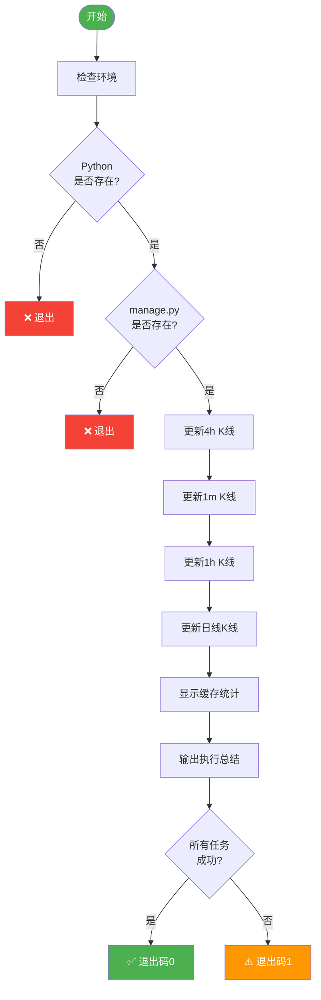

# 市场数据更新脚本使用说明

## 📄 脚本信息

**文件名**: `update_market_data.sh`
**位置**: 项目根目录
**功能**: 批量更新不同周期的K线数据缓存

---

## 🚀 快速使用

### 1. 基础用法（无成交量过滤）

```bash
# 在项目根目录执行
./update_market_data.sh
```

**更新内容**:
- 4小时K线：300根（约50天数据）
- 1分钟K线：1000根（约16.7小时数据）
- 1小时K线：200根（约8.3天数据）
- 日线K线：50根（约50天数据）

### 2. 添加成交量过滤

```bash
# 只更新24h成交量 ≥ 5000万的标的
./update_market_data.sh --min-volume 50000000

# 只更新24h成交量 ≥ 1亿的标的
./update_market_data.sh --min-volume 100000000
```

**使用场景**:
- 减少API调用次数
- 只关注流动性充足的标的
- 加快更新速度

---

## 📊 执行流程



---

## 💡 执行示例

### 示例1: 无过滤执行

```bash
$ ./update_market_data.sh

========================================================================
市场数据更新脚本
开始时间: 2025-12-04 17:00:00
========================================================================

[INFO] 2025-12-04 17:00:00 - 检查运行环境...
[INFO] 2025-12-04 17:00:00 - 使用Python: Python 3.12.0
[SUCCESS] 2025-12-04 17:00:00 - 找到manage.py

[INFO] 2025-12-04 17:00:01 - 开始执行 4 个更新任务...

========================================================================
[INFO] 2025-12-04 17:00:01 - [1/4] 更新 4h K线
========================================================================
[INFO] 2025-12-04 17:00:01 - 执行命令: python manage.py update_market_data --warmup-klines --interval 4h --limit 300

✓ 更新了 534 个合约的K线缓存
✓ 4h: 534 个标的, 160,200 根K线

[SUCCESS] 2025-12-04 17:02:30 - [1/4] 4h K线 更新完成 (耗时: 149秒)

========================================================================
[INFO] 2025-12-04 17:02:30 - [2/4] 更新 1分钟K线
========================================================================
...

========================================================================
执行总结
========================================================================
总任务数: 4
成功任务: 4
失败任务: 0
总耗时: 8分42秒
结束时间: 2025-12-04 17:08:42
========================================================================

[SUCCESS] 2025-12-04 17:08:42 - 所有更新任务执行成功！✅

[INFO] 2025-12-04 17:08:42 - 💡 下一步: 运行筛选命令
   python manage.py screen_simple --min-volume 100000000 --top-n 20
```

### 示例2: 带成交量过滤

```bash
$ ./update_market_data.sh --min-volume 100000000

[INFO] 2025-12-04 17:00:00 - 启用成交量过滤: 100000000

...（执行过程）

✓ 更新了 108 个合约的K线缓存（过滤后）
```

---

## ⚙️ 配置说明

### 可修改参数

如需调整K线数量，编辑脚本中的 `TASKS` 变量：

```bash
declare -A TASKS=(
    ["4h K线"]="--warmup-klines --interval 4h --limit 300"    # 改这里
    ["1分钟K线"]="--warmup-klines --interval 1m --limit 1000" # 改这里
    ["1小时K线"]="--warmup-klines --interval 1h --limit 200"  # 改这里
    ["日线K线"]="--warmup-klines --interval 1d --limit 50"    # 改这里
)
```

**推荐配置**:

| 周期 | 推荐数量 | 覆盖时长 | 用途 |
|------|---------|---------|------|
| 4h | 300根 | 50天 | NATR/KER/Hurst等主要指标 |
| 1m | 1000-1440根 | 16.7-24小时 | VDR核心指标（建议1440根=24小时） |
| 1h | 200根 | 8.3天 | 网格参数计算 |
| 1d | 50根 | 50天 | 网格参数计算 |

### 修改为1440根1分钟K线

如果需要完整的24小时VDR数据：

```bash
# 修改脚本第61行
["1分钟K线"]="--warmup-klines --interval 1m --limit 1440"
```

---

## 🔧 故障排查

### 问题1: 权限不足

**错误信息**:
```
-bash: ./update_market_data.sh: Permission denied
```

**解决方法**:
```bash
chmod +x update_market_data.sh
```

### 问题2: Python未找到

**错误信息**:
```
[ERROR] Python未找到，请确保Python已安装并在PATH中
```

**解决方法**:
```bash
# 检查Python
which python
python --version

# 如果使用conda环境，先激活
conda activate crypto_env
```

### 问题3: manage.py未找到

**错误信息**:
```
[ERROR] manage.py未找到，请在项目根目录运行此脚本
```

**解决方法**:
```bash
# 确保在项目根目录
cd /path/to/crypto_exchange_news_crawler
ls manage.py  # 应该能看到文件

# 然后再执行
./update_market_data.sh
```

### 问题4: 部分任务失败

**现象**:
```
执行总结
总任务数: 4
成功任务: 3
失败任务: 1
失败列表:
  ✗ 1分钟K线
```

**可能原因**:
1. API限流（请求过快）
2. 网络超时
3. 币安API异常

**解决方法**:
```bash
# 方法1: 单独重试失败的周期
python manage.py update_market_data --warmup-klines --interval 1m --limit 1000

# 方法2: 添加成交量过滤减少API调用
./update_market_data.sh --min-volume 50000000

# 方法3: 等待几分钟后重试
sleep 300  # 等待5分钟
./update_market_data.sh
```

---

## 📅 定时任务配置

### 使用cron定时更新

```bash
# 编辑crontab
crontab -e

# 添加定时任务（每天上午9点更新）
0 9 * * * cd /path/to/crypto_exchange_news_crawler && ./update_market_data.sh >> /tmp/market_data_update.log 2>&1

# 添加定时任务（每6小时更新一次）
0 */6 * * * cd /path/to/crypto_exchange_news_crawler && ./update_market_data.sh --min-volume 50000000 >> /tmp/market_data_update.log 2>&1
```

### 查看定时任务日志

```bash
# 查看最新日志
tail -f /tmp/market_data_update.log

# 查看最近100行
tail -n 100 /tmp/market_data_update.log

# 搜索错误信息
grep ERROR /tmp/market_data_update.log
```

---

## 🎯 最佳实践

### 1. 首次运行推荐配置

```bash
# 首次运行：更新所有合约（无过滤）
./update_market_data.sh

# 查看缓存统计
python manage.py cache_stats
```

### 2. 日常更新推荐配置

```bash
# 只更新流动性充足的标的（节省时间）
./update_market_data.sh --min-volume 50000000
```

### 3. 筛选前准备

```bash
# 步骤1: 更新数据（带过滤）
./update_market_data.sh --min-volume 100000000

# 步骤2: 执行筛选
python manage.py screen_simple --min-volume 100000000 --top-n 20

# 步骤3: 查看结果
python manage.py runserver
# 访问 http://127.0.0.1:8000/screening/
```

### 4. 监控和告警

```bash
# 脚本返回0表示成功，1表示失败
./update_market_data.sh
if [ $? -eq 0 ]; then
    echo "✅ 更新成功"
else
    echo "❌ 更新失败，请检查日志"
    # 可以在这里添加告警通知
fi
```

---

## 📚 相关文档

- [筛选系统快速开始](./docs/SCREENING_QUICKSTART.md)
- [推荐运行流程](./docs/SCREENING_WORKFLOW.md)
- [网格参数详解（小白版）](./docs/GRID_PARAMETERS_EXPLAINED_SIMPLE.md)

---

## 💻 脚本特性

### 优点

✅ **彩色输出**: 不同日志级别用不同颜色标识
✅ **进度显示**: 清晰显示当前任务进度（[1/4], [2/4]...）
✅ **错误处理**: 单个任务失败不影响其他任务
✅ **时间统计**: 显示每个任务和总耗时
✅ **缓存统计**: 自动显示更新后的缓存状态
✅ **执行总结**: 清晰的成功/失败任务列表
✅ **灵活配置**: 支持成交量过滤参数

### 退出码

- **0**: 所有任务执行成功
- **1**: 部分或全部任务失败

---

**创建时间**: 2025-12-04
**版本**: v1.0
**维护**: 根据需求可随时调整脚本参数
