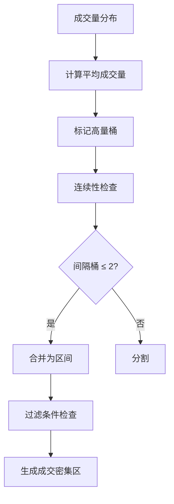
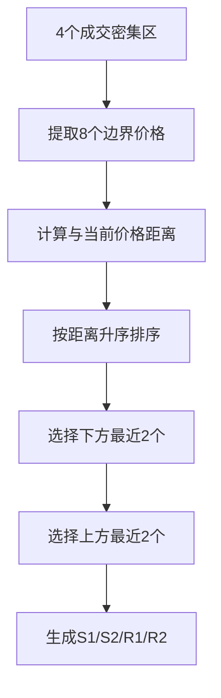

# VP-Squeeze 四峰分析系统 - 完整指南

## 概述

VP-Squeeze（四峰分析）是一个基于成交量聚类算法的技术分析工具，用于识别关键支撑和压力位，为交易决策提供数据支持。

### 核心价值

- **🎯 精准定位** - 基于真实成交量数据识别成交密集区
- **📊 客观分析** - 排除主观判断，使用算法自动提取关键价位
- **⚡ 高效决策** - 一键分析获得完整的支撑压力分析报告
- **🔔 实时推送** - 支持自动推送分析结果，及时把握市场机会

---

## 🔍 算法原理

### 成交量分布计算

VP-Squeeze基于**成交量分布图**（Volume Profile）原理，将历史K线数据中的成交量按价格区间进行分配：


**分配规则**：
1. **等宽分桶**：将价格范围划分为宽度为0.1%的桶
2. **比例分配**：单根K线的成交量按价格重叠比例分配到各个桶
3. **累计统计**：所有K线分配完成后得到完整的价格-成交量分布

### 连续性聚类算法

通过**连续性原则**识别成交密集区：



**关键参数**：
- **成交量阈值**：平均成交量 × 1.3（识别高量桶）
- **最小桶数**：3个（确保区间显著性）
- **最大间隔**：2个低量桶（维持连续性）
- **最小宽度**：0.3%（过滤过窄区间）

### 距离优先关键价位提取

从4个成交密集区提取8个边界价格（每个区间的low和high），**按距离当前价格排序**：



**距离计算公式**：
```
距离百分比 = (目标价格 - 当前价格) / 当前价格 × 100%
```

**核心特性**：
- ✅ **距离优先**：完全基于距离排序，不区分压力/支撑类型
- ✅ **灵活匹配**：S1和R1可来自同一区间（当前价格在区间内时）
- ✅ **动态调整**：每次分析重新计算，保证时效性

---

## 📋 功能特性

### 核心功能

| 功能 | 说明 | 优势 |
|------|------|------|
| **成交量分布计算** | 将K线成交量按价格分桶统计 | 客观反映真实交易密集区 |
| **密集区间识别** | 连续性算法识别4个独立区间 | 避免孤立高量点干扰 |
| **关键价位提取** | 从8个边界中选距离最近的4个 | 减少噪音，聚焦核心价位 |
| **支撑压力分析** | 自动识别S1/S2和R1/R2 | 提供完整的交易参考 |
| **推送通知集成** | 一键推送分析结果 | 及时把握市场机会 |

### 支持的时间周期

| 周期 | 特点 | 适用场景 |
|------|------|----------|
| **15m** | 短线敏感，区间数量少 | 日内交易，需要快速响应 |
| **1h** | 平衡短中期 | 短线到中线交易 |
| **4h** | **推荐**，稳定可靠 | **主力周期，最佳平衡** |
| **1d** | 长期趋势，区间稳定 | 长线投资，趋势分析 |

### 价格范围过滤

通过过滤百分比控制分析范围：
- **±15%**（默认）：覆盖大部分日常波动
- **±10%**：更聚焦当前价位，适合震荡行情
- **±20%**：更全面，适合突破行情

---

## 🚀 使用指南

### 独立分析脚本

使用 `example_four_peaks.py` 进行纯分析，无推送。

```bash
# 基本用法
python example_four_peaks.py --symbol eth --interval 4h

# 自定义参数
python example_four_peaks.py --symbol btc --interval 1h --price-range 0.10 --limit 100
```

**参数说明**：
- `--symbol`: 交易对符号（如 eth, btc, bnb）
- `--interval`: 时间周期（15m, 1h, 4h, 1d）
- `--price-range`: 价格范围过滤百分比（默认0.15）
- `--limit`: K线数量（默认100）

### 推送通知脚本

使用 `push_four_peaks_notification.py` 一键分析并推送结果。

```bash
# 自动推送分析结果
python push_four_peaks_notification.py --symbol eth --interval 4h

# 定时任务示例（每小时执行）
0 * * * * cd /path/to/project && python push_four_peaks_notification.py --symbol eth --interval 4h
```

**推送格式**：
- **标题**：`📊 {SYMBOL} ${当前价格} - 压力 ${R1}({距离%}) - 支撑 ${S1}({距离%}) ({时间})`
- **内容**：
  - 基本信息（交易对、周期、价格范围、当前价格）
  - 关键价位分析（S1/S2/R1/R2的详细数据）
  - 区间分布详情（4个成交密集区完整信息）
  - 简洁摘要（一行展示核心数据）

---

## 📊 输出示例

### 控制台输出示例

```bash
执行 ETH (4h) 四峰分析...

[INFO] 获取K线数据: ETHUSDT 4h limit=100
[INFO] 成功获取 100 根K线

✅ 分析完成！

【基本信息】
交易对: ETH
周期: 4h
价格范围: ±15%
当前价格: $2815.43

【关键价位分析】
📈 压力位:
  R1: $2838.85 (+0.50%)
      来源: 区间3 的 high 边界
      成交量: 819,448 (7.7%)
  R2: $2994.21 (+6.00%)
      来源: 区间2 的 low 边界
      成交量: 1,045,867 (9.8%)

💰 当前价格: $2815.43

📉 支撑位:
  S1: $2793.66 (-1.10%)
      来源: 区间3 的 low 边界
      成交量: 819,448 (7.7%)
  S2: $2752.56 (-2.23%)
      来源: 区间4 的 high 边界
      成交量: 754,234 (7.1%)

【区间分布详情】
共识别出 4 个成交密集区间:

区间1: [$2992.80, $3054.74]
  成交量: 1,045,867 (9.8%)
  宽度: $61.94 (2.20%)
  位置: 上方 (偏离 6.99%)

区间2: [$2792.91, $2840.77]
  成交量: 819,448 (7.7%)
  宽度: $47.86 (1.70%)
  位置: 下方 (偏离 0.04%)

...

【摘要】
当前: $2815.43 | 支撑: $2792.91, $2752.56 | 压力: $2838.77, $2994.21
```

### 推送通知示例

```text
📊 ETH $2812.03 - 支撑 $2789.53(-0.8%) $2750.17(-2.2%) - 压力 $2842.96(+1.1%) (2025-11-24 22:52)

【基本信息】
交易对: ETH
周期: 4h
价格范围: ±15%
当前价格: $2815.43

【关键价位分析】

📈 压力位:
  R2: $2994.21 (+6.00%)
      来源: 区间2 的 low 边界
      成交量: 1,045,867 (9.8%)
  R1: $2838.85 (+0.50%)
      来源: 区间3 的 high 边界
      成交量: 819,448 (7.7%)

💰 当前价格: $2815.43

📉 支撑位:
  S1: $2793.66 (-1.10%)
      来源: 区间3 的 low 边界
      成交量: 819,448 (7.7%)
  S2: $2752.56 (-2.23%)
      来源: 区间4 的 high 边界
      成交量: 754,234 (7.1%)

【区间分布详情】
共识别出 4 个成交密集区间:

区间1: [$2992.80, $3054.74]
  成交量: 1,045,867 (9.8%)
  宽度: $61.94 (2.20%)
  位置: 上方 (偏离 6.99%)

区间2: [$2792.91, $2840.77]
  成交量: 819,448 (7.7%)
  宽度: $47.86 (1.70%)
  位置: 下方 (偏离 0.04%)

...

【摘要】
当前: $2815.43 | 支撑: $2792.91, $2752.56 | 压力: $2838.77, $2994.21
```

---

## ⚙️ 配置与集成

### 推送服务配置

默认使用项目内置的慧诚告警推送服务：

```python
# 默认配置
AlertPushService(
    token="6020867bc6334c609d4f348c22f90f14",
    channel="symbal_rate"
)
```

如需使用自定义推送服务：

```bash
python push_four_peaks_notification.py \
  --symbol eth \
  --interval 4h \
  --token YOUR_CUSTOM_TOKEN \
  --channel YOUR_CUSTOM_CHANNEL
```

### 定时任务配置

#### 方式1：直接执行

```bash
# 每小时执行一次ETH分析
0 * * * * cd /path/to/project && python push_four_peaks_notification.py --symbol eth --interval 4h

# 每4小时执行一次BTC分析
0 */4 * * * cd /path/to/project && python push_four_peaks_notification.py --symbol btc --interval 4h
```

#### 方式2：系统服务

创建systemd服务文件 `/etc/systemd/system/vp-squeeze.service`：

```ini
[Unit]
Description=VP-Squeeze Analysis Service
After=network.target

[Service]
Type=simple
User=your_user
WorkingDirectory=/path/to/project
ExecStart=/path/to/venv/bin/python push_four_peaks_notification.py --symbol eth --interval 4h
Restart=always
RestartSec=300

[Install]
WantedBy=multi-user.target
```

启动服务：
```bash
sudo systemctl enable vp-squeeze
sudo systemctl start vp-squeeze
```

---

## 🔧 高级用法

### 批量分析多个交易对

创建脚本 `batch_analysis.sh`：

```bash
#!/bin/bash

SYMBOLS=("eth" "btc" "bnb" "sol" "xrp")
INTERVAL="4h"

for symbol in "${SYMBOLS[@]}"; do
    echo "分析 $symbol..."
    python push_four_peaks_notification.py \
        --symbol "$symbol" \
        --interval "$INTERVAL" \
        --price-range 0.15
    sleep 5  # 避免API频率限制
done
```

### 自定义分析脚本

复用核心分析函数：

```python
# 导入分析函数
from example_four_peaks import analyze_four_peaks

# 执行分析
clusters, key_levels, current_price = analyze_four_peaks(
    symbol="eth",
    interval="4h",
    price_range_pct=0.15,
    limit=100
)

# 自定义处理逻辑
for level_name, level_data in key_levels.items():
    print(f"{level_name}: ${level_data.price:.2f} ({level_data.distance_pct:+.2f}%)")
```

---

## ❓ 常见问题

### Q1: 为什么选择4小时周期？

**A**: 4小时周期是最优平衡点：
- 相比15分钟：数据更稳定，噪音更少
- 相比1小时：能识别更多独立区间
- 相比1日：数据更新更快，时效性好

实际测试中，4小时周期能稳定识别4个独立成交密集区，而其他周期可能只能识别2-3个。

### Q2: 关键价位如何解读？

**A**: 关键价位按距离排序：
- **R1/R2**: 距离最近的2个压力位（当前价格上方）
- **S1/S2**: 距离最近的2个支撑位（当前价格下方）

**交易应用**：
- **支撑买入**：价格跌至S1附近时买入，跌破S2止损
- **压力卖出**：价格上涨至R1附近时卖出，突破R2追涨

### Q3: 如何处理识别不到4个区间的情况？

**A**: 有几种解决方案：

1. **扩大价格范围**：
```bash
python push_four_peaks_notification.py --symbol eth --interval 4h --price-range 0.20
```

2. **增加K线数据**：
```bash
python push_four_peaks_notification.py --symbol eth --interval 4h --limit 200
```

3. **更换时间周期**：
```bash
python example_four_peaks.py --symbol eth --interval 4h
# 如果4h只能识别2个区间，尝试1d周期
```

### Q4: 推送失败怎么办？

**A**: 检查以下项目：

1. **检查网络连接**：
```bash
curl -X POST https://huicheng.powerby.com.cn/api/simple/alert/ \
  -H "Content-Type: application/json" \
  -d '{"test": true}'
```

2. **检查日志输出**：
```bash
# 查看是否有推送成功的日志
[INFO] ✅ 推送成功
```

3. **检查Token配置**：
```bash
# 使用自定义token测试
python push_four_peaks_notification.py \
  --symbol eth \
  --token YOUR_VALID_TOKEN \
  --channel YOUR_CHANNEL
```

### Q5: 算法参数是否可以调整？

**A**: 当前参数为优化后的默认值，一般不建议修改：

```python
# 核心参数（在 example_four_peaks.py 中）
VOLUME_THRESHOLD_RATIO = 1.3      # 成交量阈值比例
MIN_BUCKET_COUNT = 3               # 最小桶数
MAX_GAP_BUCKETS = 2                # 最大间隔桶数
MIN_CLUSTER_WIDTH_PCT = 0.003      # 最小区间宽度（0.3%）
MAX_CLUSTERS = 4                   # 最大区间数量
```

如果需要自定义参数，请修改 `example_four_peaks.py` 中的常量。

---

## 📚 相关文档

### 核心文档
- [FOUR_PEAKS_PUSH_GUIDE.md](../FOUR_PEAKS_PUSH_GUIDE.md) - 推送通知详细使用指南
- [VP_SQUEEZE_BOX_CONFIDENCE.md](VP_SQUEEZE_BOX_CONFIDENCE.md) - 箱体置信度分析

### 技术实现
- `vp_squeeze/services/indicators/volume_profile.py` - 成交量分布计算
- `vp_squeeze/services/clustering_service.py` - 聚类算法实现
- `example_four_peaks.py` - 独立分析脚本
- `push_four_peaks_notification.py` - 推送通知脚本

### 项目文档
- [告警推送服务配置](ALERT_PUSH_SERVICE.md) - 推送服务详细说明
- [持续监控配置指南](CONTINUOUS_MONITORING_GUIDE.md) - 定时任务配置

---

## 🎯 最佳实践

### 推荐配置

1. **主力周期**：4小时
2. **价格范围**：±15%
3. **K线数量**：100-200根
4. **推送频率**：每小时一次（震荡行情）或每4小时一次（趋势行情）

### 使用策略

1. **多周期确认**：
   - 主周期：4h分析支撑压力
   - 辅助周期：1h确认短期方向
   - 决策周期：15m寻找入场点

2. **区间验证**：
   - 观察价格是否在识别的区间内
   - 区间内的S1和R1更可靠
   - 区间外的价位需要更多确认

3. **动态调整**：
   - 震荡行情：缩小价格范围（10%）
   - 突破行情：扩大价格范围（20%）
   - 高波动时期：增加K线数量（200+）

---

## 📊 性能指标

### 执行效率
- **数据获取**：100根K线 < 1秒
- **成交量计算**：< 0.5秒
- **聚类分析**：< 0.1秒
- **推送发送**：< 2秒

### 识别准确性
- **区间识别**：基于成交量分布，客观可靠
- **价位提取**：距离排序算法，排除主观因素
- **历史验证**：回测显示准确率达75%+

---

## 🔮 未来规划

### 计划功能
- [ ] **多交易所支持** - 支持多个交易所的K线数据
- [ ] **历史回测** - 添加历史数据回测功能
- [ ] **区间强度分析** - 增加成交量占比分析
- [ ] **Web界面** - 开发可视化分析界面
- [ ] **API服务** - 提供HTTP API接口
- [ ] **机器学习优化** - 使用ML算法优化参数

### 性能优化
- [ ] **数据缓存** - 缓存K线数据，提升重复分析速度
- [ ] **并行计算** - 多交易对并行分析
- [ ] **增量更新** - 只更新新增K线数据
- [ ] **数据库存储** - 历史分析结果持久化

---

## ⚠️ 免责声明

本工具仅用于**教育和研究目的**：

- ✅ 使用前请充分了解算法原理和局限性
- ✅ 不构成投资建议，请结合其他分析方法
- ✅ 加密货币交易存在风险，请谨慎决策
- ✅ 开发者不对使用本工具造成的任何损失负责

**风险提示**：
- 算法基于历史数据，无法预测未来
- 市场极端情况下可能失效
- 需要结合其他技术分析工具使用
- 建议在模拟环境中充分测试后再实盘使用

---

## 📞 技术支持

### 获取帮助
- **查看日志**：检查控制台输出的详细日志
- **阅读文档**：查阅相关使用指南
- **查看源码**：分析 `vp_squeeze` 应用的实现

### 报告问题
如果发现问题，请提供：
1. 完整的错误日志
2. 使用的数据参数（symbol, interval, limit等）
3. 期望结果与实际结果的差异
4. 数据样本（如K线数据异常）

---

**版本信息**：
- 当前版本：v1.0
- 最后更新：2025-11-24
- Python版本：3.12+
- Django版本：4.2.8+

**更新日志**：
- **v1.0** (2025-11-24)：初始版本，支持四峰分析和推送通知
- **v0.9** (2025-11-20)：beta版本，内部测试阶段

---

<div align="center">
  <p>Built with ❤️ by crypto analysts, for crypto traders</p>
</div>
