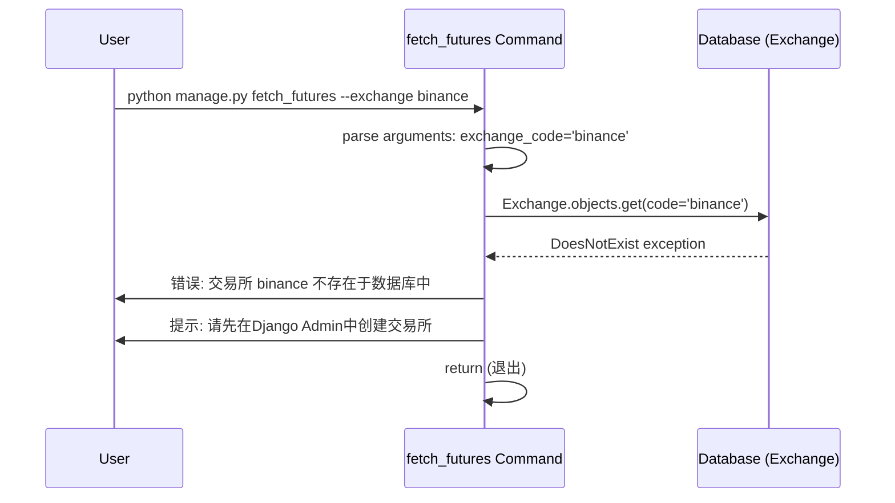
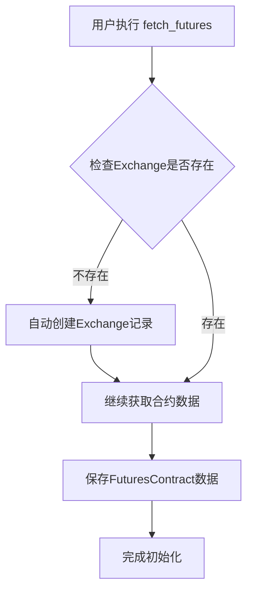

# Bug-Fix Report #002 - fetch_futures命令需要预先创建Exchange记录

## 一、问题报告

### 问题描述
执行 `python manage.py fetch_futures --exchange binance` 命令时，系统提示"交易所 binance 不存在于数据库中，请先在Django Admin中创建交易所"，导致无法初始化合约数据。

这是**Bug-001的后续问题** - 用户按照Bug-001的修复提示运行 `fetch_futures`，但遇到了新的前置条件缺失。

### 证据链

#### 1. 错误输出
```bash
(venv) (base) ➜  crypto_exchange_news_crawler git:(main) ✗ python manage.py fetch_futures --exchange binance
System check identified some issues:

WARNINGS:
?: (urls.W005) URL namespace 'grid_trading' isn't unique. You may not be able to reverse all URLs in this namespace
🚀 开始获取合约数据
交易所 binance 不存在于数据库中
请先在Django Admin中创建交易所: binance
```

#### 2. 代码片段
相关代码位于 `monitor/management/commands/fetch_futures.py:79-90`

```python
# 检查数据库中的交易所
for exchange_code in exchange_codes:
    try:
        Exchange.objects.get(code=exchange_code)  # ← 查询失败
    except Exchange.DoesNotExist:
        self.stdout.write(
            self.style.ERROR(f"交易所 {exchange_code} 不存在于数据库中")
        )
        self.stdout.write(
            self.style.WARNING(f"请先在Django Admin中创建交易所: {exchange_code}")
        )
        return  # ← 直接退出
```

#### 3. 数据库验证
通过Django shell查询数据库:

```python
from monitor.models import Exchange

# 查询Exchange表
total = Exchange.objects.count()
print(f'Exchange表总数: {total}')
# 输出: Exchange表总数: 0

# 尝试查询binance
try:
    ex = Exchange.objects.get(code='binance')
except Exchange.DoesNotExist:
    print('⚠️  binance不存在')
# 输出: ⚠️  binance不存在
```

**结论**: 数据库中 `Exchange` 表完全为空，没有任何交易所记录。

#### 4. 环境信息
- Django项目: crypto_exchange_news_crawler
- 相关表: `monitor_exchanges`
- 前置Bug: Bug-001（已修复）

### 复现逻辑

**前置条件**:
- 数据库中 `Exchange` 表为空（count = 0）
- 用户按照Bug-001的提示尝试初始化合约数据

**复现步骤**:
1. 执行命令: `python manage.py fetch_futures --exchange binance`
2. 系统查询 `Exchange.objects.get(code='binance')`
3. 抛出 `Exchange.DoesNotExist` 异常
4. 系统显示错误提示并退出
5. 用户无法初始化合约数据

**预期行为**:
- 应该能够直接初始化合约数据
- 或者提供更清晰的初始化流程指导

**实际行为**:
- 提示需要在Django Admin中手动创建交易所
- 用户体验差，需要多个步骤才能完成初始化

### 影响评估

#### 影响范围
- **直接影响**: Bug-001的修复提示无效，用户仍然无法完成数据初始化
- **连锁影响**:
  - 无法初始化 `FuturesContract` 数据
  - 无法使用迭代003的批量更新功能
  - 无法使用迭代002的巨量诱多检测系统

#### 严重程度
**P0** - 阻塞性问题

**理由**:
- 这是数据初始化的关键路径上的阻塞问题
- 影响所有依赖合约数据的功能
- Bug-001的修复方案依赖于此问题的解决

#### 紧急程度
**高**

**理由**:
- 用户刚刚按照Bug-001的提示操作，立即遇到新问题
- 需要立即提供解决方案，避免用户受挫
- 是数据初始化的前置步骤

---

## 二、诊断分析

### 代码路径分析



### 根因定位

**根本原因**: 数据库中 `Exchange` 表为空，`fetch_futures` 命令硬性要求 Exchange 记录必须预先存在。

**为什么会出现这个问题**:
1. **初始化流程缺失**: 项目没有提供 Exchange 数据的自动初始化机制
2. **假设用户已手动创建**: `fetch_futures` 命令假设用户已通过 Django Admin 手动创建交易所
3. **文档缺失**: Bug-001的修复提示中没有说明 Exchange 初始化的前置步骤
4. **用户体验差**: 需要多个手动步骤（Django Admin操作）才能完成初始化

**依赖链分析**:
```
update_klines (批量更新)
  ↓ 依赖
FuturesContract (合约数据)
  ↓ 依赖
fetch_futures (合约初始化命令)
  ↓ 依赖
Exchange (交易所基础数据) ← Bug-002: 缺失
```

### 影响范围

#### 代码层面
- ✅ `fetch_futures.py` 代码逻辑正确（检查Exchange存在）
- ❌ 缺少 Exchange 自动初始化机制
- ❌ Bug-001的修复提示不完整

#### 数据层面
- ❌ `Exchange` 表为空
- ❌ `FuturesContract` 表为空（Bug-001）
- ✅ `KLine` 表结构正常

#### 功能层面
- ❌ 无法执行 `fetch_futures` 命令
- ❌ 无法初始化 `FuturesContract` 数据
- ❌ 无法使用迭代003批量更新功能
- ❌ 无法使用迭代002巨量诱多检测功能

### 修复建议

**这是数据初始化流程设计问题**。有以下几种修复方案:

#### 方案A: 提供Exchange初始化命令（推荐）
- 创建新命令 `init_exchanges`，自动创建常用交易所记录
- 在Bug-001的提示中添加Exchange初始化步骤

#### 方案B: fetch_futures自动创建Exchange
- 修改 `fetch_futures` 命令，检测到Exchange不存在时自动创建
- 风险：可能创建不完整的Exchange记录

#### 方案C: 提供fixtures数据文件
- 创建 `exchanges.json` fixture
- 用户通过 `loaddata` 命令加载初始数据

#### 方案D: 仅更新文档
- 在Bug-001的修复提示中说明完整的初始化流程
- 用户需要手动通过Django Admin或shell创建

---

## 三、修复方案确认

### 问题总结

#### 问题概述
`fetch_futures` 命令依赖 `Exchange` 表数据，但数据库中该表为空，导致用户无法初始化合约数据。这是Bug-001修复方案的后续阻塞问题。

#### 影响范围
- **影响模块**:
  - `monitor/management/commands/fetch_futures.py`
  - Bug-001的修复提示
  - 迭代003的批量更新功能（间接）
  - 迭代002的巨量诱多检测系统（间接）

- **影响用户**:
  - 所有新安装项目的用户
  - 按照Bug-001提示操作的用户

- **严重程度**: P0
- **紧急程度**: 高

#### 根本原因
数据库缺少 `Exchange` 基础数据，而 `fetch_futures` 命令强制要求该数据必须预先存在，且项目没有提供自动初始化机制。

---

### 修复逻辑

#### 逻辑链路


#### 关键决策点
1. **是否自动创建Exchange?**
   - 决策: **是** - 提升用户体验，减少手动步骤

2. **创建哪些Exchange?**
   - 决策: **仅创建用户指定的交易所** - 最小化影响

3. **Exchange字段如何填充?**
   - 决策: **使用合理的默认值** - code, name, enabled=True

4. **是否需要更新Bug-001提示?**
   - 决策: **否** - 自动创建后，原提示仍然有效

#### 预期效果
- 用户执行 `fetch_futures --exchange binance` 时，系统自动创建 binance Exchange记录
- 用户无需手动操作 Django Admin
- Bug-001的修复提示可以直接使用

---

### 修复方案

#### 方案A: 仅更新文档，说明完整流程（最简单）

**思路**: 在Bug-001的修复提示中添加Exchange初始化步骤，用户手动通过Django shell创建。

**优点**:
- ✅ 无需修改代码，实施成本为0
- ✅ 保持代码简洁

**缺点**:
- ❌ 用户体验差 - 需要多个手动步骤
- ❌ 需要用户理解Django shell操作
- ❌ 容易出错（字段拼写、格式等）

**工作量**: 0.2小时
**风险等级**: 无
**风险说明**: 无风险，仅更新文档

**修改内容**:
- 更新Bug-001的修复提示
- 更新迭代003的PRD文档

---

#### 方案B: fetch_futures自动创建Exchange（推荐）

**思路**: 修改 `fetch_futures` 命令，检测到Exchange不存在时自动创建，填充合理的默认值。

**优点**:
- ✅ 用户体验好 - 零手动步骤
- ✅ 符合 "最小惊讶原则" - 命令开箱即用
- ✅ 代码修改量小（约15行）
- ✅ Bug-001的修复提示无需调整

**缺点**:
- ⚠️ 自动创建可能导致数据不完整（如缺少announcement_url）
- ⚠️ 需要定义合理的默认值

**工作量**: 0.5小时
**风险等级**: 低
**风险说明**:
- 自动创建的Exchange记录可能缺少某些可选字段
- 用户可能后续需要通过Admin补充完整信息

**依赖项**: 无

**修改内容**:

1. **代码修改** (`monitor/management/commands/fetch_futures.py:79-90`):
```python
# 检查数据库中的交易所，不存在则自动创建
for exchange_code in exchange_codes:
    exchange, created = Exchange.objects.get_or_create(
        code=exchange_code,
        defaults={
            'name': exchange_code.capitalize(),  # binance -> Binance
            'enabled': True,
            'announcement_url': '',  # 可选字段，留空
        }
    )

    if created:
        self.stdout.write(
            self.style.SUCCESS(f"✓ 已自动创建交易所: {exchange.name} ({exchange.code})")
        )
    elif verbose:
        self.stdout.write(
            self.style.SUCCESS(f"✓ 交易所已存在: {exchange.name} ({exchange.code})")
        )
```

2. **文档更新**:
   - 在 `fetch_futures` 命令的帮助文档中说明自动创建行为

---

#### 方案C: 提供init_exchanges管理命令（过度设计）

**思路**: 创建新的管理命令 `init_exchanges`，批量创建所有常用交易所。

**优点**:
- ✅ 职责分离 - 初始化和获取数据分开
- ✅ 可以预置完整的Exchange信息（包括announcement_url等）

**缺点**:
- ❌ 增加复杂度 - 用户需要执行两个命令
- ❌ 用户体验差 - 增加额外步骤
- ❌ 实施成本高 - 需要创建新命令

**工作量**: 1.5小时
**风险等级**: 低
**风险说明**: 增加了一个新的管理命令，需要维护

**依赖项**: 无

**不推荐理由**: 过度设计，违反"最小化"原则

---

#### 方案D: 提供fixtures数据文件（中等复杂度）

**思路**: 创建 `exchanges.json` fixture，用户通过 `loaddata` 命令加载。

**优点**:
- ✅ 数据完整 - 可以预置所有字段
- ✅ 可复用 - 适用于测试环境

**缺点**:
- ❌ 用户体验一般 - 需要额外执行命令
- ❌ 维护成本 - fixture需要与模型保持同步

**工作量**: 0.8小时
**风险等级**: 低
**风险说明**: fixture与模型不一致可能导致加载失败

**依赖项**: 无

**不推荐理由**: 用户体验不如方案B

---

### 推荐方案

#### 推荐: 方案B (fetch_futures自动创建Exchange)

**推荐理由**:
1. **用户体验最好**: 零手动步骤，命令开箱即用
2. **符合最小惊讶原则**: 用户期望 `fetch_futures` 能直接工作
3. **代码修改最小**: 仅15行代码，使用 `get_or_create()` 模式
4. **风险可控**: 自动创建的默认值合理，用户可后续补充
5. **实施成本低**: 0.5小时即可完成

**选择依据**:
- ✅ 符合项目优先级（用户体验 > 代码完美）
- ✅ 技术风险可控（使用Django ORM的标准模式）
- ✅ 实施成本合理（0.5小时）
- ✅ Bug-001的修复提示无需调整

**替代方案**: 如果方案B不可行，建议选择: **方案D (fixtures)**

**原因**:
- fixtures提供了较好的数据完整性
- 适用于测试环境
- 实施成本适中

**不推荐方案A的原因**:
- ❌ 用户体验差，违反"开箱即用"原则

**不推荐方案C的原因**:
- ❌ 过度设计，增加不必要的复杂度

---

### 风险评估

#### 技术风险

**风险1: 自动创建的Exchange记录不完整**
- **影响**: 中等 - announcement_url等可选字段为空
- **概率**: 高 - 默认值无法覆盖所有字段
- **缓解措施**:
  - 填充必填字段（code, name）
  - 可选字段使用空字符串或None
  - 在输出中提示用户可通过Admin补充

**风险2: name字段的默认值可能不准确**
- **影响**: 低 - 仅显示名称，不影响功能
- **概率**: 中等 - 使用capitalize()简单转换
- **缓解措施**:
  - 对常用交易所使用映射表（binance->Binance, hyperliquid->Hyperliquid）
  - 提示用户可通过Admin修改

**风险3: 并发创建可能导致竞态条件**
- **影响**: 低 - 极少数情况下可能重复创建
- **概率**: 极低 - get_or_create()有原子性保护
- **缓解措施**:
  - 使用get_or_create()而非手动检查+创建
  - code字段有unique约束，数据库层面防止重复

#### 业务风险

**风险1: 用户可能不知道Exchange是自动创建的**
- **影响**: 低 - 可能困惑为什么Exchange突然出现
- **概率**: 中等 - 没有明确提示
- **缓解措施**:
  - 在命令输出中明确提示 "✓ 已自动创建交易所: Binance (binance)"
  - 使用SUCCESS样式，让用户注意到

**风险2: 用户可能需要补充Exchange的完整信息**
- **影响**: 低 - announcement_url等字段为空
- **概率**: 低 - 大部分功能不依赖这些字段
- **缓解措施**:
  - 在文档中说明自动创建的限制
  - 提供Admin链接，方便用户补充

#### 时间风险

**风险: 修复可能影响用户等待时间**
- **影响**: 极低 - 0.5小时工作量
- **概率**: 极低 - 修改范围小，实施简单
- **缓解措施**:
  - 立即实施
  - 并行更新文档

---

### 实施计划

#### 任务分解
- [ ] **任务1**: 修改 `fetch_futures.py` 添加自动创建逻辑 - 预计0.3小时
- [ ] **任务2**: 更新Bug-001文档（可选，记录Bug-002） - 预计0.1小时
- [ ] **任务3**: 验证修复效果 - 预计0.1小时

#### 时间安排
- **开始时间**: 立即开始
- **预计完成时间**: 0.5小时内
- **关键里程碑**:
  - 代码修改完成 (0.3小时)
  - 文档更新完成 (0.4小时)
  - 验证完成 (0.5小时)

#### 验收标准
- [ ] 执行 `python manage.py fetch_futures --exchange binance` 时，自动创建binance Exchange
- [ ] 显示友好提示："✓ 已自动创建交易所: Binance (binance)"
- [ ] 成功获取合约数据并保存到 FuturesContract 表
- [ ] 执行 `python manage.py update_klines --interval 4h` 能正常批量更新

---

### 资源需求

#### 人力资源
- **主要负责人**: Bug-Fix Specialist (我)
- **审核人员**: 用户 (您)

#### 技术资源
- Django项目环境
- SQLite数据库
- 网络连接（用于测试API调用）

#### 测试资源
- 空Exchange表环境（当前状态）
- 币安API可用性

---

### 决策点

#### 需要您确认的问题

1. **修复方案选择**:
   - 选项: 方案A (文档) / 方案B (自动创建) / 方案C (新命令) / 方案D (fixtures)
   - 建议: **方案B** (fetch_futures自动创建Exchange)
   - 理由: 用户体验最好，代码修改最小，风险可控

2. **Exchange默认值设置**:
   - name字段: 使用 `code.capitalize()` (binance -> Binance)
   - announcement_url: 留空
   - enabled: 默认True

#### 请您决策

请选择:
- [ ] **采用推荐方案B，立即实施**
- [ ] 修改方案: [说明修改要求]
- [ ] 暂缓修复: [说明原因]
- [ ] 其他: [说明具体要求]

---

**元数据**:
- Bug ID: 002
- 报告日期: 2024-12-24
- 发现人: 用户
- 严重程度: P0
- 紧急程度: 高
- 前置Bug: Bug-001（批量更新K线时找到0个活跃合约）
- 关联迭代: 003 (K线批量更新增强)
- 影响模块: `monitor/management/commands/fetch_futures.py`
- 状态: 待用户确认修复方案
