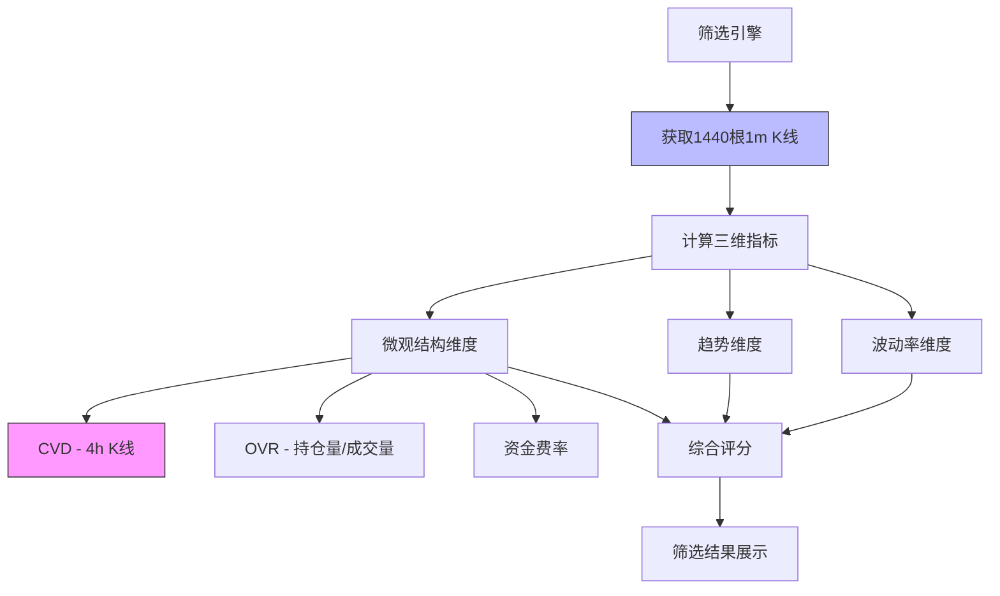

# 24小时资金流分析算法方案

## 一、需求理解与确认

### 1.1 需求描述
在 `/screening/daily/` 页面为每个合约增加**24小时资金流分析指标**，通过分析当日10点前的1440根1分钟K线，定量展示资金流入流出情况。

### 1.2 数据源
- **K线数据**: 1440根1分钟K线（24小时完整数据）
- **可用字段**:
  - `close`: 收盘价
  - `open`: 开盘价
  - `high`: 最高价
  - `low`: 最低价
  - `volume`: 成交量（币）
  - `quote_volume`: 成交额（USDT）
  - `taker_buy_base_volume`: 主动买入成交量（币）
  - `taker_buy_quote_volume`: 主动买入成交额（USDT）

### 1.3 目标边界
- **计算时机**: 每日筛选任务执行时（10点前）
- **展示位置**: 日常筛选结果表格（新增列）
- **性能要求**: 并行计算，不影响现有筛选速度
- **与现有指标关系**:
  - 现有CVD: 基于4小时K线的累积买卖差
  - 新指标: 基于1分钟K线的24小时资金流动

---

## 二、我的分析

### 2.1 现状分析



**关键发现**:
1. 系统已经获取1440根1分钟K线用于计算VDR和24h交易量
2. 现有CVD使用4小时K线，粒度较粗
3. `taker_buy_volume`字段可区分主动买入和被动卖出
4. 筛选结果通过`SimpleScore`数据类展示

### 2.2 核心挑战
1. **如何科学量化资金流?** 仅靠成交量无法区分买卖方向
2. **如何区分大单小单?** 不同规模订单反映不同类型资金
3. **如何展示趋势?** 单一数值无法反映24小时变化趋势
4. **如何与现有指标互补?** 避免信息冗余

---

## 三、方案选项

### 方案A: 增强版MFI (Money Flow Index) 【推荐】

#### A.1 方案描述

基于**典型价格**和**成交量**计算资金流指标，结合主动买卖分析，生成4个核心指标：

**核心算法**:

```python
# 1. 典型价格 (Typical Price)
TP = (High + Low + Close) / 3

# 2. 原始资金流 (Raw Money Flow)
RMF = TP × Volume

# 3. 主动资金流 (Active Money Flow)
AMF_Buy = TP × TakerBuyVolume
AMF_Sell = TP × (Volume - TakerBuyVolume)

# 4. 净资金流 (Net Money Flow)
NMF = AMF_Buy - AMF_Sell

# 5. 累积净资金流 (Cumulative Net Money Flow)
CNMF = Σ NMF  # 1440根K线累加

# 6. 资金流强度 (Money Flow Strength)
MFS = AMF_Buy / (AMF_Buy + AMF_Sell)  # 0-1之间

# 7. 大单资金流占比 (Large Order Ratio)
大单阈值 = P95(Volume)  # 95分位数
LOR_Buy = Σ(AMF_Buy where Volume > 大单阈值) / Σ AMF_Buy
LOR_Sell = Σ(AMF_Sell where Volume > 大单阈值) / Σ AMF_Sell

# 8. 资金流趋势分数 (Money Flow Trend Score)
分段统计: 将1440根K线分为8个3小时段
MFTS = Σ(段净资金流 × 权重)  # 最近段权重更高
```

**输出4个关键指标**:

| 指标 | 名称 | 范围 | 含义 |
|-----|------|------|-----|
| **CNMF** | 累积净资金流 | -∞ ~ +∞ | 24h总体资金流入(+)或流出(-) |
| **MFS** | 资金流强度 | 0 ~ 1 | 主动买入占比，>0.5为流入主导 |
| **LOR_Net** | 大单净流入占比 | -1 ~ +1 | 大单资金倾向，正值=大单买入多 |
| **MFTS** | 资金流趋势分数 | -100 ~ +100 | 时间加权趋势，正值=加速流入 |

**展示样式**:
```
CNMF: +$1.2M (↑)  MFS: 0.68 (强流入)  大单: +15% (买盘)  趋势: +78 (加速)
```

**新增字段到`SimpleScore`**:
```python
@dataclass
class SimpleScore:
    # ... 现有字段 ...

    # 资金流分析 (新增)
    money_flow_cnmf: float = 0.0          # 累积净资金流 (USDT)
    money_flow_strength: float = 0.5      # 资金流强度 (0-1)
    money_flow_large_order_ratio: float = 0.0  # 大单净流入占比 (-1~+1)
    money_flow_trend_score: float = 0.0   # 资金流趋势分数 (-100~+100)
```

#### A.2 优点 (Pros)
- ✅ **科学性强**: 基于学术界广泛认可的MFI算法
- ✅ **信息量大**: 4个指标从总量、强度、大单、趋势4个维度完整刻画资金流
- ✅ **区分度高**: 利用`taker_buy_volume`精确区分主动买卖
- ✅ **易于理解**: 指标含义直观，便于用户快速判断
- ✅ **时间加权**: MFTS考虑时间维度，反映资金流动态变化

#### A.3 缺点 (Cons)
- ⚠️ **计算量较大**: 需要遍历1440根K线并进行多次统计
- ⚠️ **占用展示空间**: 4个指标需要合理布局
- ⚠️ **参数调优**: 大单阈值(P95)和时间段权重需要实际验证

---

### 方案B: 简化版主动买卖流 (Simplified Buy/Sell Flow)

#### B.1 方案描述

仅基于`taker_buy_volume`计算最简单的买卖对比指标：

**核心算法**:

```python
# 1. 主动买入成交额
TotalBuyAmount = Σ (Close × TakerBuyVolume)  # 1440根

# 2. 主动卖出成交额
TotalSellAmount = Σ (Close × (Volume - TakerBuyVolume))  # 1440根

# 3. 净流入金额
NetFlow = TotalBuyAmount - TotalSellAmount

# 4. 买卖比率
BuySellRatio = TotalBuyAmount / TotalSellAmount
```

**输出2个关键指标**:

| 指标 | 名称 | 范围 | 含义 |
|-----|------|------|-----|
| **NetFlow** | 净流入金额 | -∞ ~ +∞ | 24h净流入(+)或净流出(-) |
| **BSRatio** | 买卖比率 | 0 ~ +∞ | >1为买盘主导，<1为卖盘主导 |

**展示样式**:
```
净流入: +$800K  买卖比: 1.35
```

#### B.2 优点 (Pros)
- ✅ **计算简单**: 只需一次遍历，性能最优
- ✅ **易于理解**: 指标含义极其直观
- ✅ **占用空间小**: 只需2个数值

#### B.3 缺点 (Cons)
- ❌ **信息量少**: 无法区分大单小单
- ❌ **缺乏趋势**: 无法反映时间维度变化
- ❌ **敏感度低**: 对短期资金流动不敏感

---

### 方案C: 分层级资金流 (Tiered Money Flow) 【综合平衡】

#### C.1 方案描述

结合方案A和方案B的优点，按订单规模分层统计，输出3个核心指标：

**核心算法**:

```python
# 1. 计算成交量分位数阈值
P50 = 中位数(Volume)  # 小单上限
P90 = 90分位数(Volume)  # 中单上限
# > P90 为大单

# 2. 分层统计主动买入成交额
SmallBuy = Σ (Close × TakerBuyVolume where Volume ≤ P50)
MediumBuy = Σ (Close × TakerBuyVolume where P50 < Volume ≤ P90)
LargeBuy = Σ (Close × TakerBuyVolume where Volume > P90)

# 同理计算卖出
SmallSell, MediumSell, LargeSell

# 3. 各层级净流入
SmallNet = SmallBuy - SmallSell
MediumNet = MediumBuy - MediumSell
LargeNet = LargeBuy - LargeSell

# 4. 综合资金流强度
MFS = (SmallBuy + MediumBuy + LargeBuy) / Total成交额

# 5. 大单主导度
LargeDominance = |LargeNet| / (|SmallNet| + |MediumNet| + |LargeNet|)
```

**输出3个关键指标**:

| 指标 | 名称 | 范围 | 含义 |
|-----|------|------|-----|
| **LargeNet** | 大单净流入 | -∞ ~ +∞ | 大额订单净流入金额 |
| **MFS** | 资金流强度 | 0 ~ 1 | 整体买盘占比 |
| **LargeDom** | 大单主导度 | 0 ~ 1 | 大单对资金流的影响程度 |

**展示样式**:
```
大单: +$500K (主导72%)  整体流强: 0.64 (买盘)
```

**可视化建议**: 添加一个小型柱状图展示三层级资金流对比

#### C.2 优点 (Pros)
- ✅ **信息丰富**: 3个指标覆盖关键维度
- ✅ **突出重点**: 强调大单资金流（通常更重要）
- ✅ **计算适中**: 性能开销可接受
- ✅ **易于扩展**: 可视化展示效果好

#### C.3 缺点 (Cons)
- ⚠️ **需要可视化**: 纯数字展示不如图表直观
- ⚠️ **阈值选择**: P50/P90需要根据实际情况调整

---

## 四、我的建议 (Recommendation)

### 推荐方案: **方案C - 分层级资金流**

#### 理由：
1. **信息量与复杂度平衡**: 3个指标足够反映资金流特征，又不会过于复杂
2. **突出关键信息**: 大单资金流是最重要的市场信号，值得单独展示
3. **易于实现**: 基于现有数据结构，无需额外API
4. **可扩展性强**: 未来可增加可视化图表展示三层级对比

#### 实施建议:
1. **第一阶段**: 实现3个核心指标的计算和展示（纯数字）
2. **第二阶段**: 添加小型柱状图可视化（可选）
3. **第三阶段**: 根据用户反馈调整阈值参数

#### 与现有指标的互补关系:
- **现有CVD (4h)**: 中长期资金流趋势
- **新指标 (1m)**: 24小时内短期资金流动
- **互补点**: CVD看趋势，新指标看当天实时资金面

#### 技术架构变更:

```
现有流程:
ScreeningEngine.run_simple_screening()
  ├─ 获取1440根1m K线 ✓ (已有)
  ├─ calculate_all_indicators()
  │   └─ 计算VDR/KER等 ✓ (已有)
  └─ SimpleScoring.score_and_rank()

新增流程:
ScreeningEngine.run_simple_screening()
  ├─ 获取1440根1m K线 ✓ (已有)
  ├─ calculate_all_indicators()
  │   ├─ 计算VDR/KER等 ✓ (已有)
  │   └─ calculate_money_flow_metrics() 🆕 (新增)
  └─ SimpleScoring.score_and_rank()
       └─ 填充money_flow字段 🆕 (新增)
```

---

## 五、备选方案对比

| 维度 | 方案A (增强MFI) | 方案B (简化) | 方案C (分层级) ⭐ |
|-----|----------------|-------------|-----------------|
| 信息完整度 | ⭐⭐⭐⭐⭐ | ⭐⭐ | ⭐⭐⭐⭐ |
| 计算效率 | ⭐⭐⭐ | ⭐⭐⭐⭐⭐ | ⭐⭐⭐⭐ |
| 易于理解 | ⭐⭐⭐ | ⭐⭐⭐⭐⭐ | ⭐⭐⭐⭐ |
| 实用价值 | ⭐⭐⭐⭐ | ⭐⭐ | ⭐⭐⭐⭐⭐ |
| 可视化需求 | 低 | 低 | 中 |
| 开发复杂度 | 高 | 低 | 中 |

---

## 六、待澄清问题

在进入实施阶段前，请确认以下问题：

1. **展示位置偏好**:
   - 是否需要在筛选表格中新增列？
   - 还是在详情页展示更详细信息？

2. **指标优先级**:
   - 如果屏幕空间有限，3个指标是否都展示？
   - 还是只展示最关键的1-2个？

3. **过滤条件**:
   - 是否需要将资金流指标加入筛选条件？
   - 例如: 只显示大单净流入 > $100K的代币

4. **历史对比**:
   - 是否需要与前一天对比？
   - 例如: 显示"大单净流入: +$500K (↑20% vs昨日)"

5. **阈值调整**:
   - 大单定义(P90)是否合适？
   - 还是应该使用固定金额(如>$50K)？

---

**下一步**: 请您审阅本方案，选择最合适的方案或提出调整建议，我将创建详细的实施计划并开始开发。
