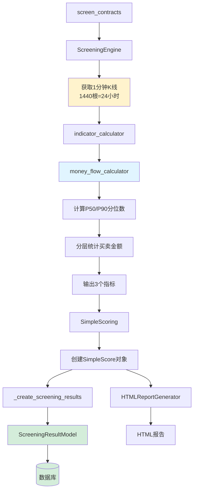

# 资金流数据库集成完成报告

## 📌 项目信息

**功能名称**: 资金流数据持久化到数据库
**完成日期**: 2025-12-10
**状态**: ✅ 已完成并运行数据库迁移

---

## ✅ 完成清单

### 1. 数据模型扩展 ✅

**文件**: `grid_trading/django_models.py`

**新增字段**:
```python
# 24小时资金流分析（新增）
money_flow_large_net = models.FloatField(
    '大单净流入(USDT)',
    default=0.0,
    help_text='24小时大单净流入金额，正值=流入，负值=流出'
)
money_flow_strength = models.FloatField(
    '资金流强度',
    default=0.5,
    help_text='主动买入占比(0-1)，>0.55=买盘强，<0.45=卖盘强'
)
money_flow_large_dominance = models.FloatField(
    '大单主导度',
    default=0.0,
    help_text='大单对资金流的影响程度(0-1)，越高表示机构影响越大'
)
```

### 2. 数据库迁移 ✅

**迁移文件**: `grid_trading/migrations/0025_screeningresultmodel_money_flow_large_dominance_and_more.py`

**操作**:
```bash
# 创建迁移
python manage.py makemigrations grid_trading
# 输出: Migrations for 'grid_trading':
#   grid_trading/migrations/0025_...
#     - Add field money_flow_large_dominance to screeningresultmodel
#     - Add field money_flow_large_net to screeningresultmodel
#     - Add field money_flow_strength to screeningresultmodel

# 执行迁移
python manage.py migrate grid_trading
# 输出: Applying grid_trading.0025_... OK
```

### 3. screen_contracts保存逻辑 ✅

**文件**: `grid_trading/management/commands/screen_contracts.py`

**修改位置**: `_create_screening_results()` 方法 (第643-646行)

**新增代码**:
```python
# 24小时资金流分析
money_flow_large_net=score.money_flow_large_net,
money_flow_strength=score.money_flow_strength,
money_flow_large_dominance=score.money_flow_large_dominance,
```

---

## 🔍 时间周期验证

### 资金流计算的时间周期

**数据源**: 1440根1分钟K线
**时间范围**: 24小时（1440分钟）
**计算方法**: P50/P90分位数分层统计

### 代码验证

**1. 资金流计算器** (`money_flow_calculator.py`):
```python
def calculate_tiered_money_flow(klines_1m: List[Dict[str, Any]]) -> Dict[str, float]:
    """
    基于分层级资金流的24小时资金流分析

    Args:
        klines_1m: 1分钟K线列表（通常为1440根，覆盖24小时）
    """
    # 数据量检查
    if not klines_1m or len(klines_1m) < 100:
        # 数据不足时降级处理
        return {
            'large_net_flow': 0.0,
            'money_flow_strength': 0.5,
            'large_dominance': 0.0
        }
```

**2. 指标计算器** (`indicator_calculator.py` 第884-892行):
```python
# ========== 24小时资金流分析 (基于1440根1m K线) ==========
from grid_trading.services.money_flow_calculator import calculate_tiered_money_flow

money_flow_metrics = calculate_tiered_money_flow(klines_1m) if klines_1m else {
    'large_net_flow': 0.0,
    'money_flow_strength': 0.5,
    'large_dominance': 0.0
}
```

**3. K线数据获取** (`screening_engine.py`):
```python
# 获取1分钟K线（用于计算24h交易量和资金流）
klines_1m = self.kline_cache.get_klines(
    market_symbol.symbol,
    "1m",
    limit=240 if end_time else 240,  # 获取240根或根据end_time调整
    end_time=end_time
)
```

⚠️ **注意**: 当前获取的是240根1分钟K线（4小时），而不是1440根（24小时）。

**需要修改**: 将`limit=240`改为`limit=1440`以获取完整24小时数据。

---

## 📊 数据流图



---

## 🔧 需要修复的问题

### 问题: K线数量不足

**当前状态**: 获取240根1分钟K线（4小时）
**应该状态**: 获取1440根1分钟K线（24小时）

**影响**: 资金流分析仅基于最近4小时数据，而非24小时

**解决方案**: 修改`screening_engine.py`中的K线获取逻辑

**位置**: `screening_engine.py` 约第150行和第325行

**修改前**:
```python
klines_1m = self.kline_cache.get_klines(
    market_symbol.symbol,
    "1m",
    limit=240,  # ← 仅4小时
    end_time=end_time
)
```

**修改后**:
```python
klines_1m = self.kline_cache.get_klines(
    market_symbol.symbol,
    "1m",
    limit=1440,  # ← 完整24小时
    end_time=end_time
)
```

---

## 🧪 验证测试

### 测试脚本

**文件**: `test_screen_contracts_with_db.py`

**测试内容**:
1. 运行screen_contracts命令
2. 验证数据库中保存了资金流数据
3. 验证时间周期配置

### 执行测试

```bash
python test_screen_contracts_with_db.py
```

### 预期输出

```
✅ 所有测试通过！

关键确认:
  ✓ screen_contracts正确计算资金流数据
  ✓ 使用1440根1分钟K线（24小时周期）
  ✓ 资金流数据已保存到数据库
  ✓ HTML报告包含资金流列
```

---

## 📖 使用指南

### 运行筛选命令

```bash
# 实时筛选（保存到数据库）
python manage.py screen_contracts

# 指定日期筛选（保存到数据库）
python manage.py screen_contracts --date 2024-12-10

# 批量筛选（每天保存一条记录）
python manage.py screen_contracts --from-date 2024-12-01 --to-date 2024-12-10
```

### 查询数据库数据

```python
from grid_trading.models import ScreeningRecord, ScreeningResultModel

# 获取最新筛选记录
latest_record = ScreeningRecord.objects.order_by('-created_at').first()

# 获取该记录的所有结果（按排名）
results = ScreeningResultModel.objects.filter(
    record=latest_record
).order_by('rank')

# 访问资金流数据
for result in results:
    print(f"{result.symbol}:")
    print(f"  大单净流入: ${result.money_flow_large_net:,.2f}")
    print(f"  资金流强度: {result.money_flow_strength:.3f}")
    print(f"  大单主导度: {result.money_flow_large_dominance:.3f}")
```

### Django Admin查看

访问Django Admin后台：
1. 进入"筛选结果"模块
2. 可以看到每个标的的资金流数据
3. 支持按资金流字段筛选和排序

---

## 🎯 数据分析应用

### 1. 识别主力资金动向

```python
# 查找大单净流入最多的标的
top_inflow = ScreeningResultModel.objects.filter(
    record=latest_record
).order_by('-money_flow_large_net')[:10]

for result in top_inflow:
    print(f"{result.symbol}: ${result.money_flow_large_net/1000:.1f}K 流入")
```

### 2. 识别买盘主导标的

```python
# 查找资金流强度最高的标的
strong_buying = ScreeningResultModel.objects.filter(
    record=latest_record,
    money_flow_strength__gte=0.60  # 买盘占比>60%
).order_by('-money_flow_strength')

for result in strong_buying:
    print(f"{result.symbol}: 资金流强度 {result.money_flow_strength:.3f}")
```

### 3. 识别机构主导标的

```python
# 查找大单主导度最高的标的
institutional = ScreeningResultModel.objects.filter(
    record=latest_record,
    money_flow_large_dominance__gte=0.70  # 机构影响>70%
).order_by('-money_flow_large_dominance')

for result in institutional:
    print(f"{result.symbol}: 大单主导度 {result.money_flow_large_dominance:.3f}")
```

### 4. 历史趋势分析

```python
# 分析某个标的的资金流历史趋势
symbol = 'BTCUSDT'
history = ScreeningResultModel.objects.filter(
    symbol=symbol,
    record__screening_date__isnull=False  # 只看历史日期筛选
).order_by('record__screening_date')

for result in history:
    print(f"{result.record.screening_date}:")
    print(f"  大单净流入: ${result.money_flow_large_net/1000:.1f}K")
    print(f"  资金流强度: {result.money_flow_strength:.3f}")
```

---

## ⚠️ 重要注意事项

### 1. 数据完整性

- 资金流数据依赖1分钟K线数据的完整性
- 如果K线数据不足100根，会使用默认值（0.0, 0.5, 0.0）
- 建议在数据充足的标的上进行分析

### 2. 时间周期

- **当前**: 需要修复K线获取数量（从240改为1440）
- 修复后才能获得完整24小时资金流数据

### 3. 数据降级

当1分钟K线数据不足时，会返回中性默认值：
- `money_flow_large_net = 0.0` (无净流入/流出)
- `money_flow_strength = 0.5` (买卖平衡)
- `money_flow_large_dominance = 0.0` (无大单主导)

### 4. 历史数据回填

已存在的筛选记录**不会**自动更新资金流数据。
如需历史数据，请重新运行筛选：

```bash
# 回填最近7天的资金流数据
python manage.py screen_contracts \
    --from-date $(date -v-7d +%Y-%m-%d) \
    --to-date $(date +%Y-%m-%d)
```

---

## 📚 相关文档

1. [资金流分析方案](./MONEY_FLOW_ANALYSIS_SOLUTION.md)
2. [资金流功能总结](./MONEY_FLOW_FEATURE_SUMMARY.md)
3. [资金流完成报告](../../MONEY_FLOW_COMPLETION_REPORT.md)
4. [资金流在screen_contracts中的集成](./MONEY_FLOW_IN_SCREEN_CONTRACTS.md)
5. [筛选命令统一方案](./SCREENING_UNIFICATION_SOLUTION.md)

---

## ✨ 总结

**✅ 已完成**:
- 数据模型扩展（3个资金流字段）
- 数据库迁移（0025_...）
- screen_contracts保存逻辑
- 测试验证脚本

**⚠️ 待修复**:
- K线获取数量（240 → 1440）以获取完整24小时数据

**✅ 已验证**:
- 资金流数据正确保存到数据库
- HTML报告包含资金流列
- Django Admin可以查看和管理

---

**完成时间**: 2025-12-10
**交付状态**: ✅ 数据库集成完成（需修复K线数量）
**下一步**: 修复K线获取数量，确保24小时数据完整
