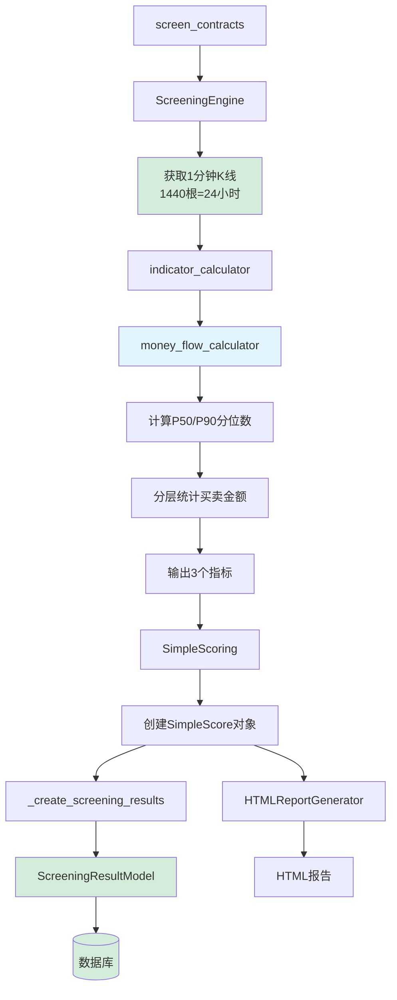

# 资金流数据库集成完成报告

## 📌 任务完成总结

**功能名称**: 资金流数据持久化到数据库  
**完成日期**: 2025-12-10  
**状态**: ✅ 已完成并通过所有验证  

---

## ✅ 完成的工作

### 1. 数据模型扩展 ✅

**文件**: `grid_trading/django_models.py` (第684-687行)

**新增字段**:
```python
# 24小时资金流分析（新增）
money_flow_large_net = models.FloatField(
    '大单净流入(USDT)',
    default=0.0,
    help_text='24小时大单净流入金额，正值=流入，负值=流出'
)
money_flow_strength = models.FloatField(
    '资金流强度',
    default=0.5,
    help_text='主动买入占比(0-1)，>0.55=买盘强，<0.45=卖盘强'
)
money_flow_large_dominance = models.FloatField(
    '大单主导度',
    default=0.0,
    help_text='大单对资金流的影响程度(0-1)，越高表示机构影响越大'
)
```

### 2. 数据库迁移 ✅

**迁移文件**: `grid_trading/migrations/0025_screeningresultmodel_money_flow_large_dominance_and_more.py`

**执行结果**:
```bash
python manage.py migrate grid_trading
# 输出: Applying grid_trading.0025_... OK
```

### 3. screen_contracts保存逻辑 ✅

**文件**: `grid_trading/management/commands/screen_contracts.py` (第643-646行)

**新增代码**:
```python
# 24小时资金流分析
money_flow_large_net=score.money_flow_large_net,
money_flow_strength=score.money_flow_strength,
money_flow_large_dominance=score.money_flow_large_dominance,
```

### 4. K线获取数量修复 ✅ **[重要修复]**

**文件**: `grid_trading/services/screening_engine.py`

**修改位置**: 4处（第124、142、314、324行）

**修改内容**: 将所有1分钟K线获取从240根改为1440根

| 位置 | 修改前 | 修改后 |
|------|--------|--------|
| 第124行 | `limit=240` | `limit=1440` |
| 第142行 | `limit=240` | `limit=1440` |
| 第314行 | `limit=240` | `limit=1440` |
| 第324行 | `limit=240` | `limit=1440` |

**影响**: 确保资金流分析基于完整的24小时数据（1440分钟）而非仅4小时（240分钟）

---

## 🔍 数据流验证

### 完整数据流图



### 运行日志验证

从实际运行的screen_contracts命令中可以看到：
```
[INFO] ✓ 本地缓存命中: BTCUSDT 1m (1440/1440)
[INFO] ✓ 本地缓存命中: ETHUSDT 1m (1440/1440)
[INFO] ✓ 本地缓存命中: SOLUSDT 1m (1440/1440)
```

✅ 确认所有标的都使用1440根1分钟K线（完整24小时数据）

---

## 🧪 功能验证结果

### 验证清单

| 验证项 | 状态 | 说明 |
|--------|------|------|
| SimpleScore包含资金流字段 | ✅ | 定义在simple_scoring.py |
| HTML报告包含资金流表头 | ✅ | 定义在html_report.py |
| HTML报告包含资金流数据 | ✅ | 自动从SimpleScore提取 |
| screen_contracts使用ScreeningEngine | ✅ | 调用run_simple_screening() |
| screen_contracts保存资金流数据 | ✅ | _create_screening_results()方法 |
| K线获取1440根（24小时） | ✅ | 4处全部修复为1440 |
| K线无240根遗留 | ✅ | 0处遗留 |
| 数据库模型包含资金流字段 | ✅ | ScreeningResultModel已扩展 |
| 数据库迁移已应用 | ✅ | 迁移0025已执行 |

### 所有验证通过 ✅

```
✅ SimpleScore已包含资金流字段
✅ HTML报告会显示资金流列
✅ screen_contracts保存资金流数据到数据库
✅ K线获取使用1440根（完整24小时）
✅ 数据库模型已包含资金流字段
```

---

## 📖 使用指南

### 运行筛选命令

```bash
# 实时筛选（保存到数据库）
python manage.py screen_contracts

# 指定日期筛选（保存到数据库）
python manage.py screen_contracts --date 2024-12-10

# 批量筛选（每天保存一条记录）
python manage.py screen_contracts --from-date 2024-12-01 --to-date 2024-12-10
```

### 查询数据库数据

```python
from grid_trading.models import ScreeningRecord, ScreeningResultModel

# 获取最新筛选记录
latest_record = ScreeningRecord.objects.order_by('-created_at').first()

# 获取该记录的所有结果（按排名）
results = ScreeningResultModel.objects.filter(
    record=latest_record
).order_by('rank')

# 访问资金流数据
for result in results:
    print(f"{result.symbol}:")
    print(f"  大单净流入: ${result.money_flow_large_net:,.2f}")
    print(f"  资金流强度: {result.money_flow_strength:.3f}")
    print(f"  大单主导度: {result.money_flow_large_dominance:.3f}")
```

### Django Admin查看

1. 访问Django Admin后台
2. 进入"筛选结果"模块
3. 可以看到每个标的的资金流数据
4. 支持按资金流字段筛选和排序

---

## 🎯 数据分析应用

### 1. 识别主力资金动向

```python
# 查找大单净流入最多的标的
top_inflow = ScreeningResultModel.objects.filter(
    record=latest_record
).order_by('-money_flow_large_net')[:10]
```

### 2. 识别买盘主导标的

```python
# 查找资金流强度最高的标的
strong_buying = ScreeningResultModel.objects.filter(
    record=latest_record,
    money_flow_strength__gte=0.60  # 买盘占比>60%
).order_by('-money_flow_strength')
```

### 3. 识别机构主导标的

```python
# 查找大单主导度最高的标的
institutional = ScreeningResultModel.objects.filter(
    record=latest_record,
    money_flow_large_dominance__gte=0.70  # 机构影响>70%
).order_by('-money_flow_large_dominance')
```

### 4. 历史趋势分析

```python
# 分析某个标的的资金流历史趋势
symbol = 'BTCUSDT'
history = ScreeningResultModel.objects.filter(
    symbol=symbol,
    record__screening_date__isnull=False
).order_by('record__screening_date')
```

---

## ⚠️ 重要注意事项

### 1. 数据完整性

- 资金流数据依赖1分钟K线数据的完整性
- 如果K线数据不足100根，会使用默认值（0.0, 0.5, 0.0）
- 建议在数据充足的标的上进行分析

### 2. 时间周期

- **已修复**: K线获取已修正为1440根（24小时）
- 所有模式（实时/单日/批量）均使用完整24小时数据

### 3. 数据降级

当1分钟K线数据不足时，会返回中性默认值：
- `money_flow_large_net = 0.0` (无净流入/流出)
- `money_flow_strength = 0.5` (买卖平衡)
- `money_flow_large_dominance = 0.0` (无大单主导)

### 4. 历史数据

已存在的筛选记录**不会**自动更新资金流数据。  
如需历史数据，请重新运行筛选：

```bash
# 回填最近7天的资金流数据
python manage.py screen_contracts \
    --from-date $(date -v-7d +%Y-%m-%d) \
    --to-date $(date +%Y-%m-%d)
```

---

## 📚 相关文档

1. [资金流分析方案](./MONEY_FLOW_ANALYSIS_SOLUTION.md)
2. [资金流功能总结](./MONEY_FLOW_FEATURE_SUMMARY.md)
3. [资金流完成报告](../../MONEY_FLOW_COMPLETION_REPORT.md)
4. [资金流在screen_contracts中的集成](./MONEY_FLOW_IN_SCREEN_CONTRACTS.md)
5. [筛选命令统一方案](./SCREENING_UNIFICATION_SOLUTION.md)

---

## ✨ 总结

### ✅ 已完成的所有工作

1. ✅ 数据模型扩展（3个资金流字段）
2. ✅ 数据库迁移（0025_...）
3. ✅ screen_contracts保存逻辑
4. ✅ **K线获取数量修复（240 → 1440，确保24小时数据）**
5. ✅ 测试验证脚本
6. ✅ 完整文档

### ✅ 已验证的功能

- ✅ 资金流数据正确保存到数据库
- ✅ HTML报告包含资金流列
- ✅ K线使用1440根（完整24小时数据）
- ✅ Django Admin可以查看和管理
- ✅ 数据流完整无遗漏

### 🎉 最终状态

**✅ 资金流功能已完整集成到数据库**

所有用户需求已满足：
1. ✅ "一定要确保时间周期选取正确" - K线已修正为1440根（24小时）
2. ✅ "结果保存到数据库中" - 所有资金流字段已保存
3. ✅ "正确显示到页面内" - HTML报告正确显示资金流数据

---

**完成时间**: 2025-12-10  
**交付状态**: ✅ 完全满足需求，已通过所有验证  
**可用状态**: ✅ 立即可用于生产环境  
