# 资金流功能在screen_contracts中的集成验证

## ✅ 验证结果

**日期**: 2025-12-10
**状态**: ✅ 资金流功能已正确集成到screen_contracts命令

---

## 🔍 验证详情

### 1. SimpleScore数据结构 ✅

**文件**: `grid_trading/services/simple_scoring.py`

**资金流字段**:
```python
@dataclass
class SimpleScore:
    # ... 其他字段 ...

    # 24小时资金流分析（新增）
    money_flow_large_net: float = 0.0        # 大单净流入金额 (USDT)
    money_flow_strength: float = 0.5         # 资金流强度 (0-1)
    money_flow_large_dominance: float = 0.0  # 大单主导度 (0-1)
```

**to_dict()序列化**:
```python
def to_dict(self):
    return {
        # ... 其他字段 ...

        # 资金流分析
        'money_flow_large_net': round(self.money_flow_large_net, 2),
        'money_flow_strength': round(self.money_flow_strength, 3),
        'money_flow_large_dominance': round(self.money_flow_large_dominance, 3),
    }
```

✅ **验证通过**: SimpleScore包含所有必要的资金流字段

---

### 2. HTML报告模板 ✅

**文件**: `grid_trading/services/html_report.py`

**表头定义** (第520-522行):
```html
<th class="sortable" data-sort="money_flow_large_net">大单净流入</th>
<th class="sortable" data-sort="money_flow_strength">资金流强度</th>
<th class="sortable" data-sort="money_flow_large_dominance">大单主导度</th>
```

**数据展示** (第723-725行):
```html
<td class="metric-cell" style="color: {'#28a745' if data['money_flow_large_net'] > 0 else '#dc3545'};">
    ${data['money_flow_large_net'] / 1000:.1f}K
</td>
<td class="metric-cell" style="color: {'#28a745' if data['money_flow_strength'] > 0.55 else ('#dc3545' if data['money_flow_strength'] < 0.45 else '#6c757d')};">
    {data['money_flow_strength']:.3f}
</td>
<td class="metric-cell">{data['money_flow_large_dominance']:.3f}</td>
```

✅ **验证通过**: HTML报告包含资金流展示逻辑

---

### 3. screen_contracts命令集成 ✅

**文件**: `grid_trading/management/commands/screen_contracts.py`

**调用链**:
```
screen_contracts
  └─> ScreeningEngine.run_simple_screening()
      └─> SimpleScoring.score_and_rank()
          └─> 返回 List[SimpleScore]（包含资金流字段）
              └─> HTMLReportGenerator.generate_report()
                  └─> 读取SimpleScore.to_dict()
                      └─> 渲染HTML模板（展示资金流列）
```

**核心代码**:
```python
# screen_contracts.py 第204行（实时模式）/ 第305行（日期模式）
results = engine.run_simple_screening(
    vdr_weight=vdr_weight,
    ker_weight=ker_weight,
    ovr_weight=ovr_weight,
    cvd_weight=cvd_weight,
    # ... 其他参数 ...
    end_time=end_time,  # 实时模式=None, 日期模式=cutoff_datetime
)

# results 是 List[SimpleScore]，每个SimpleScore包含资金流字段
```

**HTML生成**:
```python
# screen_contracts.py 第309行（实时模式）/ 第412行（日期模式）
generator = HTMLReportGenerator()
output_file = generator.generate_report(results, output_path)
# HTML报告会自动包含资金流列
```

✅ **验证通过**: screen_contracts正确使用资金流数据

---

## 📊 数据流图

```mermaid
graph LR
    A[screen_contracts] --> B[ScreeningEngine]
    B --> C[indicator_calculator]
    C --> D[money_flow_calculator]
    D --> E[计算资金流指标]
    E --> F[返回money_flow_metrics]
    F --> G[SimpleScoring.score_and_rank]
    G --> H[创建SimpleScore对象]
    H --> I[填充money_flow字段]
    I --> J[返回List<SimpleScore>]
    J --> K[HTMLReportGenerator]
    K --> L[SimpleScore.to_dict]
    L --> M[渲染HTML模板]
    M --> N[显示资金流列]

    style D fill:#e1f5ff
    style H fill:#fff3cd
    style M fill:#d4edda
```



---

## 🎯 关键确认点

### ✅ 1. 数据计算
- `money_flow_calculator.py` 已实现完整的资金流算法
- 基于1440根1分钟K线计算3个指标
- 算法已通过测试（test_money_flow.py）

### ✅ 2. 数据传递
- `indicator_calculator.calculate_all_indicators()` 返回包含 `money_flow_metrics`
- `screening_engine.run_simple_screening()` 正确解包和传递
- `simple_scoring.score_and_rank()` 接收并填充到 `SimpleScore`

### ✅ 3. 数据展示
- `SimpleScore.to_dict()` 正确序列化资金流字段
- `HTMLReportGenerator` 模板包含3列资金流数据
- 颜色标识正确实现（绿色=流入/买盘强/红色=流出/卖盘强）

### ✅ 4. 命令集成
- `screen_contracts` 调用相同的筛选引擎
- 三种模式（实时/单日/批量）都使用相同的逻辑
- HTML报告生成器自动处理资金流数据

---

## ⚠️ 重要说明

### 关于数据库保存

**当前设计**: 资金流数据**仅在HTML报告中展示**，**不保存到数据库**。

**原因**:
1. 实施计划中将数据库迁移标记为"可选"（阶段7）
2. 旧命令`screen_simple`和`screen_by_date`也不保存资金流数据
3. 新命令`screen_contracts`保持与旧命令行为一致

**验证**:
```python
# screen_contracts.py 的 _create_screening_results() 方法
# 不包含 money_flow_* 字段的数据库保存代码
# 这与 screen_simple.py 和 screen_by_date.py 的行为一致
```

**如需持久化**:
如果未来需要将资金流数据保存到数据库，需要：
1. 修改`grid_trading/django_models.py`中的`ScreeningResultModel`，添加3个字段
2. 运行数据库迁移：`python manage.py makemigrations && python manage.py migrate`
3. 修改`screen_contracts.py`的`_create_screening_results()`方法，添加字段保存

---

## 🧪 测试验证

### 静态验证（已完成）

```bash
# 验证SimpleScore包含字段
grep -n "money_flow" grid_trading/services/simple_scoring.py
# 输出: 86, 87, 88, 124, 125, 126, 484, 485, 486

# 验证HTML模板包含列
grep -n "money_flow" grid_trading/services/html_report.py
# 输出: 520, 521, 522, 723, 724, 725

# 验证screen_contracts使用引擎
grep "run_simple_screening" grid_trading/management/commands/screen_contracts.py
# 输出: 多行匹配
```

### 动态验证（推荐）

```bash
# 方式1: 实时筛选测试
python manage.py screen_contracts --min-vdr 6 --min-amplitude 50 -v 1

# 方式2: 指定日期测试
python manage.py screen_contracts --date 2024-12-09 --min-vdr 6 -v 1

# 检查生成的HTML报告
# 应该包含"大单净流入"、"资金流强度"、"大单主导度"三列
```

---

## ✨ 结论

**✅ 确认**: 资金流入流出计算已正确应用到`screen_contracts`命令中。

**工作原理**:
1. 命令调用`ScreeningEngine.run_simple_screening()`
2. 引擎返回包含资金流字段的`SimpleScore`列表
3. HTML生成器自动从`SimpleScore.to_dict()`提取资金流数据
4. HTML报告展示3列资金流指标（带颜色标识）

**使用方式**:
```bash
# 所有三种模式都包含资金流数据

# 实时筛选
python manage.py screen_contracts

# 单日筛选
python manage.py screen_contracts --date 2024-12-10

# 批量筛选
python manage.py screen_contracts --from-date 2024-12-01 --to-date 2024-12-10
```

**展示效果**:
- 大单净流入: 正值绿色（流入）/ 负值红色（流出）
- 资金流强度: >0.55绿色（买盘强）/ <0.45红色（卖盘强）/ 中间灰色（平衡）
- 大单主导度: 默认颜色，数值表示机构影响程度

---

**验证完成时间**: 2025-12-10
**验证者**: Claude (Anthropic)
**结论**: ✅ 资金流功能完整集成
