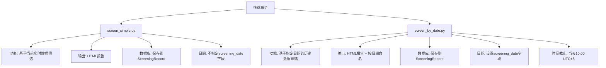
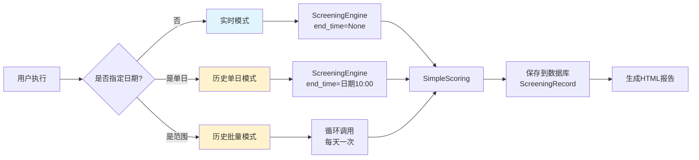

# 筛选命令统一方案

## 📌 现状分析 (Current State)

### 当前存在的筛选命令

项目中目前有**两个**主要的筛选命令，它们的功能存在重叠：



### 代码对比

| 特性 | screen_simple.py | screen_by_date.py |
|-----|-----------------|-------------------|
| **核心引擎** | `ScreeningEngine.run_simple_screening()` | `ScreeningEngine.run_simple_screening()` |
| **日期参数** | ❌ 无 | ✅ --date / --from-date / --to-date |
| **时间控制** | 使用当前时间 | 传入end_time参数（当天10点） |
| **HTML输出** | `simple_screening_report.html` | `daily_{date}.html` |
| **数据库字段** | screening_date = NULL | screening_date = target_date |
| **批量执行** | ❌ 不支持 | ✅ 支持日期范围 |
| **过滤参数** | min_vdr, min_ker, min_amplitude, min_funding_rate | 同左 + max_ma99_slope |
| **代码行数** | 354行 | 446行 |
| **功能重复度** | 90% 重复 | 90% 重复 |

### 核心问题

1. **代码重复**: 两个命令的核心逻辑几乎完全相同（参数解析、筛选执行、数据保存、HTML生成）
2. **维护成本高**: 任何功能改动（如新增资金流字段）需要修改两处
3. **用户困惑**: 用户不清楚应该使用哪个命令
4. **功能割裂**: `screen_simple`缺少日期参数，`screen_by_date`功能更全面但命名不直观

---

## 🎯 我的分析 (My Analysis)

### 核心矛盾

**关键发现**: `screen_by_date`本质上是`screen_simple`的超集。

- 当`screen_by_date`不指定`--date`参数时，默认使用当天日期
- 两者调用的核心引擎方法完全相同: `run_simple_screening()`
- 唯一区别是`screen_by_date`额外支持：
  1. 日期参数（--date, --from-date, --to-date）
  2. `end_time`参数传递（控制数据截止时间）
  3. 数据库中的`screening_date`字段标记

### 问题根源

用户提到的"run_daily_screening的功能需要集成到screen_simple中"，实际上指的是：

**目标**: 希望有一个统一的命令，既能：
- ✅ 像`screen_simple`一样快速执行当前筛选
- ✅ 像`screen_by_date`一样支持指定历史日期分析
- ✅ 支持批量执行日期范围

---

## 💡 方案选项 (Solution Options)

### 方案A: 增强screen_simple，废弃screen_by_date

**描述**:
在`screen_simple.py`中新增日期参数，功能对齐`screen_by_date`，然后删除`screen_by_date.py`。

```diff
# screen_simple.py
class Command(BaseCommand):
    def add_arguments(self, parser):
+       # 新增日期参数
+       parser.add_argument("--date", type=str, help="指定筛选日期 (YYYY-MM-DD)")
+       parser.add_argument("--from-date", type=str, help="批量执行起始日期")
+       parser.add_argument("--to-date", type=str, help="批量执行结束日期")

    def handle(self, *args, **options):
+       # 新增日期处理逻辑
+       if options.get("date") or options.get("from_date"):
+           # 调用历史日期模式
+           self._screen_by_date(...)
+       else:
+           # 当前默认模式
+           self._screen_current(...)
```

**优点**:
- ✅ 命令名称保持不变（`screen_simple`）
- ✅ 向后兼容（不带日期参数时行为与之前一致）
- ✅ 减少代码重复

**缺点**:
- ⚠️ `screen_simple`这个名称不能很好地反映"支持日期筛选"的能力
- ⚠️ 需要修改较多代码（约200行改动）
- ⚠️ 已有的`screen_by_date`用户习惯被打破

---

### 方案B: 增强screen_by_date，废弃screen_simple

**描述**:
将`screen_by_date`改名为`screen`或`screen_contracts`，使其成为唯一的筛选命令。

```diff
- # screen_simple.py (删除)
+ # screen.py (由screen_by_date.py重命名)
class Command(BaseCommand):
-   help = "按交易日筛选合约标的（基于每日10点前数据）"
+   help = "筛选合约标的（支持实时或历史日期分析）"

    def add_arguments(self, parser):
        parser.add_argument(
            "--date",
            default=None,
-           help="指定筛选日期 (格式: YYYY-MM-DD)，默认为当天",
+           help="指定筛选日期 (YYYY-MM-DD)。不指定则分析当前实时数据",
        )
```

**优点**:
- ✅ 命令名称更直观（`screen` = 筛选）
- ✅ 保留最完整的功能版本
- ✅ 代码改动最小（只需重命名+修改help文本）

**缺点**:
- ⚠️ 需要迁移`screen_simple`的用户
- ⚠️ 文件名变更可能影响已有脚本

---

### 方案C: 创建新命令screen_contracts，两个旧命令标记为废弃 ⭐ **推荐**

**描述**:
创建全新的`screen_contracts.py`，整合两个旧命令的所有功能，旧命令标记为`@deprecated`并打印迁移提示。

```python
# grid_trading/management/commands/screen_contracts.py (新建)
class Command(BaseCommand):
    """
    统一的合约筛选命令

    示例:
        # 实时筛选（替代旧的screen_simple）
        python manage.py screen_contracts

        # 指定日期筛选（替代旧的screen_by_date）
        python manage.py screen_contracts --date 2024-12-10

        # 批量筛选日期范围
        python manage.py screen_contracts --from-date 2024-12-01 --to-date 2024-12-10
    """
    help = "筛选合约标的 (支持实时/历史/批量分析)"

    # ... 整合所有功能 ...
```

```diff
# screen_simple.py (保留但标记废弃)
class Command(BaseCommand):
+   def handle(self, *args, **options):
+       self.stdout.write(self.style.WARNING(
+           "⚠️ 警告: screen_simple命令已废弃，请使用 screen_contracts 替代\n"
+           "   迁移示例: python manage.py screen_contracts"
+       ))
+       # ... 继续执行原逻辑 ...
```

**优点**:
- ✅ 零破坏性迁移（旧命令仍可用，只是提示废弃）
- ✅ 命名清晰（`screen_contracts` 明确表达"筛选合约"）
- ✅ 可以设计更合理的参数结构
- ✅ 未来可以安全删除废弃命令

**缺点**:
- ⚠️ 短期内有3个命令共存（但有清晰的废弃警告）
- ⚠️ 需要编写新文件（但可以复用`screen_by_date`的完整逻辑）

---

## 🎖️ 我的建议 (My Recommendation)

### 推荐方案C - 创建screen_contracts命令

**理由**:

1. **最小化用户影响**: 旧命令仍可用，用户可以按自己的节奏迁移
2. **命名语义清晰**: `screen_contracts` 准确表达功能，避免混淆
3. **代码质量提升**: 可以重新设计参数结构，统一命名风格
4. **未来可维护**: 清晰的废弃路径，未来可以安全删除旧代码

### 实施细节

#### 新命令参数设计

```bash
# 基础用法
python manage.py screen_contracts                    # 实时筛选（默认）
python manage.py screen_contracts --date 2024-12-10  # 单日历史筛选
python manage.py screen_contracts \
    --from-date 2024-12-01 \
    --to-date 2024-12-10                              # 批量筛选

# 筛选条件
python manage.py screen_contracts \
    --min-vdr 6 \
    --min-amplitude 50 \
    --min-funding-rate 30

# 权重配置
python manage.py screen_contracts \
    --vdr-weight 0.5 \
    --ker-weight 0.3 \
    --ovr-weight 0.15 \
    --cvd-weight 0.05

# 输出控制
python manage.py screen_contracts \
    --output custom_report.html \
    --no-html \
    --no-cache
```

#### 数据流设计



#### 核心代码结构

```python
class Command(BaseCommand):
    def handle(self, *args, **options):
        # 1. 解析日期参数
        mode, dates = self._determine_mode(options)

        # 2. 根据模式执行
        if mode == "realtime":
            self._screen_realtime(options)
        elif mode == "single_date":
            self._screen_single_date(dates[0], options)
        elif mode == "date_range":
            self._screen_date_range(dates, options)

    def _screen_realtime(self, options):
        """实时筛选模式（原screen_simple逻辑）"""
        end_time = None
        screening_date = timezone.now().date()
        output_file = "screening_reports/realtime_report.html"
        # ... 调用核心引擎 ...

    def _screen_single_date(self, target_date, options):
        """单日历史筛选（原screen_by_date逻辑）"""
        end_time = self._get_cutoff_time(target_date, hour=10)
        screening_date = target_date
        output_file = f"screening_reports/daily_{target_date}.html"
        # ... 调用核心引擎 ...

    def _screen_date_range(self, dates, options):
        """批量日期筛选"""
        for date in dates:
            self._screen_single_date(date, options)

    def _execute_screening(self, end_time, screening_date, options):
        """统一的筛选执行逻辑（复用代码）"""
        engine = ScreeningEngine(...)
        results = engine.run_simple_screening(
            ...,
            end_time=end_time
        )
        self._save_to_database(results, screening_date, options)
        self._generate_html_report(results, screening_date, options)
```

---

## 📋 实施计划概要

### 阶段1: 创建新命令 (2小时)
- [ ] 创建`screen_contracts.py`
- [ ] 整合`screen_simple`和`screen_by_date`的所有功能
- [ ] 统一参数命名和help文本
- [ ] 实现三种模式（实时/单日/批量）

### 阶段2: 标记废弃 (30分钟)
- [ ] 在`screen_simple.py`中添加废弃警告
- [ ] 在`screen_by_date.py`中添加废弃警告
- [ ] 更新命令help信息

### 阶段3: 测试验证 (1小时)
- [ ] 测试实时模式
- [ ] 测试单日模式
- [ ] 测试批量模式
- [ ] 验证数据库保存正确性
- [ ] 验证HTML报告生成

### 阶段4: 文档更新 (30分钟)
- [ ] 更新README/文档中的命令使用示例
- [ ] 添加迁移指南
- [ ] 标记旧命令为deprecated

### 阶段5: 未来清理（3个月后）
- [ ] 删除`screen_simple.py`
- [ ] 删除`screen_by_date.py`

---

## 🔍 关键决策点

### 决策1: 是否保留screening_date字段的NULL值？

**当前行为**:
- `screen_simple`: screening_date = NULL（表示实时筛选）
- `screen_by_date`: screening_date = target_date（表示历史日期筛选）

**建议**:
✅ **保留此区分**，因为：
- NULL值有明确语义："基于当前实时数据的筛选"
- 非NULL值表示："基于历史某日截止10点的数据筛选"
- 便于数据库查询和筛选

### 决策2: HTML报告命名规则？

**方案A**: 统一用日期命名
```
realtime_2024-12-10.html  # 实时模式也用日期
daily_2024-12-09.html     # 历史模式
```

**方案B**: 区分实时和历史
```
realtime_latest.html      # 实时模式固定文件名
daily_2024-12-09.html     # 历史模式
```

**建议**: ✅ **方案B**，因为：
- 实时筛选通常只关心最新结果，固定文件名方便快速访问
- 历史筛选需要按日期归档，便于对比和回溯

### 决策3: 默认的end_time截止时间？

**当前行为**:
- `screen_simple`: end_time = None（使用当前时间）
- `screen_by_date`: end_time = 日期10:00 UTC+8

**建议**:
✅ **保持此逻辑**，但添加`--cutoff-hour`参数支持自定义：

```bash
# 默认10点
python manage.py screen_contracts --date 2024-12-10

# 自定义12点
python manage.py screen_contracts --date 2024-12-10 --cutoff-hour 12
```

---

## 📊 方案对比矩阵

| 维度 | 方案A<br/>增强screen_simple | 方案B<br/>增强screen_by_date | 方案C<br/>新建screen_contracts |
|-----|--------------------------|----------------------------|------------------------------|
| **代码复用** | ⭐⭐⭐ 中等 | ⭐⭐⭐⭐ 高 | ⭐⭐⭐⭐⭐ 最高 |
| **命名合理性** | ⭐⭐ "simple"不再准确 | ⭐⭐⭐ "by_date"过于局限 | ⭐⭐⭐⭐⭐ "contracts"准确直观 |
| **向后兼容** | ⭐⭐⭐⭐ 好 | ⭐⭐ 需要重命名 | ⭐⭐⭐⭐⭐ 完美（旧命令保留） |
| **迁移成本** | ⭐⭐⭐ 中等 | ⭐⭐ 高 | ⭐⭐⭐⭐⭐ 低（渐进式） |
| **未来维护** | ⭐⭐⭐ 中等 | ⭐⭐⭐ 中等 | ⭐⭐⭐⭐⭐ 优秀 |
| **开发工作量** | ⭐⭐ 约4小时 | ⭐⭐⭐⭐ 约2小时 | ⭐⭐⭐ 约3小时 |

**综合评分**: 方案C胜出 ⭐⭐⭐⭐⭐

---

## 🎬 示例：迁移前后对比

### 迁移前（当前）

```bash
# 用户困惑：我应该用哪个命令？

# 实时筛选
python manage.py screen_simple

# 历史筛选
python manage.py screen_by_date --date 2024-12-10

# 批量筛选
python manage.py screen_by_date --from-date 2024-12-01 --to-date 2024-12-10
```

### 迁移后（推荐）

```bash
# 清晰直观：所有筛选都用screen_contracts

# 实时筛选
python manage.py screen_contracts

# 历史筛选
python manage.py screen_contracts --date 2024-12-10

# 批量筛选
python manage.py screen_contracts --from-date 2024-12-01 --to-date 2024-12-10

# 旧命令仍可用，但会提示：
# ⚠️ 警告: screen_simple命令已废弃，请使用 screen_contracts 替代
```

---

## 📝 总结

**现状**: 项目中有两个功能重叠90%的筛选命令，导致代码重复和用户困惑。

**根本问题**: `screen_by_date`本质上是`screen_simple`的超集，但命名和设计没有体现这一点。

**推荐方案**: 创建新的统一命令`screen_contracts`，整合所有功能，旧命令标记废弃但仍可用。

**核心优势**:
- ✅ 零破坏性迁移
- ✅ 命名清晰直观
- ✅ 代码高度复用
- ✅ 未来易于维护

**下一步**: 等待您的确认后，我将立即开始实施。
