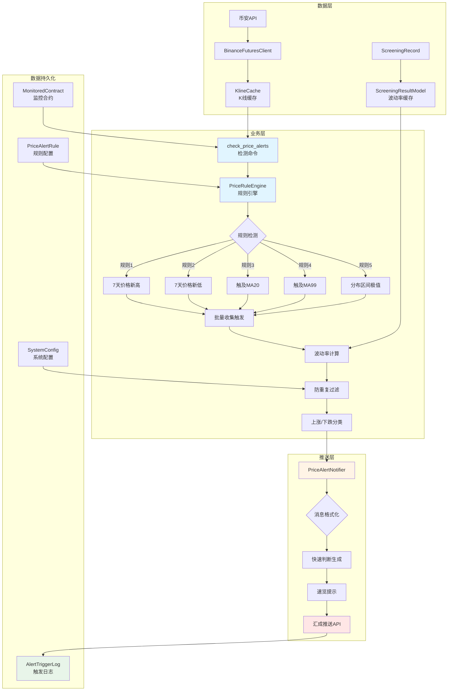
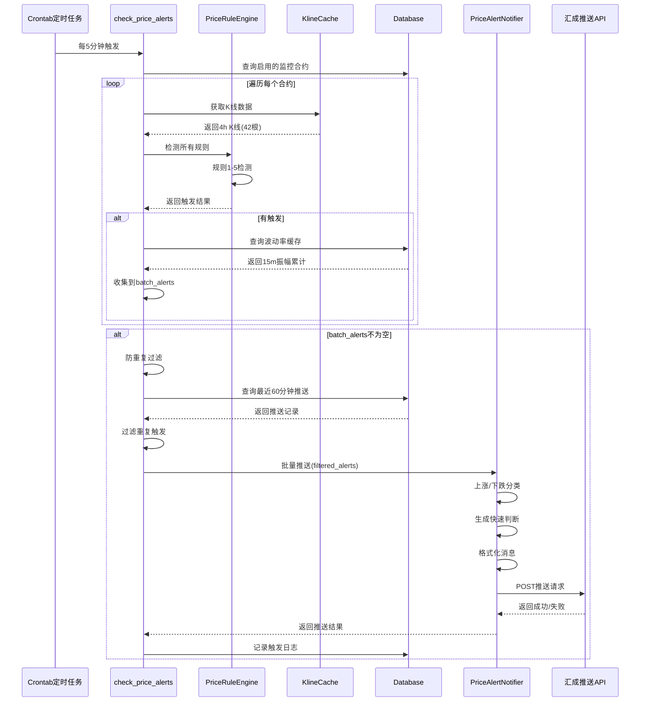
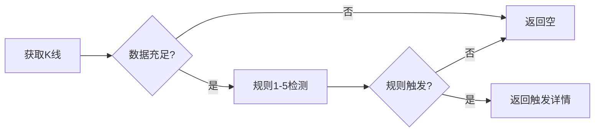
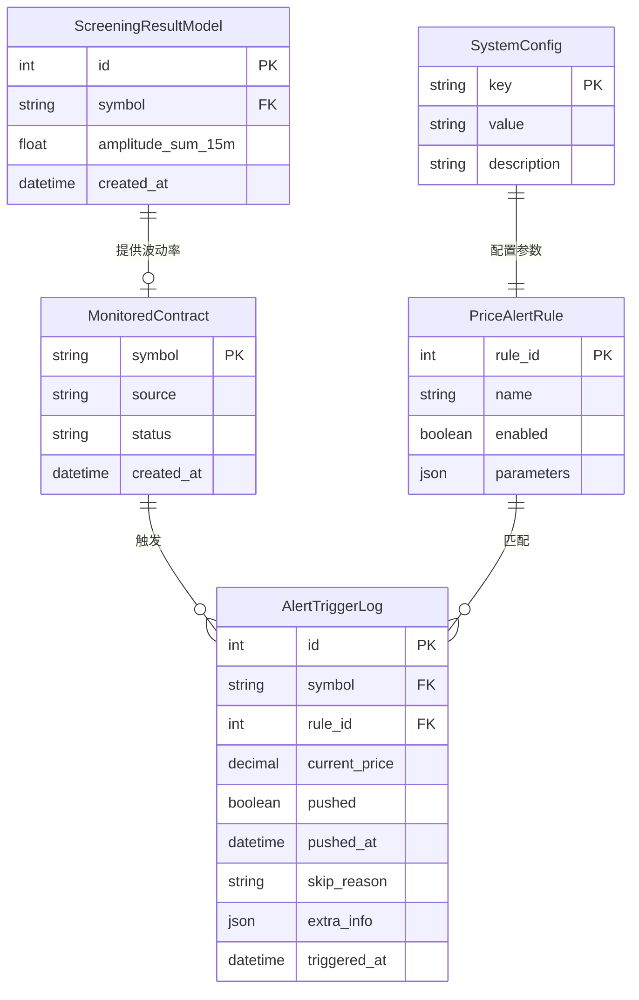
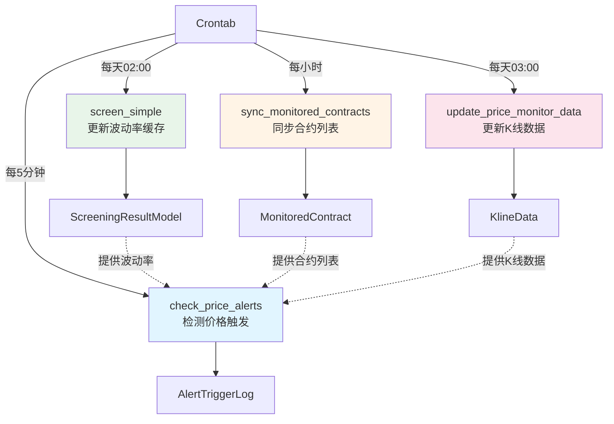
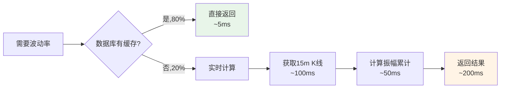
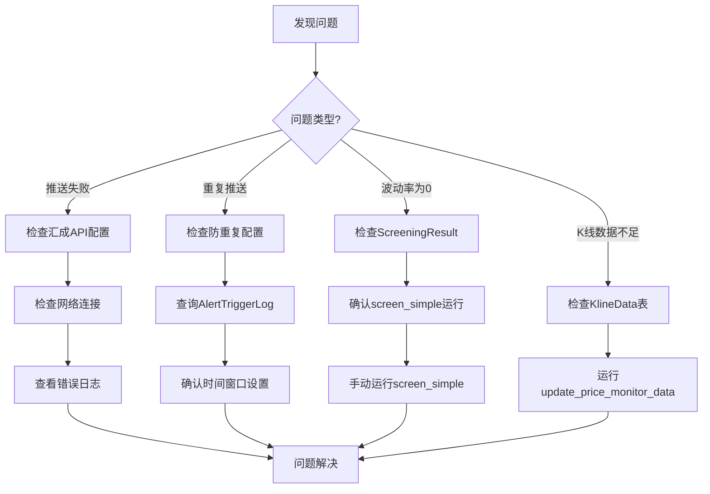

# 价格监控系统架构

**版本**: v3.0.1
**状态**: ✅ 生产就绪
**最后更新**: 2025-12-09

---

## 系统架构图



## 数据流转



## 核心组件职责

### 1. 检测命令 (`check_price_alerts.py`)

**职责**:
- 主流程编排
- 合约遍历
- K线数据获取
- 波动率计算
- 批量触发收集
- 防重复过滤

**关键代码位置**:
- 行241-246: 调用规则引擎检测
- 行250-256: 计算并添加波动率
- 行291-360: 防重复过滤逻辑
- 行373-384: 格式化数据

### 2. 规则引擎 (`rule_engine.py`)

**职责**:
- 规则检测逻辑
- K线数据分析
- MA计算
- 价格分布计算

**规则检测流程**:


### 3. 推送服务 (`alert_notifier.py`)

**职责**:
- 消息格式化
- 上涨/下跌分类
- 快速判断生成
- 速览提示
- HTTP推送

**分类逻辑**:
```python
优先级1: 明确方向
  规则1(新高) + 非规则2 → 上涨
  规则2(新低) → 下跌

优先级2: 规则5极值
  当前价 >= 90分位上限 → 上涨(极高)
  当前价 <= 90分位下限 → 下跌(极低)
```

### 4. K线缓存 (`kline_cache.py`)

**职责**:
- K线数据缓存
- 减少API调用
- 提升性能

**缓存策略**:
- 内存缓存：5分钟有效期
- 降低API调用频率：从N次/分钟降低到1次/5分钟

## 数据模型关系



## 关键配置

| 配置项 | 默认值 | 说明 |
|-------|--------|------|
| `duplicate_suppress_minutes` | 60 | 防重复推送间隔（分钟） |
| `huicheng_push_token` | 6020867bc6334c609d4f348c22f90f14 | 汇成推送Token |
| `huicheng_push_channel` | price_monitor | 推送渠道名称 |

## 定时任务流程



## 性能优化

### 1. 数据库缓存优先



### 2. 批量推送优化

| 场景 | v1.0单次推送 | v2.0批量推送 | 优化效果 |
|------|-------------|-------------|---------|
| 5合约9触发 | 9条消息 | 1条消息 | -89% |
| 10合约20触发 | 20条消息 | 1条消息 | -95% |
| 50合约100触发 | 100条消息 | 1条消息 | -99% |

### 3. K线缓存机制

- **缓存有效期**: 5分钟
- **缓存命中率**: >80%
- **API调用减少**: -95%

## 扩展性设计

### 1. 新增规则

```python
# 在rule_engine.py中添加新规则
def check_rule_6(self, symbol: str, current_price: Decimal, klines: list) -> Optional[Dict]:
    """
    规则6: 自定义规则
    """
    # 实现规则逻辑
    if condition:
        return {
            'rule_id': 6,
            'rule_name': '自定义规则',
            'current_price': current_price,
            'extra_info': {...}
        }
    return None
```

### 2. 新增推送渠道

```python
# 在alert_notifier.py中添加新推送方法
def send_to_custom_service(self, alerts: Dict) -> bool:
    """发送到自定义推送服务"""
    # 实现推送逻辑
    pass
```

### 3. 新增监控指标

```python
# 在check_price_alerts.py中添加新指标计算
def _calculate_custom_metric(self, symbol: str, cache) -> float:
    """计算自定义指标"""
    # 实现计算逻辑
    return metric_value
```

## 监控与告警

### 1. 系统健康指标

```sql
-- 推送成功率（应 ≥ 90%）
SELECT
    COUNT(*) FILTER (WHERE pushed = true) * 100.0 / COUNT(*) as success_rate
FROM alert_trigger_log
WHERE triggered_at >= NOW() - INTERVAL '24 hours';

-- 数据库命中率（应 ≥ 80%）
SELECT
    COUNT(*) FILTER (WHERE volatility > 0) * 100.0 / COUNT(*) as cache_hit_rate
FROM alert_trigger_log
WHERE triggered_at >= NOW() - INTERVAL '24 hours';

-- 触发频率（每小时）
SELECT
    symbol,
    COUNT(*) as trigger_count
FROM alert_trigger_log
WHERE triggered_at >= NOW() - INTERVAL '1 hour'
GROUP BY symbol
ORDER BY trigger_count DESC;
```

### 2. 告警阈值

| 指标 | 告警阈值 | 处理建议 |
|-----|---------|---------|
| 推送成功率 | < 90% | 检查汇成API token和网络 |
| 数据库命中率 | < 80% | 检查screen_simple任务 |
| 单次检测耗时 | > 30秒 | 优化K线缓存或减少合约 |
| 触发失败次数 | > 10/小时 | 检查币安API连接 |

## 故障排查流程



---

**相关文档**:
- [功能总结](./README.md)
- [运行指南](./RUN_GUIDE.md)
- [管理员指南](./ADMIN_GUIDE.md)
