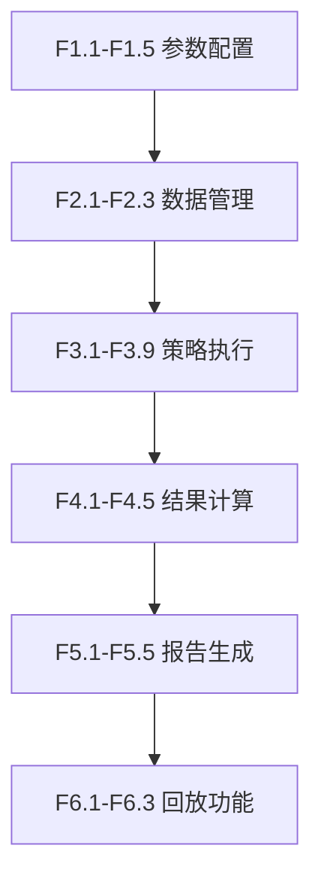

# 功能点清单 (Function Points Checklist)

**迭代编号**：001
**迭代名称**：做空网格回测系统
**生成时间**：2025-12-19
**状态**：已确认（P1阶段完成）

---

## 功能点统计

- **P0核心功能**：21个
- **P1可推迟功能**：10个
- **总计**：31个功能点

---

## P0 核心功能（MVP必须实现）

### 类别1：回测参数配置（5个）

| ID | 功能点 | 优先级 | 状态 | 描述 |
|----|--------|--------|------|------|
| F1.1 | 交易对选择 | P0 | 待开发 | 用户输入单个交易对（默认ETHUSDT） |
| F1.2 | 网格方向固定 | P0 | 待开发 | MVP固定为"做空"方向 |
| F1.3 | 网格范围设定 | P0 | 待开发 | 手动指定price_upper、price_lower、grid_count |
| F1.4 | 回测时间段选择 | P0 | 待开发 | 指定start_date和end_date（≤90天） |
| F1.5 | 止损比例设定 | P0 | 待开发 | 设定止损百分比（默认2%） |

### 类别2：K线数据管理（3个）

| ID | 功能点 | 优先级 | 状态 | 描述 |
|----|--------|--------|------|------|
| F2.1 | 1分钟K线本地缓存 | P0 | 待开发 | 从Binance API获取并缓存到PostgreSQL |
| F2.2 | K线数据查询接口 | P0 | 待开发 | 按时间范围查询1分钟K线，返回DataFrame |
| F2.3 | 缓存数据验证 | P0 | 待开发 | 检查缓存完整性，缺失则自动补充 |

### 类别3：做空策略执行模拟（9个）

| ID | 功能点 | 优先级 | 状态 | 描述 |
|----|--------|--------|------|------|
| F3.1 | 网格价格序列生成 | P0 | 待开发 | 根据上下界和网格数自动生成等间距价格序列 |
| F3.2 | 区间包含触发判断 | P0 | 待开发 | 实现`candle.low <= grid_price <= candle.high` |
| F3.3 | 卖出开空模拟 | P0 | 待开发 | 价格触及网格时开空单 |
| F3.4 | 买入平仓模拟 | P0 | 待开发 | 价格触及下一网格时平仓 |
| F3.5 | 持仓状态追踪 | P0 | 待开发 | 记录每个网格的开仓/平仓状态 |
| F3.6 | 重复开仓防护 | P0 | 待开发 | 同一网格同时最多1个未平仓空单 |
| F3.7 | 等额仓位分配 | P0 | 待开发 | 总资金平均分配到所有网格 |
| F3.8 | 手续费计算（0.1%） | P0 | 待开发 | 开仓和平仓均扣除0.1%手续费 |
| F3.9 | Decimal精度处理 | P0 | 待开发 | 使用Decimal避免浮点数误差 |

### 类别4：回测结果计算（5个）

| ID | 功能点 | 优先级 | 状态 | 描述 |
|----|--------|--------|------|------|
| F4.1 | 总盈亏计算 | P0 | 待开发 | 统计所有已平仓空单的盈亏总和 |
| F4.2 | 网格触发次数统计 | P0 | 待开发 | 记录开仓次数和平仓次数 |
| F4.3 | 收益率计算 | P0 | 待开发 | 基于初始资金计算收益率百分比 |
| F4.4 | 手续费统计 | P0 | 待开发 | 累计所有交易的手续费支出 |
| F4.5 | 止损触发记录 | P0 | 待开发 | 记录止损事件和止损损失 |

### 类别5：Web报告生成（5个）

| ID | 功能点 | 优先级 | 状态 | 描述 |
|----|--------|--------|------|------|
| F5.1 | 独立HTML页面生成 | P0 | 待开发 | 生成包含完整数据的单一HTML文件 |
| F5.2 | K线图表展示 | P0 | 待开发 | 使用ECharts绘制1分钟K线图表 |
| F5.3 | 网格线叠加 | P0 | 待开发 | 在K线图上显示所有网格价格水平线 |
| F5.4 | 开仓/平仓标记 | P0 | 待开发 | 在K线图上标注红点（开仓）和绿点（平仓） |
| F5.5 | 盈亏汇总表格 | P0 | 待开发 | 展示总盈亏、收益率、触发次数等关键指标 |

### 类别6：回放功能（3个）

| ID | 功能点 | 优先级 | 状态 | 描述 |
|----|--------|--------|------|------|
| F6.1 | 时间轴控制 | P0 | 待开发 | 提供播放/暂停按钮，按1分钟K线逐步推进 |
| F6.2 | 开平仓事件高亮 | P0 | 待开发 | 回放时高亮显示当前K线触发的事件 |
| F6.3 | 持仓状态实时显示 | P0 | 待开发 | 回放时显示当前各网格的持仓状态 |

---

## P1 可推迟功能（后续迭代）

### 类别1：回测参数配置（2个）

| ID | 功能点 | 优先级 | 状态 | 推迟理由 |
|----|--------|--------|------|----------|
| F1.6 | 多交易对批量回测 | P1 | 推迟 | MVP先验证单交易对逻辑正确性 |
| F1.7 | 做多方向支持 | P1 | 推迟 | 用户明确优先做空方向 |

### 类别2：K线数据管理（2个）

| ID | 功能点 | 优先级 | 状态 | 推迟理由 |
|----|--------|--------|------|----------|
| F2.4 | 数据更新机制 | P1 | 推迟 | MVP手动触发更新即可 |
| F2.5 | 多交易所支持 | P1 | 推迟 | 当前需求仅Binance |

### 类别3：做空策略执行模拟（2个）

| ID | 功能点 | 优先级 | 状态 | 推迟理由 |
|----|--------|--------|------|----------|
| F3.10 | 滑点模拟 | P1 | 推迟 | 1分钟K线已是简化，滑点增加复杂度 |
| F3.11 | 动态手续费率 | P1 | 推迟 | MVP使用固定费率0.1% |

### 类别4：回测结果计算（2个）

| ID | 功能点 | 优先级 | 状态 | 推迟理由 |
|----|--------|--------|------|----------|
| F4.6 | 最大回撤分析 | P1 | 推迟 | MVP先验证核心盈亏正确性 |
| F4.7 | 夏普比率 | P1 | 推迟 | 需要更复杂的统计计算 |

### 类别5：Web报告生成（1个）

| ID | 功能点 | 优先级 | 状态 | 推迟理由 |
|----|--------|--------|------|----------|
| F5.6 | 交互式图表 | P1 | 推迟 | 静态展示已满足基本需求 |

### 类别6：回放功能（2个）

| ID | 功能点 | 优先级 | 状态 | 推迟理由 |
|----|--------|--------|------|----------|
| F6.4 | 播放速度调节 | P1 | 推迟 | 固定速度回放已能满足需求 |
| F6.5 | 大数据量性能优化 | P1 | 推迟 | 发现瓶颈后针对性优化 |

---

## 功能点依赖关系

**说明**：
- 参数配置是所有功能的前置条件
- 数据管理依赖参数配置（需要知道交易对和时间范围）
- 策略执行依赖数据管理（需要K线数据）
- 结果计算依赖策略执行（需要持仓记录）
- 报告生成依赖结果计算（需要汇总数据）
- 回放功能依赖报告生成（需要完整的snapshot数据）

---

## 开发顺序建议

### 第1轮：核心回测引擎（F1-F4，预计2-3天）

1. **参数配置和数据管理**（0.5天）
   - F1.1-F1.5：实现参数输入和验证
   - F2.1-F2.3：实现1分钟K线缓存和查询

2. **网格逻辑和策略执行**（1-1.5天）
   - F3.1：网格价格序列生成
   - F3.2：触发判断逻辑（使用Decimal）
   - F3.3-F3.4：开仓/平仓模拟
   - F3.5-F3.6：持仓追踪和防护
   - F3.7-F3.8：仓位分配和手续费

3. **结果计算**（0.5天）
   - F4.1-F4.5：盈亏、触发次数、收益率、手续费、止损记录

4. **测试验证**（0.5-1天）
   - 单元测试：触发判断、盈亏计算
   - 集成测试：完整回测流程

### 第2轮：Web报告和回放（F5-F6，预计1-2天）

5. **报告生成**（0.5-1天）
   - F5.1：HTML页面框架
   - F5.2-F5.3：ECharts K线图和网格线
   - F5.4：开仓/平仓标记
   - F5.5：盈亏汇总表格

6. **回放功能**（0.5-1天）
   - F6.1：时间轴控制器
   - F6.2：事件高亮
   - F6.3：持仓状态实时显示

---

## 验收清单

每个功能点完成后，必须通过以下验收：

- [ ] **代码实现**：功能代码已编写并通过code review
- [ ] **单元测试**：核心逻辑有对应单元测试且通过
- [ ] **集成测试**：功能在完整回测流程中正常工作
- [ ] **文档更新**：相关文档（如有）已更新
- [ ] **性能达标**：满足PRD中的性能要求

---

## 附录：功能点详细说明

所有功能点的详细描述、输入输出、验证规则等，请参见：
- **PRD文档**：`docs/iterations/001-short-grid-backtest/prd.md` 第三章节

---

**文档结束**
