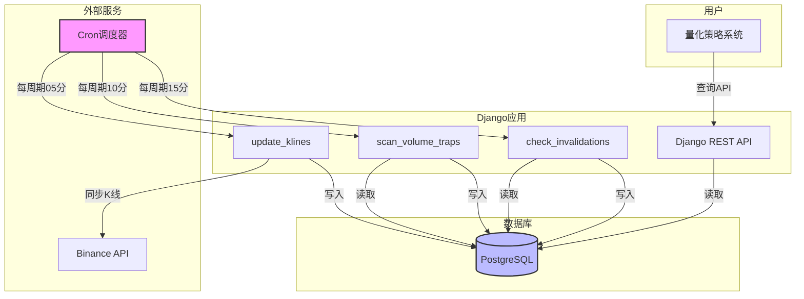

# 架构设计文档 - 巨量诱多/弃盘检测系统

**项目名称**: 加密货币量价异常检测系统
**迭代编号**: 002
**文档版本**: v1.0.0
**创建日期**: 2024-12-24
**生命周期阶段**: P4 - 架构设计
**上一阶段文档**: `prd.md`, `function-points.md`

---

## 阶段一：需求解读与目标对齐

### 核心业务目标

本系统旨在通过**三阶段状态机（异常放量发现→弃盘特征确认→长期特征锁定）**自动识别加密货币市场中"巨量诱多后资金弃盘"的异常标的，为量化策略提供早期预警信号，帮助投资者**在早期阶段规避做多陷阱或进行空头对冲**，降低错误做多导致的亏损风险。

---

### 关键用户流程

#### 1. 自动扫描阶段（阶段1-异常放量发现）
- 系统每个周期（1h/4h/1d可配置，默认4h）结束后，通过外部Cron触发Django management command
- 命令执行全量扫描：计算每个交易对的RVOL（相对成交量）和振幅异常指标
- 触发条件：同时满足"RVOL>8倍" AND "振幅>3倍均值" AND "显著上影线>50%"
- 系统动作：自动将符合条件的交易对加入"流动性监控池"（VolumeTrapMonitor表）
- 记录关键信息：P_trigger、V_trigger、trigger_kline_high/low

#### 2. 持续监控阶段（阶段2-弃盘特征确认）
- 系统持续监控已入池的交易对（status=pending）
- 计算3个确认指标：
  - 成交量留存率：avg(V_post) / V_trigger < 15%
  - 关键位跌破：close < min(中轴, 最低价)
  - 价差效率（PE）：|ΔPrice|/Volume > 历史均值×2
- 状态流转：三个指标同时满足 → status更新为"疑似弃盘"（suspected_abandonment）

#### 3. 长期验证阶段（阶段3-长期特征锁定）
- 系统持续监控"疑似弃盘"状态的交易对
- 计算3个长期指标：
  - 均线死叉：MA(7) < MA(25) AND MA(25)斜率 < 0
  - OBV单边下滑：连续5根K线无底背离
  - ATR波动率压缩：连续5根递减 AND ATR < 历史均值×50%
- 状态流转：三个指标同时满足 → status更新为"确定弃盘"（confirmed_abandonment）

#### 4. 失效检测与清理
- 系统持续检测所有非invalidated状态的监控记录
- 失效条件：价格收盘重新站上P_trigger
- 状态流转：status更新为"失效"（invalidated）
- 清理策略：失效记录保留180天后归档

#### 5. 查询与决策
- 用户通过RESTful API查询监控池列表（支持按状态、周期筛选）
- 查看详细指标快照历史和状态转换日志
- 基于预警信号调整量化策略

---

## 阶段二：架构设计与可视化

### 核心架构图

```mermaid
flowchart TB
    %% 外部系统和用户
    User[("用户/量化策略<br/>查询预警信号")]
    Cron["外部Cron<br/>定时任务调度器"]
    Binance["Binance API<br/>K线数据源"]

    %% API服务层
    subgraph API["API服务层"]
        MonitorListAPI["MonitorListAPI<br/>(Django REST)<br/>监控池列表查询"]
        MonitorDetailAPI["MonitorDetailAPI<br/>(Django REST)<br/>监控详情查询"]
        StatsAPI["StatisticsAPI<br/>(Django REST)<br/>统计数据查询"]
    end

    %% 管理命令层
    subgraph Commands["管理命令层"]
        UpdateKlines["update_klines<br/>(Management Command)<br/>K线数据更新"]
        ScanTraps["scan_volume_traps<br/>(Management Command)<br/>监控扫描"]
        CheckInvalid["check_invalidations<br/>(Management Command)<br/>失效检测"]
    end

    %% 状态机管理层
    subgraph StateMachine["状态机管理层"]
        FSM["VolumeTrapStateMachine<br/>(业务逻辑)<br/>三阶段状态流转"]
        InvalidDetector["InvalidationDetector<br/>(业务逻辑)<br/>失效检测器"]
    end

    %% 检测器层（按职责命名）
    subgraph Detectors["检测器层 (Detectors)"]
        subgraph VolumeDetectors["成交量检测器"]
            RVOL["RVOLCalculator<br/>相对成交量计算"]
            VolumeRetention["VolumeRetentionAnalyzer<br/>成交量留存分析"]
        end

        subgraph PriceDetectors["价格检测器"]
            Amplitude["AmplitudeDetector<br/>振幅异常检测"]
            KeyLevel["KeyLevelBreachDetector<br/>关键位跌破检测"]
            PriceEff["PriceEfficiencyAnalyzer<br/>价差效率分析"]
        end

        subgraph TrendDetectors["趋势检测器"]
            MA["MovingAverageCrossDetector<br/>均线交叉检测"]
            OBV["OBVDivergenceAnalyzer<br/>OBV背离分析"]
            ATR["ATRCompressionDetector<br/>ATR压缩检测"]
        end
    end

    %% 条件评估器
    Evaluator["ConditionEvaluator<br/>(条件评估器)<br/>组合检测结果"]

    %% 数据采集层
    subgraph DataLayer["数据采集层"]
        KLineSync["KLineDataSyncService<br/>(数据服务)<br/>K线数据同步"]
        FuturesProvider["FuturesContractProvider<br/>(数据服务)<br/>交易对列表提供"]
    end

    %% 持久化层
    subgraph Persistence["持久化层 (PostgreSQL)"]
        MonitorDB[("VolumeTrapMonitor<br/>监控池记录")]
        IndicatorsDB[("VolumeTrapIndicators<br/>指标快照")]
        TransitionDB[("VolumeTrapStateTransition<br/>状态转换日志")]
        KLineDB[("KLine<br/>K线数据(复用)")]
        ContractDB[("FuturesContract<br/>交易对列表(复用)")]
    end

    %% 用户交互流
    User -->|"HTTPS/JSON"| MonitorListAPI
    User -->|"HTTPS/JSON"| MonitorDetailAPI
    User -->|"HTTPS/JSON"| StatsAPI

    %% API层到数据库
    MonitorListAPI -->|"Django ORM"| MonitorDB
    MonitorDetailAPI -->|"Django ORM"| IndicatorsDB
    StatsAPI -->|"Django ORM"| MonitorDB

    %% Cron触发命令
    Cron -->|"CLI"| UpdateKlines
    Cron -->|"CLI"| ScanTraps
    Cron -->|"CLI"| CheckInvalid

    %% 命令层调用服务层
    UpdateKlines -->|"函数调用"| KLineSync
    ScanTraps -->|"函数调用"| FSM
    CheckInvalid -->|"函数调用"| InvalidDetector

    %% 数据采集层
    KLineSync -->|"HTTPS"| Binance
    KLineSync -->|"Django ORM"| KLineDB
    FuturesProvider -->|"Django ORM"| ContractDB

    %% 状态机调用检测器和评估器
    FSM -->|"请求检测"| RVOL
    FSM -->|"请求检测"| Amplitude
    FSM -->|"请求检测"| VolumeRetention
    FSM -->|"请求检测"| KeyLevel
    FSM -->|"请求检测"| PriceEff
    FSM -->|"请求检测"| MA
    FSM -->|"请求检测"| OBV
    FSM -->|"请求检测"| ATR

    %% 检测器读取K线
    RVOL -->|"Django ORM"| KLineDB
    Amplitude -->|"Django ORM"| KLineDB
    VolumeRetention -->|"Django ORM"| KLineDB
    KeyLevel -->|"Django ORM"| KLineDB
    PriceEff -->|"Django ORM"| KLineDB
    MA -->|"Django ORM"| KLineDB
    OBV -->|"Django ORM"| KLineDB
    ATR -->|"Django ORM"| KLineDB

    %% 检测器结果汇总到评估器
    RVOL --> Evaluator
    Amplitude --> Evaluator
    VolumeRetention --> Evaluator
    KeyLevel --> Evaluator
    PriceEff --> Evaluator
    MA --> Evaluator
    OBV --> Evaluator
    ATR --> Evaluator

    %% 评估器返回状态转换决策
    Evaluator -->|"状态转换决策"| FSM

    %% 状态机写入数据库
    FSM -->|"状态更新"| MonitorDB
    FSM -->|"记录指标"| IndicatorsDB
    FSM -->|"记录转换"| TransitionDB

    %% 失效检测器
    InvalidDetector -->|"读取+更新"| MonitorDB
    InvalidDetector -->|"读取K线"| KLineDB

    %% 样式定义
    classDef external fill:#f9f,stroke:#333,stroke-width:2px
    classDef database fill:#bbf,stroke:#333,stroke-width:2px
    classDef api fill:#9f9,stroke:#333,stroke-width:2px
    classDef command fill:#ff9,stroke:#333,stroke-width:2px
    classDef detector fill:#f99,stroke:#333,stroke-width:2px
    classDef evaluator fill:#fcf,stroke:#333,stroke-width:2px

    class User,Cron,Binance external
    class MonitorDB,IndicatorsDB,TransitionDB,KLineDB,ContractDB database
    class MonitorListAPI,MonitorDetailAPI,StatsAPI api
    class UpdateKlines,ScanTraps,CheckInvalid command
    class RVOL,Amplitude,VolumeRetention,KeyLevel,PriceEff,MA,OBV,ATR detector
    class Evaluator evaluator
```



---

### 概念解读

这是一个**基于三阶段状态机的量价异常自动检测系统**，采用**分层架构**设计。系统通过**外部Cron驱动Django management command**，自动扫描全量交易对，使用**多维度量化指标检测器**逐级筛选异常标的，由**条件评估器**组合检测结果判断状态转换，并将状态机流转结果持久化到数据库，用户通过**被动查询API**获取预警信号。

**核心设计原则**：
- **单一职责**：每个检测器只负责一种量化指标计算
- **开闭原则**：检测器可扩展、可替换，无需修改状态机代码
- **依赖注入**：状态机通过构造函数注入检测器依赖
- **职责命名**：按实际功能命名（如RVOLCalculator），而非按阶段编号（如Phase1Engine）

---

### 组件职责

#### **API服务层（用户交互）**

**MonitorListAPI**
- 提供监控池列表查询接口
- 支持按status（pending/suspected/confirmed/invalidated）和interval（1h/4h/1d）筛选
- 支持分页查询
- 返回监控记录+最新指标快照

**MonitorDetailAPI**
- 提供单个监控记录的详细信息
- 返回完整指标快照历史（时间序列）
- 返回状态转换日志

**StatisticsAPI**
- 提供统计数据（各状态数量、周期分布、近7天趋势）
- 用于Dashboard展示

---

#### **管理命令层（任务入口）**

**update_klines**
- Django management command
- 职责：触发KLineDataSyncService同步全量交易对的最新K线数据
- 执行频率：由外部Cron调度（每个K线周期结束后5分钟）
- 覆盖周期：1h、4h、1d
- 调用方式：`python manage.py update_klines --interval=4h`

**scan_volume_traps**
- Django management command
- 职责：触发VolumeTrapStateMachine执行三阶段扫描
  - 全量扫描：阶段1筛选（RVOL+振幅）
  - 增量扫描：对已入池记录执行阶段2/3判定
- 执行频率：由外部Cron调度（每个K线周期结束后10分钟）
- 调用方式：`python manage.py scan_volume_traps --interval=4h`

**check_invalidations**
- Django management command
- 职责：触发InvalidationDetector检测价格收复情况
- 执行频率：由外部Cron调度（每个K线周期结束后15分钟）
- 调用方式：`python manage.py check_invalidations --interval=4h`

---

#### **状态机管理层（核心业务逻辑）**

**VolumeTrapStateMachine**
- 职责：三阶段状态机的核心协调器
- 设计模式：依赖注入 + 策略模式
- 输入：交易对列表、K线数据、监控池记录
- 逻辑：
  - **发现阶段（Discovery）**：调用RVOL和Amplitude检测器，通过ConditionEvaluator评估是否满足"异常放量"条件 → 满足则创建Monitor记录（status=pending）
  - **确认阶段（Confirmation）**：对pending记录调用VolumeRetention、KeyLevel、PriceEfficiency检测器，评估是否满足"弃盘特征" → 满足则更新为suspected_abandonment
  - **验证阶段（Validation）**：对suspected记录调用MovingAverageCross、OBVDivergence、ATRCompression检测器，评估是否满足"长期特征" → 满足则更新为confirmed_abandonment
- 输出：状态更新、指标快照记录（状态变更时）、状态转换日志
- 扩展性：新增检测器只需在构造函数中注入，修改ConditionEvaluator的评估逻辑即可

**InvalidationDetector**
- 职责：检测价格收复失地的失效机制
- 输入：监控池记录、当前K线
- 逻辑：检查current_close是否 > P_trigger
- 输出：状态更新为invalidated、状态转换日志

---

#### **检测器层（量化指标计算）**

**设计原则**：每个检测器都是**独立的、可复用的、单一职责的**，按实际功能命名。

##### **成交量检测器（Volume Detectors）**

**RVOLCalculator（相对成交量计算器）**
- 职责：计算相对成交量指标（RVOL = V_now / MA(V, 20)）
- 输入：symbol、interval、当前K线、历史K线（21根）
- 输出：RVOL倍数值、是否异常（>阈值）
- 算法：pandas向量化计算移动平均
- 复用场景：可在多个阶段使用，也可用于其他策略

**VolumeRetentionAnalyzer（成交量留存分析器）**
- 职责：分析触发后成交量衰减情况
- 输入：Monitor记录、触发后3-5根K线、阈值（默认15%）
- 输出：平均成交量、留存率、是否满足条件
- 算法：avg(V_post) / V_trigger × 100
- 复用场景：可用于任何需要分析成交量衰减的场景

##### **价格检测器（Price Detectors）**

**AmplitudeDetector（振幅异常检测器）**
- 职责：检测价格振幅是否异常，判断上影线比例
- 输入：symbol、interval、当前K线、历史K线（31根）
- 输出：振幅倍数、上影线比例、是否异常
- 算法：
  - 振幅 = (high - low) / low × 100
  - 振幅倍数 = 当前振幅 / 过去30根均值
  - 上影线比例 = (high - close) / (high - low)
- 复用场景：可用于任何需要检测脉冲行为的场景

**KeyLevelBreachDetector（关键位跌破检测器）**
- 职责：检测价格是否跌破关键支撑位
- 输入：触发K线high/low、当前close
- 输出：关键位价格、是否跌破、跌破幅度
- 算法：
  - 关键位 = min((high+low)/2, low)
  - 跌破判断：current_close < key_level
- 复用场景：可用于任何需要判断支撑位的场景

**PriceEfficiencyAnalyzer（价差效率分析器）**
- 职责：分析价格变动效率（PE = |ΔPrice| / Volume）
- 输入：最近5根K线、历史30天K线、异常倍数（默认2）
- 输出：当前PE值、历史PE均值、是否异常
- 算法：
  - PE = |close - open| / volume
  - 异常判断：PE > 历史均值 × 2
- 复用场景：可用于任何需要分析卖盘深度的场景

##### **趋势检测器（Trend Detectors）**

**MovingAverageCrossDetector（均线交叉检测器）**
- 职责：检测均线死叉形态
- 输入：最近25根K线、短期周期（默认7）、长期周期（默认25）
- 输出：MA(7)值、MA(25)值、MA(25)斜率、是否死叉
- 算法：
  - MA(7) = avg(close[-7:])
  - MA(25) = avg(close[-25:])
  - 死叉判断：MA(7) < MA(25) AND MA(25)斜率 < 0
- 复用场景：可用于任何需要判断趋势的场景

**OBVDivergenceAnalyzer（OBV背离分析器）**
- 职责：分析OBV指标与价格的背离情况
- 输入：最近N根K线（N可配置）、背离检测窗口（默认5）
- 输出：OBV序列、是否存在底背离、持续下滑判断
- 算法：
  - OBV[i] = OBV[i-1] + volume[i] × sign(close[i] - close[i-1])
  - 底背离：价格新低时OBV未创新低
  - 单边下滑：连续5根K线无底背离
- 复用场景：可用于任何需要分析资金流向的场景

**ATRCompressionDetector（ATR压缩检测器）**
- 职责：检测波动率压缩（流动性荒漠）
- 输入：最近14根K线（计算ATR）、最近30根K线（计算基线）、压缩阈值（默认0.5）
- 输出：ATR(14)值、历史ATR均值、是否递减、是否压缩
- 算法：
  - TR = max(high-low, abs(high-close_prev), abs(low-close_prev))
  - ATR(14) = EMA(TR, 14)
  - 压缩判断：连续5根递减 AND ATR < 历史均值×0.5
- 复用场景：可用于任何需要判断波动率的场景

##### **条件评估器（Condition Evaluator）**

**ConditionEvaluator**
- 职责：组合多个检测器的结果，评估是否满足状态转换条件
- 输入：各检测器的结果对象
- 输出：状态转换决策（boolean）
- 方法：
  - `evaluate_discovery_condition()`：评估发现阶段条件
  - `evaluate_confirmation_condition()`：评估确认阶段条件
  - `evaluate_validation_condition()`：评估验证阶段条件
- 扩展性：修改条件组合逻辑只需修改此类，无需改动检测器

---

#### **数据采集层（数据源接口）**

**KLineDataSyncService**
- 职责：从Binance API获取K线数据并持久化
- 输入：symbol列表、interval、时间范围
- 输出：KLine表记录
- 特性：复用现有数据管道，增量更新

**FuturesContractProvider**
- 职责：提供全量活跃交易对列表
- 输入：exchange='binance', status='active'
- 输出：symbol数组
- 特性：直接查询FuturesContract表（复用）

---

#### **持久化层（数据模型）**

**VolumeTrapMonitor（新增）**
- 职责：存储监控池记录
- 字段：
  - `futures_contract`：外键关联FuturesContract
  - `interval`：周期（1h/4h/1d）
  - `trigger_time`：触发时间
  - `trigger_price`, `trigger_volume`：触发价格和成交量
  - `trigger_kline_high`, `trigger_kline_low`：触发K线高低点
  - `status`：状态（pending/suspected_abandonment/confirmed_abandonment/invalidated）
  - `phase_1_passed`, `phase_2_passed`, `phase_3_passed`：阶段标记
- 索引：
  - `UNIQUE(futures_contract, interval, trigger_time)`
  - `INDEX(status, trigger_time)`

**VolumeTrapIndicators（新增）**
- 职责：存储关键节点的指标快照（选择性存储）
- 存储时机：
  - 监控记录首次创建（阶段1触发）
  - 状态发生变更（pending→suspected→confirmed→invalidated）
- 字段：
  - `monitor`：外键关联VolumeTrapMonitor
  - `snapshot_time`：快照时间
  - 阶段1指标：`rvol_ratio`, `amplitude_ratio`, `upper_shadow_ratio`
  - 阶段2指标：`volume_retention_ratio`, `key_level_breach`, `price_efficiency`
  - 阶段3指标：`ma7`, `ma25`, `ma25_slope`, `obv`, `obv_divergence`, `atr`, `atr_compression`
- 索引：`INDEX(monitor, snapshot_time)`

**VolumeTrapStateTransition（新增）**
- 职责：存储状态转换日志
- 字段：
  - `monitor`：外键关联VolumeTrapMonitor
  - `from_status`, `to_status`：状态变更
  - `trigger_condition`：触发条件（JSON，记录具体指标值）
  - `transition_time`：转换时间
- 索引：`INDEX(monitor, transition_time)`

**KLine（复用）**
- 职责：存储多周期K线数据
- 复用现有backtest.KLine模型
- 索引：`INDEX(symbol, interval, open_time)`（已有）

**FuturesContract（复用）**
- 职责：存储交易对列表
- 复用现有monitor.FuturesContract模型

---

### 组件与需求映射

| 组件 | 实现的PRD功能点 |
|------|----------------|
| **KLineDataSyncService** | F1.1（多周期K线数据同步） |
| **FuturesContractProvider** | F1.2（全量交易对列表管理） |
| **RVOLCalculator** | F2.1（RVOL计算引擎） |
| **AmplitudeDetector** | F2.2（振幅异常检测） |
| **VolumeTrapStateMachine（发现阶段逻辑）** | F2.3（监控池自动入库） |
| **VolumeRetentionAnalyzer** | F3.1（成交量留存率监控） |
| **KeyLevelBreachDetector** | F3.2（关键位跌破检测） |
| **PriceEfficiencyAnalyzer** | F3.3（价差效率计算） |
| **VolumeTrapStateMachine（确认阶段逻辑）** | F3.4（状态流转：pending→suspected） |
| **MovingAverageCrossDetector** | F4.1（均线系统计算） |
| **OBVDivergenceAnalyzer** | F4.2（OBV持续性分析） |
| **ATRCompressionDetector** | F4.3（ATR波动率压缩检测） |
| **VolumeTrapStateMachine（验证阶段逻辑）** | F4.4（状态流转：suspected→confirmed） |
| **ConditionEvaluator** | 条件组合评估（跨多个功能点） |
| **InvalidationDetector** | F5.1（价格收复检测）、F5.2（监控池清理策略-部分） |
| **update_klines** | F6.1（K线数据更新任务） |
| **scan_volume_traps** | F6.2（监控扫描任务） |
| **check_invalidations** | F6.3（失效检测任务） |
| **MonitorListAPI** | F7.1（监控池列表API） |
| **MonitorDetailAPI** | F7.2（详情API） |
| **StatisticsAPI** | F7.3（统计API） |

---

### 交互说明（关键数据流）

#### **数据流1：K线数据更新（外部Cron触发）**
```
外部Cron → update_klines command → KLineDataSyncService → Binance API
                                                ↓
                                          KLine表（写入）
```

**调度配置示例（Crontab）**：
```cron
# 1小时周期：每小时05分执行
5 * * * * /path/to/python /path/to/manage.py update_klines --interval=1h

# 4小时周期：每4小时05分执行
5 */4 * * * /path/to/python /path/to/manage.py update_klines --interval=4h

# 1天周期：每天00:05执行
5 0 * * * /path/to/python /path/to/manage.py update_klines --interval=1d
```

---

#### **数据流2：监控扫描（三阶段状态机）**
```
外部Cron → scan_volume_traps command → VolumeTrapStateMachine
                                              ↓
                    ┌─────────────────────────┼─────────────────────────┐
                    ↓                         ↓                         ↓
            发现阶段检测器             确认阶段检测器              验证阶段检测器
            ├─ RVOLCalculator          ├─ VolumeRetentionAnalyzer ├─ MovingAverageCrossDetector
            └─ AmplitudeDetector       ├─ KeyLevelBreachDetector  ├─ OBVDivergenceAnalyzer
                    ↓                  └─ PriceEfficiencyAnalyzer └─ ATRCompressionDetector
            批量读取KLine                         ↓                         ↓
            (prefetch_related)            读取KLine                  读取KLine
                    ↓                             ↓                         ↓
            pandas向量化计算               计算留存+PE+跌破          计算MA+OBV+ATR
            RVOL+振幅(500交易对)                  ↓                         ↓
                    └─────────────────────────────┼─────────────────────────┘
                                                  ↓
                                        ConditionEvaluator
                                       （组合检测结果，评估条件）
                                                  ↓
                                    VolumeTrapMonitor（状态更新）
                                                  ↓
                          VolumeTrapIndicators（选择性快照：状态变更时）
                                                  ↓
                          VolumeTrapStateTransition（状态日志）
```

**调度配置示例（Crontab）**：
```cron
# 4小时周期：每4小时10分执行（在K线更新后）
10 */4 * * * /path/to/python /path/to/manage.py scan_volume_traps --interval=4h
```

**性能优化要点**：
- **批量查询**：使用`prefetch_related('klines')`一次性加载所有交易对的K线数据
- **向量化计算**：使用pandas的`rolling().mean()`计算RVOL、振幅
- **内存计算**：500交易对×30根K线×3周期≈45000条记录，约10-20MB内存
- **预估耗时**：30-60秒（理论值3秒，实际含数据库IO）
- **检测器独立**：每个检测器可独立测试和优化

**扩展性说明**：
- 添加新检测器：只需实现新的Detector类，在StateMachine中注入
- 修改检测逻辑：只需修改相应的Detector实现，不影响其他组件
- 调整条件组合：只需修改ConditionEvaluator的评估方法

---

#### **数据流3：失效检测**
```
外部Cron → check_invalidations command → InvalidationDetector
                                                ↓
                             读取VolumeTrapMonitor（status != invalidated）
                                                ↓
                                           读取KLine（当前价格）
                                                ↓
                              判断：current_close > P_trigger?
                                                ↓
                                   是 → 更新status=invalidated
                                                ↓
                                VolumeTrapStateTransition（记录状态日志）
```

**调度配置示例（Crontab）**：
```cron
# 4小时周期：每4小时15分执行（在监控扫描后）
15 */4 * * * /path/to/python /path/to/manage.py check_invalidations --interval=4h
```

---

#### **数据流4：用户查询**
```
用户 → MonitorListAPI → VolumeTrapMonitor（筛选+分页）
                              ↓
                       VolumeTrapIndicators（最新快照）
                              ↓
                        返回JSON结果
```

**API示例**：
```http
GET /api/volume-trap/monitors/?status=suspected_abandonment&interval=4h&page=1&page_size=20
```

---

## 阶段三：关键决策点与方案评估

### 决策点一：定时任务框架选择

**最终决策**：✅ **Django Management Command + 外部Cron**

**方案描述**：
- 任务逻辑使用Django management command实现（`update_klines`, `scan_volume_traps`, `check_invalidations`）
- 定时调度由外部Cron工具负责（系统crontab或Kubernetes CronJob）
- 项目不集成定时任务框架（django-crontab、Celery等）

**决策理由**：
1. **职责分离**：任务逻辑（Django）与调度（Cron）分离，架构清晰
2. **灵活性高**：可随时手动执行命令进行调试或补数据
3. **运维友好**：Cron配置直观，易于监控和调整
4. **无额外依赖**：无需引入Redis、RabbitMQ等中间件

**实施要点**：
- 命令实现标准错误处理和日志记录
- 使用Django的`--traceback`参数便于调试
- Cron配置时确保任务间依赖关系（5分钟→10分钟→15分钟）

---

### 决策点二：全量扫描性能优化策略

**最终决策**：✅ **方案A：批量查询+内存计算（同步执行）**

**方案描述**：
- 一次性加载所有需要的K线数据到内存
- 使用pandas/numpy进行向量化计算
- 同步执行所有判定逻辑

**决策理由**：
1. **性能足够**：500交易对×3周期，单核执行<2分钟（远低于5分钟目标）
2. **实现简单**：逻辑清晰，易于调试，无并发复杂性
3. **内存可控**：45000条K线数据约10-20MB，现代服务器完全可承受
4. **KISS原则**：先用最简单的方案验证，性能不足再优化

**性能估算**：
```python
# 粗略计算
500 交易对 × 3 周期 = 1500 次阶段1判定
每次判定需要：
  - 查询30根K线（已通过prefetch_related批量查询，摊销成本低）
  - 计算RVOL：O(20) 向量化
  - 计算振幅：O(30) 向量化
  - 合计：约1-2ms/次

总耗时：1500 × 2ms = 3秒（理论值）
实际耗时考虑数据库IO：约30-60秒
```

**实施要点**：
- 使用Django ORM的`prefetch_related`预加载K线数据
- 使用pandas的`rolling().mean()`计算移动平均
- 确保索引`(symbol, interval, open_time)`存在（已有）
- 若性能不达标，后续可迁移到Celery异步处理

---

### 决策点三：指标快照存储策略

**最终决策**：✅ **方案B：选择性快照（状态变更时存储）**

**方案描述**：
仅在以下情况存储指标快照：
- 监控记录首次创建（阶段1触发）
- 状态发生变更（pending→suspected→confirmed→invalidated）

**决策理由**：
1. **MVP原则**：当前阶段不需要完整的指标历史，关键是捕捉状态变更时刻
2. **存储高效**：只存储关键节点，数据量降低80-90%
3. **性能优先**：查询详情API返回快照历史，数据量越少性能越好
4. **可进化**：若未来需要完整历史（如回测优化），可平滑升级到分层存储

**存储时机**：
| 事件 | 是否存储快照 | 备注 |
|------|-------------|------|
| 监控记录创建（阶段1触发） | ✅ 是 | 记录RVOL、振幅、上影线 |
| pending→suspected_abandonment | ✅ 是 | 记录成交量留存、PE、跌破状态 |
| suspected→confirmed_abandonment | ✅ 是 | 记录MA、OBV、ATR |
| 任意→invalidated | ✅ 是 | 记录失效时的价格 |
| pending状态持续（无变更） | ❌ 否 | 不存储中间快照 |

**实施要点**：
- 在VolumeTrapStateMachine的状态流转逻辑中，插入快照存储调用
- 快照记录完整的指标数据（包括计算中间值，便于调试）
- 在MonitorDetailAPI中，若快照过少，可实时计算当前指标并返回（但不持久化）

---

### 决策点四：检测器架构设计（新增）⭐

**最终决策**：✅ **方案：检测器 + 条件评估器分离**

**问题背景**：
- 原设计使用Phase1/2/3Engine按阶段编号命名，存在严重扩展性问题
- 阶段编号硬编码，职责不清晰，违反开闭原则
- 添加新检测逻辑、调整阶段顺序都需要大量改动

**方案描述**：
- **按职责命名检测器**：如RVOLCalculator、AmplitudeDetector，而非Phase1Engine
- **单一职责原则**：每个检测器只负责一种量化指标计算
- **状态机协调**：VolumeTrapStateMachine通过依赖注入使用检测器
- **条件评估器**：ConditionEvaluator组合检测结果，判断状态转换

**架构改进**：
```
旧架构（硬编码阶段）：
StateMachine → Phase1Engine → {RVOL + Amplitude}
             → Phase2Engine → {VolumeRetention + KeyLevel + PE}
             → Phase3Engine → {MA + OBV + ATR}

新架构（按职责分离）：
StateMachine → RVOLCalculator
             → AmplitudeDetector
             → VolumeRetentionAnalyzer
             → KeyLevelBreachDetector
             → PriceEfficiencyAnalyzer
             → MovingAverageCrossDetector
             → OBVDivergenceAnalyzer
             → ATRCompressionDetector
             ↓
        ConditionEvaluator（组合检测结果）
             ↓
        状态转换决策
```

**决策理由**：
1. **符合SOLID原则**：
   - 单一职责（SRP）：每个Detector只做一件事
   - 开闭原则（OCP）：对扩展开放，对修改关闭
   - 依赖倒置（DIP）：StateMachine依赖Detector接口
2. **扩展性强**：添加新检测器无需修改现有代码
3. **可测试性好**：每个检测器可独立单元测试
4. **可复用性强**：检测器可在不同场景复用
5. **职责清晰**：类名即文档，代码自解释

**实施要点**：
- 定义统一的Detector接口（可选，Python可用ABC）
- 实现8个独立检测器类
- 实现ConditionEvaluator，包含3个评估方法
- StateMachine通过构造函数注入检测器依赖
- 每个检测器编写独立的单元测试

---

## 阶段四：技术实现细节

### 数据库设计（Django Models）

#### **VolumeTrapMonitor（监控池记录）**

```python
class VolumeTrapMonitor(models.Model):
    """巨量诱多/弃盘监控池"""

    # 关联交易对
    futures_contract = models.ForeignKey(
        'monitor.FuturesContract',
        on_delete=models.CASCADE,
        related_name='volume_trap_monitors',
        verbose_name='关联合约'
    )

    # 监控周期配置
    interval = models.CharField(
        max_length=10,
        choices=[('1h', '1小时'), ('4h', '4小时'), ('1d', '1天')],
        default='4h',
        help_text='K线周期'
    )

    # 触发信息
    trigger_time = models.DateTimeField('触发时间', db_index=True)
    trigger_price = models.DecimalField('触发价格', max_digits=20, decimal_places=8)
    trigger_volume = models.DecimalField('触发成交量', max_digits=30, decimal_places=8)
    trigger_kline_high = models.DecimalField('触发K线最高价', max_digits=20, decimal_places=8)
    trigger_kline_low = models.DecimalField('触发K线最低价', max_digits=20, decimal_places=8)

    # 状态机
    status = models.CharField(
        max_length=30,
        choices=[
            ('pending', '待观察'),
            ('suspected_abandonment', '疑似弃盘'),
            ('confirmed_abandonment', '确定弃盘'),
            ('invalidated', '失效')
        ],
        default='pending',
        db_index=True
    )

    # 阶段标记
    phase_1_passed = models.BooleanField('阶段1通过', default=True)
    phase_2_passed = models.BooleanField('阶段2通过', default=False)
    phase_3_passed = models.BooleanField('阶段3通过', default=False)

    # 时间戳
    created_at = models.DateTimeField(auto_now_add=True)
    updated_at = models.DateTimeField(auto_now=True)

    class Meta:
        db_table = 'volume_trap_monitor'
        unique_together = [['futures_contract', 'interval', 'trigger_time']]
        indexes = [
            models.Index(fields=['status', '-trigger_time']),
            models.Index(fields=['futures_contract', 'status']),
            models.Index(fields=['interval', 'status']),
        ]
        verbose_name = '量价异常监控'
        verbose_name_plural = '量价异常监控'
```

---

#### **VolumeTrapIndicators（指标快照）**

```python
class VolumeTrapIndicators(models.Model):
    """量化指标快照 - 选择性存储（状态变更时）"""

    # 关联监控记录
    monitor = models.ForeignKey(
        'VolumeTrapMonitor',
        on_delete=models.CASCADE,
        related_name='indicators',
        verbose_name='关联监控记录'
    )

    # 快照时间
    snapshot_time = models.DateTimeField('快照时间', db_index=True)
    kline_close_price = models.DecimalField('K线收盘价', max_digits=20, decimal_places=8)

    # 阶段1指标
    rvol_ratio = models.DecimalField(
        'RVOL倍数', max_digits=10, decimal_places=2, null=True,
        help_text='当前成交量 / MA(V,20)'
    )
    amplitude_ratio = models.DecimalField(
        '振幅倍数', max_digits=10, decimal_places=2, null=True,
        help_text='当前振幅 / 过去30根均值'
    )
    upper_shadow_ratio = models.DecimalField(
        '上影线比例', max_digits=5, decimal_places=2, null=True,
        help_text='(最高-收盘)/(最高-最低) * 100'
    )

    # 阶段2指标
    volume_retention_ratio = models.DecimalField(
        '成交量留存率', max_digits=5, decimal_places=2, null=True,
        help_text='avg(V_post) / V_trigger * 100'
    )
    key_level_breach = models.BooleanField('关键位跌破', default=False, null=True)
    price_efficiency = models.DecimalField(
        '价差效率', max_digits=20, decimal_places=8, null=True,
        help_text='|ΔPrice| / Volume'
    )

    # 阶段3指标
    ma7 = models.DecimalField('MA(7)', max_digits=20, decimal_places=8, null=True)
    ma25 = models.DecimalField('MA(25)', max_digits=20, decimal_places=8, null=True)
    ma25_slope = models.DecimalField('MA(25)斜率', max_digits=10, decimal_places=6, null=True)
    obv = models.DecimalField('OBV', max_digits=30, decimal_places=2, null=True)
    obv_divergence = models.BooleanField('OBV底背离', default=False, null=True)
    atr = models.DecimalField('ATR', max_digits=20, decimal_places=8, null=True)
    atr_compression = models.BooleanField('ATR压缩', default=False, null=True)

    # 元数据
    created_at = models.DateTimeField(auto_now_add=True)

    class Meta:
        db_table = 'volume_trap_indicators'
        ordering = ['monitor', '-snapshot_time']
        indexes = [
            models.Index(fields=['monitor', '-snapshot_time']),
        ]
        verbose_name = '量价异常指标快照'
        verbose_name_plural = '量价异常指标快照'
```

---

#### **VolumeTrapStateTransition（状态转换日志）**

```python
class VolumeTrapStateTransition(models.Model):
    """状态转换日志"""

    # 关联监控记录
    monitor = models.ForeignKey(
        'VolumeTrapMonitor',
        on_delete=models.CASCADE,
        related_name='state_transitions',
        verbose_name='关联监控记录'
    )

    # 状态转换
    from_status = models.CharField('原状态', max_length=30)
    to_status = models.CharField('新状态', max_length=30)

    # 触发条件（JSON格式）
    trigger_condition = models.JSONField(
        '触发条件',
        help_text='记录触发状态变更的具体指标值'
    )

    # 时间
    transition_time = models.DateTimeField('转换时间')
    created_at = models.DateTimeField(auto_now_add=True)

    class Meta:
        db_table = 'volume_trap_state_transition'
        ordering = ['monitor', 'transition_time']
        indexes = [
            models.Index(fields=['monitor', 'transition_time']),
        ]
        verbose_name = '状态转换日志'
        verbose_name_plural = '状态转换日志'
```

---

### Django Management Commands

#### **update_klines.py**

```python
from django.core.management.base import BaseCommand
from volume_trap.services.kline_sync_service import KLineDataSyncService

class Command(BaseCommand):
    help = 'Update K-line data from Binance API'

    def add_arguments(self, parser):
        parser.add_argument(
            '--interval',
            type=str,
            default='4h',
            choices=['1h', '4h', '1d'],
            help='K-line interval'
        )

    def handle(self, *args, **options):
        interval = options['interval']
        self.stdout.write(f'Starting K-line update for interval: {interval}')

        service = KLineDataSyncService()
        result = service.sync_all_contracts(interval=interval)

        self.stdout.write(self.style.SUCCESS(
            f'Successfully updated {result["success_count"]} contracts, '
            f'{result["failed_count"]} failed'
        ))
```

---

#### **scan_volume_traps.py**

```python
from django.core.management.base import BaseCommand
from volume_trap.services.volume_trap_fsm import VolumeTrapStateMachine

class Command(BaseCommand):
    help = 'Scan for volume trap signals across all contracts'

    def add_arguments(self, parser):
        parser.add_argument(
            '--interval',
            type=str,
            default='4h',
            choices=['1h', '4h', '1d'],
            help='K-line interval'
        )

    def handle(self, *args, **options):
        interval = options['interval']
        self.stdout.write(f'Starting volume trap scan for interval: {interval}')

        fsm = VolumeTrapStateMachine()
        result = fsm.scan(interval=interval)

        self.stdout.write(self.style.SUCCESS(
            f'Phase1 triggered: {result["phase1_triggered"]}, '
            f'Phase2 passed: {result["phase2_passed"]}, '
            f'Phase3 passed: {result["phase3_passed"]}'
        ))
```

---

#### **check_invalidations.py**

```python
from django.core.management.base import BaseCommand
from volume_trap.services.invalidation_detector import InvalidationDetector

class Command(BaseCommand):
    help = 'Check for price recovery invalidations'

    def add_arguments(self, parser):
        parser.add_argument(
            '--interval',
            type=str,
            default='4h',
            choices=['1h', '4h', '1d'],
            help='K-line interval'
        )

    def handle(self, *args, **options):
        interval = options['interval']
        self.stdout.write(f'Starting invalidation check for interval: {interval}')

        detector = InvalidationDetector()
        result = detector.check_all(interval=interval)

        self.stdout.write(self.style.SUCCESS(
            f'Invalidated {result["invalidated_count"]} monitors'
        ))
```

---

### 部署架构图



---

### 配置参数表

| 参数名 | 默认值 | 说明 | 配置位置 |
|--------|--------|------|----------|
| `RVOL_THRESHOLD` | 8 | RVOL触发倍数 | settings.py |
| `AMPLITUDE_THRESHOLD` | 3 | 振幅触发倍数 | settings.py |
| `UPPER_SHADOW_THRESHOLD` | 0.5 | 上影线比例阈值 | settings.py |
| `VOLUME_RETENTION_THRESHOLD` | 15 | 成交量留存率阈值(%) | settings.py |
| `PE_MULTIPLIER` | 2 | PE异常倍数 | settings.py |
| `OBV_LOOKBACK_PERIODS` | 5 | OBV背离检测窗口 | settings.py |
| `ATR_COMPRESSION_THRESHOLD` | 0.5 | ATR压缩阈值 | settings.py |
| `DEFAULT_INTERVAL` | '4h' | 默认监控周期 | settings.py |
| `RETENTION_DAYS` | 180 | 数据保留天数 | settings.py |

**配置示例（settings.py）**：
```python
# Volume Trap Detection Settings
VOLUME_TRAP_CONFIG = {
    'RVOL_THRESHOLD': 8,
    'AMPLITUDE_THRESHOLD': 3,
    'UPPER_SHADOW_THRESHOLD': 0.5,
    'VOLUME_RETENTION_THRESHOLD': 15,
    'PE_MULTIPLIER': 2,
    'OBV_LOOKBACK_PERIODS': 5,
    'ATR_COMPRESSION_THRESHOLD': 0.5,
    'DEFAULT_INTERVAL': '4h',
    'RETENTION_DAYS': 180,
}
```

---

## 附录：Cron配置完整示例

### 生产环境Crontab配置

```cron
# ============================================
# 巨量诱多/弃盘检测系统 - 定时任务配置
# ============================================

# 环境变量
SHELL=/bin/bash
PATH=/usr/local/bin:/usr/bin:/bin
PYTHON=/path/to/venv/bin/python
MANAGE=/path/to/project/manage.py
LOG_DIR=/path/to/logs

# ============================================
# 1小时周期任务
# ============================================

# K线数据更新（每小时05分）
5 * * * * $PYTHON $MANAGE update_klines --interval=1h >> $LOG_DIR/update_klines_1h.log 2>&1

# 监控扫描（每小时10分）
10 * * * * $PYTHON $MANAGE scan_volume_traps --interval=1h >> $LOG_DIR/scan_1h.log 2>&1

# 失效检测（每小时15分）
15 * * * * $PYTHON $MANAGE check_invalidations --interval=1h >> $LOG_DIR/invalidation_1h.log 2>&1

# ============================================
# 4小时周期任务
# ============================================

# K线数据更新（每4小时05分：00:05, 04:05, 08:05, 12:05, 16:05, 20:05）
5 */4 * * * $PYTHON $MANAGE update_klines --interval=4h >> $LOG_DIR/update_klines_4h.log 2>&1

# 监控扫描（每4小时10分）
10 */4 * * * $PYTHON $MANAGE scan_volume_traps --interval=4h >> $LOG_DIR/scan_4h.log 2>&1

# 失效检测（每4小时15分）
15 */4 * * * $PYTHON $MANAGE check_invalidations --interval=4h >> $LOG_DIR/invalidation_4h.log 2>&1

# ============================================
# 1天周期任务
# ============================================

# K线数据更新（每天00:05）
5 0 * * * $PYTHON $MANAGE update_klines --interval=1d >> $LOG_DIR/update_klines_1d.log 2>&1

# 监控扫描（每天00:10）
10 0 * * * $PYTHON $MANAGE scan_volume_traps --interval=1d >> $LOG_DIR/scan_1d.log 2>&1

# 失效检测（每天00:15）
15 0 * * * $PYTHON $MANAGE check_invalidations --interval=1d >> $LOG_DIR/invalidation_1d.log 2>&1

# ============================================
# 维护任务
# ============================================

# 日志归档（每天03:00）
0 3 * * * find $LOG_DIR -name "*.log" -mtime +7 -exec gzip {} \; >> $LOG_DIR/maintenance.log 2>&1

# 数据清理（每周日03:30）
30 3 * * 0 $PYTHON $MANAGE cleanup_old_data --days=180 >> $LOG_DIR/cleanup.log 2>&1
```

---

## 总结

### 架构特点

1. **分层清晰**：API层、命令层、状态机层、检测器层、数据层职责分明
2. **状态机驱动**：三阶段状态机清晰描述业务流程，由ConditionEvaluator协调检测结果
3. **外部调度**：使用外部Cron工具，架构灵活、运维友好
4. **性能优化**：批量查询+pandas向量化计算，满足性能需求
5. **存储高效**：选择性快照策略，降低存储成本
6. **复用架构**：充分复用现有KLine、FuturesContract模型
7. **单一职责**：每个检测器只负责一种量化指标计算，职责清晰
8. **高度可扩展**：
   - 添加新检测器：只需实现Detector接口，注入到StateMachine
   - 修改检测逻辑：只需修改对应Detector实现，不影响其他组件
   - 调整条件组合：只需修改ConditionEvaluator评估方法
   - 符合开闭原则（OCP）：对扩展开放，对修改关闭
9. **易于测试**：每个检测器可独立单元测试，可以mock检测器测试状态机
10. **职责命名**：按实际功能命名（如RVOLCalculator），而非阶段编号，代码自解释

---

### 技术栈

- **后端框架**：Django + Django REST Framework
- **数据库**：PostgreSQL
- **计算库**：pandas、numpy（向量化计算）
- **定时调度**：外部Cron（系统crontab或Kubernetes CronJob）
- **数据源**：Binance API

---

### 下一步行动

1. ✅ 架构设计已完成，进入P5任务规划阶段
2. 使用 `/powerby.plan` 命令生成详细的开发任务计划
3. 基于架构设计拆解为可执行的开发任务

---

**文档结束**
