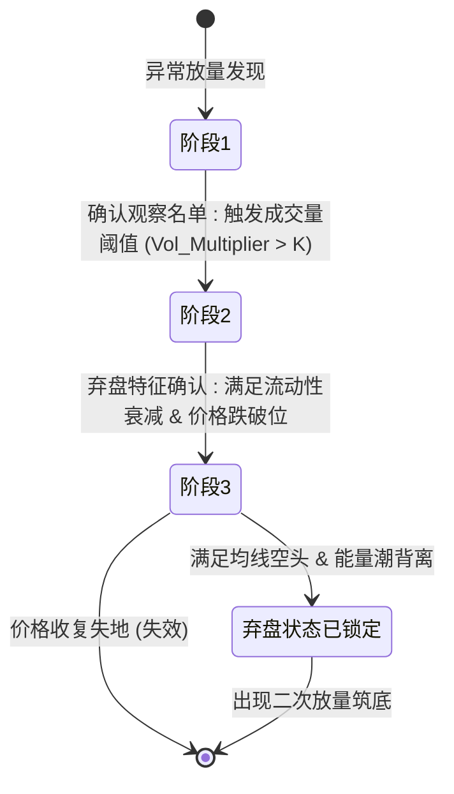

# 产品需求文档 (PRD) - 巨量诱多/弃盘检测系统

**项目名称**: 加密货币量价异常检测系统
**迭代编号**: 002
**文档版本**: v1.0.0
**创建日期**: 2024-12-24
**生命周期阶段**: P1 - 需求定义+澄清
**上一迭代**: 001-short-grid-backtest

---

## 第一部分：需求原始输入

### 1.1 业务目标

通过对 K 线量价行为，捕捉"巨量诱多/换手后缺乏承接"的异常标的，帮助量化策略在早期阶段规避陷阱或进行空头对冲。

### 1.2 系统核心流程 (State Machine)



### 1.3 阶段化量化需求描述

#### **第一阶段：发现（Discovery - 信号触发）**

**目标**：在海量币种中实时捕捉类似 ALLO 11月26日的脉冲行为。

**量化指标**：
- **相对成交量 (RVOL)**：V_now > MA(V, 20) × 8 (倍数可调)
- **换手率突变**：若有换手率数据，当前 4h 换手率需 > 过去 10 天平均换手率的 5 倍
- **振幅要求**：该 K 线振幅需超过过去 30 根 K 线平均振幅的 3 倍，且带有显著上影线

**系统动作**：将该币种自动加入"流动性监控池"，记录触发时刻的价格 (P_trigger) 和成交量 (V_trigger)。

#### **第二阶段：确认（Confirmation - 逃离识别）**

**目标**：识别巨量之后是"资金洗盘"还是"彻底弃盘"。

**量化指标**：
- **成交量留存率 (Volume Retention)**：触发后 3-5 个周期，平均成交量应 < V_trigger × 15%（代表买盘极度匮乏）
- **关键位跌破**：价格收盘跌破触发 K 线的 50% 分位（中轴）或最低点
- **价差效率 (Price Efficiency)**：ΔPrice/Volume 显著上升。即：极小的卖盘成交量就能导致价格大幅下跌，证明买盘深度（Bid Depth）已经撤离

**系统动作**：状态更新为"疑似弃盘"，在 UI 界面标记为黄色预警。

#### **第三阶段：确认（Validation - 长期特征锁定）**

**目标**：确认进入无底阴跌模式。

**量化指标**：
- **均线系统**：MA(7) 跌破 MA(25)，且 MA(25) 斜率转负
- **OBV 持续性**：OBV 指标在价格阴跌过程中没有出现任何底背离，呈现单边下滑
- **波动率压缩 (Volatility Squeeze)**：ATR 指标持续走低，反映出该币种已退出市场热点，进入流动性荒漠

**系统动作**：状态更新为"确定弃盘"，标记为红色状态。

---

## 第二部分：功能规格框架

### 2.1 核心价值定义

> **一句话价值**：通过三阶段状态机识别加密货币市场中"巨量诱多后资金弃盘"的异常标的，为量化策略提供早期预警信号，降低错误做多风险。

**核心假设**：
1. 脉冲式异常放量(RVOL > 8倍)可作为有效的初筛信号
2. 成交量留存率骤降(<15%)能区分"洗盘"和"弃盘"
3. 三阶段状态机可准确捕捉资金逃离的完整生命周期

### 2.2 数据模型设计（基于现有架构）

#### **2.2.1 复用现有模型**

**FuturesContract（交易对数据源）**
- 位置：`monitor/models.py`
- 用途：获取全量USDT永续合约列表
- 关键字段：`symbol`, `exchange`, `status`
- 筛选条件：`status='active'` AND `exchange.code='binance'`

**KLine（K线数据存储）**
- 位置：`backtest/models.py`
- 用途：存储多周期K线数据（1h/4h/1d）
- 关键字段：
  - `symbol`: 交易对（如BTCUSDT）
  - `interval`: 周期（'1h', '4h', '1d'）
  - `open_time`, `close_time`: 时间范围
  - `open_price`, `high_price`, `low_price`, `close_price`: OHLC
  - `volume`: 成交量
- 索引优化：已有 `['symbol', 'interval', 'open_time']` 复合索引

#### **2.2.2 新增模型**

**VolumeTrapMonitor（监控池记录）**
```python
class VolumeTrapMonitor(models.Model):
    """巨量诱多/弃盘监控池"""

    # 关联交易对
    futures_contract = models.ForeignKey(
        'monitor.FuturesContract',
        on_delete=models.CASCADE,
        related_name='volume_trap_monitors'
    )

    # 监控周期配置
    interval = models.CharField(
        max_length=10,
        choices=[('1h', '1小时'), ('4h', '4小时'), ('1d', '1天')],
        default='4h',
        help_text='K线周期'
    )

    # 触发信息
    trigger_time = models.DateTimeField('触发时间', db_index=True)
    trigger_price = models.DecimalField('触发价格', max_digits=20, decimal_places=8)
    trigger_volume = models.DecimalField('触发成交量', max_digits=30, decimal_places=8)
    trigger_kline_high = models.DecimalField('触发K线最高价', max_digits=20, decimal_places=8)
    trigger_kline_low = models.DecimalField('触发K线最低价', max_digits=20, decimal_places=8)

    # 状态机
    status = models.CharField(
        max_length=30,
        choices=[
            ('pending', '待观察'),
            ('suspected_abandonment', '疑似弃盘'),
            ('confirmed_abandonment', '确定弃盘'),
            ('invalidated', '失效')
        ],
        default='pending',
        db_index=True
    )

    # 阶段标记
    phase_1_passed = models.BooleanField('阶段1通过', default=True)
    phase_2_passed = models.BooleanField('阶段2通过', default=False)
    phase_3_passed = models.BooleanField('阶段3通过', default=False)

    # 时间戳
    created_at = models.DateTimeField(auto_now_add=True)
    updated_at = models.DateTimeField(auto_now=True)

    class Meta:
        db_table = 'volume_trap_monitor'
        unique_together = [['futures_contract', 'interval', 'trigger_time']]
        indexes = [
            models.Index(fields=['status', '-trigger_time']),
            models.Index(fields=['futures_contract', 'status']),
            models.Index(fields=['interval', 'status']),
        ]
```

**VolumeTrapIndicators（量化指标快照）**
```python
class VolumeTrapIndicators(models.Model):
    """量化指标快照 - 记录每次计算的指标值"""

    # 关联监控记录
    monitor = models.ForeignKey(
        'VolumeTrapMonitor',
        on_delete=models.CASCADE,
        related_name='indicators'
    )

    # 快照时间
    snapshot_time = models.DateTimeField('快照时间', db_index=True)
    kline_close_price = models.DecimalField('K线收盘价', max_digits=20, decimal_places=8)

    # 阶段1指标
    rvol_ratio = models.DecimalField(
        'RVOL倍数', max_digits=10, decimal_places=2,
        help_text='当前成交量 / MA(V,20)'
    )
    amplitude_ratio = models.DecimalField(
        '振幅倍数', max_digits=10, decimal_places=2,
        help_text='当前振幅 / 过去30根均值'
    )
    upper_shadow_ratio = models.DecimalField(
        '上影线比例', max_digits=5, decimal_places=2,
        help_text='(最高-收盘)/(最高-最低) * 100'
    )

    # 阶段2指标
    volume_retention_ratio = models.DecimalField(
        '成交量留存率', max_digits=5, decimal_places=2, null=True,
        help_text='avg(V_post) / V_trigger * 100'
    )
    key_level_breach = models.BooleanField(
        '关键位跌破', default=False
    )
    price_efficiency = models.DecimalField(
        '价差效率', max_digits=20, decimal_places=8, null=True,
        help_text='|ΔPrice| / Volume'
    )

    # 阶段3指标
    ma7 = models.DecimalField('MA(7)', max_digits=20, decimal_places=8, null=True)
    ma25 = models.DecimalField('MA(25)', max_digits=20, decimal_places=8, null=True)
    ma25_slope = models.DecimalField(
        'MA(25)斜率', max_digits=10, decimal_places=6, null=True
    )
    obv = models.DecimalField('OBV', max_digits=30, decimal_places=2, null=True)
    obv_divergence = models.BooleanField(
        'OBV底背离', default=False, null=True
    )
    atr = models.DecimalField('ATR', max_digits=20, decimal_places=8, null=True)
    atr_compression = models.BooleanField(
        'ATR压缩', default=False, null=True
    )

    # 元数据
    created_at = models.DateTimeField(auto_now_add=True)

    class Meta:
        db_table = 'volume_trap_indicators'
        ordering = ['monitor', '-snapshot_time']
        indexes = [
            models.Index(fields=['monitor', '-snapshot_time']),
        ]
```

**VolumeTrapStateTransition（状态转换日志）**
```python
class VolumeTrapStateTransition(models.Model):
    """状态转换日志"""

    # 关联监控记录
    monitor = models.ForeignKey(
        'VolumeTrapMonitor',
        on_delete=models.CASCADE,
        related_name='state_transitions'
    )

    # 状态转换
    from_status = models.CharField('原状态', max_length=30)
    to_status = models.CharField('新状态', max_length=30)

    # 触发条件
    trigger_condition = models.JSONField(
        '触发条件',
        help_text='记录触发状态变更的具体指标值'
    )

    # 时间
    transition_time = models.DateTimeField('转换时间')
    created_at = models.DateTimeField(auto_now_add=True)

    class Meta:
        db_table = 'volume_trap_state_transition'
        ordering = ['monitor', 'transition_time']
```

### 2.3 功能模块拆解

#### **模块1：数据采集与预处理**

**F1.1 多周期K线数据同步**
- 输入：Binance API (复用现有数据管道)
- 输出：KLine表（支持1h/4h/1d周期）
- 频率：每个周期结束后5分钟内更新
- 覆盖范围：全量USDT永续合约（基于FuturesContract.status='active'）

**F1.2 全量交易对列表管理**
- 数据源：`monitor.FuturesContract`
- 筛选条件：`exchange.code='binance' AND status='active'`
- 更新频率：每日更新一次（同步新上线/下线合约）

#### **模块2：阶段1 - 异常放量发现**

**F2.1 RVOL计算引擎**
- 输入：KLine表（最近21根K线）
- 计算公式：`RVOL = V_current / MA(V, 20)`
- 触发条件：`RVOL > K`（默认K=8，可配置）
- 输出：符合条件的(symbol, interval, timestamp)列表

**F2.2 振幅异常检测**
- 输入：KLine表（最近31根K线）
- 计算公式：
  - `amplitude_current = (high - low) / low * 100`
  - `amplitude_avg_30 = avg(amplitude[-30:])`
  - `amplitude_ratio = amplitude_current / amplitude_avg_30`
- 触发条件：`amplitude_ratio > 3`
- 上影线判断：`(high - close) / (high - low) > 0.5`
- 输出：异常K线形态特征

**F2.3 监控池自动入库**
- 输入：通过F2.1和F2.2筛选的交易对
- 动作：
  - 创建VolumeTrapMonitor记录
  - 记录：symbol, interval, trigger_time, P_trigger, V_trigger
  - 初始状态：`status='pending'`
  - 创建首个VolumeTrapIndicators快照

#### **模块3：阶段2 - 弃盘特征确认**

**F3.1 成交量留存率监控**
- 输入：触发后3-5个周期的KLine数据
- 计算公式：
  - `V_post_avg = avg(volume[-3:])` （使用最近3个周期）
  - `retention_ratio = V_post_avg / V_trigger * 100`
- 触发条件：`retention_ratio < 15%`
- 输出：成交量衰减判定结果

**F3.2 关键位跌破检测**
- 输入：触发K线的high/low，当前K线的close
- 计算公式：
  - `midpoint = (trigger_kline_high + trigger_kline_low) / 2`
  - `key_level = min(midpoint, trigger_kline_low)`
- 触发条件：`current_close < key_level`
- 输出：跌破事件 + 跌破幅度

**F3.3 价差效率计算**
- 输入：最近N根K线（N=5）
- 计算公式：
  - `ΔPrice = abs(close - open)`
  - `PE = ΔPrice / volume`
  - `PE_avg_30 = avg(PE[-30:])`（过去30天历史均值）
- 触发条件：`PE > PE_avg_30 * 2`
- 输出：PE异常标记

**F3.4 状态机流转：pending → suspected_abandonment**
- 触发条件：同时满足
  - 成交量留存率 < 15%
  - 关键位跌破
  - PE异常
- 系统动作：
  - 更新VolumeTrapMonitor.status = 'suspected_abandonment'
  - 记录VolumeTrapStateTransition
  - 更新phase_2_passed = True

#### **模块4：阶段3 - 长期特征锁定**

**F4.1 均线系统计算**
- 输入：KLine表（最近25根）
- 计算公式：
  - `MA(7) = avg(close[-7:])`
  - `MA(25) = avg(close[-25:])`
  - `MA25_slope = (MA25_current - MA25_prev) / MA25_prev`
- 触发条件：`MA(7) < MA(25) AND MA25_slope < 0`
- 输出：均线死叉事件

**F4.2 OBV持续性分析**
- 输入：KLine表（最近N根，N可配置）
- 计算公式：
  - `OBV[i] = OBV[i-1] + volume[i] * sign(close[i] - close[i-1])`
- 底背离检测：
  - 识别价格新低点：`price[i] < min(price[i-5:i])`
  - 检查OBV是否同步新低：`OBV[i] >= min(OBV[i-5:i])`（若成立则背离）
- 触发条件：连续5根K线无底背离
- 输出：OBV单边下滑确认

**F4.3 ATR波动率压缩检测**
- 输入：KLine表（最近14根计算ATR，最近30根计算基线）
- 计算公式：
  - `TR = max(high - low, abs(high - close_prev), abs(low - close_prev))`
  - `ATR(14) = EMA(TR, 14)`
  - `ATR_baseline = avg(ATR[-30:])`
- 触发条件：
  - 连续5根K线ATR递减
  - `ATR_current < ATR_baseline * 0.5`
- 输出：波动率压缩事件

**F4.4 状态机流转：suspected_abandonment → confirmed_abandonment**
- 触发条件：同时满足
  - 均线死叉
  - OBV单边下滑（无底背离）
  - ATR压缩
- 系统动作：
  - 更新VolumeTrapMonitor.status = 'confirmed_abandonment'
  - 记录VolumeTrapStateTransition
  - 更新phase_3_passed = True

#### **模块5：失效机制**

**F5.1 价格收复检测**
- 输入：当前K线close，P_trigger
- 触发条件：`current_close > P_trigger`
- 系统动作：
  - 更新VolumeTrapMonitor.status = 'invalidated'
  - 记录VolumeTrapStateTransition
  - 停止该symbol的后续监控

**F5.2 监控池清理策略**
- 失效记录：立即清理（或标记为已归档）
- 其他状态：保留180天（可配置）

#### **模块6：定时任务调度**

**F6.1 K线数据更新任务**
- 频率：每个周期结束后5分钟
- 覆盖周期：1h, 4h, 1d
- 覆盖交易对：FuturesContract.status='active'

**F6.2 监控扫描任务**
- 频率：每个周期结束后10分钟（在K线更新后）
- 执行流程：
  1. 扫描所有active交易对的最新K线
  2. 执行阶段1筛选（RVOL + 振幅）
  3. 对已入池的记录执行阶段2/3判定
  4. 更新状态机
  5. 记录指标快照

**F6.3 失效检测任务**
- 频率：每个周期结束后15分钟
- 执行流程：
  1. 扫描所有非invalidated状态的监控记录
  2. 检查价格是否收复P_trigger
  3. 触发失效流程

#### **模块7：查询与展示（API）**

**F7.1 监控池列表API**
- 路径：`/api/volume-trap/monitors/`
- 参数：
  - `status`: 状态筛选（pending/suspected/confirmed/invalidated）
  - `interval`: 周期筛选（1h/4h/1d）
  - `page`, `page_size`: 分页
- 返回：VolumeTrapMonitor列表 + 最新指标快照

**F7.2 详情API**
- 路径：`/api/volume-trap/monitors/<id>/`
- 返回：
  - 监控记录基本信息
  - 完整指标快照历史
  - 状态转换日志

**F7.3 统计API**
- 路径：`/api/volume-trap/stats/`
- 返回：
  - 各状态记录数量
  - 各周期分布
  - 近7天新增趋势

### 2.4 技术参数配置

#### **可配置参数表**

| 参数名 | 默认值 | 说明 |
|--------|--------|------|
| `RVOL_THRESHOLD` | 8 | RVOL触发倍数 |
| `AMPLITUDE_THRESHOLD` | 3 | 振幅触发倍数 |
| `UPPER_SHADOW_THRESHOLD` | 0.5 | 上影线比例 |
| `VOLUME_RETENTION_THRESHOLD` | 15 | 成交量留存率阈值(%) |
| `PE_MULTIPLIER` | 2 | PE异常倍数 |
| `OBV_LOOKBACK_PERIODS` | 5 | OBV背离检测窗口 |
| `ATR_COMPRESSION_THRESHOLD` | 0.5 | ATR压缩阈值 |
| `DEFAULT_INTERVAL` | '4h' | 默认监控周期 |
| `RETENTION_DAYS` | 180 | 数据保留天数 |

### 2.5 范围边界

#### ✅ **In-Scope (P0核心功能)**

1. 三阶段状态机核心逻辑（阶段1→2→3）
2. 7个核心量化指标计算（RVOL, 振幅, 成交量留存率, PE, MA死叉, OBV, ATR）
3. 监控池数据管理（CRUD+状态流转）
4. 失效机制（价格收复检测）
5. 多周期支持（1h/4h/1d，默认4h）
6. 全量交易对扫描（基于FuturesContract）
7. 定时任务调度
8. 基础查询API（列表/详情/统计）
9. K线数据持久化（复用KLine模型）

#### ⚠️ **Out-of-Scope (推迟至V2或更晚)**

1. ❌ 换手率突变检测（数据获取复杂，依赖交易所流通盘数据）
2. ❌ 前端UI可视化界面（MVP阶段通过API查询）
3. ❌ 历史回测功能（优先验证实时监控逻辑）
4. ❌ 二次放量筑底检测（筑底形态识别复杂度高）
5. ❌ 实时推送/告警（WebSocket/Telegram通知）
6. ❌ 机器学习模型优化参数
7. ❌ 自定义参数配置UI（V1使用代码配置）
8. ❌ 多交易所支持（V1仅支持Binance）

---

## 第三部分：AI分析与建议

### 3.1 MVP决策确认

基于您的决策反馈，以下是最终确认的技术方案：

#### ✅ **决策点1：K线周期选择**
- **选择方案**：方案B - 支持多周期（1h/4h/1d）切换
- **默认周期**：4h
- **实现方式**：
  - 在VolumeTrapMonitor模型中添加`interval`字段
  - 在可配置参数中提供`DEFAULT_INTERVAL`
  - 定时任务按周期独立扫描
- **优点**：灵活性高，可适配不同策略需求
- **风险缓解**：
  - 每个周期使用独立的参数配置
  - 初期仅验证4h周期，1h/1d作为备选

#### ✅ **决策点2：监控池容量与清理策略**
- **选择方案**：全量交易对扫描
- **实现方式**：
  - 每次扫描全量FuturesContract（status='active'）
  - 不设固定容量限制
  - 基于时间TTL清理：保留180天
- **数据源**：复用`monitor.FuturesContract`表
- **优点**：不遗漏任何潜在异常标的
- **风险缓解**：
  - 建立高效的数据库索引
  - 定期归档历史数据
  - 监控数据库性能

#### ✅ **决策点3：价差效率(PE)基线**
- **选择方案**：方案A - 固定全局阈值
- **计算方式**：每个币种独立计算过去30天PE均值，当前PE > 均值×2时触发
- **实现方式**：
  - 在计算PE时，查询该symbol过去30天的KLine数据
  - 计算历史PE分布
  - 使用2倍均值作为阈值
- **优点**：实现简单，易于理解和调试

#### ✅ **决策点4：失效机制**
- **选择方案**：方案A - 单一条件
- **触发条件**：`current_close > P_trigger`
- **逻辑**：宁可多失效，不可漏风险（保守策略）
- **优点**：逻辑清晰，符合风控原则

#### ✅ **决策点5：推送方式**
- **选择方案**：方案A - 定时任务+被动查询
- **实现方式**：
  - 每个周期结束后运行检测任务
  - 结果写入数据库
  - 用户通过API/Web界面查询
- **优点**：架构简单，无需中间件，运维成本低

### 3.2 架构集成分析

#### **现有架构复用**

1. **数据模型复用**：
   - ✅ `FuturesContract`：提供全量交易对列表
   - ✅ `KLine`：已有完善的K线数据存储，支持多周期
   - ✅ Django ORM：统一的数据访问层

2. **数据管道复用**：
   - ✅ Binance API集成：复用现有数据采集逻辑
   - ✅ K线数据更新机制：已有定时任务框架

3. **技术栈一致性**：
   - ✅ Django + Python 3.12
   - ✅ PostgreSQL
   - ✅ Decimal精度计算

#### **新增组件**

1. **数据模型**：
   - VolumeTrapMonitor（监控池）
   - VolumeTrapIndicators（指标快照）
   - VolumeTrapStateTransition（状态日志）

2. **计算引擎**：
   - RVOL计算器
   - 振幅检测器
   - PE分析器
   - MA/OBV/ATR计算器

3. **定时任务**：
   - 监控扫描任务（每周期结束后10分钟）
   - 失效检测任务（每周期结束后15分钟）

### 3.3 关键风险与缓解

#### **风险1：计算性能**
- **描述**：全量扫描（~500+交易对 × 3周期）可能导致性能瓶颈
- **缓解措施**：
  - 使用Django ORM的批量查询（`select_related`, `prefetch_related`）
  - 建立高效索引：`(symbol, interval, open_time)`
  - 增量计算：仅计算最新K线的指标
  - 异步任务处理（Celery，如需要）

#### **风险2：数据完整性**
- **描述**：K线数据缺失或延迟可能导致漏报
- **缓解措施**：
  - 在计算前检查K线数据完整性
  - 记录数据缺失日志
  - 设置数据质量告警

#### **风险3：参数敏感性**
- **描述**：固定参数（如RVOL=8）可能不适用所有币种
- **缓解措施**：
  - 提供全局参数配置文件
  - 记录每次触发的完整指标快照
  - 支持后续参数回测优化

### 3.4 数据字典

#### **核心指标定义**

| 指标名称 | 英文缩写 | 计算公式 | 数据类型 | 单位 |
|---------|---------|---------|---------|------|
| 相对成交量 | RVOL | V_now / MA(V, 20) | Decimal(10,2) | 倍数 |
| 振幅比率 | Amplitude Ratio | [(H-L)/L] / avg(amplitude[-30:]) | Decimal(10,2) | 倍数 |
| 上影线比率 | Upper Shadow | (H-C)/(H-L) × 100 | Decimal(5,2) | % |
| 成交量留存率 | Volume Retention | avg(V_post) / V_trigger × 100 | Decimal(5,2) | % |
| 价差效率 | PE | \|ΔPrice\| / Volume | Decimal(20,8) | USDT/单位 |
| 7日均线 | MA(7) | avg(close[-7:]) | Decimal(20,8) | USDT |
| 25日均线 | MA(25) | avg(close[-25:]) | Decimal(20,8) | USDT |
| MA25斜率 | MA25 Slope | (MA25_now - MA25_prev) / MA25_prev | Decimal(10,6) | 比率 |
| 能量潮 | OBV | 累计(volume × sign(ΔClose)) | Decimal(30,2) | - |
| 平均真实范围 | ATR | EMA(TR, 14) | Decimal(20,8) | USDT |

#### **状态机定义**

| 状态 | 代码 | 说明 | 进入条件 | 退出条件 |
|------|------|------|----------|----------|
| 待观察 | pending | 通过阶段1筛选 | RVOL>8 AND 振幅异常 | 进入阶段2 OR 失效 |
| 疑似弃盘 | suspected_abandonment | 通过阶段2确认 | 成交量留存<15% AND 跌破关键位 AND PE异常 | 进入阶段3 OR 失效 |
| 确定弃盘 | confirmed_abandonment | 通过阶段3锁定 | MA死叉 AND OBV单边 AND ATR压缩 | 失效（理论上不应退出） |
| 失效 | invalidated | 价格收复失地 | close > P_trigger | - |

### 3.5 实施建议

#### **开发阶段划分**

**阶段1：数据模型与基础设施（1-2天）**
- 创建3个新模型（VolumeTrapMonitor等）
- 迁移数据库
- 编写测试用例

**阶段2：阶段1计算引擎（2-3天）**
- RVOL计算器
- 振幅检测器
- 监控池入库逻辑
- 单元测试

**阶段3：阶段2-3计算引擎（3-4天）**
- 成交量留存率
- PE分析器
- MA/OBV/ATR计算器
- 状态机流转
- 单元测试

**阶段4：定时任务调度（1-2天）**
- 监控扫描任务
- 失效检测任务
- 集成测试

**阶段5：API与验证（1-2天）**
- 查询API开发
- 端到端测试
- 使用真实数据验证

### 3.6 验收标准

#### **功能验收**
- [ ] 三阶段状态机逻辑正确（pending→suspected→confirmed→invalidated）
- [ ] 7个核心指标计算准确（与Excel手工计算结果一致）
- [ ] 全量交易对扫描覆盖率100%（基于FuturesContract）
- [ ] 多周期支持（1h/4h/1d）正常工作
- [ ] 失效机制触发正确
- [ ] 定时任务稳定运行

#### **性能验收**
- [ ] 单周期全量扫描（500+交易对）耗时 < 5分钟
- [ ] 数据库查询响应时间 < 1秒（列表API）
- [ ] 指标快照存储不影响主业务性能

#### **数据质量验收**
- [ ] K线数据完整性检查通过率 > 99%
- [ ] 状态转换日志完整记录
- [ ] 无重复触发（同一symbol+interval+time）

---

## 附录：示例数据

### A1. VolumeTrapMonitor 示例

```json
{
  "id": 1,
  "futures_contract": "BTCUSDT",
  "interval": "4h",
  "trigger_time": "2024-11-26 08:00:00",
  "trigger_price": "98234.56",
  "trigger_volume": "12345678.90",
  "trigger_kline_high": "99500.00",
  "trigger_kline_low": "97000.00",
  "status": "suspected_abandonment",
  "phase_1_passed": true,
  "phase_2_passed": true,
  "phase_3_passed": false,
  "created_at": "2024-11-26 08:10:00",
  "updated_at": "2024-11-28 12:10:00"
}
```

### A2. VolumeTrapIndicators 示例

```json
{
  "id": 1,
  "monitor_id": 1,
  "snapshot_time": "2024-11-26 08:00:00",
  "kline_close_price": "98100.00",
  "rvol_ratio": "12.50",
  "amplitude_ratio": "4.20",
  "upper_shadow_ratio": "65.00",
  "volume_retention_ratio": "12.30",
  "key_level_breach": true,
  "price_efficiency": "0.00789",
  "ma7": "97500.00",
  "ma25": "96800.00",
  "ma25_slope": "-0.0023",
  "obv": "345678901.23",
  "obv_divergence": false,
  "atr": "1234.56",
  "atr_compression": true,
  "created_at": "2024-11-26 08:10:00"
}
```

### A3. VolumeTrapStateTransition 示例

```json
{
  "id": 1,
  "monitor_id": 1,
  "from_status": "pending",
  "to_status": "suspected_abandonment",
  "trigger_condition": {
    "volume_retention_ratio": 12.30,
    "key_level_breach": true,
    "price_efficiency": 0.00789,
    "pe_threshold": 0.00394
  },
  "transition_time": "2024-11-28 12:00:00",
  "created_at": "2024-11-28 12:10:00"
}
```

---

**文档结束**
