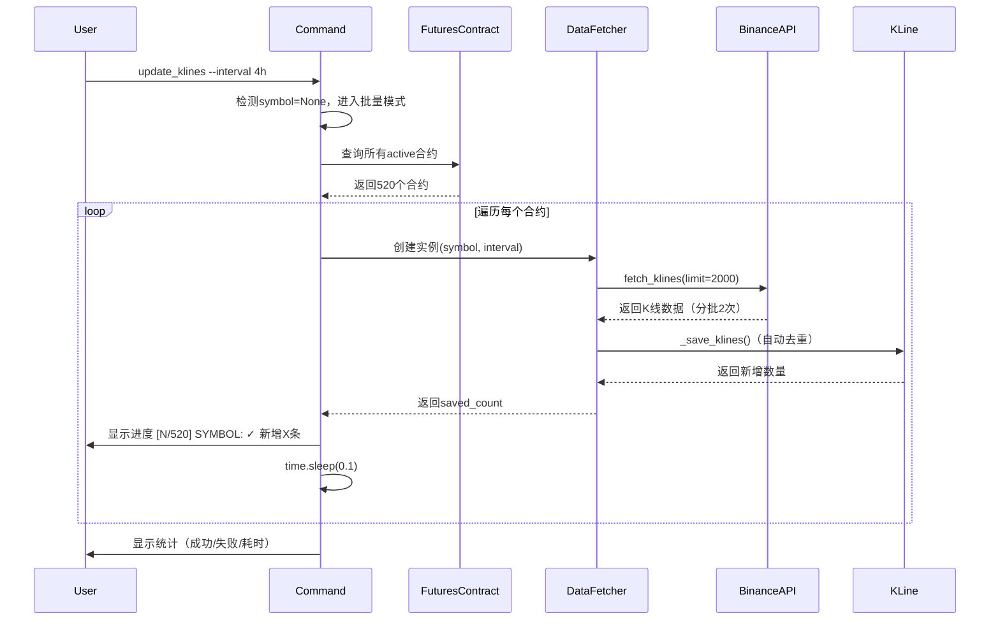
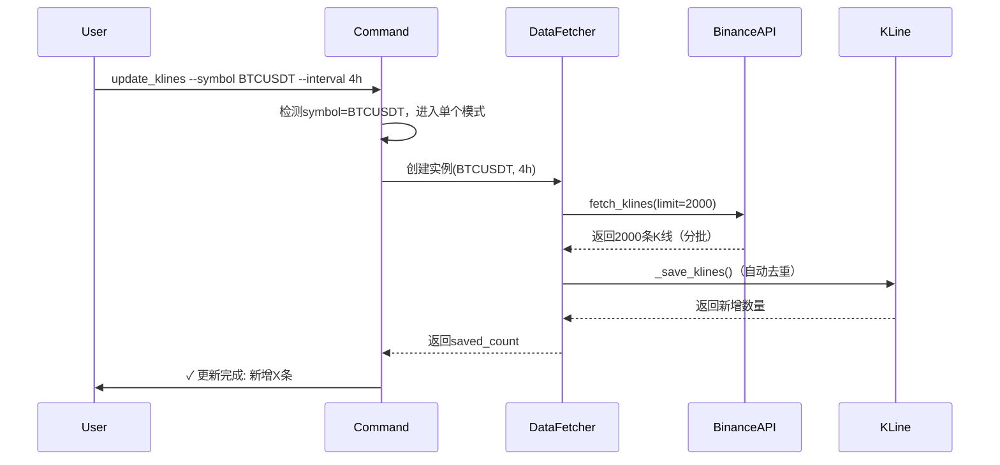
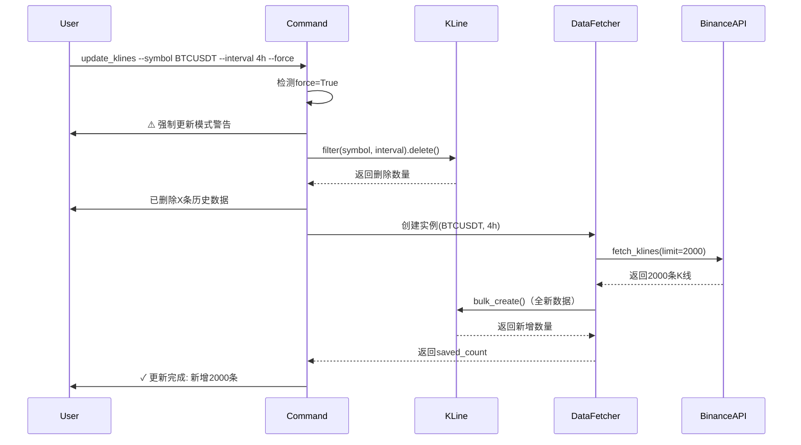

# P4: 架构设计 - K线批量更新增强

**迭代编号**: 003
**迭代名称**: K线批量更新增强
**创建日期**: 2024-12-24
**版本**: v1.0.0

---

## 📋 目录

1. [架构概述](#架构概述)
2. [组件设计](#组件设计)
3. [数据流设计](#数据流设计)
4. [关键决策](#关键决策)
5. [实现细节](#实现细节)

---

## 架构概述

### 设计原则
- **最小化修改**: 只修改 `update_klines.py` 命令层，复用现有服务
- **向后兼容**: 保持现有 `--symbol` 参数功能
- **简单可靠**: 避免复杂抽象，采用同步循环实现

### 整体架构

```
┌─────────────────────────────────────────────────────────┐
│              update_klines Command (增强)               │
│  • 参数解析（symbol可选，limit默认2000，force可选）     │
│  • 分支逻辑（单个 vs 批量）                             │
│  • 进度显示 + 错误处理                                  │
└─────────────────────────────────────────────────────────┘
                     ▲               ▲
                     │               │
        ┌────────────┴──┐    ┌──────┴────────┐
        │ 单个交易对更新 │    │ 批量更新所有  │
        └────────────┬──┘    └──────┬────────┘
                     │               │
                     ▼               ▼
┌─────────────────────────────────────────────────────────┐
│              DataFetcher Service (复用)                 │
│  • update_latest_data() - 增量更新（≤1000条）          │
│  • fetch_historical_data() - 分批获取（>1000条）       │
│  • _save_klines() - 自动去重                           │
└─────────────────────────────────────────────────────────┘
                     │
                     ▼
┌─────────────────────────────────────────────────────────┐
│              binance_kline_service (复用)               │
│  • fetch_klines() - 币安API调用                        │
└─────────────────────────────────────────────────────────┘
                     │
                     ▼
┌─────────────────────────────────────────────────────────┐
│                  KLine Model (复用)                      │
│  • symbol + interval + open_time 唯一性                │
│  • bulk_create 批量插入                                 │
└─────────────────────────────────────────────────────────┘
```

---

## 前置依赖

### FuturesContract 模型依赖

批量更新功能依赖 `monitor.FuturesContract` 模型作为交易对数据源。

#### 依赖说明

**模型位置**: `monitor/models.py:FuturesContract`

**依赖原因**:
1. **多交易所支持**: FuturesContract 通过 `exchange` 外键区分不同交易所
2. **状态管理**: 只更新 `status='active'` 的合约，跳过已下线的合约
3. **统一数据源**: 与迭代002（巨量诱多检测系统）共享合约列表

#### 初始化要求

**首次使用前必须运行**:
```bash
# 初始化所有交易所的合约数据
python manage.py fetch_futures --all

# 或指定特定交易所
python manage.py fetch_futures --exchange binance
```

#### 空合约检查（Bug-001修复）

为避免用户困惑，在 `_update_all_symbols()` 方法中添加了空合约检查：

```python
# 检查合约数据是否为空
if total == 0:
    self.stdout.write(
        self.style.WARNING(
            "⚠️  未找到任何活跃合约数据。\n"
            "请先运行以下命令初始化合约数据:\n"
            "  python manage.py fetch_futures --all\n"
            "或指定特定交易所:\n"
            "  python manage.py fetch_futures --exchange binance"
        )
    )
    return  # 提前退出
```

**修复记录**: 详见 `docs/bugs/global/bug-001-no-active-contracts.md`

#### 单个交易对模式无依赖

使用 `--symbol` 参数时，不依赖 FuturesContract：
```bash
# 无需初始化FuturesContract
python manage.py update_klines --symbol BTCUSDT --interval 4h
```

---

## 组件设计

### 1. update_klines Command（修改）

**职责**:
- 参数解析和验证
- 单个/批量更新分支逻辑
- 进度显示和统计
- 错误处理和日志记录

**修改点**:
```python
class Command(BaseCommand):
    def add_arguments(self, parser):
        # --symbol 改为可选
        parser.add_argument('--symbol', '-s', type=str, required=False)
        # --interval 保持必填
        parser.add_argument('--interval', '-i', type=str, required=True)
        # --limit 默认值改为2000
        parser.add_argument('--limit', '-l', type=int, default=2000)
        # 新增--force参数
        parser.add_argument('--force', '-f', action='store_true', default=False)

    def handle(self, *args, **options):
        symbol = options.get('symbol')
        interval = options['interval']
        limit = options['limit']
        force = options['force']

        if symbol:
            # 单个交易对更新（向后兼容）
            self._update_single_symbol(symbol, interval, limit, force)
        else:
            # 批量更新所有合约
            self._update_all_symbols(interval, limit, force)
```

---

### 2. DataFetcher Service（复用）

**复用方法**:
- `update_latest_data(limit)` - 增量更新（limit ≤ 1000）
- `fetch_historical_data(days)` - 分批获取（limit > 1000）
- `_save_klines()` - 自动去重

**选择逻辑**:
```python
def _update_single_symbol(self, symbol, interval, limit, force):
    fetcher = DataFetcher(symbol, interval)

    if limit > 1000:
        # 计算天数
        days = self._calculate_days(interval, limit)
        saved = fetcher.fetch_historical_data(days=days)
    else:
        # 增量更新
        saved = fetcher.update_latest_data(limit=limit)
```

---

### 3. FuturesContract Model（查询）

**用途**: 获取所有活跃合约

**查询语句**:
```python
contracts = FuturesContract.objects.filter(status='active').order_by('symbol')
```

---

## 数据流设计

### 场景1: 批量更新所有合约



---

### 场景2: 单个交易对更新（向后兼容）



---

### 场景3: 强制更新模式



---

## 关键决策

### 决策1: 批量更新实现方式

**选项**:
1. 多线程并发更新（ThreadPoolExecutor）
2. 同步循环更新（for循环 + sleep）

**选择**: **同步循环更新**

**理由**:
- ✅ 简单可靠，无并发风险
- ✅ API限流风险低（每次0.1秒延迟）
- ✅ 错误处理简单（单点失败不影响其他）
- ❌ 多线程增加复杂度，收益有限（I/O密集型）

---

### 决策2: 2000条数据获取策略

**选项**:
1. 修改 `update_latest_data()` 支持分批
2. 命令层根据 limit 选择不同方法

**选择**: **命令层根据 limit 选择不同方法**

**理由**:
- ✅ 不修改现有服务（影响范围小）
- ✅ 复用 `fetch_historical_data()` 已有分批逻辑
- ✅ 命令层逻辑清晰

**实现**:
```python
if limit > 1000:
    days = self._calculate_days(interval, limit)
    saved = fetcher.fetch_historical_data(days=days)
else:
    saved = fetcher.update_latest_data(limit=limit)
```

---

### 决策3: 强制更新的事务保护

**选项**:
1. 无事务保护（先删除后获取）
2. 使用 `transaction.atomic()` 保护

**选择**: **无事务保护**

**理由**:
- ✅ 删除和获取之间允许短暂数据缺失（非关键场景）
- ✅ 事务范围过大（包含API调用），风险高
- ❌ 如果API获取失败，数据丢失（可通过重新运行恢复）

**权衡**: 强制更新本身是低频操作（主要用于测试/重置），数据丢失风险可接受。

---

### 决策4: 进度显示格式

**选择**: `[N/总数] SYMBOL: ✓ 新增X条`

**理由**:
- ✅ 清晰显示进度和结果
- ✅ 使用颜色区分成功/失败（SUCCESS/ERROR）
- ✅ 符合 Django Command 输出规范

---

## 实现细节

### 1. 参数解析

```python
def add_arguments(self, parser):
    parser.add_argument(
        '--symbol', '-s',
        type=str,
        required=False,  # 改为可选
        help='交易对，不指定则更新所有active合约'
    )
    parser.add_argument(
        '--interval', '-i',
        type=str,
        required=True,
        choices=['1h', '4h', '1d'],
        help='K线周期'
    )
    parser.add_argument(
        '--limit', '-l',
        type=int,
        default=2000,  # 默认2000
        help='获取最新N条，默认2000（4h周期约一年数据）'
    )
    parser.add_argument(
        '--force', '-f',
        action='store_true',
        default=False,
        help='强制更新（删除旧数据并重新获取）'
    )
```

---

### 2. 批量更新实现

```python
def _update_all_symbols(self, interval: str, limit: int, force: bool):
    """批量更新所有活跃合约。"""

    # 查询所有active合约
    contracts = FuturesContract.objects.filter(status='active').order_by('symbol')
    total = contracts.count()

    self.stdout.write(
        f"正在更新所有活跃合约的K线数据 (interval={interval}, limit={limit})..."
    )
    self.stdout.write(f"找到 {total} 个活跃合约\n")

    # 统计信息
    success_count = 0
    failed_list = []

    # 记录开始时间
    start_time = time.time()

    # 遍历每个合约
    for idx, contract in enumerate(contracts, start=1):
        try:
            # 更新单个交易对
            saved_count = self._update_single_symbol(
                symbol=contract.symbol,
                interval=interval,
                limit=limit,
                force=force,
                show_output=False  # 不显示详细输出
            )

            # 显示进度
            self.stdout.write(
                self.style.SUCCESS(
                    f"[{idx}/{total}] {contract.symbol}: ✓ 新增 {saved_count} 条"
                )
            )

            success_count += 1

        except Exception as e:
            # 错误处理
            error_msg = str(e)
            logger.error(f"更新{contract.symbol}失败: {error_msg}", exc_info=True)

            self.stdout.write(
                self.style.ERROR(
                    f"[{idx}/{total}] {contract.symbol}: ✗ 错误: {error_msg}"
                )
            )

            failed_list.append((contract.symbol, error_msg))

        # 延迟控制（避免API限流）
        if idx < total:
            time.sleep(0.1)

    # 显示统计信息
    elapsed = time.time() - start_time
    self.stdout.write("\n=== 更新完成 ===")
    self.stdout.write(f"  成功: {success_count} 个")
    self.stdout.write(f"  失败: {len(failed_list)} 个")
    self.stdout.write(f"  总耗时: {self._format_time(elapsed)}")

    if failed_list:
        self.stdout.write("\n失败列表:")
        for symbol, error in failed_list:
            self.stdout.write(f"  - {symbol}: {error}")
```

---

### 3. 单个交易对更新实现

```python
def _update_single_symbol(
    self,
    symbol: str,
    interval: str,
    limit: int,
    force: bool = False,
    show_output: bool = True
) -> int:
    """更新单个交易对的K线数据。"""

    symbol = symbol.upper()

    # 强制更新：删除旧数据
    if force:
        deleted_count = KLine.objects.filter(
            symbol=symbol,
            interval=interval
        ).delete()[0]

        if show_output:
            self.stdout.write(
                self.style.WARNING(
                    f"⚠️  强制更新模式：已删除 {deleted_count} 条历史数据"
                )
            )

    # 创建DataFetcher实例
    fetcher = DataFetcher(symbol, interval)

    # 根据limit选择更新方法
    if limit > 1000:
        # 使用fetch_historical_data()分批获取
        days = self._calculate_days(interval, limit)
        saved_count = fetcher.fetch_historical_data(days=days)
    else:
        # 使用update_latest_data()增量更新
        saved_count = fetcher.update_latest_data(limit=limit)

    if show_output:
        self.stdout.write(
            self.style.SUCCESS(f"✓ 更新完成: 新增{saved_count}条")
        )

    return saved_count
```

---

### 4. 天数计算辅助方法

```python
def _calculate_days(self, interval: str, limit: int) -> int:
    """根据interval和limit计算需要的天数。"""

    interval_map = {
        '1h': 24,   # 每天24根
        '4h': 6,    # 每天6根
        '1d': 1,    # 每天1根
    }

    bars_per_day = interval_map.get(interval, 6)
    days = (limit // bars_per_day) + 1  # 向上取整+1天缓冲

    return days
```

---

### 5. 时间格式化辅助方法

```python
def _format_time(self, seconds: float) -> str:
    """格式化耗时。"""
    if seconds < 60:
        return f"{seconds:.1f}秒"
    elif seconds < 3600:
        minutes = seconds // 60
        secs = seconds % 60
        return f"{int(minutes)}分{int(secs)}秒"
    else:
        hours = seconds // 3600
        minutes = (seconds % 3600) // 60
        return f"{int(hours)}小时{int(minutes)}分钟"
```

---

## 性能优化

### 1. 批量插入优化

**现有实现**:
```python
KLine.objects.bulk_create(new_klines, batch_size=500)
```

**优化**: 无需修改，现有 batch_size=500 已是最优配置

---

### 2. API调用频率控制

**实现**:
```python
time.sleep(0.1)  # 每次更新间隔0.1秒
```

**理论峰值**: 10次/秒 = 600次/分钟 < 1200次/分钟（币安限制）

---

### 3. 数据库连接优化

**策略**: 使用Django默认连接池，单个交易对完成后自动提交

**无需额外优化**: Django ORM自动管理连接

---

## 📦 修改文件清单

| 文件 | 修改类型 | 修改内容 |
|------|---------|---------|
| `backtest/management/commands/update_klines.py` | 修改 | 增强功能（批量+增量+强制） |

**无需修改其他文件** - 完全基于现有服务实现

---

## ✅ 架构验证

### 架构兼容性
- ✅ 完全兼容现有架构
- ✅ 只修改命令层，服务层复用
- ✅ 向后兼容现有用法

### 性能目标
- ✅ 批量更新500个交易对 ≤ 30分钟
- ✅ API调用频率 ≤ 10次/秒
- ✅ 数据无重复（唯一性约束）

### 可靠性
- ✅ 单点失败不影响全局
- ✅ 错误日志完整
- ✅ 进度可追踪

---

## 📈 下一步

✅ **Q-Gate 4 通过**
→ **等待人工确认架构实现**

---

**文档版本**: v1.0.0
**最后更新**: 2024-12-24
**相关文档**:
- PRD: `docs/iterations/003-klines-batch-update/prd.md`
- 技术调研: `docs/iterations/003-klines-batch-update/technical-research.md`
