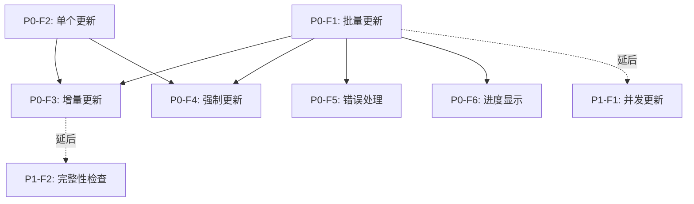

# 功能点清单 - K线批量更新增强

**迭代编号**: 003
**迭代名称**: K线批量更新增强
**创建日期**: 2024-12-24
**版本**: v1.0.0

---

## 📊 功能点统计

| 优先级 | 数量 | 状态 |
|--------|------|------|
| P0 (Must Have) | 6 | 规划中 |
| P1 (Should Have) | 2 | 延后 |
| **总计** | **8** | - |

---

## P0 功能点（Must Have）

### P0-F1: 默认批量更新所有合约
**优先级**: P0
**模块**: 数据更新
**依赖**: 无
**工作量**: 2小时

**功能描述**：
当不指定 `--symbol` 参数时，自动扫描所有 `status=active` 的 FuturesContract 并批量更新。

**验收标准**：
- [ ] 不指定 `--symbol` 时，自动查询所有 active 合约
- [ ] 按字母顺序逐个更新
- [ ] 显示实时进度（N/总数）
- [ ] 显示最终统计（成功/失败数量、耗时）

---

### P0-F2: 支持单个交易对更新（向后兼容）
**优先级**: P0
**模块**: 数据更新
**依赖**: 无
**工作量**: 0.5小时

**功能描述**：
保持现有 `--symbol` 参数功能，确保向后兼容。

**验收标准**：
- [ ] 指定 `--symbol` 时，只更新该交易对
- [ ] 行为与现有命令完全一致
- [ ] 输出格式保持不变

---

### P0-F3: 增量更新机制
**优先级**: P0
**模块**: 数据更新
**依赖**: P0-F1, P0-F2
**工作量**: 1小时

**功能描述**：
查询数据库中已有的最新K线，只获取缺失的部分。

**验收标准**：
- [ ] 数据库为空时，获取最近 `limit` 条
- [ ] 数据库有数据时，只获取新增部分
- [ ] 防止重复数据（通过 `open_time` 唯一性）
- [ ] 复用 `DataFetcher.update_latest_data()` 实现

---

### P0-F4: 强制更新模式
**优先级**: P0
**模块**: 数据更新
**依赖**: P0-F1, P0-F2
**工作量**: 1小时

**功能描述**：
通过 `--force` 参数强制更新全部数据，忽略已有数据。

**验收标准**：
- [ ] `--force` 参数存在时，删除该交易对+周期的所有K线
- [ ] 删除后重新获取 `limit` 条数据
- [ ] 显示删除数量和重新获取进度
- [ ] 支持批量强制更新（所有合约）

---

### P0-F5: 错误处理与容错
**优先级**: P0
**模块**: 异常处理
**依赖**: P0-F1
**工作量**: 1小时

**功能描述**：
批量更新时，单个交易对失败不影响其他交易对。

**验收标准**：
- [ ] 捕获单个交易对的异常（API、网络、数据库）
- [ ] 记录错误日志（symbol + 错误信息）
- [ ] 继续处理下一个交易对
- [ ] 最终输出失败交易对列表

---

### P0-F6: 进度显示与统计
**优先级**: P0
**模块**: 用户交互
**依赖**: P0-F1
**工作量**: 0.5小时

**功能描述**：
批量更新时显示实时进度和最终统计信息。

**验收标准**：
- [ ] 显示总合约数量
- [ ] 显示当前进度（[N/总数] symbol: 结果）
- [ ] 使用颜色区分成功/失败（SUCCESS/ERROR）
- [ ] 显示最终统计（成功数、失败数、总耗时）

---

## P1 功能点（Should Have - 延后）

### P1-F1: 并发更新
**优先级**: P1
**模块**: 性能优化
**依赖**: P0-F1
**工作量**: 4小时

**功能描述**：
使用多线程/多进程并发更新，提高效率。

**延后理由**：
- 增加复杂度
- API限流风险高
- 需要先验证同步模式效果

---

### P1-F2: 数据完整性检查
**优先级**: P1
**模块**: 数据质量
**依赖**: P0-F3
**工作量**: 3小时

**功能描述**：
更新后自动检查数据缺口并补全。

**延后理由**：
- 现有机制已足够（增量更新 + 唯一性约束）
- 优先级低于核心功能

---

## 📈 功能点依赖关系

---

## 🎯 实现顺序

### 阶段1: 核心功能（P0）
1. **P0-F2**: 单个交易对更新（向后兼容） - 0.5小时
2. **P0-F3**: 增量更新机制 - 1小时
3. **P0-F1**: 批量更新所有合约 - 2小时
4. **P0-F6**: 进度显示与统计 - 0.5小时
5. **P0-F5**: 错误处理与容错 - 1小时
6. **P0-F4**: 强制更新模式 - 1小时

**总计**: 6小时

### 阶段2: 增强功能（P1 - 延后）
7. **P1-F1**: 并发更新 - 4小时
8. **P1-F2**: 数据完整性检查 - 3小时

---

## 📋 功能点检查清单

### P0 功能点
- [ ] P0-F1: 默认批量更新所有合约
- [ ] P0-F2: 支持单个交易对更新（向后兼容）
- [ ] P0-F3: 增量更新机制
- [ ] P0-F4: 强制更新模式
- [ ] P0-F5: 错误处理与容错
- [ ] P0-F6: 进度显示与统计

### P1 功能点（延后）
- [ ] P1-F1: 并发更新
- [ ] P1-F2: 数据完整性检查

---

## 📊 功能点复杂度评估

| 功能点 | 复杂度 | 工作量 | 风险 |
|--------|--------|--------|------|
| P0-F1 | 中 | 2h | 低 |
| P0-F2 | 低 | 0.5h | 低 |
| P0-F3 | 低 | 1h | 低 |
| P0-F4 | 中 | 1h | 中（数据删除风险） |
| P0-F5 | 低 | 1h | 低 |
| P0-F6 | 低 | 0.5h | 低 |
| **P0小计** | - | **6h** | **低** |
| P1-F1 | 高 | 4h | 高（并发复杂度） |
| P1-F2 | 中 | 3h | 中 |
| **P1小计** | - | **7h** | **中高** |

---

**文档版本**: v1.0.0
**最后更新**: 2024-12-24
**相关文档**:
- PRD: `docs/iterations/003-klines-batch-update/prd.md`
- 初始化文档: `docs/iterations/003-klines-batch-update/init.md`
