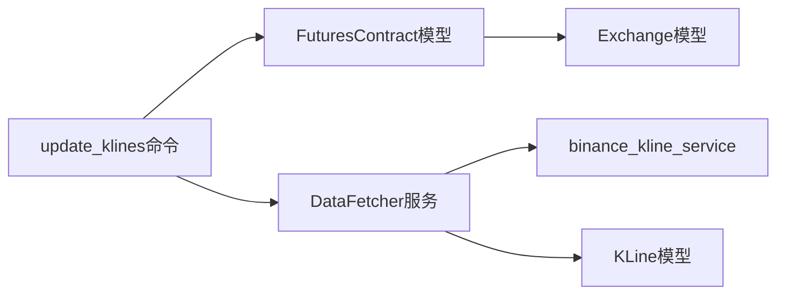

# P0: 快速初始化 - K线批量更新增强

**迭代编号**: 003
**迭代名称**: K线批量更新增强
**创建日期**: 2024-12-24
**迭代类型**: 快速流程（≤3天）

---

## 📋 需求背景

### 现状问题
当前 `update_klines` 命令存在以下限制：
1. **仅支持单个交易对**：`--symbol` 参数为必填项，无法批量更新
2. **无增量更新优化**：缺少缓存机制，无法根据已有数据判断更新范围
3. **无强制更新选项**：无法在需要时强制刷新全部数据

### 业务需求
需要增强 `update_klines` 命令，支持：
1. **默认扫描所有交易对**：从 FuturesContract 模型获取所有 active 状态的合约
2. **复用已有数据结构和服务**：基于现有 DataFetcher 服务实现
3. **支持增量更新**：根据数据库中已有K线数据，只更新缺失的部分
4. **支持强制更新**：通过 `--force` 参数忽略缓存，强制更新全部数据

---

## 🎯 核心价值（MVP）

**一句话描述**：增强 `update_klines` 命令，支持批量、增量和强制更新K线数据，减少手动操作，提高数据更新效率。

---

## 📊 可行性评估

### ✅ 技术可行性

| 评估维度 | 现状 | 可行性 | 说明 |
|----------|------|--------|------|
| 数据源 | FuturesContract 模型已存在 | ✅ 高 | 可直接查询 active 状态的合约 |
| 服务复用 | DataFetcher 已实现增量更新 | ✅ 高 | 可直接调用 update_latest_data() |
| 数据模型 | KLine 模型支持 symbol+interval+open_time 唯一性 | ✅ 高 | 已有机制防止重复数据 |
| 架构兼容 | 基于现有 Django Command 扩展 | ✅ 高 | 无架构变更 |

### ⚠️ 约束条件

1. **币安API限流**：
   - 每秒请求限制：1200 requests/min
   - 需要添加延迟控制（每次更新间隔 ≥ 0.1秒）

2. **数据库性能**：
   - 批量更新可能涉及500+交易对
   - 需要事务管理和批量插入优化

3. **执行时间**：
   - 预计全量更新500个交易对（每个2000条）需要：500 × (API分批请求时间 + 延迟) ≈ 20-30分钟
   - 可接受范围内

### 🚦 风险评估

| 风险 | 影响 | 缓解措施 |
|------|------|----------|
| API限流导致部分更新失败 | 中 | 添加异常捕获，单个交易对失败不影响其他 |
| 数据库连接超时 | 低 | 使用批量操作，单次更新完成后提交 |
| 内存占用过高 | 低 | 单个交易对单次更新，无大量数据缓存 |

---

## 📝 工作量评估

### 开发任务分解

| 任务 | 预计时间 | 复杂度 |
|------|----------|--------|
| P1: 需求定义+澄清 | 1小时 | 低 |
| P3: 技术调研 | 0.5小时 | 低 |
| P4: 架构设计 | 1小时 | 低 |
| P5: 任务规划 | 0.5小时 | 低 |
| 开发实现 | 2小时 | 中 |
| 测试验证 | 1小时 | 低 |

**总计**：~6小时（≤1天）

---

## ✅ 范围界定

### In-Scope（本次实现）
- ✅ 支持 `--all` 参数批量更新所有 active 合约
- ✅ 默认行为：如果不指定 `--symbol`，则更新所有合约
- ✅ 增量更新：查询数据库最新K线时间，只获取缺失部分
- ✅ `--force` 参数：强制更新全部数据（忽略已有数据）
- ✅ 错误处理：单个交易对失败不影响其他
- ✅ 进度显示：输出更新进度和统计信息

### Out-of-Scope（不在本次范围）
- ❌ 多线程/异步并发更新（保持简单）
- ❌ 数据校验和完整性检查（已有机制）
- ❌ 实时数据推送（非本需求）
- ❌ 历史数据回填（使用现有 fetch_historical_data）

---

## 🏗️ 架构兼容性

### 现有架构分析

```
backtest/
├── management/
│   └── commands/
│       └── update_klines.py        # ✅ 需要增强
├── services/
│   └── data_fetcher.py             # ✅ 可直接复用
├── models.py
│   └── KLine                       # ✅ 可直接使用
└── ...

monitor/
├── models.py
│   └── FuturesContract             # ✅ 提供交易对列表
```

### 依赖关系



### 架构决策

| 决策点 | 选项 | 选择 | 理由 |
|--------|------|------|------|
| 批量更新实现方式 | 1. 多线程 2. 同步循环 | **同步循环** | 简单可靠，避免并发问题 |
| 增量更新判断 | 1. 缓存文件 2. 数据库查询 | **数据库查询** | 数据一致性高，无额外存储 |
| 错误处理策略 | 1. 失败即停止 2. 继续执行 | **继续执行** | 提高容错性 |
| 延迟控制 | 1. 固定延迟 2. 动态调整 | **固定延迟** | 简单有效 |

---

## 📦 交付物

### 文档
- ✅ `docs/iterations/003-klines-batch-update/init.md`（本文档）
- ⏳ `docs/iterations/003-klines-batch-update/prd.md`（待生成）
- ⏳ `docs/iterations/003-klines-batch-update/function-points.md`（待生成）
- ⏳ `docs/iterations/003-klines-batch-update/clarifications.md`（待生成）
- ⏳ `docs/iterations/003-klines-batch-update/technical-research.md`（待生成）
- ⏳ `docs/iterations/003-klines-batch-update/architecture.md`（待生成）
- ⏳ `docs/iterations/003-klines-batch-update/tasks.md`（待生成）

### 代码
- ⏳ `backtest/management/commands/update_klines.py`（增强版）

---

## 🚪 Q-Gate 0 检查清单

- [x] 需求背景已理解
- [x] 核心价值已明确（批量+增量+强制更新）
- [x] 约束条件已明确（API限流、执行时间）
- [x] 可行性已评估（技术可行性高）
- [x] 工作量已评估（≤1天）
- [x] 范围已界定（In-Scope / Out-of-Scope）
- [x] 架构兼容性已初步评估（无架构变更）

---

## 📈 下一步

✅ **Q-Gate 0 通过**
→ 进入 **P1: 需求定稿制**（需求定义+澄清融合）

---

**文档版本**: v1.0.0
**最后更新**: 2024-12-24
**负责人**: PowerBy AI
**审核状态**: 待审核
