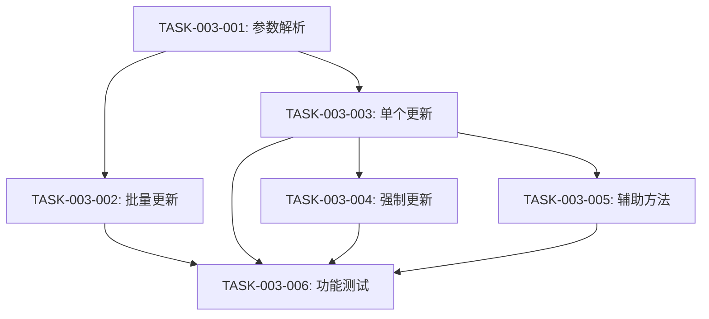

# P5: 任务规划 - K线批量更新增强

**迭代编号**: 003
**迭代名称**: K线批量更新增强
**创建日期**: 2024-12-24
**版本**: v1.0.0

---

## 📋 任务总览

| 任务编号 | 任务名称 | 优先级 | 工作量 | 状态 |
|----------|----------|--------|--------|------|
| TASK-003-001 | 修改参数解析逻辑 | P0 | 0.5h | 待开始 |
| TASK-003-002 | 实现批量更新逻辑 | P0 | 1.5h | 待开始 |
| TASK-003-003 | 实现单个交易对更新逻辑 | P0 | 1h | 待开始 |
| TASK-003-004 | 实现强制更新逻辑 | P0 | 0.5h | 待开始 |
| TASK-003-005 | 添加辅助方法 | P0 | 0.5h | 待开始 |
| TASK-003-006 | 功能测试 | P0 | 1h | 待开始 |
| **总计** | **6个任务** | - | **5h** | - |

---

## 任务详情

### TASK-003-001: 修改参数解析逻辑

**优先级**: P0
**工作量**: 0.5小时
**依赖**: 无

**任务描述**:
修改 `backtest/management/commands/update_klines.py` 中的 `add_arguments()` 方法，调整参数配置。

**实现步骤**:
1. 将 `--symbol` 参数的 `required` 改为 `False`
2. 将 `--limit` 参数的 `default` 改为 `2000`
3. 添加 `--force` 参数（`action='store_true'`）
4. 更新参数 `help` 文本

**验收标准**:
```bash
# 测试1: 不指定symbol（应成功）
python manage.py update_klines --interval 4h

# 测试2: 查看帮助文档
python manage.py update_klines --help
# 预期:
# - --symbol 显示为可选
# - --limit 默认值显示为2000
# - --force 参数存在
```

**代码变更**:
```python
def add_arguments(self, parser):
    parser.add_argument(
        '--symbol', '-s',
        type=str,
        required=False,  # 修改：改为可选
        help='交易对，不指定则更新所有active合约'
    )
    parser.add_argument(
        '--interval', '-i',
        type=str,
        required=True,
        choices=['1h', '4h', '1d'],
        help='K线周期'
    )
    parser.add_argument(
        '--limit', '-l',
        type=int,
        default=2000,  # 修改：默认值从100改为2000
        help='获取最新N条，默认2000（4h周期约一年数据）'
    )
    parser.add_argument(
        '--force', '-f',
        action='store_true',
        default=False,
        help='强制更新（删除旧数据并重新获取）'
    )
```

---

### TASK-003-002: 实现批量更新逻辑

**优先级**: P0
**工作量**: 1.5小时
**依赖**: TASK-003-001

**任务描述**:
在 `update_klines.py` 中添加 `_update_all_symbols()` 方法，实现批量更新所有活跃合约。

**实现步骤**:
1. 查询所有 `status='active'` 的 FuturesContract
2. 循环遍历每个合约
3. 调用 `_update_single_symbol()` 更新单个交易对
4. 显示实时进度（`[N/总数] SYMBOL: ✓ 新增X条`）
5. 错误捕获（单个失败不影响其他）
6. 添加0.1秒延迟（避免API限流）
7. 统计成功/失败数量和耗时

**验收标准**:
```bash
# 执行批量更新
python manage.py update_klines --interval 4h

# 预期输出:
# 正在更新所有活跃合约的K线数据 (interval=4h, limit=2000)...
# 找到 520 个活跃合约
#
# [1/520] AAVEUSDT: ✓ 新增 1850 条
# [2/520] ADAUSDT: ✓ 新增 1920 条
# ...
# [520/520] ZRXUSDT: ✓ 新增 1800 条
#
# === 更新完成 ===
#   成功: 518 个
#   失败: 2 个
#   总耗时: 25分23秒
```

**代码变更**:
```python
def _update_all_symbols(self, interval: str, limit: int, force: bool):
    """批量更新所有活跃合约。"""
    from monitor.models import FuturesContract
    import time

    # 查询所有active合约
    contracts = FuturesContract.objects.filter(status='active').order_by('symbol')
    total = contracts.count()

    self.stdout.write(
        f"正在更新所有活跃合约的K线数据 (interval={interval}, limit={limit})..."
    )
    self.stdout.write(f"找到 {total} 个活跃合约\n")

    # 统计信息
    success_count = 0
    failed_list = []
    start_time = time.time()

    # 遍历每个合约
    for idx, contract in enumerate(contracts, start=1):
        try:
            saved_count = self._update_single_symbol(
                symbol=contract.symbol,
                interval=interval,
                limit=limit,
                force=force,
                show_output=False
            )

            self.stdout.write(
                self.style.SUCCESS(
                    f"[{idx}/{total}] {contract.symbol}: ✓ 新增 {saved_count} 条"
                )
            )
            success_count += 1

        except Exception as e:
            error_msg = str(e)
            logger.error(f"更新{contract.symbol}失败: {error_msg}", exc_info=True)
            self.stdout.write(
                self.style.ERROR(
                    f"[{idx}/{total}] {contract.symbol}: ✗ 错误: {error_msg}"
                )
            )
            failed_list.append((contract.symbol, error_msg))

        # 延迟控制
        if idx < total:
            time.sleep(0.1)

    # 显示统计
    elapsed = time.time() - start_time
    self.stdout.write("\n=== 更新完成 ===")
    self.stdout.write(f"  成功: {success_count} 个")
    self.stdout.write(f"  失败: {len(failed_list)} 个")
    self.stdout.write(f"  总耗时: {self._format_time(elapsed)}")

    if failed_list:
        self.stdout.write("\n失败列表:")
        for symbol, error in failed_list:
            self.stdout.write(f"  - {symbol}: {error}")
```

---

### TASK-003-003: 实现单个交易对更新逻辑

**优先级**: P0
**工作量**: 1小时
**依赖**: TASK-003-001

**任务描述**:
重构现有 `handle()` 方法，添加 `_update_single_symbol()` 方法，实现单个交易对更新逻辑。

**实现步骤**:
1. 修改 `handle()` 方法，添加 symbol 判断分支
2. 实现 `_update_single_symbol()` 方法
3. 根据 `limit` 大小选择更新方法：
   - `limit > 1000`: 使用 `fetch_historical_data()`
   - `limit ≤ 1000`: 使用 `update_latest_data()`
4. 支持 `show_output` 参数（批量更新时不显示详细输出）

**验收标准**:
```bash
# 测试1: 单个交易对更新（向后兼容）
python manage.py update_klines --symbol BTCUSDT --interval 4h

# 预期输出:
# 更新数据: BTCUSDT 4h...
# ✓ 更新完成: 新增1850条

# 测试2: limit > 1000
python manage.py update_klines --symbol ETHUSDT --interval 4h --limit 2000

# 预期: 调用fetch_historical_data()，分批获取

# 测试3: limit ≤ 1000
python manage.py update_klines --symbol BNBUSDT --interval 4h --limit 500

# 预期: 调用update_latest_data()，增量更新
```

**代码变更**:
```python
def handle(self, *args, **options):
    symbol = options.get('symbol')
    interval = options['interval']
    limit = options['limit']
    force = options['force']

    if symbol:
        # 单个交易对更新（向后兼容）
        self._update_single_symbol(symbol, interval, limit, force, show_output=True)
    else:
        # 批量更新所有合约
        self._update_all_symbols(interval, limit, force)


def _update_single_symbol(
    self,
    symbol: str,
    interval: str,
    limit: int,
    force: bool = False,
    show_output: bool = True
) -> int:
    """更新单个交易对的K线数据。"""
    symbol = symbol.upper()

    if show_output:
        self.stdout.write(f"更新数据: {symbol} {interval}...")

    # 创建DataFetcher实例
    fetcher = DataFetcher(symbol, interval)

    # 根据limit选择更新方法
    if limit > 1000:
        days = self._calculate_days(interval, limit)
        saved_count = fetcher.fetch_historical_data(days=days)
    else:
        saved_count = fetcher.update_latest_data(limit=limit)

    if show_output:
        self.stdout.write(
            self.style.SUCCESS(f"✓ 更新完成: 新增{saved_count}条")
        )

    return saved_count
```

---

### TASK-003-004: 实现强制更新逻辑

**优先级**: P0
**工作量**: 0.5小时
**依赖**: TASK-003-003

**任务描述**:
在 `_update_single_symbol()` 方法中添加强制更新逻辑，删除旧数据并重新获取。

**实现步骤**:
1. 检测 `force` 参数
2. 如果为 True，删除该交易对+周期的所有K线数据
3. 显示警告信息和删除数量
4. 继续正常更新流程

**验收标准**:
```bash
# 测试强制更新
python manage.py update_klines --symbol BTCUSDT --interval 4h --force

# 预期输出:
# 更新数据: BTCUSDT 4h...
# ⚠️  强制更新模式：已删除 1950 条历史数据
# ✓ 更新完成: 新增2000条
```

**代码变更**:
```python
def _update_single_symbol(
    self,
    symbol: str,
    interval: str,
    limit: int,
    force: bool = False,
    show_output: bool = True
) -> int:
    """更新单个交易对的K线数据。"""
    from backtest.models import KLine

    symbol = symbol.upper()

    if show_output:
        self.stdout.write(f"更新数据: {symbol} {interval}...")

    # 强制更新：删除旧数据
    if force:
        deleted_count = KLine.objects.filter(
            symbol=symbol,
            interval=interval
        ).delete()[0]

        if show_output:
            self.stdout.write(
                self.style.WARNING(
                    f"⚠️  强制更新模式：已删除 {deleted_count} 条历史数据"
                )
            )

    # 创建DataFetcher实例
    fetcher = DataFetcher(symbol, interval)

    # 根据limit选择更新方法
    if limit > 1000:
        days = self._calculate_days(interval, limit)
        saved_count = fetcher.fetch_historical_data(days=days)
    else:
        saved_count = fetcher.update_latest_data(limit=limit)

    if show_output:
        self.stdout.write(
            self.style.SUCCESS(f"✓ 更新完成: 新增{saved_count}条")
        )

    return saved_count
```

---

### TASK-003-005: 添加辅助方法

**优先级**: P0
**工作量**: 0.5小时
**依赖**: TASK-003-003

**任务描述**:
添加两个辅助方法：`_calculate_days()` 和 `_format_time()`。

**实现步骤**:
1. 实现 `_calculate_days()` - 根据 interval 和 limit 计算天数
2. 实现 `_format_time()` - 格式化耗时显示

**验收标准**:
```python
# 测试_calculate_days()
assert _calculate_days('4h', 2000) == 334  # (2000 // 6) + 1
assert _calculate_days('1h', 2000) == 84   # (2000 // 24) + 1
assert _calculate_days('1d', 2000) == 2001 # (2000 // 1) + 1

# 测试_format_time()
assert _format_time(30) == "30.0秒"
assert _format_time(150) == "2分30秒"
assert _format_time(3720) == "1小时2分钟"
```

**代码变更**:
```python
def _calculate_days(self, interval: str, limit: int) -> int:
    """根据interval和limit计算需要的天数。"""
    interval_map = {
        '1h': 24,   # 每天24根
        '4h': 6,    # 每天6根
        '1d': 1,    # 每天1根
    }

    bars_per_day = interval_map.get(interval, 6)
    days = (limit // bars_per_day) + 1  # 向上取整+1天缓冲

    return days


def _format_time(self, seconds: float) -> str:
    """格式化耗时。"""
    if seconds < 60:
        return f"{seconds:.1f}秒"
    elif seconds < 3600:
        minutes = seconds // 60
        secs = seconds % 60
        return f"{int(minutes)}分{int(secs)}秒"
    else:
        hours = seconds // 3600
        minutes = (seconds % 3600) // 60
        return f"{int(hours)}小时{int(minutes)}分钟"
```

---

### TASK-003-006: 功能测试

**优先级**: P0
**工作量**: 1小时
**依赖**: TASK-003-001, TASK-003-002, TASK-003-003, TASK-003-004, TASK-003-005

**任务描述**:
完整测试所有功能场景，确保符合验收标准。

**测试场景**:

#### 场景0: 空合约检查（Bug-001修复）✅
```bash
# 前提：FuturesContract表为空
python manage.py update_klines --interval 4h
```
**验收**:
- [x] 显示友好的WARNING提示
- [x] 提示信息包含完整的解决方案命令
- [x] 提前退出，不执行无意义的批量更新
- [x] 提示运行 `fetch_futures --all` 初始化数据

**实际输出**:
```
⚠️  未找到任何活跃合约数据。
请先运行以下命令初始化合约数据:
  python manage.py fetch_futures --all
或指定特定交易所:
  python manage.py fetch_futures --exchange binance
```

**修复记录**: 详见 `docs/bugs/global/bug-001-no-active-contracts.md`

#### 场景1: 批量更新所有合约
```bash
python manage.py update_klines --interval 4h
```
**验收**:
- [ ] 显示总合约数量
- [ ] 显示每个合约的更新进度
- [ ] 显示最终统计（成功/失败/耗时）
- [ ] 单个合约失败不影响其他

#### 场景2: 单个交易对更新（向后兼容）
```bash
python manage.py update_klines --symbol BTCUSDT --interval 4h
```
**验收**:
- [ ] 行为与现有命令一致
- [ ] 显示更新结果

#### 场景3: 增量更新（无重复数据）
```bash
# 第一次运行
python manage.py update_klines --symbol ETHUSDT --interval 4h --limit 2000

# 第二次运行（立即执行）
python manage.py update_klines --symbol ETHUSDT --interval 4h --limit 2000
```
**验收**:
- [ ] 第一次新增2000条
- [ ] 第二次新增0条（无重复）

#### 场景4: 强制更新
```bash
python manage.py update_klines --symbol BTCUSDT --interval 4h --force
```
**验收**:
- [ ] 显示警告信息
- [ ] 显示删除数量
- [ ] 重新获取2000条

#### 场景5: limit > 1000（分批获取）
```bash
python manage.py update_klines --symbol BNBUSDT --interval 4h --limit 2000
```
**验收**:
- [ ] 自动调用 `fetch_historical_data()`
- [ ] 成功获取2000条数据

#### 场景6: 参数验证
```bash
# 测试不指定interval（应报错）
python manage.py update_klines

# 测试无效interval（应报错）
python manage.py update_klines --interval 5m
```
**验收**:
- [ ] 显示参数错误提示

#### 场景7: 批量强制更新
```bash
python manage.py update_klines --interval 4h --force
```
**验收**:
- [ ] 所有合约的旧数据被删除
- [ ] 重新获取所有合约的数据

---

## 📊 任务依赖关系



---

## 🎯 实施顺序

1. **TASK-003-001**: 修改参数解析逻辑（0.5h）
2. **TASK-003-005**: 添加辅助方法（0.5h）
3. **TASK-003-003**: 实现单个交易对更新逻辑（1h）
4. **TASK-003-004**: 实现强制更新逻辑（0.5h）
5. **TASK-003-002**: 实现批量更新逻辑（1.5h）
6. **TASK-003-006**: 功能测试（1h）

**总计**: 5小时

---

## 📝 完成检查清单

### 代码质量
- [ ] 所有代码已编写
- [ ] 无语法错误
- [ ] 符合项目代码规范
- [ ] 添加必要的日志记录

### 功能验收
- [ ] 所有6个测试场景通过
- [ ] 批量更新成功
- [ ] 单个更新成功（向后兼容）
- [ ] 增量更新无重复
- [ ] 强制更新正确删除旧数据
- [ ] 参数验证正确

### 性能验收
- [ ] 批量更新500个交易对 ≤ 30分钟
- [ ] API调用频率 ≤ 10次/秒
- [ ] 数据无重复（唯一性约束）

### 文档
- [ ] 代码注释完整
- [ ] docstring 符合Google Style
- [ ] 更新相关文档（如需要）

---

## ✅ Q-Gate 5 检查清单

- [x] 任务分解已完成（6个任务）
- [x] 任务粒度合适（每个0.5-1.5小时）
- [x] 依赖关系已明确
- [x] 验收标准已定义
- [x] 实施顺序已规划

---

## 📈 下一步

✅ **Q-Gate 5 通过**
→ 交付给开发实现

---

**文档版本**: v1.0.0
**最后更新**: 2024-12-24
**相关文档**:
- PRD: `docs/iterations/003-klines-batch-update/prd.md`
- 架构设计: `docs/iterations/003-klines-batch-update/architecture.md`
