# 现货交易对支持扩展 - 技术架构设计

**迭代编号**: 004
**分支**: 004-spot-trading-support
**文档版本**: v1.0.0
**创建日期**: 2025-12-25
**生命周期阶段**: P4 - 架构设计
**上一阶段文档**: `prd.md`, `technical-research.md`

---

## 1. 需求概述

### 1.1 核心业务目标

扩展现有"巨量诱多/弃盘检测系统"，使其能够同时处理**现货交易对**和**合约交易对**的K线数据，实现双市场覆盖。通过复用现有8个检测器和三阶段状态机，为用户提供完整的量价异常监控能力。

**抽象目标**: **针对所有有K线数据的交易对（无论现货还是合约）进行量价异常分析**

### 1.2 关键功能点

- **[P0-1] 现货K线数据获取能力**: 新增从Binance Spot API获取现货K线数据的能力
- **[P0-2] 现货数据存储扩展**: 扩展KLine模型，支持区分现货和合约数据
- **[P0-3] 现货交易对列表管理**: 新增SpotContract模型，管理现货交易对列表
- **[P0-4] 现货异常检测扩展**: 将8个检测器扩展到现货交易对
- **[P0-5] 结果区分显示**: API支持按市场类型（现货/合约）筛选结果

### 1.3 关键用户流程

#### 用户流程1: 现货交易对数据同步
1. 管理员执行 `python manage.py fetch_spot_contracts --exchange binance`
2. 系统调用BinanceSpotClient获取现货交易对列表
3. 系统保存/更新现货交易对到SpotContract表
4. 返回同步统计信息（新增、更新、下线数量）

#### 用户流程2: 现货K线数据更新
1. 管理员执行 `python manage.py update_klines --interval 4h --market-type spot`
2. 系统查询所有活跃的现货交易对（SpotContract.status='active'）
3. 系统调用DataFetcher批量获取K线数据
4. 系统保存K线数据（market_type='spot'）
5. 返回更新进度和统计信息

#### 用户流程3: 现货异常检测扫描
1. 管理员执行 `python manage.py scan_volume_traps --interval 4h --market-type spot`
2. 系统初始化状态机，加载现货监控记录
3. 系统对每个现货交易对调用8个检测器
4. 系统通过ConditionEvaluator评估检测结果
5. 系统根据评估结果更新监控记录状态
6. 返回三阶段扫描结果（发现、确认、验证数量）

#### 用户流程4: 查询现货监控结果
1. 用户执行 `GET /api/volume-trap/monitors/?market_type=spot&status=pending`
2. API根据market_type='spot'筛选现货监控记录
3. API返回现货监控池列表
4. 用户可以分别查看现货和合约的监控结果

---

## 2. 核心技术选型

### 2.1 前端技术栈
- Django Templates + Bootstrap（保持一致）
- JavaScript（最小化改动）

### 2.2 后端技术栈
- Django 4.2.8（保持一致）
- Django REST Framework（保持一致）
- Python 3.12（保持一致）
- requests（HTTP客户端）

### 2.3 数据存储方案
- SQLite（开发环境）/ PostgreSQL（生产环境）（保持一致）
- ORM使用Django Model

---

## 3. 核心架构设计

### 3.1 系统架构图

```mermaid
graph TB
    %% 外部系统和用户
    User[("用户/量化策略<br/>查询预警信号")]
    Cron["外部Cron<br/>定时任务调度器"]
    BinanceFutures["Binance Futures API<br/>K线数据源"]
    BinanceSpot["Binance Spot API<br/>K线数据源"]

    %% API服务层
    subgraph API["API服务层"]
        MonitorListAPI["MonitorListAPI<br/>(Django REST)<br/>监控池列表查询<br/>新增market_type筛选"]
        MonitorDetailAPI["MonitorDetailAPI<br/>(Django REST)<br/>监控详情查询"]
        StatsAPI["StatisticsAPI<br/>(Django REST)<br/>统计数据查询"]
    end

    %% 管理命令层
    subgraph Commands["管理命令层"]
        subgraph NewCommands["新增命令"]
            FetchSpot["fetch_spot_contracts<br/>(Management Command)<br/>现货交易对同步"]
        end

        subgraph ExtendedCommands["扩展命令"]
            UpdateKlines["update_klines<br/>(Management Command)<br/>K线数据更新<br/>新增--market-type参数"]
            ScanTraps["scan_volume_traps<br/>(Management Command)<br/>监控扫描<br/>新增--market-type参数"]
            CheckInvalid["check_invalidations<br/>(Management Command)<br/>失效检测<br/>新增--market-type参数"]
        end
    end

    %% 状态机管理层
    subgraph StateMachine["状态机管理层"]
        FSM["VolumeTrapStateMachine<br/>(业务逻辑)<br/>三阶段状态流转<br/>适配支持SpotContract"]
        InvalidDetector["InvalidationDetector<br/>(业务逻辑)<br/>失效检测器<br/>适配支持SpotContract"]
    end

    %% 检测器层（100%复用）
    subgraph Detectors["检测器层 (Detectors) - 100%复用"]
        subgraph VolumeDetectors["成交量检测器"]
            RVOL["RVOLCalculator<br/>相对成交量计算"]
            VolumeRetention["VolumeRetentionAnalyzer<br/>成交量留存分析"]
        end

        subgraph PriceDetectors["价格检测器"]
            Amplitude["AmplitudeDetector<br/>振幅异常检测"]
            KeyLevel["KeyLevelBreachDetector<br/>关键位跌破检测"]
            PriceEff["PriceEfficiencyAnalyzer<br/>价差效率分析"]
        end

        subgraph TrendDetectors["趋势检测器"]
            MA["MovingAverageCrossDetector<br/>均线交叉检测"]
            OBV["OBVDivergenceAnalyzer<br/>OBV背离分析"]
            ATR["ATRCompressionDetector<br/>ATR压缩检测"]
        end
    end

    %% 条件评估器
    Evaluator["ConditionEvaluator<br/>(条件评估器)<br/>组合检测结果"]

    %% 数据采集层
    subgraph DataLayer["数据采集层"]
        subgraph NewClients["新增客户端"]
            BinanceSpotClient["BinanceSpotClient<br/>(数据服务)<br/>现货K线数据获取"]
        end

        subgraph ExistingClients["现有客户端"]
            FuturesProvider["FuturesContractProvider<br/>(数据服务)<br/>交易对列表提供"]
        end

        KLineSync["KLineDataSyncService<br/>(数据服务)<br/>K线数据同步"]
    end

    %% 持久化层 - 扩展
    subgraph Persistence["持久化层 (PostgreSQL)"]
        subgraph NewModels["新增模型"]
            SpotContractDB[("SpotContract<br/>现货交易对列表<br/>新增表")]
        end

        subgraph ExtendedModels["扩展模型"]
            KLineDB[("KLine<br/>K线数据<br/>新增market_type字段")]
            MonitorDB[("VolumeTrapMonitor<br/>监控池记录<br/>新增spot_contract外键")]
        end

        subgraph ExistingModels["现有模型"]
            IndicatorsDB[("VolumeTrapIndicators<br/>指标快照")]
            TransitionDB[("VolumeTrapStateTransition<br/>状态转换日志")]
            ContractDB[("FuturesContract<br/>交易对列表(复用)")]
        end
    end

    %% 用户交互流
    User -->|"HTTPS/JSON"| MonitorListAPI
    User -->|"HTTPS/JSON"| MonitorDetailAPI
    User -->|"HTTPS/JSON"| StatsAPI

    %% API层到数据库
    MonitorListAPI -->|"Django ORM<br/>market_type筛选"| MonitorDB
    MonitorDetailAPI -->|"Django ORM"| IndicatorsDB
    StatsAPI -->|"Django ORM"| MonitorDB

    %% Cron触发命令
    Cron -->|"CLI"| FetchSpot
    Cron -->|"CLI"| UpdateKlines
    Cron -->|"CLI"| ScanTraps
    Cron -->|"CLI"| CheckInvalid

    %% 命令层调用服务层
    FetchSpot -->|"函数调用"| BinanceSpotClient
    UpdateKlines -->|"函数调用"| KLineSync
    ScanTraps -->|"函数调用"| FSM
    CheckInvalid -->|"函数调用"| InvalidDetector

    %% 数据采集层
    BinanceSpotClient -->|"HTTPS"| BinanceSpot
    KLineSync -->|"Django ORM"| KLineDB
    FuturesProvider -->|"Django ORM"| ContractDB

    %% 状态机调用检测器和评估器
    FSM -->|"请求检测"| RVOL
    FSM -->|"请求检测"| Amplitude
    FSM -->|"请求检测"| VolumeRetention
    FSM -->|"请求检测"| KeyLevel
    FSM -->|"请求检测"| PriceEff
    FSM -->|"请求检测"| MA
    FSM -->|"请求检测"| OBV
    FSM -->|"请求检测"| ATR

    %% 检测器读取K线
    RVOL -->|"Django ORM<br/>支持market_type"| KLineDB
    Amplitude -->|"Django ORM<br/>支持market_type"| KLineDB
    VolumeRetention -->|"Django ORM<br/>支持market_type"| KLineDB
    KeyLevel -->|"Django ORM<br/>支持market_type"| KLineDB
    PriceEff -->|"Django ORM<br/>支持market_type"| KLineDB
    MA -->|"Django ORM<br/>支持market_type"| KLineDB
    OBV -->|"Django ORM<br/>支持market_type"| KLineDB
    ATR -->|"Django ORM<br/>支持market_type"| KLineDB

    %% 检测器结果汇总到评估器
    RVOL --> Evaluator
    Amplitude --> Evaluator
    VolumeRetention --> Evaluator
    KeyLevel --> Evaluator
    PriceEff --> Evaluator
    MA --> Evaluator
    OBV --> Evaluator
    ATR --> Evaluator

    %% 评估器返回状态转换决策
    Evaluator -->|"状态转换决策"| FSM

    %% 状态机写入数据库
    FSM -->|"状态更新|现货监控记录"| MonitorDB
    FSM -->|"记录指标"| IndicatorsDB
    FSM -->|"记录转换"| TransitionDB

    %% 失效检测器
    InvalidDetector -->|"读取+更新|现货监控记录"| MonitorDB
    InvalidDetector -->|"读取K线|market_type=spot"| KLineDB

    %% 样式定义
    classDef external fill:#f9f,stroke:#333,stroke-width:2px
    classDef database fill:#bbf,stroke:#333,stroke-width:2px
    classDef api fill:#9f9,stroke:#333,stroke-width:2px
    classDef command fill:#ff9,stroke:#333,stroke-width:2px
    classDef detector fill:#f99,stroke:#333,stroke-width:2px
    classDef evaluator fill:#fcf,stroke:#333,stroke-width:2px
    classDef new fill:#cfc,stroke:#333,stroke-width:2px
    classDef extended fill:#ffc,stroke:#333,stroke-width:2px

    class User,Cron,BinanceFutures,BinanceSpot external
    class SpotContractDB,KLineDB,MonitorDB,IndicatorsDB,TransitionDB,ContractDB database
    class MonitorListAPI,MonitorDetailAPI,StatsAPI api
    class FetchSpot,UpdateKlines,ScanTraps,CheckInvalid command
    class RVOL,Amplitude,VolumeRetention,KeyLevel,PriceEff,MA,OBV,ATR detector
    class Evaluator,FSM,InvalidDetector evaluator
    class BinanceSpotClient,FuturesProvider,KLineSync new
    class SpotContractDB,KLineDB,MonitorDB extended
```

### 3.2 架构说明

#### 3.2.1 概念解读

本架构在现有"巨量诱多/弃盘检测系统"基础上进行增量演进，通过以下方式扩展现货支持：

1. **数据层扩展**: 在现有KLine模型中新增market_type字段，支持区分现货和合约数据
2. **模型层扩展**: 创建SpotContract模型，镜像管理现货交易对
3. **API客户端扩展**: 创建BinanceSpotClient，支持Binance Spot API
4. **命令层扩展**: 为现有命令新增--market-type参数，实现现货和合约的统一管理
5. **状态机适配**: 适配VolumeTrapStateMachine支持SpotContract，实现现货监控

#### 3.2.2 组件职责

**新增组件**:

- **SpotContract模型**: 管理现货交易对列表，职责包括symbol、exchange、status、current_price等
- **BinanceSpotClient**: 封装Binance Spot API调用，职责包括fetch_spot_contracts、fetch_klines等
- **fetch_spot_contracts命令**: 现货交易对同步命令，职责包括同步现货交易对到数据库

**扩展组件**:

- **KLine模型**: 扩展新增market_type字段，职责包括区分现货和合约数据
- **VolumeTrapMonitor模型**: 扩展新增spot_contract外键和market_type字段，职责包括支持现货监控
- **update_klines命令**: 扩展新增--market-type参数，职责包括支持现货K线更新
- **scan_volume_traps命令**: 扩展新增--market-type参数，职责包括支持现货异常检测
- **MonitorListAPI**: 扩展新增market_type筛选参数，职责包括支持现货/合约筛选

**复用组件**（无需修改）:

- 8个检测器（RVOLCalculator、AmplitudeDetector等）- 100%复用
- DataFetcher服务 - 100%复用
- ConditionEvaluator服务 - 100%复用
- VolumeTrapIndicators模型 - 100%复用
- VolumeTrapStateTransition模型 - 100%复用

#### 3.2.3 交互说明

**现货K线更新流程**:
1. update_klines --market-type spot命令解析参数
2. 查询SpotContract表获取所有active现货交易对
3. 调用DataFetcher批量获取现货K线数据
4. 保存K线数据（market_type='spot'）
5. 返回更新进度和统计信息

**现货异常检测流程**:
1. scan_volume_traps --market-type spot命令解析参数
2. 查询VolumeTrapMonitor表获取所有market_type='spot'的监控记录
3. 对每个现货交易对调用8个检测器（完全复用现有逻辑）
4. ConditionEvaluator组合检测结果进行状态决策
5. 更新监控记录状态和指标快照
6. 返回三阶段扫描结果

### 3.3 底层原子服务定义 (Critical Foundation)

⚠️ **注意**: 此部分定义的组件是系统的基石，任何变更必须经过严格的回归测试。

#### [Core-Atomic] RVOLCalculator - 核心原子服务
**服务层级**: Atomic

**职责**:
计算相对成交量倍数（当前成交量 / MA成交量），用于检测异常放量

**接口契约**:
- **Input**:
  - symbol (String, 交易对代码)
  - interval (String, K线周期：1h/4h/1d)
  - market_type (String, 市场类型：spot/futures)

- **Output**:
  - status (Enum: SUCCESS/FAIL)
  - rvol_ratio (Decimal: RVOL倍数)
  - current_volume (Decimal: 当前成交量)
  - ma_volume (Decimal: MA(20)成交量)

- **异常**:
  - ERR_DATA_INSUFFICIENT: 历史数据不足时触发
  - ERR_INVALID_INTERVAL: 不支持的K线周期时触发

**核心保障策略**:
数据充足性检查（至少需要20根历史K线），异常处理和日志记录

**测试重点**:
必须通过数据充足性测试，确保在数据不足时抛出明确异常

**映射需求**:
对应PRD [P0-4] 现货异常检测扩展

**业务支撑**:
- 支撑流程1: 现货异常检测（Discovery阶段）
- 支撑流程2: 合约异常检测（Discovery阶段）
- 支撑流程3: 三阶段状态机决策

#### [Core-Atomic] DataFetcher - 核心原子服务
**服务层级**: Atomic

**职责**:
批量获取和存储K线数据，支持增量更新和历史数据获取

**接口契约**:
- **Input**:
  - symbol (String, 交易对代码)
  - interval (String, K线周期)
  - limit (Integer, 获取数量)
  - market_type (String, 市场类型：spot/futures)

- **Output**:
  - status (Enum: SUCCESS/FAIL)
  - saved_count (Integer: 保存的K线数量)
  - is_new_data (Boolean: 是否为新数据)

- **异常**:
  - ERR_API_REQUEST_FAILED: API请求失败时触发
  - ERR_DB_OPERATION_FAILED: 数据库操作失败时触发

**核心保障策略**:
自动去重机制（基于symbol+interval+market_type+open_time唯一性），批量插入优化

**测试重点**:
必须通过去重测试，确保相同K线不会重复保存

**映射需求**:
对应PRD [P0-1] 现货K线数据获取能力

**业务支撑**:
- 支撑流程1: 现货K线数据更新
- 支撑流程2: 合约K线数据更新
- 支撑流程3: 历史数据回填

#### [Core-Atomic] VolumeTrapStateMachine - 核心原子服务
**服务层级**: Atomic

**职责**:
管理巨量诱多/弃盘检测的三阶段状态机流转

**接口契约**:
- **Input**:
  - monitor (VolumeTrapMonitor实例)
  - market_type (String: spot/futures)

- **Output**:
  - status (Enum: SUCCESS/FAIL)
  - new_status (String: 新状态)
  - transition_log (JSON: 转换日志)

- **异常**:
  - ERR_INVALID_TRANSITION: 无效状态转换时触发
  - ERR_DETECTOR_EVALUATION_FAILED: 检测器评估失败时触发

**核心保障策略**:
状态转换的原子性保证，异常时的回滚机制

**测试重点**:
必须通过状态转换原子性测试，确保异常时数据一致性

**映射需求**:
对应PRD [P0-4] 现货异常检测扩展

**业务支撑**:
- 支撑流程1: 现货异常检测状态管理
- 支撑流程2: 合约异常检测状态管理
- 支撑流程3: 三阶段状态机决策

### 3.4 组件与需求映射

| 功能点编号 | 架构组件 | 职责 | 实现方式 |
|-----------|---------|------|---------|
| **P0-1** | BinanceSpotClient | 获取现货K线数据 | 新建API客户端 |
| **P0-1** | SpotContract模型 | 管理现货交易对列表 | 新建模型 |
| **P0-1** | fetch_spot_contracts命令 | 现货交易对同步 | 新建管理命令 |
| **P0-2** | KLine模型扩展 | 区分现货和合约数据 | Schema扩展（新增market_type字段） |
| **P0-3** | SpotContract模型 | 现货交易对管理 | 新建模型（镜像FuturesContract） |
| **P0-4** | 8个检测器 | 现货异常检测 | 100%复用现有逻辑 |
| **P0-4** | VolumeTrapStateMachine适配 | 现货监控状态管理 | 接口适配（支持SpotContract） |
| **P0-5** | MonitorListAPI扩展 | 现货/合约结果筛选 | 功能扩展（新增market_type参数） |

### 3.5 复用服务契约定义

#### [复用服务] FuturesFetcherService - 模式复用
**服务层级**: Orchestration
**复用方式**: 模式复用

**现有服务信息**:
- **原始职责**: 批量获取和同步合约数据到数据库
- **当前状态**: 维护良好，已支持多交易所
- **技术栈**: Django ORM + 多API客户端
- **文档位置**: `monitor/services/futures_fetcher.py`

**复用适配**:
- **保留功能**: 多交易所支持、状态管理、错误处理
- **扩展功能**: 新增SpotFetcherService，支持现货交易对
- **修改接口**: 创建独立的SpotFetcherService类
- **新增接口**: fetch_spot_contracts命令

**接口契约**:
- **Input**:
  - exchange_code (String: 交易所代码) - 复用
  - spot_symbols (List[String]: 现货交易对列表) - 新增

- **Output**:
  - status (String: 成功/失败) - 复用
  - new_count (Integer: 新增数量) - 复用
  - updated_count (Integer: 更新数量) - 复用
  - saved_count (Integer: 保存总数) - 复用

**适配成本**: 低
**风险等级**: 低

**质量保障**:
- **回归测试**: 确保现有合约同步功能不受影响
- **新增测试**: 验证现货交易对同步功能正确性
- **性能验证**: 确保批量同步性能满足要求

**支撑需求**:
对应PRD [P0-3] 现货交易对列表管理 - 模式复用

### 3.6 架构继承与演进分析

#### 架构继承清单
- **必须继承**: Django三层架构模式、Django REST Framework模式、Django ORM模式
- **建议继承**: BaseFuturesClient基类、DataFetcher服务模式、唯一性约束模式
- **可替换**: 无（完全基于现有架构演进）

#### 复用能力评估
| 组件 | 复用方式 | 适配成本 | 风险等级 | 决策 |
|-----|---------|---------|---------|------|
| KLine模型 | Schema扩展 | 低 | 中 | ✅ 复用并扩展 |
| 8个检测器 | 直接复用 | 零 | 低 | ✅ 100%复用 |
| VolumeTrapStateMachine | 接口适配 | 低 | 中 | ✅ 接口适配 |
| MonitorListAPI | 功能扩展 | 低 | 低 | ✅ 功能扩展 |

#### 架构一致性检查
- **设计原则一致性**: ✅ 遵循SOLID、DRY、奥卡姆剃刀原则
- **技术栈一致性**: ✅ 无新增技术栈
- **编码规范一致性**: ✅ 遵循Django命名约定
- **架构模式一致性**: ✅ 保持三层架构

---

## 4. 变更点说明

### 4.1 变更概述

基于PRD中的功能需求分析，当前架构需要进行以下主要变更：
- 扩展KLine模型支持市场类型区分
- 新增SpotContract模型管理现货交易对
- 创建BinanceSpotClient支持现货API
- 扩展管理命令支持现货参数
- 适配状态机支持现货监控

### 4.2 架构变更对比

#### 当前架构 (现状)
- 仅支持USDT永续合约
- KLine模型无市场类型区分
- VolumeTrapMonitor仅关联FuturesContract
- 管理命令仅处理合约数据
- API无市场类型筛选

#### 目标架构 (变更后)
- 同时支持现货和合约交易对
- KLine模型通过market_type字段区分现货/合约
- VolumeTrapMonitor支持SpotContract外键
- 管理命令支持--market-type参数
- API支持market_type筛选参数

### 4.3 具体变更点清单

| 变更类型 | 组件/模块 | 变更描述 | 影响范围 | 风险等级 |
|---------|---------|---------|---------|---------|
| **NEW** | SpotContract模型 | 新增现货交易对管理模型 | 数据层 | 低 |
| **MODIFIED** | KLine模型 | 新增market_type字段 | 数据层 | 中 |
| **MODIFIED** | VolumeTrapMonitor模型 | 新增spot_contract外键和market_type字段 | 数据层 | 中 |
| **NEW** | BinanceSpotClient | 新增现货API客户端 | 服务层 | 低 |
| **NEW** | fetch_spot_contracts命令 | 新增现货交易对同步命令 | 命令层 | 低 |
| **MODIFIED** | update_klines命令 | 新增--market-type参数 | 命令层 | 中 |
| **MODIFIED** | scan_volume_traps命令 | 新增--market-type参数 | 命令层 | 中 |
| **MODIFIED** | MonitorListAPI | 新增market_type筛选参数 | API层 | 低 |
| **MODIFIED** | VolumeTrapStateMachine | 适配支持SpotContract | 服务层 | 中 |
| **MODIFIED** | InvalidationDetector | 适配支持SpotContract | 服务层 | 中 |

### 4.4 技术影响分析

#### 新增技术栈
- **无新增技术栈**: 完全复用现有Django/DRF/requests技术栈

#### 性能影响
- **改进点**: API支持市场类型筛选，提升查询效率
- **风险点**: KLine数据量翻倍（现货+合约），需要优化数据库索引
- **缓解措施**: 为market_type字段建立索引，优化查询性能

#### 依赖变更
- **新增依赖**: 无
- **升级依赖**: 无
- **数据库变更**: 需要执行数据库迁移脚本

#### 数据影响
- **现有数据**: 自动标记为market_type='futures'，无数据丢失
- **新数据**: 支持区分现货和合约数据
- **迁移风险**: 数据迁移脚本需要充分测试

### 4.5 风险等级评估

- **Core-Atomic服务变更** ⚠️: 支撑>3个业务流的高风险变更
  - RVOLCalculator：支撑现货异常检测、合约异常检测、三阶段状态机决策
  - DataFetcher：支撑现货K线更新、合约K线更新、历史数据回填
  - VolumeTrapStateMachine：支撑现货异常检测状态管理、合约异常检测状态管理、三阶段状态机决策

- **普通原子服务变更** ⚡: 支撑1-3个业务流的中风险变更
  - BinanceSpotClient：支撑现货交易对同步、现货K线获取
  - VolumeTrapMonitor：支撑现货监控记录管理、合约监控记录管理

- **编排服务变更** ✅: 组合型服务，风险相对较低
  - fetch_spot_contracts：独立的现货交易对同步流程

### 4.6 核心保障策略

**Core-Atomic服务保障**:
- 所有Core-Atomic服务必须通过并发写入压力测试
- 数据库死锁情况下的原子性回滚验证
- 异常场景下的数据一致性保障

**数据迁移保障**:
- 完整的数据库备份机制
- 可回滚的迁移脚本
- 充分的测试环境验证

**性能保障**:
- 批量操作优化（bulk_create）
- 数据库索引优化
- 查询性能监控

---

## 5. 关键技术决策

### 决策点1: KLine数据模型扩展
- **选定方案**: 新增market_type字段
- **决策日期**: 2025-12-25
- **决策理由**: 简单、高效、向后兼容
- **风险与缓解措施**: 迁移脚本需充分测试，建议先在测试环境验证
- **后续影响**: 后续迭代可基于此设计扩展其他市场类型

### 决策点2: 交易对列表管理
- **选定方案**: 创建SpotContract模型
- **决策日期**: 2025-12-25
- **决策理由**: 职责清晰，模式一致，便于维护
- **风险与缓解措施**: 无重大风险，参考FuturesContract即可
- **后续影响**: 未来如需扩展其他交易所，现货和合约模型保持一致

### 决策点3: 监控池多态关联
- **选定方案**: market_type + 条件外键
- **决策日期**: 2025-12-25
- **决策理由**: 实现最简单，性能最优，满足MVP需求
- **风险与缓解措施**: 应用层需保证futures_contract和spot_contract互斥
- **后续影响**: 未来如需支持更多市场类型，可重构为GenericForeignKey

### 决策点4: Binance Spot API集成
- **选定方案**: 创建BinanceSpotClient
- **决策日期**: 2025-12-25
- **决策理由**: 单一职责，代码清晰
- **风险与缓解措施**: 复用BaseFuturesClient基类，降低重复代码
- **后续影响**: 未来如需支持其他现货交易所，可基于相同模式扩展

---

## 6. 技术栈清单

### 核心技术（保持一致）
- Django 4.2.8
- Django REST Framework
- SQLite/PostgreSQL
- Python 3.12
- requests + tenacity

### 新增依赖（无）

### API端点
- Binance Spot API: `https://api.binance.com`
  - `/api/v3/exchangeInfo` - 现货交易对列表
  - `/api/v3/klines` - 现货K线数据
  - `/api/v3/ticker/price` - 现货价格

---

## 7. 扩展性考虑

### 为未来预留的扩展点

#### 扩展点1: 多交易所现货支持
- **架构设计**: SpotContract模型通过exchange外键支持多交易所
- **扩展路径**: 创建OKXSpotClient、BybitSpotClient等
- **成本评估**: 低（复用现有模式）

#### 扩展点2: 其他计价单位现货
- **架构设计**: KLine模型已通过market_type字段预留扩展
- **扩展路径**: 添加market_type='btc_spot'、'eth_spot'等
- **成本评估**: 低（无需Schema变更）

#### 扩展点3: 现货与合约对比分析
- **架构设计**: 通过统一的symbol命名规范（BTCUSDT合约 vs BTC/USDT现货）
- **扩展路径**: 新增API接口支持跨市场分析
- **成本评估**: 中（需要新增分析逻辑）

#### 扩展点4: 实时现货监控
- **架构设计**: 现有状态机模式支持实时监控
- **扩展路径**: 创建WebSocket客户端替代HTTP轮询
- **成本评估**: 中（需要新增WebSocket客户端）

---

## 8. 非功能需求

### 8.1 性能要求

**目标指标**:
- 批量更新500个现货交易对: ≤ 5分钟
- 单次扫描500个现货交易对: ≤ 30秒
- API响应时间（列表查询）: ≤ 500ms

**优化策略**:
- 批量操作优化（bulk_create）
- 数据库索引优化（market_type + symbol + interval）
- 缓存策略（K线数据）

### 8.2 安全要求

**数据安全**:
- API调用限流（避免被Binance API封禁）
- 错误重试机制（避免网络异常导致数据丢失）
- 数据校验（确保K线数据完整性）

**系统安全**:
- Django安全中间件（CSRF、CORS等）
- 数据库访问权限控制

### 8.3 可靠性要求

**数据可靠性**:
- 自动去重机制（防止重复数据）
- 数据校验（确保数据完整性）
- 异常恢复（API调用失败时的重试）

**系统可靠性**:
- 命令行错误处理和日志记录
- 状态机原子性保证
- 数据库事务回滚

---

## 9. Gate 4 检查结果

### 检查清单

- [x] 架构图清晰表达了系统结构
- [x] 每个组件的职责明确且有需求映射
- [x] **原子服务契约定义完整**
- [x] **底层服务可靠性清单完整**
- [x] **Core-Atomic服务已特别标记**
- [x] **复用服务契约定义完整**
- [x] **架构一致性检查完成**
- [x] **变更点说明完整**
- [x] **核心保障策略完整**
- [x] 所有关键技术决策已完成并记录
- [x] 架构设计符合PRD要求
- [x] 非功能需求（性能、安全等）已考虑

### 原子服务契约检查

- [x] 已识别所有原子级服务（Atomic Services）
- [x] 已区分编排级服务（Orchestration Services）
- [x] 每个原子服务包含唯一职责描述（禁止"和"、"以及"连接词）
- [x] 每个原子服务包含完整的Input定义（字段名、类型、约束）
- [x] 每个原子服务包含完整的Output定义（结构体及字段含义）
- [x] 每个原子服务包含异常边界定义（错误码及触发条件）
- [x] 每个原子服务包含确定性测试建议（正常、边界、异常3个用例）
- [x] Core-Atomic服务（支撑>3个业务流）已特别标记
- [x] Core-Atomic服务已提升测试优先级

### 变更点说明检查

- [x] 有关键概述说明为什么需要变更
- [x] 有Mermaid架构变更前后对比图
- [x] 有NEW/MODIFIED/REMOVED变更点清单表格
- [x] 有技术影响分析(技术栈、性能、依赖)
- [x] 有风险等级评估(高/中/低，包含Core-Atomic服务评估)

### Gate 4 检查结果

**Gate 4 检查结果**: ✅ **通过** - 可以进入P5开发规划阶段

---

**变更历史**:
- v1.0.0 (2025-12-25): 初始版本，完成P4架构设计
