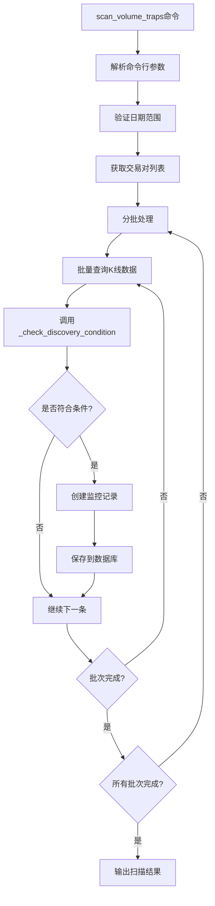

# 架构设计文档

**迭代编号**: 005
**迭代名称**: Discovery历史扫描优化
**版本**: v1.0.0
**创建日期**: 2025-12-25

---

## 1. 架构概述

### 1.1 设计目标
- 基于现有状态机架构，支持历史数据扫描
- 保持向后兼容，不破坏现有功能
- 优化性能，支持大数据量场景
- 提供灵活的配置选项

### 1.2 设计原则
- **最小改动**: 尽可能复用现有代码
- **向后兼容**: 现有命令行为不变
- **性能优先**: 优化资源使用和查询效率
- **易于维护**: 代码清晰，职责分离

---

## 2. 架构组件设计

### 2.1 核心组件

#### 2.1.1 VolumeTrapStateMachine（状态机）
**职责**: 控制Discovery阶段的历史扫描逻辑

**新增方法**:
```python
def scan_historical(
    self,
    interval: str,
    market_type: str = 'futures',
    start_date: Optional[str] = None,
    end_date: Optional[str] = None,
    batch_size: int = 1000
) -> Dict:
    """执行历史数据扫描

    Args:
        interval: K线周期
        market_type: 市场类型
        start_date: 开始日期 (YYYY-MM-DD)
        end_date: 结束日期 (YYYY-MM-DD)
        batch_size: 批处理大小

    Returns:
        Dict: 扫描结果统计
    """
```

**修改方法**:
```python
def _check_discovery_condition(
    self,
    symbol: str,
    interval: str,
    start_date: Optional[str] = None,
    end_date: Optional[str] = None
) -> tuple:
    """检查Discovery条件，支持日期范围

    Args:
        symbol: 交易对符号
        interval: K线周期
        start_date: 开始日期
        end_date: 结束日期

    Returns:
        tuple: (是否触发, 指标字典)
    """
```

#### 2.1.2 scan_volume_traps命令
**职责**: 提供命令行接口，支持日期范围筛选

**新增参数**:
- `--start`: 开始日期 (YYYY-MM-DD)
- `--end`: 结束日期 (YYYY-MM-DD)
- `--batch-size`: 批处理大小 (默认1000)

**命令示例**:
```bash
# 扫描全部历史
python manage.py scan_volume_traps --interval 4h

# 扫描指定范围
python manage.py scan_volume_traps --interval 4h --start 2025-11-01 --end 2025-11-30

# 自定义批处理大小
python manage.py scan_volume_traps --interval 4h --start 2025-11-01 --batch-size 500
```

#### 2.1.3 HistoricalScanner（历史扫描器）
**职责**: 批量扫描历史数据的辅助类

**核心方法**:
```python
class HistoricalScanner:
    def __init__(self, fsm: VolumeTrapStateMachine):
        self.fsm = fsm

    def scan_all_contracts(
        self,
        interval: str,
        market_type: str,
        start_date: Optional[str] = None,
        end_date: Optional[str] = None,
        batch_size: int = 1000
    ) -> Dict:
        """扫描所有交易对的历史数据"""
```

---

## 3. 数据流设计

### 3.1 历史扫描数据流



### 3.2 数据查询优化

```python
# 优化前：逐个查询
for contract in contracts:
    klines = KLine.objects.filter(
        symbol=contract.symbol,
        interval=interval
    ).order_by('open_time')
    # 处理...

# 优化后：批量查询
symbols = [c.symbol for c in contracts]
klines = KLine.objects.filter(
    symbol__in=symbols,
    interval=interval,
    market_type=market_type
).order_by('symbol', 'open_time')

# 按交易对分组
for symbol, group in groupby(klines, key=lambda k: k.symbol):
    # 处理每个交易对的数据
```

---

## 4. 关键决策记录

### 4.1 决策-001: 如何实现历史扫描
**问题**: Discovery阶段如何支持历史数据扫描？

**选项A**: 修改现有方法，增加可选参数
- ✅ 向后兼容
- ✅ 代码改动小
- ✅ 易于理解

**选项B**: 新增独立的历史扫描方法
- ✅ 职责清晰
- ❌ 代码重复
- ❌ 维护困难

**决策**: 选项A
**理由**: 保持代码简洁，向后兼容，符合最小改动原则

---

### 4.2 决策-002: 批量处理策略
**问题**: 如何处理大量历史数据？

**选项A**: 一次性加载全部数据
- ❌ 内存占用高
- ❌ 可能导致OOM

**选项B**: 分批处理
- ✅ 内存友好
- ✅ 可显示进度
- ✅ 易于控制

**决策**: 选项B
**理由**: 平衡性能和资源使用，提供良好的用户体验

---

### 4.3 决策-003: 默认日期范围
**问题**: 不指定日期范围时的默认行为？

**选项A**: 扫描全部历史数据
- ✅ 灵活性最高
- ✅ 符合用户需求

**选项B**: 扫描最近30天
- ❌ 可能遗漏历史事件

**决策**: 选项A
**理由**: 用户明确要求扫描全历史时期

---

## 5. 性能优化设计

### 5.1 数据库查询优化

#### 5.1.1 索引利用
```python
# 利用现有索引
KLine.objects.filter(
    symbol__in=symbols,           # 利用(symbol, interval, market_type, open_time)索引
    interval=interval,
    market_type=market_type,
    open_time__gte=start_date,    # 利用open_time索引
    open_time__lte=end_date
).order_by('symbol', 'open_time')
```

#### 5.1.2 批量操作
```python
# 批量创建监控记录
monitors_to_create = []
for kline in triggered_klines:
    monitor = VolumeTrapMonitor(...)
    monitors_to_create.append(monitor)

# 一次性写入数据库
VolumeTrapMonitor.objects.bulk_create(monitors_to_create)
```

### 5.2 内存优化

#### 5.2.1 流式处理
```python
def scan_with_streaming():
    # 使用iterator()减少内存占用
    for batch in queryset.iterator(chunk_size=1000):
        process_batch(batch)
        # 及时清理内存
        del batch
        gc.collect()
```

#### 5.2.2 资源监控
```python
import psutil

def check_resource_usage():
    memory = psutil.virtual_memory()
    if memory.percent > 80:
        logger.warning(f"内存使用率过高: {memory.percent}%")
        raise MemoryWarning("内存使用率超过80%")
```

### 5.3 进度提示设计

```python
from tqdm import tqdm

def scan_with_progress(contracts, total):
    """带进度条的扫描"""
    with tqdm(total=total, desc="扫描进度") as pbar:
        for i, contract in enumerate(contracts):
            # 扫描逻辑
            pbar.update(1)
            pbar.set_postfix({
                '当前': contract.symbol,
                '已处理': i + 1,
                '剩余': total - i - 1
            })
```

---

## 6. 错误处理设计

### 6.1 错误分类

| 错误类型 | 描述 | 处理方式 |
|---------|------|---------|
| 参数错误 | 无效日期、日期范围错误 | 验证并提示用户 |
| 数据错误 | K线数据不足、格式错误 | 跳过并记录日志 |
| 系统错误 | 数据库连接失败、内存不足 | 重试或退出 |

### 6.2 错误处理策略

```python
def handle_scan_error(error, contract_symbol):
    """统一错误处理"""
    if isinstance(error, ValueError):
        # 参数错误，终止扫描
        logger.error(f"参数错误: {error}")
        raise

    elif isinstance(error, DataInsufficientError):
        # 数据不足，跳过并继续
        logger.warning(f"跳过{contract_symbol}: 数据不足")
        return False

    else:
        # 系统错误，记录并继续
        logger.error(f"扫描{contract_symbol}失败: {error}", exc_info=True)
        return False
```

---

## 7. 向后兼容性设计

### 7.1 现有命令保持不变
```python
# 现有命令行为不变
python manage.py scan_volume_traps --interval 4h
# 等价于
python manage.py scan_volume_traps --interval 4h --start all
```

### 7.2 现有方法签名兼容
```python
# 现有调用方式仍然有效
fsm.scan(interval='4h')

# 新增调用方式
fsm.scan(interval='4h', start_date='2025-11-01', end_date='2025-11-30')
```

### 7.3 数据库结构不变
- 不修改现有模型
- 不添加新字段
- 现有数据保持完整

---

## 8. 部署架构

### 8.1 开发环境
- 本地Django项目
- SQLite或PostgreSQL数据库
- 直接运行管理命令

### 8.2 生产环境
- Django应用服务器
- PostgreSQL数据库
- 定时任务（Cron或Celery）

### 8.3 监控指标
- 扫描完成时间
- 发现异常事件数量
- 系统资源使用率
- 错误日志

---

## 9. 测试策略

### 9.1 单元测试
- `_check_discovery_condition`方法测试
- 日期参数解析测试
- 批量扫描测试

### 9.2 集成测试
- 命令行接口测试
- 数据库操作测试
- 性能测试

### 9.3 验收测试
- 扫描全部历史数据
- 扫描指定日期范围
- 性能指标达标

---

## 10. Q-Gate 4检查

### 10.1 检查清单
- [x] 组件设计已完成
- [x] 数据流已明确
- [x] 关键决策已做出
- [x] 架构图已绘制

### 10.2 评估结果
✅ **通过**: 架构设计清晰，技术实现可行

---

**架构设计版本**: v1.0.0
**设计完成时间**: 2025-12-25
**状态**: ✅ 通过
