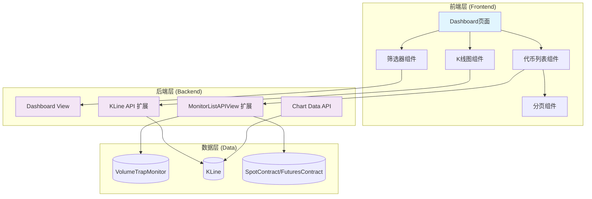
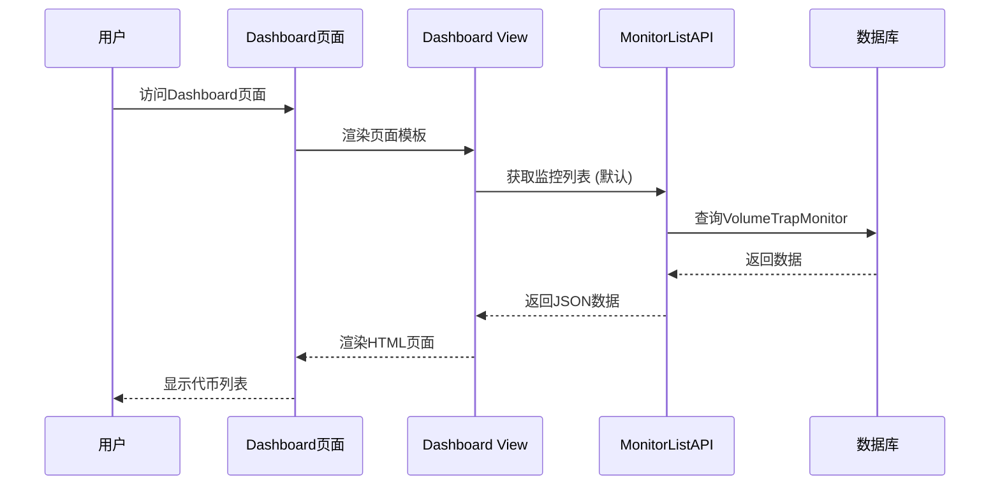
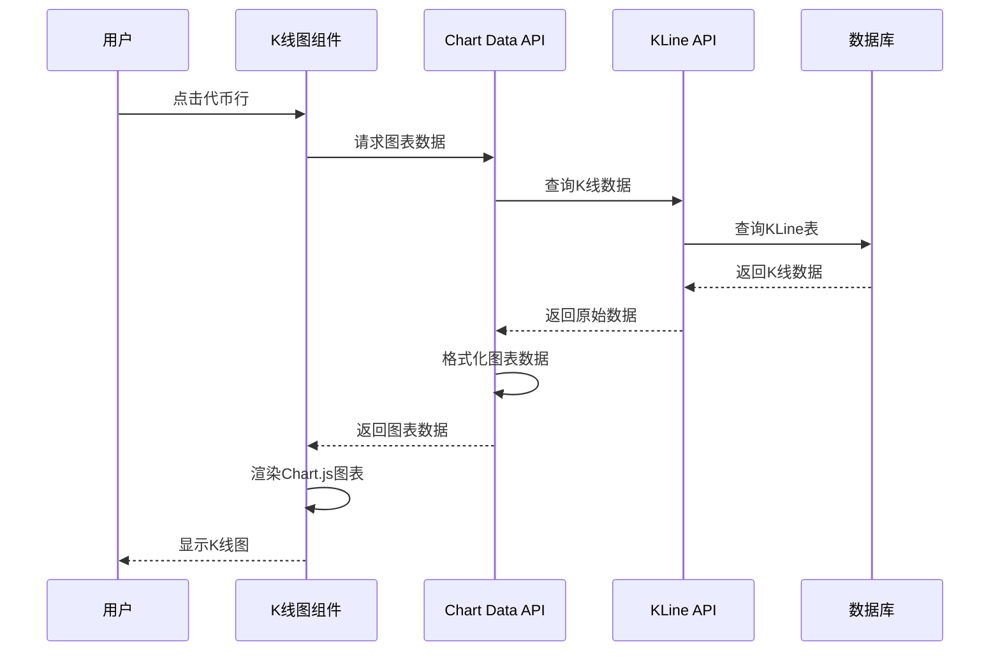

# Volume Trap Dashboard 技术架构设计

**迭代编号**: 006
**迭代名称**: Volume Trap Dashboard
**文档版本**: v1.0.0
**创建日期**: 2025-12-25
**生命周期阶段**: P4 - 架构设计

---

## 1. 需求概述

### 1.1 核心业务目标
构建一个直观的Dashboard界面，为加密货币交易员提供快速浏览和筛选巨量诱多/弃盘异常事件的能力，并通过K线图分析价格变化规律。

### 1.2 关键功能点
- [P0] 代币列表展示: 展示所有异常事件代币，包含symbol、status、trigger_time、trigger_price
- [P0] K线图展示: 点击代币后展示该代币的完整K线图（使用历史数据）
- [P0] 发现时刻标记: 在K线图上标记trigger_time位置
- [P0] 状态筛选器: 提供三个状态的单选或多选筛选
- [P0] 时间范围筛选: 支持按日期范围筛选异常事件
- [P0] 筛选条件组合: 状态和时间筛选可同时使用
- [P0] 响应式列表布局: 桌面端表格，移动端卡片
- [P0] 基础样式设计: 简洁清晰的UI设计

### 1.3 关键用户流程
1. 用户访问Dashboard页面
2. 系统加载VolumeTrapMonitor数据（默认显示所有状态，按时间倒序）
3. 用户使用状态筛选器筛选特定阶段的代币
4. 用户使用时间范围筛选器筛选特定时间段的代币
5. 用户点击代币项展开K线图
6. 系统加载该代币的历史K线数据并渲染图表
7. 在K线图上标记trigger_time位置

---

## 2. 核心技术选型

### 2.1 前端技术栈
- **模板引擎**: Django Templates (服务器端渲染)
- **图表库**: Chart.js (轻量级K线图绘制)
- **UI框架**: Bootstrap 5 (响应式布局)
- **JavaScript**: 原生JS + 简单全局状态管理

### 2.2 后端技术栈
- **框架**: Django + Django REST Framework (现有)
- **数据库**: PostgreSQL (现有)
- **API设计**: 扩展现有MonitorListAPIView

### 2.3 数据存储方案
- **VolumeTrapMonitor**: 存储代币监控记录（现有模型复用）
- **KLine**: 存储K线OHLCV数据（现有模型复用）

---

## 3. 核心架构设计

### 3.1 系统架构图



### 3.2 架构说明

#### 前端层 (Frontend Layer)
- **Dashboard页面**: 主页面容器，整合所有组件
- **代币列表组件**: 展示代币列表，支持分页和排序
- **筛选器组件**: 提供状态和时间范围筛选功能
- **K线图组件**: 渲染Chart.js K线图，支持数据加载和标记
- **分页组件**: 统一的分页控件

#### 后端层 (Backend Layer)
- **Dashboard View**: 渲染Dashboard模板的Django视图
- **MonitorListAPIView 扩展**: 扩展现有API，增加时间范围筛选
- **KLine API 扩展**: 新增K线数据查询API
- **Chart Data API**: 专门为图表提供数据的API端点

#### 数据层 (Data Layer)
- **VolumeTrapMonitor**: 存储量价异常监控记录
- **KLine**: 存储K线OHLCV数据
- **SpotContract/FuturesContract**: 交易对基础信息

---

## 3.3 底层原子服务定义 (Critical Foundation)

⚠️ **注意**: 此部分定义的组件是系统的基石，任何变更必须经过严格的回归测试。

#### [Core-Atomic] MonitorQueryService - 核心原子服务
**服务层级**: Atomic

**职责**:
负责构建和执行VolumeTrapMonitor的查询逻辑，包括筛选、分页、排序等功能，不涉及任何业务逻辑

**接口契约**:
- **Input**:
  - status_filter (String, 可选, 'pending'/'suspected_abandonment'/'confirmed_abandonment'/'invalidated'/'all')
  - interval_filter (String, 可选, '1h'/'4h'/'1d'/'all')
  - market_type_filter (String, 可选, 'spot'/'futures'/'all')
  - start_date (DateTime, 可选)
  - end_date (DateTime, 可选)
  - page (Integer, 默认1)
  - page_size (Integer, 默认20, 最大100)

- **Output**:
  - QuerySet (VolumeTrapMonitor QuerySet, 已优化查询)
  - metadata (Dict: total_count, current_page, total_pages)

- **异常**:
  - InvalidParameterError: 当筛选参数无效时触发
  - PageOutOfRangeError: 当页码超出范围时触发

**核心保障策略**:
使用select_related和prefetch_related优化数据库查询，确保N+1查询问题得到解决

**测试重点**:
必须通过边界值测试，确保在大量数据（>10000条）场景下查询性能<500ms

**映射需求**:
对应PRD [P0] 代币列表展示模块

**业务支撑**:
- 支撑流程1: 代币列表展示
- 支撑流程2: 状态筛选
- 支撑流程3: 时间范围筛选

#### [Core-Atomic] KLineDataService - 核心原子服务
**服务层级**: Atomic

**职责**:
负责查询和格式化K线数据，为图表展示提供标准化的OHLCV数据格式

**接口契约**:
- **Input**:
  - symbol (String, 必填)
  - interval (String, 必填, '1h'/'4h'/'1d')
  - market_type (String, 必填, 'spot'/'futures')
  - start_time (DateTime, 必填)
  - end_time (DateTime, 必填)
  - limit (Integer, 可选, 最大1000)

- **Output**:
  - List[Dict]: [{'time': timestamp, 'open': float, 'high': float, 'low': float, 'close': float, 'volume': float}]
  - total_count (Integer): 总记录数

- **异常**:
  - SymbolNotFoundError: 当symbol不存在时触发
  - DateRangeInvalidError: 当日期范围无效时触发

**核心保障策略**:
使用数据库索引优化时间范围查询，确保大量数据场景下响应时间<1秒

**测试重点**:
必须通过性能测试，确保在查询1000条K线数据时响应时间<1秒

**映射需求**:
对应PRD [P0] K线图展示模块

**业务支撑**:
- 支撑流程1: K线图渲染
- 支撑流程2: 发现时刻标记
- 支撑流程3: 图表数据加载

#### [Atomic] ChartDataFormatter - 原子服务
**服务层级**: Atomic

**职责**:
负责将KLine数据转换为Chart.js所需的格式，包含时间轴和数据序列

**接口契约**:
- **Input**:
  - kline_data (List[Dict]): K线原始数据
  - trigger_time (DateTime): 触发时间
  - trigger_price (Decimal): 触发价格

- **Output**:
  - Dict: {
    'labels': List[DateTime],  # 时间轴
    'datasets': List[Dict],    # 数据集
    'trigger_marker': Dict     # 触发点标记
  }

- **异常**:
  - DataFormatError: 当数据格式不正确时触发

**核心保障策略**:
在数据转换过程中进行严格的类型检查和验证，确保转换结果的准确性

**测试重点**:
必须通过格式转换测试，确保转换后的数据格式符合Chart.js要求

**映射需求**:
对应PRD [P0] K线图展示模块

**业务支撑**:
- 支撑流程1: 图表数据格式化
- 支撑流程2: 发现时刻标记显示

---

## 3.4 组件与需求映射

| 组件名称 | 类型 | 职责 | 对应功能点 | 优先级 |
|---------|------|------|-----------|--------|
| Dashboard页面 | Page | 主页面容器，整合所有组件 | F1.1 | P0 |
| 代币列表组件 | Component | 展示代币列表，支持分页和排序 | F1.1, F1.2, F1.3 | P0 |
| 筛选器组件 | Component | 提供状态和时间范围筛选 | F3.1, F3.2, F3.3 | P0 |
| K线图组件 | Component | 渲染Chart.js K线图 | F2.1, F2.2, F2.3 | P0 |
| 分页组件 | Component | 统一的分页控件 | F1.3 | P0 |
| MonitorQueryService | Service | 查询和筛选VolumeTrapMonitor | F1.1, F3.1, F3.2 | P0 |
| KLineDataService | Service | 查询和格式化K线数据 | F2.1, F2.2 | P0 |
| ChartDataFormatter | Service | 转换数据为Chart.js格式 | F2.1, F2.2 | P0 |

---

## 3.5 架构继承与演进分析

### 3.5.1 架构继承清单
- **必须继承**: Django + DRF架构、现有数据模型、认证体系
- **建议继承**: 现有的API设计模式、序列化器结构、错误处理机制
- **可替换**: 前端模板系统（当前为空，可自由设计）

### 3.5.2 复用能力评估
| 组件/服务 | 复用方式 | 适配成本 | 风险等级 | 决策 |
|---------|---------|---------|---------|------|
| VolumeTrapMonitor Model | 直接复用 | 低 | 低 | 复用 |
| KLine Model | 直接复用 | 低 | 低 | 复用 |
| MonitorListAPIView | 接口适配 | 低 | 低 | 复用 |
| VolumeTrapMonitorSerializer | 扩展复用 | 低 | 低 | 复用 |
| 认证体系 | 直接复用 | 无 | 低 | 复用 |

### 3.5.3 架构一致性检查
- **设计原则一致性**: ✅ 遵循Django最佳实践
- **技术栈一致性**: ✅ 继续使用Django + DRF
- **编码规范一致性**: ✅ 遵循现有DRF模式
- **架构模式一致性**: ✅ 保持API-first设计

### 3.5.4 演进路径建议
- **阶段1**: 集成Dashboard到monitor模块，创建基础页面结构
- **阶段2**: 扩展MonitorListAPIView支持时间范围筛选
- **阶段3**: 新增K线数据API和Chart数据格式化服务
- **阶段4**: 实现前端组件和交互逻辑
- **阶段5**: 优化性能和用户体验

---

## 4. 关键技术决策

### 决策点1: Dashboard集成策略
- **选定方案**: 集成到现有monitor模块
- **决策日期**: 2025-12-25
- **决策人**: PowerBy Architect
- **理由**: 快速集成，复用现有认证和权限体系，维护成本低
- **风险与缓解措施**: 受现有架构限制，但利大于弊
- **后续影响**: 为未来功能扩展提供基础

### 决策点2: API扩展策略
- **选定方案**: 扩展MonitorListAPIView增加时间范围筛选
- **决策日期**: 2025-12-25
- **决策人**: PowerBy Architect
- **理由**: 保持API一致性，最小化改动，复用现有逻辑
- **风险与缓解措施**: API响应可能变大，但可以通过字段选择优化
- **后续影响**: 为Dashboard提供统一的数据访问接口

### 决策点3: 前端架构选择
- **选定方案**: Django Templates + Chart.js + Bootstrap
- **决策日期**: 2025-12-25
- **决策人**: PowerBy Architect
- **理由**: MVP优先，集成简单，性能可靠
- **风险与缓解措施**: K线图功能受限，但可以升级到专业图表库
- **后续影响**: 为移动端适配和高级交互奠定基础

---

## 5. API契约设计

### 5.1 Dashboard页面API
**端点**: `GET /dashboard/`
**描述**: 渲染Dashboard主页面

**响应**: HTML页面，包含：
- 代币列表表格
- 筛选器控件
- 分页控件
- K线图容器

### 5.2 监控列表API (扩展)
**端点**: `GET /api/volume-trap/monitors/`
**描述**: 获取监控记录列表，支持筛选和分页

**新增查询参数**:
- `start_date` (可选): 开始日期 (YYYY-MM-DD)
- `end_date` (可选): 结束日期 (YYYY-MM-DD)

**响应示例**:
```json
{
    "count": 100,
    "next": "http://api/volume-trap/monitors/?page=2",
    "previous": null,
    "results": [
        {
            "id": 1,
            "symbol": "BTCUSDT",
            "interval": "4h",
            "status": "pending",
            "trigger_time": "2025-12-25T10:00:00Z",
            "trigger_price": 50000.00,
            "trigger_volume": 1000.00,
            "trigger_kline_high": 51000.00,
            "trigger_kline_low": 49000.00,
            "phase_1_passed": true,
            "phase_2_passed": false,
            "phase_3_passed": false,
            "latest_indicators": {...},
            "created_at": "2025-12-25T10:00:00Z",
            "updated_at": "2025-12-25T10:00:00Z"
        }
    ]
}
```

### 5.3 K线数据API
**端点**: `GET /api/volume-trap/kline/{symbol}/`
**描述**: 获取指定代币的K线数据

**查询参数**:
- `interval` (必填): 时间周期 (1h/4h/1d)
- `market_type` (必填): 市场类型 (spot/futures)
- `start_time` (必填): 开始时间 (ISO 8601)
- `end_time` (必填): 结束时间 (ISO 8601)
- `limit` (可选): 限制数量 (最大1000)

**响应示例**:
```json
{
    "symbol": "BTCUSDT",
    "interval": "4h",
    "market_type": "futures",
    "total_count": 100,
    "data": [
        {
            "time": "2025-12-25T08:00:00Z",
            "open": 50000.00,
            "high": 51000.00,
            "low": 49000.00,
            "close": 50500.00,
            "volume": 100.50
        }
    ]
}
```

### 5.4 图表数据API
**端点**: `GET /api/volume-trap/chart-data/{monitor_id}/`
**描述**: 获取指定监控记录的图表数据

**响应示例**:
```json
{
    "monitor_id": 1,
    "symbol": "BTCUSDT",
    "trigger_time": "2025-12-25T10:00:00Z",
    "trigger_price": 50000.00,
    "chart_data": {
        "labels": ["2025-12-24T08:00:00Z", ...],
        "datasets": [
            {
                "label": "Open",
                "data": [49000, ...],
                "borderColor": "rgb(75, 192, 192)"
            },
            {
                "label": "High",
                "data": [51000, ...],
                "borderColor": "rgb(54, 162, 235)"
            },
            {
                "label": "Low",
                "data": [48000, ...],
                "borderColor": "rgb(255, 99, 132)"
            },
            {
                "label": "Close",
                "data": [50500, ...],
                "borderColor": "rgb(153, 102, 255)"
            }
        ],
        "trigger_marker": {
            "time": "2025-12-25T10:00:00Z",
            "price": 50000.00,
            "label": "发现时刻"
        }
    }
}
```

---

## 6. 前端组件结构

### 6.1 目录结构
```
monitor/
├── templates/
│   └── dashboard/
│       ├── base.html          # 基础模板
│       └── index.html         # Dashboard主页面
├── static/
│   └── dashboard/
│       ├── css/
│       │   └── dashboard.css
│       └── js/
│           └── dashboard.js
└── apps.py
```

### 6.2 组件职责

#### Dashboard主页面 (index.html)
- **职责**: 主页面容器，整合所有子组件
- **模板继承**: extends base.html
- **包含组件**: 筛选器、代币列表、分页、K线图

#### 代币列表组件 (TokenList)
- **职责**: 展示代币列表，支持分页和排序
- **数据源**: MonitorListAPIView
- **交互**: 点击行展开K线图

#### 筛选器组件 (FilterPanel)
- **职责**: 提供状态和时间范围筛选
- **筛选逻辑**: 状态筛选 AND 时间范围筛选
- **UI控件**: 下拉选择器 + 日期选择器

#### K线图组件 (KLineChart)
- **职责**: 使用Chart.js渲染K线图
- **数据源**: Chart Data API
- **特性**: 触发时刻标记、响应式缩放

---

## 7. 数据流设计

### 7.1 页面加载流程


### 7.2 K线图加载流程


---

## 8. 非功能需求

### 8.1 性能要求
- **页面加载时间**: < 2秒
- **筛选响应时间**: < 500ms
- **K线图加载时间**: < 1秒
- **API响应时间**: < 500ms

### 8.2 可靠性要求
- **数据库查询**: 利用现有索引，确保查询稳定性
- **错误处理**: 统一的错误处理机制
- **异常恢复**: 前端友好的错误提示

### 8.3 兼容性要求
- **浏览器**: Chrome, Firefox, Safari, Edge
- **移动端**: 响应式设计，适配移动设备
- **屏幕尺寸**: 768px断点切换布局

### 8.4 可维护性要求
- **代码结构**: 清晰的组件分离
- **文档**: 完整的API文档和组件说明
- **测试**: 关键功能的单元测试

---

## 9. 变更点说明

### 9.1 变更概述
基于PRD中的功能需求分析，当前架构需要进行以下主要变更：
- 新增Dashboard前端页面和组件
- 扩展现有MonitorListAPIView支持时间范围筛选
- 新增K线数据查询API
- 新增图表数据格式化服务

### 9.2 架构变更对比

#### 当前架构 (现状)
- Django + DRF单体应用
- 纯API后端，无前端页面
- 现有的MonitorListAPIView仅支持基本筛选

#### 目标架构 (变更后)
- Django + DRF + Dashboard前端
- 扩展的API支持完整筛选功能
- 新增K线数据API和图表服务

### 9.3 具体变更点清单

| 变更类型 | 组件/模块 | 变更描述 | 影响范围 | 风险等级 |
|---------|---------|---------|---------|---------|
| NEW | Dashboard页面 | 新增Dashboard主页面 | 前端展示 | 低 |
| NEW | K线图组件 | 新增Chart.js K线图组件 | 前端可视化 | 中 |
| NEW | Chart Data API | 新增图表数据API | 后端API | 中 |
| MODIFIED | MonitorListAPIView | 扩展支持时间范围筛选 | 后端API | 低 |
| NEW | KLineDataService | 新增K线数据服务 | 后端服务 | 低 |
| NEW | ChartDataFormatter | 新增图表数据格式化服务 | 后端服务 | 低 |

### 9.4 技术影响分析

#### 新增技术栈
- **Chart.js**: 图表可视化 - 团队已有使用经验
- **Bootstrap 5**: 响应式UI - 轻量级，易集成

#### 性能影响
- **改进点**: 服务器端渲染提升首屏加载速度
- **风险点**: 大量K线数据可能导致图表渲染慢
- **缓解措施**: 数据分页加载，懒加载图表

#### 依赖变更
- **新增依赖**: Chart.js库、Bootstrap 5
- **升级依赖**: 无

---

## 10. 风险评估

### 10.1 Core-Atomic服务变更风险 ⚠️
**MonitorQueryService变更**:
- **风险等级**: 中
- **影响范围**: 所有涉及VolumeTrapMonitor查询的功能
- **缓解措施**: 保持向后兼容，新增参数为可选

**KLineDataService变更**:
- **风险等级**: 中
- **影响范围**: K线图展示功能
- **缓解措施**: 新建服务，不影响现有功能

### 10.2 普通原子服务变更 ⚡
**ChartDataFormatter变更**:
- **风险等级**: 低
- **影响范围**: 图表数据格式化
- **缓解措施**: 独立服务，易于测试和调试

### 10.3 编排服务变更 ✅
**Dashboard页面变更**:
- **风险等级**: 低
- **影响范围**: 前端展示
- **缓解措施**: 新增页面，不影响现有功能

---

## 11. Gate 4检查结果

### 检查清单
- [x] 架构图清晰表达了系统结构
- [x] 每个组件的职责明确且有需求映射
- [x] 原子服务契约定义完整
- [x] 底层服务可靠性清单完整
- [x] 变更点说明完整
- [x] 所有关键技术决策已完成并记录
- [x] 架构设计符合PRD要求
- [x] 非功能需求（性能、安全等）已考虑

**Gate 4检查结果**: ✅ **通过** - 可以进入P5阶段

---

## 12. 下一步行动

基于架构设计结果，进入P5开发规划阶段：
1. 制定详细的开发任务计划
2. 分解P0功能为可执行任务
3. 定义任务依赖关系和验收标准
4. 评估开发工时和里程碑

**预计完成时间**: 2025-12-25
**架构设计负责人**: PowerBy Architect
