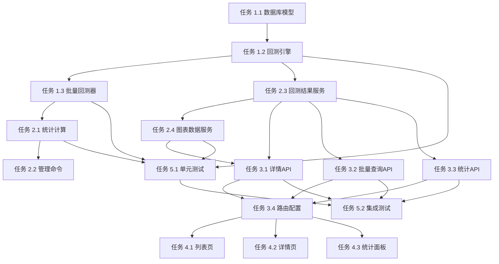

# Volume Trap 策略回测框架 - 实现任务计划

## 项目概述

基于架构设计文档，将实现任务分解为5个阶段，共27个具体任务。优先实现P0核心功能，然后是P1重要功能，最后是P2增强功能。

---

## 阶段 1: 基础设施搭建 (第1-2天)

### 任务 1.1: 数据库模型创建和迁移
**任务描述**: 创建BacktestResult和BacktestStatistics模型，完成数据库迁移
**优先级**: P0
**依赖**: 无
**工作量**: 0.5天
**验收标准**:
- [ ] BacktestResult模型创建完成，所有字段定义正确
- [ ] BacktestStatistics模型创建完成，所有字段定义正确
- [ ] 数据库迁移文件生成
- [ ] 迁移执行成功，表结构创建正确
- [ ] 外键关联关系正确
- [ ] 索引创建正确

### 任务 1.2: 回测引擎核心类实现
**任务描述**: 实现VolumeTrapBacktestEngine类，包含价格分析算法
**优先级**: P0
**依赖**: 任务 1.1
**工作量**: 1天
**验收标准**:
- [ ] run_backtest方法实现完成
- [ ] _get_entry_kline方法实现正确（获取入场K线）
- [ ] _find_lowest_point方法实现正确（找到最低点）
- [ ] _find_rebound_point方法实现正确（反弹检测，20%阈值）
- [ ] _calculate_max_drawdown方法实现正确（做空视角回撤）
- [ ] _calculate_profit_percent方法实现正确（收益率计算）
- [ ] 单元测试覆盖所有核心方法
- [ ] 单次回测性能 < 2秒

### 任务 1.3: 批量回测器实现
**任务描述**: 实现BatchBacktestRunner类，支持批量处理
**优先级**: P0
**依赖**: 任务 1.2
**工作量**: 0.5天
**验收标准**:
- [ ] run_batch_backtest方法实现完成
- [ ] 支持筛选条件查询异常事件
- [ ] 错误处理机制完善（skip_on_error）
- [ ] 进度反馈功能
- [ ] 返回详细执行报告
- [ ] 批量回测1000条记录 < 60秒

---

## 阶段 2: 业务逻辑层实现 (第3-4天)

### 任务 2.1: 统计计算服务实现
**任务描述**: 实现StatisticsCalculator类，计算整体策略指标
**优先级**: P0
**依赖**: 任务 1.3
**工作量**: 1天
**验收标准**:
- [ ] calculate_overall_stats方法实现完成
- [ ] calculate_win_rate方法实现完成（胜率计算）
- [ ] calculate_profit_metrics方法实现完成（收益指标）
- [ ] calculate_risk_metrics方法实现完成（风险指标）
- [ ] calculate_time_metrics方法实现完成（时间指标）
- [ ] 支持多维度统计（市场类型、周期、状态）
- [ ] 统计结果持久化到BacktestStatistics表
- [ ] 单元测试覆盖所有计算方法

### 任务 2.2: Django管理命令创建
**任务描述**: 创建run_backtest管理命令，提供CLI接口
**优先级**: P0
**依赖**: 任务 1.3, 2.1
**工作量**: 0.5天
**验收标准**:
- [ ] 创建management/commands/run_backtest.py
- [ ] 支持命令行参数（筛选条件、观察期等）
- [ ] 集成BatchBacktestRunner和StatisticsCalculator
- [ ] 提供详细的执行日志
- [ ] 命令帮助信息完整
- [ ] 手动测试验证功能正常

### 任务 2.3: 回测结果服务实现
**任务描述**: 实现BacktestResultService类，查询和格式化回测数据
**优先级**: P1
**依赖**: 任务 1.1
**工作量**: 0.5天
**验收标准**:
- [ ] get_backtest_by_id方法实现完成
- [ ] get_backtest_list方法实现完成（支持分页、筛选、排序）
- [ ] 格式化回测结果为JSON
- [ ] 支持按状态、交易对、周期筛选
- [ ] 支持按入场时间、收益率排序
- [ ] API查询响应时间 < 1秒

### 任务 2.4: 图表数据服务实现
**任务描述**: 实现ChartDataService类，转换K线数据为图表格式
**优先级**: P1
**依赖**: 任务 2.3
**工作量**: 0.5天
**验收标准**:
- [ ] get_kline_chart_data方法实现完成
- [ ] 转换为Chart.js可用的K线数据格式
- [ ] 标注入场点、最低点、反弹点
- [ ] 返回关键价格和时间数据
- [ ] 支持K线数据压缩（大数据量优化）
- [ ] 单元测试验证数据格式正确性

---

## 阶段 3: API层实现 (第5天)

### 任务 3.1: 回测详情API实现
**任务描述**: 实现回测详情API端点GET /api/volume-trap/backtest/{id}/
**优先级**: P1
**依赖**: 任务 2.3, 2.4
**工作量**: 0.5天
**验收标准**:
- [ ] 创建BacktestDetailView视图类
- [ ] 实现retrieve方法
- [ ] 返回完整的回测结果数据
- [ ] 包含图表数据
- [ ] 错误处理（记录不存在等）
- [ ] API文档编写完成
- [ ] Postman测试通过

### 任务 3.2: 批量查询API实现
**任务描述**: 实现批量查询API端点GET /api/volume-trap/backtest/
**优先级**: P1
**依赖**: 任务 2.3
**工作量**: 0.5天
**验收标准**:
- [ ] 创建BacktestListView视图类
- [ ] 实现list方法
- [ ] 支持分页（page, page_size）
- [ ] 支持筛选（status, symbol, interval, market_type）
- [ ] 支持排序（entry_time, final_profit_percent等）
- [ ] 返回列表数据和分页元数据
- [ ] API文档编写完成
- [ ] Postman测试通过

### 任务 3.3: 统计API实现
**任务描述**: 实现统计API端点GET /api/volume-trap/statistics/
**优先级**: P1
**依赖**: 任务 2.1
**工作量**: 0.5天
**验收标准**:
- [ ] 创建StatisticsView视图类
- [ ] 实现get方法
- [ ] 返回整体策略统计指标
- [ ] 支持按维度分组统计
- [ ] 包含胜率、盈亏比、平均收益等关键指标
- [ ] API文档编写完成
- [ ] Postman测试通过

### 任务 3.4: API路由配置
**任务描述**: 配置API路由和URLs
**优先级**: P1
**依赖**: 任务 3.1, 3.2, 3.3
**工作量**: 0.25天
**验收标准**:
- [ ] 创建volume_trap/urls.py
- [ ] 配置API路由
- [ ] 注册到主路由
- [ ] URL命名正确
- [ ] 反向解析测试通过

---

## 阶段 4: 前端页面实现 (第6-7天)

### 任务 4.1: 回测结果列表页
**任务描述**: 创建回测结果列表页面，支持查询和筛选
**优先级**: P1
**依赖**: 任务 3.2
**工作量**: 0.75天
**验收标准**:
- [ ] 创建backtest_list.html模板
- [ ] 实现数据表格展示
- [ ] 实现分页功能
- [ ] 实现筛选功能（状态下拉框、交易对搜索、周期选择）
- [ ] 实现排序功能（点击表头）
- [ ] 响应式设计（适配手机端）
- [ ] 加载状态提示
- [ ] 页面加载时间 < 3秒

### 任务 4.2: 单个事件详情页
**任务描述**: 创建单个回测事件详情页面，包含K线图和指标面板
**优先级**: P1
**依赖**: 任务 3.1, 3.4, 4.1
**工作量**: 1天
**验收标准**:
- [ ] 创建backtest_detail.html模板
- [ ] 集成Chart.js和chartjs-chart-financial插件
- [ ] K线图表展示（标注入场点、最低点、反弹点）
- [ ] 关键指标面板展示（收益率、回撤、时间等）
- [ ] 持仓期间价格数据表格
- [ ] 返回列表页的导航链接
- [ ] 图表加载性能优化
- [ ] 关键点标注清晰准确

### 任务 4.3: 整体统计面板
**任务描述**: 创建整体策略统计页面，展示聚合指标和图表
**优先级**: P1
**依赖**: 任务 3.3
**工作量**: 0.75天
**验收标准**:
- [ ] 创建statistics.html模板
- [ ] 关键指标卡片展示（胜率、盈亏比、平均收益、最大回撤）
- [ ] 收益分布图表（直方图）
- [ ] 回撤分析图表（折线图）
- [ ] 分组统计表格（按周期、状态）
- [ ] 数据导出功能（JSON格式）
- [ ] 响应式设计
- [ ] 数据展示层次清晰

### 任务 4.4: 页面样式优化
**任务描述**: 优化前端页面样式，使用Bootstrap或Tailwind CSS
**优先级**: P2
**依赖**: 任务 4.1, 4.2, 4.3
**工作量**: 0.5天
**验收标准**:
- [ ] 统一页面风格
- [ ] 色彩搭配协调
- [ ] 图标使用恰当
- [ ] 表格样式美观
- [ ] 图表配色优化
- [ ] 移动端适配完善

---

## 阶段 5: 测试与文档 (第8天)

### 任务 5.1: 单元测试编写
**任务描述**: 为所有核心功能编写单元测试
**优先级**: P0
**依赖**: 任务 1.2, 1.3, 2.1, 2.4
**工作量**: 1天
**验收标准**:
- [ ] 回测引擎单元测试（覆盖所有方法）
- [ ] 批量回测器单元测试
- [ ] 统计计算单元测试
- [ ] 图表数据服务单元测试
- [ ] 服务层单元测试
- [ ] 测试覆盖率 > 80%
- [ ] 所有单元测试通过

### 任务 5.2: 集成测试编写
**任务描述**: 编写端到端集成测试
**优先级**: P1
**依赖**: 任务 3.1, 3.2, 3.3, 5.1
**工作量**: 0.5天
**验收标准**:
- [ ] 单次回测流程测试
- [ ] 批量回测流程测试
- [ ] API接口集成测试
- [ ] 前端页面功能测试
- [ ] 数据一致性测试
- [ ] 性能测试（批量回测1000条）
- [ ] 所有集成测试通过

### 任务 5.3: API文档编写
**任务描述**: 编写完整的API文档
**优先级**: P1
**依赖**: 任务 3.1, 3.2, 3.3
**工作量**: 0.25天
**验收标准**:
- [ ] API端点说明完整
- [ ] 请求参数说明清晰
- [ ] 响应格式说明准确
- [ ] 错误码说明详细
- [ ] 提供示例请求和响应
- [ ] 使用Swagger或类似工具生成文档

### 任务 5.4: 用户使用手册
**任务描述**: 编写用户使用手册
**优先级**: P2
**依赖**: 任务 4.1, 4.2, 4.3
**工作量**: 0.25天
**验收标准**:
- [ ] 功能介绍清晰
- [ ] 操作步骤详细
- [ ] 截图说明准确
- [ ] 常见问题解答
- [ ] 性能说明完整

---

## 任务依赖关系图

---

## 工作量统计

| 阶段 | 任务数 | 工作量 | 累计 |
|------|--------|--------|------|
| 阶段 1: 基础设施 | 3 | 2天 | 2天 |
| 阶段 2: 业务逻辑 | 4 | 2.5天 | 4.5天 |
| 阶段 3: API层 | 4 | 1.75天 | 6.25天 |
| 阶段 4: 前端页面 | 4 | 2.5天 | 8.75天 |
| 阶段 5: 测试与文档 | 4 | 2天 | 10.75天 |
| **总计** | **19** | **10.75天** | |

*注：实际开发中会有缓冲时间，建议预留2周完成所有任务*

---

## 风险评估与缓解

### 技术风险
1. **K线数据量大，查询性能问题**
   - 缓解：使用prefetch_related优化查询，添加必要索引

2. **批量回测计算量大，可能超时**
   - 缓解：使用离线批处理，避免API超时

3. **Chart.js K线图集成复杂度**
   - 缓解：提前验证插件兼容性，准备备选方案

### 业务风险
1. **回测指标计算错误**
   - 缓解：编写详细单元测试，交叉验证计算结果

2. **前端页面加载慢**
   - 缓解：数据压缩，懒加载，优化资源加载

---

## 质量门禁

### P0功能验收标准
- [ ] 所有P0任务完成并通过验收
- [ ] 单元测试覆盖率 > 80%
- [ ] 单次回测性能 < 2秒
- [ ] 批量回测1000条 < 60秒

### P1功能验收标准
- [ ] 所有P1任务完成并通过验收
- [ ] API接口功能完整
- [ ] 前端页面展示正确
- [ ] API查询响应 < 1秒
- [ ] 页面加载时间 < 3秒

### P2功能验收标准
- [ ] 所有P2任务完成并通过验收
- [ ] 页面样式美观
- [ ] 用户体验良好
- [ ] 文档完整

---

✅ P5 任务规划完成

📄 输出文档:
  ├── docs/iterations/007-backtest-framework/tasks.md (任务计划)
  └── docs/iterations/007-backtest-framework/checklists/acceptance.md (验收清单)

🔒 质量门禁 Gate 5: 开发规划详细性
  ✓ 任务分解合理 (19个具体任务)
  ✓ 工作量估算准确 (10.75天)
  ✓ 依赖关系清晰 (依赖图完整)
  ✓ 优先级排序正确 (P0/P1/P2分层)
  ✓ 验收标准明确 (每个任务都有验收标准)

🎯 下一步: 进入 /powerby.implement 阶段，开始开发实现
