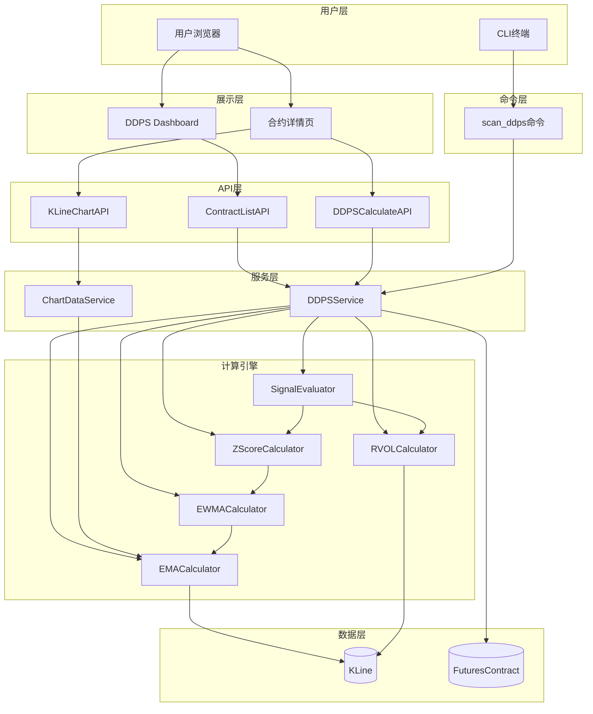

# 架构设计文档：动态偏离概率空间 2.0 (DDPS-Z)

## 文档信息
| 属性 | 值 |
|------|-----|
| 迭代编号 | 009 |
| 创建日期 | 2025-01-05 |
| 状态 | 已确认 |
| 架构版本 | v1.0 |

---

## 一、需求解读与目标对齐

### 1.1 核心业务目标

构建一个**波动率自适应的价格偏离分析系统**，通过Z-Score统计标准化，将不同币种的价格偏离转化为统一的"统计罕见程度"，帮助交易者识别统计意义上的超买/超卖时机。

### 1.2 关键用户流程

1. **按需触发计算**（两种方式）：
   - **前端触发**：打开交易对详情页面时，实时计算并显示Z-Score和分位数带
   - **脚本触发**：通过Management Command指定交易对计算并输出结果

2. **用户访问Dashboard**：
   - 单页面展示**所有交易对**（不分页）
   - 默认按**市值排序**
   - 支持**前端关键字搜索**

3. **用户查看详情**：点击合约展开K线图，查看带分位数带的价格走势和量价验证结果

4. **用户做出决策**：根据Z-Score数值和量价状态（强确认/弱信号）判断交易时机

### 1.3 系统特点

- **按需计算**：不做定时批量扫描，仅在用户请求时实时计算
- **轻量Dashboard**：单页全量展示 + 前端搜索过滤
- **实时响应**：前端请求即时触发计算引擎

### 1.4 核心算法链路

```
K线数据 → EMA25计算 → 偏离率D_t → EWMA(μ_t, σ_t) → Z-Score → 分位数 → 量价验证 → 信号输出
```

---

## 二、架构设计与可视化

### 2.1 核心架构图



### 2.2 概念解读

DDPS-Z系统采用**按需计算架构**，当用户请求时实时触发计算引擎，通过分层设计将展示、业务逻辑、计算算法和数据访问清晰分离。计算引擎采用**管道式设计**，各计算器按依赖顺序串联，最终输出Z-Score和量价信号。

### 2.3 组件职责

| 组件 | 层级 | 核心职责 |
|------|------|---------|
| **DDPS Dashboard** | 展示层 | 单页展示所有交易对列表，按市值排序，支持前端关键字搜索 |
| **合约详情页** | 展示层 | 展示K线图+分位数带覆盖，显示Z-Score和量价状态 |
| **ContractListAPI** | API层 | 返回所有活跃合约列表（含市值），供Dashboard展示 |
| **DDPSCalculateAPI** | API层 | 接收symbol+interval，触发计算引擎返回Z-Score结果 |
| **KLineChartAPI** | API层 | 返回带分位数带的K线图表数据 |
| **scan_ddps** | 命令层 | CLI工具，指定交易对计算并输出结果到终端 |
| **DDPSService** | 服务层 | 业务编排，协调各计算器完成完整计算流程 |
| **ChartDataService** | 服务层 | 将K线+分位数带格式化为前端图表所需格式 |
| **EMACalculator** | 计算引擎 | 计算EMA(25)均线 |
| **EWMACalculator** | 计算引擎 | 计算基础偏离率D_t、EWMA动态均值μ_t和波动率σ_t |
| **ZScoreCalculator** | 计算引擎 | 计算标准化偏离Z_t和历史分位数 |
| **RVOLCalculator** | 计算引擎 | 计算相对成交量倍数（复用现有volume_trap模块） |
| **SignalEvaluator** | 计算引擎 | 量价验证，判断强确认/弱信号/中性 |

### 2.4 组件与需求映射

| 组件 | 负责实现的功能点 |
|------|-----------------|
| **EMACalculator** | FP-001 (EMA25计算) |
| **EWMACalculator** | FP-002 (基础偏离率), FP-003 (EWMA均值), FP-004 (EWMA波动率) |
| **ZScoreCalculator** | FP-005 (Z-Score计算), FP-006 (分位数计算) |
| **RVOLCalculator** | FP-007 (RVOL计算) - 复用现有 |
| **SignalEvaluator** | FP-008 (量价验证逻辑) |
| **DDPSService** | FP-011 (结果组装), FP-014 (数据不足处理) |
| **scan_ddps命令** | FP-012 (批量扫描命令) |
| **Dashboard + ContractListAPI** | FP-015 (合约列表页) |
| **详情页 + KLineChartAPI** | FP-016 (合约详情K线图) |

### 2.5 交互说明

#### 流程1：用户访问Dashboard

```
用户 → Dashboard页面 → ContractListAPI → DDPSService → FuturesContract表
                                                    ↓
                              返回合约列表（symbol, 市值）← 前端渲染列表+搜索
```

#### 流程2：用户查看合约详情（核心计算流程）

```
用户点击合约 → DDPSCalculateAPI(symbol, interval=4h)
                        ↓
                   DDPSService
                        ↓
    ┌───────────────────┼───────────────────┐
    ↓                   ↓                   ↓
EMACalculator    RVOLCalculator      KLine数据
(计算EMA25)      (计算RVOL)          (获取历史K线)
    ↓
EWMACalculator
(计算D_t, μ_t, σ_t)
    ↓
ZScoreCalculator
(计算Z_t, 分位数)
    ↓
SignalEvaluator
(量价验证：强确认/弱信号)
    ↓
返回结果 → 前端渲染K线图+分位数带+Z-Score显示
```

#### 流程3：CLI脚本计算

```
python manage.py scan_ddps --symbol ETHUSDT --interval 4h
                        ↓
                   DDPSService（同流程2）
                        ↓
                   终端输出结果
```

---

## 三、关键决策点与方案评估

### 3.1 决策点一：历史偏离序列(D_t)的存储策略

| 方案 | 描述 | 优点 | 缺点 |
|------|------|------|------|
| **方案A：纯实时计算** | 每次请求从KLine表读取历史数据，实时计算全部D_t序列和EWMA | 架构简单，无额外存储，数据始终最新 | 每次请求需处理180+根K线 |
| 方案B：偏离序列缓存 | 持久化存储每根K线的D_t值 | 后续计算更快 | 需维护缓存一致性 |

**最终决策**: ✅ **方案A（纯实时计算）**

**决策理由**:
1. 180根K线的计算在Python/NumPy下仅需毫秒级
2. 按需计算场景下请求频率不高，实时计算完全可接受
3. MVP阶段保持简单，避免缓存一致性问题

---

### 3.2 决策点二：计算结果(DDPSResult)是否持久化

| 方案 | 描述 | 优点 | 缺点 |
|------|------|------|------|
| **方案A：不持久化** | 每次请求实时计算，直接返回结果 | 无存储开销，架构简单，结果始终实时 | 无法查询历史 |
| 方案B：可选持久化 | 提供`--save`参数选项 | 灵活性高 | 额外实现成本 |

**最终决策**: ✅ **方案A（不持久化）**

**决策理由**:
1. 当前需求是按需实时查看，无历史查询需求
2. 减少存储开销和数据库写入
3. P1阶段如需信号回测，再添加持久化功能

---

### 3.3 决策点三：前端K线图实现方式

| 方案 | 描述 | 优点 | 缺点 |
|------|------|------|------|
| **方案A：复用Chart.js** | 基于现有K线图组件扩展 | 复用现有代码，开发成本低 | 金融图表支持有限 |
| 方案B：Lightweight Charts | 使用TradingView开源库 | 专业金融图表 | 引入新依赖 |

**最终决策**: ✅ **方案A（复用Chart.js）**

**决策理由**:
1. 现有项目已有成熟的Chart.js K线图实现
2. 分位数带本质是区域填充，Chart.js完全可以实现
3. MVP阶段优先复用，保持技术栈一致性

---

## 四、目录结构设计

```
ddps_z/                              # 新建Django App
├── __init__.py
├── apps.py
├── urls.py                          # URL路由配置
│
├── calculators/                     # 计算引擎
│   ├── __init__.py
│   ├── ema_calculator.py            # EMA25计算
│   ├── ewma_calculator.py           # EWMA均值/波动率计算
│   ├── zscore_calculator.py         # Z-Score计算
│   └── signal_evaluator.py          # 量价验证
│
├── services/                        # 服务层
│   ├── __init__.py
│   ├── ddps_service.py              # 业务编排
│   └── chart_data_service.py        # 图表数据格式化
│
├── api_views.py                     # REST API视图
├── views.py                         # 页面视图
│
├── management/
│   └── commands/
│       └── scan_ddps.py             # CLI命令
│
├── templates/
│   └── ddps_z/
│       ├── dashboard.html           # Dashboard页面
│       └── detail.html              # 合约详情页
│
└── tests/
    ├── __init__.py
    ├── test_ema_calculator.py
    ├── test_ewma_calculator.py
    ├── test_zscore_calculator.py
    └── test_signal_evaluator.py
```

---

## 五、API接口设计

### 5.1 合约列表API

```
GET /api/ddps-z/contracts/
```

**响应示例**:
```json
{
  "contracts": [
    {"symbol": "BTCUSDT", "market_cap": 1200000000000},
    {"symbol": "ETHUSDT", "market_cap": 400000000000},
    ...
  ],
  "total": 500
}
```

### 5.2 DDPS计算API

```
GET /api/ddps-z/calculate/?symbol=ETHUSDT&interval=4h
```

**响应示例**:
```json
{
  "symbol": "ETHUSDT",
  "interval": "4h",
  "timestamp": "2025-01-05T12:00:00Z",
  "price": 3450.25,
  "ema25": 3500.00,
  "deviation_d": -0.0142,
  "ewma_mu": 0.001,
  "ewma_sigma": 0.025,
  "z_score": -0.608,
  "percentile": 27.2,
  "rvol": 1.5,
  "signal": "none",
  "signal_strength": "none",
  "signal_text": "当前处于正常波动范围",
  "data_sufficient": true
}
```

### 5.3 K线图表API

```
GET /api/ddps-z/chart/?symbol=ETHUSDT&interval=4h&limit=200
```

**响应示例**:
```json
{
  "symbol": "ETHUSDT",
  "interval": "4h",
  "candles": [
    {"t": 1704412800000, "o": 3400, "h": 3450, "l": 3380, "c": 3420, "v": 12345},
    ...
  ],
  "ema25": [3380, 3385, 3390, ...],
  "quantile_bands": {
    "p5": [3200, 3210, ...],
    "p10": [3250, 3260, ...],
    "p50": [3400, 3410, ...],
    "p90": [3550, 3560, ...],
    "p95": [3600, 3610, ...]
  },
  "current_z_score": -0.608
}
```

---

## 六、技术参数配置

| 参数 | 默认值 | 说明 |
|------|--------|-----|
| EMA_PERIOD | 25 | EMA均线周期 |
| EWMA_WINDOW_N | 180 | EWMA窗口大小，α = 2/(N+1) |
| DEFAULT_INTERVAL | "4h" | 默认K线周期 |
| RVOL_THRESHOLD | 2.0 | 放量判断阈值 |
| MIN_KLINES_REQUIRED | 180 | 最少K线数量要求 |
| Z_SCORE_OVERSOLD | -1.64 | 超卖Z值阈值（5%分位） |
| Z_SCORE_OVERBOUGHT | 1.64 | 超买Z值阈值（95%分位） |

---

## 七、数据依赖

### 7.1 复用现有模型

| 模型 | 来源 | 用途 |
|------|------|-----|
| `backtest.models.KLine` | 现有 | K线历史数据 |
| `monitor.models.FuturesContract` | 现有 | 合约列表+市值 |

### 7.2 复用现有计算器

| 计算器 | 来源 | 用途 |
|--------|------|-----|
| `volume_trap.detectors.rvol_calculator.RVOLCalculator` | 现有 | RVOL计算 |

---

## 八、性能预估

| 操作 | 预估耗时 | 说明 |
|------|---------|-----|
| 单币种Z-Score计算 | < 50ms | 180根K线内存计算 |
| Dashboard加载 | < 500ms | 返回合约列表（无计算） |
| K线图表数据 | < 100ms | 200根K线+分位数带 |

---

## 附录：决策汇总

| 编号 | 决策项 | 决策结果 | 决策日期 |
|------|--------|---------|---------|
| D-001 | EWMA窗口N | N=180 | 2025-01-05 |
| D-002 | K线周期 | 4h | 2025-01-05 |
| D-003 | 放量阈值 | RVOL >= 2x | 2025-01-05 |
| D-004 | 前端位置 | 独立Dashboard | 2025-01-05 |
| D-005 | 历史偏离序列存储 | 纯实时计算（不持久化） | 2025-01-05 |
| D-006 | 计算结果持久化 | 不持久化 | 2025-01-05 |
| D-007 | K线图实现 | 复用Chart.js | 2025-01-05 |
