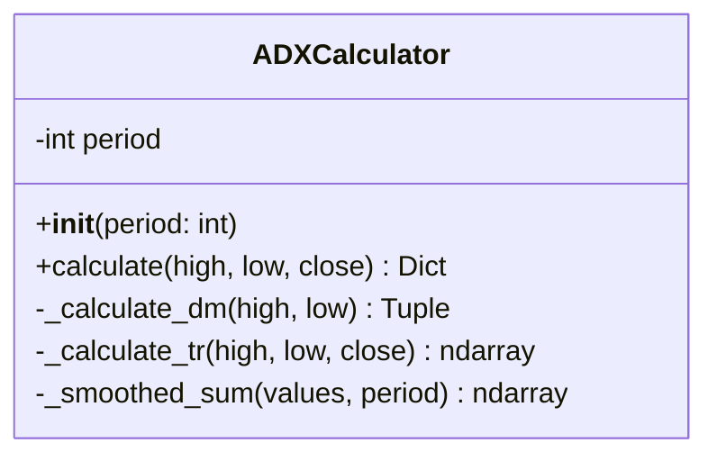
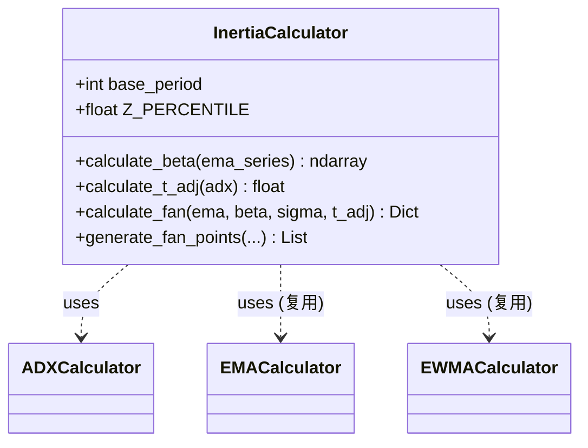
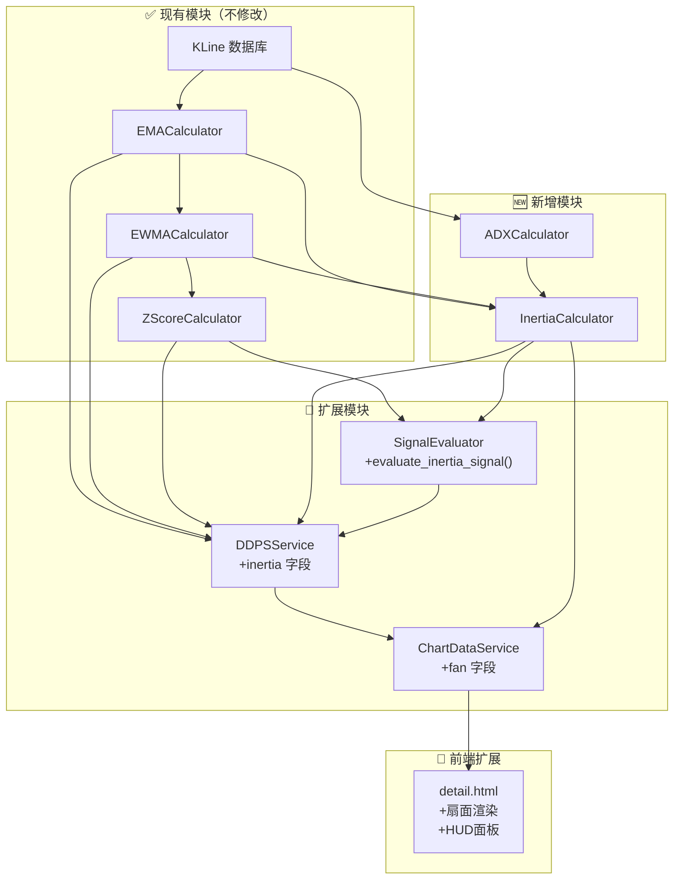
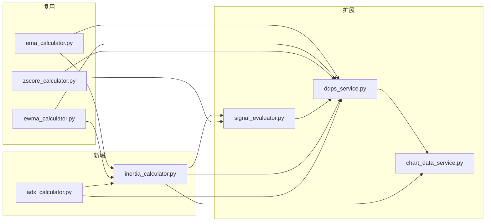

# 架构设计: DDPS-Z 惯性预测扇面系统

**迭代编号**: 010
**文档版本**: 1.0
**创建日期**: 2026-01-05
**状态**: P4 架构设计

---

## 1. 增量更新原则

> **核心约束**: 本迭代严格遵循增量更新原则，仅新增文件和扩展接口，不修改现有计算逻辑。

| 类型 | 操作 | 说明 |
|------|------|------|
| ✅ 复用 | 直接调用 | EMA、EWMA、ZScore 计算器 |
| 🆕 新增 | 创建新文件 | ADX、Inertia 计算器 |
| 📝 扩展 | 向后兼容扩展 | Signal、Service、API、前端 |

---

## 2. 系统架构概览

### 2.1 现有架构（保持不变）

```
┌─────────────────────────────────────────────────────────────────┐
│                         ddps_z 模块                              │
├─────────────────────────────────────────────────────────────────┤
│  calculators/                                                    │
│  ├── ema_calculator.py        ← ✅ 复用：EMA + 偏离率计算         │
│  ├── ewma_calculator.py       ← ✅ 复用：EWMA μ/σ 计算           │
│  ├── zscore_calculator.py     ← ✅ 复用：Z-Score + 分位计算       │
│  └── signal_evaluator.py      ← 📝 扩展：新增 inertia 信号评估    │
├─────────────────────────────────────────────────────────────────┤
│  services/                                                       │
│  ├── ddps_service.py          ← 📝 扩展：新增 inertia 字段       │
│  └── chart_data_service.py    ← 📝 扩展：新增 fan 数据格式化     │
├─────────────────────────────────────────────────────────────────┤
│  api_views.py                 ← 📝 扩展：API 响应新增字段         │
│  templates/ddps_z/detail.html ← 📝 扩展：叠加扇面 + HUD           │
└─────────────────────────────────────────────────────────────────┘
```

### 2.2 增量扩展架构

```
┌─────────────────────────────────────────────────────────────────┐
│                    新增模块 (🆕 New Files)                        │
├─────────────────────────────────────────────────────────────────┤
│  calculators/                                                    │
│  ├── adx_calculator.py        ← 🆕 14周期 ADX 计算               │
│  └── inertia_calculator.py    ← 🆕 β/T_adj/扇面公式计算          │
└─────────────────────────────────────────────────────────────────┘
```

---

## 3. 模块详细设计

### 3.1 ADX 计算器 (🆕 新增)

**文件**: `ddps_z/calculators/adx_calculator.py`

**职责**: 计算 14 周期 Average Directional Index (ADX)

**计算公式**:
```
+DM = High[t] - High[t-1]  (若为正且 > -DM，否则为 0)
-DM = Low[t-1] - Low[t]    (若为正且 > +DM，否则为 0)
TR = max(High - Low, |High - Close[t-1]|, |Low - Close[t-1]|)

+DI = 100 × EMA(+DM, 14) / EMA(TR, 14)
-DI = 100 × EMA(-DM, 14) / EMA(TR, 14)
DX = 100 × |+DI - -DI| / (+DI + -DI)
ADX = EMA(DX, 14)
```

**接口设计**:
```python
class ADXCalculator:
    def __init__(self, period: int = 14):
        self.period = period

    def calculate(
        self,
        high: np.ndarray,
        low: np.ndarray,
        close: np.ndarray
    ) -> Dict[str, Any]:
        """
        计算 ADX 指标

        Returns:
            {
                'plus_di': np.ndarray,   # +DI 序列
                'minus_di': np.ndarray,  # -DI 序列
                'adx': np.ndarray,       # ADX 序列
                'current_adx': float,    # 当前 ADX 值
            }
        """
```

**类图**:


---

### 3.2 惯性计算器 (🆕 新增)

**文件**: `ddps_z/calculators/inertia_calculator.py`

**职责**: 计算趋势斜率 β、动态惯性周期 T_adj、扇面边界

**计算公式**:
```
β = EMA25[t] - EMA25[t-1]
T_adj = T × (1 + ADX/100), 范围 [5, 10]

预测中轴: Ê(t+T) = EMA25_t + (β × T)
上边界:   Upper(t+T) = Ê(t+T) + (1.645 × σ_t × √T)
下边界:   Lower(t+T) = Ê(t+T) + (-1.645 × σ_t × √T)
```

**接口设计**:
```python
class InertiaCalculator:
    DEFAULT_T = 5
    T_MIN = 5
    T_MAX = 10
    Z_PERCENTILE = 1.645  # 95% 分位

    def __init__(self, base_period: int = 5):
        self.base_period = base_period

    def calculate_beta(
        self,
        ema_series: np.ndarray
    ) -> np.ndarray:
        """计算趋势斜率 β 序列"""

    def calculate_t_adj(
        self,
        adx: float
    ) -> float:
        """计算动态惯性周期 T_adj"""

    def calculate_fan(
        self,
        current_ema: float,
        beta: float,
        sigma: float,
        t_adj: float
    ) -> Dict[str, Any]:
        """
        计算扇面边界

        Returns:
            {
                'mid': float,      # 预测中轴
                'upper': float,    # 上边界
                'lower': float,    # 下边界
                't_adj': float,    # 动态周期
            }
        """

    def generate_fan_points(
        self,
        current_ema: float,
        beta: float,
        sigma: float,
        t_adj: float,
        current_time: float,
        interval_seconds: int
    ) -> List[Dict[str, Any]]:
        """
        生成扇面点序列（向未来延伸）

        Returns:
            [
                {'t': timestamp_ms, 'mid': float, 'upper': float, 'lower': float},
                ...
            ]
        """
```

**类图**:


---

### 3.3 信号评估器扩展 (📝 扩展)

**文件**: `ddps_z/calculators/signal_evaluator.py`

**扩展内容**: 新增 `InertiaSignal` 数据类和 `evaluate_inertia_signal()` 方法

**新增接口**:
```python
class InertiaState(Enum):
    """惯性状态枚举"""
    PROTECTED = 'protected'      # 惯性保护中
    DECAYING = 'decaying'        # 惯性衰减
    SIGNAL_TRIGGERED = 'signal'  # 信号触发

@dataclass
class InertiaSignal:
    """惯性信号数据类"""
    signal_type: SignalType      # 复用现有枚举
    state: InertiaState
    space_triggered: bool        # 空间准则触发
    time_triggered: bool         # 时间准则触发
    adx: float
    beta: float
    t_adj: float
    fan_upper: float
    fan_lower: float
    description: str

class SignalEvaluator:
    # ... 现有方法保持不变 ...

    def evaluate_inertia_signal(
        self,
        current_price: float,
        zscore: float,
        percentile: float,
        fan_upper: float,
        fan_lower: float,
        adx: float,
        beta: float,
        t_adj: float
    ) -> InertiaSignal:
        """
        评估惯性双重阈值信号

        空间准则: Z-Score 是否突破 5%/95% 分位带
        时间准则: 价格是否突破动态扇面边界
        """
```

---

### 3.4 DDPS 服务扩展 (📝 扩展)

**文件**: `ddps_z/services/ddps_service.py`

**扩展内容**: 在 `calculate()` 返回中新增 `inertia` 字段

**响应结构扩展**:
```python
{
    # ✅ 现有字段保持不变
    'symbol': str,
    'interval': str,
    'market_type': str,
    'success': bool,
    'error': str | None,
    'data': {
        'current_price': float,
        'current_ema': float,
        'current_deviation': float,
        'zscore': float,
        'percentile': float,
        'zone': str,
        'zone_label': str,
        'rvol': float | None,
        'signal': dict,
        'kline_count': int,

        # 🆕 新增 inertia 字段
        'inertia': {
            'adx': float,
            'beta': float,
            't_adj': float,
            'fan': {
                'mid': float,
                'upper': float,
                'lower': float,
            },
            'state': str,           # 'protected' | 'decaying' | 'signal'
            'state_label': str,     # 中文标签
            'inertia_signal': {
                'signal_type': str,
                'space_triggered': bool,
                'time_triggered': bool,
                'description': str,
            }
        } | None
    }
}
```

---

### 3.5 图表数据服务扩展 (📝 扩展)

**文件**: `ddps_z/services/chart_data_service.py`

**扩展内容**: 在 `get_chart_data()` 返回中新增 `fan` 字段

**响应结构扩展**:
```python
{
    # ✅ 现有字段保持不变
    'symbol': str,
    'interval': str,
    'success': bool,
    'chart': {
        'candles': [...],
        'ema': [...],
        'bands': {...},
        'zscore': [...],
        'current': {...},

        # 🆕 新增 fan 字段
        'fan': {
            'direction': 'up' | 'down',  # β 正负决定
            'points': [
                {
                    't': int,        # 未来时间戳（毫秒）
                    'mid': float,    # 预测中轴
                    'upper': float,  # 上边界
                    'lower': float,  # 下边界
                },
                # ... 共 T_adj 个点
            ]
        } | None
    },
    'meta': {...}
}
```

---

## 4. 数据流图



---

## 5. 前端扩展设计

### 5.1 扇面渲染

使用 TradingView Lightweight Charts 的 `AreaSeries` 和 `LineSeries` 叠加绘制：

```javascript
// 扇面填充区域（叠加在现有图表上）
const fanAreaSeries = chart.addSeries(LightweightCharts.AreaSeries, {
    topColor: 'rgba(40, 167, 69, 0.2)',      // 上涨惯性时
    bottomColor: 'rgba(40, 167, 69, 0.05)',
    lineColor: 'rgba(40, 167, 69, 0.5)',
    lineWidth: 1,
    lineStyle: LightweightCharts.LineStyle.Dashed,
});

// 扇面边界线
const fanUpperSeries = chart.addSeries(LightweightCharts.LineSeries, {
    color: 'rgba(40, 167, 69, 0.7)',
    lineWidth: 1,
    lineStyle: LightweightCharts.LineStyle.Dashed,
});

const fanLowerSeries = chart.addSeries(LightweightCharts.LineSeries, {
    color: 'rgba(40, 167, 69, 0.7)',
    lineWidth: 1,
    lineStyle: LightweightCharts.LineStyle.Dashed,
});

// 预测中轴线
const fanMidSeries = chart.addSeries(LightweightCharts.LineSeries, {
    color: 'rgba(40, 167, 69, 1)',
    lineWidth: 2,
    lineStyle: LightweightCharts.LineStyle.Solid,
});
```

### 5.2 HUD 信息面板

```html
<!-- 🆕 新增 HUD 面板，叠加在图表右上角 -->
<div class="inertia-hud" id="inertia-hud">
    <div class="hud-section">
        <div class="hud-title">静态阈值 (Static)</div>
        <div class="hud-row">
            <span>P95:</span>
            <span id="hud-p95">-</span>
        </div>
        <div class="hud-row">
            <span>P5:</span>
            <span id="hud-p5">-</span>
        </div>
    </div>
    <div class="hud-section">
        <div class="hud-title">惯性预测 (T+<span id="hud-t-adj">5</span>)</div>
        <div class="hud-row">
            <span>Upper:</span>
            <span id="hud-fan-upper">-</span>
        </div>
        <div class="hud-row">
            <span>Mid:</span>
            <span id="hud-fan-mid">-</span>
        </div>
        <div class="hud-row">
            <span>Lower:</span>
            <span id="hud-fan-lower">-</span>
        </div>
    </div>
    <div class="hud-section">
        <div class="hud-status">
            <span class="status-badge" id="hud-state-badge">-</span>
        </div>
        <div class="hud-row">
            <span>ADX:</span>
            <span id="hud-adx">-</span>
        </div>
        <div class="hud-row">
            <span>β:</span>
            <span id="hud-beta">-</span>
        </div>
    </div>
</div>
```

### 5.3 扇面颜色切换逻辑

```javascript
function updateFanColor(beta) {
    if (beta > 0) {
        // 上涨惯性 - 绿色
        fanAreaSeries.applyOptions({
            topColor: 'rgba(40, 167, 69, 0.2)',
            bottomColor: 'rgba(40, 167, 69, 0.05)',
            lineColor: 'rgba(40, 167, 69, 0.5)',
        });
    } else {
        // 下跌惯性 - 红色
        fanAreaSeries.applyOptions({
            topColor: 'rgba(220, 53, 69, 0.2)',
            bottomColor: 'rgba(220, 53, 69, 0.05)',
            lineColor: 'rgba(220, 53, 69, 0.5)',
        });
    }
}
```

---

## 6. 文件变更清单

| 文件 | 操作 | 变更内容 |
|------|------|----------|
| `calculators/adx_calculator.py` | 🆕 新建 | ADX 计算器实现 |
| `calculators/inertia_calculator.py` | 🆕 新建 | 惯性计算器实现 |
| `calculators/signal_evaluator.py` | 📝 扩展 | 新增 `InertiaState`、`InertiaSignal`、`evaluate_inertia_signal()` |
| `services/ddps_service.py` | 📝 扩展 | `calculate()` 返回新增 `inertia` 字段 |
| `services/chart_data_service.py` | 📝 扩展 | `get_chart_data()` 返回新增 `fan` 字段 |
| `api_views.py` | ✅ 无修改 | API 自动透传新字段 |
| `templates/ddps_z/detail.html` | 📝 扩展 | 叠加扇面渲染 + HUD 面板 |

---

## 7. 依赖关系图



---

## 8. 性能考虑

### 8.1 计算复杂度

| 计算器 | 时间复杂度 | 空间复杂度 |
|--------|-----------|-----------|
| ADX | O(n) | O(n) |
| Inertia | O(1) | O(T_adj) |
| 扇面点生成 | O(T_adj) | O(T_adj) |

### 8.2 性能目标

| 指标 | 目标值 | 测量方法 |
|------|--------|----------|
| 单币种计算延迟 | < 100ms | 包含 ADX + Inertia + 信号评估 |
| 扇面渲染帧率 | ≥ 30 FPS | 浏览器 DevTools Performance |
| 页面加载时间 | < 1s | 含扇面数据加载 |

### 8.3 优化策略

1. **ADX 缓存**: 同一交易对/周期的 ADX 序列可复用
2. **增量计算**: 仅计算最新 K 线的 ADX/β
3. **延迟加载**: 扇面数据仅在详情页按需计算

---

## 9. 测试策略

### 9.1 单元测试

| 测试文件 | 测试内容 |
|----------|----------|
| `test_adx_calculator.py` | ADX 计算准确性（与 TradingView 对比） |
| `test_inertia_calculator.py` | β、T_adj、扇面公式计算 |
| `test_signal_evaluator_inertia.py` | 双重阈值信号触发逻辑 |

### 9.2 集成测试

| 测试场景 | 验证点 |
|----------|--------|
| 现有功能回归 | EMA、Z-Score、静态概率带不受影响 |
| 新增字段验证 | API 响应包含 `inertia` 和 `fan` |
| 前端渲染 | 扇面正确叠加在 K 线图上 |

---

## 10. 回滚方案

由于采用增量扩展策略，回滚方案简单：

1. **后端**: 注释掉 `ddps_service.py` 中的惯性计算调用
2. **前端**: 删除扇面渲染和 HUD 相关代码
3. **API**: 响应自动不包含 `inertia` 和 `fan` 字段

无需修改数据库，无需回滚迁移。

---

## 11. 验收检查清单

### 现有功能回归 (✅ 必须全部通过)

- [ ] EMA 计算结果正确
- [ ] EWMA μ/σ 计算结果正确
- [ ] Z-Score 和分位带计算正确
- [ ] 静态概率带渲染正常
- [ ] 现有 API 响应格式不变

### 新增功能验收 (🆕)

- [ ] ADX 计算结果与 TradingView 偏差 < 1%
- [ ] T_adj 在 [5, 10] 范围内正确计算
- [ ] 扇面公式计算正确
- [ ] 双重阈值信号触发逻辑正确
- [ ] API 响应包含完整 `inertia` 和 `fan` 数据
- [ ] 前端正确渲染扇面填充区域
- [ ] HUD 面板正确显示所有指标
- [ ] 状态徽章正确切换颜色
