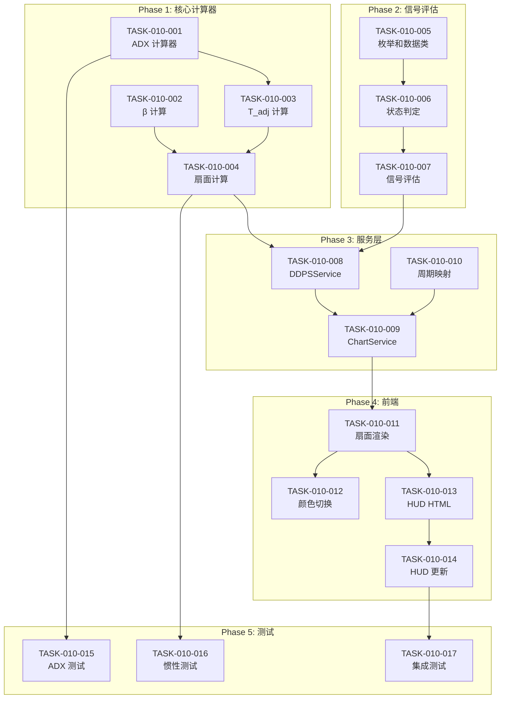

# 任务计划: DDPS-Z 惯性预测扇面系统

**迭代编号**: 010
**文档版本**: 1.0
**创建日期**: 2026-01-05
**状态**: P5 开发规划

---

## 任务概览

| 阶段 | 任务数 | 预计工作量 |
|------|--------|-----------|
| Phase 1: 核心计算器 | 4 | 中 |
| Phase 2: 信号评估扩展 | 3 | 中 |
| Phase 3: 服务层扩展 | 3 | 中 |
| Phase 4: 前端可视化 | 4 | 中 |
| Phase 5: 测试与验收 | 3 | 轻 |
| **总计** | **17** | - |

---

## Phase 1: 核心计算器（🆕 新增文件）

### TASK-010-001: ADX 计算器实现

**文件**: `ddps_z/calculators/adx_calculator.py`

**描述**: 实现 14 周期 ADX (Average Directional Index) 指标计算器

**功能点**: FP-010-001, FP-010-002, FP-010-003

**实现要点**:
```python
class ADXCalculator:
    def __init__(self, period: int = 14):
        self.period = period

    def calculate(self, high: np.ndarray, low: np.ndarray, close: np.ndarray) -> Dict:
        """
        计算 ADX 指标

        步骤:
        1. 计算 +DM 和 -DM
        2. 计算 True Range (TR)
        3. 计算平滑后的 +DI 和 -DI
        4. 计算 DX 和 ADX

        Returns:
            {
                'plus_di': np.ndarray,
                'minus_di': np.ndarray,
                'adx': np.ndarray,
                'current_adx': float | None
            }
        """
```

**验收标准**:
- [ ] ADX 计算结果与 TradingView 偏差 < 1%
- [ ] 数据不足时返回 None
- [ ] 包含完整的单元测试

**依赖**: 无

---

### TASK-010-002: 惯性计算器 - β 计算

**文件**: `ddps_z/calculators/inertia_calculator.py`

**描述**: 实现趋势斜率 β 的计算逻辑

**功能点**: FP-010-004

**实现要点**:
```python
class InertiaCalculator:
    DEFAULT_T = 5
    T_MIN = 5
    T_MAX = 10
    Z_PERCENTILE = 1.645

    def calculate_beta(self, ema_series: np.ndarray) -> np.ndarray:
        """
        计算趋势斜率 β 序列

        公式: β[t] = EMA[t] - EMA[t-1]

        Returns:
            β 序列，第一个值为 NaN
        """
```

**验收标准**:
- [ ] β 计算公式正确
- [ ] 处理边界情况（EMA 为 None）
- [ ] 包含单元测试

**依赖**: ✅ 复用 `ema_calculator.py`

---

### TASK-010-003: 惯性计算器 - T_adj 计算

**文件**: `ddps_z/calculators/inertia_calculator.py`

**描述**: 实现动态惯性周期 T_adj 的计算逻辑

**功能点**: FP-010-005

**实现要点**:
```python
def calculate_t_adj(self, adx: float) -> float:
    """
    计算动态惯性周期 T_adj

    公式: T_adj = T × (1 + ADX/100)
    范围: [5, 10]

    Args:
        adx: 当前 ADX 值

    Returns:
        动态惯性周期（整数或浮点）
    """
    if adx is None:
        return self.DEFAULT_T

    t_adj = self.DEFAULT_T * (1 + adx / 100)
    return max(self.T_MIN, min(self.T_MAX, t_adj))
```

**验收标准**:
- [ ] T_adj 在 [5, 10] 范围内
- [ ] ADX 为 None 时返回默认值 5
- [ ] 包含边界值测试

**依赖**: TASK-010-001

---

### TASK-010-004: 惯性计算器 - 扇面计算

**文件**: `ddps_z/calculators/inertia_calculator.py`

**描述**: 实现扇面边界计算和点序列生成

**功能点**: FP-010-006, FP-010-007, FP-010-008

**实现要点**:
```python
def calculate_fan(
    self,
    current_ema: float,
    beta: float,
    sigma: float,
    t_adj: float
) -> Dict[str, float]:
    """
    计算扇面边界（T_adj 周期后的预测值）

    公式:
        mid = EMA + (β × T_adj)
        upper = mid + (1.645 × σ × √T_adj)
        lower = mid - (1.645 × σ × √T_adj)
    """

def generate_fan_points(
    self,
    current_ema: float,
    beta: float,
    sigma: float,
    t_adj: float,
    current_time: float,
    interval_seconds: int
) -> List[Dict]:
    """
    生成扇面点序列（向未来延伸）

    Returns:
        [
            {'t': timestamp_ms, 'mid': float, 'upper': float, 'lower': float},
            ... (共 int(t_adj) 个点)
        ]
    """
```

**验收标准**:
- [ ] 扇面公式计算正确
- [ ] 点序列时间戳正确递增
- [ ] σ 为 0 时边界与中轴重合
- [ ] 包含数值精度测试

**依赖**: TASK-010-002, TASK-010-003, ✅ 复用 `ewma_calculator.py`

---

## Phase 2: 信号评估扩展（📝 扩展现有）

### TASK-010-005: 惯性状态枚举和数据类

**文件**: `ddps_z/calculators/signal_evaluator.py`

**描述**: 新增 `InertiaState` 枚举和 `InertiaSignal` 数据类

**功能点**: FP-010-012, FP-010-015

**实现要点**:
```python
class InertiaState(Enum):
    """惯性状态枚举"""
    PROTECTED = 'protected'      # 惯性保护中
    DECAYING = 'decaying'        # 惯性衰减
    SIGNAL_TRIGGERED = 'signal'  # 信号触发

@dataclass
class InertiaSignal:
    """惯性信号数据类"""
    signal_type: SignalType
    state: InertiaState
    space_triggered: bool
    time_triggered: bool
    adx: float
    beta: float
    t_adj: float
    fan_upper: float
    fan_lower: float
    description: str
```

**验收标准**:
- [ ] 枚举值正确定义
- [ ] 数据类可序列化为 dict
- [ ] 不影响现有 Signal 类

**依赖**: 无

---

### TASK-010-006: 惯性状态判定逻辑

**文件**: `ddps_z/calculators/signal_evaluator.py`

**描述**: 实现惯性状态判定方法

**功能点**: FP-010-013, FP-010-014

**实现要点**:
```python
def _determine_inertia_state(
    self,
    current_price: float,
    fan_upper: float,
    fan_lower: float,
    space_triggered: bool,
    time_triggered: bool
) -> InertiaState:
    """
    判定惯性状态

    规则:
    - 信号触发: 空间+时间准则同时满足
    - 惯性衰减: 价格距扇面边界 < 0.5%
    - 惯性保护中: 其他情况
    """
    DECAY_THRESHOLD = 0.005  # 0.5%

    if space_triggered and time_triggered:
        return InertiaState.SIGNAL_TRIGGERED

    # 判断是否接近边界
    upper_distance = abs(current_price - fan_upper) / fan_upper
    lower_distance = abs(current_price - fan_lower) / fan_lower

    if min(upper_distance, lower_distance) < DECAY_THRESHOLD:
        return InertiaState.DECAYING

    return InertiaState.PROTECTED
```

**验收标准**:
- [ ] 三种状态正确判定
- [ ] 0.5% 阈值可配置
- [ ] 包含边界情况测试

**依赖**: TASK-010-005

---

### TASK-010-007: 双重阈值信号评估方法

**文件**: `ddps_z/calculators/signal_evaluator.py`

**描述**: 实现 `evaluate_inertia_signal()` 方法

**功能点**: FP-010-009, FP-010-010, FP-010-011

**实现要点**:
```python
def evaluate_inertia_signal(
    self,
    current_price: float,
    zscore: float,
    percentile: float,
    fan_upper: float,
    fan_lower: float,
    adx: float,
    beta: float,
    t_adj: float
) -> InertiaSignal:
    """
    评估惯性双重阈值信号

    卖出信号 (空间+时间):
        - 空间准则: Z-Score ≥ 1.645 (95%分位)
        - 时间准则: current_price > fan_upper

    买入信号 (空间+时间):
        - 空间准��: Z-Score ≤ -1.645 (5%分位)
        - 时间准则: current_price < fan_lower
    """
```

**验收标准**:
- [ ] 双重阈值逻辑正确
- [ ] 信号类型正确判定
- [ ] 状态标签正确生成
- [ ] 不影响现有 `evaluate()` 方法

**依赖**: TASK-010-005, TASK-010-006

---

## Phase 3: 服务层扩展（📝 扩展现有）

### TASK-010-008: DDPSService 惯性计算集成

**文件**: `ddps_z/services/ddps_service.py`

**描述**: 在 `calculate()` 方法中集成惯性计算，新增 `inertia` 字段

**功能点**: FP-010-016

**实现要点**:
```python
def calculate(self, symbol: str, interval: str = None, market_type: str = 'futures') -> Dict:
    # ... 现有计算逻辑保持不变 ...

    # 🆕 新增惯性计算
    inertia_data = None
    try:
        # 获取 high/low/close 用于 ADX 计算
        high = np.array([float(k.high_price) for k in klines])
        low = np.array([float(k.low_price) for k in klines])

        # ADX 计算
        adx_result = self.adx_calc.calculate(high, low, prices)
        current_adx = adx_result['current_adx']

        if current_adx is not None:
            # β 计算
            beta_series = self.inertia_calc.calculate_beta(ema_series)
            current_beta = beta_series[-1] if not np.isnan(beta_series[-1]) else None

            if current_beta is not None:
                # T_adj 和扇面计算
                t_adj = self.inertia_calc.calculate_t_adj(current_adx)
                fan = self.inertia_calc.calculate_fan(
                    current_ema, current_beta, ewma_result['current_std'], t_adj
                )

                # 惯性信号评估
                inertia_signal = self.signal_eval.evaluate_inertia_signal(
                    prices[-1], zscore_result['current_zscore'],
                    zscore_result['current_percentile'],
                    fan['upper'], fan['lower'],
                    current_adx, current_beta, t_adj
                )

                inertia_data = {
                    'adx': current_adx,
                    'beta': current_beta,
                    't_adj': t_adj,
                    'fan': fan,
                    'state': inertia_signal.state.value,
                    'state_label': self._get_state_label(inertia_signal.state),
                    'inertia_signal': {...}
                }
    except Exception as e:
        logger.warning(f'惯性计算失败: {e}')

    return {
        # ✅ 现有字段保持不变
        ...,
        # 🆕 新增 inertia 字段
        'data': {
            ...,
            'inertia': inertia_data
        }
    }
```

**验收标准**:
- [ ] 现有 API 响应格式不变
- [ ] 新增 `inertia` 字段正确填充
- [ ] 惯性计算失败时 `inertia` 为 None
- [ ] 不影响现有功能

**依赖**: TASK-010-001 ~ TASK-010-007

---

### TASK-010-009: ChartDataService 扇面数据集成

**文件**: `ddps_z/services/chart_data_service.py`

**描述**: 在 `get_chart_data()` 方法中新增 `fan` 字段

**功能点**: FP-010-017

**实现要点**:
```python
def get_chart_data(self, symbol: str, ...) -> Dict:
    # ... 现有逻辑保持不变 ...

    # 🆕 新增扇面数据
    fan_data = None
    try:
        # 获取当前 DDPS 计算结果
        current_result = self.ddps_service.calculate(symbol, interval, market_type)

        if current_result['success'] and current_result['data'].get('inertia'):
            inertia = current_result['data']['inertia']

            # 生成扇面点序列
            fan_points = self.inertia_calc.generate_fan_points(
                current_ema=current_result['data']['current_ema'],
                beta=inertia['beta'],
                sigma=current_result['data']['ewma_std'],
                t_adj=inertia['t_adj'],
                current_time=series['timestamps'][-1],
                interval_seconds=self._get_interval_seconds(interval)
            )

            fan_data = {
                'direction': 'up' if inertia['beta'] > 0 else 'down',
                'points': fan_points
            }
    except Exception as e:
        logger.warning(f'扇面数据生成失败: {e}')

    return {
        ...,
        'chart': {
            # ✅ 现有字段保持不变
            'candles': [...],
            'ema': [...],
            'bands': {...},
            'zscore': [...],
            'current': {...},
            # 🆕 新增 fan 字段
            'fan': fan_data
        }
    }
```

**验收标准**:
- [ ] 现有图表数据格式不变
- [ ] 新增 `fan` 字段正确填充
- [ ] `direction` 根据 β 正负正确设置
- [ ] 扇面点时间戳向未来递增

**依赖**: TASK-010-008

---

### TASK-010-010: 周期秒数映射辅助方法

**文件**: `ddps_z/services/chart_data_service.py`

**描述**: 新增 `_get_interval_seconds()` 辅助方法

**实现要点**:
```python
def _get_interval_seconds(self, interval: str) -> int:
    """
    获取 K 线周期对应的秒数

    Args:
        interval: K 线周期 ('1h', '4h', '1d')

    Returns:
        秒数
    """
    INTERVAL_SECONDS = {
        '1m': 60,
        '5m': 300,
        '15m': 900,
        '30m': 1800,
        '1h': 3600,
        '4h': 14400,
        '1d': 86400,
    }
    return INTERVAL_SECONDS.get(interval, 14400)  # 默认 4h
```

**验收标准**:
- [ ] 常用周期正确映射
- [ ] 未知周期返回默认值

**依赖**: 无

---

## Phase 4: 前端可视化（📝 扩展现有）

### TASK-010-011: 扇面渲染 - Series 创建

**文件**: `ddps_z/templates/ddps_z/detail.html`

**描述**: 创建扇面相关的 Lightweight Charts Series

**功能点**: FP-010-018, FP-010-019

**实现要点**:
```javascript
// 在 DDPSDetail 对象中新增
state: {
    // ... 现有 state ...
    fanUpperSeries: null,
    fanMidSeries: null,
    fanLowerSeries: null,
},

// 在 renderKlineChart 方法中新增
renderFanSeries: function(chart, fanData) {
    if (!fanData || !fanData.points || fanData.points.length === 0) {
        return;
    }

    const isUpTrend = fanData.direction === 'up';
    const color = isUpTrend ? 'rgba(40, 167, 69, 0.7)' : 'rgba(220, 53, 69, 0.7)';
    const fillColor = isUpTrend ? 'rgba(40, 167, 69, 0.15)' : 'rgba(220, 53, 69, 0.15)';

    // 上边界线
    this.state.fanUpperSeries = chart.addSeries(LightweightCharts.LineSeries, {
        color: color,
        lineWidth: 1,
        lineStyle: LightweightCharts.LineStyle.Dashed,
        priceLineVisible: false,
        lastValueVisible: false,
    });

    // 中轴线
    this.state.fanMidSeries = chart.addSeries(LightweightCharts.LineSeries, {
        color: color,
        lineWidth: 2,
        lineStyle: LightweightCharts.LineStyle.Solid,
        priceLineVisible: false,
        lastValueVisible: true,
    });

    // 下边界线
    this.state.fanLowerSeries = chart.addSeries(LightweightCharts.LineSeries, {
        color: color,
        lineWidth: 1,
        lineStyle: LightweightCharts.LineStyle.Dashed,
        priceLineVisible: false,
        lastValueVisible: false,
    });

    // 设置数据
    const upperData = fanData.points.map(p => ({ time: p.t / 1000, value: p.upper }));
    const midData = fanData.points.map(p => ({ time: p.t / 1000, value: p.mid }));
    const lowerData = fanData.points.map(p => ({ time: p.t / 1000, value: p.lower }));

    this.state.fanUpperSeries.setData(upperData);
    this.state.fanMidSeries.setData(midData);
    this.state.fanLowerSeries.setData(lowerData);
}
```

**验收标准**:
- [ ] 扇面正确叠加在 K 线图上
- [ ] 扇面向未来延伸
- [ ] 边界线为虚线，中轴线为实线
- [ ] 不影响现有图表渲染

**依赖**: TASK-010-009

---

### TASK-010-012: 扇面颜色动态切换

**文件**: `ddps_z/templates/ddps_z/detail.html`

**描述**: 根据 β 正负切换扇面颜色

**功能点**: FP-010-020

**实现要点**:
```javascript
updateFanColor: function(direction) {
    if (!this.state.fanUpperSeries) return;

    const isUpTrend = direction === 'up';
    const color = isUpTrend ? 'rgba(40, 167, 69, 0.7)' : 'rgba(220, 53, 69, 0.7)';

    this.state.fanUpperSeries.applyOptions({ color: color });
    this.state.fanMidSeries.applyOptions({ color: color });
    this.state.fanLowerSeries.applyOptions({ color: color });
}
```

**验收标准**:
- [ ] 上涨趋势显示绿色
- [ ] 下跌趋势显示红色
- [ ] 颜色切换平滑

**依赖**: TASK-010-011

---

### TASK-010-013: HUD 信息面板

**文件**: `ddps_z/templates/ddps_z/detail.html`

**描述**: 新增惯性指标 HUD 面板

**功能点**: FP-010-021, FP-010-022

**实现要点**:
```html
<!-- 在 K 线图卡片内新增 HUD 面板 -->
<div class="inertia-hud" id="inertia-hud" style="display: none;">
    <div class="hud-section">
        <div class="hud-title">静态阈值</div>
        <div class="hud-row">
            <span>P95:</span>
            <span id="hud-p95">-</span>
        </div>
        <div class="hud-row">
            <span>P5:</span>
            <span id="hud-p5">-</span>
        </div>
    </div>
    <div class="hud-section">
        <div class="hud-title">惯性预测 (T+<span id="hud-t-adj">5</span>)</div>
        <div class="hud-row">
            <span>Upper:</span>
            <span id="hud-fan-upper">-</span>
        </div>
        <div class="hud-row">
            <span>Mid:</span>
            <span id="hud-fan-mid">-</span>
        </div>
        <div class="hud-row">
            <span>Lower:</span>
            <span id="hud-fan-lower">-</span>
        </div>
    </div>
    <div class="hud-section">
        <div class="hud-row">
            <span>状态:</span>
            <span class="status-badge" id="hud-state-badge">-</span>
        </div>
        <div class="hud-row">
            <span>ADX:</span>
            <span id="hud-adx">-</span>
        </div>
        <div class="hud-row">
            <span>β:</span>
            <span id="hud-beta">-</span>
        </div>
    </div>
</div>

<style>
.inertia-hud {
    position: absolute;
    top: 60px;
    right: 20px;
    background: rgba(255, 255, 255, 0.95);
    border: 1px solid #dee2e6;
    border-radius: 8px;
    padding: 12px;
    font-size: 0.85rem;
    z-index: 10;
    min-width: 180px;
}
.hud-section {
    margin-bottom: 10px;
    padding-bottom: 8px;
    border-bottom: 1px solid #eee;
}
.hud-section:last-child {
    margin-bottom: 0;
    padding-bottom: 0;
    border-bottom: none;
}
.hud-title {
    font-weight: bold;
    color: #495057;
    margin-bottom: 5px;
}
.hud-row {
    display: flex;
    justify-content: space-between;
    margin: 3px 0;
}
.status-badge {
    padding: 2px 8px;
    border-radius: 4px;
    font-size: 0.8rem;
}
.status-protected { background: #d4edda; color: #155724; }
.status-decaying { background: #fff3cd; color: #856404; }
.status-signal { background: #f8d7da; color: #721c24; }
</style>
```

**验收标准**:
- [ ] HUD 面板正确显示在图表右上角
- [ ] 所有指标正确更新
- [ ] 状态徽章颜色正确切换
- [ ] 面板样式美观

**依赖**: TASK-010-011

---

### TASK-010-014: HUD 数据更新逻辑

**文件**: `ddps_z/templates/ddps_z/detail.html`

**描述**: 实现 HUD 面板数据更新方法

**实现要点**:
```javascript
updateHUD: function(current) {
    const hud = document.getElementById('inertia-hud');

    if (!current || !current.inertia) {
        hud.style.display = 'none';
        return;
    }

    hud.style.display = 'block';
    const inertia = current.inertia;

    // 更新静态阈值
    // 根据 current 中的 percentile 和 zone 计算 P95/P5

    // 更新惯性预测
    document.getElementById('hud-t-adj').textContent = inertia.t_adj.toFixed(1);
    document.getElementById('hud-fan-upper').textContent = this.formatPrice(inertia.fan.upper);
    document.getElementById('hud-fan-mid').textContent = this.formatPrice(inertia.fan.mid);
    document.getElementById('hud-fan-lower').textContent = this.formatPrice(inertia.fan.lower);

    // 更新状态
    const badge = document.getElementById('hud-state-badge');
    badge.textContent = inertia.state_label;
    badge.className = 'status-badge status-' + inertia.state;

    // 更新 ADX 和 β
    document.getElementById('hud-adx').textContent = inertia.adx.toFixed(1);
    document.getElementById('hud-beta').textContent = (inertia.beta * 100).toFixed(3) + '%';
}
```

**验收标准**:
- [ ] 数据更新正确
- [ ] 无惯性数据时隐藏面板
- [ ] 状态徽章颜色正确

**依赖**: TASK-010-013

---

## Phase 5: 测试与验收

### TASK-010-015: ADX 计算器单元测试

**文件**: `ddps_z/tests/test_adx_calculator.py`

**描述**: ADX 计算器的单元测试

**测试用例**:
1. 正常数据计算
2. 数据不足时返回 None
3. 与 TradingView 对比验证
4. 边界值测试

**依赖**: TASK-010-001

---

### TASK-010-016: 惯性计算器单元测试

**文件**: `ddps_z/tests/test_inertia_calculator.py`

**描述**: 惯性计算器的单元测试

**测试用例**:
1. β 计算准确性
2. T_adj 范围验证 [5, 10]
3. 扇面公式计算
4. 点序列时间戳验证

**依赖**: TASK-010-002 ~ TASK-010-004

---

### TASK-010-017: 集成测试与回归验证

**文件**: `ddps_z/tests/test_integration_inertia.py`

**描述**: 端到端集成测试和现有功能回归测试

**测试用例**:
1. API 响应包含 `inertia` 和 `fan` 字段
2. 现有 DDPS 功能正常（回归）
3. 前端渲染正确（手动验证）

**验收标准**:
- [ ] 所有现有测试通过
- [ ] 新增测试覆盖核心逻辑
- [ ] 手动验证前端渲染

**依赖**: TASK-010-008 ~ TASK-010-014

---

## 依赖关系图



---

## 验收检查清单

### 现有功能回归（必须通过）

- [ ] EMA 计算正确
- [ ] EWMA μ/σ 计算正确
- [ ] Z-Score 和分位带正确
- [ ] 静态概率带渲染正常
- [ ] 现有 API 响应格式不变

### 新增功能验收

- [ ] ADX 计算与 TradingView 偏差 < 1%
- [ ] T_adj 在 [5, 10] 范围内
- [ ] 扇面公式计算正确
- [ ] 双重阈值信号逻辑正确
- [ ] API 响应包含 `inertia` 和 `fan`
- [ ] 扇面正确渲染在 K 线图上
- [ ] HUD 面板正确显示
- [ ] 状态徽章颜色正确

---

## 任务执行顺序

```
Day 1: Phase 1 (TASK-010-001 ~ 004)
Day 2: Phase 2 (TASK-010-005 ~ 007)
Day 3: Phase 3 (TASK-010-008 ~ 010)
Day 4: Phase 4 (TASK-010-011 ~ 014)
Day 5: Phase 5 (TASK-010-015 ~ 017)
```

**总计**: 17 个任务，预计 5 个开发日
