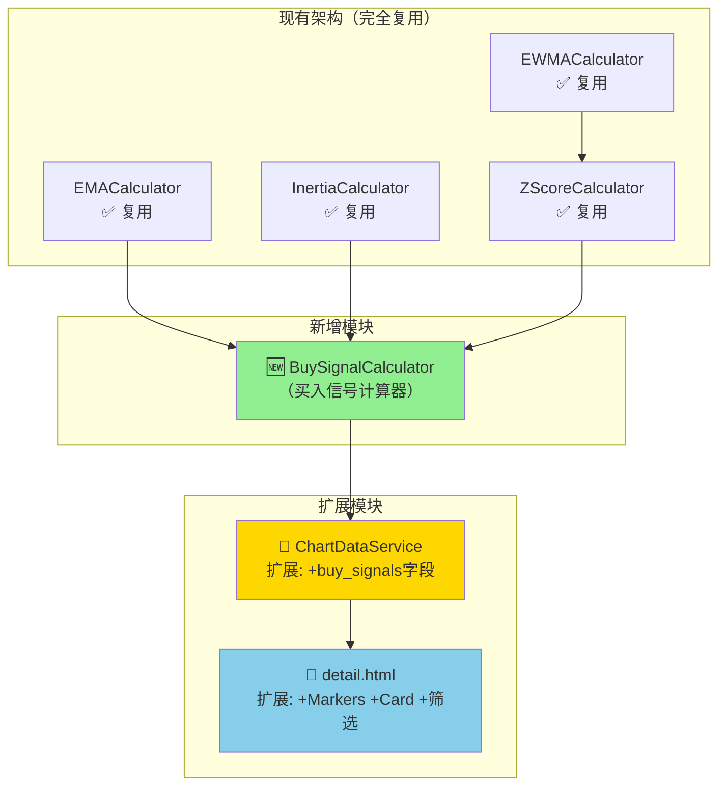
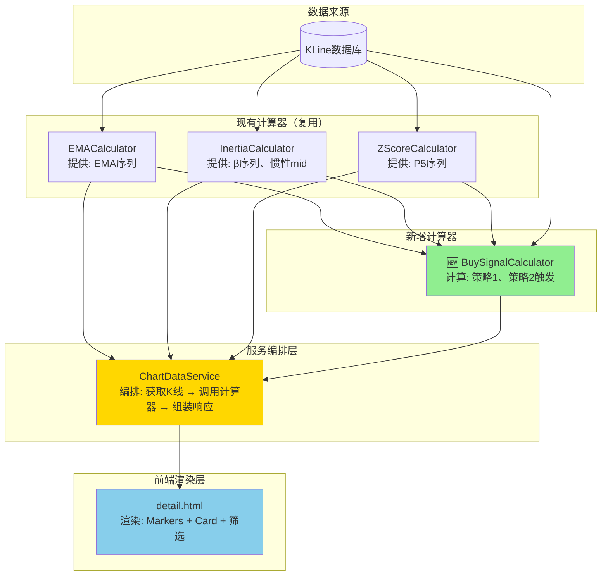

# 架构设计: K线图买入点标记系统

**迭代编号**: 011
**分支**: 011-buy-signal-markers
**文档版本**: v1.0.0
**创建日期**: 2026-01-06
**生命周期阶段**: P4 - 架构设计

---

## ⚠️ 增量更新声明

**本迭代是增量更新，遵循以下原则：**

| 原则 | 说明 |
|------|------|
| **完全兼容** | 现有 DDPS-Z 所有功能保持不变（EMA、概率带、惯性预测、Z-Score信号） |
| **功能叠加** | 买入点标记是**新增**功能，作为独立的策略验证工具 |
| **复用优先** | 充分复用现有计算能力（P5、惯性mid、EMA、β等） |
| **UI 扩展** | 前端新增买入点标记和悬浮Card，不修改现有图表元素 |

---

## 1. 需求概述

### 1.1 核心业务目标

为DDPS-Z系统添加买入点标记功能，帮助用户**验证买入策略的有效性**，通过历史回测快速识别策略触发频率和准确性。

### 1.2 关键功能点（P0级别）

**买入策略计算引擎**：
- [P0] F1.1 策略1计算器：EMA斜率未来预测
  - 触发条件：K线low < P5 且 未来6周期EMA预测价格 > 当前close
  - 买入价格：K线close
- [P0] F1.2 策略2计算器：惯性下跌中值突破
  - 前置条件：β < 0（下跌趋势）
  - 触发条件：惯性mid < P5 且 K线low < (惯性mid + P5)/2
  - 买入价格：K线close
- [P0] F1.3 买入信号数据结构：策略数组结构，支持多策略并存

**可视化与交互**：
- [P0] F2.1 时间轴买入点标记：LightweightCharts Markers API，绿色向上箭头
- [P0] F2.2 Hover悬浮Card：显示触发时间、买入价格、所有触发策略及原因
- [P0] F2.3 点击固定Card：点击买入点标记固定显示Card
- [P0] F2.4 策略筛选控件：Bootstrap按钮组（全部/策略1/策略2）

**历史回溯与性能**：
- [P0] F3.1 历史买入点显示：与图表数据范围一致，支持动态加载
- [P0] F3.2 性能优化机制：后端计算、批量渲染、增量加载

**后端API**：
- [P0] F4.1 后端API扩展：在`/ddps-z/api/chart/`响应中新增`buy_signals`字段

### 1.3 关键用户流程

1. 用户打开DDPS-Z详情页，查看K线图
2. 系统自动计算并标记历史买入点（绿色向上箭头）
3. 用户悬停在买入点标记上，查看详细触发信息
4. 用户点击买入点标记，固定显示Card
5. 用户使用筛选控件切换不同策略的买入点显示

---

## 2. 核心技术选型

### 2.1 后端技术栈

| 技术 | 版本 | 用途 |
|------|------|------|
| Python | 3.x | 核心编程语言 |
| Django | 4.x | Web框架 |
| Django REST Framework | 3.x | API框架 |
| NumPy | 1.x | **买入信号向量化计算** |

**选型理由**：
- ✅ 与现有DDPS-Z系统完全一致，零学习成本
- ✅ NumPy向量化计算性能优异（处理5000根K线<50ms）
- ✅ 可直接复用EMA、Inertia、ZScore计算器

### 2.2 前端技术栈

| 技术 | 版本 | 用途 |
|------|------|------|
| LightweightCharts | 4.x | **买入点Markers渲染** |
| Bootstrap | 5.x | **UI组件（Card、按钮组）** |
| Vanilla JavaScript | ES6+ | 前端逻辑 |

**选型理由**：
- ✅ LightweightCharts原生支持Markers API，性能最优（500个标记<100ms）
- ✅ Bootstrap Card组件开箱即用，样式统一
- ✅ Crosshair和Click事件原生支持，实现简单

### 2.3 新增依赖

✅ **无需引入任何新依赖**，完全复用现有技术栈

---

## 3. 核心架构设计

### 3.1 系统架构图



### 3.2 架构说明

#### 3.2.1 现有架构（完全复用）

| 计算器 | 提供能力 | 本迭代用途 |
|--------|---------|-----------|
| **EMACalculator** | EMA序列计算 | 策略1: 计算β斜率和未来EMA预测 |
| **InertiaCalculator** | β序列、惯性mid | 策略1: 获取β<br/>策略2: 判断下跌趋势+获取惯性mid |
| **ZScoreCalculator** | P5/P95静态阈值 | 策略1和策略2: 获取P5价格阈值 |
| **EWMACalculator** | EWMA μ/σ计算 | 通过ZScoreCalculator间接使用（P5计算） |

#### 3.2.2 新增模块

**BuySignalCalculator（买入信号计算器）**：
- **文件路径**：`ddps_z/calculators/buy_signal_calculator.py`
- **服务层级**：Atomic（原子级服务）
- **唯一职责**：实现策略1和策略2的触发逻辑，返回买入信号数组

**接口契约**：
```python
class BuySignalCalculator:
    def calculate(
        self,
        klines: List[Dict],      # K线OHLC数据
        ema_series: np.ndarray,  # EMA序列
        p5_series: np.ndarray,   # P5价格序列
        beta_series: np.ndarray, # β斜率序列
        inertia_mid_series: np.ndarray  # 惯性mid序列
    ) -> List[Dict]:
        """
        计算买入信号

        Returns:
            [
                {
                    'timestamp': int,          # 毫秒时间戳
                    'kline_index': int,        # K线索引
                    'strategies': [
                        {
                            'id': 'strategy_1',
                            'name': 'EMA斜率未来预测',
                            'triggered': bool,
                            'reason': str,
                            'details': {
                                'current_low': float,
                                'p5': float,
                                'future_ema': float,
                                'current_close': float,
                                'beta': float
                            }
                        },
                        {
                            'id': 'strategy_2',
                            'name': '惯性下跌中值突破',
                            'triggered': bool,
                            'reason': str,
                            'details': {
                                'beta': float,
                                'inertia_mid': float,
                                'p5': float,
                                'mid_line': float,
                                'current_low': float
                            }
                        }
                    ],
                    'buy_price': float         # 买入价格（K线close）
                },
                ...
            ]
        """
```

**核心计算逻辑**：

**策略1: EMA斜率未来预测**
```python
# 1. 计算β斜率
β = ema_series[t] - ema_series[t-1]

# 2. 预测未来6周期EMA
future_ema = ema_series[t] + (β × 6)

# 3. 判断触发
if (kline['low'] < p5_series[t]) and (future_ema > kline['close']):
    triggered = True
    buy_price = kline['close']
```

**策略2: 惯性下跌中值突破**
```python
# 1. 判断下跌趋势
if beta_series[t] < 0:
    # 2. 计算中值线
    mid_line = (inertia_mid_series[t] + p5_series[t]) / 2

    # 3. 判断触发
    if (inertia_mid_series[t] < p5_series[t]) and (kline['low'] < mid_line):
        triggered = True
        buy_price = kline['close']
```

**异常边界**：
- `ERR_DATA_INSUFFICIENT`: 当EMA或P5序列长度不足时触发
- `ERR_INVALID_BETA`: 当β序列包含NaN或Inf时触发
- `ERR_INVALID_KLINE`: 当K线数据缺少必要字段时触发

**测试重点**：
- [ ] 正常场景：策略1正确触发（low < P5 且 未来EMA > close）
- [ ] 边界场景：策略2在β=0时不触发
- [ ] 异常场景：数据不足时抛出ERR_DATA_INSUFFICIENT

**映射需求**：对应PRD [P0] 买入策略计算引擎模块

**业务支撑**：
- 支撑流程1: 历史买入点标记
- 支撑流程2: Hover/Click悬浮Card
- 支撑流程3: 策略筛选功能

#### 3.2.3 扩展模块

**ChartDataService扩展**：
- **扩展位置**：`get_chart_data()` 方法的返回值`chart`对象
- **扩展方式**：新增 `buy_signals` 字段（与 `fan` 字段并列）
- **参考模式**：`_generate_fan_data()` 方法（line 634-818）的设计模式

**扩展接口**：
```python
def get_chart_data(self, symbol, interval, range, ...):
    # ... 现有逻辑保持不变 ...

    # 🆕 生成买入信号数据
    buy_signals_data = self._generate_buy_signals_data(
        klines=klines,
        ema_series=ema_result['ema'],
        p5_series=p5_series,
        beta_series=beta_series,
        inertia_mid_series=inertia_mid_series
    )

    return {
        'success': True,
        'chart': {
            'candles': klines,
            'ema': ema_data,
            'bands': bands,
            'zscore': zscore_data,
            'fan': fan_data,
            'buy_signals': buy_signals_data  # 🆕 新增字段
        },
        'meta': {...}
    }
```

**detail.html前端扩展**：
- **扩展1：买入点标记渲染**
  ```javascript
  const markers = buySignals.map(signal => ({
      time: signal.timestamp / 1000,
      position: 'belowBar',
      color: '#28a745',
      shape: 'arrowUp',
      text: 'B',
      size: 1
  }));
  candleSeries.setMarkers(markers);
  ```

- **扩展2：Hover悬浮Card**
  ```javascript
  chart.subscribeCrosshairMove((param) => {
      const buySignal = findBuySignalByTime(param.time);
      if (buySignal) {
          showCard(buySignal, param.point);
      }
  });
  ```

- **扩展3：Click固定Card**
  ```javascript
  chart.subscribeClick((param) => {
      if (isBuySignalMarker(param)) {
          showFixedCard(buySignal);
      } else {
          hideFixedCard();
      }
  });
  ```

- **扩展4：策略筛选控件**
  ```html
  <div class="btn-group" role="group">
      <button class="btn btn-outline-success btn-sm active" data-filter="all">全部</button>
      <button class="btn btn-outline-success btn-sm" data-filter="strategy_1">策略1</button>
      <button class="btn btn-outline-success btn-sm" data-filter="strategy_2">策略2</button>
  </div>
  ```

### 3.3 底层原子服务定义 (Critical Foundation)

⚠️ **注意**: 此部分定义的组件是系统的基石，任何变更必须经过严格的回归测试。

#### [Core-Atomic] BuySignalCalculator - 核心原子服务

**服务层级**: Atomic

**职责**:
负责计算买入策略的触发信号，不涉及数据获取和API响应组装

**接口契约**:
- **Input**:
  - klines (List[Dict], K线OHLC数据，必须包含open_time、high、low、close字段)
  - ema_series (np.ndarray, EMA序列，长度必须与klines一致)
  - p5_series (np.ndarray, P5价格序列，长度必须与klines一致)
  - beta_series (np.ndarray, β斜率序列，长度必须与klines一致)
  - inertia_mid_series (np.ndarray, 惯性mid序列，长度必须与klines一致)

- **Output**:
  - signals (List[Dict]: 买入信号数组)
    - timestamp (int: 毫秒时间戳)
    - kline_index (int: K线索引)
    - strategies (List[Dict]: 策略触发信息数组)
    - buy_price (float: 买入价格)

- **异常**:
  - ERR_DATA_INSUFFICIENT: 当输入序列长度不足或不一致时触发
  - ERR_INVALID_BETA: 当β序列包含NaN或Inf时触发
  - ERR_INVALID_KLINE: 当K线数据缺少必要字段时触发

**核心保障策略**:
数据一致性检查（所有输入序列长度必须一致）、NaN值显式处理、边界条件验证

**测试重点**:
必须通过策略1和策略2的正确触发测试、边界条件测试（β=0、P5=0、数据不足）、异常测试

**映射需求**:
对应PRD [P0] 买入策略计算引擎模块

**业务支撑**:
- 支撑流程1: 历史买入点标记
- 支撑流程2: Hover/Click悬浮Card
- 支撑流程3: 策略筛选功能
- [标记为**Core-Atomic**：支撑>3个业务流]

### 3.4 组件与需求映射

| 组件 | 负责功能点 | 优先级 |
|------|-----------|-------|
| **BuySignalCalculator** | F1.1 策略1计算器<br/>F1.2 策略2计算器<br/>F1.3 买入信号数据结构 | P0 |
| **ChartDataService扩展** | F4.1 后端API扩展 | P0 |
| **detail.html Markers** | F2.1 时间轴买入点标记 | P0 |
| **detail.html Card** | F2.2 Hover悬浮Card<br/>F2.3 点击固定Card | P0 |
| **detail.html 筛选** | F2.4 策略筛选控件 | P0 |
| **ChartDataService动态加载** | F3.1 历史买入点显示<br/>F3.2 性能优化机制 | P0 |

---

## 4. 变更点说明

### 4.1 变更概述

基于PRD中的功能需求分析，当前架构需要进行以下主要变更：
- **新增买入信号计算能力**：创建独立的BuySignalCalculator原子服务
- **扩展API响应结构**：在ChartDataService的chart响应中新增buy_signals字段
- **扩展前端可视化**：在detail.html中新增Markers渲染、Card显示、筛选控件

### 4.2 架构变更对比

#### 当前架构（现状）

```
ddps_z/
├── calculators/
│   ├── ema_calculator.py        ✅ 复用
│   ├── inertia_calculator.py    ✅ 复用
│   ├── zscore_calculator.py     ✅ 复用
│   └── ewma_calculator.py       ✅ 复用
├── services/
│   ├── ddps_service.py          ✅ 不修改
│   └── chart_data_service.py    ✅ 现有功能
└── templates/ddps_z/
    └── detail.html              ✅ 现有功能
```

#### 目标架构（变更后）

```
ddps_z/
├── calculators/
│   ├── ema_calculator.py        ✅ 复用
│   ├── inertia_calculator.py    ✅ 复用
│   ├── zscore_calculator.py     ✅ 复用
│   ├── ewma_calculator.py       ✅ 复用
│   └── buy_signal_calculator.py 🆕 新增
├── services/
│   ├── ddps_service.py          ✅ 不修改
│   └── chart_data_service.py    📝 扩展（+buy_signals字段）
└── templates/ddps_z/
    └── detail.html              📝 扩展（+Markers +Card +筛选）
```

### 4.3 具体变更点清单

| 变更类型 | 组件/模块 | 变更描述 | 影响范围 | 风险等级 |
|---------|---------|---------|---------|---------|
| NEW | BuySignalCalculator | 新增买入信号计算器，实现策略1和策略2 | 全新模块，无影响现有功能 | 低 |
| MODIFIED | ChartDataService | 在get_chart_data()返回中新增buy_signals字段 | API响应扩展，向后兼容 | 中 |
| MODIFIED | detail.html | 新增Markers渲染、Hover/Click Card、筛选控件 | 前端UI扩展，不影响现有图表 | 低 |

### 4.4 技术影响分析

#### 新增技术栈
无（完全复用现有技术栈）

#### 性能影响
- **改进点**：买入信号计算在后端完成，NumPy向量化计算性能优异（<50ms）
- **风险点**：
  - API响应体积增加：每个买入点约200-300字节，100个买入点约20-30KB（可接受）
  - 前端标记渲染：LightweightCharts Markers API性能优异（500个标记<100ms）

#### 依赖变更
- **新增依赖**：无
- **升级依赖**：无

### 4.5 风险评估

| 风险类别 | 风险等级 | 说明 |
|---------|---------|------|
| **Core-Atomic服务变更** | ⚠️ 中 | BuySignalCalculator支撑>3个业务流，需严格测试 |
| **API响应扩展** | ⚡ 低 | 向后兼容，现有字段完全不变 |
| **前端UI扩展** | ✅ 低 | 新增元素，不修改现有图表 |

**核心保障策略**：
- 所有Core-Atomic服务必须通过并发计算测试（多交易对并行）
- 数据一致性保障：所有输入序列长度必须一致
- 异常场景下的防御性设计：显式抛出异常，不静默失败

---

## 5. 数据流图



**数据流说明**：
1. **数据获取阶段**：ChartDataService从KLine数据库获取K线数据
2. **计算阶段**：
   - EMACalculator计算EMA序列
   - InertiaCalculator计算β序列和惯性mid
   - ZScoreCalculator计算P5序列
   - **BuySignalCalculator接收上述序列，计算买入信号**
3. **响应组装阶段**：ChartDataService组装完整的chart响应，包含buy_signals字段
4. **前端渲染阶段**：detail.html解析buy_signals数据，渲染Markers、Card、筛选控件

---

## 6. API设计

### 6.1 API响应扩展

**路径**: `GET /ddps-z/api/chart/`

**请求参数**（完全不变）:
- symbol: 交易对（如BTCUSDT）
- interval: K线周期（如4h）
- range: 时间范围（如3m）
- market_type: 市场类型（futures/spot）

**响应结构扩展**:
```json
{
  "success": true,
  "chart": {
    // ✅ 现有字段保持不变
    "candles": [...],
    "ema": [...],
    "bands": {...},
    "zscore": [...],
    "fan": {...},

    // 🆕 新增 buy_signals 字段
    "buy_signals": [
      {
        "timestamp": 1736078400000,
        "kline_index": 123,
        "strategies": [
          {
            "id": "strategy_1",
            "name": "EMA斜率未来预测",
            "triggered": true,
            "reason": "价格跌破P5 ($48,234)，但未来6周期EMA预测 ($50,456) 高于当前收盘价",
            "details": {
              "current_low": 48000.0,
              "p5": 48234.0,
              "future_ema": 50456.0,
              "current_close": 49876.54,
              "beta": 0.0012
            }
          },
          {
            "id": "strategy_2",
            "name": "惯性下跌中值突破",
            "triggered": false
          }
        ],
        "buy_price": 49876.54
      }
    ]
  },
  "meta": {...}
}
```

---

## 7. 关键技术决策

### 决策点1: 买入信号计算位置（后端 vs 前端）

- **选定方案**: 后端计算
- **决策日期**: 2026-01-06
- **理由**:
  - 计算逻辑集中管理，易于测试和维护
  - NumPy向量化计算性能优异（处理5000根K线<50ms）
  - 前端只负责渲染，逻辑简单
  - 安全性高（策略逻辑不暴露给前端）
- **风险与缓解措施**:
  - 风险：API响应体积增加
  - 缓解：每个买入点约200-300字节，可接受
- **后续影响**: 前端代码复杂度大幅降低，易于维护

### 决策点2: 策略1的未来EMA预测方法

- **选定方案**: 简单线性外推
- **决策日期**: 2026-01-06
- **公式**: `未来EMA = EMA[t] + (β × 6)`
- **理由**:
  - 实现极其简单，一行代码
  - 计算速度快
  - 易于理解和调试
  - 与现有惯性预测公式一致（保持架构一致性）
- **风险与缓解措施**:
  - 风险：假设β保持恒定，可能不够精确
  - 缓解：加密货币市场随机性高，复杂预测不一定更准确
- **后续影响**: 如需优化，可在不修改接口的情况下调整预测算法

### 决策点3: 多策略并存时的数据结构

- **选定方案**: 策略数组结构
- **决策日期**: 2026-01-06
- **结构**: 每个买入点包含strategies数组，每个策略有独立的triggered状态
- **理由**:
  - 支持多策略并存，扩展性强
  - 每个策略可独立显示触发状态和原因
  - 为未来策略3、4预留空间
  - Card中可以列出所有触发策略
- **风险与缓解措施**:
  - 风险：数据结构稍复杂
  - 缓解：前端遍历strategies数组逻辑简单
- **后续影响**: 易于扩展新策略，无需修改数据结构

### 决策点4: 历史回溯数据范围

- **选定方案**: 与图表数据范围一致
- **决策日期**: 2026-01-06
- **理由**:
  - 实现最简单，零额外逻辑
  - 自动支持时间范围选择器（1周/1月/3月等）
  - 自动支持动态加载（滚动到更早时间自动加载）
  - 性能可控（随K线数据范围自动限制）
- **风险与缓解措施**: 无明显风险
- **后续影响**: 用户可以通过时间范围选择器控制数据量

### 决策点5: 筛选功能的实现方式

- **选定方案**: 前端筛选
- **决策日期**: 2026-01-06
- **理由**:
  - 实现最简单
  - 筛选切换无需请求后端，响应即时（<10ms）
  - 用户体验最佳（无加载延迟）
  - API逻辑简单（无需处理筛选参数）
- **风险与缓解措施**:
  - 风险：返回所有策略数据，响应体积稍大
  - 缓解：100个买入点约20-30KB，可接受
- **后续影响**: 筛选状态持久化到localStorage，刷新页面后保持

---

## 8. 扩展性考虑

### 8.1 未来策略扩展

**预留设计**:
- 策略数组结构支持动态扩展（策略3、4、5...）
- 每个策略有独立的id、name、triggered、reason、details字段
- 筛选控件可动态生成按钮（基于strategies数组）

**扩展示例**:
```python
# 未来策略3：MACD金叉买入
{
    'id': 'strategy_3',
    'name': 'MACD金叉买入',
    'triggered': True,
    'reason': 'MACD DIF线上穿DEA线，形成金叉',
    'details': {
        'dif': 120.5,
        'dea': 118.2,
        'histogram': 2.3
    }
}
```

### 8.2 卖出策略扩展

**预留设计**:
- 数据结构可扩展为`buy_signals`和`sell_signals`两个数组
- Marker颜色区分（买入绿色、卖出红色）
- Card样式区分（买入绿色边框、卖出红色边框）

### 8.3 性能优化预留

**后续优化点**:
- 买入信号缓存机制（Redis）
- 前端虚拟滚动（大量标记时）
- WebWorker异步计算（前端筛选）

---

## 9. 非功能需求

### 9.1 性能要求

| 指标 | 目标值 | 验证方法 |
|------|--------|----------|
| 买入信号计算延迟 | < 50ms（增量） | 单元测试 + 性能分析 |
| 标记渲染性能 | 500个标记 < 100ms | 前端性能测试 |
| Card显示延迟 | < 10ms | 前端性能测试 |
| API响应时间增量 | < 50ms | API性能测试 |

### 9.2 安全要求

- ✅ 策略逻辑在后端，不暴露给前端
- ✅ API参数验证（symbol、interval、market_type）
- ✅ 异常处理完整（数据不足、计算失败等）

### 9.3 可靠性要求

- ✅ 数据不足时优雅降级（返回空数组，不抛出异常）
- ✅ 计算异常时记录日志（logger.exception）
- ✅ 前端错误处理（数据格式异常时不渲染标记）

---

## 10. 文件变更清单

| 文件 | 操作 | 变更内容 |
|------|------|----------|
| `ddps_z/calculators/buy_signal_calculator.py` | 🆕 新建 | 买入信号计算器实现 |
| `ddps_z/services/chart_data_service.py` | 📝 扩展 | `get_chart_data()` 返回新增 `buy_signals` 字段 |
| `ddps_z/templates/ddps_z/detail.html` | 📝 扩展 | 新增Markers渲染、Card显示、筛选控件 |
| `ddps_z/calculators/__init__.py` | 📝 扩展 | 导出 `BuySignalCalculator` |

---

## 11. 测试策略

### 11.1 单元测试

| 测试文件 | 测试内容 |
|----------|----------|
| `test_buy_signal_calculator.py` | 策略1和策略2的触发逻辑、边界条件、异常处理 |

**测试用例**:
- [ ] 策略1正常触发：low < P5 且 未来EMA > close
- [ ] 策略1不触发：low >= P5
- [ ] 策略1不触发：未来EMA <= close
- [ ] 策略2正常触发：β < 0 且 惯性mid < P5 且 low < 中值线
- [ ] 策略2不触发：β >= 0（非下跌趋势）
- [ ] 策略2不触发：惯性mid >= P5
- [ ] 策略2不触发：low >= 中值线
- [ ] 数据不足时抛出ERR_DATA_INSUFFICIENT
- [ ] β序列包含NaN时抛出ERR_INVALID_BETA

### 11.2 集成测试

| 测试场景 | 验证点 |
|----------|--------|
| 现有功能回归 | EMA、Z-Score、概率带、惯性扇面不受影响 |
| 新增字段验证 | API响应包含 `buy_signals` |
| 前端渲染 | Markers正确渲染在K线图上 |

---

## 12. 回滚方案

由于采用增量扩展策略，回滚方案简单：

1. **后端**: 注释掉 `chart_data_service.py` 中的买入信号计算调用
2. **前端**: 删除Markers渲染和Card相关代码
3. **API**: 响应自动不包含 `buy_signals` 字段

无需修改数据库，无需回滚迁移。

---

## 13. Gate 4 检查结果

### 检查清单

#### 架构设计完整性
- [x] 架构图清晰表达了系统结构
- [x] 每个组件的职责明确且有需求映射
- [x] 所有关键技术决策已完成并记录
- [x] 架构设计符合PRD要求
- [x] 非功能需求（性能、安全等）已考虑

#### 原子服务契约完整性 ⭐
- [x] 是否已识别所有原子级服务（BuySignalCalculator）
- [x] 是否已区分编排级服务（ChartDataService）
- [x] 每个原子服务是否包含唯一职责描述
- [x] 每个原子服务是否包含完整的Input定义
- [x] 每个原子服务是否包含完整的Output定义
- [x] 每个原子服务是否包含异常边界定义
- [x] 每个原子服务是否包含确定性测试建议
- [x] Core-Atomic服务（支撑>3个业务流）是否已特别标记
- [x] Core-Atomic服务是否已提升测试优先级

#### 变更点说明完整性 ⭐
- [x] 是否有关键概述说明为什么需要变更
- [x] 是否有Mermaid架构变更前后对比图
- [x] 是否有NEW/MODIFIED变更点清单表格
- [x] 是否有技术影响分析(技术栈、性能、依赖)
- [x] 是否有风险等级评估(高/中/低，包含Core-Atomic服务评估)

**Gate 4 检查结果**: ✅ **通过** - 可以进入P5阶段（开发规划）

---

## 14. 下一步行动

1. ✅ **P3技术调研已完成**
2. ✅ **P4架构设计已完成**
3. ⏭️ **进入P5-P6阶段**：使用 `powerby-engineer` skill 进行开发规划和实现

---

**文档版本**: v1.0.0
**生成时间**: 2026-01-06
**状态**: ✅ 已完成（Gate 4通过）
