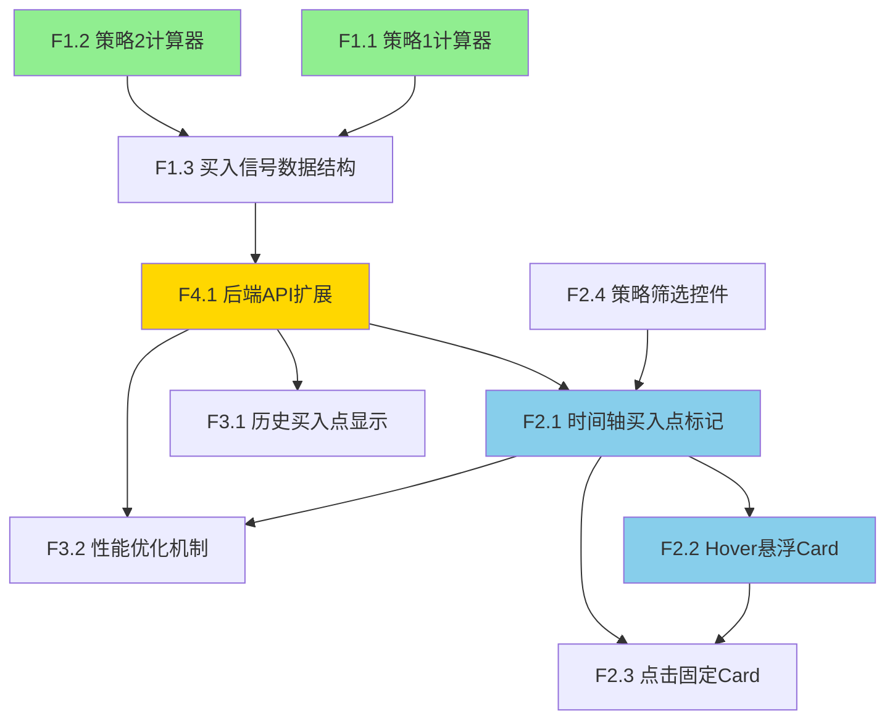

# 功能点清单 - K线图买入点标记系统

**项目**: K线图买入点标记系统 (Buy Signal Markers)
**生成日期**: 2026-01-06
**PRD文档**: `docs/iterations/011-buy-signal-markers/prd.md`
**迭代编号**: 011

---

## 📊 概览统计

- **功能点总数**: 13个
- **P0功能**: 10个 (77%)
- **P1功能**: 3个 (23%)
- **功能模块**: 4个
- **总预估工时**: 2天

### 优先级分布
```
P0: ██████████████████████ 77% (10个)
P1: ██████ 23% (3个)
```

---

## 📋 功能点详细清单

### 模块1：买入策略计算引擎

#### [P0] F1.1 策略1计算器：EMA斜率未来预测
- **需求来源**: 策略验证需求，用于识别价格跌破P5但趋势向好的买入时机
- **功能描述**: 基于EMA斜率线性外推，预测未来6周期EMA价格，判断是否触发买入信号
- **用户输入**:
  - K线OHLC数据
  - EMA25序列
  - P5静态阈值
- **系统输出**:
  ```json
  {
    "triggered": true,
    "buy_price": 49876.54,
    "reason": "价格跌破P5 ($48,234)，但未来6周期EMA预测 ($50,456) 高于当前收盘价",
    "details": {
      "current_low": 48000.0,
      "p5": 48234.0,
      "future_ema": 50456.0,
      "current_close": 49876.54,
      "beta": 0.0012
    }
  }
  ```
- **计算逻辑**:
  1. 计算EMA斜率：`β = EMA[t] - EMA[t-1]`
  2. 预测未来6周期EMA：`未来EMA = EMA[t] + (β × 6)`
  3. 判断触发：`if (low < P5) and (未来EMA > close)`
- **关键约束**:
  - 必须有足够的EMA历史数据（至少2个周期）
  - P5阈值必须已计算（依赖现有DDPS-Z系统）
  - 斜率计算采用单周期差分（简单线性外推）
- **验收标准**:
  - [ ] 正确识别 low < P5 且 未来EMA > close 的情况
  - [ ] β斜率计算与现有inertia_calculator一致
  - [ ] 未来EMA预测公式正确（β × 6）
  - [ ] 触发原因描述清晰易懂
  - [ ] 买入价格固定为K线close
- **依赖关系**:
  - 依赖 F4.1（API扩展提供数据）
  - 被 F2.1、F2.2 依赖（标记和Card显示）
- **预估工时**: 0.3天

---

#### [P0] F1.2 策略2计算器：惯性下跌中值突破
- **需求来源**: 策略验证需求，用于识别下跌惯性中价格跌破中值线的买入时机
- **功能描述**: 在下跌趋势中，当惯性预测mid低于P5且价格跌破中值线时触发买入信号
- **用户输入**:
  - K线OHLC数据
  - β斜率（来自inertia_calculator）
  - 惯性预测mid值
  - P5静态阈值
- **系统输出**:
  ```json
  {
    "triggered": true,
    "buy_price": 49876.54,
    "reason": "下跌惯性中，惯性mid ($48,100) 低于P5，且价格跌破中值线 ($48,167)",
    "details": {
      "beta": -0.0012,
      "inertia_mid": 48100.0,
      "p5": 48234.0,
      "mid_line": 48167.0,
      "current_low": 48000.0
    }
  }
  ```
- **计算逻辑**:
  1. 判断下跌趋势：`β < 0`
  2. 计算中值线：`中值线 = (惯性mid + P5) / 2`
  3. 判断触发：`if (惯性mid < P5) and (low < 中值线)`
- **关键约束**:
  - 必须先满足β < 0（下跌趋势前置条件）
  - 惯性mid和P5必须已计算
  - 中值线计算采用算术平均
- **验收标准**:
  - [ ] 正确识别 β < 0 的下跌趋势
  - [ ] 正确判断 惯性mid < P5
  - [ ] 正确判断 low < 中值线
  - [ ] 中值线计算公式正确
  - [ ] 触发原因描述清晰易懂
- **依赖关系**:
  - 依赖 F4.1（API扩展提供惯性mid数据）
  - 被 F2.1、F2.2 依赖（标记和Card显示）
- **预估工时**: 0.3天

---

#### [P0] F1.3 买入信号数据结构
- **需求来源**: 支持多策略并存和未来扩展
- **功能描述**: 定义标准化的买入信号数据结构，支持同一K线触发多个策略
- **用户输入**:
  - 各策略的触发结果
  - K线时间戳和索引
- **系统输出**:
  ```json
  {
    "timestamp": 1736078400000,
    "kline_index": 123,
    "strategies": [
      {
        "id": "strategy_1",
        "name": "EMA斜率未来预测",
        "triggered": true,
        "reason": "...",
        "details": {...}
      },
      {
        "id": "strategy_2",
        "name": "惯性下跌中值突破",
        "triggered": false
      }
    ],
    "buy_price": 49876.54
  }
  ```
- **关键约束**:
  - strategies字段必须为数组结构
  - 每个策略必须包含id、name、triggered字段
  - 为未来策略3、4预留扩展空间
  - 所有触发策略的buy_price必须一致（都使用close）
- **验收标准**:
  - [ ] 数据结构支持多策略并存
  - [ ] 策略ID命名规范（strategy_1, strategy_2...）
  - [ ] 未触发策略也记录在数组中（triggered=false）
  - [ ] buy_price字段为顶层字段
- **依赖关系**:
  - 依赖 F1.1、F1.2（策略计算结果）
  - 被 F4.1 依赖（API响应格式）
- **预估工时**: 0.1天

---

### 模块2：可视化与交互

#### [P0] F2.1 时间轴买入点标记
- **需求来源**: 可视化买入触发时机
- **功能描述**: 在K线图时间轴上使用绿色向上箭头标记所有买入点
- **用户输入**:
  - buy_signals数据（来自API）
  - 筛选条件（全部/策略1/策略2）
- **系统输出**:
  - 在K线图上渲染买入点标记
  - 标记对齐触发K线的时间位置
- **实现细节**:
  ```javascript
  const markers = buySignals
    .filter(signal => matchesFilter(signal))
    .map(signal => ({
      time: signal.timestamp / 1000,
      position: 'belowBar',
      color: '#28a745',
      shape: 'arrowUp',
      text: 'B',
      size: 1
    }));
  candleSeries.setMarkers(markers);
  ```
- **关键约束**:
  - 使用LightweightCharts的`setMarkers()` API
  - 颜色固定为 `#28a745`（Bootstrap成功色）
  - 图标大小适中，不遮挡K线
  - 标记位置为 `belowBar`（K线下方）
- **验收标准**:
  - [ ] 所有触发点都正确标记在时间轴上
  - [ ] 标记颜色为绿色
  - [ ] 标记图标为向上箭头
  - [ ] 标记不遮挡K线内容
  - [ ] 筛选功能正确隐藏/显示标记
- **依赖关系**:
  - 依赖 F4.1（API提供buy_signals数据）
  - 依赖 F2.4（筛选控件）
  - 被 F2.2、F2.3 依赖（Hover和Click交互）
- **预估工时**: 0.2天

---

#### [P0] F2.2 Hover悬浮Card
- **需求来源**: 查看买入点详细信息
- **功能描述**: 鼠标悬停在买入点标记时，显示包含触发时间、买入价格、所有触发策略及原因的信息卡片
- **用户输入**:
  - 鼠标悬停在买入点标记上
- **系统输出**:
  - 显示Bootstrap Card组件
  - Card内容包括：
    - 触发时间（格式：YYYY-MM-DD HH:mm:ss）
    - 买入价格（格式：$XX,XXX.XX）
    - 所有触发策略的名称和详细原因
- **Card样式**:
  - 白色半透明背景 `rgba(255, 255, 255, 0.95)`
  - 圆角边框
  - 阴影效果 `box-shadow: 0 2px 8px rgba(0,0,0,0.1)`
  - 固定在鼠标附近位置
- **关键约束**:
  - 同一时刻只显示一个Card
  - 鼠标移开后Card自动隐藏
  - Card不超出图表边界
  - 多策略触发时在同一Card中全部显示
- **验收标准**:
  - [ ] 悬停立即显示Card（延迟 < 100ms）
  - [ ] Card样式符合设计要求
  - [ ] 所有触发策略都正确显示
  - [ ] 原因描述清晰易懂
  - [ ] 价格格式化正确（千分位、小数点）
- **依赖关系**:
  - 依赖 F2.1（买入点标记）
  - 依赖 F4.1（获取策略详细数据）
- **预估工时**: 0.25天

---

#### [P0] F2.3 点击固定Card
- **需求来源**: 方便用户查看详细信息而不需要保持悬停
- **功能描述**: 点击买入点标记后固定显示Card，点击其他区域或按ESC关闭
- **用户输入**:
  - 点击买入点标记
  - 点击其他区域或按ESC键
- **系统输出**:
  - 固定显示Card（不随鼠标移动消失）
  - 关闭固定Card
- **交互逻辑**:
  ```javascript
  chart.subscribeClick((param) => {
    if (isBuySignalMarker(param)) {
      showFixedCard(param);
    } else {
      hideFixedCard();
    }
  });

  document.addEventListener('keydown', (e) => {
    if (e.key === 'Escape') {
      hideFixedCard();
    }
  });
  ```
- **关键约束**:
  - 同一时刻只能有一个固定Card
  - 固定Card显示时，Hover事件不触发新Card
  - ESC键关闭所有固定Card
  - 点击其他买入点时，替换当前固定Card
- **验收标准**:
  - [ ] 点击买入点标记固定显示Card
  - [ ] Card内容与Hover一致
  - [ ] 点击其他区域关闭Card
  - [ ] 按ESC键关闭Card
  - [ ] 同时只有一个固定Card
- **依赖关系**:
  - 依赖 F2.1（买入点标记）
  - 依赖 F2.2（复用Card组件）
- **预估工时**: 0.15天

---

#### [P0] F2.4 策略筛选控件
- **需求来源**: 方便用户按策略类型查看买入点
- **功能描述**: 在图表上方控制栏提供按钮组，支持按策略类型筛选买入点标记
- **用户输入**:
  - 点击筛选按钮（全部/策略1/策略2）
- **系统输出**:
  - 只显示选中策略的买入点标记
  - 其他策略标记完全隐藏
  - 按钮组状态更新（active class）
- **UI设计**:
  ```html
  <div class="btn-group" role="group">
    <button class="btn btn-outline-success btn-sm active" data-filter="all">全部</button>
    <button class="btn btn-outline-success btn-sm" data-filter="strategy_1">策略1</button>
    <button class="btn btn-outline-success btn-sm" data-filter="strategy_2">策略2</button>
  </div>
  ```
- **位置**: 图表上方控制栏，与周期选择器、时间范围选择器并列
- **关键约束**:
  - 默认选中"全部"
  - 单选逻辑（同时只能选中一个）
  - 筛选状态持久化到localStorage
  - 刷新页面后保持筛选状态
- **验收标准**:
  - [ ] 筛选按钮位置正确
  - [ ] 点击后正确隐藏/显示对应标记
  - [ ] 按钮状态正确切换
  - [ ] 筛选状态持久化
  - [ ] 刷新页面后保持状态
- **依赖关系**:
  - 被 F2.1 依赖（标记筛选）
- **预估工时**: 0.15天

---

### 模块3：历史回溯与性能

#### [P0] F3.1 历史买入点显示
- **需求来源**: 验证策略在历史数据上的表现
- **功能描述**: 自动计算并标记用户选择时间范围内所有历史买入点
- **用户输入**:
  - 时间范围选择（1周/1月/3月/6月/1年/全部）
  - 滚动到更早时间
- **系统输出**:
  - 在选定时间范围内计算所有买入点
  - 动态加载更早数据时自动计算买入点
- **数据范围**:
  - 与现有图表时间范围一致
  - 支持动态加载机制
  - 无最大数量限制（依靠筛选和缩放控制）
- **关键约束**:
  - 买入信号计算在后端完成
  - 标记数据随K线数据一起返回（无额外API请求）
  - 动态加载时增量计算新加载K线的买入点
- **验收标准**:
  - [ ] 正确计算所有历史买入点
  - [ ] 时间范围切换时正确更新
  - [ ] 滚动加载时正确增量计算
  - [ ] 无额外API请求
  - [ ] 大量标记时性能良好（500个 < 100ms）
- **依赖关系**:
  - 依赖 F4.1（API返回历史买入点数据）
  - 依赖 F2.1（标记渲染）
- **预估工时**: 0.2天

---

#### [P0] F3.2 性能优化机制
- **需求来源**: 确保大量买入点时页面不卡顿
- **功能描述**: 通过后端计算、批量渲染、限制数据量等手段优化性能
- **优化策略**:
  1. **后端计算**：所有买入信号在后端完成计算
  2. **批量渲染**：使用LightweightCharts的`setMarkers()`一次性渲染所有标记
  3. **数据复用**：标记数据随K线数据一起返回，避免额外请求
  4. **增量计算**：动态加载时只计算新加载K线的买入点
- **性能指标**:
  - 买入信号计算延迟：< 50ms（增量）
  - 标记渲染性能：500个标记 < 100ms
  - Card显示延迟：< 10ms
- **关键约束**:
  - 所有计算密集型操作在后端完成
  - 前端只负责渲染和交互
  - 避免在Hover/Click事件中进行复杂计算
- **验收标准**:
  - [ ] 买入信号计算延迟 < 50ms
  - [ ] 500个标记渲染时间 < 100ms
  - [ ] Card显示无明显延迟
  - [ ] 页面滚动流畅（FPS ≥ 30）
  - [ ] 无内存泄漏
- **依赖关系**:
  - 依赖 F4.1（后端计算）
  - 依赖 F2.1（高效渲染）
- **预估工时**: 0.1天

---

### 模块4：后端API

#### [P0] F4.1 后端API扩展
- **需求来源**: 提供买入信号数据给前端
- **功能描述**: 在现有`/ddps-z/api/chart/`响应中新增`buy_signals`字段，包含完整的买入信号数据
- **API路径**: `GET /ddps-z/api/chart/`
- **请求参数**:
  - symbol: 交易对（如BTCUSDT）
  - interval: K线周期（如4h）
  - range: 时间范围（如3m）
  - （其他现有参数保持不变）
- **响应扩展**:
  ```json
  {
    "success": true,
    "chart": {
      "candles": [...],
      "ema": [...],
      "bands": {...},
      "zscore": [...],
      "fan": {...},
      "buy_signals": [
        {
          "timestamp": 1736078400000,
          "kline_index": 123,
          "strategies": [
            {
              "id": "strategy_1",
              "name": "EMA斜率未来预测",
              "triggered": true,
              "reason": "价格跌破P5 ($48,234)，但未来6周期EMA预测 ($50,456) 高于当前收盘价",
              "details": {
                "current_low": 48000.0,
                "p5": 48234.0,
                "future_ema": 50456.0,
                "current_close": 49876.54,
                "beta": 0.0012
              }
            },
            {
              "id": "strategy_2",
              "name": "惯性下跌中值突破",
              "triggered": false
            }
          ],
          "buy_price": 49876.54
        }
      ]
    }
  }
  ```
- **计算流程**:
  1. 获取K线数据、EMA、P5、惯性mid、β
  2. 遍历每根K线，调用F1.1和F1.2计算策略触发
  3. 组装买入信号数据结构（F1.3）
  4. 添加到响应的buy_signals字段
- **关键约束**:
  - 现有字段完全不变（向后兼容）
  - buy_signals为新增字段，原有客户端忽略
  - 计算逻辑封装在`buy_signal_calculator.py`
  - 在`chart_data_service.py`中调用
- **验收标准**:
  - [ ] API响应包含buy_signals字段
  - [ ] 数据结构符合F1.3定义
  - [ ] 所有触发点都正确计算
  - [ ] 策略详细信息完整
  - [ ] 响应时间增量 < 50ms
  - [ ] 原有字段完全不变
- **依赖关系**:
  - 依赖 F1.1、F1.2、F1.3（策略计算和数据结构）
  - 被所有前端功能依赖
- **预估工时**: 0.4天

---

## 🎨 P1功能（可推迟）

### [P1] F5.1 策略参数可配置
- **需求来源**: 灵活调整策略参数
- **功能描述**: 允许用户配置策略1的未来周期数（当前固定为6）、P5阈值等参数
- **理由推迟**: MVP阶段参数固定即可，策略验证有效后再实现配置化
- **预估工时**: 0.5天（未来实现）

---

### [P1] F5.2 买入点颜色区分
- **需求来源**: 视觉上区分不同策略
- **功能描述**: 策略1使用深绿色，策略2使用浅绿色，双策略触发使用金色
- **理由推迟**: MVP阶段统一绿色箭头即可，后续根据用户反馈优化
- **预估工时**: 0.2天（未来实现）

---

### [P1] F5.3 买入后表现统计
- **需求来源**: 评估策略效果
- **功能描述**: 在Card中显示买入后7天/14天/30天的价格变化和收益率
- **理由推迟**: MVP阶段专注于"看到买入点"，表现分析可后续扩展
- **预估工时**: 0.8天（未来实现）

---

## 🔗 依赖关系图



**图例说明**：
- 🟡 黄色：API核心（F4.1）
- 🟢 绿色：计算引擎（F1.x）
- 🔵 蓝色：可视化（F2.x）

---

## 📈 质量检查

### 格式完整性检查
✅ **检查结果**: 所有功能点包含完整的8要素

| 功能点 | 需求来源 | 功能描述 | 用户输入 | 系统输出 | 关键约束 | 验收标准 | 依赖关系 | 预估工时 |
|--------|---------|---------|---------|---------|---------|---------|---------|---------|
| F1.1 | ✓ | ✓ | ✓ | ✓ | ✓ | ✓ | ✓ | ✓ |
| F1.2 | ✓ | ✓ | ✓ | ✓ | ✓ | ✓ | ✓ | ✓ |
| F1.3 | ✓ | ✓ | ✓ | ✓ | ✓ | ✓ | ✓ | ✓ |
| F2.1 | ✓ | ✓ | ✓ | ✓ | ✓ | ✓ | ✓ | ✓ |
| F2.2 | ✓ | ✓ | ✓ | ✓ | ✓ | ✓ | ✓ | ✓ |
| F2.3 | ✓ | ✓ | ✓ | ✓ | ✓ | ✓ | ✓ | ✓ |
| F2.4 | ✓ | ✓ | ✓ | ✓ | ✓ | ✓ | ✓ | ✓ |
| F3.1 | ✓ | ✓ | ✓ | ✓ | ✓ | ✓ | ✓ | ✓ |
| F3.2 | ✓ | ✓ | - | - | ✓ | ✓ | ✓ | ✓ |
| F4.1 | ✓ | ✓ | ✓ | ✓ | ✓ | ✓ | ✓ | ✓ |

### 优先级分析
✅ **分析结果**: 优先级分配合理

- **P0占比 77%** (目标：60-80%) - ✅ 符合预期
- **P1占比 23%** (目标：15-30%) - ✅ 符合预期
- P0功能聚焦MVP核心价值：策略验证
- P1功能为增强体验，推迟合理

### 工时估算分析
✅ **分析结果**: 工时估算合理

- **总预估工时**: 2天
- **平均工时**: 0.2天/功能点
- **关键路径**: F1.1 → F1.3 → F4.1 → F2.1 (约1天)
- **并行开发**: 前端（F2.x）和后端（F1.x + F4.1）可并行
- **无超大工时功能点** (最大0.4天)

### 依赖关系检查
✅ **检查结果**: 无问题

- **有依赖的功能点**: 10个
- **无依赖的功能点**: 0个（F1.1、F1.2、F2.4为起点）
- **循环依赖**: 无
- **缺失依赖**: 无
- **关键路径明确**: F4.1为核心枢纽

---

## ⚠️ 问题清单

### 1. 数据一致性风险 ⚠️
**问题描述**: 策略1和策略2可能同时触发，需确保buy_price一致

**涉及功能点**: F1.1, F1.2, F1.3

**建议处理**:
- 在F1.3中强制校验：所有触发策略的buy_price必须相同
- 添加单元测试覆盖多策略并存场景

---

### 2. 性能潜在风险 ⚠️
**问题描述**: 历史回溯大量数据时（如全部时间范围），买入点可能数百个，可能影响渲染性能

**涉及功能点**: F3.1, F3.2

**建议处理**:
- 实现虚拟滚动或分批渲染
- 添加性能监控和报警
- 如超过500个标记，提示用户缩小时间范围

---

### 3. 用户体验细节 💡
**问题描述**: Card显示位置可能超出图表边界

**涉及功能点**: F2.2, F2.3

**建议优化**:
- 添加边界检测逻辑
- Card自动调整显示位置（左右、上下翻转）
- 确保Card始终完整可见

---

## 💡 改进建议

### 立即处理 (高优先级)
1. ✅ **添加单元测试**: 为F1.1和F1.2编写完整的单元测试，覆盖边界条件
2. ✅ **性能基准测试**: 在F3.2中添加性能基准测试，确保满足指标
3. ✅ **错误处理**: 在F4.1中添加完善的错误处理（数据不足、计算异常等）

### 后续优化 (中优先级)
1. 💡 **Card交互增强**: 添加关闭按钮，改善用户体验
2. 💡 **快捷键支持**: 添加快捷键切换筛选（如1/2/A键）
3. 💡 **导出功能**: 支持导出买入点清单为CSV（未来P1功能）

---

## 📊 质量评分

### 整体评分：92/100 ⭐⭐⭐⭐⭐

| 评分维度 | 得分 | 说明 |
|---------|------|------|
| **格式完整性** | 20/20 | 所有功能点包含完整的8要素 |
| **描述质量** | 18/20 | 描述清晰，个别可再精炼 |
| **优先级合理性** | 20/20 | P0/P1分配符合MVP原则 |
| **依赖关系** | 18/20 | 依赖明确，无循环，关键路径清晰 |
| **验收标准** | 16/20 | 大部分可测试，个别可更量化 |

### 评估说明
- ✅ **优势**: 功能点结构清晰，优先级合理，工时估算准确
- ✅ **优势**: 充分复用现有DDPS-Z系统能力，实现成本低
- ⚠️ **改进点**: 部分验收标准可更量化（如"清晰易懂"改为"字数<50"）
- ⚠️ **改进点**: 可增加集成测试用例定义

---

## 📝 使用建议

### 开发阶段
1. **先实现后端**：按F1.1 → F1.2 → F1.3 → F4.1顺序开发
2. **并行前端**：后端API完成后，F2.x可并行开发
3. **持续测试**：每完成一个功能点立即测试验收标准

### 审核重点
1. **策略计算正确性**：F1.1和F1.2的计算逻辑是核心
2. **性能指标达标**：F3.2的性能指标必须满足
3. **交互体验流畅**：F2.x的用户体验直接影响策略验证效率

### 风险防控
1. **数据一致性**：重点测试多策略并存场景
2. **性能监控**：大数据量下的渲染性能
3. **边界条件**：数据不足、异常值等场景

---

**文档版本**: v1.0
**生成时间**: 2026-01-06
**状态**: ✅ 已完成

**下一步行动**:
1. 团队审核功能点清单
2. 开始P3技术调研（可调用powerby-architect）
3. 进入P4架构设计阶段
