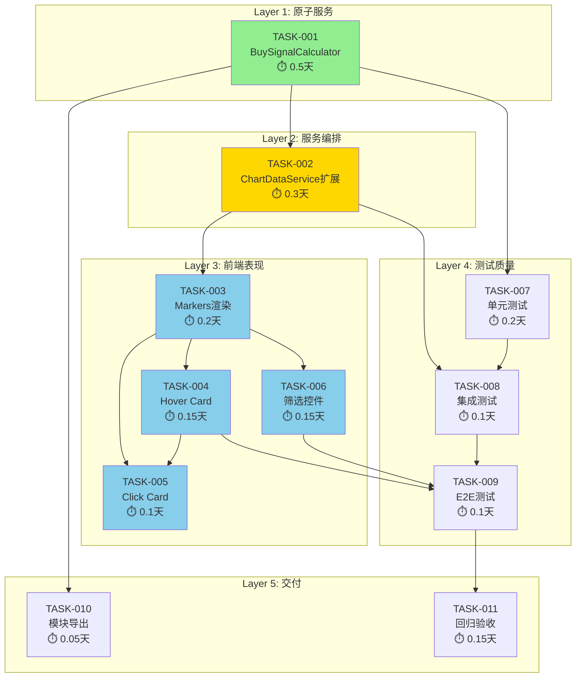

# 开发任务规划 - K线图买入点标记系统

**迭代编号**: 011
**分支**: 011-buy-signal-markers
**文档版本**: v1.0.0
**创建日期**: 2026-01-06
**生命周期阶段**: P5 - 任务规划

---

## 任务概览

| 统计项 | 数值 |
|-------|------|
| 总任务数 | 11 |
| P0任务 | 9 |
| P1任务 | 2 |
| 预估总工时 | 2天 |

### 任务分层

```
┌─────────────────────────────────────────────────────────────┐
│  Layer 1: 原子服务层 (Atomic Services)                        │
│  └─ TASK-001: BuySignalCalculator 核心计算器                  │
├─────────────────────────────────────────────────────────────┤
│  Layer 2: 服务编排层 (Service Orchestration)                  │
│  └─ TASK-002: ChartDataService API扩展                       │
├─────────────────────────────────────────────────────────────┤
│  Layer 3: 前端表现层 (Frontend Presentation)                  │
│  ├─ TASK-003: 买入点Markers渲染                              │
│  ├─ TASK-004: Hover悬浮Card                                  │
│  ├─ TASK-005: Click固定Card                                  │
│  └─ TASK-006: 策略筛选控件                                    │
├─────────────────────────────────────────────────────────────┤
│  Layer 4: 测试与质量 (Testing & Quality)                      │
│  ├─ TASK-007: 单元测试 - BuySignalCalculator                 │
│  ├─ TASK-008: 集成测试 - API响应                              │
│  └─ TASK-009: E2E测试 - 前端交互                              │
├─────────────────────────────────────────────────────────────┤
│  Layer 5: 文档与交付 (Documentation & Delivery)               │
│  ├─ TASK-010: 模块导出配置                                    │
│  └─ TASK-011: 回归测试与验收                                  │
└─────────────────────────────────────────────────────────────┘
```

---

## 依赖关系图



**图例**：
- 🟢 绿色: 原子服务（核心计算）
- 🟡 黄色: 服务编排（API）
- 🔵 蓝色: 前端表现（UI）

---

## 关键路径分析

**关键路径**: TASK-001 → TASK-002 → TASK-003 → TASK-004 → TASK-009 → TASK-011

**关键路径工时**: 0.5 + 0.3 + 0.2 + 0.15 + 0.1 + 0.15 = **1.4天**

**并行开发机会**:
- TASK-007（单元测试）可与 TASK-002 并行
- TASK-006（筛选控件）可与 TASK-004/005 并行

---

## 详细任务清单

### TASK-001: BuySignalCalculator 核心计算器

**优先级**: P0 | **预估工时**: 0.5天 | **状态**: [ ] 待开始

**任务描述**:
创建买入信号计算器，实现策略1（EMA斜率未来预测）和策略2（惯性下跌中值突破）的核心计算逻辑。

**文件变更**:
| 文件 | 操作 | 变更内容 |
|------|------|----------|
| `ddps_z/calculators/buy_signal_calculator.py` | 🆕 新建 | 完整计算器实现 |

**接口契约**:
```python
class BuySignalCalculator:
    """买入信号计算器 - 计算策略1和策略2的触发信号"""

    def calculate(
        self,
        klines: List[Dict],      # K线OHLC数据
        ema_series: np.ndarray,  # EMA序列
        p5_series: np.ndarray,   # P5价格序列
        beta_series: np.ndarray, # β斜率序列
        inertia_mid_series: np.ndarray  # 惯性mid序列
    ) -> List[Dict]:
        """
        计算买入信号

        Returns:
            List[Dict]: 买入信号列表，每个元素包含:
            - timestamp: int (毫秒时间戳)
            - kline_index: int (K线索引)
            - strategies: List[Dict] (策略触发信息)
            - buy_price: float (买入价格)
        """
        pass
```

**核心算法**:

**策略1: EMA斜率未来预测**
```python
# 1. 计算β斜率（单周期差分）
β = ema_series[t] - ema_series[t-1]

# 2. 预测未来6周期EMA
future_ema = ema_series[t] + (β * 6)

# 3. 判断触发
if (kline['low'] < p5_series[t]) and (future_ema > kline['close']):
    triggered = True
    buy_price = kline['close']
```

**策略2: 惯性下跌中值突破**
```python
# 1. 判断下跌趋势
if beta_series[t] < 0:
    # 2. 计算中值线
    mid_line = (inertia_mid_series[t] + p5_series[t]) / 2

    # 3. 判断触发
    if (inertia_mid_series[t] < p5_series[t]) and (kline['low'] < mid_line):
        triggered = True
        buy_price = kline['close']
```

**异常处理**:
- `ERR_DATA_INSUFFICIENT`: 输入序列长度不足或不一致
- `ERR_INVALID_BETA`: β序列包含NaN或Inf
- `ERR_INVALID_KLINE`: K线数据缺少必要字段

**验收标准**:
- [ ] 策略1正确触发：low < P5 且 未来EMA > close
- [ ] 策略1不触发：low >= P5 或 未来EMA <= close
- [ ] 策略2正确触发：β < 0 且 惯性mid < P5 且 low < 中值线
- [ ] 策略2不触发：β >= 0 或 惯性mid >= P5 或 low >= 中值线
- [ ] 数据不足时抛出ERR_DATA_INSUFFICIENT
- [ ] β序列包含NaN时抛出ERR_INVALID_BETA
- [ ] 返回数据结构符合接口契约

**依赖关系**:
- 依赖: 无（起点任务）
- 被依赖: TASK-002, TASK-007, TASK-010

**对应功能点**: F1.1, F1.2, F1.3

---

### TASK-002: ChartDataService API扩展

**优先级**: P0 | **预估工时**: 0.3天 | **状态**: [ ] 待开始

**任务描述**:
扩展ChartDataService的get_chart_data()方法，在返回的chart对象中新增buy_signals字段。

**文件变更**:
| 文件 | 操作 | 变更内容 |
|------|------|----------|
| `ddps_z/services/chart_data_service.py` | 📝 扩展 | 新增 `_generate_buy_signals_data()` 方法，修改 `get_chart_data()` 返回值 |

**实现要点**:

1. **导入BuySignalCalculator**:
```python
from ddps_z.calculators.buy_signal_calculator import BuySignalCalculator
```

2. **初始化计算器**（在 `__init__` 中）:
```python
self.buy_signal_calculator = BuySignalCalculator()
```

3. **新增私有方法**:
```python
def _generate_buy_signals_data(
    self,
    klines: List[Dict],
    ema_series: np.ndarray,
    p5_series: np.ndarray,
    beta_series: np.ndarray,
    inertia_mid_series: np.ndarray
) -> List[Dict]:
    """生成买入信号数据"""
    try:
        return self.buy_signal_calculator.calculate(
            klines=klines,
            ema_series=ema_series,
            p5_series=p5_series,
            beta_series=beta_series,
            inertia_mid_series=inertia_mid_series
        )
    except Exception as e:
        logger.exception(f"买入信号计算失败: {e}")
        return []
```

4. **修改get_chart_data()返回值**:
```python
return {
    'success': True,
    'chart': {
        'candles': klines,
        'ema': ema_data,
        'bands': bands,
        'zscore': zscore_data,
        'fan': fan_data,
        'buy_signals': buy_signals_data  # 🆕 新增字段
    },
    'meta': {...}
}
```

**验收标准**:
- [ ] API响应包含buy_signals字段
- [ ] buy_signals数据结构符合architecture.md定义
- [ ] 现有字段（candles, ema, bands, zscore, fan）完全不变
- [ ] 计算异常时返回空数组，不影响整体响应
- [ ] 响应时间增量 < 50ms

**依赖关系**:
- 依赖: TASK-001
- 被依赖: TASK-003, TASK-008

**对应功能点**: F4.1

---

### TASK-003: 买入点Markers渲染

**优先级**: P0 | **预估工时**: 0.2天 | **状态**: [ ] 待开始

**任务描述**:
在detail.html中使用LightweightCharts的Markers API渲染买入点标记。

**文件变更**:
| 文件 | 操作 | 变更内容 |
|------|------|----------|
| `ddps_z/templates/ddps_z/detail.html` | 📝 扩展 | 新增Markers渲染逻辑 |

**实现要点**:

1. **数据存储**（全局变量）:
```javascript
let buySignalsData = [];  // 原始买入信号数据
let currentFilter = 'all';  // 当前筛选状态
```

2. **Markers渲染函数**:
```javascript
function renderBuySignalMarkers(buySignals, filter = 'all') {
    // 根据筛选条件过滤
    const filteredSignals = buySignals.filter(signal => {
        if (filter === 'all') return true;
        return signal.strategies.some(s => s.id === filter && s.triggered);
    });

    // 转换为LightweightCharts Markers格式
    const markers = filteredSignals.map(signal => ({
        time: signal.timestamp / 1000,  // 毫秒转秒
        position: 'belowBar',
        color: '#28a745',
        shape: 'arrowUp',
        text: 'B',
        size: 1
    }));

    // 应用Markers
    candleSeries.setMarkers(markers);
}
```

3. **在数据加载完成后调用**:
```javascript
// 在fetchChartData成功回调中
buySignalsData = response.chart.buy_signals || [];
renderBuySignalMarkers(buySignalsData, currentFilter);
```

**验收标准**:
- [ ] 所有触发点都正确标记在时间轴上
- [ ] 标记颜色为绿色 #28a745
- [ ] 标记图标为向上箭头
- [ ] 标记位置在K线下方
- [ ] 标记不遮挡K线内容
- [ ] 时间范围切换后正确更新

**依赖关系**:
- 依赖: TASK-002
- 被依赖: TASK-004, TASK-005, TASK-006

**对应功能点**: F2.1, F3.1

---

### TASK-004: Hover悬浮Card

**优先级**: P0 | **预估工时**: 0.15天 | **状态**: [ ] 待开始

**任务描述**:
实现鼠标悬停在买入点标记时显示详细信息Card。

**文件变更**:
| 文件 | 操作 | 变更内容 |
|------|------|----------|
| `ddps_z/templates/ddps_z/detail.html` | 📝 扩展 | 新增Hover Card HTML和JS逻辑 |

**实现要点**:

1. **Card HTML模板**:
```html
<!-- 买入信号悬浮Card -->
<div id="buySignalCard" class="buy-signal-card" style="display: none;">
    <div class="card">
        <div class="card-header">
            <span class="card-title">📊 买入信号详情</span>
            <button type="button" class="btn-close btn-close-sm" id="closeCardBtn"></button>
        </div>
        <div class="card-body">
            <div class="signal-info">
                <div class="info-row">
                    <span class="label">🕐 触发时间:</span>
                    <span class="value" id="signalTime"></span>
                </div>
                <div class="info-row">
                    <span class="label">💰 买入价格:</span>
                    <span class="value" id="signalPrice"></span>
                </div>
            </div>
            <hr>
            <div class="strategies-section">
                <div class="section-title">✅ 触发策略:</div>
                <div id="strategiesList"></div>
            </div>
        </div>
    </div>
</div>
```

2. **Card CSS样式**:
```css
.buy-signal-card {
    position: fixed;
    z-index: 1000;
    background: rgba(255, 255, 255, 0.95);
    border-radius: 8px;
    box-shadow: 0 2px 8px rgba(0, 0, 0, 0.15);
    min-width: 300px;
    max-width: 400px;
}
.buy-signal-card .card-header {
    background: #f8f9fa;
    padding: 8px 12px;
    display: flex;
    justify-content: space-between;
    align-items: center;
}
.buy-signal-card .card-body {
    padding: 12px;
}
.info-row {
    display: flex;
    justify-content: space-between;
    margin-bottom: 4px;
}
.strategy-item {
    margin-bottom: 8px;
    padding: 8px;
    background: #f8f9fa;
    border-radius: 4px;
}
.strategy-name {
    font-weight: bold;
    color: #28a745;
}
.strategy-reason {
    font-size: 0.9em;
    color: #666;
    margin-top: 4px;
}
```

3. **Hover事件监听**:
```javascript
let hoverCardVisible = false;
let fixedCardVisible = false;

function findBuySignalByTime(time) {
    return buySignalsData.find(signal =>
        Math.abs(signal.timestamp / 1000 - time) < 1
    );
}

chart.subscribeCrosshairMove((param) => {
    if (fixedCardVisible) return;  // 固定Card时不响应Hover

    if (!param.time) {
        hideBuySignalCard();
        return;
    }

    const signal = findBuySignalByTime(param.time);
    if (signal && hasTriggeredStrategies(signal)) {
        showBuySignalCard(signal, param.point);
        hoverCardVisible = true;
    } else {
        hideBuySignalCard();
        hoverCardVisible = false;
    }
});
```

4. **Card显示逻辑**:
```javascript
function showBuySignalCard(signal, point) {
    const card = document.getElementById('buySignalCard');

    // 格式化时间
    document.getElementById('signalTime').textContent =
        formatDateTime(signal.timestamp);

    // 格式化价格
    document.getElementById('signalPrice').textContent =
        formatPrice(signal.buy_price);

    // 渲染策略列表
    const strategiesHtml = signal.strategies
        .filter(s => s.triggered)
        .map(s => `
            <div class="strategy-item">
                <div class="strategy-name">${s.name}</div>
                <div class="strategy-reason">${s.reason}</div>
            </div>
        `).join('');
    document.getElementById('strategiesList').innerHTML = strategiesHtml;

    // 计算位置（避免超出边界）
    const chartRect = document.getElementById('chart').getBoundingClientRect();
    let left = chartRect.left + point.x + 20;
    let top = chartRect.top + point.y - 100;

    // 边界检测
    if (left + 350 > window.innerWidth) {
        left = chartRect.left + point.x - 370;
    }
    if (top < 0) {
        top = 20;
    }

    card.style.left = left + 'px';
    card.style.top = top + 'px';
    card.style.display = 'block';
}

function hideBuySignalCard() {
    if (!fixedCardVisible) {
        document.getElementById('buySignalCard').style.display = 'none';
    }
}
```

**验收标准**:
- [ ] 悬停在买入点时立即显示Card（延迟 < 100ms）
- [ ] Card样式符合设计要求（白色背景、圆角、阴影）
- [ ] 触发时间格式正确（YYYY-MM-DD HH:mm:ss）
- [ ] 买入价格格式正确（千分位、小数点）
- [ ] 所有触发策略都正确显示
- [ ] 策略原因描述清晰易懂
- [ ] 鼠标移开后Card自动隐藏
- [ ] Card不超出图表边界

**依赖关系**:
- 依赖: TASK-003
- 被依赖: TASK-005, TASK-009

**对应功能点**: F2.2

---

### TASK-005: Click固定Card

**优先级**: P0 | **预估工时**: 0.1天 | **状态**: [ ] 待开始

**任务描述**:
实现点击买入点标记固定显示Card，点击其他区域或按ESC关闭。

**文件变更**:
| 文件 | 操作 | 变更内容 |
|------|------|----------|
| `ddps_z/templates/ddps_z/detail.html` | 📝 扩展 | 新增Click固定Card逻辑 |

**实现要点**:

1. **Click事件监听**:
```javascript
chart.subscribeClick((param) => {
    if (!param.time) {
        closeFixedCard();
        return;
    }

    const signal = findBuySignalByTime(param.time);
    if (signal && hasTriggeredStrategies(signal)) {
        showFixedCard(signal, param.point);
    } else {
        closeFixedCard();
    }
});
```

2. **固定Card逻辑**:
```javascript
function showFixedCard(signal, point) {
    fixedCardVisible = true;
    showBuySignalCard(signal, point);
    document.getElementById('buySignalCard').classList.add('fixed');
}

function closeFixedCard() {
    fixedCardVisible = false;
    document.getElementById('buySignalCard').classList.remove('fixed');
    document.getElementById('buySignalCard').style.display = 'none';
}
```

3. **ESC键监听**:
```javascript
document.addEventListener('keydown', (e) => {
    if (e.key === 'Escape') {
        closeFixedCard();
    }
});
```

4. **关闭按钮**:
```javascript
document.getElementById('closeCardBtn').addEventListener('click', () => {
    closeFixedCard();
});
```

**验收标准**:
- [ ] 点击买入点标记固定显示Card
- [ ] Card内容与Hover一致
- [ ] 点击其他区域关闭Card
- [ ] 按ESC键关闭Card
- [ ] 点击关闭按钮关闭Card
- [ ] 同一时刻只有一个固定Card
- [ ] 固定Card时Hover不触发新Card

**依赖关系**:
- 依赖: TASK-004
- 被依赖: 无

**对应功能点**: F2.3

---

### TASK-006: 策略筛选控件

**优先级**: P0 | **预估工时**: 0.15天 | **状态**: [ ] 待开始

**任务描述**:
在图表上方控制栏添加策略筛选按钮组。

**文件变更**:
| 文件 | 操作 | 变更内容 |
|------|------|----------|
| `ddps_z/templates/ddps_z/detail.html` | 📝 扩展 | 新增筛选控件HTML和JS逻辑 |

**实现要点**:

1. **筛选控件HTML**（放在控制栏适当位置）:
```html
<!-- 买入点策略筛选 -->
<div class="btn-group ms-3" role="group" aria-label="买入点策略筛选">
    <button type="button" class="btn btn-outline-success btn-sm active"
            data-filter="all" id="filterAll">全部</button>
    <button type="button" class="btn btn-outline-success btn-sm"
            data-filter="strategy_1" id="filterStrategy1">策略1</button>
    <button type="button" class="btn btn-outline-success btn-sm"
            data-filter="strategy_2" id="filterStrategy2">策略2</button>
</div>
```

2. **筛选逻辑**:
```javascript
// 从localStorage恢复筛选状态
function initFilterState() {
    const savedFilter = localStorage.getItem('buySignalFilter') || 'all';
    setFilter(savedFilter);
}

function setFilter(filter) {
    currentFilter = filter;

    // 更新按钮状态
    document.querySelectorAll('[data-filter]').forEach(btn => {
        btn.classList.toggle('active', btn.dataset.filter === filter);
    });

    // 重新渲染Markers
    renderBuySignalMarkers(buySignalsData, filter);

    // 保存到localStorage
    localStorage.setItem('buySignalFilter', filter);
}

// 绑定点击事件
document.querySelectorAll('[data-filter]').forEach(btn => {
    btn.addEventListener('click', () => {
        setFilter(btn.dataset.filter);
    });
});

// 页面加载时初始化
document.addEventListener('DOMContentLoaded', () => {
    initFilterState();
});
```

**验收标准**:
- [ ] 筛选按钮位置正确（控制栏中）
- [ ] 默认选中"全部"
- [ ] 点击后正确隐藏/显示对应策略标记
- [ ] 按钮状态正确切换（active class）
- [ ] 筛选状态持久化到localStorage
- [ ] 刷新页面后保持筛选状态
- [ ] 同一时刻只能选中一个按钮

**依赖关系**:
- 依赖: TASK-003
- 被依赖: TASK-009

**对应功能点**: F2.4

---

### TASK-007: 单元测试 - BuySignalCalculator

**优先级**: P0 | **预估工时**: 0.2天 | **状态**: [ ] 待开始

**任务描述**:
为BuySignalCalculator编写完整的单元测试。

**文件变更**:
| 文件 | 操作 | 变更内容 |
|------|------|----------|
| `ddps_z/tests/test_buy_signal_calculator.py` | 🆕 新建 | 完整单元测试 |

**测试用例清单**:

```python
class TestBuySignalCalculator(TestCase):
    """BuySignalCalculator单元测试"""

    def setUp(self):
        """初始化测试数据"""
        self.calculator = BuySignalCalculator()
        # 准备测试数据...

    # ===== 策略1测试 =====

    def test_strategy1_triggered_when_low_below_p5_and_future_ema_above_close(self):
        """策略1正常触发：low < P5 且 未来EMA > close"""
        pass

    def test_strategy1_not_triggered_when_low_above_p5(self):
        """策略1不触发：low >= P5"""
        pass

    def test_strategy1_not_triggered_when_future_ema_below_close(self):
        """策略1不触发：未来EMA <= close"""
        pass

    def test_strategy1_beta_calculation_accuracy(self):
        """策略1: β斜率计算精度验证"""
        pass

    def test_strategy1_future_ema_calculation_accuracy(self):
        """策略1: 未来EMA预测计算精度验证"""
        pass

    # ===== 策略2测试 =====

    def test_strategy2_triggered_when_downtrend_and_mid_below_p5_and_low_below_midline(self):
        """策略2正常触发：β < 0 且 惯性mid < P5 且 low < 中值线"""
        pass

    def test_strategy2_not_triggered_when_uptrend(self):
        """策略2不触发：β >= 0（非下跌趋势）"""
        pass

    def test_strategy2_not_triggered_when_inertia_mid_above_p5(self):
        """策略2不触发：惯性mid >= P5"""
        pass

    def test_strategy2_not_triggered_when_low_above_midline(self):
        """策略2不触发：low >= 中值线"""
        pass

    def test_strategy2_midline_calculation_accuracy(self):
        """策略2: 中值线计算精度验证"""
        pass

    # ===== 多策略并存测试 =====

    def test_both_strategies_triggered_simultaneously(self):
        """两个策略同时触发"""
        pass

    def test_buy_price_consistent_when_both_triggered(self):
        """多策略触发时buy_price一致"""
        pass

    # ===== 边界条件测试 =====

    def test_beta_equals_zero(self):
        """边界条件：β = 0"""
        pass

    def test_low_equals_p5(self):
        """边界条件：low = P5（不触发）"""
        pass

    def test_inertia_mid_equals_p5(self):
        """边界条件：惯性mid = P5（不触发策略2）"""
        pass

    # ===== 异常处理测试 =====

    def test_raises_error_when_data_insufficient(self):
        """数据不足时抛出ERR_DATA_INSUFFICIENT"""
        pass

    def test_raises_error_when_beta_contains_nan(self):
        """β序列包含NaN时抛出ERR_INVALID_BETA"""
        pass

    def test_raises_error_when_kline_missing_fields(self):
        """K线数据缺少必要字段时抛出ERR_INVALID_KLINE"""
        pass

    def test_raises_error_when_series_length_mismatch(self):
        """输入序列长度不一致时抛出错误"""
        pass

    # ===== 数据结构测试 =====

    def test_output_structure_matches_contract(self):
        """输出数据结构符合接口契约"""
        pass

    def test_strategy_id_naming_convention(self):
        """策略ID命名规范（strategy_1, strategy_2）"""
        pass
```

**验收标准**:
- [ ] 所有测试用例通过
- [ ] 代码覆盖率 >= 90%
- [ ] 边界条件全覆盖
- [ ] 异常场景全覆盖

**依赖关系**:
- 依赖: TASK-001
- 被依赖: TASK-008

**对应功能点**: F1.1, F1.2, F1.3（测试覆盖）

---

### TASK-008: 集成测试 - API响应

**优先级**: P0 | **预估工时**: 0.1天 | **状态**: [ ] 待开始

**任务描述**:
为ChartDataService的buy_signals字段编写集成测试。

**文件变更**:
| 文件 | 操作 | 变更内容 |
|------|------|----------|
| `ddps_z/tests/test_chart_data_api.py` | 📝 扩展 | 新增buy_signals测试 |

**测试用例清单**:

```python
class TestChartDataAPIBuySignals(TestCase):
    """ChartDataAPI buy_signals字段集成测试"""

    def test_api_response_contains_buy_signals_field(self):
        """API响应包含buy_signals字段"""
        pass

    def test_buy_signals_structure_matches_specification(self):
        """buy_signals数据结构符合规格"""
        pass

    def test_existing_fields_unchanged(self):
        """现有字段（candles, ema, bands, zscore, fan）完全不变"""
        pass

    def test_empty_buy_signals_when_no_triggers(self):
        """无触发时返回空数组"""
        pass

    def test_response_time_increment_under_50ms(self):
        """响应时间增量 < 50ms"""
        pass

    def test_graceful_degradation_on_calculation_error(self):
        """计算异常时优雅降级（返回空数组）"""
        pass
```

**验收标准**:
- [ ] 所有测试用例通过
- [ ] API响应结构正确
- [ ] 性能指标达标

**依赖关系**:
- 依赖: TASK-002, TASK-007
- 被依赖: TASK-009

**对应功能点**: F4.1（测试覆盖）

---

### TASK-009: E2E测试 - 前端交互

**优先级**: P1 | **预估工时**: 0.1天 | **状态**: [ ] 待开始

**任务描述**:
手动E2E测试前端交互功能。

**测试场景**:

| 测试场景 | 验证点 | 预期结果 |
|---------|--------|----------|
| Markers渲染 | 打开详情页，观察K线图 | 绿色向上箭头正确显示 |
| Hover Card | 悬停在买入点标记上 | Card立即显示，内容完整 |
| Click固定 | 点击买入点标记 | Card固定显示 |
| ESC关闭 | 按ESC键 | Card关闭 |
| 筛选-全部 | 点击"全部"按钮 | 显示所有买入点 |
| 筛选-策略1 | 点击"策略1"按钮 | 只显示策略1买入点 |
| 筛选-策略2 | 点击"策略2"按钮 | 只显示策略2买入点 |
| 筛选持久化 | 刷新页面 | 筛选状态保持 |
| 时间范围切换 | 切换时间范围 | 买入点正确更新 |

**验收标准**:
- [ ] 所有测试场景通过
- [ ] 交互流畅，无卡顿
- [ ] 无JavaScript错误

**依赖关系**:
- 依赖: TASK-004, TASK-006, TASK-008
- 被依赖: TASK-011

**对应功能点**: F2.1, F2.2, F2.3, F2.4（E2E验证）

---

### TASK-010: 模块导出配置

**优先级**: P0 | **预估工时**: 0.05天 | **状态**: [ ] 待开始

**任务描述**:
在calculators/__init__.py中导出BuySignalCalculator。

**文件变更**:
| 文件 | 操作 | 变更内容 |
|------|------|----------|
| `ddps_z/calculators/__init__.py` | 📝 扩展 | 新增 `BuySignalCalculator` 导出 |

**实现要点**:

```python
# ddps_z/calculators/__init__.py
from .ema_calculator import EMACalculator
from .ewma_calculator import EWMACalculator
from .zscore_calculator import ZScoreCalculator
from .inertia_calculator import InertiaCalculator
from .adx_calculator import ADXCalculator
from .buy_signal_calculator import BuySignalCalculator  # 🆕 新增

__all__ = [
    'EMACalculator',
    'EWMACalculator',
    'ZScoreCalculator',
    'InertiaCalculator',
    'ADXCalculator',
    'BuySignalCalculator',  # 🆕 新增
]
```

**验收标准**:
- [ ] `from ddps_z.calculators import BuySignalCalculator` 正常工作
- [ ] 不影响现有导出

**依赖关系**:
- 依赖: TASK-001
- 被依赖: 无

---

### TASK-011: 回归测试与验收

**优先级**: P0 | **预估工时**: 0.15天 | **状态**: [ ] 待开始

**任务描述**:
执行完整回归测试，确保现有DDPS-Z功能不受影响。

**回归测试清单**:

| 功能 | 测试点 | 预期结果 |
|------|--------|----------|
| EMA曲线 | 打开详情页 | EMA曲线正常显示 |
| 概率带 | 打开详情页 | P5/P95概率带正常显示 |
| Z-Score | 打开详情页 | Z-Score指标正常显示 |
| 惯性扇面 | 打开详情页 | 惯性扇面正常显示 |
| 四象限信号 | 打开详情页 | 四象限信号正常显示 |
| 时间范围切换 | 切换1周/1月/3月 | 所有图表元素正确更新 |
| K线周期切换 | 切换1h/4h/1d | 所有图表元素正确更新 |
| 交易对切换 | 切换BTC/ETH | 所有图表元素正确更新 |

**验收标准**:
- [ ] 所有现有功能正常
- [ ] 无性能退化
- [ ] 无新增控制台错误

**依赖关系**:
- 依赖: TASK-009
- 被依赖: 无（终点任务）

---

## 执行顺序建议

### 第1阶段：核心后端（Day 1上午）
1. TASK-001: BuySignalCalculator 核心计算器
2. TASK-007: 单元测试（可与TASK-001并行开发）
3. TASK-010: 模块导出配置

### 第2阶段：API扩展（Day 1下午）
4. TASK-002: ChartDataService API扩展
5. TASK-008: 集成测试

### 第3阶段：前端实现（Day 2上午）
6. TASK-003: 买入点Markers渲染
7. TASK-006: 策略筛选控件（可与TASK-003并行）
8. TASK-004: Hover悬浮Card
9. TASK-005: Click固定Card

### 第4阶段：测试验收（Day 2下午）
10. TASK-009: E2E测试
11. TASK-011: 回归测试与验收

---

## Gate 5 检查结果

### 检查清单

#### 任务完整性
- [x] 所有PRD功能点都有对应任务
- [x] 所有架构组件都有实现任务
- [x] 测试任务覆盖核心功能
- [x] 回归测试任务已包含

#### 任务粒度
- [x] 每个任务可在0.5天内完成
- [x] 任务职责单一，边界清晰
- [x] 验收标准可测试、可量化

#### 依赖关系
- [x] 依赖关系图清晰
- [x] 无循环依赖
- [x] 关键路径已识别
- [x] 并行开发机会已标注

#### 实现指导
- [x] 每个任务有明确的实现要点
- [x] 接口契约已定义
- [x] 代码示例已提供

**Gate 5 检查结果**: ✅ **通过** - 可以进入P6阶段（开发实现）

---

## 下一步行动

1. ✅ **P5任务规划已完成**
2. ⏭️ **进入P6阶段**：开始按任务清单执行开发
3. 🎯 **建议首先执行**: TASK-001（BuySignalCalculator核心计算器）

---

**文档版本**: v1.0.0
**生成时间**: 2026-01-06
**状态**: ✅ 已完成（Gate 5通过）
