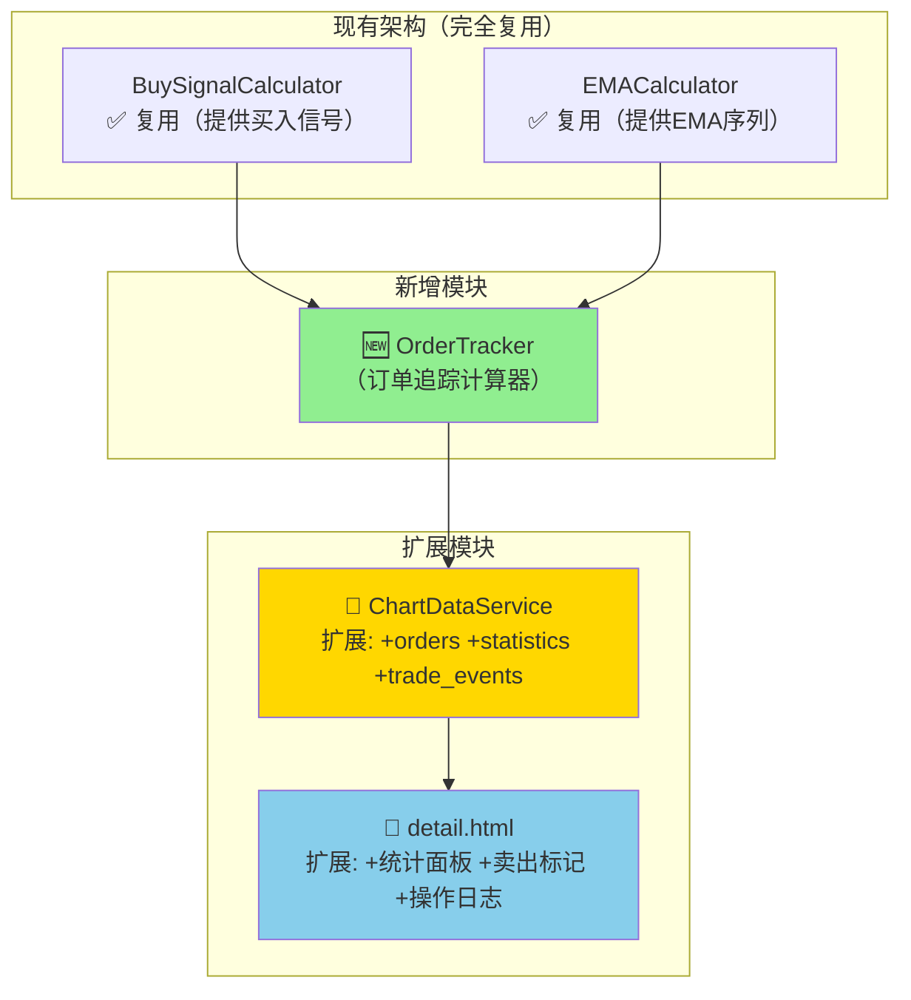
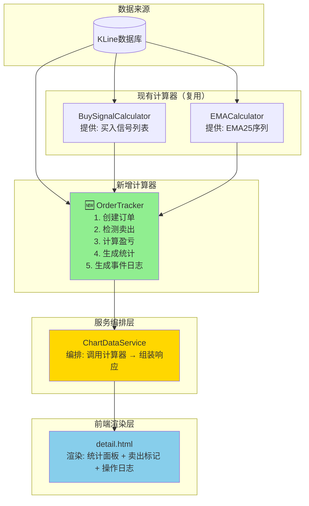

# 架构设计: 买卖订单追踪系统

**迭代编号**: 012
**分支**: 012-buy-sell-order-tracking
**文档版本**: v1.0.0
**创建日期**: 2026-01-06
**生命周期阶段**: P4 - 架构设计

---

## ⚠️ 增量更新声明

**本迭代是增量更新，遵循以下原则：**

| 原则 | 说明 |
|------|------|
| **完全兼容** | 现有 DDPS-Z 所有功能保持不变（买入信号标记、EMA、概率带等） |
| **功能叠加** | 订单追踪是**新增**功能，基于现有买入信号生成虚拟订单 |
| **复用优先** | 充分复用迭代011的买入信号计算（BuySignalCalculator） |
| **UI 扩展** | 前端新增订单统计面板、卖出标记、操作日志 |

---

## 1. 需求概述

### 1.1 核心业务目标

将迭代011的买入信号转化为完整的**虚拟订单生命周期管理**，实现策略回测验证和盈亏分析。

### 1.2 关键功能点（P0级别）

**订单管理核心**：
- [P0] F1.1 订单创建：基于买入信号自动创建虚拟订单（固定100U）
- [P0] F1.2 EMA25回归卖出：检测K线包含EMA25时触发卖出
- [P0] F1.3 订单状态追踪：holding（持仓）/ sold（已卖出）
- [P0] F1.4 盈亏计算：单笔盈亏和汇总统计

**操作日志**：
- [P0] F2.1 交易事件生成：从订单生成买入/卖出事件
- [P0] F2.2 事件排序：按时间倒序展示
- [P0] F2.3 事件筛选：支持全部/买入/卖出筛选

**可视化**：
- [P0] F3.1 统计面板：显示总订单、胜率、总收益等指标
- [P0] F3.2 卖出点标记：红色向下箭头
- [P0] F3.3 操作日志面板：按时间展示买卖事件

**API扩展**：
- [P0] F4.1 orders字段：订单列表
- [P0] F4.2 order_statistics字段：汇总统计
- [P0] F4.3 trade_events字段：操作日志事件

### 1.3 关键用户流程

1. 用户打开DDPS-Z详情页，系统自动计算订单和盈亏
2. 页面顶部显示统计面板（订单数、胜率、总收益）
3. K线图上显示买入点（绿色箭头↑）和卖出点（红色箭头↓）
4. 页面底部显示操作日志，按时间倒序列出所有买卖事件
5. 用户可筛选操作日志（全部/买入/卖出）

---

## 2. 核心技术选型

### 2.1 后端技术栈

| 技术 | 版本 | 用途 |
|------|------|------|
| Python | 3.x | 核心编程语言 |
| Django | 4.x | Web框架 |
| NumPy | 1.x | **订单批量计算** |
| Decimal | stdlib | **盈亏精度计算** |

**选型理由**：
- ✅ 与现有DDPS-Z系统完全一致
- ✅ Decimal确保金额计算精度
- ✅ NumPy向量化检测卖出条件，性能优异

### 2.2 前端技术栈

| 技术 | 版本 | 用途 |
|------|------|------|
| LightweightCharts | 4.x | **卖出点Markers渲染** |
| Bootstrap | 5.x | **统计面板、操作日志UI** |
| Vanilla JavaScript | ES6+ | 前端逻辑 |

### 2.3 新增依赖

✅ **无需引入任何新依赖**

---

## 3. 核心架构设计

### 3.1 系统架构图



### 3.2 架构说明

#### 3.2.1 现有架构（完全复用）

| 计算器 | 提供能力 | 本迭代用途 |
|--------|---------|-----------|
| **BuySignalCalculator** | 买入信号列表 | 作为订单创建的输入源 |
| **EMACalculator** | EMA25序列 | 检测EMA25回归卖出条件 |

#### 3.2.2 新增模块

**OrderTracker（订单追踪计算器）**：
- **文件路径**：`ddps_z/calculators/order_tracker.py`
- **服务层级**：Atomic（原子级服务）
- **唯一职责**：创建订单、检测卖出、计算盈亏、生成统计和事件日志

**数据结构定义**：

```python
@dataclass
class VirtualOrder:
    """虚拟订单"""
    id: str                     # 订单ID（时间戳）
    buy_timestamp: int          # 买入时间戳（毫秒）
    buy_price: Decimal          # 买入价格
    buy_amount_usdt: Decimal    # 买入金额（固定100U）
    buy_quantity: Decimal       # 买入数量
    buy_strategy_id: str        # 触发的买入策略ID

    sell_timestamp: Optional[int]     # 卖出时间戳
    sell_price: Optional[Decimal]     # 卖出价格（EMA25）
    sell_strategy_id: Optional[str]   # 卖出策略ID

    status: str                 # "holding" | "sold"
    profit_usdt: Optional[Decimal]    # 盈亏金额
    profit_rate: Optional[Decimal]    # 盈亏率（%）
    holding_periods: Optional[int]    # 持仓K线数

    floating_profit_usdt: Optional[Decimal]   # 浮动盈亏（仅holding）
    floating_profit_rate: Optional[Decimal]   # 浮动盈亏率（仅holding）


@dataclass
class OrderStatistics:
    """订单统计"""
    total_orders: int           # 总订单数
    sold_orders: int            # 已卖出订单数
    holding_orders: int         # 持仓中订单数
    win_orders: int             # 盈利订单数
    lose_orders: int            # 亏损订单数
    win_rate: Decimal           # 胜率（%）
    total_invested: Decimal     # 总投入
    total_profit: Decimal       # 总盈亏
    total_profit_rate: Decimal  # 总收益率（%）
    floating_profit: Decimal    # 浮动盈亏
    avg_profit_rate: Decimal    # 平均收益率（%）
    avg_holding_periods: int    # 平均持仓周期


@dataclass
class TradeEvent:
    """交易事件（操作日志）"""
    event_type: str             # "buy" | "sell"
    timestamp: int              # 事件时间戳
    price: Decimal              # 价格
    quantity: Decimal           # 数量
    order_id: str               # 关联订单ID
    amount_usdt: Decimal        # 金额
    profit_usdt: Optional[Decimal]    # 盈亏（仅卖出）
    profit_rate: Optional[Decimal]    # 盈亏率（仅卖出）
```

**接口契约**：

```python
class OrderTracker:
    BUY_AMOUNT_USDT = Decimal("100")  # 固定买入金额
    SELL_STRATEGY_ID = "ema25_reversion"  # 卖出策略ID

    def track(
        self,
        buy_signals: List[Dict],      # 买入信号列表（来自BuySignalCalculator）
        klines: List[Dict],           # K线数据
        ema_series: np.ndarray,       # EMA25序列
        current_price: Decimal        # 当前价格（计算浮动盈亏）
    ) -> Dict:
        """
        追踪订单状态

        Returns:
            {
                'orders': List[VirtualOrder],      # 订单列表
                'statistics': OrderStatistics,     # 统计信息
                'trade_events': List[TradeEvent]   # 操作日志
            }
        """
```

**核心计算逻辑**：

**订单创建**：
```python
for signal in buy_signals:
    order = VirtualOrder(
        id=f"order_{signal['timestamp']}",
        buy_timestamp=signal['timestamp'],
        buy_price=Decimal(str(signal['buy_price'])),
        buy_amount_usdt=Decimal("100"),
        buy_quantity=Decimal("100") / Decimal(str(signal['buy_price'])),
        buy_strategy_id=get_triggered_strategy_id(signal),
        status="holding"
    )
    orders.append(order)
```

**EMA25回归卖出检测**：
```python
def check_sell_condition(order: VirtualOrder, klines: List, ema_series: np.ndarray) -> bool:
    """
    检测EMA25回归卖出条件
    条件：K线的 low <= EMA25 <= high
    """
    buy_index = find_kline_index(klines, order.buy_timestamp)

    # 从买入后的下一根K线开始检查
    for i in range(buy_index + 1, len(klines)):
        low = Decimal(str(klines[i]['low']))
        high = Decimal(str(klines[i]['high']))
        ema25 = Decimal(str(ema_series[i]))

        if low <= ema25 <= high:
            order.sell_timestamp = klines[i]['open_time']
            order.sell_price = ema25
            order.sell_strategy_id = "ema25_reversion"
            order.status = "sold"
            order.holding_periods = i - buy_index
            order.profit_usdt = (ema25 - order.buy_price) * order.buy_quantity
            order.profit_rate = (ema25 - order.buy_price) / order.buy_price * 100
            return True

    return False
```

**交易事件生成**：
```python
def generate_trade_events(orders: List[VirtualOrder]) -> List[TradeEvent]:
    events = []

    for order in orders:
        # 买入事件
        events.append(TradeEvent(
            event_type="buy",
            timestamp=order.buy_timestamp,
            price=order.buy_price,
            quantity=order.buy_quantity,
            order_id=order.id,
            amount_usdt=order.buy_amount_usdt,
            profit_usdt=None,
            profit_rate=None
        ))

        # 卖出事件（如果已卖出）
        if order.status == "sold":
            events.append(TradeEvent(
                event_type="sell",
                timestamp=order.sell_timestamp,
                price=order.sell_price,
                quantity=order.buy_quantity,
                order_id=order.id,
                amount_usdt=order.sell_price * order.buy_quantity,
                profit_usdt=order.profit_usdt,
                profit_rate=order.profit_rate
            ))

    # 按时间倒序排列
    events.sort(key=lambda e: e.timestamp, reverse=True)
    return events
```

#### 3.2.3 扩展模块

**ChartDataService扩展**：

```python
def get_chart_data(self, symbol, interval, range, ...):
    # ... 现有逻辑保持不变 ...

    # 🆕 生成订单追踪数据
    order_data = self._generate_order_data(
        buy_signals=buy_signals_data,
        klines=klines,
        ema_series=ema_series,
        current_price=current_price
    )

    return {
        'success': True,
        'chart': {
            'candles': klines,
            'ema': ema_data,
            'bands': bands,
            'zscore': zscore_data,
            'fan': fan_data,
            'buy_signals': buy_signals_data,
            'orders': order_data['orders'],              # 🆕
            'order_statistics': order_data['statistics'], # 🆕
            'trade_events': order_data['trade_events']    # 🆕
        },
        'meta': {...}
    }
```

**detail.html前端扩展**：

**统计面板**：
```html
<div class="card mb-3" id="statistics-panel">
    <div class="card-body py-2">
        <div class="row text-center g-2">
            <div class="col-4 col-md-2">
                <small class="text-muted d-block">总订单</small>
                <span class="fw-bold" id="stat-total">-</span>
            </div>
            <div class="col-4 col-md-2">
                <small class="text-muted d-block">已卖出</small>
                <span class="fw-bold" id="stat-sold">-</span>
            </div>
            <div class="col-4 col-md-2">
                <small class="text-muted d-block">持仓中</small>
                <span class="fw-bold" id="stat-holding">-</span>
            </div>
            <div class="col-4 col-md-2">
                <small class="text-muted d-block">胜率</small>
                <span class="fw-bold" id="stat-winrate">-</span>
            </div>
            <div class="col-4 col-md-2">
                <small class="text-muted d-block">总收益</small>
                <span class="fw-bold" id="stat-profit">-</span>
            </div>
            <div class="col-4 col-md-2">
                <small class="text-muted d-block">浮动盈亏</small>
                <span class="fw-bold" id="stat-floating">-</span>
            </div>
        </div>
    </div>
</div>
```

**卖出点标记**：
```javascript
function renderSellMarkers(orders) {
    const sellMarkers = orders
        .filter(order => order.status === 'sold')
        .map(order => ({
            time: order.sell_timestamp / 1000,
            position: 'aboveBar',
            color: '#dc3545',
            shape: 'arrowDown',
            text: 'S',
            size: 1
        }));

    return sellMarkers;
}

// 合并买入和卖出标记
const allMarkers = [...buyMarkers, ...sellMarkers];
candleSeries.setMarkers(allMarkers);
```

**操作日志面板**：
```html
<div class="card mb-3" id="trade-log-panel">
    <div class="card-header d-flex justify-content-between align-items-center">
        <span>📋 操作日志</span>
        <div class="btn-group btn-group-sm">
            <button class="btn btn-outline-secondary active" data-log-filter="all">全部</button>
            <button class="btn btn-outline-success" data-log-filter="buy">买入</button>
            <button class="btn btn-outline-danger" data-log-filter="sell">卖出</button>
        </div>
    </div>
    <div class="card-body p-0" style="max-height: 300px; overflow-y: auto;">
        <div class="list-group list-group-flush" id="trade-log-list">
            <!-- 动态渲染事件列表 -->
        </div>
    </div>
</div>
```

---

## 4. 数据流图



---

## 5. API设计

### 5.1 API响应扩展

**路径**: `GET /ddps-z/api/chart/`

**响应结构扩展**:
```json
{
  "success": true,
  "chart": {
    "candles": [...],
    "ema": [...],
    "bands": {...},
    "zscore": [...],
    "fan": {...},
    "buy_signals": [...],

    "orders": [
      {
        "id": "order_1736078400000",
        "buy_timestamp": 1736078400000,
        "buy_price": 2300.50,
        "buy_amount_usdt": 100,
        "buy_quantity": 0.0435,
        "buy_strategy_id": "strategy_1",
        "sell_timestamp": 1736164800000,
        "sell_price": 2350.00,
        "sell_strategy_id": "ema25_reversion",
        "status": "sold",
        "profit_usdt": 2.15,
        "profit_rate": 2.15,
        "holding_periods": 6
      },
      {
        "id": "order_1736251200000",
        "buy_timestamp": 1736251200000,
        "buy_price": 2280.00,
        "buy_amount_usdt": 100,
        "buy_quantity": 0.0439,
        "buy_strategy_id": "strategy_2",
        "sell_timestamp": null,
        "sell_price": null,
        "sell_strategy_id": null,
        "status": "holding",
        "profit_usdt": null,
        "profit_rate": null,
        "holding_periods": null,
        "floating_profit_usdt": 1.32,
        "floating_profit_rate": 1.32
      }
    ],

    "order_statistics": {
      "total_orders": 25,
      "sold_orders": 22,
      "holding_orders": 3,
      "win_orders": 15,
      "lose_orders": 7,
      "win_rate": 68.2,
      "total_invested": 2500,
      "total_profit": 156.32,
      "total_profit_rate": 6.25,
      "floating_profit": 12.45,
      "avg_profit_rate": 7.1,
      "avg_holding_periods": 8
    },

    "trade_events": [
      {
        "event_type": "sell",
        "timestamp": 1736164800000,
        "price": 2350.00,
        "quantity": 0.0435,
        "order_id": "order_1736078400000",
        "amount_usdt": 102.15,
        "profit_usdt": 2.15,
        "profit_rate": 2.15
      },
      {
        "event_type": "buy",
        "timestamp": 1736078400000,
        "price": 2300.50,
        "quantity": 0.0435,
        "order_id": "order_1736078400000",
        "amount_usdt": 100,
        "profit_usdt": null,
        "profit_rate": null
      }
    ]
  },
  "meta": {...}
}
```

---

## 6. 关键技术决策

### 决策点1: 买入金额策略

- **选定方案**: 固定100 USDT
- **决策日期**: 2026-01-06
- **理由**: MVP阶段最简单，便于计算和验证
- **后续影响**: 易于扩展为可配置金额

### 决策点2: 卖出策略

- **选定方案**: EMA25回归卖出
- **决策日期**: 2026-01-06
- **公式**: `low <= EMA25 <= high`
- **理由**: 与现有DDPS-Z系统紧密结合，逻辑简单清晰
- **后续影响**: 可扩展为多策略组合

### 决策点3: 数据存储

- **选定方案**: 纯内存计算，不持久化
- **决策日期**: 2026-01-06
- **理由**: 与现有DDPS-Z架构一致，MVP阶段无需数据库
- **后续影响**: 如需历史查询，可扩展为数据库存储

### 决策点4: 操作日志排序

- **选定方案**: 按时间倒序（最新在上）
- **决策日期**: 2026-01-06
- **理由**: 用户最关心最新的交易事件
- **后续影响**: 前端可添加排序切换功能

---

## 7. 文件变更清单

| 文件 | 操作 | 变更内容 |
|------|------|----------|
| `ddps_z/calculators/order_tracker.py` | 🆕 新建 | 订单追踪计算器实现 |
| `ddps_z/calculators/__init__.py` | 📝 扩展 | 导出 `OrderTracker` |
| `ddps_z/services/chart_data_service.py` | 📝 扩展 | 添加orders、statistics、trade_events计算 |
| `ddps_z/templates/ddps_z/detail.html` | 📝 扩展 | 统计面板 + 卖出标记 + 操作日志 |

---

## 8. 测试策略

### 8.1 单元测试

| 测试文件 | 测试内容 |
|----------|----------|
| `test_order_tracker.py` | 订单创建、卖出检测、盈亏计算、统计汇总、事件生成 |

**测试用例**:
- [ ] 订单创建：买入金额固定100U，数量正确计算
- [ ] 卖出检测：EMA25在K线区间内时触发
- [ ] 卖出检测：EMA25不在K线区间内时不触发
- [ ] 盈亏计算：盈利订单profit_usdt > 0
- [ ] 盈亏计算：亏损订单profit_usdt < 0
- [ ] 胜率计算：win_orders / sold_orders
- [ ] 浮动盈亏：holding订单正确计算
- [ ] 事件生成：每个订单生成买入事件
- [ ] 事件生成：已卖出订单额外生成卖出事件
- [ ] 事件排序：按时间倒序

### 8.2 性能要求

| 指标 | 目标值 |
|------|--------|
| 订单计算时间 | < 100ms（500订单） |
| 页面加载时间 | < 1s |
| 统计面板渲染 | < 10ms |

---

## 9. Gate 4 检查结果

### 检查清单

#### 架构设计完整性
- [x] 架构图清晰表达了系统结构
- [x] 每个组件的职责明确且有需求映射
- [x] 所有关键技术决策已完成并记录
- [x] 数据结构定义完整（VirtualOrder、OrderStatistics、TradeEvent）
- [x] API响应格式定义完整

#### 原子服务契约完整性
- [x] OrderTracker原子服务已定义
- [x] Input/Output契约完整
- [x] 核心计算逻辑伪代码已提供

#### 变更点说明完整性
- [x] 文件变更清单已列出
- [x] 新增/扩展模块已标识
- [x] 测试策略已定义

**Gate 4 检查结果**: ✅ **通过** - 可以进入P5阶段（开发规划）

---

## 10. 下一步行动

1. ✅ **P1需求定义已完成**
2. ✅ **P4架构设计已完成**
3. ⏭️ **进入P5-P6阶段**：创建任务计划并实现

---

**文档版本**: v1.0.0
**生成时间**: 2026-01-06
**状态**: ✅ 已完成（Gate 4通过）
