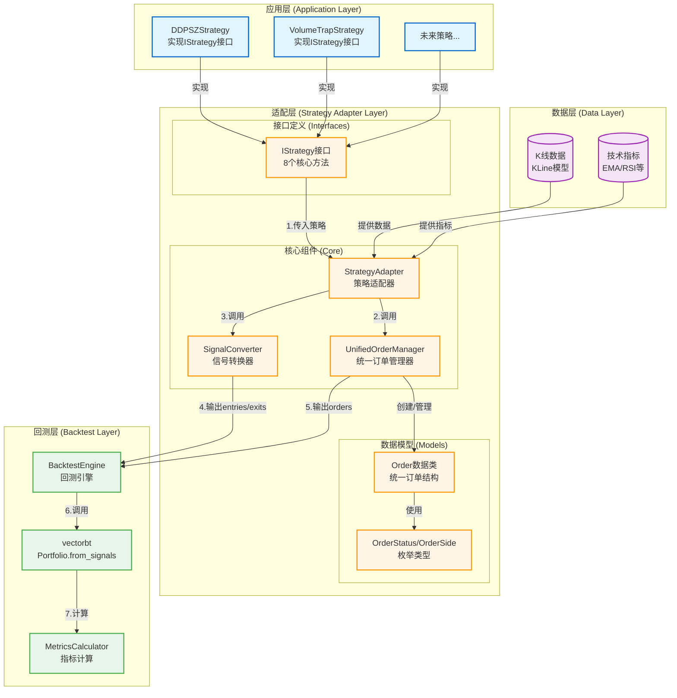

# 架构设计：策略适配层 (Strategy Adapter Layer)

**迭代编号**: 013
**迭代名称**: 策略适配层
**文档版本**: 1.0
**创建日期**: 2026-01-06
**状态**: 架构设计完成
**优先级**: P0

---

## 第一部分：架构概览

### 1.1 系统定位

**策略适配层（Strategy Adapter Layer）**是连接应用层策略和回测层的中间层，解决以下核心问题：

1. **消除代码重复**：统一应用层（DDPS-Z的OrderTracker）和回测层（PositionManager）的订单管理逻辑
2. **解除系统割裂**：让应用层策略能够无缝使用vectorbt进行专业回测分析
3. **标准化策略接入**：通过IStrategy接口标准化策略定义，新策略只需实现接口即可接入回测系统
4. **提升可扩展性**：未来新策略（如成交量陷阱策略）可快速接入，无需重复开发订单管理和回测逻辑

### 1.2 核心目标

**最终效果**：应用层开发者编写策略时，只需专注于买卖逻辑，适配层自动提供订单管理和回测能力。

**成功标准**：
- DDPS-Z策略通过适配层成功运行vectorbt回测
- 回测结果与OrderTracker一致（±5%容差）
- 新策略接入成本降低80%（只需实现IStrategy接口）

### 1.3 关键用户流程

**场景：开发者使用DDPS-Z策略进行回测**

```
┌─────────────────────────────────────────────────────────────┐
│ 阶段1: 策略实现（开发者）                                    │
├─────────────────────────────────────────────────────────────┤
│ - 创建DDPSZStrategy类，实现IStrategy接口                    │
│ - 定义买入信号生成逻辑（复用BuySignalCalculator）           │
│ - 定义卖出信号生成逻辑（EMA25回归）                         │
│ - 定义仓位计算（固定100 USDT）                              │
└─────────────────────────────────────────────────────────────┘
                            ↓
┌─────────────────────────────────────────────────────────────┐
│ 阶段2: 适配转换（适配层自动）                                │
├─────────────────────────────────────────────────────────────┤
│ - 创建StrategyAdapter，传入DDPSZStrategy实例                │
│ - 调用adapt_for_backtest()方法                              │
│ - SignalConverter将应用层信号转换为vectorbt格式（pd.Series）│
│ - UnifiedOrderManager创建和管理订单对象                     │
└─────────────────────────────────────────────────────────────┘
                            ↓
┌─────────────────────────────────────────────────────────────┐
│ 阶段3: 回测执行（回测层自动）                                │
├─────────────────────────────────────────────────────────────┤
│ - BacktestEngine接收entries/exits信号                       │
│ - vectorbt.Portfolio.from_signals()执行回测                 │
│ - 计算夏普比率、最大回撤等专业指标                          │
└─────────────────────────────────────────────────────────────┘
                            ↓
┌─────────────────────────────────────────────────────────────┐
│ 阶段4: 结果验证（开发者）                                    │
├─────────────────────────────────────────────────────────────┤
│ - 查看BacktestResult（总收益率、胜率等）                    │
│ - 对比适配层回测与OrderTracker结果（验证准确性）            │
│ - 基于回测结果优化策略参数                                  │
└─────────────────────────────────────────────────────────────┘
```

**核心价值**：开发者只需关注阶段1（策略逻辑），阶段2-3由适配层自动完成，大幅降低回测接入成本。

---

## 第二部分：核心架构设计

### 2.1 系统架构图



### 2.2 组件职责说明

#### **应用层组件**

**DDPSZStrategy**
- **职责**：DDPS-Z策略的适配器实现
- **核心功能**：
  - 实现IStrategy接口的8个方法
  - 复用BuySignalCalculator生成买入信号
  - 实现EMA25回归卖出逻辑
  - 固定100 USDT仓位计算
- **文件位置**：`strategy_adapter/adapters/ddpsz_adapter.py`

**VolumeTrapStrategy / 未来策略**
- **职责**：其他应用层策略的占位符
- **核心功能**：同样实现IStrategy接口，遵循标准化接入流程

---

#### **适配层组件**

**接口定义模块**

**IStrategy接口**
- **职责**：策略标准化接口定义
- **核心功能**：
  - 定义8个核心方法（买入/卖出/止盈/止损等）
  - 强制所有策略实现统一接口
  - 提供类型提示和完整文档
- **文件位置**：`strategy_adapter/interfaces/strategy.py`

**数据模型模块**

**Order数据类**
- **职责**：统一的订单数据结构
- **核心功能**：
  - 存储开平仓信息（价格、数量、时间戳）
  - 自动计算盈亏（profit_loss, profit_loss_rate）
  - 支持现货和合约（通过metadata扩展）
- **文件位置**：`strategy_adapter/models/order.py`

**OrderStatus/OrderSide枚举**
- **职责**：订单状态和方向的枚举类型
- **核心功能**：
  - OrderStatus：pending/filled/closed/cancelled
  - OrderSide：buy/sell
  - 提供类型安全
- **文件位置**：`strategy_adapter/models/enums.py`

**核心组件模块**

**UnifiedOrderManager**
- **职责**：统一订单管理器（整合OrderTracker和PositionManager）
- **核心功能**：
  - create_order()：从信号创建订单
  - update_order()：更新订单（平仓）
  - get_open_orders()：查询持仓订单
  - calculate_statistics()：计算胜率、总盈亏等统计
- **文件位置**：`strategy_adapter/core/unified_order_manager.py`

**StrategyAdapter**
- **职责**：策略适配器（核心编排组件）
- **核心功能**：
  - 接收IStrategy实例
  - 调用策略的generate_buy_signals/sell_signals
  - 协调UnifiedOrderManager和SignalConverter
  - 输出vectorbt所需的格式
- **文件位置**：`strategy_adapter/core/strategy_adapter.py`

**SignalConverter**
- **职责**：信号转换器
- **核心功能**：
  - 将应用层信号（List[Dict]）转换为vectorbt信号（pd.Series）
  - 处理时间对齐（时间戳 → DataFrame index）
  - 验证信号有效性
- **文件位置**：`strategy_adapter/core/signal_converter.py`

---

#### **回测层组件**

**BacktestEngine**
- **职责**：回测引擎（已存在）
- **核心功能**：
  - 接收entries/exits信号
  - 调用vectorbt执行回测
  - 返回BacktestResult

**vectorbt**
- **职责**：底层回测框架（第三方库）
- **核心功能**：
  - Portfolio.from_signals()执行向量化回测
  - 计算收益曲线、交易明细

**MetricsCalculator**
- **职责**：指标计算器（已存在）
- **核心功能**：
  - 计算夏普比率、最大回撤
  - 年化收益率、Sortino比率等

---

#### **数据层组件**

**K线数据 (KLine模型)**
- **职责**：Django ORM模型，存储OHLCV数据
- **核心功能**：提供历史价格数据

**技术指标**
- **职责**：计算后的技术指标序列
- **核心功能**：提供EMA、RSI等指标供策略使用

### 2.3 组件与需求映射

| 组件名称 | 负责实现的功能点（FP编号） |
|---------|---------------------------|
| **IStrategy接口** | FP-013-002：IStrategy接口定义 |
| **Order数据类** | FP-013-003：Order数据类 |
| **OrderStatus/OrderSide枚举** | FP-013-004：枚举类型定义 |
| **UnifiedOrderManager** | FP-013-005：UnifiedOrderManager实现 |
| **SignalConverter** | FP-013-006：SignalConverter实现 |
| **StrategyAdapter** | FP-013-007：StrategyAdapter实现 |
| **DDPSZStrategy** | FP-013-008：DDPSZStrategy实现 |
| **回测集成逻辑** | FP-013-009：DDPS-Z回测集成 |
| **单元测试套件** | FP-013-010、011、012：各组件单元测试 |
| **集成测试** | FP-013-013：端到端集成测试 |

**覆盖率**：13个P0功能点全部映射到具体组件，无遗漏。

### 2.4 核心数据流

#### **流程说明（编号对应架构图）**

**流程1：策略传入**
- 开发者创建DDPSZStrategy实例
- 传入StrategyAdapter构造函数
- StrategyAdapter持有策略引用

**流程2：调用订单管理器**
- StrategyAdapter调用策略的generate_buy_signals()
- 获取买入信号列表：`[{timestamp, price, reason, ...}]`
- 将信号传递给UnifiedOrderManager
- UnifiedOrderManager创建Order对象

**流程3：调用信号转换器**
- StrategyAdapter将买入/卖出信号传给SignalConverter
- SignalConverter.to_vectorbt_signals()执行转换
- 输出：`entries = pd.Series([False, True, False, ...])`

**流程4：输出entries/exits信号**
- SignalConverter将转换后的信号传递给BacktestEngine
- 格式：`(entries: pd.Series, exits: pd.Series)`

**流程5：输出订单列表**
- UnifiedOrderManager将Order对象列表传递给BacktestEngine
- 用于生成交易记录和统计

**流程6：调用vectorbt**
- BacktestEngine调用`vbt.Portfolio.from_signals()`
- 传入价格数据、信号、初始资金等参数

**流程7：计算指标**
- vectorbt生成Portfolio对象
- MetricsCalculator计算夏普比率、最大回撤等
- 返回BacktestResult对象

---

## 第三部分：关键技术决策

### 决策点一：UnifiedOrderManager的实现策略

#### **问题描述**
UnifiedOrderManager需要整合应用层（OrderTracker）和回测层（PositionManager）的订单管理能力，如何实现？

#### **方案对比**

**方案A：完全新建独立实现** ✅ **已选择**

- **简介**：
  - 创建全新的UnifiedOrderManager类
  - 不依赖或继承OrderTracker和PositionManager
  - 重新实现订单创建、更新、查询、统计等逻辑

- **优点**：
  1. 职责清晰，专门为适配层设计
  2. 没有历史包袱，代码简洁
  3. 不影响现有OrderTracker和PositionManager的功能
  4. 易于测试（无外部依赖）

- **缺点**：
  1. 存在代码重复（与OrderTracker逻辑相似）
  2. 需要重新实现盈亏计算、统计等逻辑
  3. 短期内增加维护成本

**方案B：组合复用现有组件** ❌ **未选择**

- **简介**：
  - UnifiedOrderManager内部聚合OrderTracker实例
  - 复用OrderTracker的订单追踪逻辑
  - 添加适配层特定的功能（如与vectorbt的对接）

- **优点**：
  1. 最大化复用现有代码
  2. 继承OrderTracker已验证的计算逻辑
  3. 减少开发工作量

- **缺点**：
  1. 增加组件间耦合
  2. OrderTracker设计时未考虑复用场景，可能需要重构
  3. 职责混乱（应用层组件被适配层依赖）
  4. 难以独立演化

#### **最终决策**

**选择方案A（完全新建独立实现）**

**决策理由**：
1. **架构清晰性**：适配层应该是独立的、自包含的层级，不应依赖应用层组件
2. **长期价值**：虽然短期存在代码重复，但长期来看职责分离更利于维护
3. **MVP验证**：完全新建可以快速验证适配层架构的可行性，后续可逐步优化
4. **平滑迁移路径**：
   - 第一步：创建UnifiedOrderManager（独立实现）
   - 第二步：DDPS-Z同时保留OrderTracker和适配层（验证一致性）
   - 第三步：逐步将应用层迁移到UnifiedOrderManager
   - 第四步：弃用OrderTracker
5. **代码重复可接受**：OrderTracker的核心逻辑不超过200行，重复成本可控

#### **实现指导**

**UnifiedOrderManager核心接口**：
```python
class UnifiedOrderManager:
    """统一订单管理器"""

    def create_order(
        self,
        signal: Dict,
        strategy: IStrategy
    ) -> Order:
        """从信号创建订单"""
        pass

    def update_order(
        self,
        order_id: str,
        close_signal: Dict
    ) -> Order:
        """更新订单（平仓）"""
        pass

    def get_open_orders(
        self,
        strategy_name: Optional[str] = None
    ) -> List[Order]:
        """获取持仓订单"""
        pass

    def calculate_statistics(
        self,
        orders: List[Order]
    ) -> Dict:
        """计算统计指标（胜率、总盈亏等）"""
        pass
```

---

### 决策点二：信号转换的时间对齐策略

#### **问题描述**
应用层信号使用时间戳（int），vectorbt使用DataFrame index（pd.Timestamp），如何确保准确对齐？

#### **方案对比**

**方案A：精确匹配（Exact Match）** ✅ **已选择**

- **简介**：
  - 对每个信号时间戳，在K线DataFrame中查找完全匹配的index
  - 如果找不到精确匹配，抛出异常
  - 严格验证每个信号都有对应的K线

- **优点**：
  1. 最安全，不会出现时间对齐错误
  2. 强制数据一致性
  3. 易于调试（明确的错误信息）
  4. 快速暴露数据问题（K线缺失、时间戳错误等）

- **缺点**：
  1. 对数据质量要求极高
  2. 如果K线数据有缺失，回测会失败
  3. 灵活性差

**方案B：最近邻匹配（Nearest Match）** ❌ **未选择**

- **简介**：
  - 对每个信号时间戳，查找最接近的K线时间点
  - 使用`pd.Index.get_indexer(method='nearest')`
  - 允许小范围的时间偏差（如±1分钟）

- **优点**：
  1. 容错性强，适应数据缺失
  2. 灵活，适用于不同数据源
  3. 更贴近真实交易场景

- **缺点**：
  1. 可能引入时间偏差
  2. 如果偏差过大，结果可能失真
  3. 需要设置合理的容差阈值
  4. 无法区分"正常偏差"和"异常偏差"

**方案C：混合策略（精确优先+最近邻降级）** ❌ **未选择**

- **简介**：
  - 首先尝试精确匹配
  - 如果精确匹配失败，检查最近邻的时间差
  - 如果时间差在可接受范围内（如1个K线周期），使用最近邻
  - 如果时间差过大，抛出警告或异常

- **优点**：
  1. 兼顾安全性和灵活性
  2. 明确记录降级情况（日志）
  3. 可配置容差阈值

- **缺点**：
  1. 实现稍复杂
  2. 需要额外的日志记录

#### **最终决策**

**选择方案A（精确匹配）**

**决策理由**：
1. **数据质量优先**：问题暴露优于问题隐藏，K线缺失应该立即修复而不是被容错机制掩盖
2. **与OrderTracker对齐**：OrderTracker使用精确匹配逻辑，保持一致性便于结果验证
3. **强制数据完整性**：确保回测结果的准确性和可重复性
4. **快速反馈**：数据问题会立即暴露，避免"带病运行"
5. **性能最优**：精确匹配是O(1)哈希查找，最快

#### **实现指导**

**SignalConverter核心方法**：
```python
class SignalConverter:
    """信号转换器"""

    @staticmethod
    def to_vectorbt_signals(
        buy_signals: List[Dict],
        sell_signals: List[Dict],
        klines: pd.DataFrame
    ) -> tuple[pd.Series, pd.Series]:
        """
        转换为vectorbt信号（精确匹配策略）

        Args:
            buy_signals: 买入信号列表 [{timestamp, price, ...}]
            sell_signals: 卖出信号列表 [{timestamp, price, ...}]
            klines: K线DataFrame（index为pd.DatetimeIndex）

        Returns:
            (entries, exits): 买入和卖出信号（pd.Series of bool）

        Raises:
            ValueError: 信号时间戳在K线中不存在
        """
        kline_index = klines.index

        # 初始化信号序列
        entries = pd.Series(False, index=kline_index)
        exits = pd.Series(False, index=kline_index)

        # 转换买入信号
        for signal in buy_signals:
            signal_time = pd.Timestamp(signal['timestamp'], unit='ms', tz='UTC')

            if signal_time not in kline_index:
                raise ValueError(
                    f"买入信号时间 {signal_time} 在K线数据中不存在。"
                    f"请检查：1) K线数据是否完整；2) 信号时间戳是否正确。"
                    f"可用时间范围: {kline_index[0]} ~ {kline_index[-1]}"
                )

            entries.loc[signal_time] = True

        # 转换卖出信号
        for signal in sell_signals:
            signal_time = pd.Timestamp(signal['timestamp'], unit='ms', tz='UTC')

            if signal_time not in kline_index:
                raise ValueError(
                    f"卖出信号时间 {signal_time} 在K线数据中不存在。"
                    f"请检查：1) K线数据是否完整；2) 信号时间戳是否正确。"
                    f"可用时间范围: {kline_index[0]} ~ {kline_index[-1]}"
                )

            exits.loc[signal_time] = True

        return entries, exits
```

**错误处理建议**：
```python
# 在StrategyAdapter中捕获并提供友好的错误提示
try:
    entries, exits = SignalConverter.to_vectorbt_signals(
        buy_signals, sell_signals, klines
    )
except ValueError as e:
    logger.error(f"信号转换失败: {e}")
    logger.info(
        f"建议执行: python manage.py update_klines "
        f"--symbol {symbol} --interval {interval}"
    )
    raise
```

---

### 决策点三：IStrategy实例的状态管理方式

#### **问题描述**
IStrategy实例在回测过程中是否应该保持状态（如持仓信息、历史信号）？

#### **方案对比**

**方案A：无状态策略（Stateless）** ❌ **未选择**

- **简介**：
  - IStrategy实例不保存任何状态
  - 每次调用generate_buy_signals/sell_signals时，传入所有必要数据
  - 策略完全依赖输入参数，不依赖内部状态

- **优点**：
  1. 函数式编程风格，易于测试
  2. 无副作用，可并行执行
  3. 易于理解和调试
  4. 符合vectorbt的设计理念（向量化计算）

- **缺点**：
  1. 需要在每次调用时传递大量参数
  2. 策略无法"记住"之前的决策（某些复杂策略可能需要）

**方案B：有状态策略（Stateful）** ❌ **未选择**

- **简介**：
  - IStrategy实例可以保存内部状态
  - 例如：self.open_orders, self.signal_history
  - 策略可以基于历史状态做决策

- **优点**：
  1. 支持复杂的状态依赖策略
  2. 减少参数传递
  3. 更贴近OOP范式

- **缺点**：
  1. 难以并行执行
  2. 状态管理复杂，易出bug
  3. 测试困难（需要mock状态）
  4. 与vectorbt的无状态理念冲突

**方案C：混合方式（核心无状态+缓存优化）** ✅ **已选择**

- **简介**：
  - IStrategy接口设计为无状态（核心方法不依赖self状态）
  - 允许策略内部使用缓存（如@lru_cache装饰器）优化性能
  - StrategyAdapter负责管理状态（如open_orders），作为参数传递给策略

- **优点**：
  1. 保持接口简洁（无状态）
  2. 允许性能优化（缓存）
  3. 状态管理责任清晰（由Adapter管理）
  4. 兼顾函数式和OOP优势

- **缺点**：
  1. 需要明确约定哪些可以缓存
  2. 文档需要强调无状态原则

#### **最终决策**

**选择方案C（混合方式：核心无状态+缓存优化）**

**决策理由**：
1. **与vectorbt对齐**：vectorbt是基于向量化计算的，无状态策略更自然
2. **可测试性**：无状态方法易于单元测试（纯函数）
3. **职责分离**：
   - IStrategy：专注于信号生成逻辑
   - StrategyAdapter：负责状态管理（持仓列表、订单历史）
   - UnifiedOrderManager：负责订单生命周期
4. **DDPS-Z验证**：当前OrderTracker已经是无状态的（每次调用track()都重新计算），证明无状态方式可行
5. **灵活性**：允许内部缓存优化，提升性能

#### **实现指导**

**IStrategy接口设计（强调无状态）**：
```python
class IStrategy(ABC):
    """
    策略接口

    **重要原则：无状态设计**
    - 所有核心方法应该是无状态的（不依赖self的内部状态）
    - 持仓信息、订单历史等状态通过参数传入
    - 允许使用@lru_cache等装饰器优化性能，但不改变核心逻辑的无状态性
    """

    @abstractmethod
    def generate_buy_signals(
        self,
        klines: pd.DataFrame,
        indicators: Dict[str, pd.Series]
    ) -> List[Dict]:
        """
        生成买入信号

        注意：此方法应该是无状态的，不依赖self的内部状态。
        每次调用时，根据输入参数计算买入信号。

        Args:
            klines: K线数据 (OHLCV)
            indicators: 技术指标字典 (如 {'ema25': Series, 'rsi': Series})

        Returns:
            买入信号列表
            [
                {
                    'timestamp': int,      # 买入时间戳
                    'price': Decimal,      # 买入价格
                    'reason': str,         # 买入理由
                    'confidence': float    # 信号强度 [0-1]
                },
                ...
            ]
        """
        pass

    @abstractmethod
    def generate_sell_signals(
        self,
        klines: pd.DataFrame,
        indicators: Dict[str, pd.Series],
        open_orders: List[Order]  # ← 状态由外部传入
    ) -> List[Dict]:
        """
        生成卖出信号

        注意：此方法应该是无状态的，不依赖self的内部状态。
        持仓信息通过open_orders参数传入。

        Args:
            klines: K线数据
            indicators: 技术指标字典
            open_orders: 当前持仓订单列表（由StrategyAdapter管理）

        Returns:
            卖出信号列表
            [
                {
                    'timestamp': int,      # 卖出时间戳
                    'price': Decimal,      # 卖出价格
                    'order_id': str,       # 关联订单ID
                    'reason': str,         # 卖出理由
                    'strategy_id': str     # 触发策略ID
                },
                ...
            ]
        """
        pass
```

**缓存优化示例（允许）**：
```python
class DDPSZStrategy(IStrategy):
    """DDPS-Z策略实现"""

    @lru_cache(maxsize=128)
    def _calculate_ema_slope(self, ema_tuple: tuple) -> float:
        """
        允许缓存计算结果，提升性能

        注意：
        - 参数必须是不可变类型（tuple）
        - 不改变核心逻辑的无状态性
        - 仅用于优化重复计算
        """
        ema_values = np.array(ema_tuple)
        # ... 计算逻辑
        return slope

    def generate_buy_signals(
        self,
        klines: pd.DataFrame,
        indicators: Dict[str, pd.Series]
    ) -> List[Dict]:
        """核心方法保持无状态"""
        ema25 = indicators['ema25']

        # 可以使用缓存的辅助方法
        ema_tuple = tuple(ema25.values)
        slope = self._calculate_ema_slope(ema_tuple)

        # ... 生成信号逻辑
        return signals
```

**状态管理责任分配**：
```python
# StrategyAdapter负责管理状态
class StrategyAdapter:
    def adapt_for_backtest(
        self,
        klines: pd.DataFrame,
        indicators: Dict[str, pd.Series]
    ) -> Dict:
        # 1. 生成买入信号（无状态）
        buy_signals = self.strategy.generate_buy_signals(klines, indicators)

        # 2. 创建订单（状态由UnifiedOrderManager管理）
        orders = []
        for signal in buy_signals:
            order = self.order_manager.create_order(signal, self.strategy)
            orders.append(order)

        # 3. 获取持仓订单（状态由UnifiedOrderManager管理）
        open_orders = self.order_manager.get_open_orders()

        # 4. 生成卖出信号（状态作为参数传入）
        sell_signals = self.strategy.generate_sell_signals(
            klines,
            indicators,
            open_orders  # ← 状态传入，不由策略保存
        )

        # 5. 更新订单
        for signal in sell_signals:
            self.order_manager.update_order(signal['order_id'], signal)

        # ...
```

---

## 第四部分：模块详细设计

### 4.1 接口定义模块

#### **IStrategy接口完整定义**

**文件位置**：`strategy_adapter/interfaces/strategy.py`

```python
from abc import ABC, abstractmethod
from typing import Dict, List, Optional
from decimal import Decimal
import pandas as pd

class IStrategy(ABC):
    """
    策略接口（所有应用层策略必须实现）

    设计原则：
    - 无状态设计：核心方法不依赖self的内部状态
    - 职责单一：每个方法负责一个明确的决策
    - 类型安全：所有参数和返回值都有完整的类型提示
    """

    @abstractmethod
    def get_strategy_name(self) -> str:
        """返回策略名称（用于识别和日志）"""
        pass

    @abstractmethod
    def get_strategy_version(self) -> str:
        """返回策略版本（用于版本管理）"""
        pass

    @abstractmethod
    def generate_buy_signals(
        self,
        klines: pd.DataFrame,
        indicators: Dict[str, pd.Series]
    ) -> List[Dict]:
        """生成买入信号（详见上文）"""
        pass

    @abstractmethod
    def generate_sell_signals(
        self,
        klines: pd.DataFrame,
        indicators: Dict[str, pd.Series],
        open_orders: List['Order']
    ) -> List[Dict]:
        """生成卖出信号（详见上文）"""
        pass

    @abstractmethod
    def calculate_position_size(
        self,
        signal: Dict,
        available_capital: Decimal,
        current_price: Decimal
    ) -> Decimal:
        """
        计算仓位大小

        Args:
            signal: 买入信号
            available_capital: 可用资金
            current_price: 当前价格

        Returns:
            买入金额（USDT）
        """
        pass

    @abstractmethod
    def should_stop_loss(
        self,
        order: 'Order',
        current_price: Decimal,
        current_timestamp: int
    ) -> bool:
        """
        检查是否需要止损

        Args:
            order: 订单对象
            current_price: 当前价格
            current_timestamp: 当前时间戳

        Returns:
            是否触发止损
        """
        pass

    @abstractmethod
    def should_take_profit(
        self,
        order: 'Order',
        current_price: Decimal,
        current_timestamp: int
    ) -> bool:
        """
        检查是否需要止盈

        Args:
            order: 订单对象
            current_price: 当前价格
            current_timestamp: 当前时间戳

        Returns:
            是否触发止盈
        """
        pass

    def get_required_indicators(self) -> List[str]:
        """
        返回所需的技术指标列表（可选方法）

        Returns:
            指标名称列表（如 ['ema25', 'rsi', 'macd']）
        """
        return []
```

---

### 4.2 数据模型模块

#### **Order数据类**

**文件位置**：`strategy_adapter/models/order.py`

```python
from dataclasses import dataclass, field
from decimal import Decimal
from typing import Optional
from .enums import OrderStatus, OrderSide

@dataclass
class Order:
    """
    统一订单数据结构

    设计原则：
    - 完整性：包含订单完整生命周期的所有信息
    - 扩展性：通过metadata支持策略特定数据
    - 自包含：包含盈亏计算方法
    """

    # 基础信息
    id: str
    symbol: str
    side: OrderSide
    status: OrderStatus

    # 开仓信息
    open_timestamp: int
    open_price: Decimal
    quantity: Decimal
    position_value: Decimal      # 开仓金额

    # 平仓信息（可选）
    close_timestamp: Optional[int] = None
    close_price: Optional[Decimal] = None
    close_reason: Optional[str] = None  # "take_profit" | "stop_loss" | "strategy_signal"

    # 策略信息
    strategy_name: str = ""
    strategy_id: str = ""
    entry_reason: str = ""       # 入场理由

    # 盈亏计算
    profit_loss: Optional[Decimal] = None
    profit_loss_rate: Optional[Decimal] = None
    holding_periods: Optional[int] = None  # 持仓K线数

    # 手续费
    open_commission: Decimal = Decimal("0")
    close_commission: Decimal = Decimal("0")

    # 扩展字段（策略特定数据）
    metadata: dict = field(default_factory=dict)

    def calculate_pnl(self) -> None:
        """
        计算盈亏

        Side Effects:
            更新 profit_loss 和 profit_loss_rate 字段
        """
        if self.status != OrderStatus.CLOSED or self.close_price is None:
            return

        if self.side == OrderSide.BUY:
            # 做多盈亏
            self.profit_loss = (self.close_price - self.open_price) * self.quantity
        else:
            # 做空盈亏
            self.profit_loss = (self.open_price - self.close_price) * self.quantity

        # 扣除手续费
        self.profit_loss -= (self.open_commission + self.close_commission)

        # 计算收益率
        if self.position_value > 0:
            self.profit_loss_rate = (self.profit_loss / self.position_value * Decimal("100"))

    def to_dict(self) -> dict:
        """转换为字典（用于API响应或持久化）"""
        return {
            'id': self.id,
            'symbol': self.symbol,
            'side': self.side.value,
            'status': self.status.value,
            'open_timestamp': self.open_timestamp,
            'open_price': float(self.open_price),
            'quantity': float(self.quantity),
            'position_value': float(self.position_value),
            'close_timestamp': self.close_timestamp,
            'close_price': float(self.close_price) if self.close_price else None,
            'close_reason': self.close_reason,
            'strategy_name': self.strategy_name,
            'strategy_id': self.strategy_id,
            'entry_reason': self.entry_reason,
            'profit_loss': float(self.profit_loss) if self.profit_loss else None,
            'profit_loss_rate': float(self.profit_loss_rate) if self.profit_loss_rate else None,
            'holding_periods': self.holding_periods,
            'open_commission': float(self.open_commission),
            'close_commission': float(self.close_commission),
            'metadata': self.metadata,
        }
```

#### **枚举类型**

**文件位置**：`strategy_adapter/models/enums.py`

```python
from enum import Enum

class OrderStatus(Enum):
    """订单状态枚举"""
    PENDING = "pending"      # 待成交
    FILLED = "filled"        # 已成交（持仓中）
    CLOSED = "closed"        # 已平仓
    CANCELLED = "cancelled"  # 已取消

class OrderSide(Enum):
    """订单方向枚举"""
    BUY = "buy"    # 买入（做多）
    SELL = "sell"  # 卖出（做空）
```

---

### 4.3 核心组件模块

#### **UnifiedOrderManager**

**文件位置**：`strategy_adapter/core/unified_order_manager.py`

**核心职责**：
- 订单创建：从信号创建Order对象
- 订单更新：更新订单状态（平仓）
- 订单查询：查询持仓/已平仓订单
- 统计计算：计算胜率、总盈亏等

**关键方法签名**：
```python
class UnifiedOrderManager:
    """统一订单管理器"""

    def __init__(self):
        self._orders: Dict[str, Order] = {}  # 订单字典 {order_id: Order}

    def create_order(
        self,
        signal: Dict,
        strategy: IStrategy,
        current_price: Decimal,
        available_capital: Decimal
    ) -> Order:
        """
        从信号创建订单

        Args:
            signal: 买入信号 {timestamp, price, reason, confidence}
            strategy: 策略实例
            current_price: 当前价格
            available_capital: 可用资金

        Returns:
            创建的订单对象
        """
        # 计算仓位大小
        position_size = strategy.calculate_position_size(
            signal, available_capital, current_price
        )

        # 创建订单
        order = Order(
            id=f"order_{signal['timestamp']}",
            symbol="",  # 需要从外部传入
            side=OrderSide.BUY,
            status=OrderStatus.FILLED,
            open_timestamp=signal['timestamp'],
            open_price=Decimal(str(signal['price'])),
            quantity=position_size / Decimal(str(signal['price'])),
            position_value=position_size,
            strategy_name=strategy.get_strategy_name(),
            strategy_id=signal.get('strategy_id', 'unknown'),
            entry_reason=signal.get('reason', ''),
            metadata={'confidence': signal.get('confidence', 0.0)}
        )

        self._orders[order.id] = order
        return order

    def update_order(
        self,
        order_id: str,
        close_signal: Dict
    ) -> Order:
        """
        更新订单（平仓）

        Args:
            order_id: 订单ID
            close_signal: 卖出信号 {timestamp, price, reason, strategy_id}

        Returns:
            更新后的订单对象

        Raises:
            KeyError: 订单ID不存在
        """
        if order_id not in self._orders:
            raise KeyError(f"订单 {order_id} 不存在")

        order = self._orders[order_id]
        order.status = OrderStatus.CLOSED
        order.close_timestamp = close_signal['timestamp']
        order.close_price = Decimal(str(close_signal['price']))
        order.close_reason = close_signal.get('reason', 'strategy_signal')

        # 计算盈亏
        order.calculate_pnl()

        return order

    def get_open_orders(
        self,
        strategy_name: Optional[str] = None
    ) -> List[Order]:
        """
        获取持仓订单

        Args:
            strategy_name: 策略名称筛选（可选）

        Returns:
            持仓订单列表
        """
        orders = [
            order for order in self._orders.values()
            if order.status == OrderStatus.FILLED
        ]

        if strategy_name:
            orders = [o for o in orders if o.strategy_name == strategy_name]

        return orders

    def get_closed_orders(
        self,
        strategy_name: Optional[str] = None
    ) -> List[Order]:
        """获取已平仓订单"""
        orders = [
            order for order in self._orders.values()
            if order.status == OrderStatus.CLOSED
        ]

        if strategy_name:
            orders = [o for o in orders if o.strategy_name == strategy_name]

        return orders

    def calculate_statistics(self, orders: List[Order]) -> Dict:
        """
        计算统计指标

        Args:
            orders: 订单列表

        Returns:
            统计字典
            {
                'total_orders': int,
                'open_orders': int,
                'closed_orders': int,
                'win_rate': float,
                'total_profit': Decimal,
                'avg_profit_rate': Decimal,
                'max_profit': Decimal,
                'max_loss': Decimal,
                ...
            }
        """
        closed_orders = [o for o in orders if o.status == OrderStatus.CLOSED]
        open_orders = [o for o in orders if o.status == OrderStatus.FILLED]

        if not closed_orders:
            return {
                'total_orders': len(orders),
                'open_orders': len(open_orders),
                'closed_orders': 0,
                'win_rate': 0.0,
                'total_profit': Decimal("0"),
                'avg_profit_rate': Decimal("0"),
            }

        # 计算胜率
        win_orders = [o for o in closed_orders if o.profit_loss and o.profit_loss > 0]
        win_rate = len(win_orders) / len(closed_orders) * 100

        # 计算总盈亏
        total_profit = sum(o.profit_loss for o in closed_orders if o.profit_loss)

        # 计算平均收益率
        profit_rates = [o.profit_loss_rate for o in closed_orders if o.profit_loss_rate]
        avg_profit_rate = sum(profit_rates) / len(profit_rates) if profit_rates else Decimal("0")

        return {
            'total_orders': len(orders),
            'open_orders': len(open_orders),
            'closed_orders': len(closed_orders),
            'win_orders': len(win_orders),
            'lose_orders': len(closed_orders) - len(win_orders),
            'win_rate': win_rate,
            'total_profit': total_profit,
            'avg_profit_rate': avg_profit_rate,
            'max_profit': max((o.profit_loss for o in closed_orders if o.profit_loss), default=Decimal("0")),
            'max_loss': min((o.profit_loss for o in closed_orders if o.profit_loss), default=Decimal("0")),
        }
```

---

#### **SignalConverter**

**文件位置**：`strategy_adapter/core/signal_converter.py`

**核心职责**：
- 信号格式转换：List[Dict] → pd.Series
- 时间对齐：精确匹配策略
- 信号验证：确保数据一致性

**实现代码**（已在决策点二中提供）

---

#### **StrategyAdapter**

**文件位置**：`strategy_adapter/core/strategy_adapter.py`

**核心职责**：
- 编排协调：调用策略方法、订单管理器、信号转换器
- 状态管理：管理持仓订单列表
- 输出整合：生成vectorbt所需的完整数据

**关键方法**：
```python
class StrategyAdapter:
    """策略适配器"""

    def __init__(
        self,
        strategy: IStrategy,
        order_manager: Optional[UnifiedOrderManager] = None
    ):
        self.strategy = strategy
        self.order_manager = order_manager or UnifiedOrderManager()

    def adapt_for_backtest(
        self,
        klines: pd.DataFrame,
        indicators: Dict[str, pd.Series],
        initial_cash: Decimal = Decimal("10000")
    ) -> Dict:
        """
        适配策略用于回测

        Args:
            klines: K线DataFrame（index为pd.DatetimeIndex）
            indicators: 技术指标字典
            initial_cash: 初始资金

        Returns:
            {
                'entries': pd.Series,      # vectorbt买入信号
                'exits': pd.Series,        # vectorbt卖出信号
                'orders': List[Order],     # 订单列表
                'statistics': Dict         # 统计信息
            }
        """
        logger.info(f"开始适配策略: {self.strategy.get_strategy_name()}")

        # 1. 生成买入信号
        buy_signals = self.strategy.generate_buy_signals(klines, indicators)
        logger.info(f"生成买入信号: {len(buy_signals)}个")

        # 2. 创建订单
        available_capital = initial_cash
        for signal in buy_signals:
            current_price = Decimal(str(signal['price']))
            order = self.order_manager.create_order(
                signal, self.strategy, current_price, available_capital
            )
            # 更新可用资金（简化处理）
            available_capital -= order.position_value

        # 3. 获取持仓订单
        open_orders = self.order_manager.get_open_orders()

        # 4. 生成卖出信号
        sell_signals = self.strategy.generate_sell_signals(
            klines, indicators, open_orders
        )
        logger.info(f"生成卖出信号: {len(sell_signals)}个")

        # 5. 更新订单（平仓）
        for signal in sell_signals:
            self.order_manager.update_order(signal['order_id'], signal)

        # 6. 转换信号为vectorbt格式
        entries, exits = SignalConverter.to_vectorbt_signals(
            buy_signals, sell_signals, klines
        )

        # 7. 获取所有订单
        all_orders = list(self.order_manager._orders.values())

        # 8. 计算统计
        statistics = self.order_manager.calculate_statistics(all_orders)

        logger.info(f"适配完成: {statistics['total_orders']}个订单")

        return {
            'entries': entries,
            'exits': exits,
            'orders': all_orders,
            'statistics': statistics
        }
```

---

### 4.4 应用适配模块

#### **DDPSZStrategy实现**

**文件位置**：`strategy_adapter/adapters/ddpsz_adapter.py`

**核心职责**：
- 实现IStrategy接口
- 复用DDPS-Z现有逻辑（BuySignalCalculator、EMA25卖出）
- 提供DDPS-Z特定的参数配置

**实现框架**：
```python
from decimal import Decimal
from typing import Dict, List
import pandas as pd
from strategy_adapter.interfaces import IStrategy
from strategy_adapter.models import Order
from ddps_z.calculators import BuySignalCalculator

class DDPSZStrategy(IStrategy):
    """DDPS-Z策略适配器"""

    def __init__(self):
        self.buy_amount_usdt = Decimal("100")  # 固定100U

    def get_strategy_name(self) -> str:
        return "DDPS-Z"

    def get_strategy_version(self) -> str:
        return "1.0"

    def generate_buy_signals(
        self,
        klines: pd.DataFrame,
        indicators: Dict[str, pd.Series]
    ) -> List[Dict]:
        """
        复用BuySignalCalculator逻辑

        调用现有的BuySignalCalculator，转换返回格式
        """
        calculator = BuySignalCalculator()

        # 准备输入数据（转换格式）
        kline_dicts = klines.reset_index().to_dict('records')

        # 调用现有逻辑
        signals = calculator.calculate(kline_dicts, indicators)

        # 转换返回格式
        converted_signals = []
        for signal in signals:
            converted_signals.append({
                'timestamp': signal['timestamp'],
                'price': Decimal(str(signal['buy_price'])),
                'reason': signal.get('triggered_strategies', [{}])[0].get('name', 'Unknown'),
                'confidence': signal.get('confidence', 0.8),
                'strategy_id': signal.get('triggered_strategies', [{}])[0].get('id', 'unknown')
            })

        return converted_signals

    def generate_sell_signals(
        self,
        klines: pd.DataFrame,
        indicators: Dict[str, pd.Series],
        open_orders: List[Order]
    ) -> List[Dict]:
        """
        EMA25回归卖出逻辑

        条件：K线 [low, high] 包含 EMA25
        """
        sell_signals = []
        ema25 = indicators['ema25']

        for order in open_orders:
            # 找到订单买入后的K线
            buy_time = pd.Timestamp(order.open_timestamp, unit='ms', tz='UTC')

            if buy_time not in klines.index:
                continue

            buy_idx = klines.index.get_loc(buy_time)

            # 从买入后的下一根K线开始检查
            for i in range(buy_idx + 1, len(klines)):
                kline = klines.iloc[i]
                ema_value = ema25.iloc[i]

                if pd.isna(ema_value):
                    continue

                # 检查K线是否包含EMA25
                if kline['low'] <= ema_value <= kline['high']:
                    sell_signals.append({
                        'timestamp': int(klines.index[i].timestamp() * 1000),
                        'price': Decimal(str(ema_value)),
                        'order_id': order.id,
                        'reason': 'EMA25回归',
                        'strategy_id': 'ema25_reversion'
                    })
                    break  # 找到第一个满足条件的K线

        return sell_signals

    def calculate_position_size(
        self,
        signal: Dict,
        available_capital: Decimal,
        current_price: Decimal
    ) -> Decimal:
        """固定100 USDT"""
        return self.buy_amount_usdt

    def should_stop_loss(
        self,
        order: Order,
        current_price: Decimal,
        current_timestamp: int
    ) -> bool:
        """MVP阶段不启用止损"""
        return False

    def should_take_profit(
        self,
        order: Order,
        current_price: Decimal,
        current_timestamp: int
    ) -> bool:
        """MVP阶段不启用止盈"""
        return False

    def get_required_indicators(self) -> List[str]:
        """返回所需指标"""
        return ['ema25']
```

---

## 第五部分：关键实现细节

### 5.1 信号转换算法

**精确匹配算法流程**：

```
输入：
- buy_signals: [{timestamp: 1736164800000, price: 2300, ...}]
- sell_signals: [{timestamp: 1736230800000, price: 2350, ...}]
- klines: DataFrame with DatetimeIndex

步骤：
1. 初始化信号序列
   entries = pd.Series(False, index=klines.index)
   exits = pd.Series(False, index=klines.index)

2. 遍历买入信号
   for signal in buy_signals:
       a. 转换时间戳为pd.Timestamp
          signal_time = pd.Timestamp(signal['timestamp'], unit='ms', tz='UTC')

       b. 精确匹配检查
          if signal_time not in klines.index:
              raise ValueError("信号时间在K线中不存在")

       c. 设置信号
          entries.loc[signal_time] = True

3. 遍历卖出信号（同步骤2）

4. 返回 (entries, exits)

输出：
- entries: pd.Series([False, True, False, True, ...])
- exits: pd.Series([False, False, True, False, ...])
```

**复杂度分析**：
- 时间复杂度：O(n + m)，n为买入信号数，m为卖出信号数
- 空间复杂度：O(k)，k为K线数量
- 精确匹配查找：O(1)哈希查找

---

### 5.2 订单生命周期管理

**订单状态转换**：

```
┌─────────────────────────────────────────────────────────┐
│ PENDING (待成交) - MVP阶段不使用                         │
└─────────────────────────────────────────────────────────┘
                         ↓
┌─────────────────────────────────────────────────────────┐
│ FILLED (已成交/持仓中)                                   │
│ - create_order()创建订单时的初始状态                    │
│ - 订单在持仓中，等待卖出信号                             │
└─────────────────────────────────────────────────────────┘
                         ↓
              卖出信号触发
                         ↓
┌─────────────────────────────────────────────────────────┐
│ CLOSED (已平仓)                                         │
│ - update_order()更新订单状态                            │
│ - 自动调用calculate_pnl()计算盈亏                       │
└─────────────────────────────────────────────────────────┘
```

**订单管理流程**：

```python
# 伪代码演示完整流程

# 1. 策略生成买入信号
buy_signals = strategy.generate_buy_signals(klines, indicators)
# → [{timestamp: t1, price: p1}, {timestamp: t2, price: p2}]

# 2. 为每个信号创建订单
orders = []
for signal in buy_signals:
    order = order_manager.create_order(signal, strategy, ...)
    # 订单状态：FILLED
    # 订单ID：order_t1, order_t2
    orders.append(order)

# 3. 获取持仓订单
open_orders = order_manager.get_open_orders()
# → [order_t1, order_t2]（状态为FILLED的订单）

# 4. 策略生成卖出信号（传入持仓订单）
sell_signals = strategy.generate_sell_signals(klines, indicators, open_orders)
# → [{order_id: 'order_t1', timestamp: t3, price: p3}]

# 5. 更新订单（平仓）
for signal in sell_signals:
    order = order_manager.update_order(signal['order_id'], signal)
    # 订单状态：FILLED → CLOSED
    # 自动计算盈亏：profit_loss, profit_loss_rate

# 6. 最终状态
# order_t1: CLOSED（已平仓，有盈亏数据）
# order_t2: FILLED（持仓中，无盈亏数据）
```

---

### 5.3 盈亏计算公式

**做多订单盈亏**：

```python
# 盈亏金额
profit_loss = (close_price - open_price) * quantity - (open_commission + close_commission)

# 盈亏率
profit_loss_rate = (profit_loss / position_value) * 100

# 示例：
# open_price = 2300 USDT
# close_price = 2350 USDT
# position_value = 100 USDT
# quantity = 100 / 2300 = 0.04348
# open_commission = 100 * 0.001 = 0.1 USDT
# close_commission = (2350 * 0.04348) * 0.001 = 0.102 USDT

# profit_loss = (2350 - 2300) * 0.04348 - (0.1 + 0.102)
#             = 2.174 - 0.202
#             = 1.972 USDT

# profit_loss_rate = (1.972 / 100) * 100
#                  = 1.972%
```

**做空订单盈亏**（预留）：

```python
# 盈亏金额
profit_loss = (open_price - close_price) * quantity - (open_commission + close_commission)
```

**统计指标计算**：

```python
# 胜率
win_rate = (盈利订单数 / 已平仓订单数) * 100

# 总盈亏
total_profit = sum(order.profit_loss for order in closed_orders)

# 平均收益率
avg_profit_rate = sum(order.profit_loss_rate for order in closed_orders) / len(closed_orders)

# 盈亏比
profit_factor = sum(盈利订单的profit_loss) / abs(sum(亏损订单的profit_loss))
```

---

### 5.4 异常处理策略

**异常类型与处理**：

| 异常类型 | 触发场景 | 处理策略 |
|---------|---------|---------|
| `ValueError` | 信号时间戳在K线中不存在 | 明确报错，提示修复数据 |
| `KeyError` | 订单ID不存在 | 报错，记录日志 |
| `TypeError` | 参数类型错误 | 快速失败，类型检查 |
| `ZeroDivisionError` | 统计计算时分母为0 | 返回0或None |

**错误信息格式**：

```python
# 好的错误信息示例
raise ValueError(
    f"买入信号时间 {signal_time} 在K线数据中不存在。\n"
    f"请检查：\n"
    f"  1) K线数据是否完整（运行 update_klines 命令）\n"
    f"  2) 信号时间戳是否正确\n"
    f"可用时间范围: {kline_index[0]} ~ {kline_index[-1]}"
)

# 不好的错误信息
raise ValueError("Time not found")  # ❌ 信息不明确
```

---

## 第六部分：质量保证

### 6.1 单元测试策略

**测试覆盖目标**：> 80%

**关键测试用例**：

#### **UnifiedOrderManager测试**

```python
# test_unified_order_manager.py

def test_create_order():
    """测试订单创建"""
    manager = UnifiedOrderManager()
    signal = {'timestamp': 1736164800000, 'price': 2300, ...}

    order = manager.create_order(signal, strategy, ...)

    assert order.id == "order_1736164800000"
    assert order.status == OrderStatus.FILLED
    assert order.open_price == Decimal("2300")

def test_update_order():
    """测试订单更新（平仓）"""
    manager = UnifiedOrderManager()
    # 创建订单
    order = manager.create_order(...)

    # 更新订单
    close_signal = {'timestamp': 1736230800000, 'price': 2350, ...}
    updated_order = manager.update_order(order.id, close_signal)

    assert updated_order.status == OrderStatus.CLOSED
    assert updated_order.close_price == Decimal("2350")
    assert updated_order.profit_loss is not None

def test_calculate_statistics():
    """测试统计计算"""
    manager = UnifiedOrderManager()
    # 创建并平仓多个订单
    ...

    stats = manager.calculate_statistics(orders)

    assert stats['win_rate'] > 0
    assert stats['total_profit'] != 0
```

#### **SignalConverter测试**

```python
# test_signal_converter.py

def test_exact_match_success():
    """测试精确匹配成功场景"""
    klines = create_test_klines()  # 创建测试K线
    buy_signals = [{'timestamp': 1736164800000, ...}]

    entries, exits = SignalConverter.to_vectorbt_signals(
        buy_signals, [], klines
    )

    assert entries.sum() == 1  # 只有一个买入信号
    signal_time = pd.Timestamp(1736164800000, unit='ms', tz='UTC')
    assert entries.loc[signal_time] == True

def test_exact_match_failure():
    """测试精确匹配失败场景"""
    klines = create_test_klines()
    buy_signals = [{'timestamp': 9999999999999, ...}]  # 不存在的时间

    with pytest.raises(ValueError, match="在K线数据中不存在"):
        SignalConverter.to_vectorbt_signals(buy_signals, [], klines)

def test_empty_signals():
    """测试空信号场景"""
    klines = create_test_klines()

    entries, exits = SignalConverter.to_vectorbt_signals([], [], klines)

    assert entries.sum() == 0
    assert exits.sum() == 0
```

#### **DDPSZStrategy测试**

```python
# test_ddpsz_strategy.py

def test_generate_buy_signals():
    """测试买入信号生成"""
    strategy = DDPSZStrategy()
    klines, indicators = create_test_data()

    signals = strategy.generate_buy_signals(klines, indicators)

    assert isinstance(signals, list)
    assert all('timestamp' in s for s in signals)
    assert all('price' in s for s in signals)

def test_generate_sell_signals():
    """测试卖出信号生成（EMA25回归）"""
    strategy = DDPSZStrategy()
    klines, indicators = create_test_data_with_ema_cross()

    # 创建一个持仓订单
    order = Order(...)

    signals = strategy.generate_sell_signals(klines, indicators, [order])

    assert len(signals) > 0
    assert signals[0]['reason'] == 'EMA25回归'

def test_calculate_position_size():
    """测试仓位计算"""
    strategy = DDPSZStrategy()

    size = strategy.calculate_position_size(
        signal={},
        available_capital=Decimal("10000"),
        current_price=Decimal("2300")
    )

    assert size == Decimal("100")  # 固定100U
```

---

### 6.2 集成测试场景

**端到端测试流程**：

```python
# test_integration.py

def test_ddpsz_full_backtest_flow():
    """测试DDPS-Z完整回测流程"""

    # 1. 准备数据
    klines = load_test_klines("ETHUSDT", "4h", days=180)
    indicators = {
        'ema25': calculate_ema(klines['close'], 25),
        # ... 其他指标
    }

    # 2. 创建策略和适配器
    strategy = DDPSZStrategy()
    adapter = StrategyAdapter(strategy)

    # 3. 适配策略
    result = adapter.adapt_for_backtest(klines, indicators)

    # 4. 验证输出
    assert 'entries' in result
    assert 'exits' in result
    assert 'orders' in result
    assert 'statistics' in result

    # 5. 运行vectorbt回测
    engine = BacktestEngine(
        symbol="ETHUSDT",
        interval="4h",
        initial_cash=10000
    )
    backtest_result = engine.run_backtest(
        entries=result['entries'],
        exits=result['exits'],
        strategy_name="DDPS-Z"
    )

    # 6. 验证结果
    assert backtest_result.total_return != 0
    assert backtest_result.total_trades == len(result['orders'])

    # 7. 对比OrderTracker结果（±5%容差）
    order_tracker_result = run_order_tracker_for_comparison(klines, indicators)

    assert_close(
        backtest_result.total_trades,
        order_tracker_result.total_orders,
        rel_tol=0.05  # ±5%容差
    )
```

---

### 6.3 性能优化建议

**优化点1：信号转换性能**

```python
# 优化前：逐个检查（慢）
for signal in buy_signals:
    if signal_time not in kline_index:
        raise ValueError(...)

# 优化后：批量检查（快）
signal_times = pd.DatetimeIndex([
    pd.Timestamp(s['timestamp'], unit='ms', tz='UTC')
    for s in buy_signals
])

missing_times = signal_times.difference(kline_index)
if len(missing_times) > 0:
    raise ValueError(f"以下时间在K线中不存在: {missing_times}")
```

**优化点2：订单查询缓存**

```python
from functools import lru_cache

class UnifiedOrderManager:
    def __init__(self):
        self._orders = {}
        self._cache_version = 0  # 缓存版本号

    @lru_cache(maxsize=128)
    def _get_open_orders_cached(self, cache_version):
        """缓存的订单查询（内部方法）"""
        return [o for o in self._orders.values() if o.status == OrderStatus.FILLED]

    def get_open_orders(self):
        """公开方法，使用缓存"""
        return self._get_open_orders_cached(self._cache_version)

    def update_order(self, order_id, close_signal):
        """更新订单时，失效缓存"""
        # ... 更新逻辑
        self._cache_version += 1  # 缓存失效
```

---

### 6.4 监控与日志

**日志级别规范**：

```python
import logging

logger = logging.getLogger(__name__)

# DEBUG: 详细的调试信息
logger.debug(f"精确匹配: {signal_time}")

# INFO: 正常流程信息
logger.info(f"开始适配策略: {strategy.get_strategy_name()}")
logger.info(f"生成买入信号: {len(buy_signals)}个")

# WARNING: 警告（非致命问题）
logger.warning(f"订单 {order_id} 持仓时间超过30天")

# ERROR: 错误（操作失败）
logger.error(f"信号转换失败: {e}")

# CRITICAL: 严重错误（系统级问题）
logger.critical(f"UnifiedOrderManager初始化失败")
```

**关键指标监控**：

```python
# 在StrategyAdapter中记录关键指标
metrics = {
    'strategy_name': strategy.get_strategy_name(),
    'total_signals': len(buy_signals) + len(sell_signals),
    'buy_signals': len(buy_signals),
    'sell_signals': len(sell_signals),
    'signal_conversion_time_ms': conversion_time,
    'total_orders': len(all_orders),
    'open_orders': statistics['open_orders'],
    'closed_orders': statistics['closed_orders'],
    'win_rate': statistics['win_rate'],
}

logger.info(f"Backtest metrics: {metrics}")
```

---

## 第七部分：实施计划

### 7.1 开发顺序

**阶段1：基础设施（4小时）**
- [x] 创建strategy_adapter模块目录结构
- [x] 定义OrderStatus/OrderSide枚举
- [x] 实现Order数据类
- [x] 定义IStrategy接口

**阶段2：核心组件（8小时）**
- [ ] 实现SignalConverter（精确匹配策略）
- [ ] 实现UnifiedOrderManager
- [ ] 实现StrategyAdapter

**阶段3：DDPS-Z适配（4小时）**
- [ ] 实现DDPSZStrategy
- [ ] 集成BacktestEngine

**阶段4：测试验证（8小时）**
- [ ] UnifiedOrderManager单元测试
- [ ] SignalConverter单元测试
- [ ] DDPSZStrategy单元测试
- [ ] 端到端集成测试
- [ ] 与OrderTracker结果对比验证

**总计**：24小时（约3个工作日）

---

### 7.2 里程碑检查点

| 里程碑 | 验收标准 | 预计完成时间 |
|--------|---------|-------------|
| M1: 基础设施完成 | 所有接口和数据类定义完成，可导入 | Day 1上午 |
| M2: 核心组件完成 | SignalConverter、UnifiedOrderManager、StrategyAdapter功能正常 | Day 2中午 |
| M3: DDPS-Z适配完成 | DDPSZStrategy实现完成，可生成信号 | Day 2下午 |
| M4: 回测集成成功 | DDPS-Z通过适配层运行vectorbt回测 | Day 2晚上 |
| M5: 测试全部通过 | 单元测试覆盖率>80%，集成测试通过 | Day 3下午 |
| M6: 结果验证通过 | 与OrderTracker对比，差异<5% | Day 3晚上 |

---

## 附录

### A. API接口速查

**StrategyAdapter核心API**：
```python
adapter = StrategyAdapter(strategy, order_manager)
result = adapter.adapt_for_backtest(klines, indicators, initial_cash)
# → {'entries': pd.Series, 'exits': pd.Series, 'orders': [...], 'statistics': {...}}
```

**UnifiedOrderManager核心API**：
```python
manager = UnifiedOrderManager()
order = manager.create_order(signal, strategy, current_price, capital)
order = manager.update_order(order_id, close_signal)
orders = manager.get_open_orders(strategy_name)
stats = manager.calculate_statistics(orders)
```

**SignalConverter核心API**：
```python
entries, exits = SignalConverter.to_vectorbt_signals(buy_signals, sell_signals, klines)
```

---

### B. 使用示例代码

**完整使用示例**：

```python
from strategy_adapter.core import StrategyAdapter, UnifiedOrderManager
from strategy_adapter.adapters import DDPSZStrategy
from backtest.services import BacktestEngine
import pandas as pd

# 1. 加载数据
klines = KLine.objects.filter(
    symbol="ETHUSDT",
    interval="4h"
).order_by('open_time').values()

klines_df = pd.DataFrame(klines)
klines_df['open_time'] = pd.to_datetime(klines_df['open_time'])
klines_df.set_index('open_time', inplace=True)

# 2. 计算指标
from ddps_z.calculators import EMACalculator

indicators = {
    'ema25': EMACalculator.calculate(klines_df['close'], 25)
}

# 3. 创建策略和适配器
strategy = DDPSZStrategy()
adapter = StrategyAdapter(strategy)

# 4. 适配策略
result = adapter.adapt_for_backtest(
    klines=klines_df,
    indicators=indicators,
    initial_cash=Decimal("10000")
)

print(f"买入信号数: {result['entries'].sum()}")
print(f"卖出信号数: {result['exits'].sum()}")
print(f"总订单数: {len(result['orders'])}")
print(f"胜率: {result['statistics']['win_rate']:.2f}%")

# 5. 运行vectorbt回测
engine = BacktestEngine(
    symbol="ETHUSDT",
    interval="4h",
    initial_cash=10000
)

backtest_result = engine.run_backtest(
    entries=result['entries'],
    exits=result['exits'],
    strategy_name="DDPS-Z",
    strategy_params={'version': '1.0'}
)

# 6. 查看结果
print(f"\n回测结果:")
print(f"总收益率: {backtest_result.total_return:.2%}")
print(f"夏普比率: {backtest_result.sharpe_ratio:.2f}")
print(f"最大回撤: {backtest_result.max_drawdown:.2%}")
print(f"胜率: {backtest_result.win_rate:.2f}%")
```

---

### C. 数据结构示例

**买入信号格式**：
```python
[
    {
        'timestamp': 1736164800000,
        'price': Decimal('2300.50'),
        'reason': 'EMA斜率未来预测',
        'confidence': 0.85,
        'strategy_id': 'strategy_1'
    },
    ...
]
```

**卖出信号格式**：
```python
[
    {
        'timestamp': 1736230800000,
        'price': Decimal('2350.00'),
        'order_id': 'order_1736164800000',
        'reason': 'EMA25回归',
        'strategy_id': 'ema25_reversion'
    },
    ...
]
```

**Order对象示例**：
```python
Order(
    id='order_1736164800000',
    symbol='ETHUSDT',
    side=OrderSide.BUY,
    status=OrderStatus.CLOSED,
    open_timestamp=1736164800000,
    open_price=Decimal('2300.50'),
    quantity=Decimal('0.04347'),
    position_value=Decimal('100'),
    close_timestamp=1736230800000,
    close_price=Decimal('2350.00'),
    close_reason='EMA25回归',
    strategy_name='DDPS-Z',
    strategy_id='strategy_1',
    entry_reason='EMA斜率未来预测',
    profit_loss=Decimal('1.972'),
    profit_loss_rate=Decimal('1.972'),
    holding_periods=10,
    open_commission=Decimal('0.1'),
    close_commission=Decimal('0.102'),
    metadata={'confidence': 0.85}
)
```

---

**文档状态**: ✅ 架构设计完成
**所有决策点**: ✅ 已确认
**下一步**: 进入P5阶段 - 任务规划（/powerby-plan）
