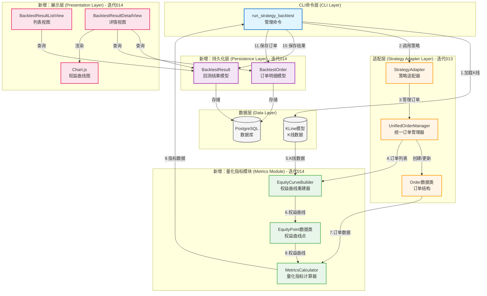
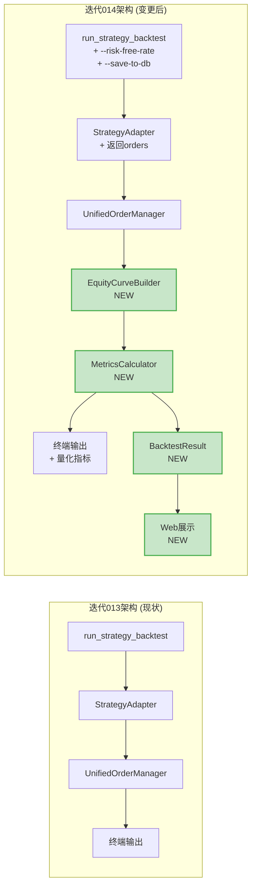

# 量化回测指标系统 - 技术架构设计

**迭代编号**: 014
**分支**: 014-quantitative-metrics
**文档版本**: v1.0.0
**创建日期**: 2026-01-06
**生命周期阶段**: P4 - 架构设计

---

## 1. 需求概述

### 1.1 核心业务目标

**一句话定义**：为策略回测系统补充专业级量化指标计算能力，使策略研究人员能够科学评估策略质量、风险收益特征和交易效率。

### 1.2 关键功能点

#### P0核心功能（本迭代实现）

**量化指标计算模块**（17个P0指标）：
- 收益分析（3个）：APR、绝对收益、累计收益率
- 风险分析（4个）：权益曲线重建、最大回撤(MDD)、恢复时间、波动率
- 风险调整收益（4个）：夏普率、卡玛比率、MAR比率、盈利因子
- 交易效率（4个）：交易频率、成本占比、胜率、盈亏比
- CLI增强（2个）：--risk-free-rate参数、分层报告输出

**数据持久化与展示**（6个P0功能）：
- 数据模型（2个）：BacktestResult、BacktestOrder
- CLI参数（1个）：--save-to-db
- Web展示（3个）：回测结果列表页、详情页、Chart.js权益曲线图

### 1.3 关键用户流程

**流程1：命令行回测并查看量化指标**
1. 执行：`python manage.py run_strategy_backtest ETHUSDT --risk-free-rate 3.0`
2. 系统计算17个P0核心指标
3. 终端输出分层报告（默认模式）

**流程2：保存回测结果并Web查看**
1. 执行：`python manage.py run_strategy_backtest ETHUSDT --save-to-db`
2. 系统保存回测结果到数据库
3. 访问`/backtest/results/`查看列表
4. 点击详情页查看权益曲线图和完整指标

---

## 2. 架构继承与演进分析

### 2.1 架构继承清单

基于迭代013（策略适配层）的现有架构：

**必须继承的架构特性**：
- ✅ **单一职责原则**：每个类/模块专注单一功能
- ✅ **依赖注入**：UnifiedOrderManager通过构造函数注入
- ✅ **无状态设计**：计算类不保存中间状态
- ✅ **Decimal精度**：所有金额和百分比使用Decimal
- ✅ **Django ORM**：使用Django模型进行数据持久化

**建议继承的特性**：
- ✅ **dataclass定义数据结构**：保持一致性
- ✅ **完整类型提示**：使用typing模块
- ✅ **logger日志记录**：记录关键操作

**可替换的组件**：
- 无（本迭代完全基于现有架构增量扩展）

### 2.2 复用能力评估

| 组件/服务 | 复用方式 | 适配成本 | 风险等级 | 决策 |
|---------|---------|---------|---------|------|
| **UnifiedOrderManager** | 直接复用 | 低 | 低 | ✅ 复用 |
| **Order数据类** | 直接复用 | 低 | 低 | ✅ 复用 |
| **StrategyAdapter** | 接口扩展 | 中 | 中 | ✅ 复用并扩展 |
| **run_strategy_backtest** | 参数扩展 | 低 | 低 | ✅ 复用并扩展 |
| **KLine模型** | 直接复用 | 低 | 低 | ✅ 复用 |
| **Django ORM** | 直接复用 | 低 | 低 | ✅ 复用 |

### 2.3 架构一致性检查

**设计原则一致性**: ✅ 通过
- MetricsCalculator遵循单一职责原则
- EquityCurveBuilder独立工具类，不修改StrategyAdapter核心逻辑

**技术栈一致性**: ✅ 通过
- 继续使用pandas/numpy进行数据处理
- 继续使用Decimal保证精度
- 继续使用Django ORM

**编码规范一致性**: ✅ 通过
- 方法命名：calculate_xxx()
- 数据结构：dataclass
- 日志记录：logger.info()

**架构模式一致性**: ✅ 通过
- 工具类模式：EquityCurveBuilder（类似SignalConverter）
- 计算类模式：MetricsCalculator（独立计算模块）

### 2.4 演进路径建议

**阶段1**：增量扩展现有架构（本迭代）
- 新增MetricsCalculator独立模块
- 新增EquityCurveBuilder工具类
- 扩展run_strategy_backtest命令
- 新增strategy_adapter.models模块

**阶段2**：性能优化（未来迭代）
- 优化权益曲线重建算法（实时记录 vs 事后重建）
- 优化大规模数据可视化（数据抽样）

**阶段3**：功能增强（未来迭代）
- 支持P1高级指标（索提诺比率、VaR/CVaR等）
- 支持相对收益分析（Alpha、Beta，需要基准数据）

---

## 3. 核心架构设计

### 3.1 系统架构图

### 3.2 架构说明

#### 核心组件职责

**CLI命令层**
- **run_strategy_backtest**：命令行入口，协调各模块
  - 加载K线数据
  - 调用StrategyAdapter执行回测
  - 调用MetricsCalculator计算指标
  - 保存回测结果到数据库（如果指定--save-to-db）
  - 输出分层报告

**适配层（复用迭代013）**
- **StrategyAdapter**：策略回测流程编排
- **UnifiedOrderManager**：订单管理和基础统计
- **Order数据类**：订单数据结构

**量化指标模块（新增）**
- **EquityCurveBuilder**：从订单和K线重建权益曲线
- **MetricsCalculator**：计算17个P0量化指标
- **EquityPoint数据类**：权益曲线时间点数据结构

**持久化层（新增）**
- **BacktestResult模型**：回测结果存储（JSONField存储equity_curve和metrics）
- **BacktestOrder模型**：订单明细存储

**展示层（新增）**
- **BacktestResultListView**：回测结果列表页（筛选、分页）
- **BacktestResultDetailView**：回测结果详情页（指标卡片、订单列表）
- **Chart.js**：权益曲线图可视化

### 3.3 数据流说明

**阶段1：回测执行（步骤1-3）**
1. run_strategy_backtest加载K线数据
2. 调用StrategyAdapter.adapt_for_backtest()
3. UnifiedOrderManager管理订单生命周期

**阶段2：量化指标计算（步骤4-8）**
4. UnifiedOrderManager输出订单列表
5. EquityCurveBuilder接收K线数据
6. EquityCurveBuilder生成权益曲线（List[EquityPoint]）
7. MetricsCalculator接收订单数据
8. MetricsCalculator接收权益曲线

**阶段3：数据持久化（步骤9-11）**
9. MetricsCalculator返回指标字典
10. run_strategy_backtest保存BacktestResult
11. run_strategy_backtest批量创建BacktestOrder

**阶段4：Web展示（用户访问）**
- 用户访问`/backtest/results/`
- BacktestResultListView查询BacktestResult列表
- 用户点击详情
- BacktestResultDetailView渲染指标和Chart.js图表

---

## 4. 底层原子服务定义 (Critical Foundation)

⚠️ **注意**: 此部分定义的组件是系统的基石，任何变更必须经过严格的回归测试。

### 4.1 [Core-Atomic] EquityCurveBuilder - 核心原子服务

**服务层级**: Atomic

**职责**:
从订单记录和K线数据重建账户净值时间序列（权益曲线），不涉及任何指标计算逻辑

**接口契约**:
- **Input**:
  - orders (List[Order], 订单列表，必须包含open_timestamp、close_timestamp、quantity、position_value等字段)
  - klines (pd.DataFrame, K线数据，必须包含open_time、close列)
  - initial_cash (Decimal, 初始资金，必须>0)

- **Output**:
  - equity_curve (List[EquityPoint], 权益曲线时间序列)
  - 每个EquityPoint包含：timestamp(int), cash(Decimal), position_value(Decimal), equity(Decimal), equity_rate(Decimal)

- **异常**:
  - ValueError: 当initial_cash <= 0时触发
  - ValueError: 当klines为空DataFrame时触发
  - ValueError: 当klines缺少必需列（open_time、close）时触发

**核心保障策略**:
- 净值计算确定性：相同输入必定产生相同权益曲线
- 边界检查：验证所有输入参数的有效性
- 精度保障：使用Decimal进行所有金额计算

**测试重点**:
- 正常场景：标准订单列表+K线数据，验证权益曲线正确性
- 边界场景：无订单、所有订单未平仓、K线数量=1
- 异常场景：初始资金=0、K线数据为空、K线缺少必需列

**映射需求**:
对应PRD [P0] 风险指标模块 - FP-014-004权益曲线重建

**业务支撑**:
- 支撑流程1：MDD计算（需要完整权益曲线）
- 支撑流程2：波动率计算（需要完整权益曲线）
- 支撑流程3：回测结果保存（equity_curve字段）

---

### 4.2 [Core-Atomic] MetricsCalculator - 核心原子服务

**服务层级**: Atomic

**职责**:
计算量化回测指标，不涉及任何订单管理或数据持久化逻辑

**接口契约**:
- **Input**:
  - orders (List[Order], 订单列表，必须包含profit_loss、profit_loss_rate、status等字段)
  - equity_curve (List[EquityPoint], 权益曲线，必须包含timestamp、equity字段)
  - initial_cash (Decimal, 初始资金，必须>0)
  - days (int, 回测天数，必须>0)
  - risk_free_rate (Decimal, 无风险收益率，默认0.03，范围0-1)

- **Output**:
  - metrics (Dict[str, Decimal], 指标字典，包含17个P0指标)
  - 包含字段：apr, cumulative_return, mdd, volatility, sharpe_ratio, calmar_ratio等

- **异常**:
  - ValueError: 当initial_cash <= 0时触发
  - ValueError: 当days <= 0时触发
  - ValueError: 当risk_free_rate < 0 或 > 1时触发
  - ZeroDivisionError: 当波动率=0且计算夏普率时，返回None

**核心保障策略**:
- 计算确定性：相同输入必定产生相同指标
- 除零保护：所有除法运算检查分母不为0
- 精度保障：所有指标保留2位小数（使用Decimal.quantize）
- 边界处理：无已平仓订单时，返回默认值（如MDD=0）

**测试重点**:
- 正常场景：标准订单列表+权益曲线，验证所有17个指标正确性
- 边界场景：无已平仓订单、MDD=0、波动率=0
- 异常场景：初始资金=0、回测天数=0、无风险收益率超出范围
- 精度测试：Decimal计算精度验证

**映射需求**:
对应PRD [P0] 量化指标计算模块 - FP-014-001至FP-014-015

**业务支撑**:
- 支撑流程1：CLI报告输出（_display_results方法）
- 支撑流程2：回测结果保存（metrics字段）
- 支撑流程3：Web详情页展示（指标卡片）

---

## 5. 组件与需求映射

| 组件名称 | 负责实现的功能点（FP编号） |
|---------|---------------------------|
| **EquityCurveBuilder** | FP-014-004：权益曲线重建 |
| **EquityPoint数据类** | FP-014-004：权益曲线数据结构 |
| **MetricsCalculator** | FP-014-001至FP-014-015：17个P0指标计算 |
| **run_strategy_backtest扩展** | FP-014-016：分层报告输出 FP-014-017：--risk-free-rate参数 FP-014-020：--save-to-db参数 |
| **BacktestResult模型** | FP-014-018：回测结果数据模型 |
| **BacktestOrder模型** | FP-014-019：订单明细数据模型 |
| **BacktestResultListView** | FP-014-021：回测结果列表页 |
| **BacktestResultDetailView** | FP-014-022：回测结果详情页 |
| **Chart.js权益曲线图** | FP-014-023：权益曲线可视化 |

**覆盖率**: 23个P0功能点全部映射到具体组件，无遗漏。

---

## 6. 复用服务契约定义

### 6.1 UnifiedOrderManager - 直接复用

**服务层级**: Atomic
**复用方式**: 直接复用（无需修改）

**现有服务信息**:
- **原始职责**: 订单创建、更新、查询、基础统计计算
- **当前状态**: 迭代013已实现，维护良好
- **技术栈**: Python 3.12 + Decimal精度计算
- **文档位置**: docs/iterations/013-strategy-adapter-layer/architecture.md

**复用适配**:
- **保留功能**: create_order()、update_order()、get_open_orders()、calculate_statistics()
- **扩展功能**: 无需扩展
- **修改接口**: 无需修改
- **新增接口**: 无需新增

**接口契约**:
- **Input**:
  - signal (Dict, 买入/卖出信号) - 复用
  - commission_rate (Decimal, 手续费率) - 复用

- **Output**:
  - Order对象（包含profit_loss、profit_loss_rate等字段） - 复用
  - statistics字典（包含win_rate、total_profit等） - 复用

**适配成本**: 无（直接复用）
**风险等级**: 低

**质量保障**:
- **回归测试**: 无需（不修改UnifiedOrderManager）
- **新增测试**: 无需
- **性能验证**: 无需

**支撑需求**:
对应PRD [P0] 基础统计模块 - 直接复用现有实现

---

### 6.2 StrategyAdapter - 接口扩展复用

**服务层级**: Orchestration
**复用方式**: 接口扩展（返回值扩展）

**现有服务信息**:
- **原始职责**: 策略回测流程编排
- **当前状态**: 迭代013已实现
- **技术栈**: Python 3.12 + pandas
- **文档位置**: docs/iterations/013-strategy-adapter-layer/architecture.md

**复用适配**:
- **保留功能**: adapt_for_backtest()核心流程
- **扩展功能**: 返回值增加orders列表（用于MetricsCalculator）
- **修改接口**: adapt_for_backtest()返回值从Dict扩展为包含'orders'键
- **新增接口**: 无需新增

**接口契约**:
- **Input**:
  - klines (pd.DataFrame) - 复用
  - indicators (pd.DataFrame) - 复用
  - initial_cash (Decimal) - 复用

- **Output**:
  - result (Dict) - 扩展
    - 'entries' (pd.Series) - 复用
    - 'exits' (pd.Series) - 复用
    - 'statistics' (Dict) - 复用
    - **'orders' (List[Order])** - 新增（用于MetricsCalculator）

**适配成本**: 低（仅修改返回值）
**风险等级**: 低（非破坏性扩展）

**质量保障**:
- **回归测试**: 验证现有返回字段不受影响
- **新增测试**: 验证'orders'字段正确返回
- **性能验证**: 无影响（orders列表已存在于UnifiedOrderManager中）

**支撑需求**:
对应PRD [P0] 量化指标模块 - 提供订单数据给MetricsCalculator

---

### 6.3 Order数据类 - 直接复用

**服务层级**: Data Model
**复用方式**: 直接复用（无需修改）

**现有服务信息**:
- **原始职责**: 订单数据结构定义
- **当前状态**: 迭代013已实现
- **技术栈**: Python dataclass + Decimal
- **文档位置**: strategy_adapter/models/order.py

**复用适配**:
- **保留功能**: 所有现有字段（id、open_timestamp、close_timestamp、profit_loss等）
- **扩展功能**: 无需扩展
- **修改接口**: 无需修改
- **新增接口**: 无需新增

**接口契约**:
- **字段定义**:
  - id (str) - 复用
  - open_timestamp (int) - 复用
  - close_timestamp (int|None) - 复用
  - buy_price (Decimal) - 复用
  - sell_price (Decimal|None) - 复用
  - quantity (Decimal) - 复用
  - position_value (Decimal) - 复用
  - profit_loss (Decimal|None) - 复用
  - profit_loss_rate (Decimal|None) - 复用
  - status (OrderStatus) - 复用

**适配成本**: 无（直接复用）
**风险等级**: 低

**质量保障**:
- **回归测试**: 无需（不修改Order数据类）
- **新增测试**: 无需
- **性能验证**: 无需

**支撑需求**:
对应PRD [P0] 订单数据结构 - 直接复用现有定义

---

## 7. 关键技术决策

### 决策点1: 权益曲线生成方式

**选定方案**: 事后从订单记录重建（方案A）
**决策日期**: 2026-01-06
**决策人**: PowerBy Architect
**理由**:
1. 最小改动原则：不修改StrategyAdapter核心流程
2. 单一职责：EquityCurveBuilder独立工具类
3. 可测试性：重建逻辑可独立测试
4. 可逆性：未来可无痛迁移到实时记录方案

**风险与缓解措施**:
- **风险**: 重建过程可能较慢（遍历所有K线）
- **缓解**: 仅在--save-to-db时执行重建，不影响普通回测

**后续影响**: P1阶段可优化为实时记录（如果性能成为瓶颈）

---

### 决策点2: 无风险收益率配置

**选定方案**: CLI参数配置（方案A）
**决策日期**: 2026-01-06
**决策人**: PowerBy Architect
**理由**:
1. 灵活性：用户可根据市场环境调整（加密货币市场可能使用0%）
2. 一致性：与--commission-rate参数设计一致
3. 默认值合理：3%是传统金融市场常见值

**风险与缓解措施**:
- **风险**: 用户可能不理解无风险收益率含义
- **缓解**: 在help文档中详细说明，提供常见值参考

**后续影响**: 未来可扩展为从配置文件读取

---

### 决策点3: 指标计算模块设计

**选定方案**: 独立的MetricsCalculator模块（方案A）
**决策日期**: 2026-01-06
**决策人**: PowerBy Architect
**理由**:
1. 单一职责：MetricsCalculator专注指标计算
2. 可测试性：可独立测试所有指标算法
3. 可维护性：指标计算逻辑集中管理
4. 符合constitution.md的SOLID原则

**风险与缓解措施**:
- **风险**: 指标计算算法实现错误
- **缓解**: 完整单元测试覆盖，与QuantStats结果对比验证

**后续影响**: 后续添加P1指标只需扩展MetricsCalculator

---

### 决策点4: 数据持久化模型选择

**选定方案**: strategy_adapter中新建BacktestResult模型（方案A）
**决策日期**: 2026-01-06
**决策人**: PowerBy Architect
**理由**:
1. 模块独立性：strategy_adapter自包含
2. 清晰职责：回测结果属于策略适配层
3. 解耦：减少与backtest模块的依赖

**风险与缓解措施**:
- **风险**: 数据模型可能与backtest.BacktestResult重复
- **缓解**: 设计差异化字段（equity_curve、metrics JSONField）

**后续影响**: strategy_adapter模块可独立演进

---

## 8. 变更点说明

### 8.1 变更概述

基于PRD中的功能需求分析，当前架构需要进行以下主要变更：

1. **新增量化指标计算能力**：补充专业级量化指标（MDD、夏普率等）
2. **新增权益曲线跟踪**：从订单记录重建账户净值时间序列
3. **新增数据持久化**：支持回测结果保存到数据库
4. **新增Web展示能力**：提供回测结果列表和详情页
5. **扩展CLI功能**：新增--risk-free-rate、--save-to-db参数

### 8.2 架构变更对比

#### 当前架构 (迭代013)

**核心组件**：
- StrategyAdapter：策略回测流程编排
- UnifiedOrderManager：订单管理和基础统计
- run_strategy_backtest：CLI命令（仅终端输出）

**能力范围**：
- ✅ 订单管理
- ✅ 基础统计（胜率、总盈亏、手续费）
- ❌ 量化指标计算
- ❌ 权益曲线跟踪
- ❌ 数据持久化
- ❌ Web展示

#### 目标架构 (迭代014)

**新增组件**：
- ✨ **MetricsCalculator**：量化指标计算器（17个P0指标）
- ✨ **EquityCurveBuilder**：权益曲线重建器
- ✨ **BacktestResult/BacktestOrder**：数据持久化模型
- ✨ **BacktestResultListView/DetailView**：Web展示视图
- ✨ **Chart.js集成**：权益曲线可视化

**能力扩展**：
- ✅ 订单管理（复用）
- ✅ 基础统计（复用）
- ✨ **量化指标计算**（新增）
- ✨ **权益曲线跟踪**（新增）
- ✨ **数据持久化**（新增）
- ✨ **Web展示**（新增）

### 8.3 具体变更点清单

| 变更类型 | 组件/模块 | 变更描述 | 影响范围 | 风险等级 |
|---------|---------|---------|---------|---------|
| **NEW** | MetricsCalculator | 新增量化指标计算模块 | 独立模块，无影响 | 低 |
| **NEW** | EquityCurveBuilder | 新增权益曲线重建工具类 | 独立模块，无影响 | 低 |
| **NEW** | EquityPoint | 新增权益曲线点数据类 | 独立模块，无影响 | 低 |
| **NEW** | BacktestResult模型 | 新增回测结果数据模型 | 新增数据库表 | 中 |
| **NEW** | BacktestOrder模型 | 新增订单明细数据模型 | 新增数据库表 | 中 |
| **MODIFIED** | run_strategy_backtest | 新增CLI参数和报告输出逻辑 | CLI命令扩展 | 低 |
| **MODIFIED** | StrategyAdapter | 返回值扩展（新增'orders'字段） | 非破坏性扩展 | 低 |
| **NEW** | BacktestResultListView | 新增回测结果列表视图 | 新增URL路由 | 低 |
| **NEW** | BacktestResultDetailView | 新增回测结果详情视图 | 新增URL路由 | 低 |
| **NEW** | Chart.js集成 | 新增前端可视化库 | 新增静态资源 | 低 |

### 8.4 变更前后对比图

### 8.5 技术影响分析

#### 新增技术栈
- **Chart.js**: 前端可视化库 - 轻量级，团队无学习成本
- **无其他新增依赖**：完全复用pandas/numpy

#### 性能影响
- **改进点**:
  - 量化指标计算：一次性计算所有指标（O(n)复杂度）
  - 权益曲线重建：仅在--save-to-db时执行，不影响普通回测
- **风险点**:
  - 大规模K线数据（>10000根）时权益曲线重建可能较慢（预计<5秒）

#### 依赖变更
- **新增依赖**: 无（完全复用现有技术栈）
- **升级依赖**: 无

#### 数据库变更
- **新增表**:
  - strategy_adapter_backtestresult（包含JSONField）
  - strategy_adapter_backtestorder
- **迁移文件**: 需要创建Django migration

### 8.6 风险等级评估

**Core-Atomic服务** ⚠️:
- **EquityCurveBuilder**: 中风险（算法准确性依赖测试验证）
- **MetricsCalculator**: 中风险（17个指标算法需要完整测试）

**普通原子服务** ⚡:
- **EquityPoint**: 低风险（简单数据类）
- **BacktestResult/BacktestOrder**: 中风险（数据库模型设计）

**编排服务** ✅:
- **run_strategy_backtest扩展**: 低风险（非破坏性扩展）
- **BacktestResultListView/DetailView**: 低风险（独立视图）

### 8.7 核心保障策略

**所有Core-Atomic服务必须**:
- ✅ 通过完整单元测试（覆盖率>90%）
- ✅ 通过集成测试（端到端验证）
- ✅ 边界条件测试（空数据、极值等）
- ✅ 精度验证（Decimal计算）

**数据一致性保障**:
- ✅ 使用Django事务保证BacktestResult和BacktestOrder原子性保存
- ✅ equity_curve和metrics使用JSONField.default=dict避免NULL

**异常场景保障**:
- ✅ MetricsCalculator所有除法运算进行除零保护
- ✅ EquityCurveBuilder验证所有输入参数有效性
- ✅ Web视图处理数据不存在情况（返回404）

---

## 9. Gate 4 检查

### 9.1 检查清单

#### 架构完整性
- [x] 架构图清晰表达了系统结构
- [x] 每个组件的职责明确且有需求映射
- [x] 所有23个P0功能点已映射到组件

#### 原子服务契约
- [x] 是否已识别所有原子级服务（EquityCurveBuilder、MetricsCalculator）
- [x] 是否已区分编排级服务（run_strategy_backtest、Views）
- [x] 每个原子服务是否包含唯一职责描述
- [x] 每个原子服务是否包含完整的Input定义
- [x] 每个原子服务是否包含完整的Output定义
- [x] 每个原子服务是否包含异常边界定义
- [x] 每个原子服务是否包含确定性测试建议
- [x] Core-Atomic服务（EquityCurveBuilder、MetricsCalculator）已特别标记
- [x] Core-Atomic服务已提升测试优先级

#### 复用服务契约
- [x] 是否完成现有服务可复用性评估（UnifiedOrderManager、Order等）
- [x] 是否建立复用服务契约档案（复用方式、适配成本、风险等级）
- [x] 是否评估复用适配成本和风险

#### 架构一致性
- [x] 是否进行架构一致性检查（设计原则、技术栈、编码规范、架构模式）
- [x] 新设计是否与现有架构保持一致性
- [x] 是否遵循constitution.md的核心原则（SOLID、DRY、单一职责等）

#### 变更点说明
- [x] 是否有关键概述说明为什么需要变更
- [x] 是否有Mermaid架构变更前后对比图
- [x] 是否有NEW/MODIFIED变更点清单表格
- [x] 是否有技术影响分析(技术栈、性能、依赖)
- [x] 是否有风险等级评估(高/中/低，包含Core-Atomic服务评估)

#### 技术决策
- [x] 所有关键技术决策已完成并记录
- [x] 架构设计符合PRD要求
- [x] 非功能需求（性能、安全等）已考虑

#### 演进路径
- [x] 是否完成架构继承分析
- [x] 是否评估演进路径可行性
- [x] 是否识别技术债务和限制

### 9.2 Gate 4 检查结果

**✅ 通过** - 可以进入P5阶段

**通过理由**:
1. 架构设计完整，所有23个P0功能点已映射到组件
2. 原子服务契约定义完整（EquityCurveBuilder、MetricsCalculator）
3. 复用服务契约清晰（UnifiedOrderManager、Order、StrategyAdapter）
4. 架构一致性检查通过（遵循constitution.md原则）
5. 变更点说明完整（对比图、技术影响、风险评估）
6. 关键技术决策已完成（4个决策点均有记录）
7. 演进路径清晰（阶段1-3规划）

### 9.3 下一步行动

**推荐进入**: P5阶段（开发规划）

**使用技能**: `powerby-engineer` skill

**关键交付物**:
1. tasks.md（任务拆解文档）
2. 完整的单元测试（17个指标 + EquityCurveBuilder）
3. Django migration文件
4. Web视图和模板

---

**文档版本**: v1.0.0
**创建日期**: 2026-01-06
**P4阶段状态**: ✅ 已完成，等待用户确认
**下一步**: 使用 `powerby-engineer` 进行P5-P6阶段（开发规划+实现）
