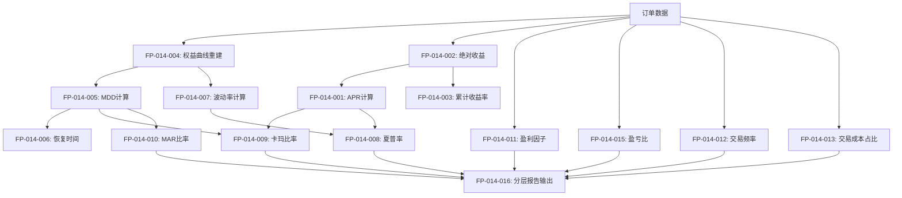

# 功能点清单 - 量化回测指标系统

**迭代编号**: 014
**文档版本**: v1.0.0
**创建日期**: 2026-01-06
**关联PRD**: [prd.md](./prd.md)

---

## 一、功能点总览

### 统计信息

| 统计项 | 数量 |
|--------|------|
| **总功能点** | 31 |
| **P0 (MVP必备)** | 23 |
| **P1 (可推迟)** | 8 |
| **已实现** | 2 (复用现有) |
| **需新增** | 29 |

### 优先级分布

```
P0 (MVP必备): ████████████████████████ 23个 (74%)
P1 (可推迟):   ████████ 8个 (26%)
```

---

## 二、P0功能点清单（MVP必备）

### 📊 收益指标模块（3个）

#### FP-014-001: 年化收益率(APR)计算

**优先级**: [P0] MVP必备

**功能描述**:
基于总收益和回测天数，计算策略的年化收益率，用于衡量策略的盈利能力。

**计算公式**:
```
APR = (total_profit / initial_cash) × (365 / days) × 100%
```

**输入数据**:
- `total_profit` (Decimal): 总盈亏（USDT）
- `initial_cash` (Decimal): 初始资金（USDT）
- `days` (int): 回测天数

**输出数据**:
- `apr` (Decimal): 年化收益率（百分比，保留2位小数）

**验收标准**:
- ✅ 回测365天，总收益10%，APR = 10.00%
- ✅ 回测182.5天，总收益10%，APR = 20.00%
- ✅ 回测30天，总收益5%，APR = 60.83%
- ✅ 总收益为负时，APR为负值

**实现位置**:
- 类：`MetricsCalculator`
- 方法：`calculate_apr(total_profit, initial_cash, days) -> Decimal`
- 文件：`strategy_adapter/core/metrics_calculator.py`

**依赖关系**:
- 依赖：UnifiedOrderManager.calculate_statistics()（提供total_profit）
- 被依赖：夏普率计算、卡玛比率计算

**边界条件**:
- `days = 0`: 抛出ValueError
- `initial_cash = 0`: 抛出ValueError
- `total_profit为负`: 正常计算（负APR）

**测试用例**:
```python
# 测试1：标准年化（365天）
assert calculate_apr(Decimal("1000"), Decimal("10000"), 365) == Decimal("10.00")

# 测试2：短期年化（30天）
assert calculate_apr(Decimal("500"), Decimal("10000"), 30) == Decimal("60.83")

# 测试3：亏损年化
assert calculate_apr(Decimal("-500"), Decimal("10000"), 365) == Decimal("-5.00")
```

---

#### FP-014-002: 绝对收益计算

**优先级**: [P0] MVP必备

**功能描述**:
回测期间的总盈亏金额（USDT），直接反映策略的盈利能力。

**计算公式**:
```
绝对收益 = total_profit（已由UnifiedOrderManager计算）
```

**输入数据**:
- 复用：`UnifiedOrderManager.calculate_statistics()['total_profit']`

**输出数据**:
- `absolute_return` (Decimal): 绝对收益（USDT，保留2位小数）

**验收标准**:
- ✅ 绝对收益与所有已平仓订单盈亏总和一致
- ✅ 正确反映盈利和亏损
- ✅ 精度保留2位小数

**实现位置**:
- 复用：`UnifiedOrderManager.calculate_statistics()`
- 字段：`statistics['total_profit']`

**依赖关系**:
- 依赖：所有已平仓订单的profit_loss字段
- 被依赖：APR计算、累计收益率计算

**边界条件**:
- 无已平仓订单：返回Decimal("0")
- 所有订单亏损：返回负值

**测试用例**:
```python
# 测试1：复用现有统计
statistics = order_manager.calculate_statistics(orders)
assert statistics['total_profit'] == sum(o.profit_loss for o in closed_orders)
```

---

#### FP-014-003: 累计收益率计算

**优先级**: [P0] MVP必备

**功能描述**:
回测期间的总收益率，衡量策略相对于初始资金的盈利比例。

**计算公式**:
```
累计收益率 = (total_profit / initial_cash) × 100%
```

**输入数据**:
- `total_profit` (Decimal): 总盈亏
- `initial_cash` (Decimal): 初始资金

**输出数据**:
- `cumulative_return` (Decimal): 累计收益率（百分比，保留2位小数）

**验收标准**:
- ✅ 初始资金10000，总收益1000，累计收益率 = 10.00%
- ✅ 初始资金10000，总亏损500，累计收益率 = -5.00%
- ✅ 初始资金10000，总收益0，累计收益率 = 0.00%

**实现位置**:
- 类：`MetricsCalculator`
- 方法：`calculate_cumulative_return(total_profit, initial_cash) -> Decimal`
- 文件：`strategy_adapter/core/metrics_calculator.py`

**依赖关系**:
- 依赖：total_profit, initial_cash
- 被依赖：MAR比率计算

**边界条件**:
- `initial_cash = 0`: 抛出ValueError
- `total_profit为负`: 正常计算（负收益率）

**测试用例**:
```python
# 测试1：正收益
assert calculate_cumulative_return(Decimal("1000"), Decimal("10000")) == Decimal("10.00")

# 测试2：负收益
assert calculate_cumulative_return(Decimal("-500"), Decimal("10000")) == Decimal("-5.00")
```

---

### 🛡️ 风险指标模块（4个）

#### FP-014-004: 权益曲线重建

**优先级**: [P0] MVP必备

**功能描述**:
从订单记录和K线数据，重建完整的账户净值时间序列（权益曲线），作为风险指标计算的基础数据。

**算法描述**:
1. 按时间顺序遍历K线数据
2. 在每个K线时间点：
   - 计算当前持仓市值 = sum(持仓订单.quantity × 当前价格)
   - 计算账户净值 = 可用资金 + 持仓市值
   - 记录EquityPoint(timestamp, cash, position_value, equity)
3. 返回完整的权益曲线列表

**输入数据**:
- `orders` (List[Order]): 所有订单列表
- `klines` (pd.DataFrame): K线数据（包含open_time, close列）
- `initial_cash` (Decimal): 初始资金

**输出数据**:
- `equity_curve` (List[EquityPoint]): 权益曲线
  - `timestamp` (int): 时间戳（毫秒）
  - `cash` (Decimal): 可用资金
  - `position_value` (Decimal): 持仓市值
  - `equity` (Decimal): 账户净值
  - `equity_rate` (Decimal): 净值变化率（相对于初始资金）

**验收标准**:
- ✅ 权益曲线第一个点的equity = 初始资金
- ✅ 权益曲线最后一个点的equity = 初始资金 + 总盈亏（如果所有订单已平仓）
- ✅ 权益曲线长度 = K线数量
- ✅ 每个时间点的equity = cash + position_value
- ✅ 持仓市值计算正确（考虑多个订单）

**实现位置**:
- 类：`EquityCurveBuilder`（新增工具类）
- 方法：`build_from_orders(orders, klines, initial_cash) -> List[EquityPoint]`
- 文件：`strategy_adapter/core/equity_curve_builder.py`

**依赖关系**:
- 依赖：Order模型、K线数据
- 被依赖：MDD计算、波动率计算、恢复时间计算

**边界条件**:
- K线数据为空：返回空列表
- 无任何订单：权益曲线恒等于初始资金
- 订单数量 > 0但未平仓：最后一个点的equity包含持仓市值

**测试用例**:
```python
# 测试1：基本重建
curve = EquityCurveBuilder.build_from_orders(orders, klines, Decimal("10000"))
assert curve[0].equity == Decimal("10000")
assert len(curve) == len(klines)

# 测试2：净值计算
for point in curve:
    assert point.equity == point.cash + point.position_value
```

---

#### FP-014-005: 最大回撤(MDD)计算

**优先级**: [P0] MVP必备

**功能描述**:
权益曲线从最高点到最低点的最大跌幅，衡量策略在最糟糕情况下的潜在亏损。

**计算公式**:
```
MDD = min((equity - max_equity_so_far) / max_equity_so_far) × 100%
```

**算法描述**:
1. 遍历权益曲线
2. 维护历史最高净值 `max_equity_so_far`
3. 计算每个点的回撤：`drawdown = (equity - max_equity_so_far) / max_equity_so_far`
4. 取最小值作为MDD
5. 记录MDD发生的时间点

**输入数据**:
- `equity_curve` (List[EquityPoint]): 权益曲线

**输出数据**:
- 返回字典：
  - `mdd` (Decimal): 最大回撤（百分比，保留2位小数）
  - `mdd_start_time` (int): MDD开始时间（历史最高点时间）
  - `mdd_end_time` (int): MDD结束时间（最低点时间）
  - `recovery_time` (int|None): 恢复时间（天数，如果未恢复则为None）

**验收标准**:
- ✅ 持续盈利无回撤，MDD = 0.00%
- ✅ 从10000跌到9000再涨回10000，MDD = -10.00%
- ✅ 从10000涨到12000再跌到10800，MDD = -10.00%（从12000到10800）
- ✅ 正确记录MDD发生的时间点

**实现位置**:
- 类：`MetricsCalculator`
- 方法：`calculate_mdd(equity_curve) -> Dict`
- 文件：`strategy_adapter/core/metrics_calculator.py`

**依赖关系**:
- 依赖：权益曲线
- 被依赖：卡玛比率、MAR比率、恢复时间计算

**边界条件**:
- 权益曲线为空：返回MDD=0, recovery_time=None
- 权益曲线只有1个点：返回MDD=0, recovery_time=None
- 持续上涨无回撤：返回MDD=0, recovery_time=0

**测试用例**:
```python
# 测试1：无回撤
curve = [EquityPoint(equity=Decimal("10000")), EquityPoint(equity=Decimal("11000"))]
result = calculate_mdd(curve)
assert result['mdd'] == Decimal("0.00")

# 测试2：标准回撤
curve = [
    EquityPoint(equity=Decimal("10000")),
    EquityPoint(equity=Decimal("12000")),
    EquityPoint(equity=Decimal("10800")),
]
result = calculate_mdd(curve)
assert result['mdd'] == Decimal("-10.00")
```

---

#### FP-014-006: 恢复时间计算

**优先级**: [P0] MVP必备

**功能描述**:
从MDD发生到净值恢复到前高点的时间间隔，衡量策略在亏损后的恢复能力。

**计算公式**:
```
恢复时间 = MDD恢复时间点 - MDD发生时间点（单位：天或K线根数）
```

**算法描述**:
1. 基于FP-014-005的MDD计算结果
2. 从MDD结束时间点开始，向后遍历权益曲线
3. 查找第一个净值 >= MDD开始时的最高净值的时间点
4. 计算时间差

**输入数据**:
- `equity_curve` (List[EquityPoint]): 权益曲线
- `mdd_result` (Dict): FP-014-005的输出结果

**输出数据**:
- `recovery_time` (int|None): 恢复时间（天数，如果未恢复则为None）

**验收标准**:
- ✅ 如果未恢复到前高点，显示"未恢复"
- ✅ 如果已恢复，显示天数（或K线根数）
- ✅ 如果MDD=0，恢复时间=0

**实现位置**:
- 集成在：`MetricsCalculator.calculate_mdd()`方法中
- 作为返回字典的一部分

**依赖关系**:
- 依赖：MDD计算结果、权益曲线
- 被依赖：风险报告输出

**边界条件**:
- MDD = 0：恢复时间 = 0
- 未恢复到前高：恢复时间 = None
- 多次回撤多次恢复：取第一次恢复时间

**测试用例**:
```python
# 测试1：已恢复
curve = [
    EquityPoint(timestamp=0, equity=Decimal("10000")),
    EquityPoint(timestamp=86400000, equity=Decimal("12000")),  # +1天
    EquityPoint(timestamp=172800000, equity=Decimal("10800")),  # +2天（MDD）
    EquityPoint(timestamp=259200000, equity=Decimal("12000")),  # +3天（恢复）
]
result = calculate_mdd(curve)
assert result['recovery_time'] == 1  # 从day2到day3，1天

# 测试2：未恢复
curve.append(EquityPoint(timestamp=345600000, equity=Decimal("11500")))  # +4天（仍未恢复）
result = calculate_mdd(curve)
assert result['recovery_time'] is None
```

---

#### FP-014-007: 波动率计算

**优先级**: [P0] MVP必备

**功能描述**:
收益率的标准差（年化），衡量策略收益的波动幅度。

**计算公式**:
```
daily_returns = [(equity[i] - equity[i-1]) / equity[i-1] for i in range(1, len(curve))]
Volatility = std(daily_returns) × sqrt(252)  # 年化（假设252个交易日）
```

**算法描述**:
1. 从权益曲线计算每日收益率序列
2. 计算收益率的标准差
3. 年化：标准差 × sqrt(252)

**输入数据**:
- `equity_curve` (List[EquityPoint]): 权益曲线

**输出数据**:
- `volatility` (Decimal): 年化波动率（百分比，保留2位小数）

**验收标准**:
- ✅ 收益率稳定（每日变化小），波动率低
- ✅ 收益率大起大落，波动率高
- ✅ 正确年化（使用sqrt(252)）

**实现位置**:
- 类：`MetricsCalculator`
- 方法：`calculate_volatility(equity_curve) -> Decimal`
- 文件：`strategy_adapter/core/metrics_calculator.py`

**依赖关系**:
- 依赖：权益曲线
- 被依赖：夏普率计算

**边界条件**:
- 权益曲线 < 2个点：无法计算，返回Decimal("0")
- 所有收益率 = 0（无波动）：返回Decimal("0")

**测试用例**:
```python
# 测试1：无波动
curve = [EquityPoint(equity=Decimal("10000"))] * 100
assert calculate_volatility(curve) == Decimal("0.00")

# 测试2：标准波动（使用真实数据验证）
# （需要使用numpy.std验证）
```

---

### ⚖️ 风险调整收益模块（4个）

#### FP-014-008: 夏普率计算

**优先级**: [P0] MVP必备

**功能描述**:
单位风险下的超额收益，衡量策略在承担单位风险下获得的回报。

**计算公式**:
```
Sharpe Ratio = (APR - risk_free_rate) / Volatility
```

**输入数据**:
- `apr` (Decimal): 年化收益率
- `volatility` (Decimal): 年化波动率
- `risk_free_rate` (Decimal): 无风险收益率（默认3%）

**输出数据**:
- `sharpe_ratio` (Decimal): 夏普率（保留2位小数）

**验收标准**:
- ✅ APR = 12%, 无风险 = 3%, 波动率 = 15%, Sharpe = 0.60
- ✅ APR = 20%, 无风险 = 3%, 波动率 = 10%, Sharpe = 1.70
- ✅ 夏普率 > 1为优秀策略
- ✅ 夏普率 < 0说明收益低于无风险收益

**实现位置**:
- 类：`MetricsCalculator`
- 方法：`calculate_sharpe_ratio(apr, volatility) -> Decimal`
- 文件：`strategy_adapter/core/metrics_calculator.py`

**依赖关系**:
- 依赖：APR、波动率、无风险收益率
- 被依赖：风险调整收益报告

**边界条件**:
- 波动率 = 0：无法计算，返回None或"N/A"
- APR < 无风险收益率：夏普率为负

**测试用例**:
```python
# 测试1：标准计算
assert calculate_sharpe_ratio(
    apr=Decimal("12"),
    volatility=Decimal("15"),
    risk_free_rate=Decimal("3")
) == Decimal("0.60")

# 测试2：优秀策略
assert calculate_sharpe_ratio(
    apr=Decimal("20"),
    volatility=Decimal("10"),
    risk_free_rate=Decimal("3")
) == Decimal("1.70")
```

---

#### FP-014-009: 卡玛比率计算

**优先级**: [P0] MVP必备

**功能描述**:
年化收益率与最大回撤的比值，衡量策略在承受最大回撤情况下的收益能力。

**计算公式**:
```
Calmar Ratio = APR / abs(MDD)
```

**输入数据**:
- `apr` (Decimal): 年化收益率
- `mdd` (Decimal): 最大回撤（负值）

**输出数据**:
- `calmar_ratio` (Decimal): 卡玛比率（保留2位小数）

**验收标准**:
- ✅ APR = 12%, MDD = -10%, Calmar = 1.20
- ✅ APR = 20%, MDD = -5%, Calmar = 4.00
- ✅ 卡玛比率 > 1为优秀策略

**实现位置**:
- 类：`MetricsCalculator`
- 方法：`calculate_calmar_ratio(apr, mdd) -> Decimal`
- 文件：`strategy_adapter/core/metrics_calculator.py`

**依赖关系**:
- 依赖：APR、MDD
- 被依赖：风险调整收益报告

**边界条件**:
- MDD = 0：无法计算，返回None或"N/A"
- APR为负：卡玛比率为负

**测试用例**:
```python
# 测试1：标准计算
assert calculate_calmar_ratio(
    apr=Decimal("12"),
    mdd=Decimal("-10")
) == Decimal("1.20")

# 测试2：优秀策略
assert calculate_calmar_ratio(
    apr=Decimal("20"),
    mdd=Decimal("-5")
) == Decimal("4.00")
```

---

#### FP-014-010: MAR比率计算

**优先级**: [P0] MVP必备

**功能描述**:
累计收益与最大回撤的比值，衡量策略的收益相对于最大回撤的比例。

**计算公式**:
```
MAR Ratio = 累计收益率 / abs(MDD)
```

**输入数据**:
- `cumulative_return` (Decimal): 累计收益率
- `mdd` (Decimal): 最大回撤（负值）

**输出数据**:
- `mar_ratio` (Decimal): MAR比率（保留2位小数）

**验收标准**:
- ✅ 累计收益率 = 10%, MDD = -8%, MAR = 1.25
- ✅ 累计收益率 = 20%, MDD = -5%, MAR = 4.00
- ✅ MAR比率 > 1为优秀策略

**实现位置**:
- 类：`MetricsCalculator`
- 方法：`calculate_mar_ratio(cumulative_return, mdd) -> Decimal`
- 文件：`strategy_adapter/core/metrics_calculator.py`

**依赖关系**:
- 依赖：累计收益率、MDD
- 被依赖：风险调整收益报告

**边界条件**:
- MDD = 0：无法计算，返回None或"N/A"
- 累计收益率为负：MAR比率为负

**测试用例**:
```python
# 测试1：标准计算
assert calculate_mar_ratio(
    cumulative_return=Decimal("10"),
    mdd=Decimal("-8")
) == Decimal("1.25")
```

---

#### FP-014-011: 盈利因子计算

**优先级**: [P0] MVP必备

**功能描述**:
总盈利与总亏损的比值，衡量策略的盈利能力是否显著大于亏损。

**计算公式**:
```
Profit Factor = sum(盈利订单的profit_loss) / abs(sum(亏损订单的profit_loss))
```

**输入数据**:
- `orders` (List[Order]): 所有订单列表

**输出数据**:
- `profit_factor` (Decimal): 盈利因子（保留2位小数）

**验收标准**:
- ✅ 盈利因子 > 1说明策略盈利
- ✅ 盈利因子 > 1.5为优秀策略
- ✅ 盈利因子 = 2说明总盈利是总亏损的2倍

**实现位置**:
- 类：`MetricsCalculator`
- 方法：`calculate_profit_factor(orders) -> Decimal`
- 文件：`strategy_adapter/core/metrics_calculator.py`

**依赖关系**:
- 依赖：订单列表
- 被依赖：风险调整收益报告

**边界条件**:
- 无亏损订单：返回"∞"或None
- 无盈利订单：返回Decimal("0")
- 无已平仓订单：无法计算，返回None

**测试用例**:
```python
# 测试1：标准计算（总盈利2000，总亏损1000）
assert calculate_profit_factor(orders) == Decimal("2.00")

# 测试2：无亏损订单
assert calculate_profit_factor(only_profit_orders) is None or "∞"
```

---

### 💹 交易效率模块（4个）

#### FP-014-012: 交易频率计算

**优先级**: [P0] MVP必备

**功能描述**:
单位时间内的平均交易次数，衡量策略的交易活跃度。

**计算公式**:
```
交易频率 = total_orders / days  (单位：次/天)
```

**输入数据**:
- `total_orders` (int): 总交易次数
- `days` (int): 回测天数

**输出数据**:
- `trade_frequency` (Decimal): 交易频率（次/天，保留2位小数）

**验收标准**:
- ✅ 365天120笔交易，频率 = 0.33次/天
- ✅ 30天10笔交易，频率 = 0.33次/天
- ✅ 交易频率过高可能导致高额交易成本

**实现位置**:
- 类：`MetricsCalculator`
- 方法：`calculate_trade_frequency(total_orders, days) -> Decimal`
- 文件：`strategy_adapter/core/metrics_calculator.py`

**依赖关系**:
- 依赖：总订单数、回测天数
- 被依赖：交易效率报告

**边界条件**:
- days = 0：抛出ValueError
- total_orders = 0：返回Decimal("0")

**测试用例**:
```python
# 测试1：标准计算
assert calculate_trade_frequency(120, 365) == Decimal("0.33")

# 测试2：高频交易
assert calculate_trade_frequency(1000, 365) == Decimal("2.74")
```

---

#### FP-014-013: 交易成本占比计算

**优先级**: [P0] MVP必备

**功能描述**:
交易成本占总收益的比例，衡量交易成本对收益的侵蚀程度。

**计算公式**:
```
Cost Percentage = total_commission / total_profit × 100%
```

**输入数据**:
- `total_commission` (Decimal): 总手续费
- `total_profit` (Decimal): 总收益

**输出数据**:
- `cost_percentage` (Decimal): 成本占比（百分比，保留2位小数）

**验收标准**:
- ✅ 总收益1000，手续费20，成本占比 = 2.00%
- ✅ 总收益1000，手续费100，成本占比 = 10.00%
- ✅ 成本占比 < 5%为合理范围

**实现位置**:
- 类：`MetricsCalculator`
- 方法：`calculate_cost_percentage(total_commission, total_profit) -> Decimal`
- 文件：`strategy_adapter/core/metrics_calculator.py`

**依赖关系**:
- 依赖：total_commission, total_profit
- 被依赖：交易效率报告

**边界条件**:
- total_profit = 0：无法计算，返回None或"N/A"
- total_profit < 0（亏损）：成本占比无意义，返回None

**测试用例**:
```python
# 测试1：标准计算
assert calculate_cost_percentage(
    total_commission=Decimal("20"),
    total_profit=Decimal("1000")
) == Decimal("2.00")

# 测试2：高成本
assert calculate_cost_percentage(
    total_commission=Decimal("100"),
    total_profit=Decimal("1000")
) == Decimal("10.00")
```

---

#### FP-014-014: 胜率计算

**优先级**: [P0] MVP必备（复用现有）

**功能描述**:
盈利交易次数占总交易次数的比例。

**计算公式**:
```
Win Rate = win_orders / total_orders × 100%  (已实现)
```

**输入数据**:
- 复用：`UnifiedOrderManager.calculate_statistics()`

**输出数据**:
- `win_rate` (Decimal): 胜率（百分比，保留2位小数）

**验收标准**:
- ✅ 复用现有实现
- ✅ 胜率与盈亏比综合分析

**实现位置**:
- 复用：`UnifiedOrderManager.calculate_statistics()`
- 字段：`statistics['win_rate']`

**依赖关系**:
- 依赖：订单列表
- 被依赖：交易效率报告

---

#### FP-014-015: 盈亏比计算

**优先级**: [P0] MVP必备

**功能描述**:
平均盈利与平均亏损的比值，衡量单笔盈利订单的盈利能力相对于单笔亏损订单的倍数。

**计算公式**:
```
Payoff Ratio = avg(盈利订单的profit_loss) / abs(avg(亏损订单的profit_loss))
```

**输入数据**:
- `orders` (List[Order]): 所有订单列表

**输出数据**:
- `payoff_ratio` (Decimal): 盈亏比（保留2位小数）

**验收标准**:
- ✅ 盈亏比 > 1说明单笔盈利大于单笔亏损
- ✅ 盈亏比 = 2说明单笔盈利是单笔亏损的2倍
- ✅ 盈亏比与胜率结合分析（高胜率低盈亏比 vs 低胜率高盈亏比）

**实现位置**:
- 类：`MetricsCalculator`
- 方法：`calculate_payoff_ratio(orders) -> Decimal`
- 文件：`strategy_adapter/core/metrics_calculator.py`

**依赖关系**:
- 依赖：订单列表
- 被依赖：交易效率报告

**边界条件**:
- 无亏损订单：返回"∞"或None
- 无盈利订单：返回Decimal("0")

**测试用例**:
```python
# 测试1：标准计算（平均盈利100，平均亏损50）
assert calculate_payoff_ratio(orders) == Decimal("2.00")

# 测试2：低盈亏比（平均盈利50，平均亏损100）
assert calculate_payoff_ratio(orders) == Decimal("0.50")
```

---

### 🖥️ 报告输出模块（2个）

#### FP-014-016: 分层报告输出

**优先级**: [P0] MVP必备

**功能描述**:
根据--verbose参数，输出不同层级的报告，满足不同用户群体的需求。

**功能设计**:
- **默认模式**（无--verbose）：输出15个P0核心指标
- **详细模式**（--verbose）：输出所有可用指标（P0 + P1）

**输入数据**:
- `metrics` (Dict): 所有计算好的指标
- `verbose` (bool): 是否详细模式

**输出格式**:
```
【收益分析】
  绝对收益: +1234.56 USDT
  累计收益率: 12.35%
  年化收益率(APR): 12.35%

【风险分析】
  最大回撤(MDD): -8.45%
  波动率(年化): 15.23%
  恢复时间: 12天

【风险调整收益】
  夏普率: 0.61
  卡玛比率: 1.46
  MAR比率: 1.46
  盈利因子: 2.34

【交易效率】
  交易频率: 0.33次/天
  交易成本占比: 2.15%
  胜率: 65.00%
  盈亏比: 1.85
```

**验收标准**:
- ✅ 默认模式输出15个P0核心指标
- ✅ 详细模式输出所有可用指标
- ✅ 报告格式清晰，对齐整齐
- ✅ 数值精度保留2位小数

**实现位置**:
- 文件：`strategy_adapter/management/commands/run_strategy_backtest.py`
- 方法：`_display_results()`（重构）

**依赖关系**:
- 依赖：MetricsCalculator计算的所有指标
- 被依赖：命令行输出

---

#### FP-014-017: 无风险收益率配置

**优先级**: [P0] MVP必备

**功能描述**:
支持CLI参数配置无风险收益率，用于夏普率等风险调整收益指标的计算。

**CLI参数**:
```bash
--risk-free-rate FLOAT  # 无风险收益率（年化，百分比），默认3.0
```

**使用示例**:
```bash
python manage.py run_strategy_backtest ETHUSDT \
    --start-date 2025-01-01 \
    --end-date 2026-01-01 \
    --risk-free-rate 5.0  # 使用5%无风险收益率
```

**验收标准**:
- ✅ 未指定时，使用默认值3%
- ✅ 指定--risk-free-rate 5.0时，使用5%
- ✅ 参数值范围：0-100（百分比）
- ✅ 传递给MetricsCalculator正确

**实现位置**:
- 文件：`strategy_adapter/management/commands/run_strategy_backtest.py`
- 方法：`add_arguments()`（新增参数）
- 方法：`handle()`（传递给MetricsCalculator）

**依赖关系**:
- 依赖：无
- 被依赖：夏普率计算

---

### 💾 [数据持久化模块]（3个）

#### FP-014-018: BacktestResult数据模型

**优先级**: [P0] MVP必备

**功能描述**:
创建回测结果数据模型，支持完整回测数据持久化存储，包括基本信息、回测参数、权益曲线和量化指标。

**数据结构**:
```python
class BacktestResult(models.Model):
    # 基本信息
    id = models.AutoField(primary_key=True)
    strategy_name = models.CharField(max_length=100)  # 策略名称
    symbol = models.CharField(max_length=20)  # 交易对
    interval = models.CharField(max_length=10)  # K线周期
    market_type = models.CharField(max_length=20)  # 市场类型
    start_date = models.DateTimeField()  # 回测开始日期
    end_date = models.DateTimeField()  # 回测结束日期

    # 回测参数
    initial_cash = models.DecimalField(max_digits=20, decimal_places=2)  # 初始资金
    position_size = models.DecimalField(max_digits=20, decimal_places=2)  # 单笔买入金额
    commission_rate = models.DecimalField(max_digits=10, decimal_places=6)  # 手续费率
    risk_free_rate = models.DecimalField(max_digits=5, decimal_places=2, default=3.0)  # 无风险收益率

    # 结果数据（JSON字段）
    equity_curve = models.JSONField()  # 权益曲线（完整时间序列）
    metrics = models.JSONField()  # 量化指标（所有17个P0指标）

    # 元数据
    created_at = models.DateTimeField(auto_now_add=True)  # 创建时间
```

**验收标准**:
- ✅ 能够成功创建BacktestResult记录
- ✅ equity_curve以JSON格式存储完整权益曲线
- ✅ metrics以JSON格式存储所有17个P0指标
- ✅ 所有字段类型和精度正确
- ✅ 支持Django ORM查询和筛选

**实现位置**:
- 文件：`strategy_adapter/models.py`（如果不存在则创建）
- 或：`backtest/models.py`（复用现有模块）

**依赖关系**:
- 依赖：Django ORM
- 被依赖：FP-014-020回测结果保存功能、FP-014-021列表页、FP-014-022详情页

**边界条件**:
- 字段长度限制：strategy_name ≤ 100, symbol ≤ 20, interval ≤ 10
- 精度限制：金额字段保留2位小数，手续费率保留6位小数
- JSON字段：必须是有效的JSON格式

**测试用例**:
```python
# 测试1：创建记录
result = BacktestResult.objects.create(
    strategy_name="DDPS-Z v1.0.0",
    symbol="ETHUSDT",
    interval="4h",
    market_type="futures",
    start_date=datetime(2025, 1, 1),
    end_date=datetime(2026, 1, 1),
    initial_cash=Decimal("10000"),
    position_size=Decimal("1000"),
    commission_rate=Decimal("0.001"),
    risk_free_rate=Decimal("3.0"),
    equity_curve=[{"timestamp": 1640995200000, "equity": 10000.00}],
    metrics={"apr": 12.35, "mdd": -8.45}
)
assert result.id is not None

# 测试2：查询筛选
results = BacktestResult.objects.filter(
    symbol="ETHUSDT",
    market_type="futures"
).order_by('-created_at')
assert results.count() >= 0
```

---

#### FP-014-019: BacktestOrder数据模型

**优先级**: [P0] MVP必备

**功能描述**:
创建订单数据模型，支持订单明细持久化存储，关联到BacktestResult，记录每笔订单的完整生命周期。

**数据结构**:
```python
class BacktestOrder(models.Model):
    # 外键关联
    backtest_result = models.ForeignKey(BacktestResult, on_delete=models.CASCADE, related_name='orders')

    # 订单信息
    order_id = models.CharField(max_length=50)  # 订单ID
    status = models.CharField(max_length=20)  # 订单状态（holding/sold）
    buy_price = models.DecimalField(max_digits=20, decimal_places=8)  # 买入价格
    buy_timestamp = models.BigIntegerField()  # 买入时间（毫秒时间戳）
    sell_price = models.DecimalField(max_digits=20, decimal_places=8, null=True, blank=True)  # 卖出价格
    sell_timestamp = models.BigIntegerField(null=True, blank=True)  # 卖出时间

    # 持仓信息
    quantity = models.DecimalField(max_digits=20, decimal_places=8)  # 持仓数量
    position_value = models.DecimalField(max_digits=20, decimal_places=2)  # 持仓市值
    commission = models.DecimalField(max_digits=20, decimal_places=2)  # 手续费

    # 收益信息
    profit_loss = models.DecimalField(max_digits=20, decimal_places=2, null=True, blank=True)  # 盈亏金额
    profit_loss_rate = models.DecimalField(max_digits=10, decimal_places=2, null=True, blank=True)  # 盈亏率
    holding_periods = models.IntegerField(null=True, blank=True)  # 持仓周期（K线根数）
```

**验收标准**:
- ✅ 能够成功创建BacktestOrder记录
- ✅ 外键关联到BacktestResult正确
- ✅ 所有订单字段正确存储
- ✅ 支持通过backtest_result.orders.all()反向查询
- ✅ 支持持仓和已平仓订单的区分（status字段）

**实现位置**:
- 文件：`strategy_adapter/models.py`（与BacktestResult同文件）

**依赖关系**:
- 依赖：BacktestResult模型
- 被依赖：FP-014-020回测结果保存功能、FP-014-022详情页订单列表

**边界条件**:
- 外键约束：backtest_result必须存在
- 状态枚举：status只能是'holding'或'sold'
- 可空字段：sell_price、sell_timestamp、profit_loss等仅在status='sold'时有值
- 精度限制：价格保留8位小数，金额保留2位小数

**测试用例**:
```python
# 测试1：创建订单记录
order = BacktestOrder.objects.create(
    backtest_result=result,
    order_id="order_001",
    status="sold",
    buy_price=Decimal("3500.12345678"),
    buy_timestamp=1640995200000,
    sell_price=Decimal("3650.87654321"),
    sell_timestamp=1641081600000,
    quantity=Decimal("0.28571429"),
    position_value=Decimal("1000.00"),
    commission=Decimal("2.00"),
    profit_loss=Decimal("40.50"),
    profit_loss_rate=Decimal("4.05"),
    holding_periods=5
)
assert order.id is not None

# 测试2：反向查询
orders = result.orders.all()
assert orders.count() >= 0

# 测试3：筛选持仓订单
holding_orders = result.orders.filter(status='holding')
```

---

#### FP-014-020: 回测结果保存功能

**优先级**: [P0] MVP必备

**功能描述**:
通过CLI参数--save-to-db触发保存回测结果到数据库，包括创建BacktestResult记录和批量创建BacktestOrder记录。

**CLI参数**:
```bash
--save-to-db  # 保存回测结果到数据库（布尔标志，默认False）
```

**使用示例**:
```bash
python manage.py run_strategy_backtest ETHUSDT \
    --start-date 2025-01-01 \
    --end-date 2026-01-01 \
    --interval 4h \
    --market-type futures \
    --save-to-db  # 保存到数据库
```

**实现逻辑**:
1. 在run_strategy_backtest命令中添加--save-to-db参数
2. 回测完成后，检查--save-to-db参数
3. 如果为True，执行以下步骤：
   - 创建BacktestResult记录（包含equity_curve和metrics的JSON数据）
   - 批量创建BacktestOrder记录（使用bulk_create提高性能）
   - 输出保存成功信息（包含记录ID和访问URL）

**验收标准**:
- ✅ 指定--save-to-db时成功保存
- ✅ 未指定时不保存（保持向后兼容）
- ✅ 输出信息包含记录ID和访问URL
- ✅ equity_curve JSON包含完整时间序列
- ✅ metrics JSON包含所有17个P0指标
- ✅ 批量创建订单使用bulk_create（性能优化）

**实现位置**:
- 文件：`strategy_adapter/management/commands/run_strategy_backtest.py`
- 方法：`add_arguments()`（新增--save-to-db参数）
- 方法：`handle()`（在回测完成后调用保存逻辑）
- 新增方法：`_save_backtest_result(result, klines_df, options)`

**依赖关系**:
- 依赖：BacktestResult模型、BacktestOrder模型、MetricsCalculator、EquityCurveBuilder
- 被依赖：无

**边界条件**:
- 数据库连接失败：捕获异常并友好提示
- 数据量过大：equity_curve可能包含数千个时间点，需要验证JSON字段容量
- 事务管理：使用Django事务确保原子性（要么全部保存，要么全部回滚）

**测试用例**:
```python
# 测试1：保存成功
call_command(
    'run_strategy_backtest',
    'ETHUSDT',
    '--start-date', '2025-01-01',
    '--end-date', '2025-01-31',
    '--save-to-db'
)
result = BacktestResult.objects.latest('created_at')
assert result.symbol == 'ETHUSDT'
assert result.orders.count() > 0

# 测试2：不保存时无记录
initial_count = BacktestResult.objects.count()
call_command(
    'run_strategy_backtest',
    'BTCUSDT',
    '--start-date', '2025-01-01',
    '--end-date', '2025-01-31'
)
assert BacktestResult.objects.count() == initial_count
```

---

### 🖼️ [后台展示模块]（3个）

#### FP-014-021: 回测结果列表页

**优先级**: [P0] MVP必备

**功能描述**:
展示所有已保存的回测结果，支持筛选、排序和分页，提供查看详情和删除记录的操作。

**URL路径**: `/backtest/results/`

**页面功能**:
- **表格展示**：策略名称、交易对、周期、市场类型、时间范围、总收益、胜率、创建时间
- **筛选功能**：按策略名称、交易对、市场类型筛选
- **排序功能**：按创建时间倒序排列
- **分页功能**：每页20条记录
- **操作按钮**：查看详情、删除记录

**技术选型**:
- Django模板 + Bootstrap CSS
- Django ListView类视图
- Django Paginator分页器

**验收标准**:
- ✅ 列表正确展示所有回测记录
- ✅ 筛选功能正常工作（支持多条件组合筛选）
- ✅ 分页功能正常工作（每页20条）
- ✅ 点击查看详情跳转到详情页
- ✅ 删除记录功能正常（需要确认弹窗）
- ✅ 响应式设计（桌面端表格，移动端卡片）

**实现位置**:
- 视图文件：`strategy_adapter/views.py`（或新建`backtest/views.py`）
- 模板文件：`strategy_adapter/templates/backtest/list.html`
- URL配置：`strategy_adapter/urls.py`（或`backtest/urls.py`）

**依赖关系**:
- 依赖：BacktestResult模型
- 被依赖：用户浏览和管理回测结果

**边界条件**:
- 无记录时：显示"暂无回测记录"提示
- 筛选无结果时：显示"无符合条件的记录"提示
- 删除操作：需要二次确认，防止误删

**测试用例**:
```python
# 测试1：列表页访问
response = client.get('/backtest/results/')
assert response.status_code == 200
assert 'backtest_results' in response.context

# 测试2：筛选功能
response = client.get('/backtest/results/?symbol=ETHUSDT&market_type=futures')
results = response.context['backtest_results']
for r in results:
    assert r.symbol == 'ETHUSDT'
    assert r.market_type == 'futures'

# 测试3：分页功能
BacktestResult.objects.create(...)  # 创建30条记录
response = client.get('/backtest/results/')
assert len(response.context['backtest_results']) == 20
assert response.context['is_paginated'] == True
```

---

#### FP-014-022: 回测结果详情页

**优先级**: [P0] MVP必备

**功能描述**:
展示单个回测的完整信息和可视化图表，包括基本信息卡片、权益曲线图、量化指标卡片和订单列表。

**URL路径**: `/backtest/results/<id>/`

**页面功能**:
- **基本信息卡片**：策略名称、交易对、时间范围、初始资金等
- **权益曲线图**：Chart.js折线图展示净值变化（见FP-014-023）
- **量化指标卡片**：
  - 收益分析：APR、绝对收益、累计收益率
  - 风险分析：MDD、波动率、恢复时间
  - 风险调整收益：夏普率、卡玛比率、MAR比率、盈利因子
  - 交易效率：交易频率、成本占比、胜率、盈亏比
- **订单列表表格**：展示所有订单详情
  - 列：订单ID、买入时间、卖出时间、买入价、卖出价、盈亏、盈亏率、持仓周期
  - 排序功能：按盈亏倒序排列
  - 分页功能：每页50条

**技术选型**:
- Django模板 + Chart.js + Bootstrap CSS
- Django DetailView类视图

**验收标准**:
- ✅ 基本信息正确显示
- ✅ 权益曲线图正确绘制（见FP-014-023）
- ✅ 所有量化指标正确显示（17个P0指标）
- ✅ 订单列表正确展示（支持分页和排序）
- ✅ 响应式设计（适配不同屏幕尺寸）

**实现位置**:
- 视图文件：`strategy_adapter/views.py`（BacktestResultDetailView）
- 模板文件：`strategy_adapter/templates/backtest/detail.html`
- URL配置：`strategy_adapter/urls.py`

**依赖关系**:
- 依赖：BacktestResult模型、BacktestOrder模型、FP-014-023权益曲线图
- 被依赖：用户查看完整回测结果

**边界条件**:
- 记录不存在：返回404错误
- 无订单数据：显示"暂无订单"提示
- 指标缺失：显示"N/A"或"数据不足"

**测试用例**:
```python
# 测试1：详情页访问
result = BacktestResult.objects.create(...)
response = client.get(f'/backtest/results/{result.id}/')
assert response.status_code == 200
assert response.context['backtest_result'].id == result.id

# 测试2：指标显示
assert 'metrics' in response.context
metrics = response.context['backtest_result'].metrics
assert 'apr' in metrics
assert 'mdd' in metrics

# 测试3：订单列表
orders = response.context['orders']
assert orders.count() == result.orders.count()
```

---

#### FP-014-023: 权益曲线图可视化（从P1提升到P0）

**优先级**: [P0] MVP必备

**功能描述**:
使用Chart.js绘制权益曲线，直观展示净值变化趋势，作为回测结果详情页的核心可视化组件。

**图表类型**: 折线图（Line Chart）

**数据来源**: `BacktestResult.equity_curve`（JSON字段）

**图表特性**:
- **X轴**：时间戳（格式化为日期时间，如"2025-01-01 00:00"）
- **Y轴**：账户净值（USDT）
- **交互功能**：鼠标悬停显示时间点和净值
- **响应式设计**：适配不同屏幕尺寸

**实现方式**:
```javascript
// templates/backtest/detail.html中的JavaScript
const ctx = document.getElementById('equityCurveChart').getContext('2d');
const equityCurve = {{ backtest_result.equity_curve|safe }};

const chart = new Chart(ctx, {
    type: 'line',
    data: {
        labels: equityCurve.map(point =>
            new Date(point.timestamp).toLocaleString()
        ),
        datasets: [{
            label: '账户净值 (USDT)',
            data: equityCurve.map(point => point.equity),
            borderColor: 'rgb(75, 192, 192)',
            backgroundColor: 'rgba(75, 192, 192, 0.2)',
            tension: 0.1
        }]
    },
    options: {
        responsive: true,
        maintainAspectRatio: false,
        plugins: {
            tooltip: {
                callbacks: {
                    label: function(context) {
                        return `净值: ${context.parsed.y.toFixed(2)} USDT`;
                    }
                }
            }
        }
    }
});
```

**验收标准**:
- ✅ 图表正确渲染
- ✅ 数据点对应关系正确（时间戳与净值匹配）
- ✅ 交互功能正常（鼠标悬停显示详情）
- ✅ 响应式布局正常（不同屏幕尺寸下正确显示）
- ✅ 时间轴格式化正确（易读的日期时间格式）

**实现位置**:
- 模板文件：`strategy_adapter/templates/backtest/detail.html`
- 静态文件：`static/js/equity_chart.js`（如果单独封装）
- CDN引用：Chart.js库

**依赖关系**:
- 依赖：BacktestResult.equity_curve（JSON数据）、Chart.js库
- 被依赖：FP-014-022回测结果详情页

**边界条件**:
- 数据点过多：考虑数据抽样显示（如>1000个点时，抽取关键点）
- 数据为空：显示"暂无数据"提示
- 浏览器兼容性：确保支持主流浏览器

**提升理由**:
权益曲线是回测分析的核心可视化需求，从P1提升到P0，以满足用户"友好展示"的核心要求。

**测试用例**:
```python
# 测试1：Chart.js库加载
response = client.get(f'/backtest/results/{result.id}/')
assert 'chart.js' in response.content.decode()

# 测试2：equity_curve数据传递
assert 'equityCurve' in response.content.decode()

# 测试3：图表容器存在
assert 'equityCurveChart' in response.content.decode()
```

---

## 三、P1功能点清单（可推迟）

### 🌐 高级指标模块（4个）

#### FP-014-024: 索提诺比率计算（原FP-014-018）

**优先级**: [P1] 可推迟

**推迟理由**:
需要计算下行波动率（Downside Volatility），算法复杂度较高，MVP阶段夏普率已足够衡量风险调整收益。

**计算公式**:
```
Sortino Ratio = (APR - risk_free_rate) / Downside Volatility
Downside Volatility = std(negative_returns) × sqrt(252)
```

**预期实现**:
- 类：`MetricsCalculator`
- 方法：`calculate_sortino_ratio(equity_curve, apr, risk_free_rate) -> Decimal`

---

#### FP-014-025: 稳定性分析（回归）（原FP-014-019）

**优先级**: [P1] 可推迟

**推迟理由**:
需要进行线性回归分析，算法复杂度较高，MVP阶段优先保证基础指标。

**计算公式**:
```
对权益曲线进行线性回归: y = ax + b
Stability = R² (拟合优度)
```

**预期实现**:
- 类：`MetricsCalculator`
- 方法：`calculate_stability(equity_curve) -> Decimal`

---

#### FP-014-026: 偏度和峰度计算（原FP-014-020）

**优先级**: [P1] 可推迟

**推迟理由**:
统计学分析，MVP阶段优先保证基础指标。

**计算公式**:
```
Skewness = E[(X - μ)³] / σ³
Kurtosis = E[(X - μ)⁴] / σ⁴
```

**预期实现**:
- 类：`MetricsCalculator`
- 方法：`calculate_skewness_kurtosis(equity_curve) -> Dict`

---

#### FP-014-027: VaR/CVaR计算（原FP-014-021）

**优先级**: [P1] 可推迟

**推迟理由**:
算法复杂，需要分位数计算，MVP阶段MDD已能评估极端风险。

**计算公式**:
```
VaR(95%) = percentile(daily_returns, 5%)
CVaR(95%) = mean(daily_returns[daily_returns < VaR])
```

**预期实现**:
- 类：`MetricsCalculator`
- 方法：`calculate_var_cvar(equity_curve, confidence=0.95) -> Dict`

---

### 📈 相对收益模块（4个）

**推迟理由（共同）**: 需要加载基准数据（如BTC走势），增加数据依赖和时间对齐复杂度，MVP阶段优先绝对收益分析。

#### FP-014-028: Alpha计算（原FP-014-022）

**优先级**: [P1] 可推迟

**计算公式**:
```
Alpha = 策略收益率 - (无风险收益率 + Beta × (基准收益率 - 无风险收益率))
```

**预期实现**:
- 需要基准数据支持

---

#### FP-014-029: Beta计算（原FP-014-023）

**优先级**: [P1] 可推迟

**计算公式**:
```
Beta = Cov(策略收益, 基准收益) / Var(基准收益)
```

**预期实现**:
- 需要基准数据支持

---

#### FP-014-030: R平方计算（原FP-014-024）

**优先级**: [P1] 可推迟

**计算公式**:
```
R² = (Corr(策略收益, 基准收益))²
```

**预期实现**:
- 需要基准数据支持

---

#### FP-014-031: 跟踪误差计算（原FP-014-025）

**优先级**: [P1] 可推迟

**计算公式**:
```
Tracking Error = std(策略收益 - 基准收益) × sqrt(252)
```

**预期实现**:
- 需要基准数据支持

---

## 四、功能点依赖关系

### 依赖图（Mermaid）



---

## 五、实施顺序建议

### 阶段1：基础设施（1-2天）
1. FP-014-017: 无风险收益率配置（CLI参数）
2. FP-014-004: 权益曲线重建（EquityCurveBuilder）
3. 创建MetricsCalculator框架类

### 阶段2：收益指标（0.5天）
4. FP-014-002: 绝对收益（复用）
5. FP-014-003: 累计收益率
6. FP-014-001: APR

### 阶段3：风险指标（1-1.5天）
7. FP-014-005: MDD计算
8. FP-014-006: 恢复时间（集成在MDD中）
9. FP-014-007: 波动率

### 阶段4：风险调整收益（0.5-1天）
10. FP-014-008: 夏普率
11. FP-014-009: 卡玛比率
12. FP-014-010: MAR比率
13. FP-014-011: 盈利因子

### 阶段5：交易效率（0.5天）
14. FP-014-012: 交易频率
15. FP-014-013: 交易成本占比
16. FP-014-014: 胜率（复用）
17. FP-014-015: 盈亏比

### 阶段6：报告输出（1天）
18. FP-014-016: 分层报告输出（重构_display_results）

### 总估算工时：4-5天

---

## 六、测试覆盖要求

### 单元测试覆盖

- [ ] EquityCurveBuilder.build_from_orders()
  - 测试用例1：基本重建
  - 测试用例2：净值计算正确性
  - 测试用例3：边界条件（无订单、未平仓订单）

- [ ] MetricsCalculator的每个计算方法
  - 每个方法至少3个测试用例
  - 覆盖正常情况、边界条件、异常情况

- [ ] 分层报告输出
  - 测试默认模式输出
  - 测试详细模式输出
  - 测试格式对齐

### 集成测试覆盖

- [ ] 完整回测流程测试
  - 从订单列表 → 权益曲线 → 指标计算 → 报告输出
  - 验证所有指标的计算正确性

- [ ] CLI参数测试
  - 测试--risk-free-rate参数传递
  - 测试--verbose参数效果

---

## 七、文档更新计划

### 需要更新的文档

- [ ] `strategy_adapter/core/metrics_calculator.py`（新增）
  - 完整的类文档字符串
  - 每个方法的详细说明

- [ ] `strategy_adapter/core/equity_curve_builder.py`（新增）
  - 算法说明
  - 使用示例

- [ ] `run_strategy_backtest.py`
  - 更新help文档
  - 更新使用示例

- [ ] `README.md`（如适用）
  - 新增量化指标章节
  - 更新CLI命令示例

---

**文档版本**: v1.0.0
**创建日期**: 2026-01-06
**下一步**: 进入P3-P4阶段（技术调研+架构设计）
