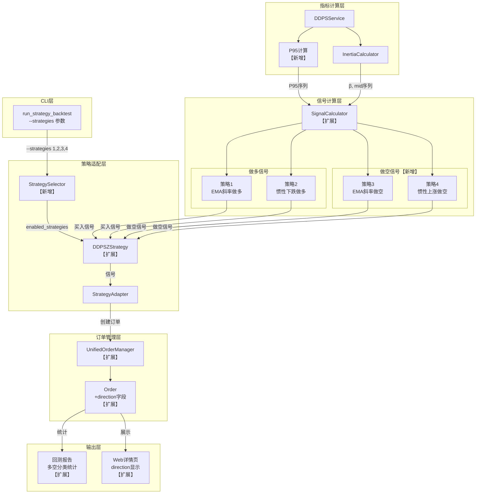
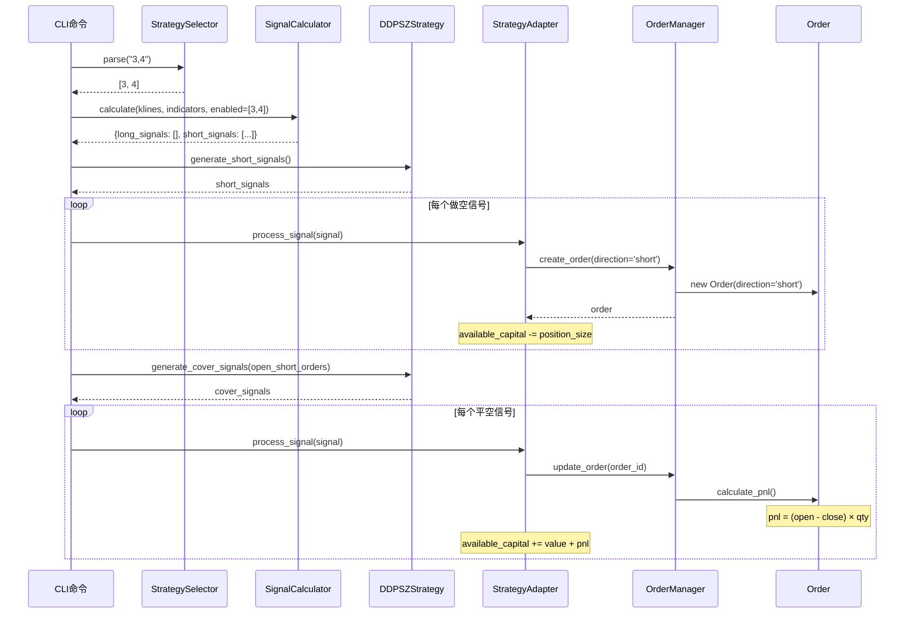

# 架构设计文档: DDPS-Z做空策略扩展

**迭代编号**: 015
**版本**: v1.0
**状态**: Approved
**创建日期**: 2026-01-06
**最后更新**: 2026-01-06

---

## 1. 需求解读与目标对齐

### 1.1 核心业务目标

扩展现有DDPS-Z回测系统，增加做空交易能力：
1. 新增策略3、4（做空策略），与现有策略1、2形成镜像对称
2. 支持用户灵活组合策略进行回测验证
3. 实现多空策略共享资金池的统一仓位管理

### 1.2 关键用户流程

```
用户想验证做空策略有效性
        ↓
执行CLI命令：python manage.py run_strategy_backtest ETHUSDT --strategies 3,4
        ↓
系统解析策略参数，加载K线数据
        ↓
计算技术指标（EMA25、P5、P95、β、惯性中值）
        ↓
策略3检测：high>=P95 且 future_ema<close → 生成开空信号
策略4检测：β>0 且 mid>P95 且 high>(mid+P95)/2 → 生成开空信号
        ↓
扣减资金，创建direction='short'的订单
        ↓
持续监控：K线包含EMA25时 → 生成平空信号
        ↓
计算做空盈亏：(开仓价 - 平仓价) × 数量
        ↓
输出回测报告（区分多空订单统计）
```

### 1.3 功能点覆盖

| 模块 | 功能点数量 | 关键功能 |
|------|-----------|---------|
| 信号计算器扩展 | 4个 | 策略3/4信号、P95计算、平空信号 |
| 订单模型扩展 | 3个 | direction字段、做空盈亏计算 |
| 策略适配层 | 3个 | 做空/平空信号生成、策略选择器 |
| 资金管理 | 3个 | 全局资金池、开空扣减、平空回流 |
| CLI扩展 | 3个 | --strategies参数、验证、向后兼容 |
| 回测报告 | 2个 | 多空统计、Web方向显示 |

共计 **18个P0功能点**。

---

## 2. 系统架构

### 2.1 架构总览



### 2.2 设计原则

本架构采用**增量扩展**模式：
- **最小改动**：在现有系统基础上新增做空能力，不破坏现有功能
- **向后兼容**：默认`--strategies 1,2`保持现有行为
- **职责分离**：策略选择、信号计算、订单管理各司其职
- **统一抽象**：多空订单使用相同Order模型，通过direction字段区分

---

## 3. 组件设计

### 3.1 组件清单

| 组件 | 类型 | 文件路径 | 职责 |
|------|------|----------|------|
| **StrategySelector** | 新增 | `strategy_adapter/core/strategy_selector.py` | 解析`--strategies`参数，返回启用策略ID列表 |
| **P95计算** | 新增 | `run_strategy_backtest.py._calculate_indicators()` | 计算P95价格序列 |
| **SignalCalculator** | 扩展 | `ddps_z/calculators/signal_calculator.py` | 统一信号计算器，整合策略1-4 |
| **DDPSZStrategy** | 扩展 | `strategy_adapter/adapters/ddpsz_adapter.py` | 新增做空/平空信号生成方法 |
| **UnifiedOrderManager** | 扩展 | `strategy_adapter/core/unified_order_manager.py` | `create_order()`支持direction参数 |
| **Order** | 扩展 | `strategy_adapter/models/order.py` | 新增direction字段 |
| **BacktestOrder** | 扩展 | `strategy_adapter/models/db_models.py` | 数据库模型同步扩展 |
| **回测报告** | 扩展 | `run_strategy_backtest.py._display_results()` | 多空订单分类统计 |
| **Web详情页** | 扩展 | `strategy_adapter/templates/.../backtest_detail.html` | direction标签显示 |

### 3.2 组件与需求映射

#### 模块1：信号计算器扩展

| 组件 | 负责实现 |
|------|----------|
| P95计算 | FP-015-003（P95价格序列计算） |
| SignalCalculator._calculate_strategy3() | FP-015-001（EMA斜率做空信号） |
| SignalCalculator._calculate_strategy4() | FP-015-002（惯性上涨做空信号） |
| SignalCalculator.calculate_cover_signals() | FP-015-004（平空信号生成） |

#### 模块2：订单模型扩展

| 组件 | 负责实现 |
|------|----------|
| Order.direction | FP-015-005（direction字段） |
| Order.calculate_pnl() | FP-015-006（做空盈亏计算）**已实现** |
| BacktestOrder.direction | FP-015-007（数据库模型扩展） |

#### 模块3：策略适配层

| 组件 | 负责实现 |
|------|----------|
| DDPSZStrategy.generate_short_signals() | FP-015-008（做空信号生成） |
| DDPSZStrategy.generate_cover_signals() | FP-015-009（平空信号生成） |
| StrategySelector | FP-015-010（策略选择器） |

#### 模块4：资金管理

| 组件 | 负责实现 |
|------|----------|
| StrategyAdapter.adapt_for_backtest() | FP-015-011（全局资金池）<br/>FP-015-012（开空扣减）<br/>FP-015-013（平空回流） |

#### 模块5：CLI扩展

| 组件 | 负责实现 |
|------|----------|
| Command.add_arguments() | FP-015-014（--strategies参数） |
| StrategySelector.validate() | FP-015-015（参数验证） |
| 默认值"1,2" | FP-015-016（向后兼容） |

#### 模块6：回测报告

| 组件 | 负责实现 |
|------|----------|
| _display_results() | FP-015-017（多空分类统计） |
| backtest_detail.html | FP-015-018（Web方向显示） |

---

## 4. 详细设计

### 4.1 SignalCalculator（扩展BuySignalCalculator）

**文件**: `ddps_z/calculators/signal_calculator.py`

```python
class SignalCalculator:
    """
    统一信号计算器 - 计算策略1-4的触发信号

    策略1: EMA斜率未来预测做多
        触发条件: low < P5 且 future_ema > close

    策略2: 惯性下跌中值突破做多
        前置条件: β < 0
        触发条件: inertia_mid < P5 且 low < (mid+P5)/2

    策略3: EMA斜率未来预测做空 【新增】
        触发条件: high >= P95 且 future_ema < close

    策略4: 惯性上涨中值突破做空 【新增】
        前置条件: β > 0
        触发条件: inertia_mid > P95 且 high > (mid+P95)/2
    """

    STRATEGY_3_ID = 'strategy_3'
    STRATEGY_3_NAME = 'EMA斜率未来预测做空'
    STRATEGY_4_ID = 'strategy_4'
    STRATEGY_4_NAME = '惯性上涨中值突破做空'

    def calculate(
        self,
        klines: List[Dict],
        ema_series: np.ndarray,
        p5_series: np.ndarray,
        p95_series: np.ndarray,  # 新增
        beta_series: np.ndarray,
        inertia_mid_series: np.ndarray,
        enabled_strategies: List[int] = [1, 2]  # 新增：启用的策略列表
    ) -> Dict[str, List[Dict]]:
        """
        返回格式:
        {
            'long_signals': [...],   # 做多信号（策略1/2）
            'short_signals': [...]   # 做空信号（策略3/4）
        }
        """
```

### 4.2 DDPSZStrategy扩展

**文件**: `strategy_adapter/adapters/ddpsz_adapter.py`

```python
class DDPSZStrategy(IStrategy):

    def __init__(
        self,
        position_size: Decimal = Decimal("100"),
        enabled_strategies: List[int] = [1, 2]  # 新增
    ):
        self.enabled_strategies = enabled_strategies
        # ...

    # 新增方法
    def generate_short_signals(
        self,
        klines: pd.DataFrame,
        indicators: Dict[str, pd.Series]
    ) -> List[Dict]:
        """
        生成做空信号（策略3、4）

        Returns:
            List[Dict]: 做空信号列表
                {
                    'timestamp': int,
                    'price': Decimal,      # 开空价格
                    'reason': str,
                    'direction': 'short',  # 新增
                    'strategy_id': str
                }
        """

    # 新增方法
    def generate_cover_signals(
        self,
        klines: pd.DataFrame,
        indicators: Dict[str, pd.Series],
        open_short_orders: List[Order]
    ) -> List[Dict]:
        """
        生成平空信号（EMA25回归）

        条件: kline['low'] <= ema25 <= kline['high']
        """
```

### 4.3 Order模型扩展

**文件**: `strategy_adapter/models/order.py`

```python
@dataclass
class Order:
    # 现有字段...

    # 新增字段
    direction: str = 'long'  # 'long' | 'short'，默认'long'保持向后兼容
```

### 4.4 UnifiedOrderManager扩展

**文件**: `strategy_adapter/core/unified_order_manager.py`

```python
def create_order(
    self,
    signal: Dict,
    strategy: IStrategy,
    current_price: Decimal,
    available_capital: Decimal,
    symbol: str = "ETHUSDT",
    direction: str = "long"  # 新增参数
) -> Order:
    """
    创建订单

    Args:
        direction: 订单方向，'long'（做多）或'short'（做空）
    """
    order = Order(
        # ...
        side=OrderSide.BUY if direction == 'long' else OrderSide.SELL,
        direction=direction,  # 新增
        # ...
    )
```

### 4.5 StrategySelector

**文件**: `strategy_adapter/core/strategy_selector.py`

```python
class StrategySelector:
    """
    策略选择器 - 解析和验证策略参数
    """

    VALID_STRATEGIES = {1, 2, 3, 4}
    LONG_STRATEGIES = {1, 2}
    SHORT_STRATEGIES = {3, 4}

    @classmethod
    def parse(cls, strategies_str: str) -> List[int]:
        """
        解析策略字符串

        Args:
            strategies_str: "1,2,3,4" 格式的字符串

        Returns:
            List[int]: 策略ID列表 [1, 2, 3, 4]

        Raises:
            ValueError: 无效的策略ID
        """
        ids = [int(s.strip()) for s in strategies_str.split(',')]
        invalid = set(ids) - cls.VALID_STRATEGIES
        if invalid:
            raise ValueError(f"无效的策略ID: {invalid}，有效值: {cls.VALID_STRATEGIES}")
        return ids

    @classmethod
    def has_long(cls, strategies: List[int]) -> bool:
        """是否包含做多策略"""
        return bool(set(strategies) & cls.LONG_STRATEGIES)

    @classmethod
    def has_short(cls, strategies: List[int]) -> bool:
        """是否包含做空策略"""
        return bool(set(strategies) & cls.SHORT_STRATEGIES)
```

### 4.6 P95价格序列计算

**位置**: `run_strategy_backtest.py._calculate_indicators()`

```python
# 现有P5计算
z_p5 = -1.645
p5_array = ema_array * (1 + z_p5 * ewma_std_series)

# 新增P95计算
z_p95 = +1.645
p95_array = ema_array * (1 + z_p95 * ewma_std_series)

indicators = {
    'ema25': pd.Series(ema_array, index=klines_df.index),
    'p5': pd.Series(p5_array, index=klines_df.index),
    'p95': pd.Series(p95_array, index=klines_df.index),  # 新增
    'beta': pd.Series(beta_array, index=klines_df.index),
    'inertia_mid': pd.Series(inertia_mid_array, index=klines_df.index),
}
```

---

## 5. 数据流

### 5.1 做空回测主流程



### 5.2 资金流转

```
初始状态:
  available_capital = 10000 USDT

开空信号触发（策略3）:
  position_size = 100 USDT
  available_capital = 10000 - 100 = 9900 USDT
  创建订单: direction='short', open_price=2000

平空信号触发（EMA25回归）:
  close_price = 1900
  pnl = (2000 - 1900) × quantity - commission = +98 USDT
  available_capital = 9900 + 100 + 98 = 10098 USDT
```

---

## 6. 关键决策记录

### 决策点一：信号计算器架构

| 方案 | 描述 | 结论 |
|------|------|------|
| A. 扩展为SignalCalculator | 在现有BuySignalCalculator中添加策略3、4 | ✅ **采用** |
| B. 新建ShortSignalCalculator | 独立类处理做空信号 | ❌ |

**理由**：策略1-4逻辑高度相似（镜像对称），统一管理更易维护。

### 决策点二：IStrategy接口扩展

| 方案 | 描述 | 结论 |
|------|------|------|
| A. 新增专用方法 | `generate_short_signals()`, `generate_cover_signals()` | ✅ **采用** |
| B. 复用现有方法 | 通过signal_type字段区分 | ❌ |

**理由**：语义清晰是长期维护的关键。

### 决策点三：Order.direction字段

| 方案 | 描述 | 结论 |
|------|------|------|
| A. 复用OrderSide | BUY=做多，SELL=做空 | ❌ |
| B. 新增direction字段 | 独立字段'long'/'short' | ✅ **采用** |

**理由**：`side`（动作）和`direction`（方向）是两个独立概念，分离更清晰。

---

## 7. 向后兼容性

| 场景 | 保证 |
|------|------|
| 默认行为 | `--strategies`默认值"1,2"，执行现有做多策略 |
| Order模型 | `direction`默认值'long'，现有订单自动兼容 |
| 数据库迁移 | `BacktestOrder.direction`添加默认值 |
| API接口 | 现有调用方式不变 |

---

## 8. 测试策略

| 模块 | 测试类型 | 覆盖要求 |
|------|----------|----------|
| SignalCalculator.策略3/4 | 单元测试 | 100%边界条件 |
| Order.direction | 单元测试 | 多空盈亏计算 |
| StrategySelector | 单元测试 | 参数解析验证 |
| CLI --strategies | 集成测试 | 各种组合场景 |
| 端到端回测 | E2E测试 | `--strategies 3,4`完整流程 |
| 向后兼容 | 回归测试 | 默认参数行为不变 |

---

## 附录：策略对照表

| 维度 | 策略1 | 策略2 | 策略3 | 策略4 |
|------|-------|-------|-------|-------|
| 名称 | EMA斜率未来预测 | 惯性下跌中值突破 | EMA斜率未来预测 | 惯性上涨中值突破 |
| 类型 | long | long | short | short |
| 前置条件 | - | β < 0 | - | β > 0 |
| 价格条件 | low < P5 | low < (mid+P5)/2 | high >= P95 | high > (mid+P95)/2 |
| 预测条件 | future_ema > close | mid < P5 | future_ema < close | mid > P95 |
| 操作 | 买入开多 | 买入开多 | 卖出开空 | 卖出开空 |
| 平仓条件 | EMA25回归 | EMA25回归 | EMA25回归 | EMA25回归 |
