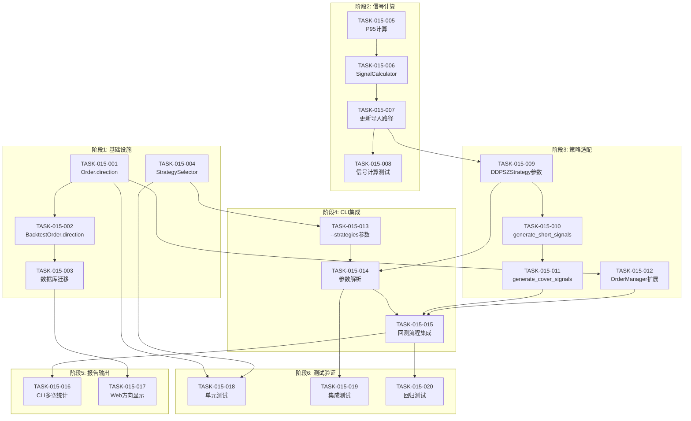

# 任务计划: DDPS-Z做空策略扩展

**迭代编号**: 015
**版本**: v1.0
**状态**: Approved
**创建日期**: 2026-01-06

---

## 任务总览

| 阶段 | 任务数 | 关键交付物 |
|------|--------|-----------|
| 阶段1：基础设施 | 4 | Order.direction、DB迁移、StrategySelector |
| 阶段2：信号计算 | 4 | P95计算、策略3/4信号、SignalCalculator |
| 阶段3：策略适配 | 4 | DDPSZStrategy扩展、资金管理 |
| 阶段4：CLI集成 | 3 | --strategies参数、回测流程集成 |
| 阶段5：报告输出 | 2 | CLI报告、Web详情页 |
| 阶段6：测试验证 | 3 | 单元测试、集成测试、回归测试 |

**共计**: 20个任务

---

## 阶段1：基础设施（优先级：最高）

### TASK-015-001: Order模型添加direction字段

**关联功能点**: FP-015-005

**文件**: `strategy_adapter/models/order.py`

**实现内容**:
```python
@dataclass
class Order:
    # 现有字段...

    # 新增字段（在metadata之前）
    direction: str = 'long'  # 'long' | 'short'
```

**验收标准**:
- [ ] direction字段默认值为'long'
- [ ] 现有代码无需修改即可正常运行
- [ ] to_dict()方法包含direction字段

**依赖**: 无

---

### TASK-015-002: BacktestOrder模型添加direction字段

**关联功能点**: FP-015-007

**文件**: `strategy_adapter/models/db_models.py`

**实现内容**:
```python
class BacktestOrder(models.Model):
    # 现有字段...

    # 新增字段
    direction = models.CharField(
        max_length=10,
        default='long',
        choices=[('long', '做多'), ('short', '做空')]
    )
```

**验收标准**:
- [ ] 字段默认值'long'
- [ ] 生成数据库迁移文件
- [ ] 迁移成功执行

**依赖**: TASK-015-001

---

### TASK-015-003: 创建数据库迁移

**关联功能点**: FP-015-007

**命令**:
```bash
python manage.py makemigrations strategy_adapter --name add_direction_to_backtest_order
python manage.py migrate strategy_adapter
```

**验收标准**:
- [ ] 迁移文件生成
- [ ] 迁移执行成功
- [ ] 现有数据自动填充direction='long'

**依赖**: TASK-015-002

---

### TASK-015-004: 创建StrategySelector策略选择器

**关联功能点**: FP-015-010, FP-015-015

**文件**: `strategy_adapter/core/strategy_selector.py`（新建）

**实现内容**:
```python
class StrategySelector:
    VALID_STRATEGIES = {1, 2, 3, 4}
    LONG_STRATEGIES = {1, 2}
    SHORT_STRATEGIES = {3, 4}

    @classmethod
    def parse(cls, strategies_str: str) -> List[int]:
        """解析策略字符串，返回策略ID列表"""

    @classmethod
    def validate(cls, strategies: List[int]) -> None:
        """验证策略ID有效性，无效则抛出ValueError"""

    @classmethod
    def has_long(cls, strategies: List[int]) -> bool:
        """是否包含做多策略"""

    @classmethod
    def has_short(cls, strategies: List[int]) -> bool:
        """是否包含做空策略"""
```

**验收标准**:
- [ ] parse("1,2,3,4")返回[1,2,3,4]
- [ ] parse("5")抛出ValueError
- [ ] has_long([3,4])返回False
- [ ] has_short([1,2])返回False

**依赖**: 无

---

## 阶段2：信号计算（优先级：高）

### TASK-015-005: P95价格序列计算

**关联功能点**: FP-015-003

**文件**: `strategy_adapter/management/commands/run_strategy_backtest.py`

**修改位置**: `_calculate_indicators()`方法

**实现内容**:
```python
# 现有P5计算
z_p5 = -1.645
p5_array = ema_array * (1 + z_p5 * ewma_std_series)

# 新增P95计算
z_p95 = +1.645
p95_array = ema_array * (1 + z_p95 * ewma_std_series)

indicators = {
    # ...现有指标
    'p95': pd.Series(p95_array, index=klines_df.index),  # 新增
}
```

**验收标准**:
- [ ] P95 = EMA × (1 + 1.645 × ewma_std)
- [ ] P95序列长度与K线数量一致
- [ ] P95始终大于EMA（正态分布上界）

**依赖**: 无

---

### TASK-015-006: 扩展BuySignalCalculator为SignalCalculator

**关联功能点**: FP-015-001, FP-015-002

**文件**: `ddps_z/calculators/signal_calculator.py`（重命名buy_signal_calculator.py）

**实现内容**:

1. 重命名文件和类
2. 添加策略3计算方法:
```python
def _calculate_strategy3(self, kline, ema, p95, beta) -> Dict:
    """
    策略3: EMA斜率未来预测做空
    条件: high >= P95 且 future_ema < close
    """
```

3. 添加策略4计算方法:
```python
def _calculate_strategy4(self, kline, p95, beta, inertia_mid) -> Dict:
    """
    策略4: 惯性上涨中值突破做空
    前置: β > 0
    条件: inertia_mid > P95 且 high > (mid+P95)/2
    """
```

4. 修改calculate()方法签名:
```python
def calculate(
    self,
    klines, ema_series, p5_series, p95_series,  # 新增p95
    beta_series, inertia_mid_series,
    enabled_strategies: List[int] = [1, 2]  # 新增参数
) -> Dict[str, List[Dict]]:
    """
    返回: {'long_signals': [...], 'short_signals': [...]}
    """
```

**验收标准**:
- [ ] 策略3在high>=P95且future_ema<close时触发
- [ ] 策略4在β>0且mid>P95且high>(mid+P95)/2时触发
- [ ] enabled_strategies=[1,2]时仅返回做多信号
- [ ] enabled_strategies=[3,4]时仅返回做空信号

**依赖**: TASK-015-005

---

### TASK-015-007: 更新DDPSZStrategy导入路径

**关联功能点**: 无（重构）

**文件**:
- `ddps_z/calculators/__init__.py`
- `strategy_adapter/adapters/ddpsz_adapter.py`

**实现内容**:
```python
# ddps_z/calculators/__init__.py
from .signal_calculator import SignalCalculator
# 保留别名向后兼容
BuySignalCalculator = SignalCalculator
```

**验收标准**:
- [ ] 现有代码使用BuySignalCalculator正常工作
- [ ] 新代码可使用SignalCalculator

**依赖**: TASK-015-006

---

### TASK-015-008: SignalCalculator单元测试

**关联功能点**: FP-015-001, FP-015-002

**文件**: `ddps_z/tests/test_signal_calculator.py`（新建）

**测试用例**:
```python
class TestStrategy3(TestCase):
    def test_strategy3_triggers_when_high_above_p95_and_future_ema_below_close(self):
        """策略3: high>=P95且future_ema<close时触发"""

    def test_strategy3_not_triggers_when_high_below_p95(self):
        """策略3: high<P95时不触发"""

class TestStrategy4(TestCase):
    def test_strategy4_triggers_when_beta_positive_and_conditions_met(self):
        """策略4: β>0且满足条件时触发"""

    def test_strategy4_not_triggers_when_beta_negative(self):
        """策略4: β<0时不触发（前置条件不满足）"""
```

**验收标准**:
- [ ] 策略3边界条件100%覆盖
- [ ] 策略4边界条件100%覆盖
- [ ] 所有测试通过

**依赖**: TASK-015-006

---

## 阶段3：策略适配（优先级：高）

### TASK-015-009: DDPSZStrategy添加enabled_strategies参数

**关联功能点**: FP-015-010

**文件**: `strategy_adapter/adapters/ddpsz_adapter.py`

**实现内容**:
```python
def __init__(
    self,
    position_size: Decimal = Decimal("100"),
    enabled_strategies: List[int] = [1, 2]  # 新增
):
    self.enabled_strategies = enabled_strategies
    self.calculator = SignalCalculator()
```

**验收标准**:
- [ ] 默认值[1,2]保持向后兼容
- [ ] enabled_strategies在信号生成时生效

**依赖**: TASK-015-007

---

### TASK-015-010: DDPSZStrategy实现generate_short_signals()

**关联功能点**: FP-015-008

**文件**: `strategy_adapter/adapters/ddpsz_adapter.py`

**实现内容**:
```python
def generate_short_signals(
    self,
    klines: pd.DataFrame,
    indicators: Dict[str, pd.Series]
) -> List[Dict]:
    """
    生成做空信号（策略3、4）

    Returns:
        List[Dict]: [{
            'timestamp': int,
            'price': Decimal,
            'reason': str,
            'direction': 'short',
            'strategy_id': str
        }]
    """
```

**验收标准**:
- [ ] 调用SignalCalculator获取做空信号
- [ ] 信号包含direction='short'字段
- [ ] 仅当enabled_strategies包含3或4时返回信号

**依赖**: TASK-015-009

---

### TASK-015-011: DDPSZStrategy实现generate_cover_signals()

**关联功能点**: FP-015-009, FP-015-004

**文件**: `strategy_adapter/adapters/ddpsz_adapter.py`

**实现内容**:
```python
def generate_cover_signals(
    self,
    klines: pd.DataFrame,
    indicators: Dict[str, pd.Series],
    open_short_orders: List[Order]
) -> List[Dict]:
    """
    生成平空信号（EMA25回归）

    条件: kline['low'] <= ema25 <= kline['high']
    """
```

**验收标准**:
- [ ] 与generate_sell_signals()逻辑镜像
- [ ] 平仓价格为EMA25值
- [ ] 返回信号包含order_id关联

**依赖**: TASK-015-010

---

### TASK-015-012: UnifiedOrderManager支持direction参数

**关联功能点**: FP-015-005, FP-015-011, FP-015-012, FP-015-013

**文件**: `strategy_adapter/core/unified_order_manager.py`

**实现内容**:
```python
def create_order(
    self,
    signal: Dict,
    strategy: IStrategy,
    current_price: Decimal,
    available_capital: Decimal,
    symbol: str = "ETHUSDT",
    direction: str = "long"  # 新增参数
) -> Order:
    order = Order(
        # ...
        side=OrderSide.BUY if direction == 'long' else OrderSide.SELL,
        direction=direction,  # 新增
        # ...
    )
```

**验收标准**:
- [ ] direction='long'时side=BUY
- [ ] direction='short'时side=SELL
- [ ] Order对象包含direction字段

**依赖**: TASK-015-001

---

## 阶段4：CLI集成（优先级：中）

### TASK-015-013: CLI添加--strategies参数

**关联功能点**: FP-015-014, FP-015-016

**文件**: `strategy_adapter/management/commands/run_strategy_backtest.py`

**实现内容**:
```python
def add_arguments(self, parser):
    # ...现有参数

    parser.add_argument(
        '--strategies',
        type=str,
        default='1,2',
        help='策略组合，逗号分隔（默认: 1,2）。'
             '1=EMA斜率做多, 2=惯性下跌做多, '
             '3=EMA斜率做空, 4=惯性上涨做空'
    )
```

**验收标准**:
- [ ] 默认值"1,2"
- [ ] --strategies 3,4仅执行做空策略
- [ ] --strategies 1,2,3,4执行全部策略

**依赖**: TASK-015-004

---

### TASK-015-014: CLI解析策略参数并传递

**关联功能点**: FP-015-014, FP-015-015

**文件**: `strategy_adapter/management/commands/run_strategy_backtest.py`

**修改位置**: `handle()`方法

**实现内容**:
```python
from strategy_adapter.core.strategy_selector import StrategySelector

def handle(self, *args, **options):
    # 解析策略参数
    strategies_str = options['strategies']
    try:
        enabled_strategies = StrategySelector.parse(strategies_str)
    except ValueError as e:
        raise CommandError(str(e))

    # 创建策略实例时传递
    strategy = DDPSZStrategy(
        position_size=Decimal(str(position_size)),
        enabled_strategies=enabled_strategies
    )
```

**验收标准**:
- [ ] 无效策略ID报错
- [ ] enabled_strategies传递到DDPSZStrategy
- [ ] 指标计算包含P95

**依赖**: TASK-015-013, TASK-015-009

---

### TASK-015-015: StrategyAdapter集成做空回测流程

**关联功能点**: FP-015-011, FP-015-012, FP-015-013

**文件**: `strategy_adapter/core/strategy_adapter.py`

**实现内容**:

修改`adapt_for_backtest()`方法，支持做空信号处理：

```python
def adapt_for_backtest(self, klines_df, indicators):
    # 1. 生成买入信号（做多）
    if StrategySelector.has_long(self.strategy.enabled_strategies):
        buy_signals = self.strategy.generate_buy_signals(klines_df, indicators)
        # 处理买入...

    # 2. 生成做空信号（新增）
    if StrategySelector.has_short(self.strategy.enabled_strategies):
        short_signals = self.strategy.generate_short_signals(klines_df, indicators)
        for signal in short_signals:
            if available_capital >= position_size:
                order = self.order_manager.create_order(
                    signal, self.strategy, price, available_capital,
                    symbol, direction='short'  # 新增
                )
                available_capital -= order.position_value

    # 3. 生成平多信号
    # ...现有逻辑

    # 4. 生成平空信号（新增）
    open_short_orders = [o for o in orders if o.direction == 'short' and o.status == FILLED]
    cover_signals = self.strategy.generate_cover_signals(klines_df, indicators, open_short_orders)
    for signal in cover_signals:
        order = self.order_manager.update_order(signal['order_id'], signal)
        available_capital += order.position_value + (order.profit_loss or 0)
```

**验收标准**:
- [ ] 做空信号正确处理
- [ ] 资金扣减和回流正确
- [ ] 多空订单独立管理

**依赖**: TASK-015-011, TASK-015-012

---

## 阶段5：报告输出（优先级：中）

### TASK-015-016: CLI报告多空分类统计

**关联功能点**: FP-015-017

**文件**: `strategy_adapter/management/commands/run_strategy_backtest.py`

**修改位置**: `_display_results()`方法

**实现内容**:
```python
def _display_results(self, result, ...):
    orders = result['orders']

    # 分类统计
    long_orders = [o for o in orders if o.direction == 'long']
    short_orders = [o for o in orders if o.direction == 'short']

    self.stdout.write('【订单统计】')
    self.stdout.write(f'  总订单数: {len(orders)}')

    if long_orders:
        long_closed = [o for o in long_orders if o.status == CLOSED]
        long_open = [o for o in long_orders if o.status == FILLED]
        self.stdout.write(f'  ├── 做多订单: {len(long_orders)}')
        self.stdout.write(f'  │   ├── 已平仓: {len(long_closed)}')
        self.stdout.write(f'  │   └── 持仓中: {len(long_open)}')

    if short_orders:
        short_closed = [o for o in short_orders if o.status == CLOSED]
        short_open = [o for o in short_orders if o.status == FILLED]
        self.stdout.write(f'  └── 做空订单: {len(short_orders)}')
        self.stdout.write(f'      ├── 已平仓: {len(short_closed)}')
        self.stdout.write(f'      └── 持仓中: {len(short_open)}')
```

**验收标准**:
- [ ] 报告区分多空订单
- [ ] 分别显示已平仓/持仓中数量
- [ ] 无做空订单时不显示做空统计

**依赖**: TASK-015-015

---

### TASK-015-017: Web详情页direction显示

**关联功能点**: FP-015-018

**文件**: `strategy_adapter/templates/strategy_adapter/backtest_detail.html`

**实现内容**:

1. 订单列表添加direction列:
```html
<th>方向</th>
...
<td>
    
    <span class="badge bg-success">做多</span>
    
    <span class="badge bg-danger">做空</span>
    
</td>
```

2. _save_backtest_result()保存direction:
```python
BacktestOrder(
    # ...
    direction=order.direction,  # 新增
)
```

**验收标准**:
- [ ] 订单列表显示方向标签
- [ ] 做多显示绿色，做空显示红色
- [ ] 数据库正确存储direction

**依赖**: TASK-015-003

---

## 阶段6：测试验证（优先级：高）

### TASK-015-018: 单元测试 - 策略选择器和订单模型

**关联功能点**: FP-015-005, FP-015-010, FP-015-015

**文件**: `strategy_adapter/tests/test_short_strategies.py`（新建）

**测试用例**:
```python
class TestStrategySelector(TestCase):
    def test_parse_valid_strategies(self):
        """解析有效策略字符串"""

    def test_parse_invalid_strategy_raises_error(self):
        """解析无效策略ID抛出ValueError"""

    def test_has_long_returns_true_for_strategies_1_2(self):
        """has_long()对策略1,2返回True"""

    def test_has_short_returns_true_for_strategies_3_4(self):
        """has_short()对策略3,4返回True"""

class TestOrderDirection(TestCase):
    def test_order_default_direction_is_long(self):
        """Order默认direction为long"""

    def test_short_order_pnl_calculation(self):
        """做空订单盈亏计算: (open-close)*qty"""
```

**验收标准**:
- [ ] StrategySelector测试100%覆盖
- [ ] Order.direction测试覆盖
- [ ] 做空盈亏计算测试覆盖

**依赖**: TASK-015-004, TASK-015-001

---

### TASK-015-019: 集成测试 - CLI策略参数

**关联功能点**: FP-015-014, FP-015-016

**文件**: `strategy_adapter/tests/test_cli_strategies.py`（新建）

**测试用例**:
```python
class TestCLIStrategiesParameter(TestCase):
    def test_default_strategies_is_1_2(self):
        """默认--strategies为1,2"""

    def test_strategies_3_4_only_generates_short_signals(self):
        """--strategies 3,4仅生成做空信号"""

    def test_invalid_strategy_raises_command_error(self):
        """无效策略ID抛出CommandError"""
```

**验收标准**:
- [ ] 默认参数测试
- [ ] 策略组合测试
- [ ] 错误处理测试

**依赖**: TASK-015-014

---

### TASK-015-020: 回归测试 - 向后兼容性

**关联功能点**: FP-015-016

**文件**: `strategy_adapter/tests/test_backward_compatibility.py`（新建）

**测试用例**:
```python
class TestBackwardCompatibility(TestCase):
    def test_default_behavior_unchanged(self):
        """默认行为与原有版本一致"""

    def test_existing_backtest_results_still_work(self):
        """现有回测结果数据正常读取"""

    def test_order_without_direction_defaults_to_long(self):
        """无direction字段的Order默认为long"""
```

**验收标准**:
- [ ] 默认行为不变
- [ ] 现有数据兼容
- [ ] 所有现有测试通过

**依赖**: TASK-015-015

---

## 任务依赖关系图



---

## 执行优先级

| 优先级 | 任务 | 说明 |
|--------|------|------|
| P0-Critical | TASK-015-001~004 | 基础设施，阻塞其他任务 |
| P1-High | TASK-015-005~008 | 核心信号计算逻辑 |
| P1-High | TASK-015-009~012 | 策略适配核心 |
| P2-Medium | TASK-015-013~015 | CLI集成 |
| P2-Medium | TASK-015-016~017 | 报告输出 |
| P3-Normal | TASK-015-018~020 | 测试验证 |

---

## 风险与缓解

| 风险 | 影响 | 缓解措施 |
|------|------|----------|
| SignalCalculator重构影响现有功能 | 高 | 保留BuySignalCalculator别名 |
| 数据库迁移失败 | 中 | 使用默认值，支持回滚 |
| 多空逻辑混淆 | 高 | 清晰命名，独立测试 |

---

## 验收检查清单

### 功能验收

- [ ] 策略3在high>=P95且future_ema<close时触发
- [ ] 策略4在β>0且mid>P95且high>(mid+P95)/2时触发
- [ ] 平空在K线包含EMA25时触发
- [ ] `--strategies 3,4`仅执行做空策略
- [ ] `--strategies 1,2,3,4`同时执行多空策略
- [ ] 资金在多空开平仓时正确增减
- [ ] 做空盈亏计算正确（开仓价-平仓价）
- [ ] 默认`--strategies 1,2`保持向后兼容

### 质量验收

- [ ] 所有单元测试通过
- [ ] 所有集成测试通过
- [ ] 代码符合项目规范
- [ ] 无Linter警告
