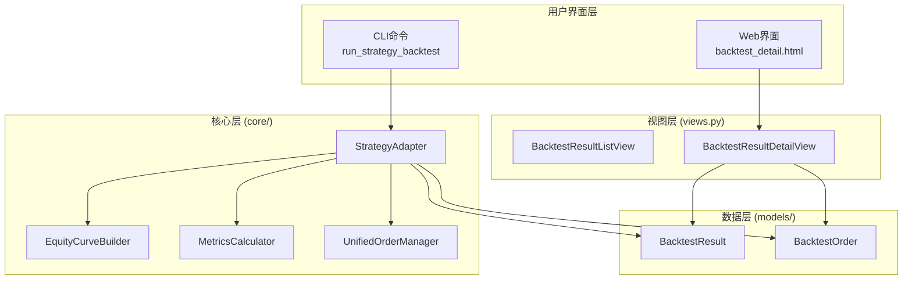
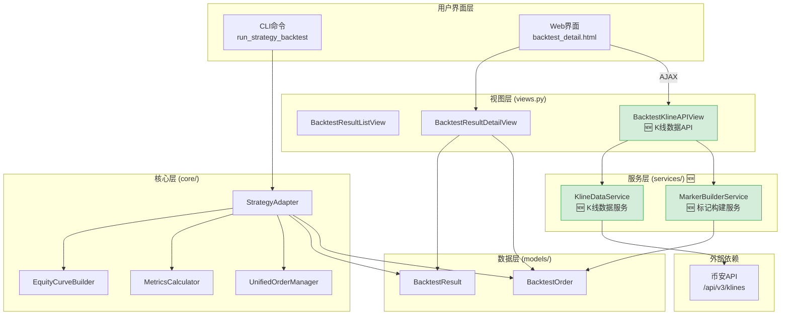
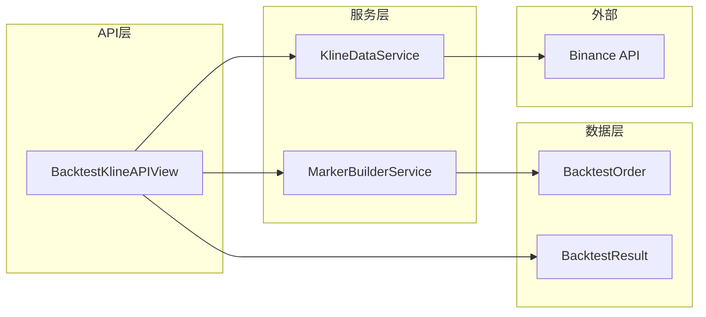
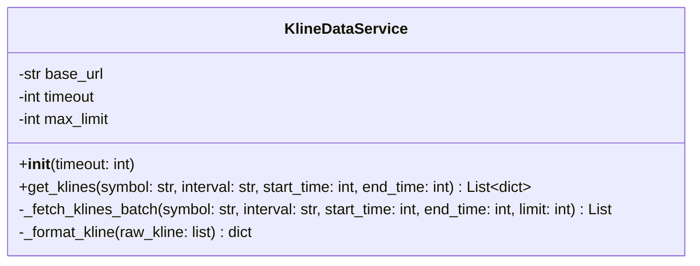
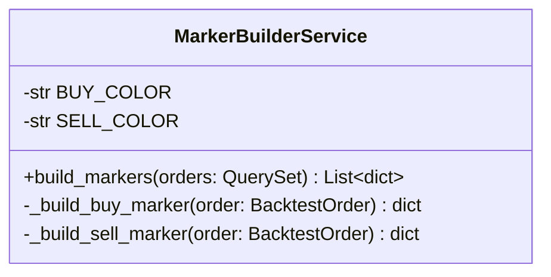
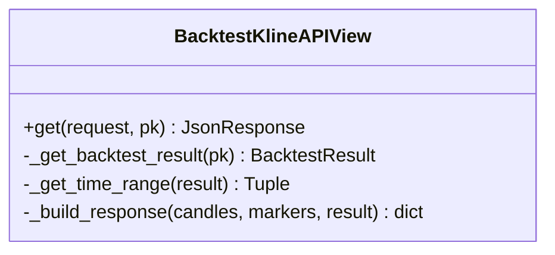
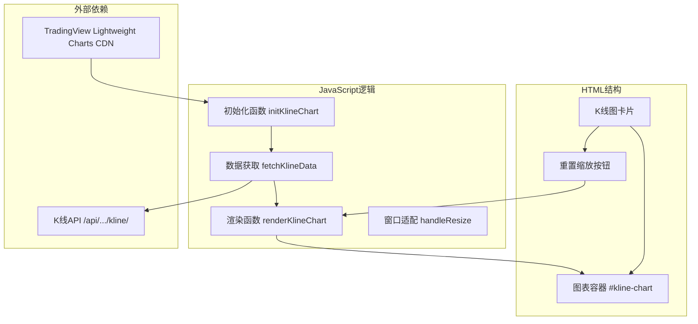
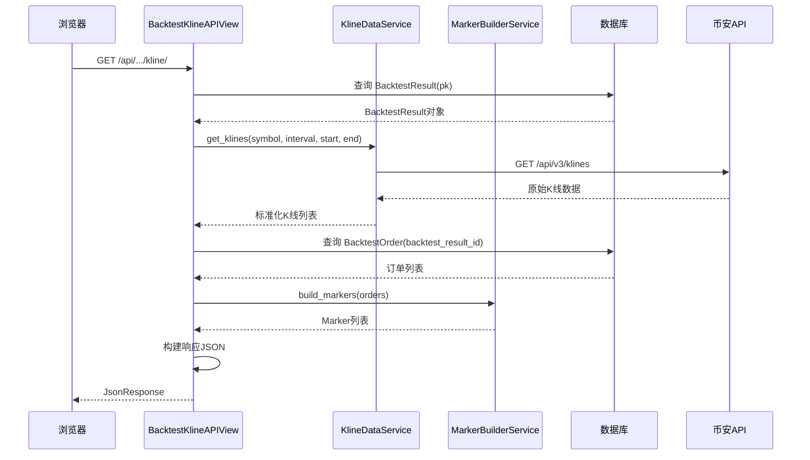
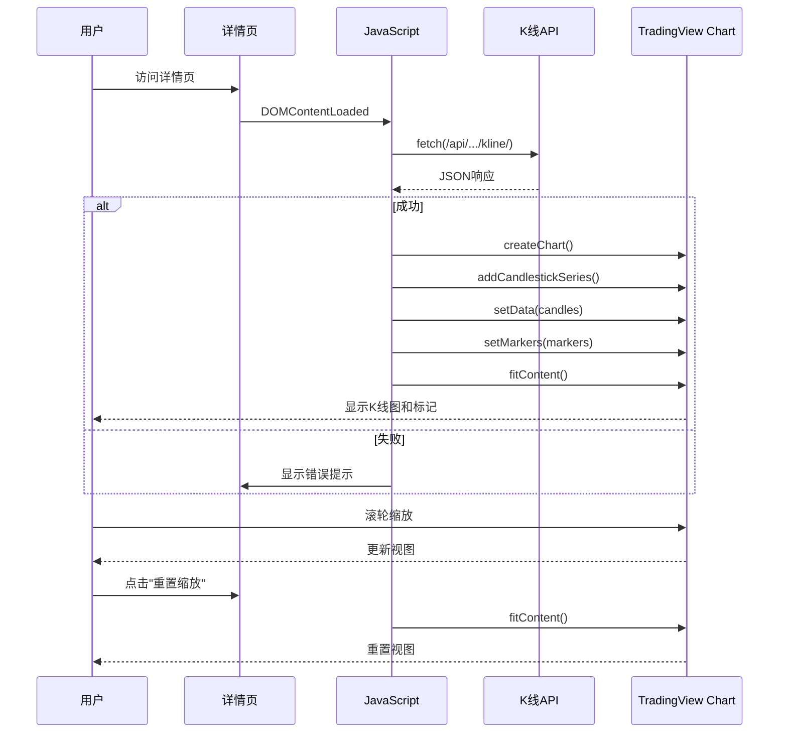

# 架构设计文档 - 回测结果K线图可视化

**项目名称**: 策略回测系统
**迭代编号**: 016
**文档版本**: v1.0.0
**创建日期**: 2026-01-07
**生命周期阶段**: P3 - 架构设计

---

## 1. 系统架构概览

### 1.1 现有架构



### 1.2 扩展架构（新增部分用绿色标识）



---

## 2. 模块设计

### 2.1 新增模块清单

| 模块 | 文件路径 | 职责 |
|------|---------|------|
| K线数据服务 | `strategy_adapter/services/kline_data_service.py` | 从币安API获取历史K线数据 |
| 标记构建服务 | `strategy_adapter/services/marker_builder_service.py` | 将订单转换为TradingView Marker格式 |
| K线API视图 | `strategy_adapter/views.py` (扩展) | 提供 `/api/.../kline/` 端点 |
| URL路由 | `strategy_adapter/urls.py` (扩展) | 添加API路由 |
| 前端K线图 | `strategy_adapter/templates/...html` (扩展) | K线图渲染逻辑 |

### 2.2 模块依赖关系



---

## 3. 核心组件设计

### 3.1 KlineDataService（K线数据服务）

**文件位置**: `strategy_adapter/services/kline_data_service.py`

**职责**:
- 调用币安API获取历史K线数据
- 处理分页（单次最多1000条）
- 数据格式标准化

**类图**:



**接口定义**:

```python
class KlineDataService:
    """
    独立的K线数据服务

    Purpose:
        为回测系统提供历史K线数据，独立于DDPS-Z模块。
        调用币安API获取OHLCV数据。

    Example:
        >>> service = KlineDataService()
        >>> klines = service.get_klines(
        ...     symbol="ETHUSDT",
        ...     interval="4h",
        ...     start_time=1704067200000,  # 2024-01-01 00:00:00 UTC
        ...     end_time=1735689600000     # 2025-01-01 00:00:00 UTC
        ... )
        >>> print(klines[0])
        {'t': 1704067200000, 'o': 2200.5, 'h': 2250.0, 'l': 2180.0, 'c': 2230.0, 'v': 15000.5}
    """

    def __init__(self, timeout: int = 10):
        """
        初始化K线数据服务

        Args:
            timeout: HTTP请求超时时间（秒），默认10秒
        """
        pass

    def get_klines(
        self,
        symbol: str,
        interval: str,
        start_time: int,
        end_time: int
    ) -> List[dict]:
        """
        获取指定时间范围的K线数据

        Args:
            symbol: 交易对，如 "ETHUSDT"
            interval: K线周期，如 "4h", "1d"
            start_time: 开始时间戳（毫秒）
            end_time: 结束时间戳（毫秒）

        Returns:
            K线数据列表，每个元素格式:
            {
                't': int,    # 时间戳（毫秒）
                'o': float,  # 开盘价
                'h': float,  # 最高价
                'l': float,  # 最低价
                'c': float,  # 收盘价
                'v': float   # 成交量
            }

        Raises:
            requests.RequestException: 网络请求失败
            ValueError: 参数无效
        """
        pass
```

**币安API调用**:

```python
# 币安K线API
# GET https://api.binance.com/api/v3/klines

# 请求参数:
# - symbol: 交易对 (必需)
# - interval: K线周期 (必需): 1m, 3m, 5m, 15m, 30m, 1h, 2h, 4h, 6h, 8h, 12h, 1d, 3d, 1w, 1M
# - startTime: 开始时间戳毫秒 (可选)
# - endTime: 结束时间戳毫秒 (可选)
# - limit: 数量，默认500，最大1000 (可选)

# 响应格式 (数组的数组):
# [
#   [
#     1499040000000,      // 开盘时间 (毫秒时间戳)
#     "0.01634000",       // 开盘价
#     "0.80000000",       // 最高价
#     "0.01575800",       // 最低价
#     "0.01577100",       // 收盘价
#     "148976.11427815",  // 成交量
#     1499644799999,      // 收盘时间
#     "2434.19055334",    // 成交额
#     308,                // 成交笔数
#     "1756.87402397",    // 主动买入成交量
#     "28.46694368",      // 主动买入成交额
#     "17928899.62484339" // 忽略
#   ]
# ]
```

---

### 3.2 MarkerBuilderService（标记构建服务）

**文件位置**: `strategy_adapter/services/marker_builder_service.py`

**职责**:
- 将BacktestOrder转换为TradingView Marker格式
- 生成买入标记和卖出标记
- 按时间戳排序

**类图**:



**接口定义**:

```python
class MarkerBuilderService:
    """
    订单标记构建服务

    Purpose:
        将BacktestOrder转换为TradingView Lightweight Charts的Marker格式。
        用于在K线图上显示买入/卖出点。

    Example:
        >>> service = MarkerBuilderService()
        >>> orders = BacktestOrder.objects.filter(backtest_result_id=1)
        >>> markers = service.build_markers(orders)
        >>> print(markers[0])
        {
            'time': 1704067200,
            'position': 'belowBar',
            'color': '#28a745',
            'shape': 'arrowUp',
            'text': 'B',
            'size': 1
        }
    """

    # 颜色常量
    BUY_COLOR = "#28a745"   # 绿色
    SELL_COLOR = "#dc3545"  # 红色

    def build_markers(self, orders) -> List[dict]:
        """
        构建订单标记列表

        Args:
            orders: BacktestOrder查询集或列表

        Returns:
            Marker格式列表，按时间戳升序排列
        """
        pass
```

**Marker数据格式**:

```python
# 买入标记
{
    "time": 1704067200,      # 秒级时间戳 (= buy_timestamp / 1000)
    "position": "belowBar",  # K线下方
    "color": "#28a745",      # 绿色
    "shape": "arrowUp",      # 向上箭头
    "text": "B",             # 显示文字
    "size": 1                # 标记大小
}

# 卖出标记
{
    "time": 1704153600,      # 秒级时间戳 (= sell_timestamp / 1000)
    "position": "aboveBar",  # K线上方
    "color": "#dc3545",      # 红色
    "shape": "arrowDown",    # 向下箭头
    "text": "S",             # 显示文字
    "size": 1                # 标记大小
}
```

---

### 3.3 BacktestKlineAPIView（K线API视图）

**文件位置**: `strategy_adapter/views.py` (扩展)

**职责**:
- 接收HTTP GET请求
- 调用KlineDataService获取K线数据
- 调用MarkerBuilderService构建标记
- 返回JSON响应

**类图**:



**接口定义**:

```python
from django.views import View
from django.http import JsonResponse

class BacktestKlineAPIView(View):
    """
    回测K线数据API视图

    Purpose:
        提供回测结果的K线数据和订单标记数据。
        供前端K线图渲染使用。

    Endpoint:
        GET /api/strategy_adapter/backtest/<int:pk>/kline/

    Response:
        {
            "success": true,
            "data": {
                "candles": [...],
                "markers": [...],
                "meta": {...}
            }
        }

    Error Response:
        {
            "success": false,
            "error": "错误信息"
        }
    """

    def get(self, request, pk):
        """
        处理GET请求，返回K线数据和订单标记

        Args:
            request: HTTP请求对象
            pk: 回测结果ID

        Returns:
            JsonResponse: JSON格式响应
        """
        pass
```

**API响应格式**:

```json
{
  "success": true,
  "data": {
    "candles": [
      {"t": 1704067200000, "o": 2200.5, "h": 2250.0, "l": 2180.0, "c": 2230.0, "v": 15000.5},
      {"t": 1704081600000, "o": 2230.0, "h": 2280.0, "l": 2220.0, "c": 2260.0, "v": 12000.0}
    ],
    "markers": [
      {"time": 1704067200, "position": "belowBar", "color": "#28a745", "shape": "arrowUp", "text": "B", "size": 1},
      {"time": 1704153600, "position": "aboveBar", "color": "#dc3545", "shape": "arrowDown", "text": "S", "size": 1}
    ],
    "meta": {
      "symbol": "ETHUSDT",
      "interval": "4h",
      "start_date": "2024-01-01",
      "end_date": "2024-12-31",
      "total_candles": 2190,
      "total_markers": 256
    }
  }
}
```

---

### 3.4 前端K线图组件

**文件位置**: `strategy_adapter/templates/strategy_adapter/backtest_detail.html` (扩展)

**职责**:
- 加载TradingView Lightweight Charts库
- 调用K线API获取数据
- 渲染K线图和订单标记
- 处理用户交互（缩放、拖动、重置）

**前端架构**:



**JavaScript伪代码**:

```javascript
// K线图管理对象
const BacktestKlineChart = {
    chart: null,
    candleSeries: null,

    // 初始化
    init: async function(backtestId) {
        // 1. 获取数据
        const data = await this.fetchData(backtestId);
        if (!data.success) {
            this.showError(data.error);
            return;
        }

        // 2. 创建图表
        this.createChart();

        // 3. 渲染K线
        this.renderCandles(data.data.candles);

        // 4. 渲染标记
        this.renderMarkers(data.data.markers);

        // 5. 适配视图
        this.chart.timeScale().fitContent();
    },

    // 获取数据
    fetchData: async function(backtestId) {
        const response = await fetch(`/api/strategy_adapter/backtest/${backtestId}/kline/`);
        return await response.json();
    },

    // 创建图表
    createChart: function() {
        const container = document.getElementById('kline-chart');
        this.chart = LightweightCharts.createChart(container, {
            width: container.clientWidth,
            height: 500,
            layout: {
                background: { type: 'solid', color: '#ffffff' },
                textColor: '#333'
            },
            grid: {
                vertLines: { color: 'rgba(197, 203, 206, 0.3)' },
                horzLines: { color: 'rgba(197, 203, 206, 0.3)' }
            },
            crosshair: {
                mode: LightweightCharts.CrosshairMode.Normal
            },
            timeScale: {
                borderColor: 'rgba(197, 203, 206, 1)',
                timeVisible: true,
                secondsVisible: false
            }
        });

        this.candleSeries = this.chart.addCandlestickSeries({
            upColor: '#26a69a',
            downColor: '#ef5350',
            borderVisible: false,
            wickUpColor: '#26a69a',
            wickDownColor: '#ef5350'
        });
    },

    // 渲染K线
    renderCandles: function(candles) {
        const data = candles.map(c => ({
            time: Math.floor(c.t / 1000),
            open: c.o,
            high: c.h,
            low: c.l,
            close: c.c
        }));
        this.candleSeries.setData(data);
    },

    // 渲染标记
    renderMarkers: function(markers) {
        this.candleSeries.setMarkers(markers);
    },

    // 重置缩放
    resetZoom: function() {
        if (this.chart) {
            this.chart.timeScale().fitContent();
        }
    },

    // 显示错误
    showError: function(message) {
        const container = document.getElementById('kline-chart');
        container.innerHTML = `
            <div class="alert alert-warning text-center">
                <i class="bi bi-exclamation-triangle me-2"></i>
                K线数据加载失败：${message}
            </div>
        `;
    }
};

// 页面加载后初始化
document.addEventListener('DOMContentLoaded', function() {
    const backtestId = document.getElementById('kline-chart').dataset.backtestId;
    BacktestKlineChart.init(backtestId);

    // 重置缩放按钮
    document.getElementById('reset-kline-zoom-btn').addEventListener('click', function() {
        BacktestKlineChart.resetZoom();
    });

    // 窗口大小变化时重新适配
    window.addEventListener('resize', function() {
        if (BacktestKlineChart.chart) {
            const container = document.getElementById('kline-chart');
            BacktestKlineChart.chart.applyOptions({
                width: container.clientWidth
            });
        }
    });
});
```

---

## 4. URL路由设计

**文件位置**: `strategy_adapter/urls.py` (扩展)

```python
from django.urls import path
from . import views

app_name = 'strategy_adapter'

urlpatterns = [
    # 现有路由
    path('results/', views.BacktestResultListView.as_view(), name='result_list'),
    path('results/<int:pk>/', views.BacktestResultDetailView.as_view(), name='result_detail'),

    # 🆕 新增API路由
    path('api/backtest/<int:pk>/kline/', views.BacktestKlineAPIView.as_view(), name='backtest_kline_api'),
]
```

**完整URL路径**:
- 列表页: `/strategy-adapter/results/`
- 详情页: `/strategy-adapter/results/<pk>/`
- **K线API**: `/strategy-adapter/api/backtest/<pk>/kline/` 🆕

---

## 5. 数据流设计

### 5.1 K线数据获取流程



### 5.2 前端渲染流程



---

## 6. 文件结构变更

### 6.1 新增文件

```
strategy_adapter/
├── services/                          # 🆕 新增服务层目录
│   ├── __init__.py                    # 🆕
│   ├── kline_data_service.py          # 🆕 K线数据服务
│   └── marker_builder_service.py      # 🆕 标记构建服务
```

### 6.2 修改文件

```
strategy_adapter/
├── views.py                           # 📝 新增 BacktestKlineAPIView
├── urls.py                            # 📝 新增 API 路由
└── templates/
    └── strategy_adapter/
        └── backtest_detail.html       # 📝 新增 K线图卡片和JavaScript
```

---

## 7. 关键技术决策

### 7.1 决策点1：K线数据服务独立实现

**决策**: 在 `strategy_adapter/services/` 中独立实现K线数据服务，不复用 `ddps_z/services/chart_data_service.py`

**理由**:
- 回测系统应独立解耦
- 避免模块间循环依赖
- 便于独立测试和维护

**影响**:
- 需要实现币安API调用逻辑
- 代码量增加约100行

---

### 7.2 决策点2：后端直接返回Marker格式

**决策**: API响应直接包含TradingView Marker格式数据

**理由**:
- 前端逻辑简化，直接调用 `setMarkers()`
- 格式转换逻辑集中在后端，便于维护
- 减少前端JavaScript代码量

**影响**:
- 后端需实现 `MarkerBuilderService`

---

### 7.3 决策点3：上下布局

**决策**: K线图在核心指标卡片下方、权益曲线上方

**理由**:
- K线图是本次核心功能，应优先展示
- 保持现有页面结构，新功能作为增量添加

**影响**:
- 页面总高度增加约500px
- 需要滚动查看完整内容

---

### 7.4 决策点4：错误降级策略

**决策**: K线获取失败时显示空图表+错误提示

**理由**:
- 保持页面结构完整
- 其他功能（权益曲线、订单列表）不受影响
- 用户可明确知道发生了什么问题

**实现**:
```javascript
showError: function(message) {
    const container = document.getElementById('kline-chart');
    container.innerHTML = `
        <div class="alert alert-warning text-center">
            <i class="bi bi-exclamation-triangle me-2"></i>
            K线数据加载失败：${message}
        </div>
    `;
}
```

---

### 7.5 决策点5：性能优化策略

**决策**: MVP阶段不做性能优化，直接渲染所有标记

**理由**:
- TradingView库性能良好，数百个Marker无压力
- 大部分回测场景订单数量 < 500笔
- 快速上线验证功能价值

**后续优化路径**:
- 如发现性能问题，可限制后端返回标记数量
- 或实现前端按可见范围动态加载

---

## 8. 接口契约

### 8.1 K线API契约

**端点**: `GET /strategy-adapter/api/backtest/<int:pk>/kline/`

**请求**:
- 方法: GET
- 路径参数: `pk` - 回测结果ID

**成功响应** (200):
```json
{
  "success": true,
  "data": {
    "candles": [
      {"t": 1704067200000, "o": 2200.5, "h": 2250.0, "l": 2180.0, "c": 2230.0, "v": 15000.5}
    ],
    "markers": [
      {"time": 1704067200, "position": "belowBar", "color": "#28a745", "shape": "arrowUp", "text": "B", "size": 1}
    ],
    "meta": {
      "symbol": "ETHUSDT",
      "interval": "4h",
      "start_date": "2024-01-01",
      "end_date": "2024-12-31",
      "total_candles": 2190,
      "total_markers": 256
    }
  }
}
```

**回测不存在响应** (404):
```json
{
  "success": false,
  "error": "回测结果不存在"
}
```

**K线获取失败响应** (500):
```json
{
  "success": false,
  "error": "K线数据获取失败：网络超时"
}
```

---

## 9. 测试策略

### 9.1 单元测试

| 测试类 | 测试文件 | 覆盖范围 |
|-------|---------|---------|
| KlineDataServiceTest | `tests/test_kline_data_service.py` | K线数据获取、格式转换 |
| MarkerBuilderServiceTest | `tests/test_marker_builder_service.py` | 标记生成、排序 |
| BacktestKlineAPIViewTest | `tests/test_kline_api_view.py` | API响应、异常处理 |

### 9.2 集成测试

- 端到端测试：从API请求到前端渲染
- 币安API Mock测试
- 前端JavaScript功能测试

---

## 10. 风险与缓解

| 风险 | 可能性 | 影响 | 缓解措施 |
|------|-------|------|---------|
| 币安API限流 | 中 | 高 | 实现请求限流，增加重试机制 |
| 币安API变更 | 低 | 高 | 监控API状态，版本化服务层 |
| 大量订单性能问题 | 低 | 中 | 后续按需实现分页/限制 |
| 前端库CDN不可用 | 低 | 高 | 备用CDN或本地托管 |

---

**文档状态**: ✅ 架构设计完成，可进入P5任务规划阶段
