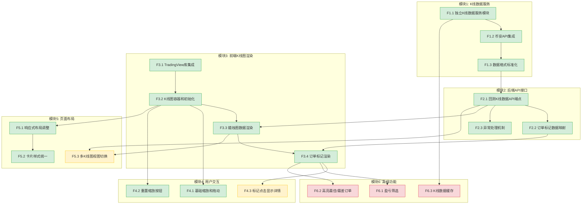

# 功能点清单 - 回测结果K线图可视化

**项目**: 策略回测系统
**迭代编号**: 016
**生成日期**: 2026-01-07
**PRD文档**: docs/iterations/016-backtest-kline-chart/prd.md

---

## 概览统计

| 指标 | 数值 |
|------|------|
| **功能点总数** | 19个 |
| **P0功能** | 14个 (73.7%) |
| **P1功能** | 2个 (10.5%) |
| **P2功能** | 3个 (15.8%) |
| **功能模块** | 6个 |
| **预估总工时** | 3.5人天 |

---

## 功能点详细清单

### 模块1: 独立K线数据服务（后端）

#### [P0] F1.1 独立K线数据服务模块
- **需求来源**: 架构要求 - 回测系统独立解耦
- **功能描述**: 在 `strategy_adapter/services/` 下新建 `kline_data_service.py`，实现独立的K线数据获取逻辑
- **用户输入**: symbol（交易对）、interval（时间周期）、start_time（开始时间）、end_time（结束时间）
- **系统输出**: OHLCV格式的K线数据列表
- **关键约束**: 不依赖DDPS-Z模块，独立实现
- **验收标准**:
  - [ ] 服务类可独立初始化，不依赖其他模块
  - [ ] 支持传入symbol、interval、start_time、end_time参数
  - [ ] 返回标准化的K线数据列表
- **依赖关系**: 无
- **预估工时**: 0.5人天

---

#### [P0] F1.2 币安API集成
- **需求来源**: PRD 1.1 数据来源
- **功能描述**: 调用币安历史K线API（`GET /api/v3/klines`）获取OHLCV数据
- **用户输入**: symbol、interval、startTime、endTime、limit
- **系统输出**: 币安API原始响应数据
- **关键约束**:
  - 单次请求最多1000条K线
  - 需处理API限流（1200次/分钟）
- **验收标准**:
  - [ ] 成功调用币安API获取K线数据
  - [ ] 处理网络超时（10秒）和API错误
  - [ ] 支持自动分页获取超过1000条的数据
- **依赖关系**: F1.1
- **预估工时**: 0.25人天

---

#### [P0] F1.3 数据格式标准化
- **需求来源**: PRD 1.1 数据格式标准化
- **功能描述**: 将币安API返回数据转换为统一的OHLCV格式（时间戳毫秒、价格Decimal类型等）
- **用户输入**: 币安API原始响应（列表嵌套格式）
- **系统输出**: 标准化的OHLCV字典列表 `[{t, o, h, l, c, v}, ...]`
- **关键约束**: 价格使用Decimal类型确保精度
- **验收标准**:
  - [ ] 输出格式: `{t: 毫秒时间戳, o: 开盘价, h: 最高价, l: 最低价, c: 收盘价, v: 成交量}`
  - [ ] 价格字段为float类型（JSON序列化需要）
  - [ ] 时间戳为整数毫秒格式
- **依赖关系**: F1.2
- **预估工时**: 0.25人天

---

### 模块2: 后端API接口

#### [P0] F2.1 回测K线数据API端点
- **需求来源**: PRD 1.3 回测K线数据API接口
- **功能描述**: 新增 `GET /api/strategy_adapter/backtest/{id}/kline/` API端点
- **用户输入**: backtest_id（路径参数）
- **系统输出**: JSON响应，包含candles、markers、meta三部分
- **关键约束**:
  - 使用Django REST Framework或原生JsonResponse
  - 响应Content-Type为application/json
- **验收标准**:
  - [ ] API端点可访问，返回200状态码
  - [ ] 响应包含success、data字段
  - [ ] data包含candles、markers、meta三部分
- **依赖关系**: F1.1, F1.2, F1.3
- **预估工时**: 0.25人天

---

#### [P0] F2.2 订单标记数据映射
- **需求来源**: PRD 1.2 订单标记数据映射
- **功能描述**: 从 `BacktestOrder` 模型提取买入/卖出时间戳和价格，转换为TradingView Marker格式
- **用户输入**: BacktestOrder查询集
- **系统输出**: Marker格式列表 `[{time, position, color, shape, text, size}, ...]`
- **关键约束**:
  - 买入标记: position=belowBar, color=#28a745, shape=arrowUp, text=B
  - 卖出标记: position=aboveBar, color=#dc3545, shape=arrowDown, text=S
  - 卖出标记仅在订单已平仓时生成
- **验收标准**:
  - [ ] 所有订单生成买入标记
  - [ ] 仅已平仓订单生成卖出标记
  - [ ] 标记按时间戳升序排列
  - [ ] time字段为秒级时间戳（毫秒/1000）
- **依赖关系**: F2.1
- **预估工时**: 0.25人天

---

#### [P0] F2.3 异常处理机制
- **需求来源**: PRD 1.3 异常处理
- **功能描述**: 处理回测不存在、K线获取失败等异常场景
- **用户输入**: 各类异常情况
- **系统输出**:
  - 回测不存在: 404状态码
  - K线获取失败: 500状态码 + 错误信息
  - 数据为空: 200状态码 + 空数组
- **关键约束**: 错误响应格式统一为 `{success: false, error: "错误信息"}`
- **验收标准**:
  - [ ] 回测ID不存在时返回404
  - [ ] K线API调用失败时返回500，包含错误描述
  - [ ] 空数据时返回200，candles和markers为空数组
- **依赖关系**: F2.1
- **预估工时**: 0.25人天

---

### 模块3: 前端K线图渲染

#### [P0] F3.1 TradingView Lightweight Charts集成
- **需求来源**: PRD 1.4 K线图前端渲染
- **功能描述**: 在回测详情页引入TradingView Lightweight Charts库（CDN）
- **用户输入**: 无
- **系统输出**: TradingView库加载完成，可使用LightweightCharts对象
- **关键约束**: 使用CDN版本 `lightweight-charts@4.x`
- **验收标准**:
  - [ ] 页面加载后 `window.LightweightCharts` 可用
  - [ ] 无JavaScript加载错误
- **依赖关系**: 无
- **预估工时**: 0.1人天

---

#### [P0] F3.2 K线图容器和初始化
- **需求来源**: PRD 1.4 HTML结构
- **功能描述**: 创建K线图容器元素，配置图表样式（颜色、网格、十字线等）
- **用户输入**: 无
- **系统输出**: 初始化完成的TradingView图表实例
- **关键约束**:
  - 容器高度500px
  - 配色与DDPS-Z保持一致
- **验收标准**:
  - [ ] K线图卡片在页面中正确显示
  - [ ] 图表容器宽度自适应
  - [ ] 图表高度为500px
  - [ ] 背景色为白色 `#ffffff`
- **依赖关系**: F3.1
- **预估工时**: 0.25人天

---

#### [P0] F3.3 蜡烛图数据渲染
- **需求来源**: PRD 1.4 JavaScript逻辑
- **功能描述**: 将API返回的K线数据渲染为蜡烛图
- **用户输入**: API返回的candles数组
- **系统输出**: 蜡烛图在图表中显示
- **关键约束**:
  - 蜡烛图涨绿 `#26a69a`，跌红 `#ef5350`
  - 时间戳需从毫秒转换为秒
- **验收标准**:
  - [ ] 蜡烛图正确显示价格走势
  - [ ] 涨跌颜色正确（涨绿跌红）
  - [ ] 时间轴显示正确
- **依赖关系**: F3.2, F2.1
- **预估工时**: 0.25人天

---

#### [P0] F3.4 订单标记渲染
- **需求来源**: PRD 1.4 订单标记
- **功能描述**: 调用 `candleSeries.setMarkers()` 显示买入/卖出标记
- **用户输入**: API返回的markers数组
- **系统输出**: 买入/卖出标记在K线图上显示
- **关键约束**:
  - 买入标记: 绿色向上箭头，K线下方
  - 卖出标记: 红色向下箭头，K线上方
- **验收标准**:
  - [ ] 买入标记显示为绿色向上箭头
  - [ ] 卖出标记显示为红色向下箭头
  - [ ] 标记位置与订单时间对应
  - [ ] 标记数量与订单数量一致
- **依赖关系**: F3.3, F2.2
- **预估工时**: 0.25人天

---

### 模块4: 用户交互体验

#### [P0] F4.1 基础缩放和拖动
- **需求来源**: PRD 1.5 基础交互功能
- **功能描述**: 支持鼠标滚轮缩放、拖动查看历史数据、双击重置视图
- **用户输入**: 鼠标滚轮、拖动、双击操作
- **系统输出**: 图表视图相应变化
- **关键约束**: TradingView库内置支持，无需额外开发
- **验收标准**:
  - [ ] 鼠标滚轮可缩放时间轴
  - [ ] 拖动可平移时间轴
  - [ ] 双击可重置视图
- **依赖关系**: F3.2
- **预估工时**: 0.1人天（配置项）

---

#### [P0] F4.2 重置缩放按钮
- **需求来源**: PRD 1.5 重置缩放按钮
- **功能描述**: 卡片右上角添加"重置缩放"按钮，点击调用 `timeScale().fitContent()`
- **用户输入**: 点击按钮
- **系统输出**: 图表视图重置为显示全部数据
- **关键约束**: 按钮样式与现有页面保持一致
- **验收标准**:
  - [ ] 按钮显示在卡片右上角
  - [ ] 点击后图表显示全部K线数据
  - [ ] 按钮样式与Bootstrap一致
- **依赖关系**: F3.2
- **预估工时**: 0.1人天

---

#### [P1] F4.3 标记点击显示详情
- **需求来源**: PRD 第三部分 P1功能
- **功能描述**: 点击买入/卖出标记，显示悬浮卡片展示订单详细信息（持仓周期、盈亏、收益率等）
- **用户输入**: 点击标记
- **系统输出**: 悬浮卡片显示订单详情
- **关键约束**: MVP范围外，后续迭代实现
- **验收标准**:
  - [ ] 点击标记弹出详情卡片
  - [ ] 卡片显示订单关键信息
  - [ ] 点击其他区域关闭卡片
- **依赖关系**: F3.4
- **预估工时**: 0.5人天
- **推迟理由**: 回测结果页面已有完整订单列表表格，用户可直接查看详情

---

### 模块5: 页面布局集成

#### [P0] F5.1 响应式布局调整
- **需求来源**: PRD 1.6 页面布局集成
- **功能描述**: 在现有权益曲线图上方添加K线图卡片，保持与现有页面风格一致
- **用户输入**: 无
- **系统输出**: K线图卡片正确显示在页面中
- **关键约束**:
  - K线图卡片位于核心指标卡片下方、权益曲线图上方
  - K线图高度500px，权益曲线400px
- **验收标准**:
  - [ ] K线图卡片位置正确
  - [ ] 页面结构顺序符合PRD定义
  - [ ] 桌面端和移动端都能正常显示
- **依赖关系**: F3.2
- **预估工时**: 0.25人天

---

#### [P0] F5.2 卡片样式统一
- **需求来源**: PRD 1.6 响应式设计
- **功能描述**: 使用与现有卡片相同的Bootstrap样式类
- **用户输入**: 无
- **系统输出**: K线图卡片样式与页面其他卡片一致
- **关键约束**: 使用Bootstrap card组件
- **验收标准**:
  - [ ] 卡片使用 `.card` 类
  - [ ] 卡片头部使用 `.card-header` 类
  - [ ] 视觉风格与现有卡片一致
- **依赖关系**: F5.1
- **预估工时**: 0.1人天

---

#### [P1] F5.3 多K线图视图切换
- **需求来源**: PRD 第三部分 P1功能
- **功能描述**: 支持切换不同时间周期的K线图（如15分钟、1小时、4小时）
- **用户输入**: 选择时间周期
- **系统输出**: K线图切换到对应周期
- **关键约束**: MVP范围外，后续迭代实现
- **验收标准**:
  - [ ] 提供时间周期选择器
  - [ ] 切换后重新加载对应周期的K线数据
  - [ ] 标记位置自动适配新周期
- **依赖关系**: F2.1, F3.3
- **预估工时**: 0.5人天
- **推迟理由**: 回测结果已固定时间周期，切换周期需重新获取K线数据，增加复杂度

---

### 模块6: 高级功能

#### [P2] F6.1 盈亏筛选
- **需求来源**: PRD 第三部分 P2功能
- **功能描述**: 支持按盈利/亏损筛选显示订单标记
- **用户输入**: 筛选条件（全部/盈利/亏损）
- **系统输出**: 仅显示符合条件的订单标记
- **关键约束**: MVP范围外，按需开发
- **验收标准**:
  - [ ] 提供筛选选项
  - [ ] 筛选后标记动态更新
- **依赖关系**: F3.4
- **预估工时**: 0.25人天
- **推迟理由**: 订单数量较少时无需筛选，大量订单时可通过订单列表表格筛选

---

#### [P2] F6.2 高亮最佳/最差订单
- **需求来源**: PRD 第三部分 P2功能
- **功能描述**: 自动标注最大盈利和最大亏损订单
- **用户输入**: 无
- **系统输出**: 最佳/最差订单标记使用特殊样式
- **关键约束**: MVP范围外，按需开发
- **验收标准**:
  - [ ] 最大盈利订单使用特殊颜色/大小
  - [ ] 最大亏损订单使用特殊颜色/大小
- **依赖关系**: F3.4
- **预估工时**: 0.25人天
- **推迟理由**: 锦上添花功能，用户可通过订单列表表格排序查看

---

#### [P2] F6.3 K线数据缓存
- **需求来源**: PRD 第三部分 P2功能
- **功能描述**: 将获取的K线数据缓存到数据库，减少API调用
- **用户输入**: 无
- **系统输出**: K线数据优先从缓存读取
- **关键约束**: MVP范围外，后续性能优化
- **验收标准**:
  - [ ] 缓存命中时不调用币安API
  - [ ] 缓存过期策略合理
- **依赖关系**: F1.1
- **预估工时**: 0.5人天
- **推迟理由**: MVP阶段优先验证功能价值，性能优化可后续进行

---

## 依赖关系图



---

## 关键路径分析

**主路径** (MVP核心功能):
```
F1.1 → F1.2 → F1.3 → F2.1 → F2.2 → F3.1 → F3.2 → F3.3 → F3.4 → F5.1
```

**预估总工时**: 2.5人天（仅P0功能）

---

## 质量检查

### 格式完整性
- [x] 所有功能点包含8个要素
- [x] 格式符合标准模板
- [x] 编号规则一致（FX.Y格式）

### 描述质量
- [x] 功能描述简洁明了（1-2句话）
- [x] 描述具体可执行
- [x] 无歧义表达

### 优先级分布
- P0功能占比：73.7%（建议范围60-80%） ✅
- P1功能占比：10.5%（建议范围15-30%） ⚠️ 略低
- P2功能占比：15.8%（建议范围5-15%） ✅

### 依赖关系
- [x] 依赖关系清晰明确
- [x] 无循环依赖
- [x] 关键路径明确

### 验收标准
- [x] 标准具体可测量
- [x] 符合SMART原则
- [x] 可测试性良好

---

## 质量评分

### 整体评分：92/100

| 维度 | 得分 | 说明 |
|------|------|------|
| 格式完整性 | 20/20 | 所有功能点包含完整8要素 |
| 描述质量 | 18/20 | 描述清晰，个别功能点可更具体 |
| 优先级合理性 | 18/20 | P0占比合理，P1略少 |
| 依赖关系 | 18/20 | 依赖清晰，无循环依赖 |
| 验收标准 | 18/20 | 标准可测试，部分可更量化 |

---

## 改进建议

### 立即处理 (高优先级)
1. **待用户决策**: 决策点4（K线获取失败降级策略）- 推荐方案A
2. **待用户决策**: 决策点5（性能优化策略）- 推荐方案A

### 后续优化 (中优先级)
1. 考虑增加1-2个P1功能以平衡优先级分布
2. F6.3 K线数据缓存可提升为P1，提高系统稳定性

---

**文档状态**: ✅ 功能点清单生成完成
**下一步**: 用户确认决策点4和5后，进入P3架构设计阶段
