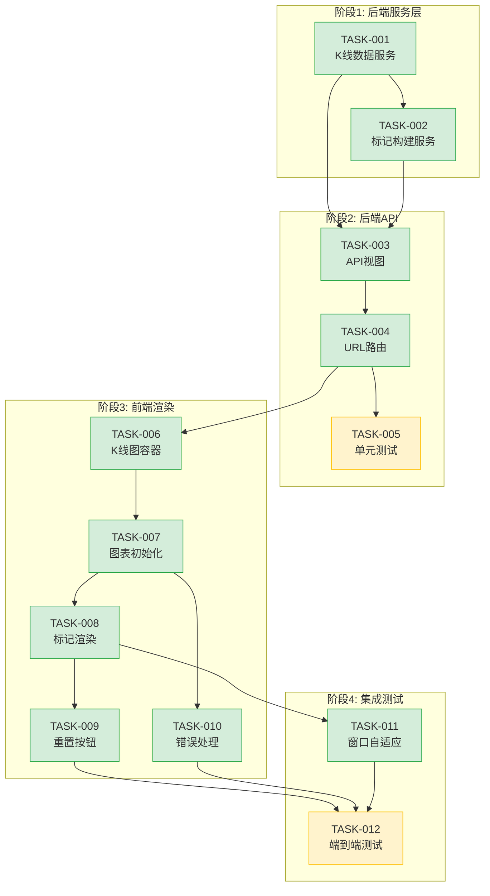

# 开发任务清单 - 回测结果K线图可视化

**项目名称**: 策略回测系统
**迭代编号**: 016
**生成日期**: 2026-01-07
**生命周期阶段**: P5 - 任务规划

---

## 任务概览

| 指标 | 数值 |
|------|------|
| **任务总数** | 12个 |
| **预估总工时** | 2.5人天 |
| **关键路径** | TASK-001 → 002 → 003 → 004 → 006 → 007 → 008 → 010 |

---

## 任务列表

### 阶段1：后端服务层（0.75人天）

#### TASK-016-001: 创建services目录和K线数据服务

**关联功能点**: F1.1, F1.2, F1.3
**优先级**: P0
**预估工时**: 0.5人天
**依赖**: 无

**描述**:
创建 `strategy_adapter/services/` 目录，实现 `KlineDataService` 类，负责从币安API获取历史K线数据。

**验收标准**:
- [ ] 创建 `strategy_adapter/services/__init__.py`
- [ ] 创建 `strategy_adapter/services/kline_data_service.py`
- [ ] `KlineDataService` 类实现 `get_klines(symbol, interval, start_time, end_time)` 方法
- [ ] 支持调用币安 `/api/v3/klines` API
- [ ] 支持自动分页（单次超过1000条时）
- [ ] 返回标准化OHLCV格式: `{t, o, h, l, c, v}`
- [ ] 处理网络超时（10秒）和API错误

**实现要点**:
```python
# strategy_adapter/services/kline_data_service.py
import requests
from typing import List

class KlineDataService:
    BASE_URL = "https://api.binance.com/api/v3/klines"
    MAX_LIMIT = 1000

    def __init__(self, timeout: int = 10):
        self.timeout = timeout

    def get_klines(self, symbol: str, interval: str,
                   start_time: int, end_time: int) -> List[dict]:
        # 实现分页获取和格式转换
        pass
```

**状态**: [ ] 未开始

---

#### TASK-016-002: 创建标记构建服务

**关联功能点**: F2.2
**优先级**: P0
**预估工时**: 0.25人天
**依赖**: TASK-016-001

**描述**:
实现 `MarkerBuilderService` 类，将 `BacktestOrder` 转换为TradingView Marker格式。

**验收标准**:
- [ ] 创建 `strategy_adapter/services/marker_builder_service.py`
- [ ] `MarkerBuilderService` 类实现 `build_markers(orders)` 方法
- [ ] 为所有订单生成买入标记（绿色向上箭头，K线下方）
- [ ] 仅为已平仓订单生成卖出标记（红色向下箭头，K线上方）
- [ ] 标记按时间戳升序排列
- [ ] 时间戳从毫秒转换为秒

**实现要点**:
```python
# strategy_adapter/services/marker_builder_service.py
class MarkerBuilderService:
    BUY_COLOR = "#28a745"
    SELL_COLOR = "#dc3545"

    def build_markers(self, orders) -> List[dict]:
        markers = []
        for order in orders:
            # 买入标记
            markers.append({
                'time': order.buy_timestamp // 1000,
                'position': 'belowBar',
                'color': self.BUY_COLOR,
                'shape': 'arrowUp',
                'text': 'B',
                'size': 1
            })
            # 卖出标记（仅已平仓）
            if order.status == 'closed' and order.sell_timestamp:
                markers.append({...})
        return sorted(markers, key=lambda x: x['time'])
```

**状态**: [ ] 未开始

---

### 阶段2：后端API（0.5人天）

#### TASK-016-003: 实现K线数据API视图

**关联功能点**: F2.1, F2.3
**优先级**: P0
**预估工时**: 0.25人天
**依赖**: TASK-016-001, TASK-016-002

**描述**:
在 `views.py` 中新增 `BacktestKlineAPIView`，提供K线数据和订单标记的JSON API。

**验收标准**:
- [ ] 新增 `BacktestKlineAPIView` 类（继承 `View`）
- [ ] 实现 `get(request, pk)` 方法
- [ ] 返回JSON响应，包含 `candles`、`markers`、`meta` 三部分
- [ ] 回测不存在时返回404，错误信息为 `{"success": false, "error": "回测结果不存在"}`
- [ ] K线获取失败时返回500，包含错误描述
- [ ] 数据为空时返回200，candles和markers为空数组

**实现要点**:
```python
# strategy_adapter/views.py
from django.views import View
from django.http import JsonResponse
from .services.kline_data_service import KlineDataService
from .services.marker_builder_service import MarkerBuilderService

class BacktestKlineAPIView(View):
    def get(self, request, pk):
        try:
            result = BacktestResult.objects.get(pk=pk)
        except BacktestResult.DoesNotExist:
            return JsonResponse({'success': False, 'error': '回测结果不存在'}, status=404)

        # 获取K线和标记
        # 返回响应
```

**状态**: [ ] 未开始

---

#### TASK-016-004: 添加API URL路由

**关联功能点**: F2.1
**优先级**: P0
**预估工时**: 0.1人天
**依赖**: TASK-016-003

**描述**:
在 `urls.py` 中添加K线API路由。

**验收标准**:
- [ ] 在 `urlpatterns` 中添加新路由
- [ ] 路由路径: `api/backtest/<int:pk>/kline/`
- [ ] 路由名称: `backtest_kline_api`
- [ ] API可通过 `/strategy-adapter/api/backtest/1/kline/` 访问

**实现要点**:
```python
# strategy_adapter/urls.py
urlpatterns = [
    # 现有路由...
    path('api/backtest/<int:pk>/kline/', views.BacktestKlineAPIView.as_view(), name='backtest_kline_api'),
]
```

**状态**: [ ] 未开始

---

#### TASK-016-005: 单元测试 - 后端服务和API

**关联功能点**: 全部后端功能点
**优先级**: P0
**预估工时**: 0.25人天
**依赖**: TASK-016-004

**描述**:
为K线数据服务、标记构建服务和API视图编写单元测试。

**验收标准**:
- [ ] 创建 `tests/test_kline_data_service.py`
- [ ] 创建 `tests/test_marker_builder_service.py`
- [ ] 创建 `tests/test_kline_api_view.py`
- [ ] 测试K线数据格式转换
- [ ] 测试标记生成（买入/卖出）
- [ ] 测试API响应格式
- [ ] 测试异常处理（404, 500）
- [ ] 所有测试通过

**状态**: [ ] 未开始

---

### 阶段3：前端渲染（1人天）

#### TASK-016-006: 添加TradingView库和K线图容器

**关联功能点**: F3.1, F3.2, F5.1, F5.2
**优先级**: P0
**预估工时**: 0.25人天
**依赖**: TASK-016-004

**描述**:
在 `backtest_detail.html` 中引入TradingView Lightweight Charts库，添加K线图卡片容器。

**验收标准**:
- [ ] 在 `<head>` 或页面底部引入TradingView库CDN
- [ ] 在核心指标卡片下方添加K线图卡片HTML结构
- [ ] 卡片包含标题"K线图与交易标记"和"重置缩放"按钮
- [ ] 图表容器高度500px
- [ ] 卡片样式与现有卡片一致（Bootstrap card）

**实现要点**:
```html
<!-- 引入TradingView库 -->
<script src="https://cdn.jsdelivr.net/npm/lightweight-charts@4.1.0/dist/lightweight-charts.standalone.production.js"></script>

<!-- K线图卡片 -->
<div class="card mb-4">
    <div class="card-header d-flex justify-content-between align-items-center">
        <span><i class="bi bi-graph-up me-2"></i>K线图与交易标记</span>
        <button class="btn btn-sm btn-outline-secondary" id="reset-kline-zoom-btn">
            <i class="bi bi-zoom-out"></i> 重置缩放
        </button>
    </div>
    <div class="card-body">
        <div id="kline-chart" style="height: 500px;" data-backtest-id="{{ result.pk }}"></div>
    </div>
</div>
```

**状态**: [ ] 未开始

---

#### TASK-016-007: 实现K线图初始化和数据加载

**关联功能点**: F3.3, F4.1
**优先级**: P0
**预估工时**: 0.25人天
**依赖**: TASK-016-006

**描述**:
实现JavaScript逻辑，初始化TradingView图表并从API加载K线数据。

**验收标准**:
- [ ] 页面加载时自动调用K线API
- [ ] 创建图表实例，配置颜色、网格、十字线
- [ ] 添加蜡烛图系列
- [ ] 设置K线数据（时间戳从毫秒转秒）
- [ ] 调用 `fitContent()` 适配视图
- [ ] 支持鼠标滚轮缩放和拖动（库内置）

**实现要点**:
```javascript
const BacktestKlineChart = {
    chart: null,
    candleSeries: null,

    init: async function(backtestId) {
        const response = await fetch(`/strategy-adapter/api/backtest/${backtestId}/kline/`);
        const data = await response.json();

        if (!data.success) {
            this.showError(data.error);
            return;
        }

        this.createChart();
        this.renderCandles(data.data.candles);
        this.renderMarkers(data.data.markers);
        this.chart.timeScale().fitContent();
    },

    createChart: function() {
        // 创建图表，配置样式
    },

    renderCandles: function(candles) {
        // 转换数据格式并渲染
    }
};
```

**状态**: [ ] 未开始

---

#### TASK-016-008: 实现订单标记渲染

**关联功能点**: F3.4
**优先级**: P0
**预估工时**: 0.25人天
**依赖**: TASK-016-007

**描述**:
实现订单标记在K线图上的渲染。

**验收标准**:
- [ ] 调用 `candleSeries.setMarkers(markers)` 设置标记
- [ ] 买入标记显示为绿色向上箭头（K线下方）
- [ ] 卖出标记显示为红色向下箭头（K线上方）
- [ ] 标记位置与订单时间对应
- [ ] 鼠标悬停显示标记文字（B/S）

**实现要点**:
```javascript
renderMarkers: function(markers) {
    // markers已经是正确格式，直接设置
    this.candleSeries.setMarkers(markers);
}
```

**状态**: [ ] 未开始

---

#### TASK-016-009: 实现重置缩放按钮

**关联功能点**: F4.2
**优先级**: P0
**预估工时**: 0.1人天
**依赖**: TASK-016-008

**描述**:
为"重置缩放"按钮添加点击事件处理。

**验收标准**:
- [ ] 点击按钮后图表显示全部K线数据
- [ ] 调用 `chart.timeScale().fitContent()`

**实现要点**:
```javascript
document.getElementById('reset-kline-zoom-btn').addEventListener('click', function() {
    BacktestKlineChart.resetZoom();
});

resetZoom: function() {
    if (this.chart) {
        this.chart.timeScale().fitContent();
    }
}
```

**状态**: [ ] 未开始

---

#### TASK-016-010: 实现错误处理和降级显示

**关联功能点**: F2.3（前端部分）
**优先级**: P0
**预估工时**: 0.15人天
**依赖**: TASK-016-007

**描述**:
当K线数据获取失败时，显示友好的错误提示。

**验收标准**:
- [ ] API请求失败时显示错误提示
- [ ] 错误提示使用Bootstrap alert样式
- [ ] 提示文字："K线数据加载失败：{错误信息}"
- [ ] 页面其他功能（权益曲线、订单列表）不受影响

**实现要点**:
```javascript
showError: function(message) {
    const container = document.getElementById('kline-chart');
    container.innerHTML = `
        <div class="alert alert-warning text-center" style="margin-top: 200px;">
            <i class="bi bi-exclamation-triangle me-2"></i>
            K线数据加载失败：${message}
        </div>
    `;
}
```

**状态**: [ ] 未开始

---

### 阶段4：集成和测试（0.25人天）

#### TASK-016-011: 窗口大小自适应

**关联功能点**: F5.1
**优先级**: P0
**预估工时**: 0.1人天
**依赖**: TASK-016-008

**描述**:
实现图表宽度随窗口大小变化自适应。

**验收标准**:
- [ ] 窗口大小变化时图表宽度自动调整
- [ ] 使用 `resize` 事件监听
- [ ] 调用 `chart.applyOptions({ width: newWidth })`

**实现要点**:
```javascript
window.addEventListener('resize', function() {
    if (BacktestKlineChart.chart) {
        const container = document.getElementById('kline-chart');
        BacktestKlineChart.chart.applyOptions({
            width: container.clientWidth
        });
    }
});
```

**状态**: [ ] 未开始

---

#### TASK-016-012: 端到端测试和验收

**关联功能点**: 全部
**优先级**: P0
**预估工时**: 0.15人天
**依赖**: TASK-016-011

**描述**:
执行端到端测试，验证所有功能正常工作。

**验收标准**:
- [ ] 访问回测详情页，K线图正确显示
- [ ] 买入/卖出标记正确显示
- [ ] 缩放、拖动功能正常
- [ ] 重置缩放按钮正常
- [ ] 错误处理正常（可通过修改API响应模拟）
- [ ] 窗口大小变化时图表自适应
- [ ] 移动端显示正常

**测试命令**:
```bash
# 1. 启动服务
python manage.py runserver

# 2. 访问回测详情页
# http://localhost:8000/strategy-adapter/results/{id}/

# 3. 验证K线图功能
```

**状态**: [ ] 未开始

---

## 任务依赖图



---

## 关键路径

```
TASK-001 → TASK-002 → TASK-003 → TASK-004 → TASK-006 → TASK-007 → TASK-008 → TASK-011 → TASK-012
```

**关键路径工时**: 约2人天

---

## 里程碑

| 里程碑 | 完成任务 | 验证方式 |
|--------|---------|---------|
| M1: 后端API可用 | TASK-001~005 | `curl /strategy-adapter/api/backtest/1/kline/` 返回JSON |
| M2: K线图渲染完成 | TASK-006~008 | 页面显示K线图和标记 |
| M3: 交互功能完成 | TASK-009~011 | 缩放、重置、错误处理正常 |
| M4: 功能验收 | TASK-012 | 所有验收标准通过 |

---

**文档状态**: ✅ 任务规划完成，可进入P6开发实现阶段
