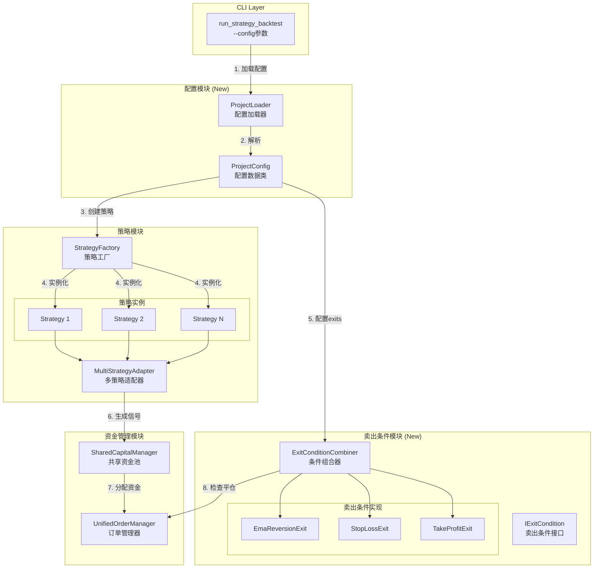
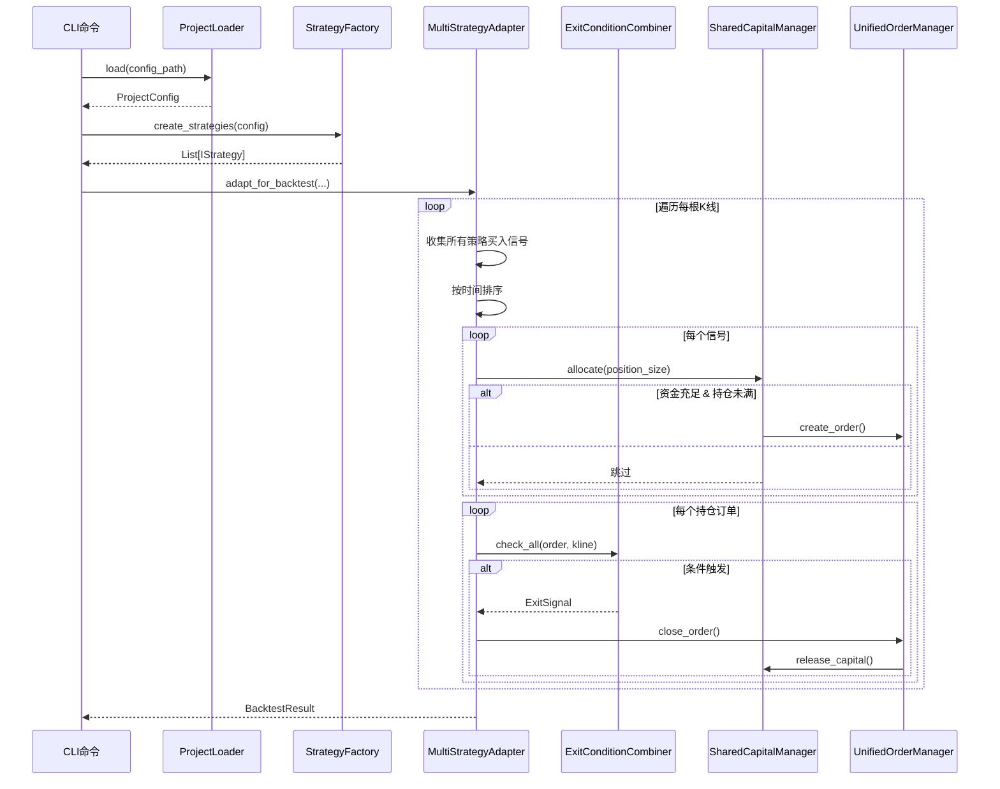

# 架构设计: 多策略组合回测系统

> **迭代编号**: 017
> **创建时间**: 2026-01-07
> **状态**: Approved
> **关联PRD**: [prd.md](./prd.md)
> **关联功能点**: [function-points.md](./function-points.md)

---

## 1. 架构概述

### 1.1 设计目标

将当前的单策略回测系统升级为**多策略组合回测框架**，支持：
- JSON配置文件定义回测项目
- 多策略并行运行，共享资金池
- 每个策略可配置多个卖出条件
- 向后兼容现有单策略模式

### 1.2 核心设计决策

| 决策点 | 最终方案 | 理由 |
|--------|----------|------|
| MultiStrategyAdapter实现 | 独立实现（不继承） | 完全控制执行流程，真正实现共享资金池 |
| 卖出条件执行时机 | K线内模拟 | 止损/止盈在极值点触发，更接近实盘 |
| Order模型扩展 | 直接添加strategy_id字段 | 简单直接，默认None保证向后兼容 |

---

## 2. 系统架构图

### 2.1 组件图



### 2.2 时序图



---

## 3. 模块设计

### 3.1 目录结构

```
strategy_adapter/
├── interfaces/
│   ├── strategy.py              # IStrategy (现有，无变更)
│   └── exit_condition.py        # IExitCondition (新增)
├── core/
│   ├── strategy_adapter.py      # StrategyAdapter (现有，无变更)
│   ├── multi_strategy_adapter.py # MultiStrategyAdapter (新增)
│   ├── project_loader.py        # ProjectLoader (新增)
│   ├── strategy_factory.py      # StrategyFactory (新增)
│   ├── shared_capital_manager.py # SharedCapitalManager (新增)
│   └── unified_order_manager.py # (扩展strategy_id)
├── exits/                       # (新增目录)
│   ├── __init__.py
│   ├── base.py                  # IExitCondition接口
│   ├── ema_reversion.py
│   ├── stop_loss.py
│   ├── take_profit.py
│   └── combiner.py              # ExitConditionCombiner
├── models/
│   ├── order.py                 # (扩展strategy_id)
│   └── project_config.py        # ProjectConfig (新增)
└── management/commands/
    └── run_strategy_backtest.py # (扩展--config)
```

### 3.2 组件与功能点映射

| 组件 | 负责实现的功能点 |
|------|------------------|
| ProjectLoader + ProjectConfig | FP-017-001~006 (配置模块) |
| IExitCondition | FP-017-007 (卖出条件基类) |
| EmaReversionExit | FP-017-008 (EMA回归) |
| StopLossExit | FP-017-009 (止损) |
| TakeProfitExit | FP-017-010 (止盈) |
| ExitConditionCombiner | FP-017-011 (条件组合器) |
| StrategyFactory | FP-017-012 (策略工厂) |
| MultiStrategyAdapter | FP-017-013~015 (多策略适配) |
| SharedCapitalManager | FP-017-016~017 (资金管理) |
| CLI扩展 | FP-017-018 (--config参数) |

---

## 4. 接口定义

### 4.1 IExitCondition (卖出条件接口)

```python
from abc import ABC, abstractmethod
from typing import Optional, Dict, Any
from decimal import Decimal
from dataclasses import dataclass

@dataclass
class ExitSignal:
    """卖出信号"""
    timestamp: int           # 触发时间戳（毫秒）
    price: Decimal           # 卖出价格
    reason: str              # 触发原因
    exit_type: str           # 条件类型: ema_reversion, stop_loss, take_profit

class IExitCondition(ABC):
    """卖出条件抽象接口"""

    @abstractmethod
    def check(
        self,
        order: 'Order',
        kline: Dict[str, Any],
        indicators: Dict[str, Any],
        current_timestamp: int
    ) -> Optional[ExitSignal]:
        """
        检查是否满足卖出条件

        Args:
            order: 持仓订单
            kline: 当前K线数据 {open, high, low, close, volume}
            indicators: 技术指标 {ema25: value, ...}
            current_timestamp: 当前时间戳

        Returns:
            ExitSignal如果触发，否则None
        """
        pass

    @abstractmethod
    def get_type(self) -> str:
        """返回条件类型标识"""
        pass
```

### 4.2 ProjectConfig (配置数据类)

```python
from dataclasses import dataclass, field
from typing import List, Optional, Dict, Any
from decimal import Decimal

@dataclass
class ExitConfig:
    """卖出条件配置"""
    type: str                    # ema_reversion, stop_loss, take_profit
    params: Dict[str, Any]       # 参数: {ema_period: 25}, {percentage: 5}

@dataclass
class StrategyConfig:
    """单个策略配置"""
    id: str                      # 策略唯一ID
    name: str                    # 策略名称
    type: str                    # 策略类型: ddps-z
    enabled: bool = True         # 是否启用
    entry: Dict[str, Any] = field(default_factory=dict)  # 入场配置
    exits: List[ExitConfig] = field(default_factory=list) # 卖出条件列表

@dataclass
class CapitalManagementConfig:
    """资金管理配置"""
    mode: str = "shared"              # 资金模式: shared
    position_size_mode: str = "fixed" # 仓位模式: fixed
    position_size: Decimal = Decimal("100")  # 单笔金额
    max_positions: int = 10           # 最大持仓数

@dataclass
class BacktestConfig:
    """回测配置"""
    symbol: str
    interval: str
    market_type: str
    start_date: str
    end_date: str
    initial_cash: Decimal
    commission_rate: Decimal

@dataclass
class ProjectConfig:
    """回测项目配置"""
    project_name: str
    description: str
    version: str
    backtest_config: BacktestConfig
    capital_management: CapitalManagementConfig
    strategies: List[StrategyConfig]
```

### 4.3 MultiStrategyAdapter

```python
class MultiStrategyAdapter:
    """多策略适配器"""

    def __init__(
        self,
        strategies: List[Tuple[str, IStrategy]],  # [(strategy_id, strategy), ...]
        exit_combiners: Dict[str, ExitConditionCombiner],  # {strategy_id: combiner}
        capital_manager: SharedCapitalManager,
        order_manager: UnifiedOrderManager
    ):
        pass

    def adapt_for_backtest(
        self,
        klines: pd.DataFrame,
        indicators: Dict[str, pd.Series],
        initial_cash: Decimal,
        symbol: str
    ) -> Dict:
        """
        执行多策略回测

        Returns:
            {
                'entries': pd.Series,
                'exits': pd.Series,
                'orders': List[Order],
                'statistics': Dict,
                'strategy_statistics': Dict[str, Dict]  # 按策略分组统计
            }
        """
        pass
```

---

## 5. 关键流程

### 5.1 卖出条件检查流程（K线内模拟）

```python
def check_exit_conditions(order, kline, indicators, timestamp):
    """
    K线内模拟止损/止盈触发

    假设价格路径：
    - 如果close > open（阳线）: O -> L -> H -> C
    - 如果close < open（阴线）: O -> H -> L -> C
    """
    signals = []

    # 1. 检查止损（使用low价格）
    stop_loss_price = order.open_price * (1 - stop_loss_pct)
    if kline['low'] <= stop_loss_price:
        signals.append(ExitSignal(
            timestamp=timestamp,
            price=stop_loss_price,  # 以止损价成交
            reason='止损触发',
            exit_type='stop_loss'
        ))

    # 2. 检查止盈（使用high价格）
    take_profit_price = order.open_price * (1 + take_profit_pct)
    if kline['high'] >= take_profit_price:
        signals.append(ExitSignal(
            timestamp=timestamp,
            price=take_profit_price,  # 以止盈价成交
            reason='止盈触发',
            exit_type='take_profit'
        ))

    # 3. 检查EMA回归（使用收盘价区间）
    if kline['low'] <= ema_value <= kline['high']:
        signals.append(ExitSignal(
            timestamp=timestamp,
            price=ema_value,
            reason='EMA回归',
            exit_type='ema_reversion'
        ))

    # 4. 返回最先触发的（根据价格路径判断）
    return earliest_signal(signals, kline)
```

### 5.2 信号合并与资金分配流程

```python
def process_signals(all_signals, capital_manager, order_manager):
    """
    处理多策略信号

    1. 合并所有策略的买入信号
    2. 按时间戳排序
    3. 先到先得分配资金
    """
    # 合并并排序
    sorted_signals = sorted(all_signals, key=lambda s: s['timestamp'])

    for signal in sorted_signals:
        # 检查资金和持仓限制
        if not capital_manager.can_allocate(position_size):
            logger.warning(f"资金不足，跳过信号: {signal}")
            continue

        if order_manager.open_order_count >= max_positions:
            logger.warning(f"持仓已满，跳过信号: {signal}")
            continue

        # 创建订单，标记策略ID
        order = order_manager.create_order(
            signal,
            strategy_id=signal['strategy_id']
        )
        capital_manager.allocate(order.position_value)
```

---

## 6. 兼容性设计

### 6.1 向后兼容

| 场景 | 行为 |
|------|------|
| 无`--config`参数 | 使用现有CLI参数，单策略模式 |
| Order.strategy_id | 单策略模式下为策略名称，如"DDPS-Z" |
| 现有BacktestResult | 保持不变，strategy_config字段可选 |

### 6.2 扩展点

| 扩展点 | 实现方式 |
|--------|----------|
| 新增策略类型 | StrategyFactory.register(type, class) |
| 新增卖出条件 | 实现IExitCondition接口 |
| 新增资金模式 | SharedCapitalManager子类 |

---

## 7. 测试策略

| 测试类型 | 覆盖范围 | 优先级 |
|----------|----------|--------|
| 单元测试 | 配置解析、卖出条件、资金管理 | P0 |
| 集成测试 | 多策略回测完整流程 | P0 |
| 回归测试 | 单策略模式兼容性 | P0 |
| 边界测试 | 资金不足、持仓已满、空配置 | P1 |

---

## 附录

### A. JSON配置Schema示例

```json
{
  "$schema": "http://json-schema.org/draft-07/schema#",
  "type": "object",
  "required": ["project_name", "backtest_config", "strategies"],
  "properties": {
    "project_name": {"type": "string"},
    "description": {"type": "string"},
    "version": {"type": "string", "default": "1.0"},
    "backtest_config": {
      "type": "object",
      "required": ["symbol", "interval", "market_type", "initial_cash"],
      "properties": {
        "symbol": {"type": "string"},
        "interval": {"type": "string"},
        "market_type": {"enum": ["futures", "spot"]},
        "start_date": {"type": "string", "format": "date"},
        "end_date": {"type": "string", "format": "date"},
        "initial_cash": {"type": "number", "minimum": 0},
        "commission_rate": {"type": "number", "default": 0.001}
      }
    },
    "capital_management": {
      "type": "object",
      "properties": {
        "mode": {"enum": ["shared"], "default": "shared"},
        "position_size": {"type": "number", "default": 100},
        "max_positions": {"type": "integer", "default": 10}
      }
    },
    "strategies": {
      "type": "array",
      "minItems": 1,
      "items": {
        "type": "object",
        "required": ["id", "name", "type"],
        "properties": {
          "id": {"type": "string"},
          "name": {"type": "string"},
          "type": {"enum": ["ddps-z"]},
          "enabled": {"type": "boolean", "default": true},
          "entry": {"type": "object"},
          "exits": {
            "type": "array",
            "items": {
              "type": "object",
              "required": ["type"],
              "properties": {
                "type": {"enum": ["ema_reversion", "stop_loss", "take_profit"]},
                "params": {"type": "object"}
              }
            }
          }
        }
      }
    }
  }
}
```
