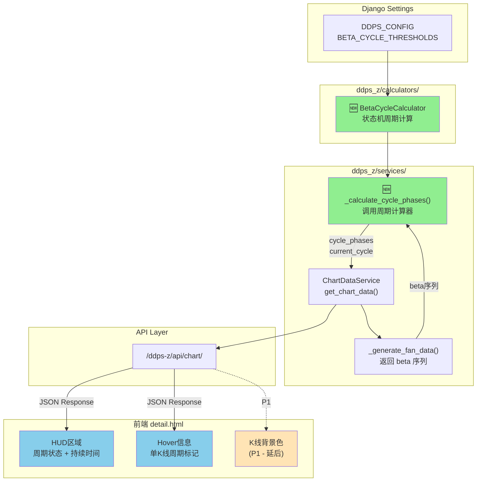
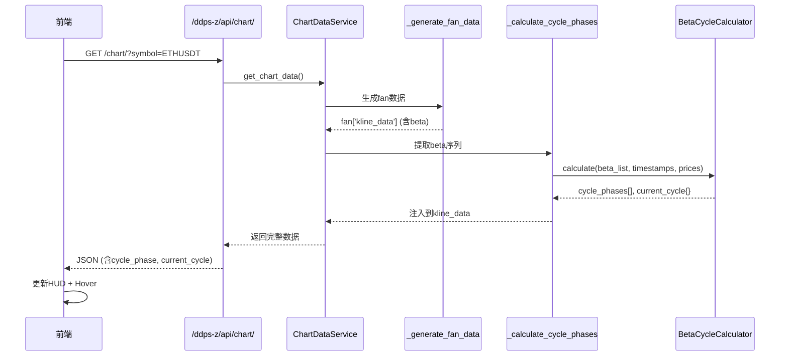

# 架构设计: β宏观周期指标

**迭代编号**: 018
**创建时间**: 2026-01-07
**状态**: 已确认

---

## 1. 需求解读与目标对齐

### 核心业务目标

在DDPS-Z详情页为每根K线标记宏观周期状态（强势上涨/强势下跌/震荡），让用户无需手动分析β值即可直观判断当前市场处于何种趋势阶段。

### 关键用户流程

1. 用户打开 `/ddps-z/detail/ETHUSDT/` 页面
2. 系统自动计算每根K线的周期状态
3. 用户在HUD区域看到当前周期状态和持续时间
4. 用户Hover某根K线时，看到该K线的周期标记

### 状态机定义

```
idle ──(β>600且增加)──► bull_warning ──(β>1000)──► bull_strong ──(β≤0)──► idle
idle ──(β<-600且减少)──► bear_warning ──(β<-1000)──► bear_strong ──(β≥0)──► idle
```

**核心约束**: 当前K线只能根据历史和自身状态计算，不修改历史标记（实时标记，无回溯）。

---

## 2. 架构设计与可视化

### 2.1 核心架构图



### 2.2 数据流时序图



### 2.3 组件职责

| 组件 | 职责 |
|------|------|
| **DDPS_CONFIG.BETA_CYCLE_THRESHOLDS** | 存储可配置的β阈值参数（全局配置） |
| **BetaCycleCalculator** | 核心状态机，维护内部状态，逐K线计算cycle_phase |
| **_calculate_cycle_phases()** | ChartDataService中的协调方法，调用计算器并整合结果 |
| **HUD区域** | 显示当前周期状态、持续时间、起始价格等 |
| **Hover信息** | 显示单根K线的cycle_phase标记 |

### 2.4 组件与需求映射

| 组件 | 负责实现的功能点 |
|------|------------------|
| **DDPS_CONFIG** | BE-001 (阈值配置定义) |
| **BetaCycleCalculator** | BE-002 (周期计算器状态机) |
| **_calculate_cycle_phases()** | BE-003 (集成到chart_data_service), BE-004 (当前周期统计) |
| **HUD区域** | FE-001 (HUD周期状态显示), FE-002 (HUD周期持续时间) |
| **Hover信息** | FE-003 (Hover周期信息) |
| **K线背景色** | FE-004 (P1延后) |

---

## 3. 关键决策与确认结果

### 决策点一：状态机实现位置

| 方案 | 描述 | 结果 |
|------|------|------|
| **A: 独立Calculator类** | 新建 `beta_cycle_calculator.py` | ✅ **已选择** |
| B: 内联到ChartDataService | 直接在方法内实现 | ❌ |

**理由**: 与现有架构一致（adx_calculator、inertia_calculator等），便于单元测试。

---

### 决策点二：周期标记策略

| 方案 | 描述 | 结果 |
|------|------|------|
| **A: 实时标记（无回溯）** | 每根K线根据当前状态标记，不修改历史 | ✅ **已选择** |
| B: 确认后回溯标记 | 周期确认后回溯修改历史K线 | ❌ |
| C: 区分预警与确认 | 周期结束时处理未确认预警 | ❌ |

**理由**: 当前K线只知道过去，不知道未来。根据历史和当前状态计算出什么就是什么，不修改历史。

---

### 决策点三：阈值配置粒度

| 方案 | 描述 | 结果 |
|------|------|------|
| **A: 全局配置** | 所有交易对共用一套阈值 | ✅ **已选择** |
| B: 按交易对配置 | 支持按币种单独配置 | ❌ (MVP后扩展) |

**理由**: MVP阶段简单优先，后续根据需求扩展。

---

## 4. 详细设计

### 4.1 阈值配置 (BE-001)

**文件**: `listing_monitor_project/settings.py`

```python
DDPS_CONFIG = {
    # 现有配置...

    # β周期阈值配置（前端显示值，原始值需/100）
    'BETA_CYCLE_THRESHOLDS': {
        'bull_warning': 600,      # 上涨预警阈值 (原始值: 6)
        'bull_strong': 1000,      # 强势上涨确认阈值 (原始值: 10)
        'bear_warning': -600,     # 下跌预警阈值 (原始值: -6)
        'bear_strong': -1000,     # 强势下跌确认阈值 (原始值: -10)
        'cycle_end': 0,           # 周期结束阈值
    },
}
```

### 4.2 状态机设计 (BE-002)

**文件**: `ddps_z/calculators/beta_cycle_calculator.py`

```python
class BetaCycleCalculator:
    """
    β宏观周期计算器 - 基于状态机的实时标记

    状态转换:
    - idle: 震荡期
    - bull_warning: 上涨预警 (β > 600 且增加)
    - bull_strong: 强势上涨 (已确认 β > 1000)
    - bear_warning: 下跌预警 (β < -600 且减少)
    - bear_strong: 强势下跌 (已确认 β < -1000)
    """

    def __init__(self, thresholds: dict = None):
        self.thresholds = thresholds or settings.DDPS_CONFIG['BETA_CYCLE_THRESHOLDS']
        self._reset_state()

    def _reset_state(self):
        """重置内部状态"""
        self.state = 'idle'
        self.cycle_start_idx = None
        self.confirmed = False

    def calculate(self, beta_list, timestamps, prices) -> tuple:
        """
        计算每根K线的周期标记

        Args:
            beta_list: β值序列（原始值，非显示值）
            timestamps: 时间戳序列
            prices: 价格序列

        Returns:
            (cycle_phases, current_cycle)
        """
        # 实现状态机逻辑...
```

**状态转换逻辑**:

```
当前状态: idle
├─ β > bull_warning/100 且 β > prev_β → 转为 bull_warning
├─ β < bear_warning/100 且 β < prev_β → 转为 bear_warning
└─ 其他 → 保持 idle

当前状态: bull_warning
├─ β > bull_strong/100 → 转为 bull_strong, confirmed=True
├─ β <= cycle_end/100 → 转为 idle (未确认的预警结束)
└─ 其他 → 保持 bull_warning

当前状态: bull_strong
├─ β <= cycle_end/100 → 转为 idle
└─ 其他 → 保持 bull_strong

(bear_warning / bear_strong 同理，方向相反)
```

### 4.3 K线周期标记值

| cycle_phase | 含义 | 显示标签 | 颜色 |
|-------------|------|----------|------|
| `consolidation` | 震荡期 | 震荡 | 灰色 |
| `bull_warning` | 上涨预警 | 上涨预警 | 浅绿色 |
| `bull_strong` | 强势上涨 | 强势上涨 | 绿色 |
| `bear_warning` | 下跌预警 | 下跌预警 | 浅红色 |
| `bear_strong` | 强势下跌 | 强势下跌 | 红色 |

### 4.4 当前周期统计 (BE-004)

```python
current_cycle = {
    'phase': 'bull_strong',           # 当前周期状态
    'phase_label': '强势上涨',         # 中文标签
    'duration_bars': 25,              # 持续K线数
    'duration_hours': 100,            # 持续小时数
    'start_time': '2026-01-03 08:00', # 周期开始时间
    'start_price': 3500.00,           # 周期开始价格
    'current_beta': 1250,             # 当前β值（显示值）
    'max_beta': 1800,                 # 周期内最大β值（上涨）/ 最小β值（下跌）
}
```

### 4.5 API响应结构

```json
{
  "chart": {
    "fan": {
      "kline_data": [
        {
          "t": 1704268800000,
          "beta": 12.5,
          "cycle_phase": "bull_strong",
          // ... 其他字段
        }
      ]
    },
    "current_cycle": {
      "phase": "bull_strong",
      "phase_label": "强势上涨",
      "duration_bars": 25,
      "duration_hours": 100,
      "start_time": "2026-01-03 08:00",
      "start_price": 3500.00,
      "current_beta": 1250,
      "max_beta": 1800
    }
  }
}
```

### 4.6 前端HUD显示

```html
<div class="hud-item">
    <span class="hud-label">周期:</span>
    <span id="hud-cycle-phase" class="badge bg-success">强势上涨</span>
    <span id="hud-cycle-duration" class="text-muted ms-2">已持续 25根K线 (4.2天)</span>
</div>
```

---

## 5. 文件变更清单

| 文件 | 变更类型 | 说明 |
|------|----------|------|
| `listing_monitor_project/settings.py` | 修改 | 添加BETA_CYCLE_THRESHOLDS配置 |
| `ddps_z/calculators/beta_cycle_calculator.py` | 新建 | 周期计算器状态机 |
| `ddps_z/calculators/__init__.py` | 修改 | 导出BetaCycleCalculator |
| `ddps_z/services/chart_data_service.py` | 修改 | 添加_calculate_cycle_phases方法 |
| `ddps_z/templates/ddps_z/detail.html` | 修改 | HUD显示周期状态、Hover信息 |

---

## 6. 测试要点

### 单元测试 (BetaCycleCalculator)

1. **完整上涨周期**: idle → bull_warning → bull_strong → idle
2. **未确认周期**: idle → bull_warning → idle (β未达1000就跌破0)
3. **边界值**: β恰好等于阈值
4. **空数据**: 空β序列处理
5. **单K线**: 只有一根K线

### 集成测试

1. API返回包含cycle_phase
2. 切换时间范围后周期状态更新
3. 前端HUD正确显示

---

**架构设计人**: PowerBy Architect
**最后更新**: 2026-01-07
**状态**: ✅ 已确认，可进入开发阶段
