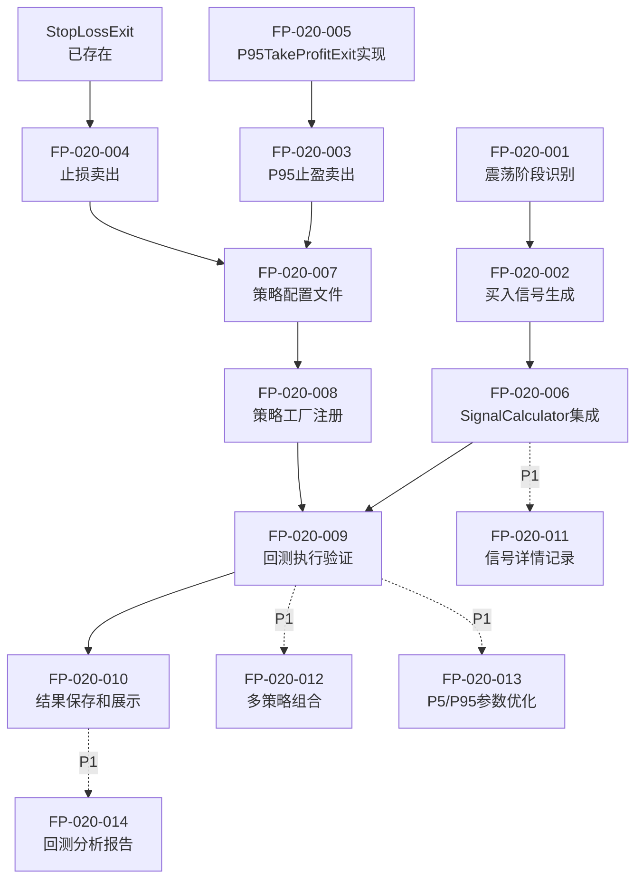

# 功能点清单 - 策略6：震荡区间突破策略

**项目名称**: DDPS-Z量化交易系统
**迭代编号**: 020
**策略编号**: 策略6
**文档版本**: v1.0.0
**创建日期**: 2026-01-07
**关联PRD**: `docs/iterations/020-consolidation-range-strategy/prd.md`

---

## 功能点总览

| 编号 | 功能点名称 | 优先级 | 状态 | 复杂度 | 依赖项 |
|------|-----------|--------|------|--------|--------|
| FP-020-001 | 震荡阶段识别 | P0 | 待开发 | 低 | BetaCycleCalculator |
| FP-020-002 | 买入信号生成（P5触发） | P0 | 待开发 | 低 | FP-020-001 |
| FP-020-003 | P95止盈卖出信号 | P0 | 待开发 | 中 | P95TakeProfitExit |
| FP-020-004 | 止损卖出信号 | P0 | 待开发 | 低 | StopLossExit |
| FP-020-005 | P95TakeProfitExit实现 | P0 | 待开发 | 中 | IExitCondition |
| FP-020-006 | SignalCalculator集成 | P0 | 待开发 | 中 | FP-020-001~004 |
| FP-020-007 | 策略配置文件 | P0 | 待开发 | 低 | - |
| FP-020-008 | 策略工厂注册 | P0 | 待开发 | 低 | - |
| FP-020-009 | 回测执行验证 | P0 | 待开发 | 低 | FP-020-001~008 |
| FP-020-010 | 结果保存和展示 | P0 | 待开发 | 低 | 回测系统 |
| FP-020-011 | 信号详情记录 | P1 | 待开发 | 低 | - |
| FP-020-012 | 多策略组合运行 | P1 | 待开发 | 中 | - |
| FP-020-013 | P5/P95参数优化 | P1 | 待开发 | 高 | FP-020-009 |
| FP-020-014 | 回测分析报告 | P1 | 待开发 | 中 | FP-020-009 |

---

## P0功能点详细说明（MVP必备）

### FP-020-001: 震荡阶段识别

**功能描述**: 使用BetaCycleCalculator判断当前K线所处的市场阶段，仅在震荡期（consolidation）触发策略。

**验收标准**:
- [ ] 能够正确调用BetaCycleCalculator获取cycle_phases
- [ ] 正确判断`cycle_phase == 'consolidation'`
- [ ] 非震荡期（bull_warning, bull_strong, bear_warning, bear_strong）不触发策略
- [ ] 日志记录周期状态识别结果

**技术实现**:
```python
# 在SignalCalculator.calculate()中
cycle_calculator = BetaCycleCalculator()
cycle_phases, _ = cycle_calculator.calculate(
    beta_list=beta_series.tolist(),
    timestamps=timestamps,
    prices=prices,
    interval_hours=4.0
)
```

**依赖项**:
- BetaCycleCalculator（已存在）
- β序列计算（已存在）

**复杂度**: 低（复用现有组件）
**预计工时**: 0.5小时

---

### FP-020-002: 买入信号生成（P5触发）

**功能描述**: 在震荡阶段，当K线最低价触及P5阈值时生成买入信号，使用收盘价成交。

**验收标准**:
- [ ] 前置条件检查：`cycle_phase == 'consolidation'`
- [ ] 主条件检查：`kline['low'] <= P5`
- [ ] 两条件同时满足时生成买入信号
- [ ] 信号包含：timestamp, kline_index, price=close, direction='long'
- [ ] 信号原因说明：包含cycle_phase和P5值

**技术实现**:
```python
def _calculate_strategy6(self, kline, p5, cycle_phase):
    if cycle_phase != 'consolidation':
        return {'triggered': False}

    low = float(kline['low'])
    close = float(kline['close'])

    if low <= p5:
        return {
            'id': 'strategy_6',
            'name': '震荡区间突破',
            'triggered': True,
            'reason': f'震荡期价格触及P5支撑位 (${p5:,.2f})',
            'details': {
                'cycle_phase': cycle_phase,
                'p5': p5,
                'current_low': low,
                'buy_price': close
            }
        }
```

**依赖项**:
- FP-020-001（震荡阶段识别）
- P5序列计算（已存在）

**复杂度**: 低
**预计工时**: 1小时

---

### FP-020-003: P95止盈卖出信号

**功能描述**: 持仓期间，当K线最高价触及P95时触发卖出，使用收盘价成交。

**验收标准**:
- [ ] 检查是否有持仓订单
- [ ] 触发条件：`kline['high'] >= P95`
- [ ] 成交价格使用`kline['close']`
- [ ] 返回ExitSignal，包含timestamp, price, reason
- [ ] 优先级设置为9（高于止损）

**技术实现**:
```python
class P95TakeProfitExit(IExitCondition):
    def check(self, order, kline, indicators, current_timestamp):
        p95 = indicators.get('p95')
        if p95 is None:
            return None

        high = Decimal(str(kline['high']))
        close = Decimal(str(kline['close']))

        if high >= p95:
            return ExitSignal(
                timestamp=current_timestamp,
                price=close,
                reason=f\"P95止盈触发 (${p95:,.2f})\",
                exit_type=self.get_type()
            )

    def get_type(self):
        return \"p95_take_profit\"

    def get_priority(self):
        return 9  # 高于止损的10
```

**依赖项**:
- FP-020-005（P95TakeProfitExit实现）
- P95序列计算（已存在）

**复杂度**: 中（需新建exit condition类）
**预计工时**: 1.5小时

---

### FP-020-004: 止损卖出信号

**功能描述**: 持仓期间，使用收盘价计算亏损率，当亏损达到-5%时触发止损。

**验收标准**:
- [ ] 检查是否有持仓订单
- [ ] 亏损率计算：`(开仓价 - 收盘价) / 开仓价`
- [ ] 触发条件：`loss_rate > 5%`
- [ ] 成交价格使用`kline['close']`
- [ ] 返回ExitSignal，包含timestamp, price, reason
- [ ] 优先级设置为10

**技术实现**:
```python
# 在配置文件中
{
  "exits": [
    {
      "type": "p95_take_profit",
      "params": {},
      "description": "P95止盈"
    },
    {
      "type": "stop_loss",
      "params": {"percentage": 5},
      "description": "5%止损"
    }
  ]
}
```

**依赖项**:
- StopLossExit（已存在，Bug-024已修复）

**复杂度**: 低（复用现有组件）
**预计工时**: 0.5小时（配置即可）

---

### FP-020-005: P95TakeProfitExit实现

**功能描述**: 实现P95止盈出场条件类，检查高价触及P95，返回收盘价成交。

**验收标准**:
- [ ] 继承IExitCondition基类
- [ ] 实现check方法，检查`kline['high'] >= P95`
- [ ] 返回ExitSignal使用`kline['close']`作为成交价
- [ ] 实现get_type方法，返回"p95_take_profit"
- [ ] 实现get_priority方法，返回9
- [ ] 单元测试覆盖正常触发和不触发场景

**技术实现**:
- 文件路径：`strategy_adapter/exits/p95_take_profit.py`
- 类名：`P95TakeProfitExit`
- 参考：`strategy_adapter/exits/stop_loss.py`

**依赖项**:
- IExitCondition基类（已存在）
- ExitSignal数据类（已存在）

**复杂度**: 中
**预计工时**: 2小时（包含单元测试）

---

### FP-020-006: SignalCalculator集成

**功能描述**: 在SignalCalculator中新增`_calculate_strategy6`方法，集成策略6的信号计算逻辑。

**验收标准**:
- [ ] 新增`_calculate_strategy6`方法
- [ ] 在`calculate`方法中增加对`enabled_strategies`包含6的处理
- [ ] 复用cycle_phases计算逻辑（已在策略4中实现）
- [ ] 返回long_signals列表，包含策略6信号
- [ ] 日志记录：信号计算完成，发现N个买入点
- [ ] 与现有策略1-5的信号格式保持一致

**技术实现**:
```python
# 在SignalCalculator.calculate()中
if 6 in enabled_strategies:
    strategy6_result = self._calculate_strategy6(
        kline=kline,
        p5=p5_series[i],
        cycle_phase=cycle_phases[i] if cycle_phases else None
    )

    if strategy6_result and strategy6_result.get('triggered'):
        signal = {
            'timestamp': timestamp,
            'kline_index': i,
            'strategies': [strategy6_result],
            'price': float(kline['close']),
            'direction': 'long',
            'buy_price': float(kline['close'])
        }
        long_signals.append(signal)
```

**依赖项**:
- FP-020-001（震荡阶段识别）
- FP-020-002（买入信号生成）

**复杂度**: 中
**预计工时**: 2小时

---

### FP-020-007: 策略配置文件

**功能描述**: 创建策略6的JSON配置文件，定义策略参数、出场条件、回测设置。

**验收标准**:
- [ ] 文件路径：`strategy_adapter/configs/strategy6_consolidation_range.json`
- [ ] 策略ID：`strategy_6`
- [ ] 策略名称：`策略6-震荡区间突破`
- [ ] 启用策略：`[6]`
- [ ] 出场条件：P95止盈 + 5%止损
- [ ] 回测参数：ETH/USDT, 2025-01-01至2026-01-07, 4h, 初始资金10000
- [ ] 手续费：0.1%，滑点：0.05%

**技术实现**:
```json
{
  "strategy_id": "strategy_6",
  "strategy_name": "策略6-震荡区间突破",
  "enabled_strategies": [6],
  "symbol": "ETHUSDT",
  "interval": "4h",
  "start_date": "2025-01-01 00:00:00",
  "end_date": "2026-01-07 23:59:59",
  "initial_capital": 10000,
  "fee_rate": 0.001,
  "slippage": 0.0005,
  "exits": [
    {
      "type": "p95_take_profit",
      "params": {},
      "description": "P95止盈"
    },
    {
      "type": "stop_loss",
      "params": {"percentage": 5},
      "description": "5%止损"
    }
  ]
}
```

**依赖项**: 无

**复杂度**: 低
**预计工时**: 0.5小时

---

### FP-020-008: 策略工厂注册

**功能描述**: 在策略工厂中注册策略6，使其能被回测系统识别和加载。

**验收标准**:
- [ ] 在`strategy_factory.py`的`_create_exit_condition`方法中注册"p95_take_profit"
- [ ] 能够根据配置文件正确创建P95TakeProfitExit实例
- [ ] 能够加载strategy6配置文件并创建回测任务

**技术实现**:
```python
# 在strategy_factory.py中
def _create_exit_condition(self, exit_config):
    exit_type = exit_config['type']
    params = exit_config.get('params', {})

    if exit_type == 'p95_take_profit':
        from strategy_adapter.exits.p95_take_profit import P95TakeProfitExit
        return P95TakeProfitExit(**params)
    # ... 其他exit condition
```

**依赖项**:
- FP-020-005（P95TakeProfitExit实现）
- FP-020-007（策略配置文件）

**复杂度**: 低
**预计工时**: 0.5小时

---

### FP-020-009: 回测执行验证

**功能描述**: 执行策略6的回测，验证信号生成、订单管理、出场条件等全流程。

**验收标准**:
- [ ] 成功执行命令：`python manage.py run_strategy_backtest --config strategy6_consolidation_range.json`
- [ ] 回测完成，无异常报错
- [ ] 日志输出：信号数量、订单数量、胜率、收益率等关键指标
- [ ] 控制台输出示例：
  ```
  策略: 策略6-震荡区间突破
  信号总数: XX
  已平仓订单: XX
  胜率: XX%
  平均盈亏: XX%
  最终权益: XX USDT
  总收益率: XX%
  ```

**依赖项**:
- FP-020-001~008（所有前置功能点）
- 回测系统（已存在）

**复杂度**: 低（集成测试）
**预计工时**: 1小时（包含问题排查）

---

### FP-020-010: 结果保存和展示

**功能描述**: 使用`--save-to-db`参数将回测结果保存到数据库，并通过Web界面查看。

**验收标准**:
- [ ] 执行命令：`python manage.py run_strategy_backtest --config strategy6_consolidation_range.json --save-to-db`
- [ ] 回测结果保存到`strategy_adapter_backtest_result`表
- [ ] 订单详情保存到`strategy_adapter_backtest_order`表
- [ ] Web界面能够查看回测结果列表
- [ ] 点击回测结果能查看订单详情
- [ ] 订单详情包含：开仓时间、平仓时间、买入价、卖出价、盈亏率、平仓原因

**依赖项**:
- FP-020-009（回测执行）
- 回测结果模型（已存在）
- Web界面（已存在）

**复杂度**: 低（复用现有功能）
**预计工时**: 0.5小时（验证）

---

## P1功能点详细说明（可推迟）

### FP-020-011: 信号详情记录

**功能描述**: 在信号详情中记录更多上下文信息，便于后续分析和优化。

**建议推迟理由**: 不影响策略核心逻辑，可在验证策略有效后补充。

**验收标准**:
- [ ] 信号详情包含：cycle_phase, p5, p95, beta, ema等技术指标
- [ ] 信号详情格式化输出，便于阅读

**预计工时**: 1小时

---

### FP-020-012: 多策略组合运行

**功能描述**: 支持策略6与其他策略（如策略1、2、4）同时运行，验证组合效果。

**建议推迟理由**: MVP仅需独立运行验证策略6本身有效性，组合运行可后续优化。

**验收标准**:
- [ ] 配置`enabled_strategies: [1, 2, 6]`能正常运行
- [ ] 信号不冲突，订单管理正确
- [ ] 结果能区分各策略的贡献

**预计工时**: 2小时

---

### FP-020-013: P5/P95参数优化

**功能描述**: 针对震荡行情调整P5/P95计算窗口，提高信号质量。

**建议推迟理由**: 属于过早优化，应先验证默认参数下的策略效果。

**验收标准**:
- [ ] 支持配置P5/P95计算窗口（如30天、60天、90天）
- [ ] 回测对比不同窗口参数的收益率和胜率
- [ ] 找到最优窗口参数

**预计工时**: 4小时（包含多次回测对比）

---

### FP-020-014: 回测分析报告

**功能描述**: 详细分析策略6的回测表现，生成分析报告文档。

**建议推迟理由**: 在回测完成后补充，不阻塞策略实现。

**验收标准**:
- [ ] 生成`docs/iterations/020-consolidation-range-strategy/backtest-analysis.md`
- [ ] 包含：信号分布、胜率、收益率、最大回撤、夏普比率等指标
- [ ] 对比策略1-5的表现
- [ ] 分析优化方向和改进建议

**预计工时**: 3小时

---

## 功能点依赖关系图



---

## 功能点实施顺序建议

### 阶段1：Exit Condition准备（约3小时）
1. FP-020-005：实现P95TakeProfitExit类
2. FP-020-008：在策略工厂注册p95_take_profit

### 阶段2：信号逻辑实现（约3.5小时）
3. FP-020-001：震荡阶段识别（复用现有代码）
4. FP-020-002：买入信号生成逻辑
5. FP-020-006：SignalCalculator集成

### 阶段3：配置和集成（约1小时）
6. FP-020-007：创建策略配置文件
7. FP-020-004：配置止损（复用StopLossExit）

### 阶段4：回测验证（约1.5小时）
8. FP-020-009：执行回测并验证
9. FP-020-010：保存结果并查看Web界面

**总预计工时**: 9小时（仅P0功能点）

---

## 质量保证检查清单

### 代码质量
- [ ] 所有新增代码符合PEP 8规范
- [ ] 使用类型注解（Type Hints）
- [ ] 添加必要的文档注释（Docstrings）
- [ ] 遵循现有代码风格和命名约定

### 测试覆盖
- [ ] P95TakeProfitExit有单元测试
- [ ] 信号计算逻辑有集成测试
- [ ] 回测执行验证通过

### 文档完整性
- [ ] PRD文档已完成
- [ ] 功能点清单已完成
- [ ] 代码注释清晰
- [ ] 回测结果可查看

### 兼容性
- [ ] 不影响现有策略1-5的运行
- [ ] 配置文件格式与现有策略保持一致
- [ ] 数据库模型无需修改

---

## 风险评估

| 风险项 | 严重程度 | 概率 | 缓解措施 |
|--------|---------|------|---------|
| P95TakeProfitExit实现错误 | 高 | 低 | 编写单元测试，参考StopLossExit实现 |
| 震荡阶段识别不准确 | 中 | 低 | 复用已验证的BetaCycleCalculator |
| 回测结果不理想 | 中 | 中 | MVP仅验证逻辑，后续优化参数 |
| 信号数量过少/过多 | 低 | 中 | 可通过调整P5/P95窗口优化（P1） |

---

## 完成定义 (Definition of Done)

策略6开发完成需满足以下标准：

### P0标准（MVP必备）
- [x] PRD文档已完成并通过Gate 1检查
- [x] 功能点清单已完成
- [ ] 所有P0功能点已实现
- [ ] 单元测试通过（P95TakeProfitExit）
- [ ] 回测成功执行，无异常报错
- [ ] 回测结果可保存到数据库
- [ ] Web界面可查看回测结果
- [ ] 代码已提交到版本控制

### P1标准（可延后）
- [ ] 信号详情记录完善
- [ ] 多策略组合运行验证
- [ ] P5/P95参数优化完成
- [ ] 回测分析报告已生成

---

**文档状态**: ✅ 已完成
**下一步**: 根据本功能点清单执行开发任务

**修订历史**:
| 版本 | 日期 | 修订内容 | 修订人 |
|------|------|---------|--------|
| v1.0.0 | 2026-01-07 | 初始版本，基于PRD生成功能点清单 | PowerBy Product Manager |
