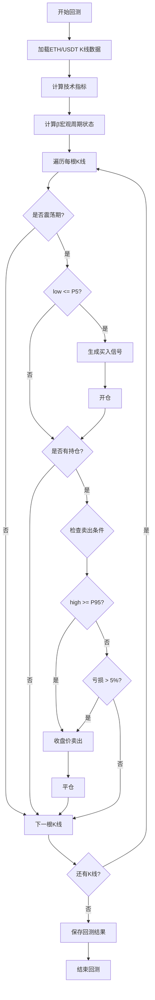

# 产品需求文档 (PRD) - 策略6：震荡区间突破策略

**项目名称**: DDPS-Z量化交易系统
**迭代编号**: 020
**策略编号**: 策略6
**文档版本**: v1.0.0
**创建日期**: 2026-01-07
**生命周期阶段**: P1 - 需求定义+澄清

---

## 第一部分：需求原始输入

### 1.1 需求背景

在现有的DDPS-Z策略体系中，策略1-4主要关注趋势性行情（做多或做空），但在市场震荡阶段，这些策略的信号质量会下降。用户希望开发一个专门针对震荡行情的策略，通过在震荡区间低买高卖的方式获取收益。

### 1.2 用户原始描述

```
新建策略6

当前k线属于震荡阶段。

买入逻辑：
P5价格买入

卖出逻辑：
1，下一个p95价格卖出
2，-5%止损卖出

请实现此策略并建立配置文件，回测2025-01-01至今的eth/usdt交易对。
```

### 1.3 核心目标

- **主要目标**：在市场震荡阶段捕捉区间波动机会，通过低买高卖获取稳定收益
- **次要目标**：补充现有策略体系，覆盖震荡行情场景
- **验证目标**：通过2025年ETH/USDT历史数据验证策略有效性

### 1.4 验收标准

1. ✅ 策略仅在震荡阶段（consolidation）触发买入信号
2. ✅ 买入触发条件：K线最低价触及P5阈值
3. ✅ 卖出触发条件1：K线最高价触及P95阈值，使用收盘价成交
4. ✅ 卖出触发条件2：亏损达到-5%时止损
5. ✅ 回测时间范围：2025-01-01 至 2026-01-07（约372天）
6. ✅ 回测交易对：ETH/USDT
7. ✅ 回测结果可保存到数据库并通过Web界面查看

---

## 第二部分：功能规格框架

### 模块一：功能定义与拆解

#### 2.1 震荡阶段识别

**功能描述**：
通过β宏观周期状态机（BetaCycleCalculator）实时判断当前K线所处的市场阶段，仅在震荡期（consolidation）触发策略。

**业务规则**：
- 震荡期定义：`cycle_phase == 'consolidation'`
- 非震荡期包括：bull_warning, bull_strong, bear_warning, bear_strong
- 使用现有的BetaCycleCalculator组件，基于β序列和阈值进行判断

**用户故事**：
> 作为交易策略，我需要准确识别震荡阶段，以便只在合适的市场环境下进行区间交易，避免在趋势行情中逆势操作。

#### 2.2 买入信号生成

**功能描述**：
当满足震荡阶段前置条件时，监控K线最低价是否触及P5阈值，触及时生成买入信号。

**触发条件**：
- 前置条件：`cycle_phase == 'consolidation'`
- 主条件：`kline['low'] <= P5`

**成交价格**：
- 使用K线收盘价（`kline['close']`）作为买入成交价

**业务规则**：
- P5阈值来自现有的偏离率百分位数计算
- 每根K线仅生成一次买入信号（如果满足条件）
- 买入信号包含时间戳、K线索引、成交价格等信息

**用户故事**：
> 作为交易策略，当市场处于震荡期且价格触及P5支撑位时，我需要生成买入信号，以便在低位建仓。

#### 2.3 卖出信号生成 - P95目标位

**功能描述**：
持仓期间，监控K线最高价是否触及P95阈值，触及时生成卖出信号，实现区间高位止盈。

**触发条件**：
- 持有多仓订单
- `kline['high'] >= P95`

**成交价格**：
- 使用K线收盘价（`kline['close']`）作为卖出成交价
- 说明：虽然最高价触及P95，但为保守起见使用收盘价成交，更符合回测合理性

**业务规则**：
- P95阈值来自现有的偏离率百分位数计算
- P95目标位优先级高于止损（通过exit condition priority控制）
- 每根K线仅生成一次卖出信号（如果满足条件）

**用户故事**：
> 作为交易订单，当价格触及P95压力位时，我需要及时止盈离场，锁定震荡区间的收益。

#### 2.4 卖出信号生成 - 止损保护

**功能描述**：
持仓期间，使用收盘价计算实际亏损率，当亏损达到-5%时触发止损卖出，保护本金安全。

**触发条件**：
- 持有多仓订单
- 亏损率 = `(开仓价 - 收盘价) / 开仓价 > 5%`

**成交价格**：
- 使用K线收盘价（`kline['close']`）作为止损成交价

**业务规则**：
- 复用现有的StopLossExit组件（Bug-024已修复，支持做多/做空）
- 止损优先级：P95止盈 > 止损（通过priority=10控制）
- 止损比例固定为5%

**用户故事**：
> 作为交易订单，当亏损达到-5%时，我需要立即止损离场，避免在震荡失败后产生更大亏损。

#### 2.5 策略配置管理

**功能描述**：
提供JSON配置文件，定义策略参数、出场条件、回测设置等。

**配置内容**：
- 策略ID和名称
- 启用的策略编号（仅策略6）
- 出场条件配置（P95止盈 + 5%止损）
- 回测参数（初始资金、手续费、滑点等）
- 数据源配置（交易对、时间范围、K线周期）

**配置文件路径**：
- `strategy_adapter/configs/strategy6_consolidation_range.json`

**用户故事**：
> 作为开发者，我需要通过配置文件灵活调整策略参数和回测设置，而无需修改代码。

#### 2.6 回测验证

**功能描述**：
使用策略适配器系统对策略6进行历史数据回测，评估策略表现。

**回测参数**：
- 交易对：ETH/USDT
- 时间范围：2025-01-01 00:00:00 至 2026-01-07 23:59:59
- K线周期：4小时（与现有策略保持一致）
- 初始资金：10000 USDT
- 手续费率：0.1%
- 滑点：0.05%

**回测指标**：
- 信号数量（买入信号总数）
- 已平仓订单数量
- 胜率（盈利订单数 / 总订单数）
- 平均盈亏率
- 最大盈利/最大亏损
- 最终权益
- 总收益率

**用户故事**：
> 作为产品经理，我需要看到策略6在2025年ETH行情中的回测表现，以评估策略是否值得实盘应用。

### 模块二：交互流程与规则

#### 2.7 策略执行流程



#### 2.8 信号生成规则

**买入信号生成**：
1. 前置条件检查：`cycle_phase == 'consolidation'`
2. 主条件检查：`kline['low'] <= P5`
3. 两条件同时满足时，生成买入信号
4. 信号包含：timestamp, kline_index, price, direction='long', strategy='strategy_6'

**卖出信号生成**：
1. 检查是否有持仓订单
2. 优先检查P95止盈条件：`kline['high'] >= P95`
3. 其次检查止损条件：`loss_rate > 5%`
4. 任一条件满足时，生成卖出信号并平仓

**订单管理规则**：
- 同一时刻只持有一个订单
- 订单包含：open_price, open_time, direction, quantity, strategy_id
- 平仓后计算盈亏并记录

### 模块三：范围边界

#### In-Scope（包含范围）

✅ **核心功能**：
- 震荡阶段识别（基于BetaCycleCalculator）
- 买入信号生成（P5触发）
- 卖出信号生成（P95止盈 + 5%止损）
- 策略配置文件
- 回测验证（ETH/USDT 2025-01-01至今）

✅ **复用现有组件**：
- BetaCycleCalculator：周期状态识别
- SignalCalculator框架：信号计算集成
- StopLossExit：止损逻辑
- Backtest系统：回测执行和结果保存

✅ **文档和配置**：
- PRD文档
- 功能点清单
- 策略配置JSON
- 回测结果报告

#### Out-of-Scope（不包含范围）

❌ **延期功能**：
- 动态调整P5/P95阈值
- 多时间周期联合判断
- 仓位管理和资金分配优化
- 实盘交易集成
- 其他交易对的回测验证
- Web界面的策略配置功能

❌ **明确排除**：
- 趋势行情下的策略逻辑（已有策略1-4覆盖）
- 止盈止损比例的动态调整
- 多策略组合运行（本迭代仅实现策略6独立运行）

---

## 第三部分：AI分析与建议

### 3.1 现有能力分析报告

#### 现有功能清单

| 功能名称 | 模块 | 与新需求关联 | 复用可能性 | 备注 |
|---------|------|-------------|-----------|------|
| β宏观周期识别 | BetaCycleCalculator | 震荡阶段识别 | 高 - 直接复用 | 已在策略4中集成，可直接调用 |
| P5/P95计算 | DeviationRateCalculator | 买入/卖出阈值 | 高 - 直接复用 | 现有的百分位数计算逻辑 |
| 信号计算框架 | SignalCalculator | 策略集成 | 高 - 扩展复用 | 新增_calculate_strategy6方法 |
| 止损逻辑 | StopLossExit | 5%止损 | 高 - 直接复用 | Bug-024已修复，支持做多 |
| 回测系统 | BacktestEngine | 策略验证 | 高 - 直接复用 | 已支持配置化回测 |
| K线数据服务 | ChartDataService | 数据获取 | 高 - 直接复用 | 已支持ETH/USDT 4h K线 |

#### 复用建议

**可直接复用**：
- BetaCycleCalculator：用于震荡阶段识别
- P5/P95计算逻辑：用于买入/卖出阈值
- StopLossExit：用于-5%止损
- 回测系统：用于策略验证和结果保存
- K线数据服务：用于获取历史数据

**可扩展复用**：
- SignalCalculator：新增`_calculate_strategy6`方法，遵循现有策略方法的结构
- 配置管理：参考strategy4配置文件，创建strategy6配置

**需全新开发**：
- P95TakeProfitExit：或扩展现有TakeProfitExit以支持P95动态阈值（建议新建，以保持逻辑清晰）

#### 一致性建议

**风格参考**：
- 信号计算方法命名：遵循`_calculate_strategy{N}`模式
- 配置文件命名：遵循`strategy{N}_{description}.json`模式
- 返回值结构：遵循`{'id': ..., 'name': ..., 'triggered': ..., 'reason': ..., 'details': ...}`

**交互模式**：
- 买入/卖出触发条件判断：与策略1-4保持一致的逻辑结构
- 信号返回格式：包含timestamp, kline_index, strategies, price, direction

**注意事项**：
- 避免与策略4的前置条件冲突：策略4排除上涨区间，策略6仅在震荡期，两者可共存
- P95卖出逻辑与策略4的P95买入逻辑区分清晰：策略6是做多策略，P95作为卖出目标位

#### 集成路径建议

**优先集成**：
1. 在SignalCalculator.calculate()中，增加对enabled_strategies包含6的处理
2. 调用BetaCycleCalculator获取cycle_phases（已在策略4中实现）
3. 新增_calculate_strategy6方法，复用cycle_phase判断逻辑

**扩展策略**：
1. 创建P95TakeProfitExit类，继承IExitCondition
2. 在check方法中判断`kline['high'] >= P95`，返回ExitSignal使用close价格
3. 设置priority=9（高于止损的10，确保先检查止盈）

### 3.2 建议的MVP功能点清单

#### 📊 核心信号逻辑

- **[P0]** 震荡阶段识别：复用BetaCycleCalculator，判断`cycle_phase == 'consolidation'`
- **[P0]** 买入信号生成：在震荡期内，当`kline['low'] <= P5`时触发买入，使用close价格成交
- **[P0]** P95止盈卖出：当`kline['high'] >= P95`时触发卖出，使用close价格成交
- **[P0]** 止损卖出：复用StopLossExit，当亏损>5%时触发止损
- **[P1]** 信号原因记录：在信号详情中记录cycle_phase、P5/P95值等上下文信息（建议推迟 - 理由：不影响策略核心逻辑，可在验证阶段补充）

#### 🔧 Exit Condition实现

- **[P0]** P95TakeProfitExit类：新建exit condition，检查high >= P95，返回close价格
- **[P0]** 优先级设置：P95止盈priority=9，止损priority=10，确保先检查止盈
- **[P1]** 通用化设计：支持通过参数配置P95计算窗口（建议推迟 - 理由：MVP使用默认P95即可，后续优化）

#### ⚙️ 策略集成

- **[P0]** SignalCalculator扩展：新增`_calculate_strategy6`方法
- **[P0]** 策略配置文件：创建`strategy6_consolidation_range.json`
- **[P0]** 策略注册：在strategy_factory中注册strategy_6
- **[P1]** 策略组合运行：支持策略6与其他策略同时运行（建议推迟 - 理由：MVP仅需独立运行验证）

#### 📈 回测验证

- **[P0]** 回测执行：使用现有命令`python manage.py run_strategy_backtest --config strategy6_consolidation_range.json`
- **[P0]** 结果保存：`--save-to-db`参数保存结果到数据库
- **[P0]** 结果查看：通过Web界面查看回测订单和统计指标
- **[P1]** 对比分析：与策略1-4的收益率、胜率等指标对比（建议推迟 - 理由：先验证策略6本身有效性）

#### 📝 文档交付

- **[P0]** PRD文档：包含需求、功能规格、MVP清单
- **[P0]** 功能点清单：结构化的功能点列表，便于跟踪实现状态
- **[P1]** 回测分析报告：详细分析策略表现和优化方向（建议推迟 - 理由：在回测完成后补充）

### 3.3 待决策清单

#### 决策点 1：P95TakeProfitExit的实现方式

**逻辑阐述**：
**[为何重要]**：P95止盈是策略6的核心卖出逻辑，实现方式影响代码复用性和可维护性。
**[影响范围]**：exit condition模块、策略配置、未来其他策略是否能复用此逻辑。

**建议方案**：

**方案A：新建P95TakeProfitExit类**
- 描述：创建独立的exit condition类，专门处理P95止盈逻辑
- 实现：
  ```python
  class P95TakeProfitExit(IExitCondition):
      def check(self, order, kline, indicators, current_timestamp):
          p95 = indicators.get('p95')
          high = Decimal(str(kline['high']))
          close = Decimal(str(kline['close']))

          if high >= p95:
              return ExitSignal(
                  timestamp=current_timestamp,
                  price=close,  # 使用收盘价成交
                  reason=f"P95止盈触发 (${p95:,.2f})",
                  exit_type=self.get_type()
              )
  ```
- 优点：
  - 职责单一，易于理解和维护
  - 可被其他策略复用
  - 符合现有exit condition的设计模式
- 缺点：
  - 需要创建新文件和类
  - 略微增加代码量
- 实现复杂度：低（约0.5小时）
- 适合MVP：是

**方案B：扩展现有TakeProfitExit类**
- 描述：在现有的TakeProfitExit基础上，增加P95阈值支持
- 实现：修改TakeProfitExit构造函数，支持`threshold_type='p95'`参数
- 优点：
  - 复用现有代码，减少文件数量
  - 统一止盈逻辑管理
- 缺点：
  - 增加TakeProfitExit复杂度
  - 可能影响现有使用TakeProfitExit的策略
  - 需要修改已有代码（风险稍高）
- 实现复杂度：中（约1小时，需测试对现有策略的影响）
- 适合MVP：否（风险较高）

**⭐ 推荐方案**：方案A（新建P95TakeProfitExit类）

**推荐理由**：
1. 从MVP角度：方案A实现最快，风险最低，不影响现有代码
2. 职责单一：P95止盈逻辑独立清晰，便于未来其他策略复用
3. 可维护性：新建类不会引入对现有策略的潜在影响
4. 扩展性：如果未来需要通用化，可以在验证P95TakeProfitExit有效后再重构

#### 决策点 2：策略6是否与其他策略同时运行

**逻辑阐述**：
**[为何重要]**：影响回测配置和策略集成方式。
**[影响范围]**：配置文件设计、信号去重逻辑、订单管理复杂度。

**建议方案**：

**方案A：MVP仅独立运行策略6**
- 描述：回测时仅启用strategy_6，不与其他策略混合
- 配置示例：
  ```json
  {
    "strategy_id": "strategy_6",
    "enabled_strategies": [6]
  }
  ```
- 优点：
  - 结果清晰，容易分析策略6的独立表现
  - 实现简单，无需处理多策略冲突
  - 符合MVP快速验证原则
- 缺点：
  - 无法验证策略组合效果
- 实现复杂度：低
- 适合MVP：是

**方案B：支持与策略1-5组合运行**
- 描述：支持在同一回测中启用多个策略，验证组合收益
- 配置示例：
  ```json
  {
    "strategy_id": "multi_strategy",
    "enabled_strategies": [1, 2, 6]
  }
  ```
- 优点：
  - 可以验证策略6对整体收益的贡献
  - 更接近实盘场景
- 缺点：
  - 需要处理信号冲突（同一时刻多个策略信号）
  - 分析复杂度增加
  - 不利于单独评估策略6
- 实现复杂度：中（多策略组合已在迭代017实现，但需验证）
- 适合MVP：否（推迟到策略6验证有效后）

**⭐ 推荐方案**：方案A（MVP仅独立运行）

**推荐理由**：
1. MVP优先原则：先验证策略6本身是否有效，再考虑组合效果
2. 分析清晰度：独立运行便于评估策略表现，避免其他策略干扰
3. 实施简单：配置简单，结果易于解读
4. 迭代路径：如果策略6表现良好，可在后续迭代中加入多策略组合测试

#### 决策点 3：P5/P95的计算窗口和更新频率

**逻辑阐述**：
**[为何重要]**：P5/P95是策略6的核心阈值，计算方式影响信号质量。
**[影响范围]**：信号数量、胜率、策略稳定性。

**建议方案**：

**方案A：使用现有默认配置（推荐）**
- 描述：沿用现有策略的P5/P95计算逻辑，无需额外配置
- 参数：默认窗口、默认更新频率（需查看代码确认）
- 优点：
  - 实现最快，无需修改P5/P95计算逻辑
  - 与其他策略保持一致，便于对比
- 缺点：
  - 无法针对震荡行情优化阈值
- 实现复杂度：低（0小时）
- 适合MVP：是

**方案B：针对震荡行情调整窗口参数**
- 描述：为策略6单独配置P5/P95计算窗口，例如缩短窗口以更敏感地捕捉震荡区间
- 参数：例如使用过去30天数据计算P5/P95（而非默认的全部历史）
- 优点：
  - 更贴合震荡行情特性
  - 可能提高信号质量
- 缺点：
  - 需要修改P5/P95计算逻辑，支持动态窗口
  - 增加实现复杂度
  - 需要额外回测验证最优窗口参数
- 实现复杂度：中（约2小时）
- 适合MVP：否（过早优化）

**⭐ 推荐方案**：方案A（使用现有默认配置）

**推荐理由**：
1. MVP快速验证原则：先用默认配置验证策略逻辑是否有效
2. 避免过早优化：在确认策略方向正确后，再针对性优化参数
3. 对比基准一致：与策略1-5使用相同的P5/P95，便于横向对比
4. 迭代路径：如果回测发现信号不足或过多，可在后续迭代中调整窗口参数

### 3.4 需求澄清会话记录

#### 日期: 2026-01-07

**问题 1**：买入触发精度如何定义？
**答案**：使用K线最低价触及P5（`kline['low'] <= P5`），成交价使用收盘价。

**问题 2**：卖出时如何处理P95触发价格？
**答案**：K线最高价触及P95（`kline['high'] >= P95`）时触发卖出，但使用收盘价（`close`）作为成交价，以符合回测合理性。

**问题 3**：震荡阶段的判断是否严格？
**答案**：严格判断，仅在`cycle_phase == 'consolidation'`时触发策略，排除所有bull/bear阶段。

**问题 4**：回测时间范围确认？
**答案**：确认为2025-01-01 00:00:00 至 2026-01-07 23:59:59，约372天（包含2025全年和2026年初）。

### 3.5 覆盖度状态表

| 类别 | 状态 | 备注 |
|------|------|------|
| 功能范围与边界 | Clear ✅ | 震荡区间突破策略，买入P5，卖出P95或止损 |
| 数据模型与实体 | Clear ✅ | 复用现有Order、Signal、BacktestResult模型 |
| 交互与UX流程 | Clear ✅ | 策略执行流程明确，触发条件清晰 |
| 非功能属性 | Clear ✅ | 性能复用现有回测系统，安全性无特殊要求 |
| 集成与外部依赖 | Clear ✅ | 依赖BetaCycleCalculator、P5/P95计算、StopLossExit |
| 边界情况与失败处理 | Clear ✅ | 止损保护本金，非震荡期不触发 |
| 约束与权衡 | Clear ✅ | MVP使用默认P5/P95参数，推迟参数优化 |
| 术语一致性 | Clear ✅ | 使用DDPS-Z术语体系（P5/P95/β宏观周期） |
| 完整性信号 | Clear ✅ | 所有核心功能已定义，MVP范围明确 |
| 待办项/占位符 | Clear ✅ | 决策点已明确，推荐方案清晰 |

### 3.6 遗留问题清单

- [ ] **P5/P95计算窗口参数**：MVP使用默认配置，后续可根据回测结果优化
- [ ] **多策略组合运行**：MVP仅独立运行策略6，验证有效后考虑组合
- [ ] **回测分析报告**：回测完成后补充详细分析文档
- [ ] **实盘参数调优**：如果策略6表现良好，需进一步优化参数以适配实盘环境

---

## 附录：关键术语表

| 术语 | 定义 |
|------|------|
| **震荡阶段（consolidation）** | β宏观周期状态机定义的市场震荡期，排除bull/bear趋势阶段 |
| **P5阈值** | 偏离率分布的第5百分位数，作为支撑位指标 |
| **P95阈值** | 偏离率分布的第95百分位数，作为压力位指标 |
| **β斜率** | EMA的一阶导数，反映趋势强度和方向 |
| **BetaCycleCalculator** | β宏观周期状态机，基于β阈值识别市场阶段 |
| **StopLossExit** | 止损出场条件，支持做多/做空双向止损 |
| **MVP** | 最小可行产品，包含核心功能的最简版本 |

---

## 修订历史

| 版本 | 日期 | 修订内容 | 修订人 |
|------|------|---------|--------|
| v1.0.0 | 2026-01-07 | 初始版本，完成P1阶段需求定义+澄清 | PowerBy Product Manager |

---

**状态**: ✅ P1阶段完成，等待进入P3-P4架构设计阶段
**下一步**: 调用 `powerby-architect` skill 进行技术调研和架构设计

