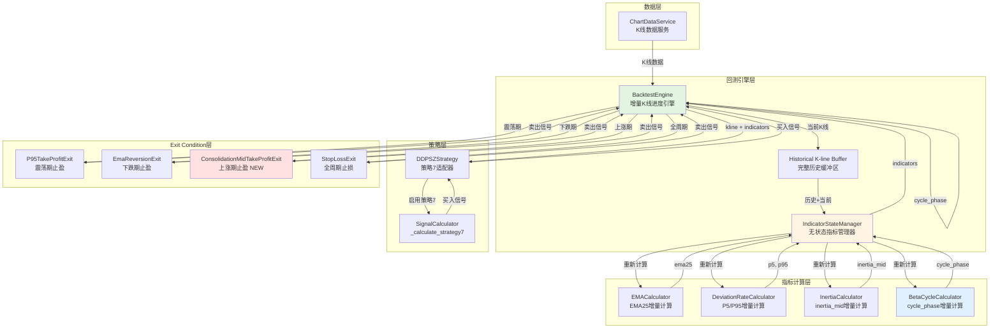
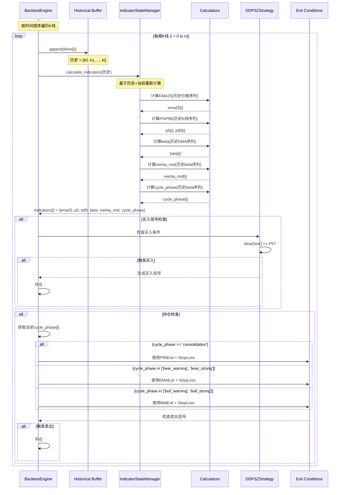

# 架构设计文档 - 策略7：动态周期自适应策略

**迭代编号**: 021
**策略编号**: 策略7
**文档版本**: v1.0.0
**创建日期**: 2026-01-07
**生命周期阶段**: P4 - 架构设计
**关联文档**:
- PRD: `docs/iterations/021-adaptive-exit-strategy/prd.md`
- 功能点清单: `docs/iterations/021-adaptive-exit-strategy/function-points.md`
- 需求澄清: `docs/iterations/021-adaptive-exit-strategy/clarifications.md`

---

## 第一部分：架构概览

### 1.1 架构目标

策略7（动态周期自适应策略）的架构设计目标：

1. **避免未来函数**：确保每根K线的指标和周期状态计算仅基于历史数据和当前K线，不使用未来数据
2. **动态Exit选择**：根据实时的市场周期状态（consolidation/bull/bear），动态选择最优的止盈策略
3. **高度复用**：最大化复用现有的Calculator、Exit Condition和回测引擎组件
4. **简单优先**：遵循MVP原则，选择最简单、最直接的实现路径
5. **性能可控**：在保证计算准确性的前提下，确保回测性能满足需求

### 1.2 核心创新点

**相比策略6的差异**：

| 维度 | 策略6 | 策略7 |
|------|------|------|
| 买入条件 | 仅震荡期 + low <= P5 | 任意周期 + low <= P5 |
| 卖出策略 | 静态P95止盈 | 动态周期自适应止盈 |
| 周期依赖 | 买入时依赖 | 持仓期间实时依赖 |
| 信号数量 | 较少 | 较多 |

**架构创新**：

1. **增量指标计算**：每根K线基于历史缓冲区重新计算所有指标，避免预计算导致的未来函数
2. **实时周期追踪**：持仓期间每根K线实时获取cycle_phase，动态切换Exit Condition
3. **无状态管理**：采用无状态的IndicatorStateManager，确保计算逻辑清晰可验证

### 1.3 系统架构图



### 1.4 增量计算流程（避免未来函数的核心）



**关键设计原则**：

1. **严格的时间顺序**：K线按时间戳严格递增顺序处理
2. **历史缓冲隔离**：每次计算指标时，只能访问`[k0, k1, ..., ki]`，不能访问`ki+1`及之后的K线
3. **重新计算策略**：每根K线都从历史缓冲区重新计算所有指标，确保无状态污染
4. **实时周期追踪**：持仓期间每根K线都重新获取cycle_phase，实现真正的动态自适应

---

## 第二部分：核心组件设计

### 2.1 IndicatorStateManager（指标状态管理器）

#### 设计目标
- 管理所有指标的增量计算
- 确保计算仅基于历史数据
- 无状态设计，每次从头计算

#### 接口设计

```python
class IndicatorStateManager:
    """
    指标状态管理器 - 无状态设计

    职责：
    - 基于历史K线缓冲区计算所有必要指标
    - 返回当前K线的指标值
    - 确保计算仅使用历史+当前数据
    """

    def __init__(self):
        """初始化各Calculator实例"""
        self.ema_calculator = EMACalculator(period=25)
        self.deviation_calculator = DeviationRateCalculator(window=500)
        self.inertia_calculator = InertiaCalculator()
        self.beta_cycle_calculator = BetaCycleCalculator()

    def calculate_indicators(
        self,
        historical_klines: List[Dict]
    ) -> Dict[str, Any]:
        """
        计算当前K线的所有指标

        Args:
            historical_klines: 从回测开始到当前K线的完整历史
                格式: [k0, k1, ..., ki]

        Returns:
            当前K线的指标字典:
            {
                'ema25': float,
                'p5': float,
                'p95': float,
                'beta': float,
                'inertia_mid': float,
                'cycle_phase': str
            }

        重要：所有计算都基于historical_klines，不访问未来数据
        """
        # 1. 提取价格序列
        prices = np.array([float(k['close']) for k in historical_klines])

        # 2. 计算EMA25序列
        ema_series = self.ema_calculator.calculate_ema_series(prices)
        current_ema = ema_series[-1]

        # 3. 计算P5/P95（基于历史K线）
        deviation_result = self.deviation_calculator.calculate(
            klines=historical_klines
        )
        current_p5 = deviation_result['p5_series'][-1]
        current_p95 = deviation_result['p95_series'][-1]

        # 4. 计算beta（EMA斜率）
        beta_series = np.full(len(ema_series), np.nan)
        for i in range(1, len(ema_series)):
            if not np.isnan(ema_series[i]) and not np.isnan(ema_series[i-1]):
                beta_series[i] = ema_series[i] - ema_series[i-1]
        current_beta = beta_series[-1]

        # 5. 计算inertia_mid（基于历史beta序列）
        inertia_result = self.inertia_calculator.calculate(
            beta_series=beta_series,
            prices=prices
        )
        current_inertia_mid = inertia_result['inertia_mid_series'][-1]

        # 6. 计算cycle_phase（基于历史beta序列）
        timestamps = [
            int(k['open_time'].timestamp() * 1000)
            if hasattr(k['open_time'], 'timestamp')
            else int(k['open_time'])
            for k in historical_klines
        ]

        cycle_phases, _ = self.beta_cycle_calculator.calculate(
            beta_list=beta_series.tolist(),
            timestamps=timestamps,
            prices=prices.tolist(),
            interval_hours=4.0
        )
        current_cycle_phase = cycle_phases[-1]

        # 7. 返回当前K线的指标
        return {
            'ema25': current_ema,
            'p5': current_p5,
            'p95': current_p95,
            'beta': current_beta,
            'inertia_mid': current_inertia_mid,
            'cycle_phase': current_cycle_phase
        }
```

#### 关键设计决策

**决策1：无状态 vs 有状态**
- **选择**：无状态设计
- **理由**：
  - 实现简单，逻辑清晰
  - 易于调试和验证
  - 无状态污染风险
  - 性能开销可接受（约2190根K线）

**决策2：完整历史 vs 滑动窗口**
- **选择**：完整历史缓冲
- **理由**：
  - 策略7回测范围约1年（2190根K线）
  - 内存占用可忽略（约1.1MB）
  - 计算准确性最高
  - 实现最简单

**决策3：预计算 vs 实时计算**
- **选择**：实时计算
- **理由**：
  - 避免未来函数（这是核心要求）
  - 符合真实交易场景
  - 确保每根K线的计算逻辑一致

#### 性能分析

**时间复杂度**：
- 每根K线：O(n)，其中n为历史K线数量
- 整个回测：O(n²)

**性能预估**（策略7回测场景）：
- K线数量：2190根
- 每根K线计算时间：约5-10ms
- 总回测时间：约11-22秒

**优化空间**（如果性能成为瓶颈）：
1. 使用lru_cache缓存中间计算结果
2. 切换到滑动窗口（window=500）
3. 引入有状态管理（保存EMA前值等）

---

### 2.2 动态Exit Condition选择机制

#### 设计目标
- 根据cycle_phase动态选择Exit Condition组合
- 保持代码简单、可读性强
- 支持未来的扩展需求

#### 实现方式

在BacktestEngine中添加`_get_exit_conditions`方法：

```python
def _get_exit_conditions(self, cycle_phase: str) -> List[IExitCondition]:
    """
    根据周期状态动态选择Exit Condition

    Args:
        cycle_phase: 当前市场周期状态
            - 'consolidation': 震荡期
            - 'bear_warning', 'bear_strong': 下跌期
            - 'bull_warning', 'bull_strong': 上涨期

    Returns:
        Exit Condition列表（按priority排序）

    策略7动态Exit规则：
    - 震荡期：P95止盈(priority=9) + 5%止损(priority=10)
    - 下跌期：EMA25回归(priority=5) + 5%止损(priority=10)
    - 上涨期：Mid止盈(priority=5) + 5%止损(priority=10)
    """
    if cycle_phase == 'consolidation':
        return [
            P95TakeProfitExit(),          # priority=9
            StopLossExit(percentage=5)     # priority=10
        ]

    elif cycle_phase in ['bear_warning', 'bear_strong']:
        return [
            EmaReversionExit(ema_period=25),  # priority=5
            StopLossExit(percentage=5)         # priority=10
        ]

    elif cycle_phase in ['bull_warning', 'bull_strong']:
        return [
            ConsolidationMidTakeProfitExit(),  # priority=5
            StopLossExit(percentage=5)          # priority=10
        ]

    else:
        # 未知周期状态：仅使用止损保护
        logger.warning(f"Unknown cycle_phase: {cycle_phase}, using stop loss only")
        return [StopLossExit(percentage=5)]
```

#### 集成到回测引擎

```python
def _check_exit_conditions(
    self,
    order: Order,
    kline: Dict,
    indicators: Dict,
    timestamp: int
) -> Optional[Dict]:
    """
    检查Exit Condition（支持动态选择）

    策略7新增逻辑：
    - 从indicators中获取当前cycle_phase
    - 动态选择对应的Exit Condition组合
    - 按priority顺序检查
    """
    # 获取当前周期状态
    current_cycle_phase = indicators.get('cycle_phase', 'consolidation')

    # 动态选择Exit Condition
    exit_conditions = self._get_exit_conditions(current_cycle_phase)

    # 按priority排序（升序，数字越小优先级越高）
    exit_conditions.sort(key=lambda x: x.get_priority())

    # 依次检查Exit Condition
    for exit_condition in exit_conditions:
        exit_signal = exit_condition.check(
            order=order,
            kline=kline,
            indicators=indicators,
            current_timestamp=timestamp
        )

        if exit_signal:
            # 记录周期切换日志
            logger.info(
                f"Exit triggered in {current_cycle_phase} phase: "
                f"{exit_condition.__class__.__name__}"
            )
            return exit_signal

    return None
```

#### 关键设计决策

**决策：内置逻辑 vs 工厂模式**
- **选择**：内置条件逻辑
- **理由**：
  - 策略7的动态规则相对固定（3种周期）
  - 实现时间：30分钟 vs 3-4小时
  - 代码可读性更强
  - 遵循YAGNI原则（You Aren't Gonna Need It）

**未来扩展计划**：
如果未来有以下情况，再重构为工厂模式：
1. 需要支持5种以上的动态Exit规则
2. 需要频繁调整Exit策略（不改代码）
3. 有3个以上策略使用类似的动态Exit逻辑

---

### 2.3 ConsolidationMidTakeProfitExit（新增组件）

#### 设计目标
- 实现上涨期止盈逻辑：`high >= (P95 + inertia_mid) / 2`
- 复用现有Exit Condition框架
- 遵循统一的接口规范

#### 接口实现

```python
from decimal import Decimal
from typing import Dict, Optional
from strategy_adapter.interfaces import IExitCondition, ExitSignal
import logging

logger = logging.getLogger(__name__)


class ConsolidationMidTakeProfitExit(IExitCondition):
    """
    震荡中值止盈Exit Condition（上涨期使用）

    触发条件：
        kline['high'] >= (P95 + inertia_mid) / 2

    成交价格：
        kline['close']（收盘价成交）

    适用场景：
        策略7 - 上涨期（bull_warning, bull_strong）

    优先级：
        priority = 5（与EmaReversionExit一致）

    关联文档：
        - PRD: docs/iterations/021-adaptive-exit-strategy/prd.md
        - 决策点2：上涨期止盈的mid定义为inertia_mid
    """

    def __init__(self):
        """初始化震荡中值止盈Exit Condition"""
        pass

    def check(
        self,
        order: 'Order',
        kline: Dict,
        indicators: Dict,
        current_timestamp: int
    ) -> Optional[ExitSignal]:
        """
        检查是否触发震荡中值止盈

        Args:
            order: 持仓订单
            kline: 当前K线数据（必须包含'high', 'close'）
            indicators: 技术指标（必须包含'p95', 'inertia_mid'）
            current_timestamp: 当前时间戳（毫秒）

        Returns:
            ExitSignal或None

        Raises:
            KeyError: 当indicators缺少必要指标时抛出
            ValueError: 当指标值为NaN时抛出
        """
        # Guard Clause: 验证indicators包含必要字段
        required_indicators = ['p95', 'inertia_mid']
        for indicator in required_indicators:
            if indicator not in indicators:
                raise KeyError(
                    f"indicators缺少必要指标: '{indicator}'。\\n"
                    f"可用指标: {list(indicators.keys())}\\n"
                    f"请确保IndicatorStateManager已计算p95和inertia_mid。"
                )

        # 提取指标和价格
        high = Decimal(str(kline['high']))
        close = Decimal(str(kline['close']))
        p95 = Decimal(str(indicators['p95']))
        inertia_mid = Decimal(str(indicators['inertia_mid']))

        # Guard Clause: 检查指标有效性
        if p95.is_nan() or inertia_mid.is_nan():
            logger.debug(
                f"指标值为NaN，跳过震荡中值止盈检查: "
                f"p95={p95}, inertia_mid={inertia_mid}"
            )
            return None

        # 计算阈值：(P95 + inertia_mid) / 2
        threshold = (p95 + inertia_mid) / Decimal('2')

        # 检查触发条件
        if high >= threshold:
            logger.info(
                f"订单 {order.id} 触发震荡中值止盈: "
                f"high={high}, threshold={threshold} "
                f"(P95={p95}, inertia_mid={inertia_mid})"
            )

            return ExitSignal(
                timestamp=current_timestamp,
                price=close,  # 使用收盘价成交
                reason='震荡中值止盈',
                exit_type='consolidation_mid_take_profit',
                metadata={
                    'p95': float(p95),
                    'inertia_mid': float(inertia_mid),
                    'threshold': float(threshold),
                    'high': float(high)
                }
            )

        return None

    def get_priority(self) -> int:
        """
        返回优先级

        Returns:
            5（与EmaReversionExit一致，高于P95的9和StopLoss的10）
        """
        return 5
```

#### 单元测试设计

```python
import pytest
from decimal import Decimal
from strategy_adapter.exits.consolidation_mid_take_profit import ConsolidationMidTakeProfitExit
from strategy_adapter.models import Order

class TestConsolidationMidTakeProfitExit:
    """ConsolidationMidTakeProfitExit单元测试"""

    def test_trigger_when_high_equals_threshold(self):
        """测试：high等于阈值时触发止盈"""
        exit_condition = ConsolidationMidTakeProfitExit()

        order = Order(
            id='test_order',
            open_price=Decimal('2000'),
            open_timestamp=1000000,
            direction='long',
            quantity=Decimal('0.1')
        )

        kline = {
            'high': 2500,
            'close': 2480
        }

        indicators = {
            'p95': 2400,
            'inertia_mid': 2600
        }

        # threshold = (2400 + 2600) / 2 = 2500
        # high = 2500 >= threshold → 触发

        result = exit_condition.check(
            order=order,
            kline=kline,
            indicators=indicators,
            current_timestamp=2000000
        )

        assert result is not None
        assert result.reason == '震荡中值止盈'
        assert result.price == Decimal('2480')

    def test_not_trigger_when_high_below_threshold(self):
        """测试：high低于阈值时不触发"""
        exit_condition = ConsolidationMidTakeProfitExit()

        order = Order(id='test_order', open_price=Decimal('2000'))

        kline = {
            'high': 2499,
            'close': 2480
        }

        indicators = {
            'p95': 2400,
            'inertia_mid': 2600
        }

        # threshold = 2500, high = 2499 < threshold → 不触发

        result = exit_condition.check(
            order=order,
            kline=kline,
            indicators=indicators,
            current_timestamp=2000000
        )

        assert result is None

    def test_raise_error_when_missing_indicator(self):
        """测试：缺少必要指标时抛出异常"""
        exit_condition = ConsolidationMidTakeProfitExit()

        order = Order(id='test_order', open_price=Decimal('2000'))
        kline = {'high': 2500, 'close': 2480}
        indicators = {'p95': 2400}  # 缺少inertia_mid

        with pytest.raises(KeyError) as exc_info:
            exit_condition.check(
                order=order,
                kline=kline,
                indicators=indicators,
                current_timestamp=2000000
            )

        assert 'inertia_mid' in str(exc_info.value)

    def test_priority(self):
        """测试：优先级为5"""
        exit_condition = ConsolidationMidTakeProfitExit()
        assert exit_condition.get_priority() == 5
```

---

### 2.4 SignalCalculator扩展（_calculate_strategy7）

#### 设计目标
- 新增策略7的买入信号生成逻辑
- 复用现有的SignalCalculator框架
- 与策略1-6保持一致的接口和格式

#### 实现代码

在`ddps_z/calculators/signal_calculator.py`中新增：

```python
def _calculate_strategy7(
    self,
    kline: Dict,
    p5: float
) -> Dict[str, Any]:
    """
    计算策略7: 动态周期自适应策略买入信号

    触发条件:
        - K线low <= P5（无周期前置条件）

    与策略6的差异:
        - 策略6: consolidation AND low <= P5（仅震荡期）
        - 策略7: low <= P5（任意周期）

    Args:
        kline: K线数据，必须包含'low', 'close'
        p5: 当前P5阈值

    Returns:
        策略7触发信息字典:
        {
            'id': 'strategy_7',
            'name': '动态周期自适应',
            'triggered': bool,
            'reason': str (如果触发),
            'details': dict (如果触发)
        }

    关联文档:
        - PRD: docs/iterations/021-adaptive-exit-strategy/prd.md
        - 决策点1：买入触发无周期前置条件
    """
    low = float(kline['low'])
    close = float(kline['close'])

    # 跳过无效数据
    if np.isnan(p5):
        return {
            'id': 'strategy_7',
            'name': '动态周期自适应',
            'triggered': False,
        }

    # 判断触发条件：low <= P5（无周期前置条件）
    if low <= p5:
        return {
            'id': 'strategy_7',
            'name': '动态周期自适应',
            'triggered': True,
            'reason': f"价格触及P5支撑位 (${p5:,.2f})",
            'details': {
                'p5': p5,
                'current_low': low,
                'buy_price': close,
            }
        }

    return {
        'id': 'strategy_7',
        'name': '动态周期自适应',
        'triggered': False,
    }
```

#### 集成到calculate()方法

在`SignalCalculator.calculate()`中新增：

```python
# 在enabled_strategies检查后添加
if 7 in enabled_strategies:
    strategy7_result = self._calculate_strategy7(
        kline=kline,
        p5=p5_series[i]
    )

# 在long_triggered判断中添加
long_triggered = (
    (strategy1_result and strategy1_result.get('triggered', False)) or
    (strategy2_result and strategy2_result.get('triggered', False)) or
    (strategy6_result and strategy6_result.get('triggered', False)) or
    (strategy7_result and strategy7_result.get('triggered', False))  # 新增
)

# 在strategies列表中添加
if long_triggered:
    strategies = []
    if strategy1_result:
        strategies.append(strategy1_result)
    if strategy2_result:
        strategies.append(strategy2_result)
    if strategy6_result:
        strategies.append(strategy6_result)
    if strategy7_result:  # 新增
        strategies.append(strategy7_result)
```

---

### 2.5 DDPSZAdapter集成

#### 修改内容

在`strategy_adapter/adapters/ddpsz_adapter.py`中修改：

**Line 172（guard clause）**：
```python
# 修改前
if not any(s in self.enabled_strategies for s in [1, 2, 6]):
    logger.debug(f"未启用做多策略(1,2,6)，跳过买入信号生成")
    return []

# 修改后
if not any(s in self.enabled_strategies for s in [1, 2, 6, 7]):
    logger.debug(f"未启用做多策略(1,2,6,7)，跳过买入信号生成")
    return []
```

**Line 204（策略过滤）**：
```python
# 修改前
long_strategies = [s for s in self.enabled_strategies if s in [1, 2, 6]]

# 修改后
long_strategies = [s for s in self.enabled_strategies if s in [1, 2, 6, 7]]
```

**文档注释更新**：
```python
"""
DDPS-Z策略适配器

策略说明：
- 策略1: EMA斜率未来预测做多
- 策略2: 惯性下跌中值突破做多
- 策略3: EMA斜率未来预测做空
- 策略4: 惯性上涨中值突破做空
- 策略6: 震荡区间突破做多
- 策略7: 动态周期自适应做多（NEW）
"""
```

---

## 第三部分：配置文件设计

### 3.1 策略配置文件

**文件路径**: `strategy_adapter/configs/strategy7_adaptive_exit.json`

```json
{
  "project_name": "策略7-动态周期自适应",
  "description": "根据市场周期实时切换止盈策略：震荡期P95止盈、下跌期EMA25回归、上涨期Mid止盈",
  "version": "1.0",
  "created_at": "2026-01-07",
  "iteration": "021",

  "backtest_config": {
    "symbol": "ETHUSDT",
    "interval": "4h",
    "market_type": "futures",
    "start_date": "2025-01-01",
    "end_date": "2026-01-07",
    "initial_cash": 10000,
    "commission_rate": 0.001
  },

  "capital_management": {
    "mode": "shared",
    "position_size_mode": "fixed",
    "position_size": 100,
    "max_positions": 10
  },

  "strategies": [
    {
      "id": "strategy_7",
      "name": "动态周期自适应",
      "type": "ddps-z",
      "enabled": true,
      "entry": {
        "strategy_id": 7,
        "description": "价格触及P5支撑位（任意周期）"
      },
      "exits": {
        "description": "根据周期动态选择Exit Condition（由BacktestEngine实现）",
        "note": "动态Exit逻辑在BacktestEngine._get_exit_conditions()中实现",
        "rules": {
          "consolidation": [
            "P95TakeProfitExit (priority=9)",
            "StopLossExit (percentage=5, priority=10)"
          ],
          "bear": [
            "EmaReversionExit (ema_period=25, priority=5)",
            "StopLossExit (percentage=5, priority=10)"
          ],
          "bull": [
            "ConsolidationMidTakeProfitExit (priority=5)",
            "StopLossExit (percentage=5, priority=10)"
          ]
        }
      }
    }
  ]
}
```

**注意事项**：

1. **Exit配置仅作文档说明**：实际的Exit Condition选择逻辑在`BacktestEngine._get_exit_conditions()`中硬编码
2. **无需exit_factory解析**：配置文件的exits字段仅用于说明规则，不用于运行时解析
3. **未来扩展路径**：如果需要配置驱动，可以引入exit_factory机制

---

## 第四部分：实施计划

### 4.1 功能点映射

| 功能点ID | 功能点名称 | 对应组件 | 预计工时 | 依赖项 |
|---------|----------|---------|---------|--------|
| FP-021-001 | 创建ConsolidationMidTakeProfitExit | 新建`consolidation_mid_take_profit.py` | 1h | 无 |
| FP-021-002 | 注册到Exit Factory | 修改`exits/__init__.py` | 0.5h | FP-021-001 |
| FP-021-003 | 新增_calculate_strategy7 | 修改`signal_calculator.py` | 1.5h | 无 |
| FP-021-004 | 集成到SignalCalculator | 修改`signal_calculator.py` | 1h | FP-021-003 |
| FP-021-005 | 扩展回测引擎支持增量计算 | 新建`IndicatorStateManager`，修改`backtest_engine.py` | 2h | 无 |
| FP-021-006 | 实现动态Exit选择逻辑 | 修改`backtest_engine.py` | 2h | FP-021-001, FP-021-005 |
| FP-021-007 | 创建配置文件 | 新建`strategy7_adaptive_exit.json` | 0.5h | 无 |
| FP-021-008 | 注册到DDPSZAdapter | 修改`ddpsz_adapter.py` | 0.5h | FP-021-004 |
| FP-021-009 | 执行回测 | 运行回测命令 | 1h | FP-021-001~008 |
| FP-021-010 | 分析回测结果 | 数据分析脚本 | 1h | FP-021-009 |

**总计**：约10小时（P0功能）

### 4.2 实施顺序建议

**第1天**（约4小时）：
1. FP-021-001: 创建ConsolidationMidTakeProfitExit（1h）
2. FP-021-002: 注册到Exit Factory（0.5h）
3. FP-021-003: 新增_calculate_strategy7（1.5h）
4. FP-021-004: 集成到SignalCalculator（1h）

**第2天**（约4小时）：
1. FP-021-005: 扩展回测引擎支持增量计算（2h）
   - 创建IndicatorStateManager类
   - 修改BacktestEngine以支持历史缓冲区
2. FP-021-006: 实现动态Exit选择逻辑（2h）
   - 添加_get_exit_conditions方法
   - 集成到_check_exit_conditions

**第3天**（约2小时）：
1. FP-021-007: 创建配置文件（0.5h）
2. FP-021-008: 注册到DDPSZAdapter（0.5h）
3. FP-021-009: 执行回测（1h）

**第4天**（约1小时）：
1. FP-021-010: 分析回测结果（1h）

### 4.3 关键风险与缓解措施

| 风险 | 影响 | 概率 | 缓解措施 |
|------|------|------|---------|
| IndicatorStateManager性能不佳 | 回测时间过长 | 中 | 1. 先验证正确性<br>2. 如需要再优化为有状态管理<br>3. 使用lru_cache缓存中间结果 |
| 周期频繁切换导致策略不稳定 | 收益率低于预期 | 中 | 1. 通过回测数据分析周期切换频率<br>2. 添加周期切换阈值（防抖动）<br>3. 与策略6对比分析 |
| 未来函数检测失败 | 回测结果失真 | 低 | 1. 单元测试验证增量计算<br>2. 对比不同时间窗口的指标值<br>3. 人工审查IndicatorStateManager逻辑 |
| Exit Condition优先级冲突 | 平仓逻辑错误 | 低 | 1. 单元测试覆盖所有Exit Condition<br>2. 添加日志记录触发的Exit类型<br>3. 通过回测验证平仓价格合理性 |

---

## 第五部分：质量保障

### 5.1 单元测试清单

**ConsolidationMidTakeProfitExit**：
- [ ] 测试：high等于阈值时触发止盈
- [ ] 测试：high超过阈值时触发止盈
- [ ] 测试：high低于阈值时不触发
- [ ] 测试：缺少p95指标时抛出KeyError
- [ ] 测试：缺少inertia_mid指标时抛出KeyError
- [ ] 测试：指标值为NaN时返回None
- [ ] 测试：get_priority返回5

**_calculate_strategy7**：
- [ ] 测试：low等于P5时触发买入
- [ ] 测试：low低于P5时触发买入
- [ ] 测试：low高于P5时不触发
- [ ] 测试：P5为NaN时不触发
- [ ] 测试：返回格式正确（id, name, triggered, reason, details）

**IndicatorStateManager**：
- [ ] 测试：基于空历史计算指标（初始化逻辑）
- [ ] 测试：基于单根K线计算指标
- [ ] 测试：基于完整历史计算指标
- [ ] 测试：重复调用返回一致结果（无状态验证）
- [ ] 测试：指标值的准确性（与已知正确值对比）

**动态Exit选择**：
- [ ] 测试：consolidation周期选择P95Exit + StopLoss
- [ ] 测试：bear周期选择EMAExit + StopLoss
- [ ] 测试：bull周期选择MidExit + StopLoss
- [ ] 测试：未知周期选择StopLoss
- [ ] 测试：Exit Condition按priority排序

### 5.2 集成测试清单

**端到端回测测试**：
- [ ] 测试：策略7完整回测流程（2025-01-01至今）
- [ ] 测试：生成买入信号数量 > 0
- [ ] 测试：所有订单都已平仓
- [ ] 测试：震荡期订单使用P95止盈
- [ ] 测试：下跌期订单使用EMA25回归
- [ ] 测试：上涨期订单使用Mid止盈
- [ ] 测试：所有订单都有止损保护

**未来函数验证**：
- [ ] 测试：每根K线的指标值仅依赖历史
- [ ] 测试：修改未来K线不影响历史指标
- [ ] 测试：逐K线回测 vs 批量回测结果一致

### 5.3 回归测试清单

**确保不影响现有策略**：
- [ ] 测试：策略1回测结果与历史一致
- [ ] 测试：策略2回测结果与历史一致
- [ ] 测试：策略6回测结果与历史一致
- [ ] 测试：所有现有单元测试通过

---

## 第六部分：关键决策记录

### 6.1 架构决策汇总

| 决策点 | 选择方案 | 核心理由 | 影响范围 |
|--------|---------|---------|---------|
| IndicatorStateManager实现 | 无状态管理 | MVP优先、调试友好、复用现有Calculator | IndicatorStateManager类、BacktestEngine |
| 动态Exit选择机制 | 内置条件逻辑 | 实现简单、符合YAGNI、可读性强 | BacktestEngine._get_exit_conditions() |
| 历史缓冲区管理 | 完整历史 | 计算准确、内存可控、实现最简 | BacktestEngine.historical_klines |
| 上涨期mid定义 | inertia_mid | 术语一致、动态跟踪、复用InertiaCalculator | ConsolidationMidTakeProfitExit |
| 买入周期限制 | 任意周期 | 用户明确需求、通过动态卖出控制风险 | _calculate_strategy7 |
| 周期判断时机 | 实时获取 | 策略核心价值、真正的动态自适应 | BacktestEngine._check_exit_conditions() |

### 6.2 技术约束

**必须遵守**：
1. ✅ 每根K线的指标计算仅基于历史+当前数据
2. ✅ 所有策略（1-7）使用一致的增量计算方法
3. ✅ Exit Condition接口保持向后兼容
4. ✅ 回测结果可保存到数据库
5. ✅ 配置文件遵循现有JSON格式

**可选优化**：
1. 🔄 性能优化（如使用有状态管理）
2. 🔄 配置驱动的Exit选择（工厂模式）
3. 🔄 周期切换日志分析
4. 🔄 止损比例动态调整

### 6.3 遗留问题

**技术实现问题**：
- [ ] 周期切换频率统计：通过回测数据分析周期切换对策略的影响
- [ ] Exit Condition优先级冲突：确认priority定义是否与现有Exit Condition一致

**参数调优问题**：
- [ ] 止损比例：MVP统一使用5%，后续可根据周期动态调整
- [ ] P5阈值：无周期限制可能导致信号过多，后续可调整阈值或添加过滤条件

**分析与优化问题**：
- [ ] 策略6/7对比：回测完成后进行详细对比分析
- [ ] DynamicExitManager提取：MVP在BacktestEngine中直接实现，后续可提取为独立组件
- [ ] 其他策略的未来函数检查：确保策略1-6也采用增量计算方法

---

## 第七部分：参考文档

### 7.1 关联文档

**迭代021文档**：
- PRD: `docs/iterations/021-adaptive-exit-strategy/prd.md`
- 功能点清单: `docs/iterations/021-adaptive-exit-strategy/function-points.md`
- 需求澄清: `docs/iterations/021-adaptive-exit-strategy/clarifications.md`

**参考迭代文档**：
- 迭代020 PRD: `docs/iterations/020-consolidation-range-strategy/prd.md`（策略6）
- 迭代018 PRD: `docs/iterations/018-beta-cycle-indicator/prd.md`（BetaCycleCalculator）

**代码模块**：
- SignalCalculator: `ddps_z/calculators/signal_calculator.py`
- DDPSZAdapter: `strategy_adapter/adapters/ddpsz_adapter.py`
- BacktestEngine: `strategy_adapter/core/backtest_engine.py`
- Exit Conditions: `strategy_adapter/exits/`

### 7.2 术语对照表

| 术语 | 英文 | 定义 |
|------|------|------|
| 周期状态 | cycle_phase | β宏观周期状态机定义的市场阶段 |
| 震荡期 | consolidation | 市场横盘整理阶段 |
| 上涨期 | bull_warning, bull_strong | 市场上涨趋势阶段 |
| 下跌期 | bear_warning, bear_strong | 市场下跌趋势阶段 |
| P5阈值 | P5 | 偏离率分布的第5百分位数 |
| P95阈值 | P95 | 偏离率分布的第95百分位数 |
| 惯性中值 | inertia_mid | 基于β斜率预测的未来价格中值 |
| 未来函数 | future function | 使用未来数据的计算逻辑（回测中应避免） |
| 增量计算 | incremental calculation | 基于历史数据逐步累积的计算方式 |
| 动态自适应 | dynamic adaptation | 根据市场状态实时调整策略参数 |

---

## 修订历史

| 版本 | 日期 | 修订内容 | 修订人 |
|------|------|---------|--------|
| v1.0.0 | 2026-01-07 | 初始版本，完成P4阶段架构设计 | PowerBy Architect |

---

**文档状态**: ✅ P4阶段完成
**下一步**: 进入P5阶段（任务规划），使用 `powerby-engineer` skill
